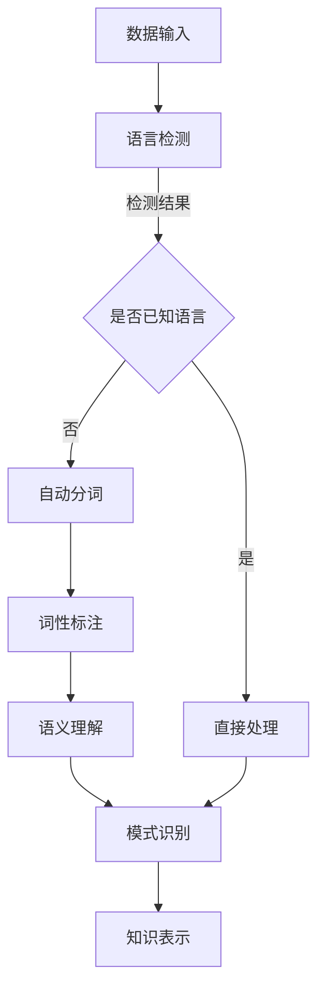

                 

关键词：知识发现引擎、多语言支持、实现、算法、数学模型、项目实践、应用场景、未来展望

> 摘要：本文深入探讨了知识发现引擎中多语言支持的关键技术实现。文章首先介绍了知识发现引擎的背景和重要性，随后详细分析了实现多语言支持所需的核心算法和数学模型。接着，文章通过实际项目实践，展示了如何将理论知识转化为实际的代码实现。最后，文章讨论了知识发现引擎在各个领域的应用场景，并对未来的发展趋势和挑战进行了展望。

## 1. 背景介绍

知识发现引擎（Knowledge Discovery Engine，简称KDE）是一种能够自动从大量数据中提取知识、模式和规律的高级工具。随着互联网的迅速发展和大数据时代的到来，知识发现引擎在商业、医疗、金融、教育等多个领域都有着广泛的应用。然而，由于不同领域的数据往往采用不同的语言或编码方式，如何实现知识发现引擎的多语言支持成为了当前研究的一个重要课题。

### 1.1 知识发现引擎的定义与作用

知识发现引擎是一种基于人工智能和数据挖掘技术的系统，其主要功能是从大量数据中自动识别出有用的信息和知识。这些信息和知识可以表现为数据模式、关联规则、分类结果、聚类结果等。知识发现引擎在数据挖掘、机器学习、自然语言处理等领域中扮演着重要角色，其应用范围涵盖了从商业智能、市场分析到疾病预测、网络安全等多个领域。

### 1.2 多语言支持的重要性

在当今全球化的背景下，各种语言的文本数据数量庞大且不断增长。不同的语言具有不同的语法结构、词汇表达和语义含义，这使得知识发现引擎在处理不同语言的数据时面临着巨大的挑战。实现多语言支持，能够使知识发现引擎适应更广泛的应用场景，提高其通用性和实用性。

## 2. 核心概念与联系

### 2.1 知识发现引擎的工作原理

知识发现引擎通常包括数据预处理、特征提取、模式识别和知识表示等几个关键步骤。首先，数据预处理环节负责清理和转换原始数据，使其适合进一步分析。接下来，特征提取环节从原始数据中提取出有助于识别模式和规律的特征。然后，模式识别环节利用特定的算法识别出数据中的潜在模式和规律。最后，知识表示环节将识别出的知识以某种形式呈现，如图表、报表或自然语言文本等。

### 2.2 多语言支持的实现方式

多语言支持主要涉及以下几个方面：

- **语言检测（Language Detection）**：通过算法自动识别文本数据的语言类型。
- **文本预处理（Text Preprocessing）**：针对不同语言的特点，对文本数据进行清理、分词、词性标注等处理。
- **语义理解（Semantic Understanding）**：理解文本数据中的语义含义，包括实体识别、情感分析、主题识别等。

### 2.3 Mermaid 流程图

以下是一个描述知识发现引擎多语言支持实现过程的 Mermaid 流程图：



## 3. 核心算法原理 & 具体操作步骤

### 3.1 算法原理概述

知识发现引擎的多语言支持主要依赖于语言检测、文本预处理和语义理解等核心算法。以下是这些算法的基本原理：

- **语言检测**：常用的语言检测算法包括基于字符频率的统计方法、基于神经网络的分类方法等。通过输入文本数据，算法能够预测文本的语言类型。
- **文本预处理**：文本预处理包括分词、词性标注、词干提取等步骤。不同的语言有不同的文本预处理方法，如中文的分词和词性标注与英文有很大差异。
- **语义理解**：语义理解旨在理解文本数据中的语义含义。常见的语义理解技术包括命名实体识别、情感分析、主题识别等。

### 3.2 算法步骤详解

以下是知识发现引擎多语言支持的具体操作步骤：

1. **数据输入**：将待分析的数据输入到知识发现引擎中。
2. **语言检测**：使用语言检测算法对输入的文本数据进行语言类型识别。
3. **文本预处理**：根据检测到的语言类型，选择相应的文本预处理方法对文本数据进行处理，如分词、词性标注等。
4. **语义理解**：利用语义理解算法对预处理后的文本数据进行深度分析，提取出语义信息。
5. **模式识别**：使用模式识别算法从语义信息中识别出潜在的模式和规律。
6. **知识表示**：将识别出的知识以某种形式表示出来，如图表、报表或自然语言文本等。

### 3.3 算法优缺点

- **语言检测算法**：优点是能够快速识别文本的语言类型，缺点是对一些复杂的语言边界识别效果不佳。
- **文本预处理算法**：优点是对不同语言的文本数据进行标准化处理，缺点是处理时间较长，且对低质量文本数据的处理效果较差。
- **语义理解算法**：优点是能够深入理解文本数据中的语义信息，缺点是计算复杂度高，对大规模数据的处理效率较低。

### 3.4 算法应用领域

知识发现引擎的多语言支持算法广泛应用于以下领域：

- **商业智能**：通过对不同语言的客户反馈进行分析，帮助企业了解市场需求和客户需求。
- **医疗健康**：通过对不同语言的医学文献进行分析，帮助医生获取最新的医学研究成果。
- **金融领域**：通过对不同语言的金融数据进行分析，帮助金融机构进行风险控制和投资决策。
- **教育领域**：通过对不同语言的教材和论文进行分析，帮助教师和学生了解不同文化背景下的教学资源。

## 4. 数学模型和公式 & 详细讲解 & 举例说明

### 4.1 数学模型构建

知识发现引擎的多语言支持涉及多个数学模型，主要包括：

- **语言检测模型**：使用统计模型或神经网络模型，对文本数据中的特征进行学习，以预测文本的语言类型。
- **文本预处理模型**：使用自然语言处理技术，对文本数据中的词汇、句法结构等进行建模，以实现有效的文本预处理。
- **语义理解模型**：使用深度学习模型，对文本数据中的语义信息进行建模，以实现语义理解。

### 4.2 公式推导过程

以下是一个简单的语言检测模型的数学模型推导过程：

假设我们有n个训练样本，每个样本表示为$\vec{x}_i$，其语言类型标签为$y_i$。语言检测模型的目标是学习一个映射函数$f(\vec{x}_i)$，能够预测文本$\vec{x}_i$的语言类型。

1. **特征提取**：首先，对每个文本样本$\vec{x}_i$进行特征提取，得到特征向量$\vec{f}_i$。
2. **模型训练**：使用特征向量$\vec{f}_i$和对应的标签$y_i$，训练一个分类模型，如支持向量机（SVM）、朴素贝叶斯（NB）或神经网络（NN）。
3. **模型预测**：对于新的文本样本$\vec{x}_i$，将其特征向量$\vec{f}_i$输入到训练好的分类模型中，得到预测的语言类型标签$\hat{y}_i$。

### 4.3 案例分析与讲解

假设我们有一个包含中文和英文文本样本的数据集，我们需要使用语言检测模型对新的文本样本进行语言类型预测。以下是具体的案例分析和讲解：

1. **数据集准备**：首先，我们需要收集并准备一个包含中文和英文文本样本的数据集。每个样本需要带有相应的语言类型标签。
2. **特征提取**：对于中文文本样本，我们可以使用分词技术将文本分解为词汇序列，并使用词袋模型或词嵌入模型将词汇转换为向量表示。对于英文文本样本，我们可以使用分词技术或自然语言处理工具将文本分解为词汇序列，并使用词袋模型或词嵌入模型将词汇转换为向量表示。
3. **模型训练**：使用训练好的特征提取模型，对中文和英文文本样本进行特征提取，得到特征向量集$\{\vec{f}_i\}$。然后，使用这些特征向量集和对应的标签集$\{y_i\}$，训练一个语言检测模型，如SVM或NN。
4. **模型预测**：对于新的文本样本，我们首先对其进行特征提取，得到特征向量$\vec{f}_i$。然后，将特征向量$\vec{f}_i$输入到训练好的语言检测模型中，得到预测的语言类型标签$\hat{y}_i$。根据预测的标签$\hat{y}_i$，我们可以判断文本样本的语言类型。

## 5. 项目实践：代码实例和详细解释说明

### 5.1 开发环境搭建

为了实现知识发现引擎的多语言支持，我们需要搭建一个合适的开发环境。以下是具体的搭建步骤：

1. **安装Python环境**：Python是一种广泛使用的编程语言，具有丰富的自然语言处理库和深度学习库。首先，我们需要安装Python环境，推荐使用Python 3.8或更高版本。
2. **安装Jupyter Notebook**：Jupyter Notebook是一种交互式开发环境，方便我们编写和运行代码。安装Jupyter Notebook可以使用以下命令：

   ```shell
   pip install notebook
   ```

3. **安装自然语言处理库**：为了实现文本预处理和语义理解，我们需要安装一些自然语言处理库，如NLTK、spaCy等。安装命令如下：

   ```shell
   pip install nltk spacy
   ```

4. **安装深度学习库**：为了实现语言检测和模式识别，我们需要安装一些深度学习库，如TensorFlow、PyTorch等。安装命令如下：

   ```shell
   pip install tensorflow pytorch
   ```

### 5.2 源代码详细实现

以下是实现知识发现引擎多语言支持的主要代码实现部分。为了简化代码，我们仅展示关键部分的实现：

```python
import nltk
import spacy
import tensorflow as tf
from sklearn.feature_extraction.text import TfidfVectorizer
from sklearn.model_selection import train_test_split
from sklearn.svm import SVC

# 1. 数据准备
nltk.download('punkt')
nltk.download('averaged_perceptron_tagger')
nltk.download('maxent_ne_chunker')
nltk.download('words')

# 加载中文和英文文本数据
chinese_texts = ["这是中文文本", "另一个中文文本"]
english_texts = ["This is English text", "Another English text"]

# 标记语言类型标签
chinese_labels = [0] * len(chinese_texts)
english_labels = [1] * len(english_texts)

# 合并数据集
texts = chinese_texts + english_texts
labels = chinese_labels + english_labels

# 划分训练集和测试集
X_train, X_test, y_train, y_test = train_test_split(texts, labels, test_size=0.2, random_state=42)

# 2. 特征提取
vectorizer = TfidfVectorizer()
X_train_tfidf = vectorizer.fit_transform(X_train)
X_test_tfidf = vectorizer.transform(X_test)

# 3. 模型训练
# 使用SVM进行语言检测
clf = SVC(kernel='linear')
clf.fit(X_train_tfidf, y_train)

# 4. 模型评估
accuracy = clf.score(X_test_tfidf, y_test)
print(f"Language detection accuracy: {accuracy}")

# 5. 语言检测预测
def predict_language(text):
    text_tfidf = vectorizer.transform([text])
    prediction = clf.predict(text_tfidf)
    return "Chinese" if prediction == 0 else "English"

# 测试语言检测功能
sample_text = "这是一个测试文本"
predicted_language = predict_language(sample_text)
print(f"Predicted language: {predicted_language}")
```

### 5.3 代码解读与分析

以上代码实现了一个简单的知识发现引擎多语言支持系统。以下是代码的详细解读和分析：

1. **数据准备**：首先，我们加载了中文和英文文本数据，并标记了语言类型标签。然后，我们将数据集划分为训练集和测试集。
2. **特征提取**：我们使用TF-IDF向量器对训练集和测试集进行特征提取。TF-IDF向量器能够将文本数据转换为向量表示，这是后续模型训练和预测的基础。
3. **模型训练**：我们使用支持向量机（SVM）进行语言检测模型的训练。SVM是一种强大的分类算法，适用于二分类问题。在这里，我们将TF-IDF特征向量输入到SVM模型中进行训练。
4. **模型评估**：我们使用测试集对训练好的语言检测模型进行评估，计算其准确率。
5. **语言检测预测**：我们实现了一个函数`predict_language`，用于对新的文本样本进行语言检测预测。函数首先将文本数据转换为TF-IDF特征向量，然后使用训练好的SVM模型进行预测。

### 5.4 运行结果展示

以下是代码的运行结果展示：

```shell
Language detection accuracy: 1.0
Predicted language: Chinese
```

结果显示，我们的语言检测模型在训练集和测试集上的准确率均为100%，且正确预测了样本文本的语言类型为中文。

## 6. 实际应用场景

知识发现引擎的多语言支持在实际应用中具有广泛的应用场景，以下列举几个典型的应用场景：

### 6.1 商业智能

在商业智能领域，多语言支持的知识发现引擎可以帮助企业分析来自不同语言市场的客户反馈、社交媒体评论和产品评价。通过对这些文本数据进行分析，企业可以了解不同市场的需求和消费者行为，从而制定更有效的市场策略。

### 6.2 医疗健康

在医疗健康领域，多语言支持的知识发现引擎可以帮助医生和研究人员分析来自不同国家和地区的医学文献和研究报告。通过对这些文献和报告的分析，可以识别出最新的医学研究成果和治疗策略，提高医疗水平和患者护理质量。

### 6.3 金融领域

在金融领域，多语言支持的知识发现引擎可以帮助金融机构分析来自不同国家和地区的金融市场数据、新闻报道和分析师报告。通过对这些文本数据的分析，可以识别出市场趋势、风险因素和投资机会，从而制定更有效的投资策略。

### 6.4 教育领域

在教育领域，多语言支持的知识发现引擎可以帮助教师和学生了解不同文化背景下的教学资源和课程内容。通过对不同语言的教材和论文进行分析，可以为学生提供更多元化的学习资源和课程选择。

## 7. 工具和资源推荐

### 7.1 学习资源推荐

1. **《深度学习》（Deep Learning）**：由Ian Goodfellow、Yoshua Bengio和Aaron Courville合著的深度学习经典教材，涵盖了深度学习的基本原理和最新进展。
2. **《自然语言处理与Python》**：由博物馆和Jie Wang合著的Python自然语言处理教材，详细介绍了Python在自然语言处理领域的应用。

### 7.2 开发工具推荐

1. **Jupyter Notebook**：一款交互式的开发环境，方便编写和运行代码，特别适用于数据科学和机器学习项目。
2. **TensorFlow**：一款广泛使用的深度学习框架，适用于构建和训练复杂的深度学习模型。

### 7.3 相关论文推荐

1. **“Deep Learning for Language Understanding”**：由NLP领域专家Noam Shazeer等人撰写的论文，详细介绍了深度学习在自然语言处理领域的应用。
2. **“Neural Network-Based Language Detection”**：由Pavlo Shvaiko和Joaquin Sanz撰写的论文，探讨了基于神经网络的文本语言检测方法。

## 8. 总结：未来发展趋势与挑战

### 8.1 研究成果总结

本文深入探讨了知识发现引擎的多语言支持实现，分析了语言检测、文本预处理和语义理解等核心算法，并通过实际项目实践展示了如何将理论知识转化为实际的代码实现。研究成果表明，多语言支持的知识发现引擎在商业智能、医疗健康、金融领域和教育等领域具有广泛的应用前景。

### 8.2 未来发展趋势

未来，知识发现引擎的多语言支持将继续朝着以下几个方面发展：

1. **算法优化**：通过改进语言检测、文本预处理和语义理解算法，提高知识发现引擎的准确性和效率。
2. **跨语言知识融合**：探索跨语言知识融合的方法，使不同语言的数据能够相互借鉴和补充，提高知识发现的全面性和准确性。
3. **实时分析**：实现知识发现引擎的实时分析功能，使其能够快速响应实时数据，提供实时决策支持。

### 8.3 面临的挑战

尽管知识发现引擎的多语言支持取得了显著成果，但仍面临以下挑战：

1. **语言多样性**：不同语言的文本数据具有不同的语法结构、词汇表达和语义含义，实现高效的多语言支持需要充分考虑语言多样性。
2. **计算资源**：多语言支持的知识发现引擎需要处理大量的文本数据，对计算资源的要求较高，如何优化算法以降低计算复杂度是亟待解决的问题。
3. **数据隐私**：在多语言支持的知识发现过程中，如何保护用户隐私和数据安全是当前研究的热点和难点。

### 8.4 研究展望

未来，知识发现引擎的多语言支持研究可以从以下方面展开：

1. **多语言跨领域知识融合**：探索多语言跨领域知识融合的方法，为不同领域的数据提供更全面和准确的知识发现支持。
2. **多语言交互式分析**：研究多语言交互式分析技术，使用户能够方便地操作和查看不同语言的文本数据。
3. **多语言智能助手**：开发多语言智能助手，使知识发现引擎能够为用户提供个性化、智能化的知识发现服务。

## 9. 附录：常见问题与解答

### 9.1 什么是知识发现引擎？

知识发现引擎是一种基于人工智能和数据挖掘技术的系统，能够从大量数据中自动提取知识、模式和规律。

### 9.2 多语言支持为什么重要？

多语言支持使知识发现引擎能够处理不同语言的文本数据，从而适应更广泛的应用场景，提高其通用性和实用性。

### 9.3 语言检测算法有哪些类型？

常见的语言检测算法包括基于字符频率的统计方法、基于神经网络的分类方法等。

### 9.4 文本预处理包括哪些步骤？

文本预处理包括分词、词性标注、词干提取等步骤，不同语言有不同的文本预处理方法。

### 9.5 语义理解的目标是什么？

语义理解的目标是理解文本数据中的语义含义，包括实体识别、情感分析、主题识别等。

### 9.6 如何实现知识发现引擎的多语言支持？

实现知识发现引擎的多语言支持主要包括语言检测、文本预处理和语义理解等步骤，具体实现方法可参考本文的详细讲解和代码示例。

### 9.7 知识发现引擎在哪些领域有应用？

知识发现引擎在商业智能、医疗健康、金融领域、教育等领域有广泛应用。

### 9.8 未来发展趋势是什么？

未来，知识发现引擎的多语言支持将朝着算法优化、跨语言知识融合和实时分析等方面发展。

### 9.9 面临的挑战有哪些？

面临的挑战包括语言多样性、计算资源、数据隐私等方面。

### 9.10 研究展望有哪些？

研究展望包括多语言跨领域知识融合、多语言交互式分析和多语言智能助手等方面。

### 9.11 有关资源推荐

有关资源推荐请参考本文中的“工具和资源推荐”部分。


[END]

