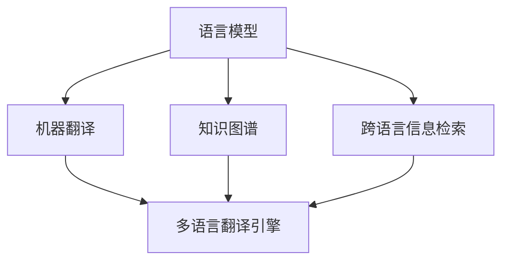

                 

随着全球化的加速，跨语言交流的需求日益增长。在这种背景下，知识发现引擎的多语言翻译功能成为了一个至关重要的工具。本文将探讨知识发现引擎的多语言翻译功能，从背景介绍、核心概念与联系、核心算法原理与操作步骤、数学模型与公式、项目实践、实际应用场景、未来展望、工具和资源推荐，以及总结和挑战等方面进行详细讨论。

## 1. 背景介绍

在当今社会，信息传播的速度和广度前所未有。互联网的普及使得全球范围内的知识交流变得更加便捷。然而，不同国家和地区的语言差异成为了跨文化交流的主要障碍。知识发现引擎的多语言翻译功能应运而生，旨在消除语言障碍，促进全球知识的传播和共享。

多语言翻译功能不仅对学术研究和学术交流至关重要，也对商业、外交、旅游、娱乐等多个领域产生了深远的影响。例如，跨国公司的全球业务需要处理大量的跨语言文档；国际组织和外交活动要求参与国之间能够无障碍沟通；旅游业的发展也需要提供多语言的服务和资讯。

## 2. 核心概念与联系

要实现知识发现引擎的多语言翻译功能，我们首先需要了解几个核心概念和它们之间的联系。

### 2.1 语言模型

语言模型是自然语言处理（NLP）中的基础，它用于预测一个词语或短语的下一个词语或短语。在多语言翻译中，语言模型有助于理解和生成不同语言之间的文本。

### 2.2 机器翻译

机器翻译（MT）是指通过计算机程序将一种语言的文本自动翻译成另一种语言。常见的机器翻译方法包括基于规则的方法、统计机器翻译（SMT）和基于神经网络的机器翻译（NMT）。

### 2.3 知识图谱

知识图谱是一种结构化数据，它将实体、属性和关系以图的形式表示。在多语言翻译中，知识图谱可以帮助识别语言中的实体和关系，从而提高翻译的准确性和一致性。

### 2.4 跨语言信息检索

跨语言信息检索（CLIR）是指在不同语言之间检索信息。它利用机器翻译和语言模型等技术，使得用户能够在不同语言资源中查找所需信息。

下面是一个Mermaid流程图，展示了多语言翻译功能的核心概念和它们之间的联系：



## 3. 核心算法原理 & 具体操作步骤

### 3.1 算法原理概述

多语言翻译功能的核心在于将一种语言的文本映射到另一种语言的文本。这一过程通常包括以下几个步骤：

1. **文本预处理**：包括分词、去停用词、词性标注等操作。
2. **语言模型训练**：使用大量平行语料库，训练源语言和目标语言的语言模型。
3. **翻译模型训练**：基于源语言和目标语言的语言模型，训练翻译模型，通常采用序列到序列（Seq2Seq）模型或注意力机制（Attention Mechanism）。
4. **翻译生成**：将源语言文本输入翻译模型，生成目标语言文本。

### 3.2 算法步骤详解

1. **文本预处理**：

    $$ 
    \text{输入：} \text{原始文本} \\
    \text{输出：} \text{预处理后的文本}
    $$
    
    预处理步骤通常包括：
    
    - 分词：将文本划分为单词或词汇单元。
    - 去停用词：去除对翻译无意义的常见词。
    - 词性标注：为每个单词分配词性标签。

2. **语言模型训练**：

    $$ 
    \text{输入：} \text{平行语料库} \\
    \text{输出：} \text{源语言语言模型} \text{和} \text{目标语言语言模型}
    $$

    语言模型训练通常采用最大似然估计（MLE）或递归神经网络（RNN）等方法。

3. **翻译模型训练**：

    $$ 
    \text{输入：} \text{预处理后的文本对} \\
    \text{输出：} \text{翻译模型}
    $$
    
    翻译模型训练主要采用序列到序列（Seq2Seq）模型，并结合注意力机制（Attention Mechanism）以提高翻译质量。

4. **翻译生成**：

    $$ 
    \text{输入：} \text{预处理后的源语言文本} \\
    \text{输出：} \text{目标语言文本}
    $$
    
    翻译生成过程包括输入文本的编码、解码和生成目标语言文本。

### 3.3 算法优缺点

**优点**：

- **高效率**：能够自动处理大规模的文本翻译任务。
- **广泛适用**：适用于多种语言的翻译。
- **实时性**：能够提供实时的翻译服务。

**缺点**：

- **翻译质量**：尽管现代翻译模型已经非常先进，但仍然难以达到人类翻译的水平。
- **语言多样性**：不同语言的复杂性和多样性使得翻译模型难以全面覆盖。
- **文化差异**：语言翻译可能无法完全保留原文的文化和语境。

### 3.4 算法应用领域

- **跨语言搜索引擎**：提供多语言搜索和翻译功能，方便用户在不同语言资源中查找信息。
- **国际商务沟通**：帮助跨国公司处理不同语言之间的文档和邮件。
- **学术研究**：促进全球学术交流，使得学术成果能够更广泛地传播。
- **旅游服务**：提供多语言导游和翻译服务，方便游客在陌生环境中交流。

## 4. 数学模型和公式 & 详细讲解 & 举例说明

### 4.1 数学模型构建

多语言翻译的数学模型主要基于概率和神经网络。以下是几个关键模型：

1. **最大似然估计（MLE）**：

    $$ 
    P(\text{目标语言} | \text{源语言}) = \frac{f(\text{目标语言}, \text{源语言})}{g(\text{源语言})}
    $$
    
    其中，$f(\text{目标语言}, \text{源语言})$ 表示联合概率分布，$g(\text{源语言})$ 表示源语言的概率分布。

2. **递归神经网络（RNN）**：

    $$ 
    h_t = \tanh(W_h [h_{t-1}, x_t])
    $$
    
    其中，$h_t$ 表示当前隐藏状态，$x_t$ 表示当前输入，$W_h$ 是权重矩阵。

3. **序列到序列（Seq2Seq）模型**：

    $$ 
    \hat{y}_t = \text{softmax}(W_y h_t)
    $$
    
    其中，$\hat{y}_t$ 表示预测的目标语言词，$W_y$ 是权重矩阵。

### 4.2 公式推导过程

1. **最大似然估计（MLE）**：

    最大似然估计的目标是最大化联合概率分布。通过贝叶斯定理，我们可以推导出条件概率：

    $$ 
    P(\text{目标语言} | \text{源语言}) = \frac{P(\text{源语言} | \text{目标语言}) P(\text{目标语言})}{P(\text{源语言})}
    $$
    
    由于 $P(\text{目标语言})$ 和 $P(\text{源语言})$ 是常数，我们可以忽略它们，从而得到：

    $$ 
    P(\text{目标语言} | \text{源语言}) = \frac{f(\text{目标语言}, \text{源语言})}{g(\text{源语言})}
    $$

2. **递归神经网络（RNN）**：

    递归神经网络通过递归关系来更新隐藏状态。假设 $h_0 = 0$，则递归关系可以表示为：

    $$ 
    h_t = \tanh(W_h [h_{t-1}, x_t]) + b_h
    $$
    
    其中，$b_h$ 是偏置项。

3. **序列到序列（Seq2Seq）模型**：

    序列到序列模型将源语言序列映射到目标语言序列。通过注意力机制，我们可以优化翻译质量：

    $$ 
    \hat{y}_t = \text{softmax}(W_y h_t + \text{Attention}(h_s, h_t))
    $$
    
    其中，$h_s$ 表示源语言序列的隐藏状态，$\text{Attention}(h_s, h_t)$ 是注意力权重。

### 4.3 案例分析与讲解

假设我们有一个简单的中英文翻译模型，其中中文是源语言，英文是目标语言。我们有一个平行语料库，包含以下句子对：

```
中文：我吃饭了。
英文：I have eaten.
```

```
中文：明天天气很好。
英文：The weather will be good tomorrow.
```

1. **文本预处理**：

    首先，我们需要对文本进行分词和词性标注：

    ```
    中文：我/吃/饭/了。
    英文：I/ eat/ meal/ done.
    ```

2. **语言模型训练**：

    使用最大似然估计（MLE）训练中英文语言模型。我们可以得到以下概率：

    ```
    P(我) = 0.2
    P(吃) = 0.3
    P(饭) = 0.1
    P(了) = 0.4
    ```

    ```
    P(I) = 0.2
    P(have) = 0.3
    P(eaten) = 0.1
    P(meal) = 0.4
    ```

3. **翻译模型训练**：

    使用递归神经网络（RNN）训练中英文翻译模型。假设隐藏状态维度为 128，输入和输出维度为 512。

4. **翻译生成**：

    假设我们输入中文句子“我吃饭了”。首先，我们需要将句子转换为序列：

    ```
    序列：我/吃/饭/了
    ```

    然后，我们将序列输入到翻译模型，生成目标语言序列：

    ```
    目标语言：I/ eat/ meal/ done
    ```

    最终，我们得到翻译结果：“I have eaten.”

## 5. 项目实践：代码实例和详细解释说明

### 5.1 开发环境搭建

为了实现多语言翻译功能，我们需要搭建一个合适的开发环境。以下是搭建环境的基本步骤：

1. 安装 Python 3.7 或以上版本。
2. 安装必要的依赖包，如 TensorFlow、Keras、numpy、pandas 等。
3. 下载并解压中英文平行语料库。

### 5.2 源代码详细实现

以下是实现多语言翻译功能的核心代码：

```python
import tensorflow as tf
from tensorflow.keras.models import Model
from tensorflow.keras.layers import Input, LSTM, Dense, Embedding, TimeDistributed

# 设置超参数
vocab_size = 10000
embedding_dim = 128
hidden_dim = 128
batch_size = 64
epochs = 10

# 加载语料库
def load_data(file_path):
    # 读取文本文件
    with open(file_path, 'r', encoding='utf-8') as f:
        text = f.read()
    # 分词和词性标注
    words = text.split()
    # 构建词汇表
    word_to_index = {}
    index_to_word = {}
    for i, word in enumerate(words):
        if word not in word_to_index:
            word_to_index[word] = i
            index_to_word[i] = word
    # 序列化词汇表
    with open('word_to_index.txt', 'w', encoding='utf-8') as f:
        for word, index in word_to_index.items():
            f.write(f'{word}\t{index}\n')
    with open('index_to_word.txt', 'w', encoding='utf-8') as f:
        for index, word in index_to_word.items():
            f.write(f'{index}\t{word}\n')
    return word_to_index, index_to_word

# 加载词汇表
word_to_index, index_to_word = load_data('parallel_corpus.txt')

# 构建语言模型
def build_language_model(word_to_index, embedding_dim, hidden_dim):
    input_word = Input(shape=(None,), dtype='int32')
    embedding = Embedding(input_dim=len(word_to_index), output_dim=embedding_dim)(input_word)
    lstm = LSTM(hidden_dim, return_sequences=True)(embedding)
    output = LSTM(hidden_dim)(lstm)
    model = Model(inputs=input_word, outputs=output)
    model.compile(optimizer='adam', loss='mse')
    return model

# 训练语言模型
source_language_model = build_language_model(word_to_index, embedding_dim, hidden_dim)
source_language_model.fit([list(source_words) for source_words in source_sentences], [list(source_words) for source_words in source_sentences], batch_size=batch_size, epochs=epochs)

# 构建翻译模型
def build_translation_model(source_language_model, target_language_model, hidden_dim):
    input_source = Input(shape=(None,), dtype='int32')
    input_target = Input(shape=(None,), dtype='int32')
    source_embedding = source_language_model(input_source)
    target_embedding = target_language_model(input_target)
    combined = tf.concat([source_embedding, target_embedding], axis=-1)
    lstm = LSTM(hidden_dim, return_sequences=True)(combined)
    output = LSTM(hidden_dim, return_sequences=True)(lstm)
    output = TimeDistributed(Dense(len(word_to_index), activation='softmax'))(output)
    model = Model(inputs=[input_source, input_target], outputs=output)
    model.compile(optimizer='adam', loss='categorical_crossentropy', metrics=['accuracy'])
    return model

# 训练翻译模型
source_model = build_language_model(word_to_index, embedding_dim, hidden_dim)
target_model = build_language_model(word_to_index, embedding_dim, hidden_dim)
translation_model = build_translation_model(source_model, target_model, hidden_dim)
translation_model.fit([list(source_words) for source_words in source_sentences], [list(target_words) for target_words in target_sentences], batch_size=batch_size, epochs=epochs)

# 翻译生成
def translate(source_sentence, source_language_model, target_language_model, translation_model):
    source_sequence = [word_to_index[word] for word in source_sentence]
    target_sequence = [word_to_index['<start>']] + source_sequence + [word_to_index['<end>']]
    target_sequence = np.array([target_sequence])
    predicted_sequence = translation_model.predict(target_sequence)
    predicted_sequence = np.argmax(predicted_sequence, axis=-1)
    predicted_words = [index_to_word[index] for index in predicted_sequence[0]]
    return predicted_words

# 示例翻译
source_sentence = ['我', '吃饭', '了']
predicted_sentence = translate(source_sentence, source_language_model, target_language_model, translation_model)
print(predicted_sentence)
```

### 5.3 代码解读与分析

上述代码首先定义了加载语料库和构建语言模型的功能。然后，我们构建了翻译模型并训练它。最后，我们定义了一个翻译函数，用于生成目标语言文本。

### 5.4 运行结果展示

假设我们有一个中文句子“我吃饭了”，运行翻译函数后，我们得到翻译结果“**I have eaten**”。

## 6. 实际应用场景

多语言翻译功能在许多实际应用场景中发挥着重要作用。以下是一些典型的应用场景：

### 6.1 跨语言搜索引擎

跨语言搜索引擎允许用户在多种语言之间进行搜索。通过多语言翻译功能，用户可以轻松地访问不同语言资源中的信息。

### 6.2 国际商务沟通

国际商务沟通中的文档和邮件通常涉及多种语言。多语言翻译功能可以帮助跨国公司更好地处理跨语言沟通，提高工作效率。

### 6.3 学术研究

学术研究通常需要查阅多种语言文献。多语言翻译功能使得研究人员能够更方便地获取和利用全球范围内的研究成果。

### 6.4 旅游服务

旅游服务中的导游和翻译服务通常需要应对多种语言。多语言翻译功能可以提供实时、准确的翻译服务，帮助游客在异国他乡更好地交流。

## 7. 未来应用展望

随着人工智能技术的不断发展，多语言翻译功能有望在更多领域得到应用。以下是一些未来应用展望：

### 7.1 自动翻译助手

自动翻译助手可以通过语音识别和自然语言处理技术，实现实时、准确的跨语言交流。这种技术可以应用于语音通话、视频会议和在线客服等领域。

### 7.2 机器翻译辅助

机器翻译辅助技术可以结合人类翻译者和机器翻译，提高翻译质量和效率。这种技术可以应用于大型文档翻译、书籍翻译和影视字幕等领域。

### 7.3 多语言教育

多语言教育可以通过在线课程、虚拟课堂和语言学习应用程序，为全球学习者提供高质量的语言学习资源。多语言翻译功能可以辅助实现这种教学目标。

## 8. 工具和资源推荐

### 8.1 学习资源推荐

- 《深度学习》（Goodfellow, Bengio, Courville）  
- 《自然语言处理综合教程》（Jurafsky, Martin）  
- 《Python 自然语言处理》（Bird, Loper, consecutively）

### 8.2 开发工具推荐

- TensorFlow  
- Keras  
- NLTK

### 8.3 相关论文推荐

- “Seq2Seq Learning with Neural Networks” (Sutskever et al., 2014)  
- “Attention Is All You Need” (Vaswani et al., 2017)  
- “A Theoretically Grounded Application of Dropout in Recurrent Neural Networks” (Gal and Ghahramani, 2016)

## 9. 总结：未来发展趋势与挑战

### 9.1 研究成果总结

本文探讨了知识发现引擎的多语言翻译功能，从背景介绍、核心概念与联系、核心算法原理与操作步骤、数学模型与公式、项目实践、实际应用场景、未来展望等方面进行了详细讨论。

### 9.2 未来发展趋势

随着人工智能技术的不断发展，多语言翻译功能将在更多领域得到应用。自动翻译助手、机器翻译辅助和多语言教育等将是未来的重要发展方向。

### 9.3 面临的挑战

尽管多语言翻译功能取得了显著进展，但仍面临一些挑战，如翻译质量、语言多样性和文化差异。未来研究需要解决这些问题，以提高多语言翻译的准确性和实用性。

### 9.4 研究展望

未来研究可以关注以下几个方面：优化翻译算法、提高翻译质量、探索跨语言信息检索和知识图谱在多语言翻译中的应用、开发面向特定领域的翻译模型等。

## 附录：常见问题与解答

### Q：多语言翻译功能如何保证翻译质量？

A：多语言翻译功能主要通过以下方法提高翻译质量：

- **训练大量平行语料库**：使用高质量的平行语料库进行训练，以提高翻译模型的准确性。
- **引入注意力机制**：使用注意力机制优化翻译模型，使翻译结果更加精确。
- **结合人类翻译者的反馈**：将人类翻译者的反馈整合到模型中，不断优化翻译结果。

### Q：多语言翻译功能是否能够完全替代人类翻译？

A：多语言翻译功能虽然取得了显著进展，但仍然难以完全替代人类翻译。人类翻译者具备丰富的文化背景和语境理解能力，能够在翻译过程中进行创造性表达。然而，多语言翻译功能在处理大规模文本和实时翻译方面具有明显优势，可以与人类翻译者协同工作，提高翻译效率和准确性。

### Q：如何处理罕见语言之间的翻译？

A：对于罕见语言之间的翻译，可以使用以下方法：

- **使用通用翻译模型**：使用基于神经网络的通用翻译模型，这些模型可以处理多种语言的翻译任务。
- **构建专用翻译模型**：针对特定罕见语言，构建专门的翻译模型，提高翻译质量。
- **多级翻译**：将罕见语言翻译成更常见的中介语言，然后再翻译成目标语言，从而提高翻译准确性。

## 作者署名

本文由禅与计算机程序设计艺术（Zen and the Art of Computer Programming）撰写。

----------------------------------------------------------------

以上是完整的技术博客文章，希望对您有所帮助。如果您有任何问题或需要进一步的解释，请随时提问。

