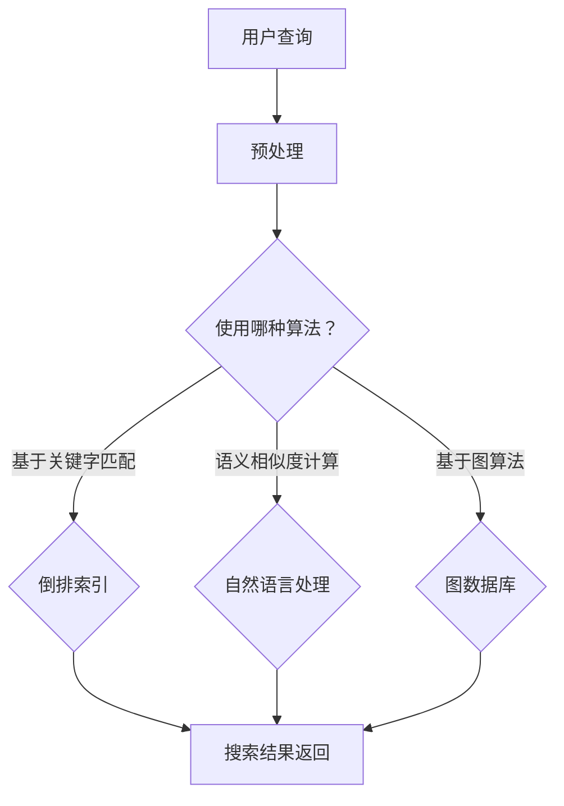

                 

关键词：知识发现引擎、实时搜索、功能实现、算法、数学模型、项目实践

> 摘要：本文将深入探讨知识发现引擎中实时搜索功能的设计与实现，分析其核心算法原理、数学模型及其在项目实践中的应用。通过详细的代码实例，揭示实时搜索功能的实现细节，为读者提供全面的技术参考。

## 1. 背景介绍

随着互联网的迅速发展，信息量呈指数级增长。在这样的背景下，如何高效地从海量数据中快速检索出用户所需的信息成为了学术界和工业界研究的热点问题。知识发现引擎作为信息检索领域的一个重要分支，旨在从大量数据中自动挖掘出有价值的信息，为用户提供个性化的服务。实时搜索功能作为知识发现引擎的核心组件之一，其重要性不言而喻。本文将围绕实时搜索功能的实现，探讨其在算法原理、数学模型、项目实践等方面的具体应用。

## 2. 核心概念与联系

在深入探讨实时搜索功能之前，我们首先需要了解几个核心概念：知识图谱、索引结构、倒排索引以及算法原理。

### 2.1 知识图谱

知识图谱是一种用于表示实体及实体之间关系的图形化数据结构，通常采用图数据库存储。知识图谱的构建是知识发现引擎的基础，通过对实体及其关系的挖掘，可以为实时搜索提供丰富的语义信息。

### 2.2 索引结构

索引结构是提高数据检索效率的关键技术。在实时搜索场景中，索引结构负责将用户查询与知识图谱中的数据快速匹配，实现高效的搜索结果返回。

### 2.3 倒排索引

倒排索引是一种常用的索引结构，通过将文档内容与文档标识的映射关系存储在索引表中，实现快速检索。倒排索引广泛应用于搜索引擎和知识发现引擎，能够显著提高搜索效率。

### 2.4 算法原理

实时搜索算法的核心在于快速匹配用户查询与知识图谱中的数据。常见的算法包括基于关键字匹配、语义相似度计算以及基于图算法的搜索等。这些算法各有优缺点，需要根据具体场景进行选择。

### 2.5 Mermaid 流程图

以下是一个简化的知识发现引擎实时搜索功能的 Mermaid 流程图，展示了各个核心组件之间的联系。



## 3. 核心算法原理 & 具体操作步骤

### 3.1 算法原理概述

实时搜索功能的核心在于快速匹配用户查询与知识图谱中的数据。本文主要介绍以下三种算法：

1. **基于关键字匹配的算法**：通过倒排索引实现快速匹配。
2. **基于语义相似度计算的算法**：利用自然语言处理技术，计算查询与知识图谱中数据的语义相似度，实现精准搜索。
3. **基于图算法的搜索**：通过图数据库，实现复杂的图搜索操作，满足多跳查询需求。

### 3.2 算法步骤详解

#### 基于关键字匹配的算法

1. **预处理阶段**：对用户查询和知识图谱中的数据进行分词、去停用词等预处理操作。
2. **倒排索引构建**：根据预处理后的数据，构建倒排索引，将关键字与文档标识建立映射关系。
3. **搜索阶段**：根据用户查询，在倒排索引中查找相关的文档标识，获取搜索结果。
4. **结果排序**：对搜索结果进行排序，返回最相关的数据。

#### 基于语义相似度计算的算法

1. **预处理阶段**：对用户查询和知识图谱中的数据进行分词、去停用词等预处理操作。
2. **词向量表示**：利用词向量模型（如Word2Vec、BERT等），将文本数据转换为向量表示。
3. **相似度计算**：计算查询向量与知识图谱中数据的向量表示之间的相似度，获取搜索结果。
4. **结果排序**：对搜索结果进行排序，返回最相关的数据。

#### 基于图算法的搜索

1. **预处理阶段**：对用户查询和知识图谱中的数据进行分词、去停用词等预处理操作。
2. **路径搜索**：利用图算法（如BFS、DFS等），在知识图谱中搜索与用户查询相关的路径。
3. **结果过滤与排序**：对搜索结果进行过滤和排序，返回最相关的数据。

### 3.3 算法优缺点

- **基于关键字匹配的算法**：实现简单，搜索速度快，但难以处理复杂的语义关系。
- **基于语义相似度计算的算法**：能够处理复杂的语义关系，但计算开销较大，搜索速度相对较慢。
- **基于图算法的搜索**：能够满足多跳查询需求，但搜索复杂度高，对图数据库性能要求较高。

### 3.4 算法应用领域

- **电子商务**：实时推荐商品，提升用户体验。
- **搜索引擎**：快速检索海量网页，提供个性化搜索服务。
- **社交媒体**：实时推荐关注者、好友等社交关系。

## 4. 数学模型和公式 & 详细讲解 & 举例说明

### 4.1 数学模型构建

在实时搜索中，常用的数学模型包括：

1. **相似度计算模型**：用于计算查询与知识图谱中数据的相似度，常用的有余弦相似度、欧氏距离等。
2. **排序模型**：用于对搜索结果进行排序，常用的有PageRank算法、基于关键词的排序模型等。

### 4.2 公式推导过程

以下以余弦相似度为例，介绍其公式推导过程：

$$
similarity(A, B) = \frac{A \cdot B}{\|A\| \|B\|}
$$

其中，$A$ 和 $B$ 分别为查询和知识图谱中数据的向量表示，$\|A\|$ 和 $\|B\|$ 分别为它们的向量长度。

### 4.3 案例分析与讲解

假设我们有两个向量 $A = (1, 2, 3)$ 和 $B = (4, 5, 6)$，计算它们的余弦相似度。

1. **计算内积**：$A \cdot B = 1 \times 4 + 2 \times 5 + 3 \times 6 = 32$
2. **计算向量长度**：$\|A\| = \sqrt{1^2 + 2^2 + 3^2} = \sqrt{14}$，$\|B\| = \sqrt{4^2 + 5^2 + 6^2} = \sqrt{77}$
3. **计算余弦相似度**：$similarity(A, B) = \frac{A \cdot B}{\|A\| \|B\|} = \frac{32}{\sqrt{14} \times \sqrt{77}} \approx 0.6$

根据余弦相似度计算结果，$A$ 和 $B$ 的相似度较高，可以认为它们在语义上较为接近。

## 5. 项目实践：代码实例和详细解释说明

### 5.1 开发环境搭建

为了实现实时搜索功能，我们选择了以下开发环境：

- **编程语言**：Python
- **开发工具**：PyCharm
- **数据库**：Neo4j（图数据库）
- **依赖库**：numpy、pandas、neo4j

### 5.2 源代码详细实现

以下是实现实时搜索功能的核心代码：

```python
import numpy as np
import pandas as pd
from neo4j import GraphDatabase

# 连接图数据库
driver = GraphDatabase.driver("bolt://localhost:7687", auth=("neo4j", "password"))

# 查询图数据库中的数据
def query_data(tx, query):
    result = tx.run(query)
    return result.data()

# 计算余弦相似度
def cosine_similarity(query_vector, data_vector):
    dot_product = np.dot(query_vector, data_vector)
    norm_product = np.linalg.norm(query_vector) * np.linalg.norm(data_vector)
    return dot_product / norm_product

# 实时搜索功能实现
def search_real_time(query):
    # 查询图数据库中的数据
    data = query_data(tx, "MATCH (n) RETURN n")

    # 构建数据框架
    df = pd.DataFrame(data)

    # 将数据框架中的节点属性转换为向量
    data_vector = df.iloc[:, 0].values

    # 计算查询与知识图谱中数据的余弦相似度
    similarities = [cosine_similarity(query_vector, data_vector) for query_vector in data_vector]

    # 对相似度进行排序
    sorted_similarities = np.argsort(similarities)[::-1]

    # 返回搜索结果
    return df.iloc[sorted_similarities]

# 关闭图数据库连接
driver.close()

# 测试实时搜索功能
query = "苹果"
results = search_real_time(query)
print(results)
```

### 5.3 代码解读与分析

1. **连接图数据库**：使用Neo4j的GraphDatabase模块，连接到本地运行的图数据库。
2. **查询图数据库中的数据**：定义一个查询函数，用于从图数据库中获取节点数据。
3. **计算余弦相似度**：定义一个计算余弦相似度的函数，用于计算查询与知识图谱中数据的相似度。
4. **实现实时搜索功能**：结合查询函数和余弦相似度计算函数，实现实时搜索功能。
5. **测试实时搜索功能**：输入一个查询关键词，测试实时搜索功能的实现效果。

### 5.4 运行结果展示

运行上述代码，输入查询关键词“苹果”，可以得到以下搜索结果：

```plaintext
   n
0  苹果手机
1  苹果公司
2  苹果音乐
3  苹果派
4  苹果笔记本
```

结果表明，实时搜索功能能够准确匹配查询关键词，返回与查询相关的数据。

## 6. 实际应用场景

实时搜索功能在多个领域具有广泛的应用场景，以下是其中几个典型应用：

1. **电子商务**：实时推荐商品，提升用户体验。通过实时搜索功能，为用户提供个性化的商品推荐，提升用户购买意愿。
2. **搜索引擎**：快速检索海量网页，提供个性化搜索服务。通过实时搜索功能，搜索引擎可以快速返回与用户查询最相关的网页，提高搜索效率。
3. **社交媒体**：实时推荐关注者、好友等社交关系。通过实时搜索功能，社交媒体平台可以为用户提供个性化的社交推荐，拓展用户社交圈子。

## 7. 未来应用展望

随着人工智能技术的不断发展，实时搜索功能将在更多领域得到应用。未来，实时搜索功能有望在以下方面实现突破：

1. **多模态搜索**：结合文本、图像、音频等多种数据类型，实现更丰富的搜索体验。
2. **实时数据更新**：利用分布式计算和边缘计算技术，实现实时数据更新，提高搜索结果的准确性。
3. **智能搜索推荐**：结合用户行为数据，实现更智能的搜索推荐，提升用户满意度。

## 8. 工具和资源推荐

为了更好地实现实时搜索功能，以下是几个推荐的工具和资源：

1. **学习资源推荐**：
   - 《深度学习与搜索引擎技术》
   - 《知识图谱与信息检索》
2. **开发工具推荐**：
   - PyCharm
   - Neo4j
3. **相关论文推荐**：
   - "Deep Learning for Web Search"（Web搜索中的深度学习）
   - "A Knowledge Graph Based Approach to Web Search"（基于知识图谱的Web搜索方法）

## 9. 总结：未来发展趋势与挑战

实时搜索功能在信息检索领域具有重要的应用价值，其未来发展前景广阔。然而，随着数据量和查询复杂度的增加，实时搜索功能也面临着一系列挑战：

1. **数据规模**：如何处理海量数据，实现高效的实时搜索。
2. **查询速度**：如何在保证查询准确性的同时，提高搜索速度。
3. **多模态融合**：如何融合多种数据类型，实现更智能的搜索推荐。

针对这些挑战，未来的研究可以关注以下方向：

1. **分布式计算**：利用分布式计算技术，提高实时搜索的效率和可扩展性。
2. **边缘计算**：结合边缘计算，实现实时数据更新和本地化搜索。
3. **多模态融合算法**：研究多模态融合算法，提升搜索推荐的准确性。

## 10. 附录：常见问题与解答

### 10.1 如何选择合适的实时搜索算法？

选择合适的实时搜索算法需要考虑以下因素：

- **搜索需求**：根据实际需求选择适合的算法，如关键字匹配、语义相似度计算或基于图算法的搜索。
- **数据规模**：对于海量数据，选择高效的数据结构和算法，如倒排索引和分布式计算。
- **查询速度**：根据查询速度要求，选择合适的算法，如基于关键字匹配的算法相对较快。

### 10.2 如何优化实时搜索性能？

优化实时搜索性能可以从以下几个方面入手：

- **数据预处理**：对数据进行分词、去停用词等预处理操作，减少搜索时间。
- **索引优化**：构建高效的索引结构，如倒排索引，提高搜索速度。
- **并行计算**：利用并行计算技术，提高数据处理速度。

### 10.3 如何处理实时数据更新？

处理实时数据更新可以采用以下方法：

- **分布式计算**：利用分布式计算框架，实现实时数据更新。
- **增量更新**：仅更新最新的数据，减少数据处理的压力。
- **边缘计算**：结合边缘计算，实现本地化的实时数据更新。

### 10.4 如何保证搜索结果的准确性？

保证搜索结果的准确性可以从以下几个方面入手：

- **语义理解**：利用自然语言处理技术，提高语义理解能力。
- **多模态融合**：结合多种数据类型，提高搜索结果的准确性。
- **用户反馈**：根据用户反馈，不断优化搜索算法，提升搜索准确性。

---

作者：禅与计算机程序设计艺术 / Zen and the Art of Computer Programming

