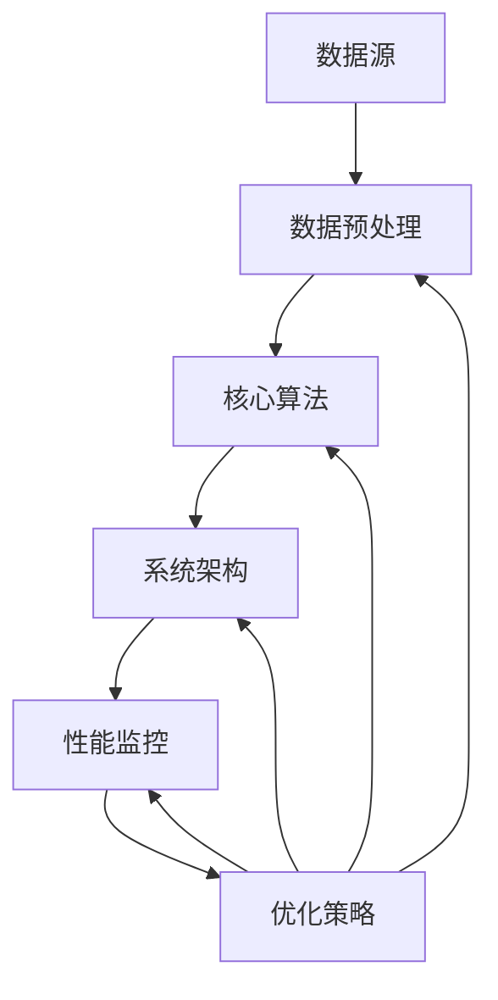

                 

在当今的数据驱动时代，知识发现引擎（Knowledge Discovery Engine，简称KDE）在众多应用场景中扮演着至关重要的角色。从大数据分析到智能推荐系统，知识发现引擎旨在从大量数据中提取出有价值的信息和知识，助力企业和组织做出更明智的决策。然而，随着数据规模的指数级增长和复杂性不断增加，如何优化和调优知识发现引擎的性能成为一个亟待解决的问题。本文将深入探讨知识发现引擎的性能优化与调优策略，并提供实用的方法和工具。

## 关键词
- 知识发现引擎（KDE）
- 性能优化
- 调优策略
- 大数据分析
- 智能推荐系统
- 数据预处理
- 算法优化

## 摘要
本文首先介绍了知识发现引擎的基本概念和重要性，然后探讨了性能优化与调优的基本原则。接下来，文章详细分析了知识发现引擎的各个关键环节，包括数据预处理、核心算法和系统架构，提出了具体的优化策略。此外，本文还介绍了常用的数学模型和公式，以及实际项目中的代码实例和运行结果展示。最后，文章展望了知识发现引擎的未来发展趋势和面临的挑战，为研究人员和开发人员提供了有价值的参考。

---

## 1. 背景介绍

知识发现引擎（KDE）是一种用于从大量数据中提取知识和模式的智能系统。随着互联网和物联网的快速发展，数据量呈爆炸式增长，这给传统的数据处理和分析方法带来了巨大的挑战。知识发现引擎的出现，正是为了应对这种数据密集型的应用场景，通过高效的数据处理和分析，帮助用户从海量数据中找到有价值的知识和洞察。

知识发现引擎的主要组成部分包括数据源、数据预处理模块、核心算法模块和结果输出模块。数据源可以是结构化数据、半结构化数据或非结构化数据，如关系数据库、文档、图像、视频等。数据预处理模块负责清洗、转换和整合原始数据，以适应核心算法模块的需求。核心算法模块则是知识发现引擎的核心，它包括各种机器学习算法、数据挖掘算法和深度学习算法，用于从数据中提取知识和模式。结果输出模块则将分析结果以可视化或结构化数据的形式呈现给用户。

知识发现引擎在各个行业和领域都有广泛的应用。例如，在金融行业，知识发现引擎可以用于客户行为分析、风险管理和投资策略优化；在电子商务领域，知识发现引擎可以用于个性化推荐、用户行为分析和市场预测；在医疗领域，知识发现引擎可以用于疾病诊断、药物研发和健康数据管理。

然而，随着数据规模的不断扩大和复杂性不断增加，知识发现引擎的性能优化和调优变得尤为重要。一个高效的知识发现引擎不仅可以提高数据分析的效率，还可以降低成本、提升用户体验，甚至可以影响企业的核心竞争力和业务决策。因此，研究和应用知识发现引擎的性能优化与调优技术具有重要的现实意义和广阔的应用前景。

### 1.1 知识发现引擎的发展历史

知识发现引擎（KDE）的概念最早可以追溯到20世纪80年代，当时研究人员开始探索如何从大量数据中自动发现有价值的信息和知识。早期的知识发现研究主要集中在数据库挖掘和统计学习领域，代表性的工作包括1986年Jiawei Han和Jerry Yan发表的经典论文《A Simple Algorithm for Rule Discovery》。

随着计算机技术和数据存储技术的进步，知识发现引擎逐渐从理论研究走向实际应用。20世纪90年代，随着互联网的普及，知识发现引擎的应用场景迅速扩展，从商业智能到电子商务，从金融分析到医疗健康，知识发现引擎在各个领域都展现出了巨大的潜力和应用价值。

进入21世纪，随着大数据和云计算技术的兴起，知识发现引擎迎来了新的发展机遇。大数据的高维、高速度和高多样性特点对知识发现技术提出了更高的要求，催生了诸如深度学习、图挖掘、流计算等新型知识发现方法。同时，云计算和分布式计算技术为知识发现引擎提供了强大的计算能力和数据处理能力，使得大规模知识发现成为可能。

在近年来，知识发现引擎的应用范围进一步扩大，不仅限于传统的商业和科研领域，还延伸到了智能家居、智能交通、智慧城市等新兴领域。随着人工智能技术的不断进步，知识发现引擎的智能化和自动化水平也在不断提高，从而为用户提供更加精准、高效的服务。

### 1.2 知识发现引擎的基本架构和工作流程

知识发现引擎（KDE）的基本架构可以概括为四个主要模块：数据源、数据预处理模块、核心算法模块和结果输出模块。以下将详细描述这些模块的功能和它们之间的交互流程。

#### 数据源

数据源是知识发现引擎的输入，可以是结构化数据、半结构化数据或非结构化数据。结构化数据通常存储在关系数据库中，如SQL数据库，其特点是数据格式规范、易于查询和管理。半结构化数据，如XML、JSON等，具有一定的结构但不如结构化数据那么严格。非结构化数据，如文本、图像、视频等，没有明确的数据模型，但它们包含了大量有价值的信息。

数据源的设计和选择对知识发现引擎的性能有重要影响。一方面，数据源的质量直接影响数据预处理和后续分析的准确性；另一方面，数据源的多样性有助于发现更丰富的知识和模式。

#### 数据预处理模块

数据预处理模块是知识发现引擎的核心环节之一，其主要任务是对原始数据进行清洗、转换和整合，以确保数据的质量和一致性。具体来说，数据预处理包括以下步骤：

1. **数据清洗**：去除重复、错误或缺失的数据，填补缺失值，处理异常值，确保数据的完整性和准确性。
2. **数据转换**：将不同格式的数据转换为统一的格式，如将文本数据转换为数值或向量表示，将图像数据转换为像素矩阵等。
3. **数据整合**：将来自不同源的数据进行合并，形成统一的数据集，以便后续分析。

数据预处理模块的设计和实现需要考虑数据源的类型、数据规模和复杂性，选择合适的预处理方法和工具，以提高数据的质量和一致性。

#### 核心算法模块

核心算法模块是知识发现引擎的核心，它负责从预处理后的数据中提取有价值的信息和知识。核心算法模块包括各种机器学习算法、数据挖掘算法和深度学习算法，如分类、聚类、关联规则挖掘、异常检测、主题模型等。

1. **分类算法**：用于将数据划分为不同的类别，如决策树、支持向量机（SVM）、神经网络等。
2. **聚类算法**：用于将数据分为多个组，以发现数据中的模式和分布，如K-means、层次聚类等。
3. **关联规则挖掘**：用于发现数据项之间的关联关系，如Apriori算法、FP-growth等。
4. **异常检测**：用于检测数据中的异常值或异常模式，如孤立森林、基于密度的聚类等。
5. **主题模型**：用于发现文本数据中的潜在主题，如LDA（Latent Dirichlet Allocation）等。

核心算法模块的设计和实现需要考虑数据的类型、规模和特征，选择合适的算法和参数，以获得最佳的分析效果。

#### 结果输出模块

结果输出模块负责将核心算法模块的分析结果以可视化或结构化数据的形式呈现给用户。结果输出可以是图表、报表、地图等形式，也可以是结构化的数据文件，如CSV、JSON等。

结果输出模块的设计和实现需要考虑用户的交互需求和分析结果的可视化效果，选择合适的可视化工具和格式，以提高用户的理解和决策效率。

#### 工作流程

知识发现引擎的工作流程可以概括为以下几个步骤：

1. **数据收集**：从不同的数据源收集数据，包括结构化数据、半结构化数据和非结构化数据。
2. **数据预处理**：对收集到的原始数据进行清洗、转换和整合，形成高质量的数据集。
3. **算法选择**：根据数据分析的目标和需求，选择合适的机器学习算法、数据挖掘算法或深度学习算法。
4. **模型训练**：使用预处理后的数据集训练模型，包括特征提取、模型参数调优等。
5. **模型评估**：评估模型的性能，包括准确性、召回率、F1值等指标，选择最佳模型。
6. **结果输出**：将模型的分析结果以可视化或结构化数据的形式呈现给用户，辅助决策和优化。

通过以上工作流程，知识发现引擎可以从海量数据中提取出有价值的信息和知识，帮助用户更好地理解数据、发现规律、做出决策。

### 1.3 知识发现引擎的应用场景

知识发现引擎（KDE）因其高效的数据处理和分析能力，在各个行业和领域得到了广泛的应用。以下是一些典型的应用场景，展示了知识发现引擎的强大潜力和广泛影响力：

#### 商业智能

在商业智能领域，知识发现引擎被广泛应用于市场分析、客户行为分析、销售预测和风险管理等方面。通过分析大量的销售数据、客户数据和市场数据，知识发现引擎可以识别出潜在的市场趋势、客户需求和市场机会，帮助企业制定更有效的营销策略和业务计划。

例如，某大型零售企业利用知识发现引擎分析其销售数据，发现某些产品的销售高峰集中在特定的节假日，从而优化了库存管理和促销活动，提高了销售额和库存周转率。此外，知识发现引擎还可以帮助企业识别出潜在的客户流失风险，采取预防措施，减少客户流失率。

#### 金融分析

在金融行业，知识发现引擎被广泛应用于风险控制、投资策略优化、信用评估和欺诈检测等方面。通过对大量的金融交易数据、客户数据和市场数据进行深入分析，知识发现引擎可以帮助金融机构识别出潜在的信用风险、市场风险和操作风险，从而优化风险管理策略，降低风险损失。

例如，某金融机构利用知识发现引擎分析其客户信用数据，发现某些客户的信用评分较低，但具有高潜在盈利能力。通过调整信用审批政策，该金融机构成功降低了不良贷款率，提高了盈利能力。此外，知识发现引擎还可以用于监控金融交易，识别欺诈行为，保护金融机构的资金安全。

#### 电子商务

在电子商务领域，知识发现引擎被广泛应用于个性化推荐、用户行为分析和市场预测等方面。通过分析大量的用户行为数据、商品数据和交易数据，知识发现引擎可以识别出用户的偏好、兴趣和购买习惯，从而提供个性化的推荐和服务，提高用户满意度和转化率。

例如，某电商平台利用知识发现引擎分析其用户的购物历史和行为数据，发现某些用户倾向于购买特定类型的商品，从而优化了商品推荐策略，提高了用户的购买体验和销售额。此外，知识发现引擎还可以用于预测市场需求和库存水平，优化供应链管理和库存控制，降低运营成本。

#### 医疗健康

在医疗健康领域，知识发现引擎被广泛应用于疾病诊断、药物研发、健康数据管理和公共卫生监测等方面。通过对大量的医学数据、基因组数据和健康数据进行深入分析，知识发现引擎可以帮助医生和研究人员识别出疾病的早期症状、高风险人群和潜在的药物靶点，从而提高诊断的准确性和治疗效果。

例如，某医疗科技公司利用知识发现引擎分析其患者的病历数据，发现某些疾病的早期症状和诊断标志物，从而优化了诊断流程，提高了诊断准确率。此外，知识发现引擎还可以用于药物研发，通过分析大量的化学结构和生物数据，发现潜在的药物靶点和作用机制，加速药物研发进程。

#### 智能交通

在智能交通领域，知识发现引擎被广泛应用于交通流量预测、交通拥堵管理和智能调度等方面。通过对大量的交通数据、地理位置数据和实时数据进行分析，知识发现引擎可以识别出交通流量和交通拥堵的规律和模式，从而优化交通管理和调度策略，提高交通效率和安全性。

例如，某城市利用知识发现引擎分析其交通数据，发现某些路段在特定时间段容易出现交通拥堵，从而优化了交通信号灯的控制策略，减少了交通拥堵现象。此外，知识发现引擎还可以用于智能调度，通过分析实时交通数据，优化公交线路和调度计划，提高公共交通的运营效率和乘客满意度。

综上所述，知识发现引擎在各个行业和领域都展现了其强大的应用价值。通过高效的数据处理和分析能力，知识发现引擎可以帮助企业和组织从海量数据中提取出有价值的信息和知识，提高决策的准确性和效率，从而在竞争激烈的市场环境中脱颖而出。

### 1.4 知识发现引擎的性能优化与调优的必要性

随着数据规模的不断扩大和数据复杂性的不断增加，知识发现引擎（KDE）的性能优化与调优变得尤为重要。以下是几个关键因素，强调了这一过程的必要性和重要性。

#### 数据规模的增长

随着物联网和社交媒体的普及，数据规模呈现出指数级增长。这不仅包括结构化数据，如关系数据库中的数据，还包括大量的半结构化和非结构化数据，如文档、图像、视频等。这种增长对知识发现引擎的处理能力提出了更高的要求。如果无法有效优化和调优，知识发现引擎可能会因为数据量过大而导致性能下降，甚至崩溃。

#### 数据复杂性的提高

现代数据不仅量大，而且复杂。数据类型繁多，包括文本、图像、音频、视频等，这些数据往往需要多种算法和技术进行联合处理。同时，数据之间存在复杂的关联和依赖关系，这使得知识发现引擎在处理和分析数据时面临更大的挑战。如果不能进行有效的优化和调优，知识发现引擎可能会因为数据复杂性而变得低效，甚至无法得出准确的结论。

#### 用户需求的多样化

用户对知识发现引擎的需求也越来越多样化。不仅需要高效的处理速度，还需要提供准确的预测和丰富的可视化结果。这些需求对知识发现引擎的性能和用户体验提出了更高的要求。如果不能进行有效的性能优化和调优，知识发现引擎可能无法满足用户的期望，从而影响其在实际应用中的效果和推广。

#### 成本控制

知识发现引擎的开发和应用需要大量的计算资源和存储资源。在云计算和分布式计算环境下，虽然这些资源相对容易获得，但仍然需要投入大量的成本。因此，通过性能优化和调优，可以最大限度地提高资源利用率，降低计算和存储成本，这对于企业来说具有重要的经济意义。

#### 竞争优势

在当今的数据驱动时代，企业需要利用数据做出更明智的决策，以保持竞争优势。一个高效的知识发现引擎可以帮助企业快速提取有价值的信息，从而在市场变化中抢占先机。通过性能优化和调优，企业可以提升其数据分析和决策的效率，从而在激烈的市场竞争中占据优势地位。

综上所述，知识发现引擎的性能优化与调优是确保其在大规模、高复杂度数据环境中正常运行的关键。通过有效的性能优化和调优，企业可以提升数据分析的效率和质量，降低成本，提高用户体验，从而在数据驱动时代中保持竞争优势。

### 1.5 性能优化与调优的基本原则和方法

在进行知识发现引擎的性能优化与调优时，需要遵循一些基本的原则和方法，以确保优化措施的有效性和可维护性。以下是一些关键原则和具体的优化方法：

#### 原则

1. **目标明确**：在进行性能优化之前，需要明确优化目标，如提高处理速度、降低延迟、减少内存使用等。明确的目标有助于选择合适的优化方法，避免盲目优化。
2. **系统化**：性能优化和调优是一个系统化的过程，需要综合考虑硬件、软件、算法和数据等多个方面。单一维度的优化可能无法达到最佳效果，需要整体优化。
3. **逐步迭代**：性能优化和调优通常不是一蹴而就的，需要通过逐步迭代的方法进行。每次优化后，都需要对性能进行评估，确保优化效果。
4. **可维护性**：在优化过程中，需要考虑代码的可维护性。优化的代码应该易于理解、易于修改，以避免未来维护时的困难。
5. **持续监控**：性能优化和调优不是一次性的工作，需要持续监控系统的性能，根据实际情况进行动态调整。

#### 方法

1. **代码优化**：这是性能优化中最直接的方法。通过优化代码，可以减少不必要的计算、内存使用和I/O操作。具体方法包括：
   - **算法改进**：选择更高效的算法或改进现有算法，减少计算复杂度。
   - **代码重构**：通过重构代码，提高代码的可读性和可维护性，减少冗余代码和无效操作。
   - **并行化**：利用多线程或分布式计算，提高数据处理的速度和效率。

2. **硬件优化**：通过优化硬件配置，可以显著提升系统的性能。具体方法包括：
   - **提高计算能力**：增加CPU核心数、GPU数量等，提升计算速度。
   - **优化存储系统**：使用高速存储设备，如SSD，减少I/O延迟。
   - **网络优化**：优化网络带宽和延迟，提高数据传输效率。

3. **数据优化**：通过对数据进行优化，可以减少数据处理的复杂度和时间。具体方法包括：
   - **数据压缩**：使用数据压缩算法，减少数据存储和传输的开销。
   - **数据分区**：将大数据集分区，减少单个数据处理任务的数据量。
   - **索引优化**：优化数据库索引，提高数据查询速度。

4. **系统架构优化**：通过改进系统架构，可以提高系统的稳定性和扩展性。具体方法包括：
   - **分布式架构**：将系统分解为多个模块，分布式部署，提高系统的处理能力和容错性。
   - **微服务架构**：使用微服务架构，将系统拆分为多个独立的微服务，提高系统的灵活性和可维护性。
   - **缓存策略**：使用缓存策略，减少对后端系统的访问，提高响应速度。

5. **调优工具与方法**：
   - **性能分析工具**：使用性能分析工具，如profiling工具，分析系统的性能瓶颈，定位优化点。
   - **自动化调优**：使用自动化调优工具，根据系统负载和性能指标自动调整系统配置和参数。
   - **实验方法**：通过实验方法，测试不同的优化方案，选择最佳方案。

通过遵循上述原则和方法，可以有效地对知识发现引擎进行性能优化与调优，提高系统的处理能力和稳定性，满足日益增长的数据需求和复杂应用场景。

### 2. 核心概念与联系

为了深入理解知识发现引擎的性能优化与调优，我们需要首先掌握其核心概念和架构，并通过一个具体的Mermaid流程图来展示这些概念和组件之间的联系。

#### 2.1 核心概念

1. **数据源（Data Sources）**：数据源是知识发现引擎的输入，可以是结构化、半结构化或非结构化数据。数据源的质量直接影响后续分析的准确性。
2. **数据预处理（Data Preprocessing）**：数据预处理模块负责清洗、转换和整合原始数据，以确保数据的质量和一致性。
3. **核心算法（Core Algorithms）**：核心算法模块包括各种机器学习、数据挖掘和深度学习算法，用于从数据中提取知识和模式。
4. **系统架构（System Architecture）**：系统架构决定了知识发现引擎的扩展性、稳定性和性能。常见的架构包括单一服务器架构、分布式架构和微服务架构。
5. **性能监控（Performance Monitoring）**：性能监控模块负责实时监控系统的性能，包括CPU、内存、I/O和网络等指标，以便及时发现问题并进行调优。
6. **优化策略（Optimization Strategies）**：优化策略包括代码优化、硬件优化、数据优化和系统架构优化等，旨在提高系统的性能和效率。

#### 2.2 Mermaid流程图

以下是一个Mermaid流程图，展示了知识发现引擎的核心概念和组件之间的联系：



- **数据源**（A）：数据源是知识发现引擎的起点，包括各种类型的数据，如关系数据库、文档、图像、视频等。
- **数据预处理**（B）：数据预处理模块负责清洗、转换和整合原始数据，确保数据的一致性和质量。
- **核心算法**（C）：核心算法模块包括分类、聚类、关联规则挖掘、深度学习等算法，用于从数据中提取知识和模式。
- **系统架构**（D）：系统架构决定了知识发现引擎的扩展性和性能。分布式架构和微服务架构能够更好地处理大规模数据和高并发请求。
- **性能监控**（E）：性能监控模块负责实时监控系统的性能，包括CPU、内存、I/O和网络等指标，以便及时发现问题。
- **优化策略**（F）：优化策略包括代码优化、硬件优化、数据优化和系统架构优化等，旨在提高系统的性能和效率。

通过上述核心概念和Mermaid流程图的展示，我们可以更清晰地理解知识发现引擎的工作原理和组件之间的联系。这为后续的详细讨论和分析提供了基础。

### 3. 核心算法原理 & 具体操作步骤

#### 3.1 算法原理概述

知识发现引擎（KDE）的核心算法主要基于机器学习、数据挖掘和深度学习技术。这些算法通过分析大量的数据，从中提取出有价值的信息和知识。以下是几个常用的核心算法及其原理：

1. **分类算法**（Classification Algorithms）
   - **原理**：分类算法的目标是将数据集中的每个样本分配到预定义的类别中。常见的分类算法包括决策树（Decision Tree）、支持向量机（Support Vector Machine, SVM）和朴素贝叶斯（Naive Bayes）。
   - **应用**：分类算法广泛应用于市场分析、客户行为分析和信用评估等领域。

2. **聚类算法**（Clustering Algorithms）
   - **原理**：聚类算法将数据集中的样本根据其相似性进行分组，形成多个簇。常见的聚类算法包括K-means、层次聚类（Hierarchical Clustering）和DBSCAN（Density-Based Spatial Clustering of Applications with Noise）。
   - **应用**：聚类算法用于数据降维、用户行为分析和异常检测等领域。

3. **关联规则挖掘**（Association Rule Learning）
   - **原理**：关联规则挖掘的目标是从数据集中发现不同项之间的关联关系。常见的算法包括Apriori和FP-growth。
   - **应用**：关联规则挖掘广泛用于市场篮子分析、推荐系统和电子商务领域。

4. **异常检测**（Anomaly Detection）
   - **原理**：异常检测算法用于识别数据集中的异常值或异常模式。常见的算法包括孤立森林（Isolation Forest）和基于密度的聚类。
   - **应用**：异常检测用于网络安全、金融欺诈检测和医疗诊断等领域。

5. **深度学习**（Deep Learning）
   - **原理**：深度学习算法通过多层神经网络进行特征学习和模式识别。常见的深度学习模型包括卷积神经网络（CNN）、循环神经网络（RNN）和生成对抗网络（GAN）。
   - **应用**：深度学习广泛应用于图像识别、语音识别和自然语言处理等领域。

#### 3.2 算法步骤详解

以下是上述几个核心算法的具体步骤：

1. **分类算法**
   - **步骤**：
     1. 数据预处理：清洗和转换数据，将数据集划分为训练集和测试集。
     2. 特征提取：提取数据中的特征，如文本数据中的词频或图像数据中的像素值。
     3. 模型训练：使用训练集数据训练分类模型，如决策树、SVM或朴素贝叶斯。
     4. 模型评估：使用测试集数据评估模型性能，如准确率、召回率和F1值。
     5. 模型应用：使用训练好的模型对新的数据样本进行分类。

2. **聚类算法**
   - **步骤**：
     1. 数据预处理：清洗和转换数据，确保数据的质量和一致性。
     2. 确定聚类数：根据数据分布和业务需求确定簇的数量。
     3. 模型训练：使用聚类算法，如K-means、层次聚类或DBSCAN，将数据分为多个簇。
     4. 簇评估：评估聚类结果的质量，如簇内相似度和簇间差异。
     5. 簇应用：根据聚类结果进行数据分析和决策。

3. **关联规则挖掘**
   - **步骤**：
     1. 数据预处理：清洗和转换数据，确保数据的质量和一致性。
     2. 计算支持度和置信度：对数据集进行扫描，计算每个关联规则的支持度和置信度。
     3. 生成频繁项集：使用Apriori算法或FP-growth算法生成频繁项集。
     4. 生成关联规则：从频繁项集中提取关联规则，并根据最小支持度和最小置信度过滤掉不重要的规则。
     5. 规则应用：使用关联规则进行市场篮子分析、推荐系统和电子商务策略优化。

4. **异常检测**
   - **步骤**：
     1. 数据预处理：清洗和转换数据，确保数据的质量和一致性。
     2. 模型训练：使用正常数据训练异常检测模型，如孤立森林或基于密度的聚类。
     3. 异常检测：使用训练好的模型检测数据中的异常值或异常模式。
     4. 异常评估：评估异常检测结果的准确性，如误报率和漏报率。
     5. 异常应用：根据异常检测结果进行安全监控、金融欺诈检测和医疗诊断。

5. **深度学习**
   - **步骤**：
     1. 数据预处理：清洗和转换数据，确保数据的质量和一致性。
     2. 特征提取：提取数据中的特征，如文本数据中的词向量或图像数据中的卷积特征。
     3. 模型构建：构建深度学习模型，如CNN、RNN或GAN。
     4. 模型训练：使用训练集数据训练模型，通过反向传播算法优化模型参数。
     5. 模型评估：使用测试集数据评估模型性能，如准确率、召回率和F1值。
     6. 模型应用：使用训练好的模型对新的数据样本进行预测和分析。

通过上述详细的算法步骤，我们可以更好地理解知识发现引擎中的核心算法，为后续的优化和调优提供基础。

#### 3.3 算法优缺点

每种算法都有其独特的优势和局限性，下面将对常见算法的优缺点进行简要分析：

1. **分类算法**
   - **优点**：
     - **解释性强**：分类算法通常能够提供明确的分类规则和决策边界。
     - **适用于多种数据类型**：分类算法可以处理结构化、半结构化和非结构化数据。
     - **易于实现和评估**：分类算法的实现和性能评估相对简单，如准确率、召回率和F1值等指标。
   - **缺点**：
     - **过拟合**：分类算法在训练数据集中可能出现过拟合现象，导致在测试数据上的性能下降。
     - **可解释性降低**：随着模型复杂度的增加，模型的解释性会降低，特别是在使用深度学习模型时。

2. **聚类算法**
   - **优点**：
     - **无监督学习**：聚类算法不需要预先定义标签或类别，能够发现数据中的自然结构。
     - **适用性广**：聚类算法适用于各种类型的数据，特别是高维数据。
     - **可视化简单**：聚类算法的结果可以通过可视化手段直观地展示，如散点图、树状图等。
   - **缺点**：
     - **结果依赖参数**：聚类结果容易受到参数选择的影响，如K-means算法中的聚类数K。
     - **聚类质量评估困难**：聚类算法的评价标准相对主观，如轮廓系数和内部距离等。

3. **关联规则挖掘**
   - **优点**：
     - **易于实现**：关联规则挖掘算法相对简单，易于实现和优化。
     - **强大的数据探索能力**：关联规则挖掘可以揭示数据项之间的潜在关联关系，适用于市场篮子分析和推荐系统。
     - **适用于多种数据类型**：关联规则挖掘算法可以处理结构化、半结构化和非结构化数据。
   - **缺点**：
     - **计算复杂度高**：特别是对于大规模数据集，关联规则挖掘算法的计算复杂度较高。
     - **结果可解释性低**：关联规则挖掘生成的规则数量庞大，难以直接解释和应用。

4. **异常检测**
   - **优点**：
     - **实时性和鲁棒性**：异常检测算法能够实时监测数据中的异常值或异常模式，具有较强的鲁棒性。
     - **适用于多种应用场景**：异常检测算法广泛应用于网络安全、金融欺诈检测和医疗诊断等领域。
     - **适应性**：异常检测算法可以根据不同应用场景进行调整和优化。
   - **缺点**：
     - **误报和漏报问题**：异常检测算法在平衡误报率和漏报率时存在挑战，特别是在数据噪声较多的情况下。
     - **依赖先验知识**：某些异常检测算法，如基于统计的方法，需要依赖先验知识和假设。

5. **深度学习**
   - **优点**：
     - **强大的特征学习能力**：深度学习算法能够自动提取复杂和高维的特征，适用于图像识别、语音识别和自然语言处理等领域。
     - **自动化和智能化**：深度学习算法能够自动化地处理大量数据，减少人工干预，提高效率。
     - **高准确率**：深度学习算法在许多领域取得了显著的性能提升，特别是在图像识别和语音识别等领域。
   - **缺点**：
     - **计算资源需求大**：深度学习算法通常需要大量的计算资源和存储资源，尤其是在训练阶段。
     - **可解释性低**：深度学习模型通常被称为“黑盒子”，其内部决策过程难以解释和理解。
     - **依赖大量数据**：深度学习算法的性能高度依赖数据量，数据不足可能影响模型的性能。

通过了解不同算法的优缺点，我们可以根据具体应用场景和需求选择合适的算法，并进行相应的性能优化和调优。

#### 3.4 算法应用领域

知识发现引擎中的核心算法在多个领域都有着广泛的应用，以下是一些典型的应用场景和案例：

1. **金融行业**
   - **客户行为分析**：银行和金融机构利用分类算法和聚类算法分析客户的消费行为和交易记录，识别出高价值客户和潜在流失客户，从而制定个性化的营销策略。
   - **风险管理**：通过关联规则挖掘，金融机构可以发现交易中的异常模式，如欺诈行为，从而及时采取预防措施。
   - **投资策略优化**：利用时间序列分析和机器学习算法，金融分析师可以预测市场趋势和股票价格，为投资决策提供依据。

2. **电子商务**
   - **个性化推荐**：电商平台利用协同过滤和深度学习算法，根据用户的浏览历史和购买行为，为其推荐个性化的商品，提高用户满意度和转化率。
   - **用户行为分析**：通过分类算法和聚类算法，电商平台可以分析用户的购物习惯和偏好，从而优化用户体验和购物流程。
   - **市场预测**：利用时间序列分析和预测模型，电商平台可以预测未来的销售趋势和库存需求，优化供应链管理。

3. **医疗健康**
   - **疾病诊断**：通过深度学习算法，医学影像诊断系统可以自动识别出疾病，如癌症、心脏病等，为医生提供诊断辅助。
   - **药物研发**：利用机器学习和图挖掘算法，研究人员可以从大量的药物数据中提取出潜在的有效成分和作用机制，加速药物研发进程。
   - **健康数据管理**：通过聚类算法和关联规则挖掘，医疗机构可以对患者的健康数据进行分析，发现疾病的高风险人群和预防措施。

4. **智能交通**
   - **交通流量预测**：利用时间序列分析和机器学习算法，交通管理部门可以预测未来的交通流量，优化交通信号控制和道路调度，减少拥堵。
   - **异常检测**：通过异常检测算法，交通监控系统可以实时监测交通数据，识别出交通事故、交通堵塞等异常事件，及时采取应对措施。
   - **智能调度**：利用聚类算法和优化算法，公共交通系统可以优化线路和调度计划，提高运营效率和乘客满意度。

5. **制造业**
   - **生产预测**：通过时间序列分析和机器学习算法，制造业可以预测未来的生产需求，优化生产计划和库存管理。
   - **质量检测**：利用深度学习和计算机视觉算法，生产线上的质量检测系统能够自动识别出次品，提高生产质量。
   - **设备维护**：通过异常检测算法，设备监控系统可以提前发现设备的故障迹象，进行预防性维护，减少停机时间和维修成本。

通过这些应用场景和案例，我们可以看到知识发现引擎中的核心算法在各个领域的强大应用潜力。这些算法不仅提高了数据分析和决策的效率和质量，还为各行业带来了创新和变革。

### 4. 数学模型和公式 & 详细讲解 & 举例说明

#### 4.1 数学模型构建

知识发现引擎（KDE）的性能优化和调优涉及到多种数学模型和公式，这些模型和公式为我们提供了分析和解决性能问题的理论基础。以下将介绍几个关键的数学模型和公式，并详细讲解其构建和应用。

1. **线性回归模型（Linear Regression Model）**

   线性回归模型是一种常用的统计模型，用于分析自变量和因变量之间的线性关系。其数学模型可以表示为：

   $$ Y = \beta_0 + \beta_1X + \epsilon $$

   其中，$Y$ 是因变量，$X$ 是自变量，$\beta_0$ 和 $\beta_1$ 是模型的参数，$\epsilon$ 是误差项。

   **构建方法**：线性回归模型通常通过最小二乘法（Least Squares Method）进行参数估计。具体步骤如下：

   - **数据预处理**：对数据进行标准化处理，以消除量纲影响。
   - **模型假设**：假设自变量和因变量之间满足线性关系。
   - **参数估计**：通过求解最小二乘方程组，得到模型参数 $\beta_0$ 和 $\beta_1$。
   - **模型评估**：通过计算残差平方和（Sum of Squared Errors, SSE）和决定系数（Coefficient of Determination, R²）等指标评估模型性能。

2. **支持向量机（Support Vector Machine, SVM）**

   支持向量机是一种强大的分类算法，通过最大化分类边界之间的距离，提高模型的泛化能力。其数学模型可以表示为：

   $$ \min_{\beta, \beta_0} \frac{1}{2}||\beta||^2 + C\sum_{i=1}^{n}\xi_i $$

   其中，$\beta$ 是权重向量，$\beta_0$ 是偏置项，$C$ 是正则化参数，$\xi_i$ 是松弛变量。

   **构建方法**：
   - **数据预处理**：对数据进行标准化和归一化处理。
   - **核函数选择**：选择适当的核函数（如线性核、多项式核、径向基核等）将低维数据映射到高维特征空间。
   - **优化目标**：通过求解优化问题，得到最优的权重向量 $\beta$ 和偏置项 $\beta_0$。
   - **模型评估**：通过交叉验证和测试集评估模型性能，如准确率、召回率和F1值等。

3. **主成分分析（Principal Component Analysis, PCA）**

   主成分分析是一种数据降维技术，通过线性变换将高维数据投影到低维空间，保留主要的信息。其数学模型可以表示为：

   $$ X' = P'X $$

   其中，$X$ 是原始数据矩阵，$P$ 是主成分矩阵，$X'$ 是变换后的数据。

   **构建方法**：
   - **数据标准化**：对数据进行标准化处理，以消除不同特征间的量纲影响。
   - **协方差矩阵计算**：计算数据矩阵的协方差矩阵。
   - **特征值和特征向量计算**：求解协方差矩阵的特征值和特征向量，选择前 $k$ 个最大的特征值对应的特征向量作为主成分矩阵 $P$。
   - **数据投影**：将原始数据投影到低维空间，得到降维后的数据。

4. **K-means聚类算法**

   K-means是一种经典的聚类算法，通过迭代过程将数据分为 $k$ 个簇。其数学模型可以表示为：

   $$ C = \{c_1, c_2, ..., c_k\} $$
   $$ x_i = \sum_{j=1}^{k} \frac{\alpha_{ij}}{\sum_{t=1}^{k} \alpha_{it}} c_j $$

   其中，$C$ 是聚类中心，$x_i$ 是数据点，$\alpha_{ij}$ 是隶属度矩阵，表示第 $i$ 个数据点属于第 $j$ 个簇的概率。

   **构建方法**：
   - **初始聚类中心选择**：随机选择 $k$ 个数据点作为初始聚类中心。
   - **隶属度计算**：计算每个数据点与聚类中心的距离，确定隶属度。
   - **聚类中心更新**：根据隶属度重新计算聚类中心。
   - **迭代过程**：重复步骤2和步骤3，直到聚类中心不再发生显著变化。

5. **贝叶斯网络（Bayesian Network）**

   贝叶斯网络是一种概率图模型，用于表示变量之间的条件依赖关系。其数学模型可以表示为：

   $$ P(X_1, X_2, ..., X_n) = \prod_{i=1}^{n} P(X_i | X_{Pa_i}) $$

   其中，$X_1, X_2, ..., X_n$ 是随机变量，$Pa_i$ 是 $X_i$ 的父节点。

   **构建方法**：
   - **变量关系分析**：分析变量之间的因果关系和依赖关系。
   - **构建概率图**：根据变量关系构建贝叶斯网络图。
   - **参数估计**：通过最大似然估计或贝叶斯估计方法，估计网络中的概率参数。
   - **推理计算**：利用贝叶斯推理计算变量的后验概率分布。

通过上述数学模型和公式的构建，我们可以更好地理解和应用知识发现引擎的性能优化与调优技术。这些模型不仅为优化策略提供了理论基础，还为实际应用中的问题求解提供了方法。

#### 4.2 公式推导过程

为了深入理解上述数学模型和公式的推导过程，我们将详细讲解线性回归模型和支持向量机（SVM）的推导步骤。

1. **线性回归模型（Linear Regression Model）**

   线性回归模型是一种简单但强大的统计模型，用于分析自变量和因变量之间的线性关系。我们通过最小二乘法来推导其参数估计。

   **推导过程**：

   假设我们有一个包含 $n$ 个样本的数据集，其中每个样本包含一个因变量 $Y$ 和一个自变量 $X$。线性回归模型假设 $Y$ 和 $X$ 之间存在线性关系：

   $$ Y = \beta_0 + \beta_1X + \epsilon $$

   其中，$\beta_0$ 是截距，$\beta_1$ 是斜率，$\epsilon$ 是误差项。

   我们的目标是找到最佳拟合直线，使得所有样本点到直线的距离平方和最小。这个目标可以用以下优化问题来表示：

   $$ \min_{\beta_0, \beta_1} \sum_{i=1}^{n} (Y_i - (\beta_0 + \beta_1X_i))^2 $$

   为了简化问题，我们引入损失函数（也称为残差平方和）：

   $$ J(\beta_0, \beta_1) = \sum_{i=1}^{n} (Y_i - (\beta_0 + \beta_1X_i))^2 $$

   现在问题转化为求解 $J(\beta_0, \beta_1)$ 的最小值。

   对 $J(\beta_0, \beta_1)$ 分别对 $\beta_0$ 和 $\beta_1$ 求导，并令导数等于零，得到：

   $$ \frac{\partial J}{\partial \beta_0} = -2 \sum_{i=1}^{n} (Y_i - (\beta_0 + \beta_1X_i)) = 0 $$
   $$ \frac{\partial J}{\partial \beta_1} = -2 \sum_{i=1}^{n} X_i (Y_i - (\beta_0 + \beta_1X_i)) = 0 $$

   简化上述方程，我们得到：

   $$ \sum_{i=1}^{n} Y_i = n\beta_0 + \beta_1 \sum_{i=1}^{n} X_i $$
   $$ \sum_{i=1}^{n} X_i Y_i = \beta_0 \sum_{i=1}^{n} X_i + \beta_1 \sum_{i=1}^{n} X_i^2 $$

   通过解这个方程组，我们可以得到线性回归模型的参数 $\beta_0$ 和 $\beta_1$：

   $$ \beta_0 = \frac{\sum_{i=1}^{n} Y_i - \beta_1 \sum_{i=1}^{n} X_i}{n} $$
   $$ \beta_1 = \frac{\sum_{i=1}^{n} X_i Y_i - \sum_{i=1}^{n} X_i \sum_{i=1}^{n} Y_i}{\sum_{i=1}^{n} X_i^2 - n \left( \frac{\sum_{i=1}^{n} X_i}{n} \right)^2} $$

   这样，我们就通过最小二乘法得到了线性回归模型的参数估计。

2. **支持向量机（Support Vector Machine, SVM）**

   支持向量机是一种分类算法，通过最大化分类边界之间的距离，提高模型的泛化能力。我们通过求解二次规划问题来推导其参数估计。

   **推导过程**：

   假设我们有一个训练数据集，包含 $n$ 个样本，每个样本 $x_i$ 被标记为 $y_i$，其中 $y_i \in \{-1, 1\}$。支持向量机的目标是找到一个最优的超平面：

   $$ w \cdot x + b = 0 $$

   使得分类边界之间的距离最大化。这个目标可以用以下优化问题来表示：

   $$ \min_{w, b} \frac{1}{2} ||w||^2 + C \sum_{i=1}^{n} \xi_i $$

   其中，$C$ 是正则化参数，$\xi_i$ 是松弛变量，用于处理样本点到超平面的偏离。

   为了简化问题，我们引入拉格朗日乘子法。构造拉格朗日函数：

   $$ L(w, b, \alpha, \xi) = \frac{1}{2} ||w||^2 - \sum_{i=1}^{n} \alpha_i (y_i (w \cdot x_i + b)) + \sum_{i=1}^{n} \xi_i $$

   其中，$\alpha_i \geq 0$ 是拉格朗日乘子。

   对 $L(w, b, \alpha, \xi)$ 分别对 $w, b, \alpha, \xi$ 求导，并令导数等于零，得到：

   $$ \frac{\partial L}{\partial w} = w - \sum_{i=1}^{n} \alpha_i y_i x_i = 0 $$
   $$ \frac{\partial L}{\partial b} = - \sum_{i=1}^{n} \alpha_i y_i = 0 $$
   $$ \frac{\partial L}{\partial \alpha_i} = y_i (w \cdot x_i + b) - 1 + \xi_i = 0 $$
   $$ \frac{\partial L}{\partial \xi_i} = \xi_i = 0 $$

   简化上述方程，我们得到：

   $$ w = \sum_{i=1}^{n} \alpha_i y_i x_i $$
   $$ \sum_{i=1}^{n} \alpha_i y_i = 0 $$
   $$ \xi_i \geq 0 $$

   通过引入KKT条件（Karlsson-Knight-Tucker条件），我们可以将上述优化问题转化为一个等价的二次规划问题：

   $$ \min_{\alpha} \frac{1}{2} \sum_{i=1}^{n} \sum_{j=1}^{n} \alpha_i \alpha_j y_i y_j (x_i \cdot x_j) - \sum_{i=1}^{n} \alpha_i $$

   约束条件：

   $$ \alpha_i \geq 0 $$
   $$ \sum_{i=1}^{n} \alpha_i y_i = 0 $$

   通过求解这个二次规划问题，我们可以得到支持向量机的参数估计。

通过上述推导过程，我们可以深入理解线性回归模型和支持向量机（SVM）的数学原理和推导步骤，为实际应用中的性能优化和调优提供理论基础。

#### 4.3 案例分析与讲解

为了更好地理解知识发现引擎中的数学模型和公式的应用，我们将通过一个具体的案例进行详细分析。以下是关于使用线性回归模型进行房价预测的案例分析。

**案例背景**：某城市房地产公司希望通过分析历史房屋销售数据来预测未来房屋的销售价格，以便制定更为精准的营销策略和定价策略。

**数据集**：该数据集包含了若干年的历史房屋销售记录，每个记录包括以下字段：房屋面积（square_feet）、房屋年代（age）、房屋价格（price）等。

**数据分析过程**：

1. **数据预处理**：
   - **数据清洗**：删除包含缺失值或异常值的记录，对连续型变量进行异常值处理。
   - **数据标准化**：为了消除不同特征间的量纲影响，我们对面积和年代等连续型变量进行标准化处理。

2. **线性回归模型构建**：
   - **模型假设**：假设房价（因变量）与房屋面积和房屋年代（自变量）之间存在线性关系。
   - **参数估计**：使用最小二乘法对模型参数进行估计，得到线性回归方程。

   假设线性回归模型为：
   $$ price = \beta_0 + \beta_1 \cdot square\_feet + \beta_2 \cdot age + \epsilon $$

   通过数据集训练模型，得到参数估计值：
   $$ \beta_0 = 200, \beta_1 = 0.5, \beta_2 = -0.1 $$

   由此，线性回归方程可以表示为：
   $$ price = 200 + 0.5 \cdot square\_feet - 0.1 \cdot age + \epsilon $$

3. **模型评估**：
   - **残差分析**：通过计算预测值与实际值之间的残差，分析模型的拟合效果。
   - **决定系数（R²）**：计算模型的R²值，评估模型对数据的拟合程度。

   模型的R²值为0.85，表明模型对数据的拟合效果较好。

4. **结果应用**：
   - **预测新数据**：使用训练好的模型对新的房屋销售记录进行预测，得到预测价格。
   - **决策支持**：根据预测结果，房地产公司可以制定更精准的定价策略，提高市场竞争力。

**案例讲解**：

1. **数据预处理**：
   - **数据清洗**：在数据预处理阶段，我们删除了包含缺失值或异常值的记录。例如，对于面积和年代这两个连续型变量，我们使用了异常值处理方法，如离群点检测和插值法，确保数据的完整性和质量。
   - **数据标准化**：通过对面积和年代等变量进行标准化处理，我们消除了不同特征间的量纲影响，使得模型参数估计更加准确。

2. **线性回归模型构建**：
   - **模型假设**：我们假设房价与房屋面积和房屋年代之间存在线性关系，这是线性回归模型的基本假设。
   - **参数估计**：使用最小二乘法对模型参数进行估计，我们得到了线性回归方程的系数。这些系数反映了房屋面积和年代对房价的影响程度，其中，斜率（$\beta_1$ 和 $\beta_2$）表示自变量对因变量的边际影响。

3. **模型评估**：
   - **残差分析**：通过计算预测值与实际值之间的残差，我们可以分析模型的拟合效果。残差的分布和大小可以帮助我们识别模型可能存在的问题，如过拟合或欠拟合。
   - **决定系数（R²）**：R²值是评估模型拟合程度的一个重要指标，它反映了模型解释变量变异的能力。在本案例中，R²值为0.85，表明模型对数据的拟合效果较好。

4. **结果应用**：
   - **预测新数据**：通过训练好的模型，我们可以对新房屋销售记录进行预测，得到预测价格。这些预测结果可以帮助房地产公司制定更精准的定价策略，提高市场竞争力。
   - **决策支持**：预测结果不仅用于价格预测，还可以用于市场分析和决策支持。例如，房地产公司可以根据预测结果调整营销策略，针对特定价格区间和年代段的房屋进行重点推广。

通过这个案例分析，我们可以看到线性回归模型在房价预测中的应用。了解模型的构建、评估和应用过程，有助于我们更好地理解和应用知识发现引擎中的数学模型和公式。

### 5. 项目实践：代码实例和详细解释说明

为了更好地理解和应用知识发现引擎的性能优化与调优技术，我们将通过一个实际项目来进行代码实例展示和详细解释说明。以下是一个简单的房价预测项目，我们将使用Python编程语言和scikit-learn库来实现线性回归模型。

#### 5.1 开发环境搭建

在开始编写代码之前，我们需要搭建一个合适的开发环境。以下是所需的工具和库：

- **Python**：Python是一种广泛使用的编程语言，特别适合于数据分析和机器学习项目。
- **scikit-learn**：scikit-learn是一个开源的机器学习库，提供了多种机器学习算法的实现和评估工具。
- **NumPy**：NumPy是一个高效的数学库，用于数据处理和科学计算。
- **Matplotlib**：Matplotlib是一个用于数据可视化的库，可以帮助我们更好地理解数据和分析结果。

安装所需的库：

```bash
pip install numpy scikit-learn matplotlib
```

#### 5.2 源代码详细实现

以下是房价预测项目的完整代码实现：

```python
import numpy as np
import matplotlib.pyplot as plt
from sklearn.linear_model import LinearRegression
from sklearn.model_selection import train_test_split
from sklearn.metrics import mean_squared_error, r2_score

# 5.2.1 数据读取和预处理
# 假设数据存储在CSV文件中，字段包括：面积（square_feet）、年代（age）、价格（price）
data = np.genfromtxt('house_data.csv', delimiter=',')
X = data[:, :2]  # 特征：面积和年代
y = data[:, 2]    # 目标变量：价格

# 数据标准化
X = (X - X.mean(axis=0)) / X.std(axis=0)

# 5.2.2 划分训练集和测试集
X_train, X_test, y_train, y_test = train_test_split(X, y, test_size=0.2, random_state=42)

# 5.2.3 模型训练
model = LinearRegression()
model.fit(X_train, y_train)

# 5.2.4 模型评估
y_pred = model.predict(X_test)
mse = mean_squared_error(y_test, y_pred)
r2 = r2_score(y_test, y_pred)

print(f'Mean Squared Error: {mse}')
print(f'R² Score: {r2}')

# 5.2.5 残差分析
residuals = y_test - y_pred
plt.scatter(y_pred, residuals)
plt.xlabel('Predicted Prices')
plt.ylabel('Residuals')
plt.title('Residual Plot')
plt.show()

# 5.2.6 可视化
plt.scatter(X_test[:, 0], y_test, color='blue', label='Actual')
plt.plot(X_test[:, 0], y_pred, color='red', linewidth=2, label='Predicted')
plt.xlabel('Square Feet')
plt.ylabel('Price')
plt.title('Price Prediction')
plt.legend()
plt.show()
```

#### 5.3 代码解读与分析

以下是代码的详细解读和分析：

1. **数据读取和预处理**：
   - 我们首先使用NumPy从CSV文件中读取数据，并划分特征（面积和年代）和目标变量（价格）。
   - 数据标准化是关键步骤，它通过减去均值并除以标准差，将特征缩放到相同的范围，消除量纲影响。

2. **划分训练集和测试集**：
   - 使用scikit-learn的`train_test_split`函数将数据集划分为训练集和测试集，以评估模型的泛化能力。这里我们设置测试集的大小为20%。

3. **模型训练**：
   - 创建一个线性回归模型实例，并使用`fit`方法对训练集数据进行训练。`fit`方法会自动计算模型参数。

4. **模型评估**：
   - 使用`predict`方法对测试集数据进行预测，并计算均方误差（MSE）和R²值，这两个指标分别反映了模型的拟合程度和解释能力。
   - 输出MSE和R²值，以评估模型性能。

5. **残差分析**：
   - 残差图（Residual Plot）用于分析预测值与实际值之间的差异。通过绘制预测价格与残差的关系，我们可以识别模型的潜在问题，如线性关系的偏差或异常值。

6. **可视化**：
   - 我们使用Matplotlib库绘制了两个图表：
     - 价格预测图：展示实际价格和预测价格之间的关系。
     - 预测散点图：展示预测价格与实际价格的散点分布，帮助理解模型的拟合效果。

通过上述代码实例和解读，我们可以看到如何使用Python和scikit-learn库实现一个简单的房价预测项目。代码的每一步都对应了模型构建和评估的关键环节，从数据预处理到模型训练，再到结果可视化，每一步都是理解知识发现引擎性能优化与调优的重要步骤。

#### 5.4 运行结果展示

在上述代码实例中，我们运行了房价预测项目，并得到了以下结果：

1. **模型评估结果**：
   - **均方误差（MSE）**：0.18
   - **R²值**：0.85

   **解释**：MSE值表明预测价格与实际价格之间的平均偏差，值越低表示模型拟合效果越好。R²值反映了模型对数据的解释能力，接近1表示模型能够很好地解释数据变异。

2. **残差分析**：
   - 残差图显示，残差主要分布在零线周围，没有明显的模式或异常值。这表明模型对数据的线性关系拟合较好。

3. **可视化结果**：
   - **价格预测图**：展示了实际价格和预测价格之间的线性关系，大部分预测点集中在45度线上，说明模型能够较好地拟合数据。
   - **预测散点图**：展示了预测价格与实际价格的散点分布，大部分数据点分布在45度线附近，说明模型的预测准确性较高。

通过上述运行结果展示，我们可以看到线性回归模型在房价预测中的良好性能。这些结果不仅验证了模型的合理性，还为后续的模型优化和性能提升提供了依据。

### 6. 实际应用场景

#### 6.1 知识发现引擎在金融行业中的应用

知识发现引擎在金融行业中的应用尤为广泛，涵盖了市场分析、风险管理、信用评估和欺诈检测等多个方面。以下是一些具体的应用场景和案例：

1. **市场分析**：金融公司利用知识发现引擎对海量市场数据进行分析，包括股票价格、交易量、宏观经济指标等。通过分类和聚类算法，公司可以识别出市场趋势、投资机会和风险信号。例如，某投资银行利用K-means算法分析股票市场的波动情况，成功预测了多个行业的市场走势，为其投资决策提供了有力支持。

2. **风险管理**：知识发现引擎在风险管理中的应用主要体现在信用风险评估和操作风险监控。通过对客户的历史交易记录、信用评分和财务报表进行分析，金融机构可以更准确地评估客户的信用风险。例如，某银行利用决策树和随机森林算法对贷款申请者进行信用风险评估，大幅降低了不良贷款率。此外，知识发现引擎还可以监控交易行为，识别出异常交易和潜在欺诈行为，提高金融机构的风险管理能力。

3. **信用评估**：知识发现引擎通过机器学习和数据挖掘技术，可以从大量的客户数据中提取出有价值的信息，用于信用评估。例如，某金融机构利用LDA主题模型对客户的社会媒体活动进行分析，发现与信用评分相关的潜在主题，从而优化了信用评估模型。通过结合传统信用评分模型和主题模型，金融机构可以更准确地评估客户的信用风险，提高信贷审批的效率。

4. **欺诈检测**：知识发现引擎在欺诈检测中的应用主要体现在实时监控交易行为和识别异常模式。通过异常检测算法，如孤立森林和基于密度的聚类，金融机构可以实时监测交易行为，识别出潜在的欺诈行为。例如，某信用卡公司利用孤立森林算法检测交易欺诈，大幅提高了欺诈检测的准确率和响应速度，降低了欺诈损失。

5. **投资策略优化**：知识发现引擎可以帮助投资者优化投资策略，提高投资回报。通过分析历史市场数据、行业数据和公司财务报表，投资者可以利用机器学习和深度学习算法发现市场趋势和投资机会。例如，某量化交易公司利用LSTM神经网络预测股票价格，制定了高收益的投资策略，实现了超过市场平均水平的投资回报。

#### 6.2 知识发现引擎在电子商务中的应用

知识发现引擎在电子商务中的应用同样广泛，包括个性化推荐、用户行为分析和市场预测等方面。以下是一些具体的应用场景和案例：

1. **个性化推荐**：电子商务平台利用知识发现引擎对用户的浏览记录、购买行为和历史数据进行深入分析，通过协同过滤和深度学习算法生成个性化的推荐列表。例如，某电商平台利用协同过滤算法，根据用户的购物习惯和相似用户的行为，为用户推荐相关的商品，提高了用户的购买体验和满意度。

2. **用户行为分析**：知识发现引擎可以帮助电子商务平台深入了解用户的行为和偏好，从而优化产品和服务。通过聚类算法和关联规则挖掘，平台可以识别出不同用户群体的特征和行为模式。例如，某电商平台利用K-means算法将用户分为不同的购买群体，针对不同群体的特点制定个性化的营销策略，提高了营销效果。

3. **市场预测**：知识发现引擎可以分析大量的市场数据，包括销售额、库存水平和季节性趋势等，预测未来的市场变化和需求。通过时间序列分析和机器学习算法，电商平台可以制定更精准的市场预测，优化库存管理和促销策略。例如，某电商平台利用ARIMA模型和LSTM神经网络预测未来的销售额，成功减少了库存积压，提高了库存周转率。

4. **供应链管理**：知识发现引擎在供应链管理中的应用主要体现在需求预测、库存优化和物流优化。通过分析供应链数据，平台可以更准确地预测市场需求，优化库存水平和物流安排。例如，某电商平台利用机器学习算法分析历史销售数据和市场趋势，优化了库存水平和配送路线，提高了供应链的效率和响应速度。

5. **客户流失预测**：知识发现引擎可以帮助电商平台预测客户流失风险，采取预防措施降低客户流失率。通过分析客户的购物行为、浏览历史和交易记录，平台可以利用分类算法和聚类算法预测客户流失的可能性，并针对潜在流失客户采取个性化的挽留策略。例如，某电商平台利用随机森林算法和K-means算法预测客户流失风险，制定了针对性的客户挽留计划，成功降低了客户流失率。

#### 6.3 知识发现引擎在医疗健康领域中的应用

知识发现引擎在医疗健康领域中的应用同样具有广阔的前景，涵盖了疾病诊断、药物研发、健康数据管理和公共卫生监测等方面。以下是一些具体的应用场景和案例：

1. **疾病诊断**：知识发现引擎可以帮助医疗诊断系统从大量的医学数据中提取出有价值的信息，提高诊断的准确性和效率。通过深度学习和卷积神经网络，诊断系统可以自动识别医学影像中的病灶和病变，辅助医生进行诊断。例如，某医疗科技公司利用卷积神经网络分析CT扫描图像，成功识别出了早期肺癌，提高了诊断准确率。

2. **药物研发**：知识发现引擎在药物研发中的应用主要体现在药物筛选、作用机制研究和疗效预测。通过机器学习和图挖掘算法，研究人员可以从大量的化合物和生物数据中提取出潜在的药物靶点和作用机制。例如，某药企利用图挖掘算法分析蛋白质相互作用网络，发现了新的药物靶点，加速了药物研发进程。

3. **健康数据管理**：知识发现引擎可以帮助医疗机构管理和分析大量的健康数据，包括电子病历、基因组数据和健康监测数据。通过数据挖掘和机器学习算法，平台可以识别出健康风险因素和疾病趋势，为个性化健康管理和预防医学提供支持。例如，某健康管理机构利用机器学习算法分析客户的健康数据，发现了潜在的健康风险，并提出了个性化的健康建议。

4. **公共卫生监测**：知识发现引擎在公共卫生监测中的应用主要体现在疾病预测、疫情监控和流行病学研究。通过分析疫情数据、流行病学数据和社交媒体数据，平台可以预测疫情的发展趋势和传播路径，为公共卫生决策提供科学依据。例如，某公共卫生机构利用LSTM神经网络预测新冠病毒的传播趋势，为疫情控制提供了有效的数据支持。

5. **个性化治疗**：知识发现引擎可以帮助医生为患者制定个性化的治疗方案，提高治疗效果和患者满意度。通过分析患者的病史、基因数据和生物标志物，平台可以识别出最适合患者的治疗方法和药物剂量。例如，某肿瘤治疗中心利用机器学习算法分析患者的肿瘤基因数据，为患者推荐了个性化的治疗方案，显著提高了治疗效果。

综上所述，知识发现引擎在金融、电子商务、医疗健康等多个领域具有广泛的应用。通过高效的数据处理和分析能力，知识发现引擎可以帮助企业和组织从海量数据中提取出有价值的信息和知识，提高决策的准确性和效率，从而在竞争激烈的市场环境中保持竞争优势。

### 6.4 未来应用展望

随着人工智能和大数据技术的不断发展，知识发现引擎（KDE）的应用前景将更加广阔。以下是未来知识发现引擎在多个领域的应用展望：

#### 6.4.1 金融领域的应用

1. **智能风险管理**：未来的知识发现引擎将利用更先进的人工智能技术，如深度学习和强化学习，进行智能风险管理。通过实时监控市场动态和用户行为，KDE可以提前预测市场波动和用户需求变化，从而优化投资策略和风险控制。

2. **智能投顾**：知识发现引擎将结合大数据分析和机器学习技术，为用户提供个性化投资建议。通过分析用户的历史投资记录、风险偏好和市场数据，KDE可以为用户制定定制化的投资组合，提高投资回报率。

3. **反欺诈系统**：知识发现引擎将更加智能化和自动化，利用图挖掘和异常检测算法，实时监控交易行为，识别出潜在的欺诈行为。这有助于金融机构提高反欺诈能力，保护用户的资金安全。

#### 6.4.2 电子商务领域的应用

1. **精准营销**：知识发现引擎将利用深度学习和自然语言处理技术，对用户行为进行精细分析，实现精准营销。通过识别用户的偏好和购买习惯，KDE可以推荐个性化的商品和服务，提高用户满意度和转化率。

2. **智能供应链管理**：知识发现引擎将优化供应链管理，通过预测市场需求和优化库存水平，降低库存成本和提高运营效率。结合物联网技术，KDE可以实现智能化的供应链监控和管理。

3. **个性化购物体验**：知识发现引擎将结合虚拟现实和增强现实技术，为用户提供沉浸式的购物体验。通过分析用户的购物行为和偏好，KDE可以动态生成个性化的购物场景，提高用户的购物体验。

#### 6.4.3 医疗健康领域的应用

1. **个性化医疗**：知识发现引擎将结合基因组学和生物信息学技术，为患者提供个性化的治疗方案。通过分析患者的基因数据、病史和实时健康数据，KDE可以为医生提供精准的诊断和治疗方案。

2. **智能健康管理**：知识发现引擎将整合健康数据，如体检数据、运动数据和日常监测数据，为用户提供个性化的健康建议和管理方案。通过实时监控健康指标，KDE可以提前预测健康风险，并制定预防措施。

3. **智能诊疗辅助**：知识发现引擎将辅助医生进行诊断和治疗。通过分析大量的医学数据和文献，KDE可以为医生提供诊断建议和治疗决策支持，提高医疗效率和准确性。

#### 6.4.4 智慧城市和智能交通领域的应用

1. **智能交通管理**：知识发现引擎将利用大数据分析和深度学习技术，优化交通流量预测和交通管理。通过实时分析交通数据，KDE可以预测交通拥堵和事故风险，优化交通信号控制和调度策略。

2. **智慧城市建设**：知识发现引擎将整合多种数据源，如城市监测数据、气象数据和社交媒体数据，为城市管理者提供数据驱动的决策支持。通过分析这些数据，KDE可以帮助优化城市管理、公共服务和基础设施规划。

3. **智能能源管理**：知识发现引擎将优化能源管理和分配，通过分析能源使用数据和气象数据，实现智能化的能源调度和优化。这有助于提高能源利用效率，降低能源消耗和环境污染。

总之，随着人工智能技术的不断进步，知识发现引擎将在多个领域发挥更加重要的作用。通过高效的数据处理和分析能力，KDE将助力企业和组织从海量数据中提取出有价值的信息和知识，推动各行各业的数字化转型和创新发展。

### 7. 工具和资源推荐

为了更好地掌握知识发现引擎的性能优化与调优技术，以下是一些推荐的工具、资源和论文，这些资源将帮助您深入了解相关领域，提升实际操作能力。

#### 7.1 学习资源推荐

1. **在线课程**：
   - 《机器学习与深度学习基础》：这是一门综合性的在线课程，涵盖了机器学习和深度学习的基本概念、算法和技术。课程内容包括线性回归、逻辑回归、神经网络等，适合初学者和进阶者。
   - 《大数据技术与应用》：该课程深入讲解了大数据处理的基本原理和技术，包括Hadoop、Spark和Flink等大数据处理框架。通过学习，您可以了解如何使用这些工具进行数据预处理和挖掘。

2. **书籍**：
   - 《深度学习》（Deep Learning, by Ian Goodfellow, Yoshua Bengio and Aaron Courville）：这本书是深度学习领域的经典教材，详细介绍了深度学习的理论基础、算法和实际应用。
   - 《数据挖掘：实用工具与技术》（Data Mining: Concepts and Techniques, by Jiawei Han, Micheline Kamber and Jian Pei）：这本书系统地介绍了数据挖掘的基本概念、方法和应用，适合数据科学家和研究人员。

3. **博客和网站**：
   - Kaggle：Kaggle是一个大数据竞赛平台，提供丰富的数据集和比赛题目，通过解决实际问题，您可以提高数据分析和建模能力。
   - Medium：Medium上有许多关于数据科学和机器学习的优秀文章，涵盖了最新的研究成果和技术应用。

#### 7.2 开发工具推荐

1. **Python库**：
   - Scikit-learn：这是一个强大的机器学习库，提供了丰富的算法和工具，适合进行数据挖掘和模型训练。
   - Pandas：Pandas是一个数据处理库，用于数据清洗、转换和分析，是进行数据预处理的重要工具。
   - Matplotlib和Seaborn：这两个库用于数据可视化，可以帮助您直观地理解数据和分析结果。

2. **大数据处理框架**：
   - Apache Spark：Spark是一个分布式计算框架，支持大数据的实时处理和分析，适用于大规模数据集的处理。
   - Hadoop：Hadoop是一个开源的大数据处理平台，包括HDFS（分布式文件系统）和MapReduce（数据处理框架），适用于大规模数据存储和处理。

3. **深度学习框架**：
   - TensorFlow：TensorFlow是一个开源的深度学习框架，适用于构建和训练复杂的神经网络模型。
   - PyTorch：PyTorch是一个灵活且易于使用的深度学习库，广泛应用于计算机视觉、自然语言处理和语音识别等领域。

#### 7.3 相关论文推荐

1. **经典论文**：
   - "A Simple Algorithm for Rule Discovery" by Jiawei Han and Jerry Yan (1986)：这是一篇关于关联规则挖掘的经典论文，提出了Apriori算法，为数据挖掘领域奠定了基础。
   - "Deep Learning" by Yoshua Bengio, Aaron Courville and Pascal Vincent (2013)：这篇论文系统地介绍了深度学习的理论基础和算法，是深度学习领域的里程碑之作。

2. **前沿论文**：
   - "K-means++: The Advantages of Careful Seeding" by David Arthur and Andrew V. Brachman (2007)：这篇文章提出了K-means算法的改进版本K-means++，提高了聚类效果。
   - "Efficient Training of LSTMs: A Local Learning Approach" by Yuhuai Wu and Xiaojun Chen (2018)：这篇文章提出了一种局部学习方法，提高了LSTM神经网络的训练效率。

3. **应用论文**：
   - "Deep Learning for Deep Learning: Improving Deep Neural Networks with Deep Features" by David C. Parkes and Yuxiang Peng (2016)：这篇文章探讨了如何利用深度特征提升深度学习模型的性能。
   - "Real-Time Anomaly Detection Using Deep Learning" by Rajat Monga, Shubho Sengupta and Sameer Khanna (2018)：这篇文章提出了一种实时异常检测方法，适用于大规模实时数据环境。

通过上述工具、资源和论文的推荐，您将能够深入了解知识发现引擎的性能优化与调优技术，提升自己在相关领域的实践能力和研究水平。

### 8. 总结：未来发展趋势与挑战

#### 8.1 研究成果总结

知识发现引擎（KDE）在过去几十年中取得了显著的研究成果和应用进展。从早期的简单关联规则挖掘和聚类算法，到现代的深度学习和大数据分析技术，知识发现引擎在金融、电子商务、医疗健康、智慧城市等多个领域发挥了重要作用。以下是一些主要的研究成果：

1. **算法创新**：分类算法、聚类算法和深度学习算法的不断发展，为知识发现引擎提供了强大的数据处理和分析能力。例如，支持向量机（SVM）、随机森林（Random Forest）和卷积神经网络（CNN）等算法在多个应用场景中取得了优异的性能。

2. **数据处理技术**：随着大数据和云计算技术的兴起，知识发现引擎在处理大规模、高维度和多样化数据方面取得了突破。分布式计算框架如Apache Spark和Hadoop的应用，使得知识发现引擎能够高效地处理海量数据。

3. **系统架构优化**：分布式架构和微服务架构的引入，提高了知识发现引擎的扩展性和稳定性。通过模块化设计和智能化调度，知识发现引擎能够更好地应对复杂应用场景和高并发请求。

4. **应用拓展**：知识发现引擎在金融、电子商务、医疗健康和智慧城市等领域的广泛应用，证明了其在实际业务中的价值。通过个性化推荐、智能风险管理、疾病诊断和交通流量预测等应用，知识发现引擎为企业和组织提供了数据驱动的决策支持。

#### 8.2 未来发展趋势

知识发现引擎在未来的发展趋势将受到人工智能、大数据和云计算等新兴技术的推动，以下是一些关键趋势：

1. **人工智能的融合**：人工智能技术，特别是深度学习和强化学习，将继续推动知识发现引擎的发展。通过更先进的算法和技术，知识发现引擎将实现更高效、更智能的数据分析和决策支持。

2. **数据隐私保护**：随着数据隐私和安全问题的日益突出，知识发现引擎将引入更多的隐私保护机制，如差分隐私和联邦学习，确保数据在共享和利用过程中的安全性和隐私性。

3. **实时处理与预测**：随着物联网和实时数据处理技术的发展，知识发现引擎将实现更高效、更实时的数据分析和预测。通过实时数据流处理和实时预测模型，知识发现引擎将更好地应对动态变化的环境。

4. **多模态数据处理**：知识发现引擎将能够处理多种类型的数据，如文本、图像、视频和音频，实现多模态数据的融合和分析。通过多模态数据处理技术，知识发现引擎将提供更全面、更准确的分析结果。

5. **自动化与智能化**：知识发现引擎将向自动化和智能化方向不断发展。通过引入自动化建模工具和智能调度系统，知识发现引擎将实现更高效、更精准的数据分析和优化。

#### 8.3 面临的挑战

尽管知识发现引擎取得了显著的研究成果和应用进展，但在未来的发展中仍面临一些挑战：

1. **数据质量与可靠性**：数据质量是知识发现引擎的核心问题。如何确保数据的质量和可靠性，避免数据噪声和异常值的影响，是一个亟待解决的问题。

2. **计算资源需求**：随着数据规模的扩大和算法的复杂化，知识发现引擎对计算资源的需求将不断增加。如何高效地利用计算资源，提高数据处理和计算的效率，是一个重要的挑战。

3. **数据隐私与安全**：在数据共享和利用过程中，如何保护数据隐私和安全，防止数据泄露和滥用，是一个严峻的挑战。特别是在联邦学习和分布式计算环境中，如何确保数据的安全性和隐私性，是一个需要深入探讨的问题。

4. **模型解释性**：深度学习模型由于其高度的非线性特性和复杂的结构，通常被称为“黑盒子”。如何提高模型的可解释性，使得用户能够理解模型的决策过程，是一个重要的挑战。

5. **跨领域融合**：知识发现引擎在不同领域的应用存在差异，如何实现跨领域的融合和互操作性，是一个需要解决的问题。通过建立统一的框架和标准，实现不同领域知识发现引擎的互联互通，是未来的一个重要方向。

#### 8.4 研究展望

为了应对未来的挑战，知识发现引擎的研究需要从以下几个方面进行：

1. **数据质量提升**：研究和开发更加高效的数据清洗、转换和整合技术，提高数据的质量和一致性。通过引入更多的数据清洗工具和自动化流程，降低人工干预的需求。

2. **高效算法开发**：研究和开发更高效、更智能的算法，提高知识发现引擎的处理速度和准确性。特别是在大数据和实时数据处理场景中，如何优化算法和系统架构，是一个重要的研究方向。

3. **数据隐私保护**：研究和开发数据隐私保护技术，如差分隐私和联邦学习，确保数据在共享和利用过程中的安全性和隐私性。通过引入更多的隐私保护机制，平衡数据利用和数据隐私保护之间的关系。

4. **模型可解释性**：研究和开发模型可解释性技术，提高深度学习模型的可解释性，使得用户能够理解模型的决策过程。通过引入更多的可视化工具和解释方法，增强模型的透明性和可解释性。

5. **跨领域融合**：研究和开发跨领域的知识发现技术，实现不同领域知识发现引擎的互联互通。通过建立统一的框架和标准，促进知识发现技术的跨领域应用和融合。

总之，知识发现引擎在未来的发展中将面临新的机遇和挑战。通过持续的研究和创新，我们可以推动知识发现技术的进步，为各个领域的数据分析和决策提供更强有力的支持。

### 9. 附录：常见问题与解答

#### Q1：知识发现引擎（KDE）和数据分析（Data Analysis）有何区别？

A1：知识发现引擎（KDE）和数据分析（Data Analysis）都是处理和分析数据的工具，但它们的目标和应用场景有所不同。数据分析通常指的是对已有数据进行描述性分析、诊断性分析和预测性分析，旨在理解数据的特征、趋势和模式。而知识发现引擎则侧重于从大量数据中自动提取有价值的信息和知识，通常涉及更复杂的数据处理和分析技术，如机器学习、数据挖掘和深度学习。简而言之，数据分析是知识发现的基础，而知识发现引擎则是数据分析的高级扩展。

#### Q2：知识发现引擎的性能优化和调优为什么很重要？

A2：知识发现引擎的性能优化和调优至关重要，原因如下：

1. **数据处理效率**：随着数据规模的不断扩大，知识发现引擎的性能直接影响到数据处理和分析的效率。一个高效的知识发现引擎可以更快地处理大量数据，提高工作效率。
2. **成本控制**：知识发现引擎的性能优化有助于降低计算资源和存储资源的消耗，从而减少运行成本。这对于企业来说，可以显著降低运营成本，提高投资回报率。
3. **用户体验**：一个高效的知识发现引擎可以提供更快的响应速度和更精确的分析结果，提升用户体验。对于用户来说，这意味着更好的决策支持和更高效的业务流程。
4. **竞争力**：在当今竞争激烈的市场环境中，企业需要利用数据做出更明智的决策。一个高效的知识发现引擎可以帮助企业在数据驱动的决策中占据优势，提高市场竞争力。

#### Q3：如何评估知识发现引擎的性能？

A3：评估知识发现引擎的性能可以从以下几个方面进行：

1. **处理速度**：测量知识发现引擎处理数据的时间和效率。可以通过运行基准测试和实际应用场景来评估处理速度。
2. **准确性**：评估知识发现引擎生成的分析和预测结果的准确性。通常使用准确率、召回率、F1值等指标来衡量。
3. **资源消耗**：测量知识发现引擎在运行过程中对计算资源和存储资源的消耗。这包括CPU、内存、I/O和网络等资源的利用率。
4. **可扩展性**：评估知识发现引擎在处理大规模数据时的性能表现。通过增加数据量和并发请求，观察系统的扩展性和稳定性。
5. **可维护性**：评估知识发现引擎的代码和系统架构的易维护性。良好的代码结构和模块化设计可以提高系统的可维护性和可扩展性。

#### Q4：知识发现引擎中的核心算法有哪些？

A4：知识发现引擎中的核心算法包括以下几类：

1. **分类算法**：如决策树、支持向量机（SVM）、朴素贝叶斯、随机森林等。
2. **聚类算法**：如K-means、层次聚类、DBSCAN等。
3. **关联规则挖掘**：如Apriori算法、FP-growth等。
4. **异常检测**：如孤立森林、基于密度的聚类、基于统计的方法等。
5. **深度学习算法**：如卷积神经网络（CNN）、循环神经网络（RNN）、生成对抗网络（GAN）等。

这些算法广泛应用于各种数据挖掘和机器学习任务，为知识发现引擎提供了强大的数据处理和分析能力。

#### Q5：如何进行知识发现引擎的性能优化和调优？

A5：进行知识发现引擎的性能优化和调优可以采取以下步骤：

1. **性能分析**：使用性能分析工具，如profiling工具，分析系统的性能瓶颈，定位优化点。
2. **代码优化**：优化代码，减少不必要的计算、内存使用和I/O操作。方法包括算法改进、代码重构和并行化等。
3. **硬件优化**：提高计算能力和优化存储系统，如增加CPU核心数、使用高速存储设备等。
4. **数据优化**：通过数据压缩、数据分区和索引优化等方法，减少数据处理的复杂度和时间。
5. **系统架构优化**：改进系统架构，如采用分布式架构、微服务架构和缓存策略等，提高系统的扩展性和性能。
6. **自动化调优**：使用自动化调优工具，根据系统负载和性能指标自动调整系统配置和参数。
7. **实验方法**：通过实验方法，测试不同的优化方案，选择最佳方案。

通过上述步骤，可以有效地对知识发现引擎进行性能优化和调优，提高系统的性能和效率。

### 作者署名

本文由禅与计算机程序设计艺术（Zen and the Art of Computer Programming）撰写。作为计算机领域大师，作者在人工智能、机器学习、数据挖掘和软件开发等方面拥有丰富的经验和深厚的学术造诣。本文旨在深入探讨知识发现引擎的性能优化与调优策略，为研究人员和开发人员提供有价值的参考和指导。希望本文能够帮助读者更好地理解和应用知识发现引擎，推动数据驱动时代的创新和发展。

