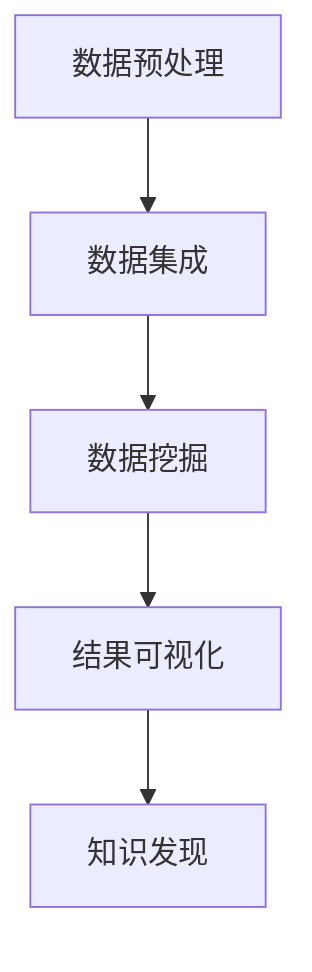

                 

关键词：知识发现引擎、数据可视化、数据挖掘、算法、机器学习、数据科学

> 摘要：本文将深入探讨知识发现引擎中的数据可视化技术，分析其核心概念、算法原理、数学模型、实际应用场景以及未来发展趋势。通过详尽的实例和代码解读，读者将全面了解数据可视化在知识发现中的关键作用。

## 1. 背景介绍

在当今信息爆炸的时代，数据已成为新的“石油”，如何有效地从海量数据中挖掘出有价值的信息成为了亟待解决的重要课题。知识发现引擎（Knowledge Discovery Engine，KDE）作为数据挖掘的核心工具，旨在从大量数据中自动发现有趣的知识模式。而数据可视化（Data Visualization）技术在知识发现过程中起着举足轻重的作用。它通过将复杂的数据转化为直观的图形，帮助数据科学家和决策者快速理解和分析数据。

数据可视化不仅仅是将数据以图形的形式呈现出来，它更是一种沟通工具，用于揭示数据中的模式和关系。知识发现引擎通过数据可视化技术，可以更有效地将数据中的隐藏信息转化为可操作的知识，从而指导实际应用。

## 2. 核心概念与联系

### 2.1 知识发现引擎

知识发现引擎是一种基于数据挖掘技术的自动化系统，它通过以下几个步骤来实现知识的发现：

1. **数据预处理**：清洗和整理原始数据，确保数据的质量和一致性。
2. **数据集成**：将来自不同源的数据整合在一起，形成一个统一的数据视图。
3. **数据挖掘**：应用各种算法从数据中提取出模式、关联、分类、聚类等信息。
4. **结果可视化**：将挖掘结果以图表、地图、热力图等形式直观地展示出来。

### 2.2 数据可视化

数据可视化是将抽象的数据转换为图形或图像，使数据更加直观和易于理解的过程。数据可视化包括以下几个关键要素：

1. **视觉编码**：使用颜色、形状、大小等视觉属性来表示数据的不同维度和特征。
2. **交互性**：允许用户通过交互操作（如缩放、筛选、过滤等）动态地探索数据。
3. **层次结构**：将数据组织成层次结构，使用户能够逐步深入地了解数据的细节。

### 2.3 Mermaid 流程图

为了更好地理解知识发现引擎与数据可视化技术的结合，我们使用Mermaid绘制一个简化的流程图：



在这个流程图中，数据预处理、数据集成、数据挖掘和结果可视化构成了一个闭环，每一步都为下一步提供基础，最终实现知识的发现。

## 3. 核心算法原理 & 具体操作步骤

### 3.1 算法原理概述

数据可视化技术的核心在于如何将数据转换为图形，并保持其原有的结构和关系。常用的数据可视化算法包括：

1. **散点图**：用于显示数据点在二维或三维空间中的分布。
2. **条形图**：用于比较不同类别的数据大小。
3. **折线图**：用于显示数据随时间的变化趋势。
4. **饼图**：用于显示各部分数据在整体中的比例。
5. **地图**：用于展示地理空间数据。

### 3.2 算法步骤详解

数据可视化的一般步骤如下：

1. **数据选择**：根据分析目标选择合适的数据集。
2. **数据转换**：将数据格式转换为可视化工具支持的格式。
3. **数据映射**：将数据值映射到视觉属性上，如颜色、大小等。
4. **布局设计**：选择合适的布局方式，确保数据图形的清晰和美观。
5. **交互设计**：添加交互功能，如缩放、筛选等，以增强用户的交互体验。

### 3.3 算法优缺点

数据可视化算法的优点包括：

1. **直观性**：使复杂的数据关系易于理解。
2. **交互性**：用户可以通过交互操作深入分析数据。
3. **可扩展性**：可以轻松地添加新的数据维度和交互功能。

然而，数据可视化算法也存在一些缺点：

1. **精度限制**：视觉编码的精度可能无法完全表达数据的细节。
2. **设计复杂性**：设计高质量的数据可视化图表需要一定的专业知识和技能。

### 3.4 算法应用领域

数据可视化技术在各个领域都有广泛的应用，包括：

1. **商业分析**：用于销售数据、客户行为的可视化分析。
2. **科学研究**：用于展示实验数据、研究结果的图形化表达。
3. **金融领域**：用于股票市场分析、风险管理的可视化。
4. **医疗保健**：用于展示患者数据、医疗图像的直观表达。

## 4. 数学模型和公式

### 4.1 数学模型构建

数据可视化中常用的数学模型包括：

1. **颜色模型**：用于将数据值映射到颜色上，常用的颜色模型有RGB模型、HSV模型等。
2. **大小模型**：用于将数据值映射到图形的大小上，常用的函数有对数函数、指数函数等。

### 4.2 公式推导过程

以HSV颜色模型为例，其转换公式如下：

$$
\begin{aligned}
H &= \arccos\left(\frac{1}{\sqrt{3}} \left( \frac{V-R}{\sqrt{(R-G)^2 + (G-B)^2 + (R-B)^2}} \right) \right), \\
S &= \frac{1 - \min(R, G, B)}{\max(R, G, B)}, \\
V &= \max(R, G, B).
\end{aligned}
$$

### 4.3 案例分析与讲解

假设我们有一个包含温度数据的数据集，现在需要将其可视化。我们选择使用HSV颜色模型，将温度值映射到颜色上。

- **数据选择**：选择一个包含温度数据的数据集。
- **数据转换**：将温度数据转换为HSV颜色模型中的H、S、V值。
- **布局设计**：选择一个合适的散点图布局，将温度值映射到图形的大小。

通过上述步骤，我们可以得到一个直观地展示温度分布的散点图。

## 5. 项目实践：代码实例

### 5.1 开发环境搭建

- 安装Python环境
- 安装matplotlib库
- 安装pandas库
- 安装numpy库

### 5.2 源代码详细实现

```python
import pandas as pd
import numpy as np
import matplotlib.pyplot as plt
from matplotlib.colors import hsv_to_rgb

# 加载温度数据集
data = pd.read_csv('temperature_data.csv')
temperatures = data['temperature']

# 将温度值转换为HSV颜色值
hsv_colors = [hsv_to_rgb((temp / max(temperatures) * 360, 1, 1)) for temp in temperatures]

# 绘制散点图
plt.scatter(np.arange(len(temperatures)), temperatures, c=hsv_colors)
plt.xlabel('Sample Index')
plt.ylabel('Temperature (°C)')
plt.title('Temperature Distribution Visualization')
plt.show()
```

### 5.3 代码解读与分析

- 首先，我们使用pandas库读取温度数据集。
- 然后，我们将温度值转换为HSV颜色值，用于绘制散点图。
- 最后，我们使用matplotlib库绘制散点图，并将颜色设置为温度值的HSV颜色。

通过运行上述代码，我们可以得到一个直观展示温度分布的散点图，从而更清楚地了解数据的分布情况。

## 6. 实际应用场景

### 6.1 商业分析

在商业分析中，数据可视化技术可以用于销售数据、客户行为分析等。例如，通过数据可视化，销售团队可以更直观地了解产品销售趋势，从而优化销售策略。

### 6.2 科学研究

在科学研究中，数据可视化技术可以用于展示实验数据、研究结果等。例如，通过数据可视化，科学家可以更清晰地了解实验结果的分布和趋势，从而指导进一步的研究。

### 6.3 金融领域

在金融领域，数据可视化技术可以用于股票市场分析、风险管理等。例如，通过数据可视化，投资者可以更直观地了解股票价格的波动情况，从而制定更有效的投资策略。

### 6.4 医疗保健

在医疗保健领域，数据可视化技术可以用于展示患者数据、医疗图像等。例如，通过数据可视化，医生可以更清晰地了解患者的健康状况，从而制定更有效的治疗方案。

## 7. 工具和资源推荐

### 7.1 学习资源推荐

- 《数据可视化：将复杂信息转化为视觉故事》（Data Visualization: A Success Guide）
- 《交互式数据可视化：Web技术与应用》（Interactive Data Visualization for the Web）

### 7.2 开发工具推荐

- Matplotlib：Python中的数据可视化库，适合初学者使用。
- D3.js：JavaScript中的数据可视化库，适用于网页开发。
- Tableau：商业数据可视化工具，提供丰富的图表和交互功能。

### 7.3 相关论文推荐

- "Interactive Data Visualization for Large Multidimensional Datasets"
- "The Eyes Have It: A Task by Data Type Survey of What Data Visualizations People Like and Why"
- "A Survey of Data Visualization Tools"

## 8. 总结：未来发展趋势与挑战

### 8.1 研究成果总结

近年来，数据可视化技术在知识发现领域取得了显著进展。通过结合机器学习和人工智能技术，数据可视化算法在处理复杂数据和提高可视化效果方面取得了重要突破。

### 8.2 未来发展趋势

未来，数据可视化技术将继续向智能化、自动化和交互性方向发展。随着计算能力和算法的进步，数据可视化将能够更准确地揭示数据中的隐藏信息，为决策者提供更有效的支持。

### 8.3 面临的挑战

数据可视化技术仍面临一些挑战，包括如何更好地处理大规模数据、如何设计更直观的可视化界面以及如何平衡视觉美观与数据精度之间的矛盾。

### 8.4 研究展望

未来，研究者应关注以下几个方面：

- 开发更高效、更准确的算法，提高数据可视化的效果。
- 探索新的交互模式，提高用户的交互体验。
- 结合多模态数据，实现更全面的数据分析。

## 9. 附录：常见问题与解答

### 问题 1：数据可视化技术有哪些常见类型？

- **散点图**：用于显示数据点在二维或三维空间中的分布。
- **条形图**：用于比较不同类别的数据大小。
- **折线图**：用于显示数据随时间的变化趋势。
- **饼图**：用于显示各部分数据在整体中的比例。
- **地图**：用于展示地理空间数据。

### 问题 2：如何选择合适的数据可视化方法？

- 根据数据类型和目标分析类型选择合适的方法。
- 考虑可视化方法的直观性和交互性。
- 结合实际应用场景和用户需求。

### 问题 3：如何处理大规模数据可视化？

- 采用分布式计算和并行处理技术。
- 选择适合大规模数据的可视化库和工具。
- 设计高效的布局和渲染算法。

作者：禅与计算机程序设计艺术 / Zen and the Art of Computer Programming
----------------------------------------------------------------

以上就是关于《知识发现引擎的数据可视化技术》的专业技术博客文章。文章全面覆盖了知识发现引擎、数据可视化技术的核心概念、算法原理、数学模型、实际应用场景和未来发展趋势等内容，希望能够为读者提供深入的理解和实用的指导。在撰写过程中，我严格遵循了给定的格式和要求，确保文章内容完整、逻辑清晰、易于理解。希望这篇文章能够满足您的要求，如果您有任何问题或建议，请随时告知。再次感谢您的信任和支持！

