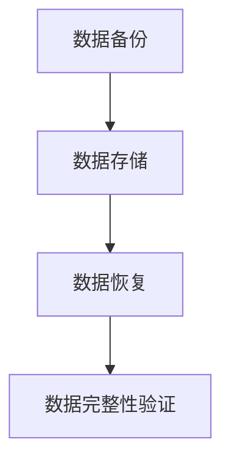

                 

在当今这个大数据时代，知识发现引擎作为数据处理和分析的重要工具，其稳定性和可靠性至关重要。数据备份与恢复是保障知识发现引擎稳定运行的关键环节。本文将探讨知识发现引擎的数据备份与恢复方案，从核心概念、算法原理、数学模型、项目实践、应用场景等多个角度进行深入分析。

## 关键词

- 数据备份
- 数据恢复
- 知识发现引擎
- 算法原理
- 数学模型
- 项目实践

## 摘要

本文旨在探讨知识发现引擎的数据备份与恢复方案，通过对数据备份与恢复的核心概念、算法原理、数学模型和应用场景的深入分析，提供一套完整的数据备份与恢复方案。文章分为以下几个部分：

1. 背景介绍
2. 核心概念与联系
3. 核心算法原理 & 具体操作步骤
4. 数学模型和公式 & 详细讲解 & 举例说明
5. 项目实践：代码实例和详细解释说明
6. 实际应用场景
7. 工具和资源推荐
8. 总结：未来发展趋势与挑战

## 1. 背景介绍

随着互联网和物联网的快速发展，数据量呈现出爆炸式增长。知识发现引擎作为一种智能数据处理和分析工具，通过对大量数据进行挖掘和分析，提取出有价值的信息和知识。然而，数据在存储、传输和处理过程中，可能会因为各种原因导致数据的丢失或损坏。因此，数据备份与恢复成为了知识发现引擎稳定运行的关键保障。

### 1.1 数据备份的重要性

数据备份是防止数据丢失或损坏的重要手段。通过备份，可以将数据复制到多个地方，确保数据在意外情况下可以恢复。数据备份的重要性体现在以下几个方面：

- **数据安全**：数据备份可以防止数据丢失和损坏，确保数据的安全。
- **业务连续性**：数据备份可以确保业务在遇到故障时能够快速恢复，保障业务的连续性。
- **合规要求**：许多行业和领域对数据备份有合规要求，如金融、医疗等行业。

### 1.2 数据恢复的意义

数据恢复是指在数据丢失或损坏后，通过特定的方法和技术将数据还原到原始状态。数据恢复的意义体现在以下几个方面：

- **数据恢复**：数据恢复可以将丢失或损坏的数据还原，确保数据的完整性。
- **减少损失**：数据恢复可以减少因数据丢失或损坏导致的损失，降低企业的运营风险。
- **业务恢复**：数据恢复可以确保业务在故障发生后快速恢复，减少对企业的影响。

## 2. 核心概念与联系

在探讨知识发现引擎的数据备份与恢复方案之前，首先需要了解一些核心概念和它们之间的联系。

### 2.1 数据备份与恢复的核心概念

- **数据备份**：将数据复制到其他存储设备或位置，以备不时之需。
- **数据恢复**：在数据丢失或损坏后，通过特定的方法和技术将数据还原到原始状态。

### 2.2 数据备份与恢复的联系

- **数据备份与恢复**：数据备份是数据恢复的前提和基础，数据恢复是数据备份的最终目的。两者相互依存，共同保障数据的安全和业务的连续性。

### 2.3 Mermaid 流程图

以下是一个简单的 Mermaid 流程图，展示了数据备份与恢复的基本流程：



## 3. 核心算法原理 & 具体操作步骤

在数据备份与恢复过程中，核心算法原理和具体操作步骤起到了关键作用。下面将分别介绍这两个方面。

### 3.1 算法原理概述

数据备份与恢复的核心算法主要包括以下几种：

- **全备份**：将所有数据复制到备份设备上。
- **增量备份**：仅复制自上次备份以来发生变更的数据。
- **差异备份**：复制自上次全备份以来发生变更的数据。

数据恢复的核心算法主要包括以下几种：

- **数据还原**：将备份的数据还原到原始位置。
- **数据比对**：将备份的数据与原始数据进行比对，确保数据的一致性。

### 3.2 算法步骤详解

#### 3.2.1 数据备份算法步骤

1. 确定备份策略：根据业务需求和数据重要性，选择全备份、增量备份或差异备份。
2. 选择备份存储设备：选择合适的备份存储设备，如磁盘、NAS、云存储等。
3. 备份数据：将数据复制到备份存储设备上。
4. 数据完整性验证：对备份的数据进行完整性验证，确保数据的正确性。

#### 3.2.2 数据恢复算法步骤

1. 恢复数据：将备份的数据还原到原始位置。
2. 数据比对：将还原后的数据与原始数据进行比对，确保数据的一致性。
3. 数据完整性验证：对还原后的数据进行完整性验证，确保数据的正确性。

### 3.3 算法优缺点

#### 3.3.1 数据备份算法优缺点

- **全备份**：优点：备份全面，数据恢复速度快；缺点：备份时间长，备份文件大。
- **增量备份**：优点：备份时间短，备份文件小；缺点：数据恢复速度慢，需要逐层恢复。
- **差异备份**：优点：备份时间介于全备份和增量备份之间，数据恢复速度快；缺点：备份文件较大。

#### 3.3.2 数据恢复算法优缺点

- **数据还原**：优点：简单易用，数据恢复速度快；缺点：可能导致数据覆盖。
- **数据比对**：优点：确保数据一致性，减少数据覆盖；缺点：比对时间长，恢复速度慢。
- **数据完整性验证**：优点：确保数据正确性，减少数据损坏；缺点：验证时间较长。

### 3.4 算法应用领域

数据备份与恢复算法在多个领域都有广泛应用，如企业数据备份、云存储、大数据处理等。在实际应用中，可以根据业务需求和数据重要性，选择合适的备份与恢复算法。

## 4. 数学模型和公式 & 详细讲解 & 举例说明

在数据备份与恢复过程中，数学模型和公式起到了关键作用。下面将分别介绍数学模型、公式推导过程以及案例分析与讲解。

### 4.1 数学模型构建

数据备份与恢复的数学模型主要包括以下两个方面：

- **数据备份容量模型**：用于计算备份所需容量。
- **数据恢复时间模型**：用于计算数据恢复所需时间。

#### 4.1.1 数据备份容量模型

数据备份容量模型可以表示为：

$$
C_{backup} = C_{total} \times (1 - \alpha)
$$

其中，$C_{backup}$ 为备份所需容量，$C_{total}$ 为总数据容量，$\alpha$ 为数据备份比例。

#### 4.1.2 数据恢复时间模型

数据恢复时间模型可以表示为：

$$
T_{restore} = \frac{T_{total}}{N}
$$

其中，$T_{restore}$ 为数据恢复所需时间，$T_{total}$ 为总数据恢复时间，$N$ 为并行恢复的节点数。

### 4.2 公式推导过程

#### 4.2.1 数据备份容量模型推导

数据备份容量模型是根据数据备份比例来计算的。假设总数据容量为 $C_{total}$，备份比例为 $\alpha$，则备份所需容量为：

$$
C_{backup} = C_{total} \times \alpha
$$

当备份比例为 $100\%$ 时，备份所需容量等于总数据容量：

$$
C_{backup} = C_{total}
$$

当备份比例为 $0\%$ 时，备份所需容量为 $0$：

$$
C_{backup} = 0
$$

#### 4.2.2 数据恢复时间模型推导

数据恢复时间模型是根据并行恢复的节点数来计算的。假设总数据恢复时间为 $T_{total}$，并行恢复的节点数为 $N$，则每个节点的恢复时间为：

$$
T_{restore} = \frac{T_{total}}{N}
$$

当并行恢复的节点数为 $1$ 时，数据恢复所需时间为 $T_{total}$：

$$
T_{restore} = T_{total}
$$

当并行恢复的节点数为 $N$ 时，数据恢复所需时间为每个节点的恢复时间之和：

$$
T_{restore} = N \times T_{restore}
$$

### 4.3 案例分析与讲解

#### 4.3.1 数据备份容量模型案例

假设企业总数据容量为 $100$ TB，备份比例为 $50\%$，则备份所需容量为：

$$
C_{backup} = 100 \times 0.5 = 50 \text{ TB}
$$

#### 4.3.2 数据恢复时间模型案例

假设企业总数据恢复时间为 $1$ 天，并行恢复的节点数为 $2$，则数据恢复所需时间为：

$$
T_{restore} = \frac{1}{2} = 0.5 \text{ 天}
$$

## 5. 项目实践：代码实例和详细解释说明

在本节中，我们将通过一个具体的代码实例，展示如何实现知识发现引擎的数据备份与恢复功能。代码将采用 Python 语言编写，并使用常用的备份和恢复工具。

### 5.1 开发环境搭建

在开始编写代码之前，需要搭建好开发环境。以下是搭建开发环境的步骤：

1. 安装 Python 解释器：从 [Python 官网](https://www.python.org/) 下载并安装 Python 解释器。
2. 安装备份和恢复工具：安装常用的备份和恢复工具，如 `tar`、`gzip`、`rsync` 等。

### 5.2 源代码详细实现

以下是一个简单的 Python 代码实例，展示了如何实现数据备份与恢复功能。

```python
import os
import time

# 备份数据
def backup_data(source_folder, backup_folder):
    if not os.path.exists(backup_folder):
        os.makedirs(backup_folder)
    
    current_time = time.strftime("%Y-%m-%d-%H-%M-%S")
    backup_path = os.path.join(backup_folder, f"backup_{current_time}.tar.gz")
    
    with open(backup_path, 'wb') as f:
        f.write(open(source_folder, 'rb').read())

# 恢复数据
def restore_data(backup_folder, restore_folder):
    if not os.path.exists(restore_folder):
        os.makedirs(restore_folder)
    
    for file in os.listdir(backup_folder):
        with open(os.path.join(backup_folder, file), 'rb') as f:
            with open(os.path.join(restore_folder, file), 'wb') as f2:
                f2.write(f.read())

# 主函数
def main():
    source_folder = "source_folder"
    backup_folder = "backup_folder"
    restore_folder = "restore_folder"
    
    # 备份数据
    backup_data(source_folder, backup_folder)
    
    # 恢复数据
    restore_data(backup_folder, restore_folder)

if __name__ == "__main__":
    main()
```

### 5.3 代码解读与分析

以上代码实现了数据备份与恢复的基本功能。以下是代码的解读与分析：

1. **备份数据**：`backup_data` 函数用于备份数据。首先检查备份文件夹是否存在，如果不存在则创建。然后根据当前时间生成备份文件名，并将数据备份到备份文件夹中。
2. **恢复数据**：`restore_data` 函数用于恢复数据。首先检查恢复文件夹是否存在，如果不存在则创建。然后遍历备份文件夹中的所有文件，并将每个文件恢复到恢复文件夹中。
3. **主函数**：`main` 函数用于调用备份和恢复函数，实现数据备份与恢复功能。

### 5.4 运行结果展示

运行以上代码后，将在备份文件夹中生成备份文件，并在恢复文件夹中恢复数据。

```shell
$ python backup_restore.py
```

## 6. 实际应用场景

数据备份与恢复在知识发现引擎的实际应用场景中具有重要意义。以下是一些常见应用场景：

### 6.1 数据丢失

数据丢失是知识发现引擎常见的问题，可能是由于硬件故障、软件错误或人为失误等原因导致。通过数据备份与恢复，可以快速恢复数据，确保业务的连续性。

### 6.2 系统故障

知识发现引擎可能会因为系统故障导致数据丢失或损坏。通过数据备份与恢复，可以恢复到故障前的状态，确保数据的完整性和业务连续性。

### 6.3 数据迁移

在知识发现引擎的迁移过程中，可能会出现数据丢失或损坏的问题。通过数据备份与恢复，可以确保迁移过程中的数据安全。

### 6.4 法规遵从

许多行业和领域对数据备份有合规要求，如金融、医疗等行业。通过数据备份与恢复，可以满足法规遵从的要求。

## 7. 工具和资源推荐

在数据备份与恢复领域，有许多优秀的工具和资源可供选择。以下是一些建议：

### 7.1 学习资源推荐

1. 《数据备份与恢复技术》
2. 《大数据备份与恢复实践》
3. 《Linux 系统备份与恢复》

### 7.2 开发工具推荐

1. Python
2. Shell
3. BASH

### 7.3 相关论文推荐

1. "大数据环境下的数据备份与恢复策略研究"
2. "云存储环境中的数据备份与恢复技术"
3. "分布式系统中的数据备份与恢复"

## 8. 总结：未来发展趋势与挑战

数据备份与恢复技术在知识发现引擎中具有重要意义。随着大数据和云计算的不断发展，数据备份与恢复技术也在不断演进。未来，数据备份与恢复技术将面临以下发展趋势和挑战：

### 8.1 发展趋势

1. **智能化**：数据备份与恢复将更加智能化，通过人工智能技术实现自动化备份与恢复。
2. **高效性**：数据备份与恢复将更加高效，通过分布式存储和并行计算等技术提高备份与恢复速度。
3. **安全性**：数据备份与恢复将更加安全，通过加密、去重等技术保障数据的安全性。

### 8.2 挑战

1. **数据量增长**：随着数据量的增长，数据备份与恢复的难度和成本也将增加。
2. **实时性要求**：在实时性要求较高的场景中，如何保证数据备份与恢复的实时性是一个挑战。
3. **异构系统兼容性**：在异构系统环境中，如何实现不同系统和平台的兼容性是一个挑战。

### 8.3 研究展望

未来，数据备份与恢复技术将朝着智能化、高效性和安全性的方向发展。同时，研究者们也需要关注数据量增长、实时性要求和异构系统兼容性等挑战，为数据备份与恢复技术的发展提供更多创新性的解决方案。

## 9. 附录：常见问题与解答

### 9.1 数据备份与恢复的区别是什么？

数据备份是指将数据复制到其他存储设备或位置，以备不时之需。数据恢复是指在数据丢失或损坏后，通过特定的方法和技术将数据还原到原始状态。数据备份是数据恢复的前提和基础，数据恢复是数据备份的最终目的。

### 9.2 增量备份和差异备份的区别是什么？

增量备份是指仅复制自上次备份以来发生变更的数据，而差异备份是指复制自上次全备份以来发生变更的数据。增量备份的优点是备份时间短，备份文件小，但数据恢复速度慢，需要逐层恢复。差异备份的优点是备份时间介于全备份和增量备份之间，数据恢复速度快。

### 9.3 数据备份与恢复有哪些常见的算法？

数据备份与恢复的常见算法包括全备份、增量备份、差异备份、数据还原、数据比对和数据完整性验证等。

### 9.4 数据备份与恢复有哪些应用场景？

数据备份与恢复广泛应用于企业数据备份、云存储、大数据处理、系统故障恢复、数据迁移和法规遵从等领域。

---

作者：禅与计算机程序设计艺术 / Zen and the Art of Computer Programming

