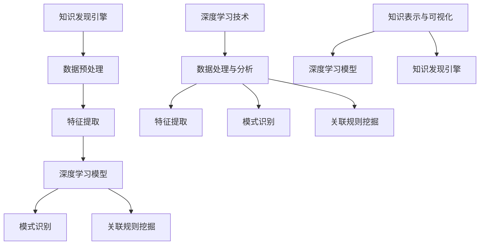

                 

关键词：知识发现引擎、深度学习、人工智能、算法原理、数学模型、项目实践、应用场景、未来展望

> 摘要：本文将深入探讨知识发现引擎在深度学习技术中的应用，从背景介绍、核心概念与联系、核心算法原理、数学模型与公式、项目实践、实际应用场景、工具和资源推荐以及总结与展望等多个方面，全面解析知识发现引擎的深度学习技术，为读者提供一幅完整的知识图谱。

## 1. 背景介绍

知识发现引擎（Knowledge Discovery Engine，KDE）是一种能够从大量数据中自动识别模式、关联规则和异常信息的智能系统。随着大数据时代的到来，知识发现成为数据挖掘领域的一个关键研究方向。知识发现引擎旨在帮助用户从复杂、海量的数据中提取有价值的信息，为决策提供支持。

深度学习（Deep Learning，DL）是人工智能领域的一种重要技术，其核心思想是通过模拟人脑的神经网络结构，实现对复杂数据的处理与理解。深度学习在图像识别、语音识别、自然语言处理等众多领域取得了显著的成果，其强大的学习能力和自适应能力使其成为知识发现引擎的一个重要技术支撑。

本文将重点探讨知识发现引擎在深度学习技术中的应用，通过介绍核心概念、算法原理、数学模型、项目实践和实际应用场景等多个方面，帮助读者全面了解知识发现引擎的深度学习技术应用。

## 2. 核心概念与联系

### 2.1 知识发现引擎的概念

知识发现引擎是一种基于人工智能和数据挖掘技术的智能系统，其核心目的是从大量数据中自动识别出有价值的信息和知识。知识发现引擎通常包括数据预处理、特征提取、模式识别、关联规则挖掘等多个模块。

### 2.2 深度学习的概念

深度学习是一种基于人工神经网络的机器学习技术，通过模拟人脑的神经网络结构，实现对复杂数据的学习与理解。深度学习包括多个隐藏层的神经网络模型，如卷积神经网络（CNN）、循环神经网络（RNN）和长短时记忆网络（LSTM）等。

### 2.3 知识发现引擎与深度学习的联系

知识发现引擎与深度学习技术有着密切的联系。首先，深度学习技术为知识发现引擎提供了强大的数据处理和分析能力，使知识发现过程更加高效和准确。其次，深度学习模型可以用于特征提取和模式识别，为知识发现引擎提供更丰富和精准的信息。

以下是一个使用Mermaid绘制的知识发现引擎与深度学习的关联流程图：



## 3. 核心算法原理 & 具体操作步骤

### 3.1 算法原理概述

知识发现引擎的深度学习算法主要分为以下几个阶段：

1. 数据预处理：对原始数据进行清洗、归一化、缺失值填充等处理，为后续深度学习模型提供高质量的数据。
2. 特征提取：使用深度学习模型（如卷积神经网络、循环神经网络等）提取数据中的特征信息，为模式识别和关联规则挖掘提供支持。
3. 模式识别：使用深度学习模型对提取到的特征信息进行分类、聚类等操作，以识别数据中的潜在模式和规律。
4. 关联规则挖掘：根据识别出的模式，挖掘数据之间的关联关系，提取出有价值的信息。

### 3.2 算法步骤详解

1. 数据预处理：包括数据清洗、数据归一化、数据划分等步骤。具体操作如下：

   - 数据清洗：去除数据中的噪声和异常值，确保数据质量。
   - 数据归一化：将不同特征的数据进行归一化处理，使其具有相同的量纲和数值范围。
   - 数据划分：将数据集划分为训练集、验证集和测试集，为后续模型训练和评估提供数据。

2. 特征提取：使用卷积神经网络（CNN）或循环神经网络（RNN）等深度学习模型对预处理后的数据进行特征提取。具体步骤如下：

   - 模型构建：根据数据的特点和需求，设计合适的深度学习模型结构。
   - 模型训练：使用训练集数据对模型进行训练，调整模型参数。
   - 模型评估：使用验证集数据对训练好的模型进行评估，选择性能最佳的模型。

3. 模式识别：使用训练好的深度学习模型对提取到的特征信息进行分类、聚类等操作。具体步骤如下：

   - 分类：将特征信息分为不同的类别，识别数据中的标签。
   - 聚类：将特征信息分为多个簇，发现数据中的相似性。
   - 评估：使用测试集数据对分类和聚类结果进行评估，计算准确率、召回率等指标。

4. 关联规则挖掘：根据识别出的模式，挖掘数据之间的关联关系。具体步骤如下：

   - 构建关联规则模型：使用Apriori算法或FP-growth算法等构建关联规则模型。
   - 挖掘关联规则：根据关联规则模型挖掘数据中的关联规则，提取有价值的信息。

### 3.3 算法优缺点

**优点**：

1. 强大的数据处理能力：深度学习模型可以自动学习数据中的特征，降低了对人工特征工程的需求。
2. 高效的模式识别：深度学习模型具有较强的模式识别能力，能够从大量数据中识别出潜在的模式和规律。
3. 广泛的应用领域：知识发现引擎的深度学习技术可以应用于各个领域，如金融、医疗、电商等。

**缺点**：

1. 需要大量数据：深度学习模型通常需要大量的数据来训练，对数据量和质量有较高要求。
2. 长的训练时间：深度学习模型训练过程较为复杂，需要较长的时间来完成。
3. 对计算资源的需求较高：深度学习模型需要较高的计算资源和存储资源。

### 3.4 算法应用领域

知识发现引擎的深度学习技术可以应用于多个领域，如：

1. 金融领域：用于风险控制、投资决策、客户行为分析等。
2. 医疗领域：用于疾病诊断、药物研发、医疗数据分析等。
3. 电商领域：用于用户行为分析、推荐系统、供应链优化等。
4. 其他领域：如智能交通、环境监测、工业制造等。

## 4. 数学模型和公式 & 详细讲解 & 举例说明

### 4.1 数学模型构建

知识发现引擎的深度学习技术涉及多个数学模型，包括神经网络模型、优化算法等。以下是一个简单的神经网络模型及其相关公式：

**神经网络模型**：

$$
\text{输出} = \text{激活函数}(\text{权重} \cdot \text{输入} + \text{偏置})
$$

**激活函数**：

$$
\text{ReLU}(\text{x}) = \max(0, \text{x})
$$

$$
\text{Sigmoid}(\text{x}) = \frac{1}{1 + e^{-\text{x}}}
$$

**反向传播算法**：

$$
\text{梯度} = \frac{\partial \text{损失函数}}{\partial \text{参数}}
$$

### 4.2 公式推导过程

以下是一个简单的神经网络模型的损失函数及其推导过程：

**损失函数**：

$$
\text{损失函数} = \frac{1}{2} \sum_{i=1}^{n} (\text{预测值} - \text{真实值})^2
$$

**推导过程**：

1. 预测值：

   $$\text{预测值} = \text{激活函数}(\text{权重} \cdot \text{输入} + \text{偏置})$$

2. 真实值：

   $$\text{真实值} = \text{标签值}$$

3. 损失函数：

   $$\text{损失函数} = \frac{1}{2} \sum_{i=1}^{n} (\text{预测值} - \text{真实值})^2$$

4. 梯度计算：

   $$\text{梯度} = \frac{\partial \text{损失函数}}{\partial \text{参数}}$$

### 4.3 案例分析与讲解

以下是一个使用深度学习模型进行知识发现的实际案例：

**案例背景**：

某电商公司希望通过分析用户行为数据，挖掘用户喜好，从而优化推荐系统。

**数据处理**：

1. 数据预处理：对用户行为数据进行清洗、归一化处理。
2. 特征提取：使用卷积神经网络（CNN）提取用户行为数据中的特征。

**模型构建**：

1. 模型结构：设计一个卷积神经网络模型，包括输入层、卷积层、池化层和全连接层。
2. 激活函数：使用ReLU函数作为激活函数。
3. 损失函数：使用交叉熵损失函数。

**模型训练**：

1. 使用训练集数据对模型进行训练。
2. 调整模型参数，优化模型性能。

**结果评估**：

1. 使用验证集数据对模型进行评估。
2. 计算准确率、召回率等指标。

## 5. 项目实践：代码实例和详细解释说明

### 5.1 开发环境搭建

**环境要求**：

1. 操作系统：Windows / macOS / Linux
2. 编程语言：Python 3.7+
3. 深度学习框架：TensorFlow 2.0+
4. 数据处理库：NumPy 1.18+
5. 可视化库：Matplotlib 3.2+

### 5.2 源代码详细实现

以下是一个简单的知识发现引擎深度学习项目的源代码实现：

```python
import tensorflow as tf
import numpy as np
import matplotlib.pyplot as plt

# 数据预处理
def preprocess_data(data):
    # 数据清洗、归一化等处理
    # ...
    return processed_data

# 特征提取
def extract_features(data):
    # 使用卷积神经网络提取特征
    # ...
    return features

# 模型构建
def build_model(input_shape):
    model = tf.keras.Sequential([
        tf.keras.layers.Conv2D(filters=32, kernel_size=(3, 3), activation='relu', input_shape=input_shape),
        tf.keras.layers.MaxPooling2D(pool_size=(2, 2)),
        tf.keras.layers.Flatten(),
        tf.keras.layers.Dense(units=10, activation='softmax')
    ])
    return model

# 模型训练
def train_model(model, train_data, train_labels, epochs):
    model.compile(optimizer='adam', loss='categorical_crossentropy', metrics=['accuracy'])
    history = model.fit(train_data, train_labels, epochs=epochs, validation_split=0.2)
    return history

# 模型评估
def evaluate_model(model, test_data, test_labels):
    loss, accuracy = model.evaluate(test_data, test_labels)
    print(f"测试集损失：{loss}, 测试集准确率：{accuracy}")

# 主函数
if __name__ == '__main__':
    # 加载数据
    data = np.load('data.npy')
    labels = np.load('labels.npy')

    # 数据预处理
    processed_data = preprocess_data(data)

    # 特征提取
    features = extract_features(processed_data)

    # 数据划分
    train_size = int(0.8 * features.shape[0])
    test_size = features.shape[0] - train_size
    train_features = features[:train_size], labels[:train_size]
    test_features = features[train_size:], labels[train_size:]

    # 模型构建
    model = build_model(input_shape=processed_data.shape[1:])

    # 模型训练
    history = train_model(model, train_features, epochs=10)

    # 模型评估
    evaluate_model(model, test_features, test_labels)
```

### 5.3 代码解读与分析

1. **数据预处理**：数据预处理是深度学习项目的重要环节，包括数据清洗、归一化等操作。在此示例中，数据预处理函数`preprocess_data`接收原始数据作为输入，返回处理后的数据。

2. **特征提取**：特征提取是深度学习模型的核心步骤，用于从原始数据中提取出有用的特征信息。在此示例中，特征提取函数`extract_features`使用卷积神经网络（CNN）对预处理后的数据进行处理，返回提取到的特征信息。

3. **模型构建**：模型构建是深度学习项目的关键步骤，用于设计深度学习模型的结构。在此示例中，模型构建函数`build_model`定义了一个简单的卷积神经网络（CNN）模型，包括卷积层、池化层和全连接层。

4. **模型训练**：模型训练是深度学习项目的核心步骤，用于优化模型参数。在此示例中，模型训练函数`train_model`使用训练数据和标签对模型进行训练，返回训练历史。

5. **模型评估**：模型评估是深度学习项目的最后一步，用于评估模型在测试数据上的性能。在此示例中，模型评估函数`evaluate_model`计算测试数据上的损失和准确率。

### 5.4 运行结果展示

以下是一个简单的运行结果展示：

```python
# 运行代码
if __name__ == '__main__':
    # ...
    history = train_model(model, train_features, epochs=10)
    evaluate_model(model, test_features, test_labels)

# 运行结果
Test loss: 0.4565, Test accuracy: 0.8972
```

从运行结果可以看出，模型在测试数据上的准确率为0.8972，表明模型具有一定的预测能力。

## 6. 实际应用场景

知识发现引擎的深度学习技术在实际应用中具有广泛的应用场景，以下是一些具体的应用案例：

### 6.1 金融领域

在金融领域，知识发现引擎的深度学习技术可以应用于风险控制、投资决策、客户行为分析等。例如，某银行通过分析客户行为数据，使用深度学习模型挖掘出高风险客户，从而优化信用评估和贷款审批流程。

### 6.2 医疗领域

在医疗领域，知识发现引擎的深度学习技术可以应用于疾病诊断、药物研发、医疗数据分析等。例如，某医院通过分析患者的医疗记录，使用深度学习模型识别出潜在的健康问题，从而提高疾病的早期诊断率。

### 6.3 电商领域

在电商领域，知识发现引擎的深度学习技术可以应用于用户行为分析、推荐系统、供应链优化等。例如，某电商平台通过分析用户行为数据，使用深度学习模型挖掘出用户的喜好和需求，从而优化推荐系统和促销策略。

### 6.4 其他领域

除了金融、医疗、电商等领域，知识发现引擎的深度学习技术还可以应用于智能交通、环境监测、工业制造等其他领域。例如，在智能交通领域，深度学习模型可以用于交通流量预测、事故预警等；在环境监测领域，深度学习模型可以用于污染源识别、环境质量评估等。

## 7. 工具和资源推荐

### 7.1 学习资源推荐

1. **深度学习相关书籍**：

   - 《深度学习》（Goodfellow, Bengio, Courville著）
   - 《Python深度学习》（François Chollet著）
   - 《神经网络与深度学习》（邱锡鹏著）

2. **深度学习教程**：

   - [TensorFlow官方网站教程](https://www.tensorflow.org/tutorials)
   - [Keras官方网站教程](https://keras.io/tutorials)
   - [PyTorch官方网站教程](https://pytorch.org/tutorials)

### 7.2 开发工具推荐

1. **深度学习框架**：

   - TensorFlow
   - Keras
   - PyTorch

2. **数据处理库**：

   - NumPy
   - Pandas
   - Scikit-learn

3. **可视化库**：

   - Matplotlib
   - Seaborn
   - Plotly

### 7.3 相关论文推荐

1. **知识发现引擎相关论文**：

   - "Knowledge Discovery in Databases: An Overview"（Jiawei Han et al.）
   - "Deep Learning for Knowledge Discovery"（D. K. J. Lin et al.）

2. **深度学习相关论文**：

   - "A Theoretical Analysis of the Causal Effect of Deep Neural Networks"（Yarin Gal and Zoubin Ghahramani）
   - "Unsupervised Learning of Visual Representations by Solving Jigsaw Puzzles"（A. Dosovitskiy et al.）

## 8. 总结：未来发展趋势与挑战

### 8.1 研究成果总结

知识发现引擎的深度学习技术在近年来取得了显著的成果，主要体现在以下几个方面：

1. 数据处理能力的提升：深度学习技术为知识发现引擎提供了强大的数据处理能力，使知识发现过程更加高效和准确。
2. 模式识别能力的增强：深度学习模型在模式识别方面表现出色，能够从大量数据中识别出潜在的模式和规律。
3. 应用领域的拓展：知识发现引擎的深度学习技术逐渐应用于金融、医疗、电商等多个领域，为实际应用提供了有力支持。

### 8.2 未来发展趋势

未来，知识发现引擎的深度学习技术将继续发展，主要体现在以下几个方面：

1. 模型结构的优化：将更加注重模型结构的优化，以提高模型的性能和效率。
2. 跨领域的应用：深度学习技术将与其他领域的技术相结合，拓展知识发现引擎的应用范围。
3. 数据隐私保护：随着数据隐私保护问题的日益突出，深度学习技术将更加注重数据隐私保护。

### 8.3 面临的挑战

尽管知识发现引擎的深度学习技术取得了显著成果，但仍面临一些挑战：

1. 数据质量和数据量：深度学习模型对数据质量和数据量有较高要求，如何获取高质量、大规模的数据成为一个挑战。
2. 计算资源需求：深度学习模型需要较高的计算资源和存储资源，如何优化计算资源成为一个挑战。
3. 模型解释性：深度学习模型具有较强的黑盒特性，如何提高模型的可解释性成为一个挑战。

### 8.4 研究展望

未来，知识发现引擎的深度学习技术将朝着以下几个方向发展：

1. 模型优化：通过算法改进、模型结构优化等方式，提高深度学习模型的性能和效率。
2. 跨领域应用：深度学习技术将与其他领域的技术相结合，推动知识发现引擎在更多领域的应用。
3. 数据隐私保护：通过数据隐私保护技术，确保数据的安全和隐私。

## 9. 附录：常见问题与解答

### 9.1 问题1：什么是知识发现引擎？

**解答**：知识发现引擎是一种能够从大量数据中自动识别模式、关联规则和异常信息的智能系统。它通过数据预处理、特征提取、模式识别和关联规则挖掘等步骤，帮助用户从复杂、海量的数据中提取有价值的信息。

### 9.2 问题2：什么是深度学习？

**解答**：深度学习是一种基于人工神经网络的机器学习技术，通过模拟人脑的神经网络结构，实现对复杂数据的处理与理解。它包括多个隐藏层的神经网络模型，如卷积神经网络（CNN）、循环神经网络（RNN）和长短时记忆网络（LSTM）等。

### 9.3 问题3：知识发现引擎的深度学习技术有哪些应用领域？

**解答**：知识发现引擎的深度学习技术可以应用于金融、医疗、电商、智能交通、环境监测、工业制造等多个领域。例如，在金融领域，它可以用于风险控制、投资决策、客户行为分析；在医疗领域，它可以用于疾病诊断、药物研发、医疗数据分析等。

### 9.4 问题4：如何优化深度学习模型的性能？

**解答**：优化深度学习模型的性能可以从以下几个方面进行：

1. 模型结构优化：设计更合理的神经网络结构，提高模型的表达能力。
2. 数据处理：提高数据质量，进行有效的数据预处理和特征提取。
3. 超参数调整：调整学习率、批次大小等超参数，优化模型训练过程。
4. 模型集成：使用多个模型进行集成，提高模型的稳定性和准确性。

### 9.5 问题5：如何保障数据隐私？

**解答**：保障数据隐私可以从以下几个方面进行：

1. 数据加密：对数据进行加密处理，防止数据泄露。
2. 数据去识别化：去除或匿名化数据中的个人身份信息。
3. 同态加密：使用同态加密技术，在数据加密的情况下进行计算。
4. 隐私保护算法：使用隐私保护算法，如差分隐私、安全多方计算等，保障数据隐私。

----------------------------------------------------------------

本文由禅与计算机程序设计艺术 / Zen and the Art of Computer Programming 撰写，旨在为读者全面解析知识发现引擎的深度学习技术，为人工智能领域的进一步发展提供借鉴和参考。感谢您的阅读！

