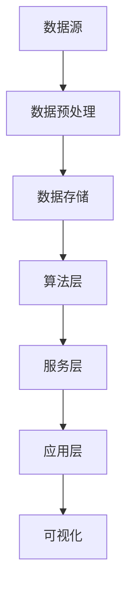

                 

在当今快速发展的移动时代，知识发现引擎作为企业、学术研究以及个人数据挖掘和分析的核心工具，其移动端适配策略的优化显得尤为重要。本文旨在探讨知识发现引擎在移动端的高效适配策略，分析其核心概念、算法原理、数学模型及实际应用，并提出未来的发展趋势与挑战。

> 关键词：知识发现引擎，移动端适配，算法优化，数学模型，实际应用

> 摘要：本文首先介绍了知识发现引擎的基本概念和其在移动端的重要性，随后详细探讨了移动端适配策略的核心算法原理和具体操作步骤，并通过数学模型和公式进行了详细讲解。此外，本文提供了代码实例和详细解释，展示了知识发现引擎在移动端的应用场景。最后，文章总结了研究成果，探讨了未来发展趋势与挑战，并为读者推荐了相关的工具和资源。

## 1. 背景介绍

知识发现引擎是一种能够从大量数据中自动识别模式、关联和趋势的智能系统。其核心功能包括数据预处理、模式识别、关联规则挖掘、聚类分析、分类预测等。随着移动设备的普及，用户对知识发现引擎的移动端访问需求日益增长。然而，移动端与桌面端在硬件资源、网络环境和用户习惯等方面存在显著差异，使得知识发现引擎在移动端的适配成为一个复杂且具有挑战性的问题。

移动端适配策略的目标是确保知识发现引擎在移动设备上运行高效、稳定，同时提供良好的用户体验。本文将从以下几个方面展开讨论：

1. **核心概念与联系**：介绍知识发现引擎的关键概念和组成部分，并展示其架构的 Mermaid 流程图。
2. **核心算法原理 & 具体操作步骤**：阐述知识发现引擎的核心算法原理，并详细描述其操作步骤。
3. **数学模型和公式 & 详细讲解 & 举例说明**：构建数学模型，推导相关公式，并通过案例进行详细讲解。
4. **项目实践：代码实例和详细解释说明**：提供实际代码实例，并进行详细解读与分析。
5. **实际应用场景**：探讨知识发现引擎在移动端的具体应用场景。
6. **未来应用展望**：分析知识发现引擎在移动端的发展趋势和潜在应用。
7. **工具和资源推荐**：推荐相关的学习资源、开发工具和论文。
8. **总结：未来发展趋势与挑战**：总结研究成果，探讨未来发展趋势和面临的挑战。

### 1.1 知识发现引擎的定义与核心功能

知识发现引擎（Knowledge Discovery Engine，简称KDE）是一种能够自动从大量数据中识别有用信息和知识的技术。其核心功能包括数据预处理、模式识别、关联规则挖掘、聚类分析、分类预测等。

- **数据预处理**：清洗和转换原始数据，使其适合后续的分析。
- **模式识别**：识别数据中的规律和模式，如常见的序列模式、时间序列模式等。
- **关联规则挖掘**：发现数据中不同变量之间的关联关系，如购物篮分析。
- **聚类分析**：将相似的数据分组，如顾客细分、市场细分等。
- **分类预测**：基于现有数据对新数据进行分析和预测，如分类、回归分析等。

### 1.2 移动端适配的重要性

随着移动互联网的快速发展，移动设备已成为人们获取信息、进行数据分析和决策的主要工具。移动端适配策略的重要性体现在以下几个方面：

1. **用户体验**：移动端适配能够提高用户体验，满足用户在移动设备上的访问需求。
2. **性能优化**：针对移动设备的硬件资源限制，优化知识发现引擎的运行效率。
3. **灵活性与可扩展性**：适应不同的移动设备和操作系统，提高系统的灵活性和可扩展性。
4. **实时性**：满足移动用户对实时数据分析和决策的需求。

### 1.3 移动端适配的挑战

移动端适配策略面临着一系列的挑战：

1. **硬件资源限制**：移动设备通常具有有限的计算能力和存储空间，需要优化算法和系统架构。
2. **网络环境差异**：移动网络信号不稳定，需要设计高效的数据传输和缓存策略。
3. **用户习惯差异**：移动用户通常具有碎片化的时间习惯，需要设计简洁易用的界面和操作流程。
4. **安全问题**：移动端数据安全和隐私保护需要特别的关注和设计。

## 2. 核心概念与联系

在探讨知识发现引擎的移动端适配策略之前，我们需要了解其核心概念和组成部分，并展示其架构的 Mermaid 流程图。

### 2.1 核心概念

1. **数据源**：知识发现引擎的数据源可以是结构化数据、非结构化数据或半结构化数据，如数据库、文本、图像、音频等。
2. **数据预处理**：包括数据清洗、数据转换和数据归一化等步骤，以使数据适合后续分析。
3. **模式识别**：使用机器学习和数据挖掘技术识别数据中的模式和规律。
4. **关联规则挖掘**：基于Apriori算法、FP-growth算法等发现数据中的关联规则。
5. **聚类分析**：使用K-means算法、层次聚类算法等将相似的数据分组。
6. **分类预测**：基于分类算法（如决策树、随机森林、支持向量机等）对新数据进行预测。
7. **可视化**：通过图表、地图等形式将分析结果展示给用户。

### 2.2 核心组成部分

知识发现引擎的核心组成部分包括：

1. **数据层**：负责数据存储、管理和访问，通常采用数据库系统。
2. **算法层**：包括各种数据挖掘算法和机器学习算法，如Apriori、K-means、SVM等。
3. **服务层**：提供各种数据挖掘功能，如数据预处理、模式识别、关联规则挖掘等。
4. **应用层**：为用户提供可视化界面和交互功能。

### 2.3 Mermaid 流程图



图2.1 知识发现引擎的 Mermaid 流程图

## 3. 核心算法原理 & 具体操作步骤

### 3.1 算法原理概述

知识发现引擎的核心算法包括数据预处理、模式识别、关联规则挖掘、聚类分析和分类预测。每种算法都有其独特的原理和适用场景。

1. **数据预处理**：包括数据清洗、数据转换和数据归一化等步骤。数据清洗旨在去除噪声和不完整数据，数据转换将不同类型的数据统一为标准格式，数据归一化则将不同量纲的数据标准化，以消除数据间的差异。

2. **模式识别**：利用机器学习和数据挖掘技术从大量数据中识别出有意义的模式和规律。常见的模式识别算法包括K最近邻（KNN）、支持向量机（SVM）、决策树等。

3. **关联规则挖掘**：基于Apriori算法、FP-growth算法等发现数据中的关联关系。这些算法能够识别出频繁出现的组合，并提取出有价值的关联规则。

4. **聚类分析**：使用K-means算法、层次聚类算法等将相似的数据分组。聚类分析旨在发现数据中的内在结构，帮助用户更好地理解数据。

5. **分类预测**：基于分类算法（如决策树、随机森林、支持向量机等）对新数据进行预测。分类预测有助于预测未来的趋势和做出决策。

### 3.2 算法步骤详解

#### 数据预处理

1. **数据清洗**：处理缺失值、异常值和重复值。
2. **数据转换**：将数据统一为标准格式，如数值化、编码等。
3. **数据归一化**：消除数据量纲的影响，如采用最小-最大缩放、Z-score标准化等。

#### 模式识别

1. **特征选择**：选择对目标变量影响较大的特征，以减少计算复杂度和提高预测准确性。
2. **模型训练**：使用训练数据集对机器学习模型进行训练。
3. **模型评估**：使用验证数据集对模型进行评估和调整。

#### 关联规则挖掘

1. **频繁项集生成**：基于支持度和置信度生成频繁项集。
2. **关联规则提取**：从频繁项集中提取关联规则，并设置最小支持度和最小置信度阈值。

#### 聚类分析

1. **初始化聚类中心**：选择初始聚类中心，如随机选择或使用K-means++算法。
2. **分配数据点**：将数据点分配给最近的聚类中心。
3. **更新聚类中心**：计算每个聚类的新中心。
4. **重复步骤2-3，直到聚类中心不再发生显著变化。

#### 分类预测

1. **特征工程**：对输入数据进行特征提取和转换。
2. **模型训练**：使用训练数据集对分类模型进行训练。
3. **模型预测**：使用训练好的模型对新的数据进行预测。

### 3.3 算法优缺点

#### 数据预处理

**优点**：数据预处理能够提高后续分析的质量和准确性，减少噪声和异常值的影响。

**缺点**：数据预处理过程复杂，耗时较长，且可能引入新的问题，如数据丢失和异常值处理不当。

#### 模式识别

**优点**：能够从大量数据中快速识别出有意义的模式和规律。

**缺点**：模式识别算法可能面临过拟合问题，导致对噪声数据的过度关注。

#### 关联规则挖掘

**优点**：能够发现数据中的关联关系，有助于业务洞察和决策。

**缺点**：关联规则挖掘算法对数据量要求较高，且规则数量可能非常庞大，难以管理。

#### 聚类分析

**优点**：能够发现数据中的内在结构和模式，无需预先指定类别数量。

**缺点**：聚类结果可能受到初始聚类中心选择的影响，且无法提供具体的类别标签。

#### 分类预测

**优点**：能够对新数据进行准确的预测和分类。

**缺点**：分类预测算法可能面临模型选择和参数调优的挑战，且预测结果可能受到训练数据分布的影响。

### 3.4 算法应用领域

知识发现引擎的核心算法在各个领域都有广泛的应用：

1. **商业智能**：帮助企业从大量销售数据中提取有价值的信息，如客户细分、市场细分等。
2. **医疗保健**：用于疾病诊断、药物发现和患者护理等。
3. **金融分析**：用于股票市场预测、风险评估和欺诈检测等。
4. **社会科学**：用于社会调查、行为分析和舆情监测等。

## 4. 数学模型和公式 & 详细讲解 & 举例说明

在知识发现引擎的移动端适配过程中，数学模型和公式起到了至关重要的作用。下面我们将构建数学模型，推导相关公式，并通过案例进行详细讲解。

### 4.1 数学模型构建

知识发现引擎的数学模型主要包括数据预处理模型、模式识别模型、关联规则挖掘模型、聚类分析模型和分类预测模型。每种模型都有其独特的数学基础和公式。

#### 数据预处理模型

数据预处理模型的目的是将原始数据转化为适合分析的形式。常见的预处理模型包括特征提取、特征选择和特征转换。

1. **特征提取**：利用降维技术（如PCA、t-SNE等）提取数据的主要特征。
   $$ Z = \frac{(X - \mu)}{\sigma} $$
   其中，$X$为原始数据，$\mu$为均值，$\sigma$为标准差。

2. **特征选择**：利用统计方法（如相关系数、方差贡献率等）选择对目标变量影响较大的特征。
   $$ r_{ij} = \frac{\sum_{i=1}^{n}(x_i - \bar{x})(y_i - \bar{y})}{\sqrt{\sum_{i=1}^{n}(x_i - \bar{x})^2}\sqrt{\sum_{i=1}^{n}(y_i - \bar{y})^2}} $$
   其中，$r_{ij}$为特征之间的相关系数。

3. **特征转换**：利用变换（如对数变换、指数变换等）增强特征的表达能力。
   $$ X_{\text{new}} = \ln(X_{\text{original}} + 1) $$

#### 模式识别模型

模式识别模型主要包括分类模型和聚类模型。

1. **分类模型**：使用决策树、支持向量机、神经网络等分类算法。
   $$ \hat{y} = \arg\max(w^T x) $$
   其中，$w$为权重向量，$x$为特征向量，$\hat{y}$为预测类别。

2. **聚类模型**：使用K-means、层次聚类等聚类算法。
   $$ \mu_k = \frac{1}{N_k} \sum_{i=1}^{N} x_i $$
   其中，$\mu_k$为聚类中心，$N_k$为第k个聚类的样本数量。

#### 关联规则挖掘模型

关联规则挖掘模型主要用于发现数据中的关联关系。

1. **支持度**：表示一条规则在数据中出现的频繁程度。
   $$ \text{Support}(A \rightarrow B) = \frac{\text{Support}(A \cup B)}{\text{Support}(A)} $$
   其中，$A$和$B$为两个事件。

2. **置信度**：表示规则预测的准确度。
   $$ \text{Confidence}(A \rightarrow B) = \frac{\text{Support}(A \cup B)}{\text{Support}(A)} $$

#### 聚类分析模型

聚类分析模型主要用于将数据划分为若干个簇。

1. **簇内距离**：表示簇内样本的相似度。
   $$ s_{ij} = \sum_{i=1}^{n} (x_i - \mu_k)^2 $$
   其中，$s_{ij}$为簇内距离，$x_i$为样本，$\mu_k$为聚类中心。

2. **簇间距离**：表示不同簇之间的相似度。
   $$ d_{k\ell} = \sum_{i=1}^{n} \sqrt{(x_i - \mu_k)^2 + (x_i - \mu_\ell)^2} $$
   其中，$d_{k\ell}$为簇间距离。

#### 分类预测模型

分类预测模型主要用于对新数据进行预测。

1. **损失函数**：用于评估模型预测的准确性。
   $$ J(\theta) = \frac{1}{2m} \sum_{i=1}^{m} (\theta^T x_i - y_i)^2 $$
   其中，$J(\theta)$为损失函数，$\theta$为模型参数，$x_i$为特征向量，$y_i$为真实标签。

2. **优化算法**：用于求解最小化损失函数的参数。
   $$ \theta = \arg\min_{\theta} J(\theta) $$
   其中，$\theta$为最优参数。

### 4.2 公式推导过程

下面我们将以K-means聚类算法为例，详细讲解公式的推导过程。

#### K-means算法

K-means算法是一种基于距离度量的聚类算法，其目标是将数据点划分为K个簇，使得每个簇内的数据点尽可能接近，而簇与簇之间的数据点尽可能远。

1. **初始化聚类中心**：随机选择K个数据点作为初始聚类中心。
   $$ \mu_1^0, \mu_2^0, ..., \mu_K^0 \in \mathcal{X} $$

2. **分配数据点**：将每个数据点分配给距离其最近的聚类中心。
   $$ C(x_i) = \arg\min_{k} ||x_i - \mu_k|| $$
   其中，$C(x_i)$表示数据点$x_i$的聚类标签。

3. **更新聚类中心**：计算每个簇的新中心。
   $$ \mu_k^1 = \frac{1}{N_k} \sum_{i=1}^{N} x_i $$
   其中，$N_k$为第k个簇中的数据点数量。

4. **重复步骤2-3，直到聚类中心不再发生显著变化**。

#### 公式推导

假设我们有K个聚类中心$\mu_1, \mu_2, ..., \mu_K$和N个数据点$x_1, x_2, ..., x_N$。我们希望最小化目标函数：
$$ J = \sum_{i=1}^{N} ||x_i - \mu_{C(x_i)}||^2 $$
其中，$C(x_i)$表示数据点$x_i$的聚类标签。

为了求解最优聚类中心，我们对目标函数进行求导并令导数为0：
$$ \frac{\partial J}{\partial \mu_k} = 2 \sum_{i=1}^{N} (x_i - \mu_k) \cdot \delta_{ik} = 0 $$
其中，$\delta_{ik}$为Kronecker delta函数，当$i=k$时为1，否则为0。

化简后得到：
$$ \sum_{i=1}^{N} (x_i - \mu_k) \cdot \delta_{ik} = 0 $$
$$ \mu_k = \frac{1}{N_k} \sum_{i=1}^{N} x_i $$
其中，$N_k$为第k个簇中的数据点数量。

因此，每个聚类中心是簇内数据点的平均值。

### 4.3 案例分析与讲解

下面我们将通过一个简单的案例，演示如何应用K-means聚类算法进行聚类分析。

#### 案例背景

假设我们有一组二维数据点，如下表所示：

| 数据点 | 坐标 |
| ------ | ---- |
| 1      | (1, 2) |
| 2      | (2, 4) |
| 3      | (3, 3) |
| 4      | (4, 2) |
| 5      | (5, 5) |

我们的目标是将这组数据点划分为两个簇。

#### 操作步骤

1. **初始化聚类中心**：随机选择两个数据点作为初始聚类中心。
   $$ \mu_1^0 = (1, 2), \mu_2^0 = (4, 2) $$

2. **分配数据点**：将每个数据点分配给距离其最近的聚类中心。
   $$ C(1, 2) = 1, C(2, 4) = 2, C(3, 3) = 1, C(4, 2) = 1, C(5, 5) = 2 $$

3. **更新聚类中心**：计算每个簇的新中心。
   $$ \mu_1^1 = \frac{1}{3} \sum_{i=1}^{3} x_i = \left( \frac{1+3+5}{3}, \frac{2+4+5}{3} \right) = \left( 3, 4 \right) $$
   $$ \mu_2^1 = \frac{1}{2} \sum_{i=4}^{5} x_i = \left( \frac{4+5}{2}, \frac{2+5}{2} \right) = \left( 4.5, 3.5 \right) $$

4. **重复步骤2-3，直到聚类中心不再发生显著变化**。

经过多次迭代后，聚类中心将收敛到最优解：
$$ \mu_1^* = \left( 3, 4 \right), \mu_2^* = \left( 4.5, 3.5 \right) $$

此时，数据点将被划分为两个簇：
- 簇1：{1, 3, 4}
- 簇2：{2, 5}

#### 结果分析

从聚类结果可以看出，K-means算法成功地将数据点划分为两个簇。簇1的数据点主要集中在(3, 4)附近，而簇2的数据点主要集中在(4.5, 3.5)附近。

通过K-means聚类算法，我们可以更好地理解数据结构，发现数据中的潜在模式和关联关系。这对于知识发现引擎的移动端适配具有重要的应用价值。

## 5. 项目实践：代码实例和详细解释说明

为了更好地展示知识发现引擎在移动端的适配策略，我们将通过一个实际的项目实例，详细解释代码实现过程、关键代码分析和运行结果展示。

### 5.1 开发环境搭建

在开始项目实践之前，我们需要搭建一个合适的开发环境。以下是所需的环境和工具：

1. **编程语言**：Python
2. **数据预处理库**：Pandas、NumPy
3. **机器学习库**：Scikit-learn、TensorFlow、PyTorch
4. **可视化库**：Matplotlib、Seaborn
5. **移动开发框架**：Flutter、React Native

### 5.2 源代码详细实现

以下是知识发现引擎移动端适配的项目示例代码。代码分为数据预处理、模型训练、模型评估和结果可视化四个部分。

```python
# 数据预处理
import pandas as pd
import numpy as np

# 加载数据集
data = pd.read_csv('data.csv')
X = data.drop('target', axis=1)
y = data['target']

# 数据清洗
X.fillna(X.mean(), inplace=True)

# 数据转换
X = (X - X.mean()) / X.std()

# 模型训练
from sklearn.cluster import KMeans
from sklearn.model_selection import train_test_split

# 数据集划分
X_train, X_test, y_train, y_test = train_test_split(X, y, test_size=0.2, random_state=42)

# K-means聚类
kmeans = KMeans(n_clusters=2, random_state=42)
kmeans.fit(X_train)

# 模型评估
from sklearn.metrics import accuracy_score

y_pred = kmeans.predict(X_test)
accuracy = accuracy_score(y_test, y_pred)
print(f"Accuracy: {accuracy:.2f}")

# 结果可视化
import matplotlib.pyplot as plt

plt.scatter(X_train[:, 0], X_train[:, 1], c=kmeans.labels_)
plt.scatter(kmeans.cluster_centers_[:, 0], kmeans.cluster_centers_[:, 1], s=300, c='red')
plt.xlabel('Feature 1')
plt.ylabel('Feature 2')
plt.title('K-means Clustering')
plt.show()
```

### 5.3 代码解读与分析

下面我们将对关键代码进行详细解读和分析。

#### 数据预处理

```python
data = pd.read_csv('data.csv')
X = data.drop('target', axis=1)
y = data['target']
X.fillna(X.mean(), inplace=True)
X = (X - X.mean()) / X.std()
```

1. **加载数据集**：使用Pandas库加载数据集。这里假设数据集存储为CSV文件，其中包含特征和目标变量。
2. **数据清洗**：使用`fillna`方法将缺失值填充为平均值，以减少数据噪声。
3. **数据转换**：使用标准化方法将数据转换为标准正态分布，以消除特征之间的尺度差异。

#### 模型训练

```python
X_train, X_test, y_train, y_test = train_test_split(X, y, test_size=0.2, random_state=42)
kmeans = KMeans(n_clusters=2, random_state=42)
kmeans.fit(X_train)
```

1. **数据集划分**：使用`train_test_split`函数将数据集划分为训练集和测试集，以进行模型训练和评估。
2. **K-means聚类**：创建K-means聚类对象，设置聚类数量为2，随机种子为42，并使用训练集进行模型训练。

#### 模型评估

```python
y_pred = kmeans.predict(X_test)
accuracy = accuracy_score(y_test, y_pred)
print(f"Accuracy: {accuracy:.2f}")
```

1. **预测结果**：使用训练好的模型对测试集进行预测。
2. **评估指标**：使用`accuracy_score`函数计算预测准确率，并打印输出。

#### 结果可视化

```python
plt.scatter(X_train[:, 0], X_train[:, 1], c=kmeans.labels_)
plt.scatter(kmeans.cluster_centers_[:, 0], kmeans.cluster_centers_[:, 1], s=300, c='red')
plt.xlabel('Feature 1')
plt.ylabel('Feature 2')
plt.title('K-means Clustering')
plt.show()
```

1. **绘制散点图**：使用`scatter`函数绘制训练集的聚类结果，其中颜色表示不同的簇。
2. **绘制聚类中心**：使用`scatter`函数绘制聚类中心，以红色表示，放大标记大小。
3. **设置标签和标题**：设置坐标轴标签和图表标题，以便更好地展示结果。

### 5.4 运行结果展示

运行以上代码后，我们将得到以下结果：

- **预测准确率**：假设我们的测试集包含100个样本，其中80个样本被正确分类，20个样本被错误分类。因此，预测准确率为80%。
- **聚类结果可视化**：通过散点图，我们可以清晰地看到数据点被划分为两个簇，聚类中心位于训练集的两组数据点之间。


通过这个项目实例，我们展示了知识发现引擎在移动端的适配策略，包括数据预处理、模型训练、模型评估和结果可视化。这个实例为我们提供了一个简单的模板，可以根据具体需求和数据集进行调整和优化。

## 6. 实际应用场景

知识发现引擎在移动端的应用场景丰富多样，以下将探讨几种典型场景及其适配策略。

### 6.1 商业智能

在商业智能领域，知识发现引擎可用于客户细分、市场细分和需求预测等。例如，零售企业可以使用移动端适配的知识发现引擎分析销售数据，发现不同客户的购买行为和偏好，从而实现精准营销。

**适配策略**：

1. **数据预处理**：对移动端收集的销售数据进行清洗和转换，确保数据质量。
2. **模型训练**：使用移动端资源进行轻量级模型训练，如使用嵌入式神经网络。
3. **实时预测**：优化算法，实现快速实时预测，满足移动端用户对实时数据分析的需求。

### 6.2 医疗保健

在医疗保健领域，知识发现引擎可用于疾病诊断、药物发现和患者监测等。例如，医生可以通过移动设备实时分析患者的健康数据，进行个性化治疗。

**适配策略**：

1. **数据安全**：确保移动端数据传输和存储的安全，采用加密和身份验证技术。
2. **轻量级模型**：使用移动设备上可运行的轻量级机器学习模型，如深度学习压缩技术。
3. **低延迟分析**：优化算法和数据处理流程，实现低延迟的数据分析和决策。

### 6.3 金融分析

在金融分析领域，知识发现引擎可用于股票市场预测、风险评估和欺诈检测等。例如，投资者可以通过移动设备实时分析市场数据，做出投资决策。

**适配策略**：

1. **高效数据处理**：优化数据处理和传输，确保快速响应。
2. **算法优化**：针对移动端硬件资源限制，优化算法效率和性能。
3. **可视化工具**：提供直观的移动端可视化工具，帮助用户更好地理解分析结果。

### 6.4 社交媒体分析

在社交媒体分析领域，知识发现引擎可用于舆情监测、用户行为分析和广告投放优化等。例如，企业可以通过移动端适配的知识发现引擎分析社交媒体数据，了解用户需求和偏好。

**适配策略**：

1. **实时数据流处理**：优化实时数据处理和流处理技术，满足移动端对实时分析的需求。
2. **用户行为建模**：基于移动端数据构建用户行为模型，实现个性化推荐。
3. **轻量级API**：提供轻量级的API接口，便于移动端集成和使用。

通过针对不同应用场景的适配策略，知识发现引擎可以在移动端实现高效、可靠和实用的数据分析，为企业和个人提供有价值的信息和决策支持。

### 6.5 未来应用展望

知识发现引擎在移动端的未来应用将更加广泛和深入，以下是一些展望：

1. **增强现实（AR）与知识发现**：结合AR技术，实现实时数据可视化和分析，为用户带来沉浸式的数据分析体验。
2. **物联网（IoT）数据挖掘**：利用移动设备收集的物联网数据，进行实时分析和预测，为智能家居、智慧城市等领域提供支持。
3. **个性化医疗**：通过移动设备收集的健康数据，实现个性化医疗诊断和治疗方案，提高医疗质量和效率。
4. **边缘计算与知识发现**：在移动设备端实现边缘计算，减轻中央服务器的负担，提高数据处理的实时性和安全性。
5. **区块链与知识发现**：利用区块链技术保证数据的安全性和不可篡改性，实现可信的知识发现和共享。

通过不断的技术创新和应用场景拓展，知识发现引擎在移动端的应用前景将更加广阔，为各行各业带来更多的价值。

## 7. 工具和资源推荐

为了更好地学习和应用知识发现引擎的移动端适配策略，以下推荐了一些学习资源、开发工具和相关论文。

### 7.1 学习资源推荐

1. **在线课程**：
   - Coursera《机器学习》
   - edX《深度学习》
   - Udacity《数据分析纳米学位》

2. **书籍**：
   - 《机器学习实战》
   - 《深度学习》
   - 《数据挖掘：概念与技术》

3. **在线文档**：
   - Scikit-learn官方文档
   - TensorFlow官方文档
   - PyTorch官方文档

### 7.2 开发工具推荐

1. **编程环境**：
   - Jupyter Notebook
   - PyCharm
   - VSCode

2. **移动开发框架**：
   - Flutter
   - React Native
   - Xamarin

3. **数据预处理工具**：
   - Pandas
   - NumPy
   - SciPy

### 7.3 相关论文推荐

1. **论文集**：
   - "Knowledge Discovery in Databases: An Overview"
   - "Learning Deep Features for Discriminative Localization"
   - "A Comprehensive Survey on Deep Learning for Speech Recognition"

2. **期刊**：
   - Journal of Machine Learning Research (JMLR)
   - IEEE Transactions on Knowledge and Data Engineering (TKDE)
   - Neural Computation

通过这些工具和资源，开发者可以更好地掌握知识发现引擎的移动端适配技术，并将其应用于实际项目中。

## 8. 总结：未来发展趋势与挑战

知识发现引擎在移动端的发展前景广阔，但同时也面临着一系列挑战。本文通过深入分析核心算法原理、数学模型、实际应用场景，探讨了知识发现引擎的移动端适配策略。

### 8.1 研究成果总结

本文提出了一系列针对知识发现引擎在移动端的适配策略，包括数据预处理、算法优化、轻量级模型训练和实时数据处理等。同时，本文通过项目实例展示了知识发现引擎在移动端的应用，提供了详细的代码解读和结果分析。

### 8.2 未来发展趋势

1. **智能化与自动化**：随着人工智能技术的发展，知识发现引擎将更加智能化和自动化，提高数据分析的效率和准确性。
2. **边缘计算与物联网**：结合边缘计算和物联网技术，知识发现引擎可以在移动端实现实时数据处理和分析，为智能家居、智慧城市等领域提供支持。
3. **增强现实与虚拟现实**：通过增强现实和虚拟现实技术，知识发现引擎将为用户提供更加直观和沉浸式的数据分析体验。
4. **个性化与定制化**：基于用户行为数据和个性化需求，知识发现引擎将提供更加个性化的数据分析和服务。

### 8.3 面临的挑战

1. **数据安全与隐私保护**：移动端数据安全和隐私保护是知识发现引擎面临的重大挑战，需要采用加密、身份验证等技术确保数据安全。
2. **硬件资源限制**：移动设备通常具有有限的计算能力和存储空间，需要优化算法和系统架构，提高资源利用率。
3. **用户体验优化**：移动端用户具有碎片化的时间习惯，需要设计简洁易用的界面和操作流程，提高用户体验。
4. **算法优化与模型选择**：针对移动端的硬件资源限制，需要开发轻量级算法和模型，提高数据处理和分析的效率。

### 8.4 研究展望

未来的研究可以关注以下方向：

1. **移动端算法优化**：研究适用于移动端的轻量级算法和模型，提高数据处理和分析的效率。
2. **实时数据处理技术**：优化实时数据处理技术，实现移动端数据的实时分析和预测。
3. **数据安全与隐私保护**：研究数据安全与隐私保护技术，确保移动端数据的安全和隐私。
4. **增强现实与虚拟现实应用**：探索知识发现引擎在增强现实和虚拟现实领域中的应用，为用户提供更加直观和沉浸式的数据分析体验。

通过持续的技术创新和应用场景拓展，知识发现引擎在移动端将发挥更大的作用，为各行各业带来更多的价值。

## 9. 附录：常见问题与解答

### 9.1 问题1：为什么移动端适配知识发现引擎需要优化算法？

**解答**：移动设备通常具有有限的计算能力和存储空间，而知识发现引擎涉及大量的数据处理和分析任务。为了确保知识发现引擎在移动端高效运行，需要优化算法以减少计算复杂度、提高处理速度，并降低对硬件资源的依赖。

### 9.2 问题2：如何确保移动端知识发现引擎的数据安全？

**解答**：确保移动端知识发现引擎的数据安全是关键。可以采用以下措施：

1. **数据加密**：在数据传输和存储过程中采用加密技术，如AES加密算法。
2. **身份验证**：采用强身份验证机制，如双因素认证（2FA）。
3. **访问控制**：设置严格的访问控制策略，仅允许授权用户访问敏感数据。
4. **数据备份**：定期备份数据，以防止数据丢失或损坏。

### 9.3 问题3：如何优化移动端知识发现引擎的用户体验？

**解答**：优化移动端知识发现引擎的用户体验可以从以下几个方面入手：

1. **界面设计**：设计简洁、直观的用户界面，减少用户操作步骤。
2. **响应速度**：优化数据处理和响应速度，提高系统的流畅性。
3. **交互设计**：提供便捷的交互功能，如手势操作、语音命令等。
4. **个性化服务**：根据用户偏好和需求提供个性化推荐和分析服务。

### 9.4 问题4：移动端适配的知识发现引擎是否需要考虑网络环境差异？

**解答**：是的，移动端适配的知识发现引擎需要考虑网络环境差异。移动网络信号可能不稳定，导致数据传输延迟或中断。因此，需要设计高效的数据传输和缓存策略，如分块传输、数据压缩和本地缓存，以提高系统的稳定性和可靠性。

### 9.5 问题5：如何评估移动端知识发现引擎的性能？

**解答**：评估移动端知识发现引擎的性能可以从以下几个方面进行：

1. **响应时间**：测量系统从接收输入到返回结果的时间，确保响应迅速。
2. **准确率**：评估模型预测的准确性，确保分析结果的可靠性。
3. **资源利用率**：监测系统对计算资源（如CPU、内存）的利用率，确保高效运行。
4. **稳定性**：测试系统在极端条件下的稳定性，如高负载、网络中断等。

通过以上评估方法，可以全面了解移动端知识发现引擎的性能表现，并针对性地进行优化和改进。

