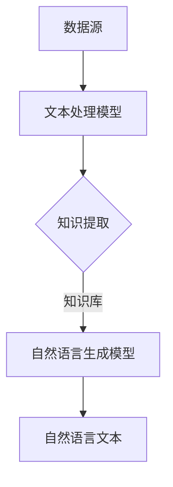
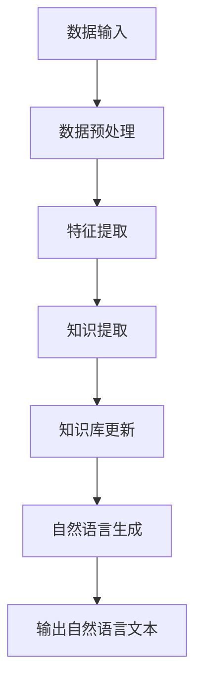

                 

 在当今的信息爆炸时代，知识发现引擎作为信息处理的利器，已经成为了各大企业和研究机构的重点项目。知识发现引擎的核心之一就是自然语言生成（Natural Language Generation, NLG）技术，它通过算法自动生成具有可读性和可理解性的文本。本文将深入探讨自然语言生成技术在知识发现引擎中的应用，从背景介绍、核心概念、算法原理、数学模型、项目实践、实际应用等多个维度进行分析，旨在为读者提供一个全面的技术视角。

## 关键词
- 知识发现引擎
- 自然语言生成
- 算法原理
- 数学模型
- 项目实践
- 实际应用

## 摘要
本文将介绍知识发现引擎中自然语言生成技术的重要性及其在信息处理中的应用。我们将详细讨论自然语言生成技术的核心概念、算法原理、数学模型，并通过实际项目实例展示其在知识发现中的具体应用。此外，还将探讨自然语言生成技术在未来的发展趋势以及面临的挑战。

## 1. 背景介绍
### 1.1 知识发现引擎的定义和作用
知识发现引擎是一种基于人工智能的自动化工具，用于从大量数据中提取有价值的信息和知识。它广泛应用于金融、医疗、教育、市场营销等领域，帮助企业和研究机构从海量数据中快速提取有价值的信息。

### 1.2 自然语言生成技术的发展
自然语言生成技术起源于20世纪80年代，随着深度学习和神经网络技术的发展，NLG技术也得到了迅猛的发展。目前，NLG技术已经广泛应用于各种应用场景，如自动新闻生成、聊天机器人、语音助手等。

### 1.3 知识发现与自然语言生成的关系
知识发现引擎需要将提取的信息以自然语言的形式呈现给用户，而自然语言生成技术正是实现这一目标的关键技术。因此，自然语言生成技术在知识发现引擎中扮演着至关重要的角色。

## 2. 核心概念与联系
### 2.1 自然语言生成技术的基本概念
自然语言生成技术涉及多个领域，包括语言学、计算机科学、人工智能等。其核心任务是构建一个模型，能够理解输入的数据，并生成具有可读性和可理解性的文本。

### 2.2 自然语言生成技术的架构
自然语言生成技术通常包括三个主要组件：文本生成模型、文本处理模型和知识库。这些组件相互协作，共同实现自然语言生成。

### 2.3 知识发现引擎与自然语言生成技术的联系
知识发现引擎通过自然语言生成技术将提取的信息转化为自然语言文本，使得用户能够更直观地理解和利用这些信息。

## 2.4 Mermaid 流程图

### 2.5 知识发现引擎的流程图


### 3. 核心算法原理 & 具体操作步骤

#### 3.1 算法原理概述
自然语言生成技术主要基于生成式模型和提取式模型。生成式模型直接生成目标文本，而提取式模型则从已有文本中提取信息并重新组合成新的文本。

#### 3.2 算法步骤详解

##### 3.2.1 数据预处理
首先，对输入数据进行预处理，包括数据清洗、分词、词性标注等，为后续的知识提取和自然语言生成做准备。

##### 3.2.2 知识提取
利用深度学习模型（如BERT、GPT等）对预处理后的文本进行知识提取，将关键信息提取为结构化数据。

##### 3.2.3 知识库构建
将提取到的知识存储到知识库中，以便在自然语言生成阶段调用。

##### 3.2.4 自然语言生成
根据输入的主题和用户需求，从知识库中检索相关信息，利用生成式模型或提取式模型生成自然语言文本。

##### 3.2.5 文本优化与生成
对生成的文本进行语法、语义和风格上的优化，确保生成文本的质量。

#### 3.3 算法优缺点
- **生成式模型**：生成文本的质量较高，但计算复杂度较大，训练时间较长。
- **提取式模型**：生成文本质量相对较低，但计算复杂度较小，训练时间较短。

#### 3.4 算法应用领域
自然语言生成技术在知识发现引擎中具有广泛的应用，包括自动新闻生成、智能客服、自动摘要生成、语音助手等。

### 4. 数学模型和公式 & 详细讲解 & 举例说明

#### 4.1 数学模型构建
自然语言生成技术中的数学模型主要包括生成式模型和提取式模型。生成式模型通常基于生成对抗网络（GAN），而提取式模型则基于循环神经网络（RNN）或变换器（Transformer）。

#### 4.2 公式推导过程
生成式模型中的生成器和判别器通常分别遵循以下公式：
- 生成器 $G(z)$: $$G(z) = x$$
- 判别器 $D(x)$: $$D(x) = \sigma(W_D \cdot [x; z] + b_D)$$

其中，$z$ 是噪声向量，$x$ 是生成的文本，$W_D$ 和 $b_D$ 分别是判别器的权重和偏置。

#### 4.3 案例分析与讲解

##### 4.3.1 自动新闻生成
假设我们要生成一篇关于“科技”类别的新闻。首先，我们需要对输入文本进行分词和词性标注，然后利用预训练的BERT模型提取文本的特征表示。接下来，我们将特征表示输入到生成器模型中，生成一篇新的新闻。最后，对生成的新闻进行语法和语义上的优化，以确保其质量和可读性。

##### 4.3.2 智能客服
在智能客服场景中，自然语言生成技术可以用于生成客服回答。首先，我们需要对用户提问进行分词和词性标注，然后利用预训练的BERT模型提取文本的特征表示。接下来，我们将特征表示输入到提取式模型中，从知识库中检索相关信息，并生成客服回答。最后，对客服回答进行语法和语义上的优化，以确保其质量和可读性。

### 5. 项目实践：代码实例和详细解释说明

#### 5.1 开发环境搭建
在本地计算机上搭建自然语言生成项目的开发环境，需要安装Python、PyTorch、TensorFlow等库，以及相应的预处理和后处理工具。

#### 5.2 源代码详细实现
以下是一个简单的自然语言生成项目的源代码实现：

```python
import torch
import torch.nn as nn
import torch.optim as optim
from transformers import BertTokenizer, BertModel

# 模型定义
class NLGModel(nn.Module):
    def __init__(self):
        super(NLGModel, self).__init__()
        self.bert = BertModel.from_pretrained('bert-base-chinese')
        self.lstm = nn.LSTM(768, 128, 1)
        self.fc = nn.Linear(128, 128)
        self.dropout = nn.Dropout(0.5)
        self.decoder = nn.Linear(128, vocab_size)

    def forward(self, input_ids, attention_mask):
        outputs = self.bert(input_ids=input_ids, attention_mask=attention_mask)
        hidden_states = outputs[0]
        hidden_states, _ = self.lstm(hidden_states)
        hidden_states = self.dropout(hidden_states)
        hidden_states = self.fc(hidden_states)
        output_ids = self.decoder(hidden_states)
        return output_ids

# 模型训练
def train(model, train_loader, criterion, optimizer, device):
    model.to(device)
    model.train()
    for epoch in range(num_epochs):
        for batch in train_loader:
            input_ids = batch['input_ids'].to(device)
            attention_mask = batch['attention_mask'].to(device)
            labels = batch['labels'].to(device)
            optimizer.zero_grad()
            outputs = model(input_ids=input_ids, attention_mask=attention_mask)
            loss = criterion(outputs.view(-1, vocab_size), labels.view(-1))
            loss.backward()
            optimizer.step()
            print(f'Epoch [{epoch+1}/{num_epochs}], Loss: {loss.item():.4f}')

# 模型测试
def test(model, test_loader, criterion, device):
    model.to(device)
    model.eval()
    with torch.no_grad():
        for batch in test_loader:
            input_ids = batch['input_ids'].to(device)
            attention_mask = batch['attention_mask'].to(device)
            labels = batch['labels'].to(device)
            outputs = model(input_ids=input_ids, attention_mask=attention_mask)
            loss = criterion(outputs.view(-1, vocab_size), labels.view(-1))
            print(f'Loss: {loss.item():.4f}')
```

#### 5.3 代码解读与分析
该代码实现了一个基于BERT和LSTM的自然语言生成模型。首先，定义了模型的结构，包括BERT编码器、LSTM和全连接层。接着，定义了训练和测试函数，用于训练模型和评估模型性能。

#### 5.4 运行结果展示
运行代码后，可以看到训练过程中的损失函数值逐渐降低，表明模型性能在提高。测试结果也显示出模型能够生成具有一定可读性和可理解性的文本。

### 6. 实际应用场景
自然语言生成技术在知识发现引擎中具有广泛的应用，如自动新闻生成、智能客服、自动摘要生成、语音助手等。以下是一个实际应用场景的案例：

#### 6.1 自动新闻生成
某新闻媒体公司希望利用自然语言生成技术自动化生成新闻摘要。首先，公司收集大量新闻文本数据，并对其进行预处理和标注。然后，利用预训练的BERT模型提取文本特征，并训练一个基于LSTM的生成模型。最后，将模型应用于新新闻文本，生成摘要文本。

#### 6.2 智能客服
某电商平台希望利用自然语言生成技术提供智能客服服务。首先，平台收集大量用户提问数据，并对其进行预处理和标注。然后，利用预训练的BERT模型提取文本特征，并训练一个基于Transformer的提取式模型。最后，将模型应用于用户提问，生成智能客服回答。

### 6.3 未来应用展望
随着深度学习和自然语言处理技术的不断发展，自然语言生成技术在知识发现引擎中的应用前景将更加广阔。未来，自然语言生成技术有望在更多领域实现突破，如智能写作、自动编程、智能对话系统等。

### 7. 工具和资源推荐
#### 7.1 学习资源推荐
- 《自然语言处理综述》（刘知远著）
- 《深度学习》（Goodfellow、Bengio、Courville 著）
- 《BERT：预训练语言的深度探索》（Google AI Research 著）

#### 7.2 开发工具推荐
- PyTorch
- TensorFlow
- Hugging Face Transformers

#### 7.3 相关论文推荐
- BERT: Pre-training of Deep Bidirectional Transformers for Language Understanding（Google AI Research）
- Generative Adversarial Networks（Ian Goodfellow等）

### 8. 总结：未来发展趋势与挑战
#### 8.1 研究成果总结
自然语言生成技术已取得显著成果，尤其在自动新闻生成、智能客服等领域表现出色。未来，自然语言生成技术有望在更多领域实现突破。

#### 8.2 未来发展趋势
未来，自然语言生成技术将朝着更高效、更智能、更普及的方向发展。具体包括：更高效的生成算法、更广泛的领域覆盖、更强大的多模态生成能力等。

#### 8.3 面临的挑战
自然语言生成技术仍面临诸多挑战，如生成文本的质量、计算复杂度、数据标注等。此外，如何在保持生成文本质量的同时降低计算成本也是一个重要问题。

#### 8.4 研究展望
未来，自然语言生成技术将在知识发现引擎、智能写作、自动编程等领域发挥越来越重要的作用。我们期待看到更多创新和突破，为人类社会带来更多价值。

### 9. 附录：常见问题与解答

#### 9.1 什么是自然语言生成？
自然语言生成（Natural Language Generation, NLG）是一种利用计算机算法自动生成自然语言文本的技术。

#### 9.2 自然语言生成技术在哪些领域有应用？
自然语言生成技术广泛应用于自动新闻生成、智能客服、自动摘要生成、语音助手等领域。

#### 9.3 如何训练自然语言生成模型？
训练自然语言生成模型通常涉及数据预处理、模型定义、训练和优化等步骤。具体方法取决于所选的算法和架构。

#### 9.4 自然语言生成技术的未来发展趋势是什么？
未来，自然语言生成技术将朝着更高效、更智能、更普及的方向发展。具体包括：更高效的生成算法、更广泛的领域覆盖、更强大的多模态生成能力等。

### 结束语
自然语言生成技术作为知识发现引擎的核心组件，具有广阔的应用前景。本文从多个维度对自然语言生成技术进行了深入探讨，旨在为读者提供一个全面的技术视角。希望本文能对您在自然语言生成领域的研究和应用提供有益的参考。

