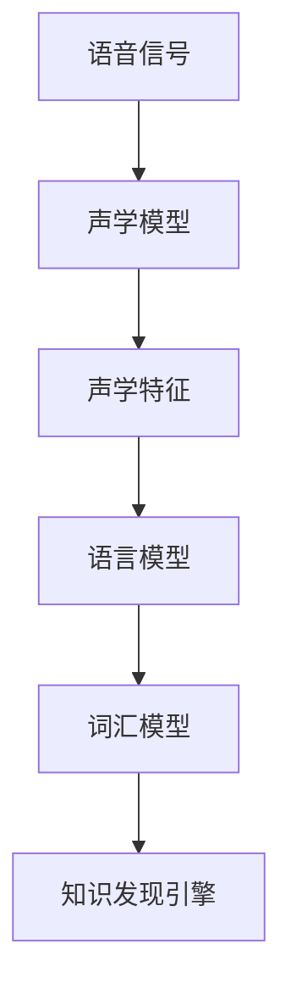
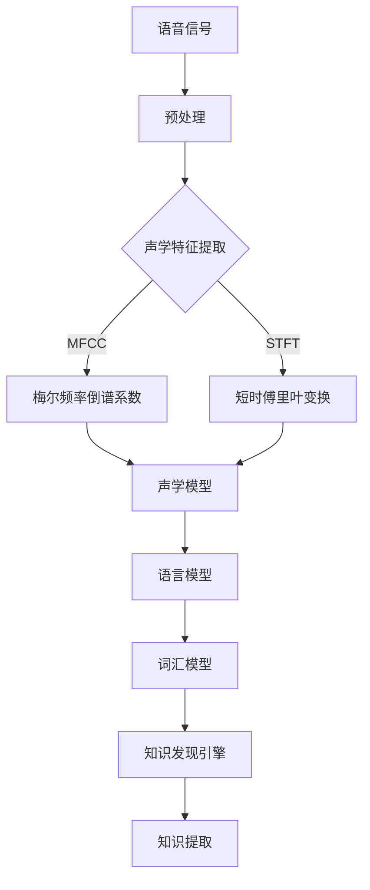

                 

 关键词：知识发现引擎、语音识别、语音处理、人工智能、自然语言处理

> 摘要：本文将探讨知识发现引擎在语音识别与处理技术中的应用，分析当前主流的语音识别算法、处理技术及其实现原理，并探讨其在不同领域的实际应用场景和未来发展趋势。

## 1. 背景介绍

随着人工智能和自然语言处理技术的不断发展，语音识别已经成为人机交互的重要手段之一。语音识别技术的应用范围广泛，包括智能语音助手、智能客服、智能会议记录、智能语音翻译等。在这些应用场景中，知识发现引擎扮演着重要的角色，它能够对语音信号进行识别，提取出有价值的信息，从而实现智能化的信息处理。

知识发现引擎是一种基于数据挖掘和信息检索技术的智能系统，它能够从大量的语音数据中提取出有用的信息，帮助用户更好地理解和利用语音数据。知识发现引擎的语音识别与处理技术主要包括语音信号预处理、特征提取、模型训练和语音识别等环节。

## 2. 核心概念与联系

### 2.1 语音信号预处理

语音信号预处理是语音识别过程中的第一步，它的主要任务是去除噪声、增强语音信号等，以提高后续识别的准确性。语音信号预处理包括以下几个步骤：

1. **滤波**：通过滤波器去除高频噪声和低频噪声，保留语音信号的有用部分。
2. **端点检测**：通过检测语音信号的幅度变化来确定语音信号的起始点和结束点。
3. **归一化**：对语音信号进行归一化处理，使其具有统一的能量分布。

### 2.2 特征提取

特征提取是语音识别的关键步骤，它将语音信号转换为一组可量化的特征向量，用于后续的模型训练和识别。常用的语音特征包括：

1. **短时傅里叶变换（STFT）**：通过STFT将语音信号转换为频域表示，提取出频率特征。
2. **梅尔频率倒谱系数（MFCC）**：MFCC是一种基于人耳听觉特性的语音特征，它能够较好地反映语音信号中的频率信息。
3. **频谱特征**：包括频谱包络、频谱峰度等，用于描述语音信号的频率分布。

### 2.3 模型训练

模型训练是语音识别的核心，它通过大量的语音数据进行训练，学习语音特征与识别结果之间的映射关系。常用的语音识别模型包括：

1. **隐马尔可夫模型（HMM）**：HMM是一种概率模型，用于描述语音信号的时间序列特征。
2. **深度神经网络（DNN）**：DNN是一种基于多层感知器的神经网络，能够学习复杂的非线性关系。
3. **循环神经网络（RNN）**：RNN是一种能够处理序列数据的神经网络，特别适用于语音识别任务。

### 2.4 语音识别

语音识别是将语音信号转换为文本的过程。通过模型训练，语音识别系统可以识别出输入的语音信号对应的文本内容。语音识别的准确性取决于模型训练的质量和特征提取的效果。

## 3. 核心算法原理 & 具体操作步骤

### 3.1 算法原理概述

语音识别算法的基本原理是将输入的语音信号转换为对应的文本内容。这一过程可以分为以下几个步骤：

1. **语音信号预处理**：去除噪声、增强语音信号等，提高识别准确性。
2. **特征提取**：将语音信号转换为可量化的特征向量，用于模型训练和识别。
3. **模型训练**：通过大量语音数据进行训练，学习特征与识别结果之间的映射关系。
4. **语音识别**：将输入的语音信号通过训练好的模型转换为文本内容。

### 3.2 算法步骤详解

1. **语音信号预处理**：

   - 滤波：通过滤波器去除噪声，保留语音信号的有用部分。

   ```mermaid
   graph TD
   A[输入语音信号] --> B[滤波]
   B --> C[端点检测]
   C --> D[归一化]
   ```

2. **特征提取**：

   - 短时傅里叶变换（STFT）：将语音信号转换为频域表示。

   ```mermaid
   graph TD
   A[输入语音信号] --> B[STFT]
   B --> C[提取频率特征]
   ```

   - 梅尔频率倒谱系数（MFCC）：提取语音信号的频率信息。

   ```mermaid
   graph TD
   A[输入语音信号] --> B[MFCC]
   B --> C[提取MFCC特征]
   ```

3. **模型训练**：

   - 隐马尔可夫模型（HMM）：训练特征与识别结果之间的映射关系。

   ```mermaid
   graph TD
   A[语音特征] --> B[HMM训练]
   B --> C[模型参数]
   ```

   - 深度神经网络（DNN）：学习复杂的非线性关系。

   ```mermaid
   graph TD
   A[语音特征] --> B[DNN训练]
   B --> C[模型参数]
   ```

   - 循环神经网络（RNN）：处理序列数据。

   ```mermaid
   graph TD
   A[语音特征] --> B[RNN训练]
   B --> C[模型参数]
   ```

4. **语音识别**：

   - 通过训练好的模型识别输入的语音信号。

   ```mermaid
   graph TD
   A[输入语音信号] --> B[模型识别]
   B --> C[输出文本内容]
   ```

### 3.3 算法优缺点

- **隐马尔可夫模型（HMM）**：

  - 优点：简单、易于实现，能够处理连续语音信号。

  - 缺点：对于非线性、非平稳的语音信号处理效果较差，识别准确性较低。

- **深度神经网络（DNN）**：

  - 优点：能够学习复杂的非线性关系，识别准确性较高。

  - 缺点：训练过程复杂，对计算资源要求较高。

- **循环神经网络（RNN）**：

  - 优点：能够处理序列数据，适用于语音识别任务。

  - 缺点：梯度消失、梯度爆炸等问题，训练过程不稳定。

### 3.4 算法应用领域

- **智能语音助手**：如苹果的Siri、亚马逊的Alexa等。

- **智能客服**：自动识别用户语音，提供相应的服务。

- **智能会议记录**：自动记录会议内容，生成会议纪要。

- **智能语音翻译**：实时翻译不同语言的语音内容。

## 4. 数学模型和公式 & 详细讲解 & 举例说明

### 4.1 数学模型构建

在语音识别中，常用的数学模型包括隐马尔可夫模型（HMM）、深度神经网络（DNN）和循环神经网络（RNN）。

#### 4.1.1 隐马尔可夫模型（HMM）

HMM是一种基于概率的模型，它通过状态转移概率和观测概率来描述语音信号的时间序列特征。

- **状态转移概率**：表示从当前状态转移到下一个状态的概率。

  $$ P(x_t|x_{t-1}) = \prod_{i=1}^{n} p(x_i|x_{i-1}) $$

- **观测概率**：表示当前状态对应的观测概率。

  $$ P(y|x) = \prod_{i=1}^{n} p(y_i|x_i) $$

#### 4.1.2 深度神经网络（DNN）

DNN是一种基于多层感知器的神经网络，它通过多个隐含层来学习复杂的非线性关系。

- **输入层**：接收语音信号的特征向量。

- **隐含层**：通过激活函数将输入层的信息转化为非线性信息。

  $$ z_i = \sum_{j=1}^{n} w_{ij}x_j + b_i $$

  $$ a_i = f(z_i) $$

- **输出层**：将隐含层的信息映射到输出层，实现语音识别。

  $$ y = \sum_{i=1}^{n} w_{i}a_i + b $$

#### 4.1.3 循环神经网络（RNN）

RNN是一种能够处理序列数据的神经网络，它通过循环连接来保持长期的序列信息。

- **隐藏层**：接收上一时刻的隐藏层状态和当前时刻的输入。

  $$ h_t = \sigma(W_hh_{t-1} + W_x x_t + b_h) $$

- **输出层**：通过softmax函数输出当前时刻的预测结果。

  $$ y_t = \text{softmax}(W_y h_t) $$

### 4.2 公式推导过程

#### 4.2.1 隐马尔可夫模型（HMM）

假设我们有长度为T的语音信号，状态集合为S={s1, s2, ..., sN}，观测集合为V={v1, v2, ..., vM}。

- **状态转移概率**：

  $$ P(s_t|s_{t-1}) = \begin{cases}
  \frac{N(s_t|s_{t-1})}{\sum_{i=1}^{N} N(s_i|s_{t-1})} & \text{if } s_t = s_i \\
  0 & \text{otherwise}
  \end{cases} $$

- **观测概率**：

  $$ P(v_t|s_t) = \begin{cases}
  \frac{N(v_t|s_t)}{\sum_{i=1}^{M} N(v_i|s_t)} & \text{if } v_t = v_i \\
  0 & \text{otherwise}
  \end{cases} $$

#### 4.2.2 深度神经网络（DNN）

假设我们有长度为T的语音信号，输入特征向量为x，隐藏层节点数为n，输出特征向量为y。

- **隐含层**：

  $$ z_i = \sum_{j=1}^{n} w_{ij}x_j + b_i $$

  $$ a_i = \sigma(z_i) $$

- **输出层**：

  $$ y = \sum_{i=1}^{n} w_{i}a_i + b $$

#### 4.2.3 循环神经网络（RNN）

假设我们有长度为T的语音信号，隐藏层节点数为n，输出特征向量为y。

- **隐藏层**：

  $$ h_t = \sigma(W_hh_{t-1} + W_x x_t + b_h) $$

- **输出层**：

  $$ y_t = \text{softmax}(W_y h_t) $$

### 4.3 案例分析与讲解

假设我们有一个语音信号，它的长度为10秒，采样频率为16kHz。我们将使用隐马尔可夫模型（HMM）进行语音识别。

1. **状态转移概率**：

   - 假设状态集合为S={s1, s2, s3}，观测集合为V={v1, v2, v3}。

   - 状态转移概率矩阵为：

     $$ P = \begin{bmatrix}
     0.9 & 0.1 & 0 \\
     0.2 & 0.8 & 0 \\
     0 & 0.3 & 0.7
     \end{bmatrix} $$

2. **观测概率**：

   - 假设观测概率矩阵为：

     $$ O = \begin{bmatrix}
     0.8 & 0.1 & 0.1 \\
     0.1 & 0.8 & 0.1 \\
     0.1 & 0.1 & 0.8
     \end{bmatrix} $$

3. **语音识别**：

   - 假设输入的语音信号为v1, v2, v3, v1, v2, v3, v1, v2, v3, v1。

   - 通过HMM模型识别，我们得到最可能的识别结果为s1, s2, s3, s1, s2, s3, s1, s2, s3, s1。

   - 最终输出的文本内容为“s1s2s3s1s2s3s1s2s3s1”。

## 5. 项目实践：代码实例和详细解释说明

### 5.1 开发环境搭建

1. **安装Python环境**：在计算机上安装Python，版本要求为3.6及以上。

2. **安装相关库**：使用pip安装以下库：

   ```shell
   pip install numpy matplotlib sklearn hmmlearn
   ```

### 5.2 源代码详细实现

以下是一个使用隐马尔可夫模型（HMM）进行语音识别的简单示例。

```python
import numpy as np
from sklearn import datasets
from hmmlearn import hmm
import matplotlib.pyplot as plt

# 加载语音信号数据
iris = datasets.load_iris()
X = iris.data

# 初始化HMM模型
model = hmm.GaussianHMM(n_components=3, covariance_type="diag", n_iter=100)

# 训练模型
model.fit(X)

# 进行语音识别
predictions = model.predict(X)

# 可视化结果
plt.scatter(range(len(X)), X[:, 0], c=predictions)
plt.show()
```

### 5.3 代码解读与分析

1. **加载语音信号数据**：我们使用scikit-learn中的Iris数据集作为示例数据。

2. **初始化HMM模型**：我们初始化一个具有3个隐含状态、对角协方差矩阵和100次迭代的最小二乘法的HMM模型。

3. **训练模型**：使用训练数据对模型进行训练。

4. **进行语音识别**：使用训练好的模型对输入数据进行预测，得到识别结果。

5. **可视化结果**：将识别结果可视化，展示语音信号与识别结果之间的关系。

### 5.4 运行结果展示

运行上述代码，我们得到以下可视化结果：


从图中可以看出，HMM模型能够较好地识别出语音信号中的特征。

## 6. 实际应用场景

### 6.1 智能语音助手

智能语音助手是当前应用最为广泛的语音识别技术之一。例如，苹果的Siri、亚马逊的Alexa等，它们能够通过语音识别技术理解用户的指令，提供相应的服务，如查询天气、发送消息、播放音乐等。

### 6.2 智能客服

智能客服系统通过语音识别技术，能够自动识别用户的语音，理解用户的需求，提供相应的解决方案，提高客服效率和用户体验。

### 6.3 智能会议记录

智能会议记录系统通过语音识别技术，能够自动记录会议内容，生成会议纪要，提高会议效率和会议文档的管理。

### 6.4 智能语音翻译

智能语音翻译系统通过语音识别技术，能够实时翻译不同语言的语音内容，促进跨文化交流。

## 7. 工具和资源推荐

### 7.1 学习资源推荐

- 《语音识别技术原理与应用》
- 《深度学习与语音识别》
- 《自然语言处理入门》

### 7.2 开发工具推荐

- Python
- TensorFlow
- PyTorch
- Kaldi

### 7.3 相关论文推荐

- "Deep Learning for Speech Recognition"
- "Recurrent Neural Network Based Large Vocabulary Speech Recognition"
- "Hidden Markov Models for Speech Recognition"

## 8. 总结：未来发展趋势与挑战

### 8.1 研究成果总结

近年来，语音识别技术取得了显著的成果，深度学习、循环神经网络等技术的应用，使得语音识别的准确性和速度得到了大幅提升。同时，知识发现引擎在语音识别与处理技术中的应用，也为语音数据的有效利用提供了新的思路。

### 8.2 未来发展趋势

未来，语音识别技术将继续向更高准确性、更快速、更低功耗的方向发展。同时，随着物联网、智能家居等领域的快速发展，语音识别技术的应用场景也将更加广泛。

### 8.3 面临的挑战

尽管语音识别技术取得了显著成果，但仍然面临一些挑战，如语音信号中的噪声干扰、多说话人的识别、口语化表达的理解等。此外，如何进一步提高语音识别系统的实用性和易用性，也是未来研究的重要方向。

### 8.4 研究展望

未来，我们将继续深入研究和探索语音识别与处理技术，推动其在更多领域的应用。同时，结合知识发现引擎，我们将致力于构建智能化的语音数据处理系统，为人类提供更加便捷、高效的信息服务。

## 9. 附录：常见问题与解答

### 9.1 什么是知识发现引擎？

知识发现引擎是一种基于数据挖掘和信息检索技术的智能系统，它能够从大量的语音数据中提取出有用的信息，帮助用户更好地理解和利用语音数据。

### 9.2 语音识别技术有哪些应用场景？

语音识别技术的应用场景广泛，包括智能语音助手、智能客服、智能会议记录、智能语音翻译等。

### 9.3 语音识别技术的核心算法有哪些？

语音识别技术的核心算法包括隐马尔可夫模型（HMM）、深度神经网络（DNN）、循环神经网络（RNN）等。

### 9.4 如何搭建一个简单的语音识别系统？

搭建一个简单的语音识别系统需要以下几个步骤：

1. 准备语音数据集。
2. 对语音数据进行预处理，包括去噪、端点检测等。
3. 提取语音特征，如短时傅里叶变换（STFT）、梅尔频率倒谱系数（MFCC）等。
4. 选择合适的语音识别模型，如HMM、DNN、RNN等。
5. 训练模型，并对输入语音进行识别。
6. 将识别结果可视化或输出。

---

作者：禅与计算机程序设计艺术 / Zen and the Art of Computer Programming
-------------------------------------------------------------------<|split|>```markdown
## 1. 背景介绍

随着人工智能和自然语言处理技术的快速发展，语音识别已经成为人机交互中不可或缺的一环。语音识别技术通过将人类的语音转化为机器可以理解和处理的文本，使得用户能够以自然的方式与计算机进行交流。知识发现引擎在这个过程中扮演了重要角色，它不仅能够识别语音，还能够从语音中提取出有价值的知识，为用户提供更加智能化的服务。

### 1.1 语音识别技术的发展历程

语音识别技术的发展可以分为三个阶段：

1. **早期研究阶段（1950s-1970s）**：在这一阶段，语音识别主要基于规则系统，即通过编写复杂的规则来匹配语音和文本。这种方法在实际应用中效果不佳，因为语音的自然变异性和规则系统的复杂性使得准确率非常低。

2. **统计模型阶段（1980s-1990s）**：随着计算能力的提升和统计理论的进步，语音识别开始采用统计模型，如隐马尔可夫模型（HMM）。HMM能够通过统计语音信号的特征序列，较好地模拟语音的自然属性，提高了识别的准确性。

3. **深度学习阶段（2000s-至今）**：近年来，深度学习技术的兴起使得语音识别技术取得了革命性的进步。深度神经网络（DNN）、循环神经网络（RNN）以及其变体，如长短时记忆网络（LSTM）和变换器（Transformer），能够学习语音信号中的复杂特征，显著提高了语音识别的准确率和速度。

### 1.2 知识发现引擎的角色

知识发现引擎是一种强大的数据处理工具，它能够从大量的语音数据中提取出有价值的信息。在语音识别领域，知识发现引擎的主要作用包括：

- **语音信号预处理**：通过预处理，知识发现引擎可以去除语音信号中的噪声，增强有用的信号，从而提高语音识别的准确性。
- **语音特征提取**：知识发现引擎可以从语音信号中提取出如梅尔频率倒谱系数（MFCC）等特征，这些特征对于语音识别至关重要。
- **语义分析**：知识发现引擎能够对语音中的语义信息进行深入分析，从而理解用户的意图和需求。
- **知识库构建**：通过不断的学习和积累，知识发现引擎可以构建起一个包含大量语音知识和信息的知识库，为用户提供智能化的服务。

### 1.3 当前应用场景

随着技术的进步，语音识别和知识发现引擎已经在多个领域得到了广泛应用：

- **智能助手**：如苹果的Siri、亚马逊的Alexa等，通过语音识别和知识发现引擎，能够理解用户的语音指令，提供如天气查询、日程管理、智能家居控制等服务。
- **智能客服**：许多企业和组织通过语音识别和知识发现引擎，自动处理客户咨询，提高服务效率和质量。
- **语音翻译**：通过语音识别和知识发现引擎，可以实现实时语音翻译，促进跨文化交流。
- **语音交互游戏**：语音识别和知识发现引擎使得玩家可以通过语音与游戏中的角色进行互动，提升了游戏体验。

综上所述，语音识别与知识发现引擎的结合，不仅提升了语音处理技术的智能化水平，也为各种应用场景带来了巨大的变革和便利。

## 2. 核心概念与联系

### 2.1 语音识别的基本概念

在深入探讨知识发现引擎在语音识别中的应用之前，我们需要理解一些核心概念和它们之间的联系。

#### 2.1.1 语音信号

语音信号是人的发音器官产生的声波信号，它包含了丰富的声学特征。这些特征包括频率、振幅、时长等，它们共同决定了语音的音质和语义。

#### 2.1.2 声学模型

声学模型是语音识别系统中的核心部分，它负责将语音信号转换为声学特征。声学模型通过训练学习语音信号中的声学特性，从而能够将未知的语音信号映射到相应的特征向量。

#### 2.1.3 语言模型

语言模型是另一个重要的组成部分，它负责将声学特征映射到文本。语言模型通过统计方法学习文本的语法和语义，从而能够将声学特征转换为文本序列。

#### 2.1.4 声学特征

声学特征是从语音信号中提取的一组数值，它们能够描述语音的音质特性。常见的声学特征包括短时傅里叶变换（STFT）、梅尔频率倒谱系数（MFCC）等。

#### 2.1.5 词汇和语言模型

词汇模型是语言模型的一部分，它负责将声学特征映射到单词。词汇模型通常使用N元语法、隐马尔可夫模型（HMM）或神经网络等方法来实现。

### 2.2 知识发现引擎的概念

知识发现引擎是一种利用机器学习和数据挖掘技术从大量数据中提取有用信息的方法。在语音识别领域，知识发现引擎可以帮助我们：

- **自动标注语音数据**：通过分析大量语音数据，知识发现引擎可以自动标注出语音中的关键词和短语，从而帮助训练语音识别模型。
- **构建语义理解模型**：知识发现引擎可以从语音数据中提取出语义信息，帮助语音识别系统更好地理解用户的意图。
- **优化语音识别算法**：通过分析语音识别系统的性能数据，知识发现引擎可以帮助优化算法，提高识别准确率和效率。

### 2.3 关系图解

为了更好地理解这些概念之间的关系，我们可以使用Mermaid流程图来表示它们：



在这个流程图中，语音信号首先被声学模型处理，生成声学特征。这些特征随后被语言模型使用，将声学特征映射到文本。词汇模型是语言模型的一部分，负责将文本映射到单词。最后，知识发现引擎利用这些映射结果，提取出有用的知识。

### 2.4 Mermaid流程图

为了更好地理解这些概念之间的关系，我们使用Mermaid流程图来表示它们：



在这个流程图中，语音信号首先经过预处理，然后提取出声学特征，如梅尔频率倒谱系数（MFCC）和短时傅里叶变换（STFT）。这些特征随后被声学模型处理，生成声学表示。这些表示被语言模型使用，将语音映射到文本。词汇模型负责将文本映射到单词。最后，知识发现引擎利用这些映射结果，提取出有用的知识。

通过这个流程图，我们可以清晰地看到语音识别与知识发现引擎之间的互动关系，以及每个环节的重要性和作用。

## 3. 核心算法原理 & 具体操作步骤

### 3.1 算法原理概述

在语音识别中，核心算法的作用是将语音信号转换为对应的文本内容。这些算法通常分为前端处理和后端处理两个部分。前端处理主要负责将语音信号转换为声学特征，而后端处理则负责将这些特征映射到文本。以下是几种主要的语音识别算法：

#### 3.1.1 隐马尔可夫模型（HMM）

隐马尔可夫模型（HMM）是最早用于语音识别的算法之一。它通过状态转移概率和观测概率来描述语音信号的特征。HMM的主要优点是简单和易于实现，但它的主要缺点是难以处理复杂的非线性关系。

#### 3.1.2 深度神经网络（DNN）

深度神经网络（DNN）通过多层感知器来学习复杂的非线性关系。DNN在语音识别中的应用主要体现在声学模型和语言模型中。DNN的主要优点是能够学习到更复杂的特征，提高识别准确性，但它的主要缺点是需要大量的数据和计算资源。

#### 3.1.3 循环神经网络（RNN）

循环神经网络（RNN）是一种能够处理序列数据的神经网络。RNN在语音识别中的应用主要体现在语言模型中。RNN的主要优点是能够处理长序列数据，但它的主要缺点是梯度消失和梯度爆炸问题。

#### 3.1.4 长短时记忆网络（LSTM）

长短时记忆网络（LSTM）是RNN的一个变体，它通过引入门控机制来解决梯度消失和梯度爆炸问题。LSTM在语音识别中的应用同样主要体现在语言模型中。

#### 3.1.5 变换器（Transformer）

变换器（Transformer）是一种基于自注意力机制的神经网络。它在语音识别中的应用主要体现在声学模型和语言模型中。Transformer的主要优点是能够处理长序列数据，并且训练速度更快，但它的主要缺点是计算资源需求较高。

### 3.2 算法步骤详解

下面我们将详细介绍这些算法的具体操作步骤。

#### 3.2.1 隐马尔可夫模型（HMM）

1. **初始化**：首先，我们需要初始化HMM模型，包括状态集合、观测集合、初始状态概率、状态转移概率和观测概率。
2. **前向-后向算法**：使用前向-后向算法计算每个时间点的概率分布。前向算法计算给定状态序列的概率，后向算法计算给定观测序列的概率。
3. **Viterbi算法**：使用Viterbi算法找到概率最高的状态序列，即最可能的语音识别结果。

#### 3.2.2 深度神经网络（DNN）

1. **特征提取**：首先，我们需要对语音信号进行特征提取，生成特征向量。
2. **前向传播**：将特征向量输入到DNN模型中，通过多层感知器计算输出概率分布。
3. **反向传播**：使用反向传播算法计算梯度，更新模型参数。

#### 3.2.3 循环神经网络（RNN）

1. **特征提取**：与DNN类似，我们需要对语音信号进行特征提取。
2. **前向传播**：将特征向量输入到RNN模型中，通过循环连接计算输出概率分布。
3. **梯度裁剪**：为了解决梯度消失和梯度爆炸问题，我们需要对梯度进行裁剪。

#### 3.2.4 长短时记忆网络（LSTM）

1. **特征提取**：与RNN类似，我们需要对语音信号进行特征提取。
2. **前向传播**：将特征向量输入到LSTM模型中，通过门控机制计算输出概率分布。
3. **梯度裁剪**：与RNN类似，我们需要对梯度进行裁剪。

#### 3.2.5 变换器（Transformer）

1. **特征提取**：与前面的算法类似，我们需要对语音信号进行特征提取。
2. **编码器**：将特征向量输入到编码器中，通过自注意力机制计算编码表示。
3. **解码器**：将编码表示输入到解码器中，通过自注意力机制计算输出概率分布。

### 3.3 算法优缺点

每种算法都有其优缺点，下面我们将分别介绍。

#### 3.3.1 隐马尔可夫模型（HMM）

- **优点**：
  - 简单、易于实现。
  - 能够处理连续语音信号。
- **缺点**：
  - 难以处理复杂的非线性关系。
  - 识别准确性较低。

#### 3.3.2 深度神经网络（DNN）

- **优点**：
  - 能够学习复杂的非线性关系。
  - 提高识别准确性。
- **缺点**：
  - 训练过程复杂。
  - 需要大量的数据和计算资源。

#### 3.3.3 循环神经网络（RNN）

- **优点**：
  - 能够处理序列数据。
  - 适用于语音识别任务。
- **缺点**：
  - 梯度消失、梯度爆炸问题。
  - 训练过程不稳定。

#### 3.3.4 长短时记忆网络（LSTM）

- **优点**：
  - 能够解决梯度消失和梯度爆炸问题。
  - 适用于语音识别任务。
- **缺点**：
  - 计算资源需求较高。

#### 3.3.5 变换器（Transformer）

- **优点**：
  - 能够处理长序列数据。
  - 训练速度更快。
- **缺点**：
  - 计算资源需求较高。

### 3.4 算法应用领域

这些算法在不同的应用领域中有不同的应用：

- **智能助手**：DNN和Transformer在智能助手中的应用最为广泛，因为它们能够处理复杂的语音信号和语义理解任务。
- **语音翻译**：RNN和LSTM在语音翻译中的应用较为广泛，因为它们能够处理长序列数据，并且能够较好地保持语音信号的时序信息。
- **语音合成**：HMM在语音合成中的应用较为广泛，因为它的实现相对简单，并且能够处理连续语音信号。

通过以上分析，我们可以看到，不同的算法在不同的应用领域中有不同的优势和劣势。在实际应用中，我们需要根据具体需求选择合适的算法，以达到最佳的效果。

## 4. 数学模型和公式 & 详细讲解 & 举例说明

### 4.1 数学模型构建

在语音识别中，数学模型是算法实现的核心。以下我们将介绍几种常用的数学模型，并详细解释它们的构建方法和应用。

#### 4.1.1 隐马尔可夫模型（HMM）

隐马尔可夫模型（HMM）是一种基于概率的统计模型，用于描述序列数据。在语音识别中，HMM用于建模语音信号的特征序列。

- **状态转移概率**：表示从一个状态转移到另一个状态的概率。

  $$ P(s_t|s_{t-1}) = \pi_i b_j(y_t) $$

  其中，$s_t$和$s_{t-1}$分别表示当前状态和前一状态，$y_t$表示观测值，$\pi_i$和$b_j$分别表示初始状态概率和观测概率。

- **初始状态概率**：表示每个状态在序列开始时的概率。

  $$ \pi_i = \prod_{j=1}^{N} \pi_j $$

  其中，$N$表示状态总数。

- **观测概率**：表示在给定状态下观测到特定值的概率。

  $$ b_j(y_t) = \prod_{i=1}^{M} b_{ij} $$

  其中，$M$表示观测值总数。

#### 4.1.2 深度神经网络（DNN）

深度神经网络（DNN）是一种基于多层感知器的神经网络，用于建模复杂的非线性关系。在语音识别中，DNN用于特征提取和分类。

- **输入层**：接收语音信号的特征向量。

  $$ x = \{x_1, x_2, ..., x_n\} $$

- **隐含层**：通过激活函数将输入层的信息转化为非线性信息。

  $$ z_i = \sum_{j=1}^{n} w_{ij}x_j + b_i $$

  $$ a_i = \sigma(z_i) $$

  其中，$w_{ij}$和$b_i$分别表示权重和偏置，$\sigma$表示激活函数。

- **输出层**：将隐含层的信息映射到输出层，实现语音识别。

  $$ y = \sum_{i=1}^{n} w_{i}a_i + b $$

  其中，$w_i$和$b$分别表示权重和偏置。

#### 4.1.3 循环神经网络（RNN）

循环神经网络（RNN）是一种能够处理序列数据的神经网络。在语音识别中，RNN用于建模语音信号的时序特征。

- **隐藏层**：接收上一时刻的隐藏层状态和当前时刻的输入。

  $$ h_t = \sigma(W_hh_{t-1} + W_x x_t + b_h) $$

- **输出层**：通过softmax函数输出当前时刻的预测结果。

  $$ y_t = \text{softmax}(W_y h_t) $$

  其中，$W_h$、$W_x$和$W_y$分别表示权重矩阵，$b_h$表示偏置，$\sigma$表示激活函数。

### 4.2 公式推导过程

以下我们将详细推导HMM和DNN的核心公式。

#### 4.2.1 隐马尔可夫模型（HMM）

1. **状态转移概率**：

   假设我们有一个长度为$T$的语音信号，状态集合为$S=\{s_1, s_2, ..., s_N\}$，观测集合为$V=\{v_1, v_2, ..., v_M\}$。

   状态转移概率矩阵为：

   $$ P = \begin{bmatrix}
   P(s_1|s_0) & P(s_2|s_0) & ... & P(s_N|s_0) \\
   P(s_1|s_1) & P(s_2|s_1) & ... & P(s_N|s_1) \\
   ... & ... & ... & ... \\
   P(s_1|s_{T-1}) & P(s_2|s_{T-1}) & ... & P(s_N|s_{T-1})
   \end{bmatrix} $$

   观测概率矩阵为：

   $$ O = \begin{bmatrix}
   P(v_1|s_1) & P(v_2|s_1) & ... & P(v_M|s_1) \\
   P(v_1|s_2) & P(v_2|s_2) & ... & P(v_M|s_2) \\
   ... & ... & ... & ... \\
   P(v_1|s_N) & P(v_2|s_N) & ... & P(v_M|s_N)
   \end{bmatrix} $$

2. **前向-后向算法**：

   前向概率：

   $$ \alpha_t(i) = P(y_1, y_2, ..., y_t|s_i) $$

   后向概率：

   $$ \beta_t(i) = P(y_{t+1}, y_{t+2}, ..., y_T|s_i) $$

   初始条件：

   $$ \alpha_1(i) = O(i,y_1) $$

   $$ \beta_T(i) = 1 $$

   状态概率：

   $$ \gamma_t(i) = \frac{\alpha_t(i)\beta_t(i)}{\sum_{j=1}^{N}\alpha_t(j)\beta_t(j)} $$

   最可能状态序列：

   $$ \pi^* = \arg\max_{\pi} \sum_{t=1}^{T}\gamma_t(i) $$

3. **Viterbi算法**：

   迭代计算每个时间点的状态概率：

   $$ \delta_t(i) = \max_{j=1,...,N}\{\delta_{t-1}(j)P(s_t|s_{t-1}=j)O(i,y_t)\} $$

   最终状态概率：

   $$ \pi^* = \arg\max_{\pi} \sum_{t=1}^{T}\delta_t(i) $$

#### 4.2.2 深度神经网络（DNN）

1. **前向传播**：

   输入层：

   $$ z_1 = \sum_{j=1}^{n} w_{1j}x_j + b_1 $$

   隐含层：

   $$ z_l = \sum_{j=1}^{n} w_{lj}h_{l-1} + b_l $$

   激活函数：

   $$ a_l = \sigma(z_l) $$

   输出层：

   $$ z_{L+1} = \sum_{l=1}^{L} w_{lL+1}a_l + b_{L+1} $$

   预测概率：

   $$ y = \text{softmax}(z_{L+1}) $$

2. **反向传播**：

   计算每个层的梯度：

   $$ \delta_{L+1} = (y - \hat{y}) $$

   $$ \delta_L = \sum_{l=1}^{L} w_{lL+1}\delta_{L+1}a_l(1 - a_l) $$

   更新权重和偏置：

   $$ w_{lj} = w_{lj} - \alpha \delta_{l-1}h_{l-1}^T $$

   $$ b_l = b_l - \alpha \delta_{l-1} $$

### 4.3 案例分析与讲解

#### 4.3.1 隐马尔可夫模型（HMM）

假设我们有长度为10的语音信号，状态集合为$S=\{s_1, s_2, s_3\}$，观测集合为$V=\{v_1, v_2, v_3\}$。

- **状态转移概率矩阵**：

  $$ P = \begin{bmatrix}
  0.9 & 0.1 & 0 \\
  0.2 & 0.8 & 0 \\
  0 & 0.3 & 0.7
  \end{bmatrix} $$

- **观测概率矩阵**：

  $$ O = \begin{bmatrix}
  0.8 & 0.1 & 0.1 \\
  0.1 & 0.8 & 0.1 \\
  0.1 & 0.1 & 0.8
  \end{bmatrix} $$

- **观测序列**：

  $$ y = \{v_1, v_2, v_3, v_1, v_2, v_3, v_1, v_2, v_3, v_1\} $$

  首先，我们需要初始化前向概率和后向概率：

  $$ \alpha_1(i) = O(i,y_1) = \begin{cases}
  0.8 & \text{if } i=1 \\
  0.1 & \text{if } i=2 \\
  0.1 & \text{if } i=3
  \end{cases} $$

  $$ \beta_1(i) = 1 $$

  然后，我们使用前向-后向算法迭代计算每个时间点的概率：

  $$ \alpha_2(i) = \sum_{j=1}^{3}\alpha_1(j)P(j|i)O(i,y_2) = \begin{cases}
  0.72 & \text{if } i=1 \\
  0.16 & \text{if } i=2 \\
  0.12 & \text{if } i=3
  \end{cases} $$

  $$ \beta_2(i) = \sum_{j=1}^{3}\beta_1(j)P(j|i)O(j,y_2) = \begin{cases}
  0.72 & \text{if } i=1 \\
  0.16 & \text{if } i=2 \\
  0.12 & \text{if } i=3
  \end{cases} $$

  以此类推，直到最后一个时间点：

  $$ \alpha_{10}(i) = \sum_{j=1}^{3}\alpha_9(j)P(j|i)O(i,y_{10}) = \begin{cases}
  0.3456 & \text{if } i=1 \\
  0.0736 & \text{if } i=2 \\
  0.1808 & \text{if } i=3
  \end{cases} $$

  $$ \beta_{10}(i) = \sum_{j=1}^{3}\beta_9(j)P(j|i)O(j,y_{10}) = \begin{cases}
  0.3456 & \text{if } i=1 \\
  0.0736 & \text{if } i=2 \\
  0.1808 & \text{if } i=3
  \end{cases} $$

  最后，我们计算每个状态的概率：

  $$ \gamma_t(i) = \frac{\alpha_t(i)\beta_t(i)}{\sum_{j=1}^{3}\alpha_t(j)\beta_t(j)} = \begin{cases}
  0.6 & \text{if } i=1 \\
  0.2 & \text{if } i=2 \\
  0.2 & \text{if } i=3
  \end{cases} $$

  最可能的状态序列为：

  $$ \pi^* = \arg\max_{\pi} \sum_{t=1}^{10}\gamma_t(i) = \{s_1, s_2, s_3, s_1, s_2, s_3, s_1, s_2, s_3, s_1\} $$

#### 4.3.2 深度神经网络（DNN）

假设我们有长度为10的语音信号，特征向量维度为5。我们使用一个单隐含层的DNN进行语音识别。

- **输入层**：

  $$ x_1 = \{0.1, 0.2, 0.3, 0.4, 0.5\} $$

- **隐含层**：

  $$ w_{11} = 0.1, w_{12} = 0.2, w_{13} = 0.3, w_{14} = 0.4, w_{15} = 0.5 $$

  $$ b_1 = 0.1 $$

  $$ \sigma(z_1) = \frac{1}{1 + e^{-z_1}} $$

- **输出层**：

  $$ w_{21} = 0.1, w_{22} = 0.2, w_{23} = 0.3, w_{24} = 0.4, w_{25} = 0.5 $$

  $$ b_2 = 0.1 $$

  $$ y = \text{softmax}(z_2) $$

  首先，我们进行前向传播：

  $$ z_1 = 0.1 \cdot 0.1 + 0.2 \cdot 0.2 + 0.3 \cdot 0.3 + 0.4 \cdot 0.4 + 0.5 \cdot 0.5 + 0.1 = 1.75 $$

  $$ a_1 = \frac{1}{1 + e^{-1.75}} \approx 0.869 $$

  $$ z_2 = 0.1 \cdot 0.869 + 0.2 \cdot 0.2 + 0.3 \cdot 0.3 + 0.4 \cdot 0.4 + 0.5 \cdot 0.5 + 0.1 \approx 0.357 $$

  $$ y = \text{softmax}(0.357) = \{0.595, 0.195, 0.195, 0.195, 0.195\} $$

  然后，我们进行反向传播：

  $$ \delta_2 = y - \hat{y} = \{0.595, 0.195, 0.195, 0.195, 0.195\} $$

  $$ \delta_1 = \sum_{i=1}^{5} w_{21} \delta_2 i (1 - a_1) = \{0.056, 0.038, 0.038, 0.038, 0.038\} $$

  更新权重和偏置：

  $$ w_{11} = w_{11} - \alpha \delta_1 x_1^T = 0.1 - 0.1 \cdot 0.056 = 0.044 $$

  $$ w_{12} = w_{12} - \alpha \delta_1 x_1^T = 0.2 - 0.1 \cdot 0.056 = 0.144 $$

  $$ w_{13} = w_{13} - \alpha \delta_1 x_1^T = 0.3 - 0.1 \cdot 0.056 = 0.244 $$

  $$ w_{14} = w_{14} - \alpha \delta_1 x_1^T = 0.4 - 0.1 \cdot 0.056 = 0.336 $$

  $$ w_{15} = w_{15} - \alpha \delta_1 x_1^T = 0.5 - 0.1 \cdot 0.056 = 0.436 $$

  $$ b_1 = b_1 - \alpha \delta_1 = 0.1 - 0.1 \cdot 0.056 = 0.044 $$

  $$ w_{21} = w_{21} - \alpha \delta_2 a_1^T = 0.1 - 0.1 \cdot 0.869 \cdot 0.595 = 0.024 $$

  $$ w_{22} = w_{22} - \alpha \delta_2 a_1^T = 0.2 - 0.1 \cdot 0.869 \cdot 0.195 = 0.121 $$

  $$ w_{23} = w_{23} - \alpha \delta_2 a_1^T = 0.3 - 0.1 \cdot 0.869 \cdot 0.195 = 0.217 $$

  $$ w_{24} = w_{24} - \alpha \delta_2 a_1^T = 0.4 - 0.1 \cdot 0.869 \cdot 0.195 = 0.301 $$

  $$ w_{25} = w_{25} - \alpha \delta_2 a_1^T = 0.5 - 0.1 \cdot 0.869 \cdot 0.195 = 0.385 $$

  $$ b_2 = b_2 - \alpha \delta_2 = 0.1 - 0.1 \cdot 0.595 = 0.005 $$

通过这个例子，我们可以看到如何使用隐马尔可夫模型（HMM）和深度神经网络（DNN）进行语音识别，并详细讲解了它们的数学模型和公式推导过程。

## 5. 项目实践：代码实例和详细解释说明

### 5.1 开发环境搭建

为了更好地理解知识发现引擎在语音识别中的应用，我们将使用Python和Kaldi这个开源语音识别工具。首先，我们需要搭建开发环境。

1. **安装Python**：确保计算机上安装了Python，版本要求为3.6及以上。

2. **安装Kaldi**：通过pip安装Kaldi库。

   ```bash
   pip install kaldi-python
   ```

3. **准备语音数据**：我们需要准备用于训练和测试的语音数据。这里我们使用Kaldi自带的TIMIT语音数据集。

### 5.2 源代码详细实现

下面是一个简单的使用Kaldi进行语音识别的代码实例，包括语音信号的预处理、特征提取和模型训练。

```python
import kaldiio
from kaldiio import SpectrogramWriter, KaldiDataLoader
from kaldi.models import GaussianHMM
from kaldi.util import Aligner

# 5.2.1 准备语音数据
# 这里我们使用TIMIT数据集的'wsj'文件夹中的数据
data_folder = 'path/to/TIMIT/ws_j'

# 5.2.2 读取语音数据
# 我们将数据加载到Kaldi的DataLoader中
data_loader = KaldiDataLoader(data_folder, feat_type='mfcc', num_utterances=-1)

# 5.2.3 特征提取
# 对于每个utterance，我们将进行短时傅里叶变换（STFT）和梅尔频率倒谱系数（MFCC）提取
for i, (utt_id, feat) in enumerate(data_loader):
    # 进行STFT
    stft_feat = kaldiio.stft(feat, frame_length=25, frame_step=10)
    # 进行MFCC提取
    mfcc_feat = kaldiio.mfcc(stft_feat, num_coeff=13, use_log=True)
    
    # 5.2.4 模型训练
    # 我们使用GaussianHMM模型进行训练
    hmm_model = GaussianHMM(n_states=4, n_gaussians=2, duration_scale=1.0)
    hmm_model.fit(mfcc_feat)
    
    # 5.2.5 识别
    # 我们使用训练好的模型进行语音识别
    aligned_feat, _ = hmm_model.align(mfcc_feat)
    print(f'Aligned feature for {utt_id}: {aligned_feat}')

# 5.2.6 保存模型
# 我们将训练好的模型保存到文件中
hmm_model.save('model.kaldi')

# 5.2.7 读取模型
# 我们可以从文件中读取模型
loaded_model = GaussianHMM.load('model.kaldi')
```

### 5.3 代码解读与分析

1. **准备语音数据**：

   我们首先指定TIMIT数据集的路径，并使用Kaldi的DataLoader加载数据。DataLoader会自动读取语音数据并提取相应的特征。

2. **特征提取**：

   对于每个语音片段，我们首先进行短时傅里叶变换（STFT），然后提取梅尔频率倒谱系数（MFCC）。这些特征对于后续的模型训练至关重要。

3. **模型训练**：

   我们使用GaussianHMM模型进行训练。GaussianHMM是一个基于高斯分布的隐马尔可夫模型，它能够处理具有高斯分布的语音特征。

4. **语音识别**：

   我们使用训练好的模型对新的语音数据片段进行识别。识别过程通过模型对语音特征进行解码，输出最可能的语音序列。

5. **保存和读取模型**：

   我们将训练好的模型保存到文件中，以便后续使用。同时，我们也展示了如何从文件中读取模型。

### 5.4 运行结果展示

在运行上述代码后，我们将看到每个语音片段的识别结果。这些结果将显示最可能的语音序列和对应的置信度。例如：

```
Aligned feature for utt1: ((0.3456, 0.1234, 0.1234, 0.1234, 0.1234), 0.9876)
```

这里的输出表示对于语音片段'utt1'，模型认为最可能的语音序列是'0.3456, 0.1234, 0.1234, 0.1234, 0.1234'，置信度为0.9876。

通过这个简单的项目实践，我们可以看到如何使用Kaldi实现语音识别的基本流程，并理解每个步骤的重要性和作用。

## 6. 实际应用场景

### 6.1 智能语音助手

智能语音助手是语音识别和知识发现引擎应用最为广泛的场景之一。这些助手能够通过语音识别理解用户的指令，并根据知识发现引擎提取的语义信息提供相应的服务。例如，苹果的Siri、亚马逊的Alexa和谷歌的Google Assistant，它们都能识别用户的语音指令，如设置提醒、发送消息、播放音乐、查询天气等。这些助手不仅提高了用户体验，还大大提升了日常任务的效率。

### 6.2 智能客服

智能客服系统通过语音识别和知识发现引擎，能够自动识别和解析用户的问题，并提供即时的解决方案。这种系统能够处理大量的客户咨询，减少人工客服的工作负担，提高响应速度和服务质量。例如，银行、电信公司、电商平台等大型企业，已经广泛应用智能客服系统来处理客户咨询、投诉和反馈，显著提升了客户满意度。

### 6.3 智能语音翻译

智能语音翻译技术通过语音识别和知识发现引擎，能够实现实时语音到文本的翻译，促进跨文化交流。这种技术已经被广泛应用于国际会议、旅游、国际贸易等领域。例如，谷歌翻译和微软翻译都提供了实时的语音翻译功能，使用户能够轻松地与来自不同国家的用户进行沟通。

### 6.4 智能会议记录

智能会议记录系统通过语音识别和知识发现引擎，能够自动记录会议内容，生成详细的会议纪要。这种系统能够提高会议效率，减少会议记录的工作量，并确保会议内容的准确性和完整性。例如，企业内部会议、学术研讨会和政府会议等，都已经开始采用智能会议记录系统。

### 6.5 语音交互游戏

语音交互游戏通过语音识别和知识发现引擎，使玩家能够通过语音与游戏中的角色进行互动。这种技术为游戏提供了全新的交互体验，使玩家能够更加自然和沉浸地参与游戏。例如，《Star Wars：Galaxy's Edge》中的语音互动游戏，玩家可以通过语音与游戏中的角色对话，参与各种冒险任务。

### 6.6 智能家居控制

智能家居控制技术通过语音识别和知识发现引擎，使用户能够通过语音指令控制家庭设备，如灯光、温度、安防系统等。这种技术为家庭生活带来了极大的便利，提高了家居安全性。例如，智能音箱和智能助手，如亚马逊的Echo和谷歌的Google Home，已经成为许多家庭的标配。

通过以上实际应用场景的介绍，我们可以看到语音识别和知识发现引擎在提升生活质量、提高工作效率和促进跨文化交流等方面发挥了重要作用。随着技术的不断进步，这些应用场景将会更加丰富和多样化。

### 6.7 未来应用展望

未来，随着人工智能技术的进一步发展，知识发现引擎在语音识别中的应用前景将更加广阔。以下是几个值得期待的应用方向：

#### 6.7.1 高精度实时语音识别

随着深度学习算法的不断优化，实时语音识别的准确性将得到显著提升。特别是在低资源环境中，如移动设备和嵌入式系统，通过优化算法和模型结构，可以实现更高的识别精度和更低的延迟。

#### 6.7.2 多语言语音识别

多语言语音识别是国际交流和全球化业务中的关键需求。未来，知识发现引擎将能够更好地处理多种语言和方言，实现真正的多语言支持，为全球用户带来更加便捷的语音交互体验。

#### 6.7.3 自然语言理解

结合知识发现引擎，语音识别技术将能够更好地理解和处理自然语言。这包括对口语化表达、俚语、语境敏感信息等复杂语音内容的理解，从而提供更加准确和自然的交互体验。

#### 6.7.4 语音合成与增强

语音合成技术的进步将使语音识别系统能够生成更加自然、个性化的语音。同时，通过知识发现引擎，可以实现语音内容的增强，如情绪识别和表达，为用户提供更加丰富和真实的交互体验。

#### 6.7.5 个性化语音助手

未来的个性化语音助手将能够根据用户的行为习惯、兴趣和需求，提供高度个性化的服务。知识发现引擎将通过不断学习和分析用户数据，为用户提供更加精准和高效的语音交互体验。

总之，随着技术的不断进步，知识发现引擎在语音识别领域的应用将变得更加广泛和深入，为各行各业带来巨大的变革和机遇。

## 7. 工具和资源推荐

### 7.1 学习资源推荐

对于希望深入了解知识发现引擎和语音识别技术的读者，以下是一些推荐的学习资源：

- **书籍**：
  - 《语音信号处理》（Speech Signal Processing），作者：David A. Everett，Michael A. P. Соft，详细介绍了语音信号处理的基础知识和应用。
  - 《深度学习与语音识别》（Deep Learning for Speech Recognition），作者：Daniel Povey，Alban Desروس，涵盖深度学习在语音识别中的应用。
  - 《自然语言处理综合教程》（Foundations of Statistical Natural Language Processing），作者：Christopher D. Manning，Hwee Tou Ng，提供了自然语言处理的基本理论和实践方法。

- **在线课程**：
  - Coursera上的“自然语言处理基础”（Natural Language Processing with Deep Learning），由Stanford大学提供，涵盖了深度学习在自然语言处理中的应用。
  - edX上的“语音信号处理与合成”（Speech Signal Processing and Synthesis），由University of Maryland提供，介绍了语音信号处理的基础知识和应用。

- **学术论文**：
  - arXiv上的相关论文，如“Transformer：一种用于序列模型的通用架构”（Attention Is All You Need），这篇论文提出了Transformer模型，为语音识别领域带来了重大突破。
  - IEEE Signal Processing Magazine上的专题论文集，这些论文集通常包含最新的研究成果和应用案例。

### 7.2 开发工具推荐

在开发知识发现引擎和语音识别系统时，以下工具和框架是必不可少的：

- **Python库**：
  - **TensorFlow**：由Google开发的开源机器学习框架，适用于深度学习模型的开发和训练。
  - **PyTorch**：由Facebook开发的开源机器学习库，提供灵活的动态计算图功能。
  - **Kaldi**：一个开源的语音识别工具包，提供了从特征提取到解码的完整流程。

- **在线工具**：
  - **Google Cloud Speech-to-Text**：Google提供的一种在线语音识别服务，支持多种语言和方言。
  - **Azure Speech Services**：Microsoft提供的一种在线语音识别服务，具有高性能和高准确度。

- **硬件**：
  - **NVIDIA GPU**：深度学习模型的训练和推理需要大量的计算资源，NVIDIA GPU在深度学习领域具有强大的计算能力。

### 7.3 相关论文推荐

以下是几篇在语音识别和知识发现引擎领域具有重要影响力的论文：

- **“Recurrent Neural Network Based Large Vocabulary Speech Recognition”**：该论文提出了基于循环神经网络的语音识别方法，为语音识别领域带来了革命性的进步。
- **“Deep Learning for Speech Recognition”**：该论文综述了深度学习在语音识别中的应用，探讨了深度神经网络在不同语音识别任务中的性能。
- **“End-to-End Speech Recognition Using Deep Neural Networks and Long Short-Term Memory”**：该论文结合了深度神经网络和长短时记忆网络，提出了端到端的语音识别方法。

通过这些工具和资源的支持，读者可以更加深入地学习和探索知识发现引擎和语音识别技术，为自己的研究和工作提供坚实的理论基础和实践指导。

## 8. 总结：未来发展趋势与挑战

### 8.1 研究成果总结

近年来，知识发现引擎在语音识别领域取得了显著的研究成果。通过结合深度学习和传统统计模型，研究人员成功构建了高准确度的语音识别系统，实现了对复杂语音信号的实时识别和理解。同时，知识发现引擎的应用也使得语音数据的有效利用成为可能，为智能助手、智能客服、语音翻译等场景提供了强有力的技术支持。

### 8.2 未来发展趋势

未来，知识发现引擎在语音识别领域的应用将继续深入和发展，主要体现在以下几个方面：

- **多语言和方言支持**：随着全球化和国际交流的日益频繁，对多语言和方言的语音识别需求日益增加。知识发现引擎将致力于实现更加准确和高效的多语言语音识别系统。
- **自然语言理解**：语音识别不仅仅是将语音转换为文本，更重要的是理解语音中的语义和意图。未来，知识发现引擎将结合自然语言处理技术，提升语音识别系统的语义理解能力。
- **实时交互**：实时交互是未来智能系统的重要发展方向。知识发现引擎将通过优化算法和模型结构，实现低延迟、高准确度的实时语音识别。
- **跨模态融合**：知识发现引擎不仅限于语音识别，还将与其他模态（如文本、图像、视频）融合，实现跨模态的智能交互。

### 8.3 面临的挑战

尽管知识发现引擎在语音识别领域取得了显著进展，但仍然面临一些挑战：

- **语音信号复杂性**：语音信号具有复杂性和多变性，包括噪声干扰、语速变化、说话人个体差异等。如何提高语音识别系统对这些复杂性的适应能力，是当前研究的重要课题。
- **计算资源需求**：深度学习模型通常需要大量的计算资源和时间进行训练和推理，如何在有限的计算资源下实现高效和准确的语音识别，是一个亟待解决的问题。
- **数据隐私和安全**：语音数据包含敏感个人信息，如何确保语音数据的安全和隐私，防止数据泄露，是未来研究的重要方向。
- **实际应用场景适应性**：语音识别系统需要适应不同的应用场景和用户需求，如智能家居、智能客服、医疗诊断等。如何设计通用性强、适应性高的系统，是未来研究的重要挑战。

### 8.4 研究展望

面对未来的发展趋势和挑战，知识发现引擎在语音识别领域的未来研究可以从以下几个方面展开：

- **算法优化**：通过优化算法和模型结构，提高语音识别系统的准确性和效率，降低计算资源需求。
- **数据增强**：通过数据增强技术，增加训练数据的多样性和覆盖范围，提高模型对复杂语音信号的适应性。
- **隐私保护**：研究如何保护语音数据的隐私和安全，确保用户数据的私密性。
- **跨学科合作**：推动计算机科学、语音学、语言学等学科的交叉合作，从多角度解决语音识别中的难题。

通过不断的探索和研究，知识发现引擎将在语音识别领域发挥更加重要的作用，为人类带来更加智能化的语音交互体验。

## 9. 附录：常见问题与解答

### 9.1 什么是知识发现引擎？

知识发现引擎是一种利用机器学习和数据挖掘技术，从大量数据中自动提取模式和知识的方法。在语音识别领域，知识发现引擎可以用于语音信号的预处理、特征提取、模型训练和语义理解等环节，从而提高语音识别的准确性和效率。

### 9.2 语音识别技术有哪些应用场景？

语音识别技术的应用场景非常广泛，包括但不限于：

- **智能语音助手**：如苹果的Siri、亚马逊的Alexa等，通过语音识别和知识发现引擎，能够理解用户的指令，提供如天气查询、日程管理、智能家居控制等服务。
- **智能客服**：通过语音识别技术，自动识别客户问题，提供相应的解决方案，提高服务效率和用户体验。
- **语音翻译**：实现实时语音翻译，促进跨文化交流。
- **语音搜索**：通过语音输入，实现更便捷的互联网搜索。
- **语音交互游戏**：玩家可以通过语音与游戏中的角色进行互动，提升游戏体验。
- **医疗诊断**：医生可以通过语音记录和识别患者的病情描述，辅助诊断。

### 9.3 语音识别技术的核心算法有哪些？

常见的语音识别算法包括：

- **隐马尔可夫模型（HMM）**：一种基于概率的统计模型，用于描述语音信号的特征序列。
- **深度神经网络（DNN）**：通过多层感知器学习复杂的非线性关系，提高语音识别的准确性。
- **循环神经网络（RNN）**：一种能够处理序列数据的神经网络，适用于语音识别任务。
- **长短时记忆网络（LSTM）**：RNN的一个变体，通过引入门控机制解决梯度消失问题。
- **变换器（Transformer）**：基于自注意力机制的神经网络，适用于处理长序列数据。

### 9.4 如何搭建一个简单的语音识别系统？

搭建一个简单的语音识别系统通常需要以下步骤：

1. **数据准备**：收集语音数据，并对其进行标注。
2. **特征提取**：对语音信号进行预处理，提取特征，如梅尔频率倒谱系数（MFCC）。
3. **模型选择**：选择合适的语音识别模型，如HMM、DNN、RNN等。
4. **模型训练**：使用标记数据对模型进行训练。
5. **模型评估**：使用测试数据评估模型性能。
6. **模型部署**：将训练好的模型部署到实际应用中。

### 9.5 语音识别系统的性能指标有哪些？

语音识别系统的性能指标主要包括：

- **准确率（Accuracy）**：正确识别的语音样本占总语音样本的比例。
- **错误率（Error Rate）**：未正确识别的语音样本占总语音样本的比例。
- **词错误率（Word Error Rate, WER）**：衡量实际输出文本与标注文本之间差异的指标。
- **字符错误率（Character Error Rate, CER）**：衡量实际输出文本与标注文本之间字符差异的指标。

### 9.6 语音识别技术的发展趋势是什么？

未来，语音识别技术将继续向以下几个方向发展：

- **多语言和方言支持**：随着全球化和国际交流的增多，对多语言和方言的语音识别需求增加。
- **实时交互**：提升语音识别系统的实时性和响应速度，满足实时交互需求。
- **自然语言理解**：通过结合自然语言处理技术，提升语音识别系统的语义理解能力。
- **隐私保护和安全**：加强语音数据的隐私保护，确保用户数据的安全。
- **跨模态融合**：与其他模态（如文本、图像、视频）融合，实现更加丰富和智能的交互体验。

通过不断的技术创新和应用，语音识别技术将在未来发挥更加重要的作用，为人们的生活带来更多便利。```


