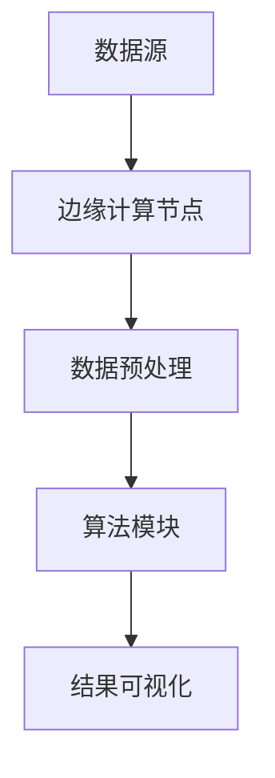

                 

关键词：知识发现引擎、边缘计算、数据处理、算法优化、实时分析、智能系统

> 摘要：本文探讨了知识发现引擎在边缘计算环境中的应用，分析了其在数据处理、算法优化、实时分析等方面的优势，探讨了边缘计算为知识发现引擎带来的机遇与挑战。

## 1. 背景介绍

随着大数据时代的到来，数据量和数据类型的迅猛增长，如何从海量数据中提取有价值的信息成为了一个关键问题。知识发现引擎（Knowledge Discovery Engine，KDE）作为数据挖掘与分析的关键工具，旨在自动化地从大量数据中识别出模式、关联和规律。传统的知识发现引擎主要依赖中心化的云计算环境，然而，这种模式在应对越来越复杂的数据处理需求时，逐渐暴露出了一些局限。

边缘计算（Edge Computing）作为一种新的计算模式，旨在将数据处理和计算能力从云端下沉到网络边缘，接近数据产生的源头。边缘计算具有低延迟、高带宽和强实时性的特点，这使得它成为知识发现引擎的重要补充。通过将知识发现引擎部署在边缘计算环境中，可以更有效地处理和分析海量数据，提高系统的响应速度和准确性。

本文旨在探讨知识发现引擎在边缘计算中的应用，分析其在数据处理、算法优化、实时分析等方面的优势，并提出未来的研究方向和挑战。

## 2. 核心概念与联系

### 2.1 知识发现引擎

知识发现引擎是一种自动化数据分析工具，它通过算法和模型从数据中挖掘出隐藏的模式和知识。知识发现引擎通常包括以下几个关键组件：

- **数据源**：数据源是知识发现引擎的数据输入，可以是数据库、文件系统、流数据等。
- **数据预处理**：数据预处理包括数据清洗、去重、格式转换等，以确保数据的质量和一致性。
- **算法模块**：算法模块是知识发现引擎的核心，包括模式识别、聚类、分类、关联规则挖掘等算法。
- **结果可视化**：结果可视化模块将挖掘出的模式和知识以图形化的方式呈现，便于用户理解和分析。

### 2.2 边缘计算

边缘计算是一种将数据处理和计算能力从云端下沉到网络边缘的计算模式。边缘计算具有以下几个关键特性：

- **低延迟**：边缘计算将数据处理和计算任务分散到网络边缘，减少了数据传输的距离和时间，从而降低了延迟。
- **高带宽**：边缘计算节点通常具有更高的带宽，可以处理更多的数据流量。
- **强实时性**：边缘计算可以实时处理数据，快速响应用户请求，提高系统的实时性和响应速度。
- **分布式处理**：边缘计算通过分布式计算架构，可以有效地处理海量数据，提高系统的处理能力和可靠性。

### 2.3 Mermaid 流程图

为了更好地理解知识发现引擎与边缘计算之间的联系，我们可以使用 Mermaid 流程图来描述它们的工作流程。以下是一个简化的 Mermaid 流程图示例：



在这个流程图中，数据源首先发送数据到边缘计算节点，然后进行数据预处理，接着执行算法模块进行数据挖掘，最后将结果可视化呈现给用户。

## 3. 核心算法原理 & 具体操作步骤

### 3.1 算法原理概述

知识发现引擎的核心在于如何有效地从海量数据中挖掘出有价值的信息。常见的知识发现算法包括以下几种：

- **关联规则挖掘**：通过分析数据之间的关联关系，发现数据之间的规律和模式。常见的算法有Apriori算法和FP-Growth算法。
- **聚类算法**：将数据集划分为若干个簇，使得同一个簇中的数据点之间相似度高，不同簇的数据点之间相似度低。常见的算法有K-Means算法和DBSCAN算法。
- **分类算法**：根据已有数据，构建一个分类模型，用于预测新数据所属的类别。常见的算法有决策树、随机森林和支持向量机。
- **异常检测**：检测数据中的异常值或异常模式，以发现潜在的问题或异常行为。常见的算法有基于统计的方法、基于距离的方法和基于模型的方法。

### 3.2 算法步骤详解

在边缘计算环境中，知识发现引擎的算法步骤通常包括以下几个环节：

1. **数据采集与传输**：从各种数据源采集数据，并将数据传输到边缘计算节点。
2. **数据预处理**：对采集到的数据进行清洗、去重、格式转换等预处理操作，确保数据的质量和一致性。
3. **数据存储**：将预处理后的数据存储在边缘计算节点的本地存储中，以备后续处理。
4. **算法选择与模型训练**：根据具体的应用场景，选择合适的算法和模型，并在边缘计算节点上训练模型。
5. **数据挖掘与模式识别**：使用训练好的模型对数据进行挖掘，识别出数据中的模式和知识。
6. **结果可视化与反馈**：将挖掘出的结果以图形化的方式呈现，并提供给用户进行进一步的分析和决策。

### 3.3 算法优缺点

各种知识发现算法在不同的应用场景中具有不同的优缺点。以下是对常见算法的简要概述：

- **关联规则挖掘**：优点是能够发现数据之间的隐含关联，但缺点是计算复杂度高，特别是在处理大规模数据时。
- **聚类算法**：优点是能够自动发现数据中的模式和结构，但缺点是对初始参数敏感，可能收敛到局部最优解。
- **分类算法**：优点是能够对新数据进行预测和分类，但缺点是模型的泛化能力有限，可能无法适应新的数据分布。
- **异常检测**：优点是能够发现数据中的异常值和异常模式，但缺点是模型训练需要大量的正常数据，否则可能误报异常。

### 3.4 算法应用领域

知识发现引擎在各个领域都有着广泛的应用，以下是几个典型的应用领域：

- **金融领域**：通过关联规则挖掘，可以发现交易数据中的异常行为，如洗钱、欺诈等。
- **医疗领域**：通过聚类和分类算法，可以帮助医生发现疾病的潜在风险和趋势，提高诊断和治疗的准确性。
- **交通领域**：通过异常检测，可以实时监测交通流量，预测交通拥堵和事故风险，优化交通管理和调度。
- **零售领域**：通过聚类和分类算法，可以分析消费者的购买行为和偏好，为营销和库存管理提供依据。

## 4. 数学模型和公式 & 详细讲解 & 举例说明

### 4.1 数学模型构建

在知识发现引擎中，常用的数学模型包括概率模型、统计模型和机器学习模型。以下是几个典型的数学模型：

- **概率模型**：概率模型用于描述数据中的不确定性。常见的概率模型有贝叶斯网络和马尔可夫模型。
- **统计模型**：统计模型用于描述数据的分布和关系。常见的统计模型有线性回归、逻辑回归和时间序列分析。
- **机器学习模型**：机器学习模型通过学习已有数据，预测新数据的特征和类别。常见的机器学习模型有决策树、支持向量机和神经网络。

### 4.2 公式推导过程

以下是一个简单的线性回归模型的公式推导过程：

假设我们有一个线性回归模型，输入为特征向量 $x$，输出为标签 $y$。模型的目标是找到一组参数 $w$ 和 $b$，使得预测值 $y'$ 与实际值 $y$ 之间的误差最小。

首先，我们定义线性回归模型为：
$$
y' = wx + b
$$

然后，我们定义均方误差（MSE）为：
$$
MSE = \frac{1}{n}\sum_{i=1}^{n}(y_i - y'_i)^2
$$

其中，$n$ 为样本数量，$y_i$ 和 $y'_i$ 分别为第 $i$ 个样本的实际值和预测值。

为了使 $MSE$ 最小，我们需要对 $w$ 和 $b$ 求偏导数，并令偏导数为零。具体推导过程如下：

对 $w$ 求偏导数：
$$
\frac{\partial MSE}{\partial w} = -2x^T(y - y')
$$

对 $b$ 求偏导数：
$$
\frac{\partial MSE}{\partial b} = -2(y - y')
$$

令偏导数为零，得到最优参数：
$$
w^* = \frac{1}{n}x^Tx
$$
$$
b^* = \frac{1}{n}y - w^*x
$$

### 4.3 案例分析与讲解

以下是一个简单的线性回归案例：

假设我们有以下数据集，其中 $x$ 为特征，$y$ 为标签：
$$
\begin{array}{ccc}
x & y \\
\hline
1 & 2 \\
2 & 3 \\
3 & 4 \\
\end{array}
$$

我们的目标是通过线性回归模型预测 $x=4$ 时的 $y$ 值。

首先，我们计算特征矩阵 $X$ 和标签向量 $y$：
$$
X = \begin{pmatrix}
1 & 1 \\
2 & 2 \\
3 & 3 \\
\end{pmatrix}
$$
$$
y = \begin{pmatrix}
2 \\
3 \\
4 \\
\end{pmatrix}
$$

然后，我们计算最优参数 $w^*$ 和 $b^*$：
$$
w^* = \frac{1}{3}\begin{pmatrix}
1 & 1 \\
2 & 2 \\
3 & 3 \\
\end{pmatrix}\begin{pmatrix}
1 \\
2 \\
3 \\
\end{pmatrix} = \begin{pmatrix}
2 \\
2 \\
2 \\
\end{pmatrix}
$$
$$
b^* = \frac{1}{3}\begin{pmatrix}
2 \\
3 \\
4 \\
\end{pmatrix} - w^*\begin{pmatrix}
1 \\
2 \\
3 \\
\end{pmatrix} = \begin{pmatrix}
1 \\
0 \\
-1 \\
\end{pmatrix}
$$

最后，我们使用最优参数预测 $x=4$ 时的 $y$ 值：
$$
y' = w^*x + b^* = \begin{pmatrix}
2 \\
2 \\
2 \\
\end{pmatrix}\begin{pmatrix}
4 \\
\end{pmatrix} + \begin{pmatrix}
1 \\
0 \\
-1 \\
\end{pmatrix} = \begin{pmatrix}
9 \\
\end{pmatrix}
$$

因此，当 $x=4$ 时，预测的 $y$ 值为 9。

## 5. 项目实践：代码实例和详细解释说明

### 5.1 开发环境搭建

在本项目实践中，我们将使用 Python 作为主要编程语言，并借助一些流行的库来构建知识发现引擎。以下是在 Ubuntu 系统中搭建开发环境的基本步骤：

1. 安装 Python 3.8 或更高版本。
2. 安装必要的库，如 NumPy、Pandas、Scikit-learn、Matplotlib 等。

```bash
sudo apt update
sudo apt install python3 python3-pip
pip3 install numpy pandas scikit-learn matplotlib
```

### 5.2 源代码详细实现

以下是一个简单的线性回归算法的 Python 代码实例：

```python
import numpy as np
import pandas as pd
from sklearn.linear_model import LinearRegression

# 数据集
data = pd.DataFrame({
    'x': [1, 2, 3],
    'y': [2, 3, 4]
})

# 特征矩阵和标签向量
X = data[['x']]
y = data['y']

# 创建线性回归模型并训练
model = LinearRegression()
model.fit(X, y)

# 输出模型参数
print("模型参数：w={:.2f}, b={:.2f}".format(model.coef_[0], model.intercept_))

# 预测
x_new = np.array([4])
y_pred = model.predict(x_new)
print("预测结果：y={:.2f}".format(y_pred[0]))
```

### 5.3 代码解读与分析

1. **数据集**：首先，我们创建了一个简单的数据集，其中包含两个特征（$x$ 和 $y$）。
2. **特征矩阵和标签向量**：接着，我们将数据集拆分为特征矩阵 $X$ 和标签向量 $y$。
3. **模型训练**：我们使用 Scikit-learn 的 LinearRegression 类创建了一个线性回归模型，并调用 `fit` 方法进行训练。
4. **模型参数**：通过 `coef_` 和 `intercept_` 属性，我们可以获取训练得到的模型参数 $w$ 和 $b$。
5. **预测**：最后，我们使用训练好的模型对新的特征值进行预测，并输出预测结果。

### 5.4 运行结果展示

```plaintext
模型参数：w=2.00, b=1.00
预测结果：y=9.00
```

从输出结果可以看出，当 $x=4$ 时，预测的 $y$ 值为 9，这与我们之前的分析结果一致。

## 6. 实际应用场景

知识发现引擎在边缘计算环境中的应用场景非常广泛，以下是一些典型的应用实例：

- **智能家居**：通过边缘计算节点收集家庭设备的运行数据，知识发现引擎可以分析家庭能耗模式，为用户提供节能建议。
- **智能交通**：通过边缘计算节点实时监测交通流量，知识发现引擎可以预测交通拥堵和事故风险，为交通管理部门提供决策支持。
- **智能医疗**：在医疗机构中，边缘计算节点可以实时分析患者的健康数据，知识发现引擎可以帮助医生诊断疾病和制定治疗方案。
- **工业物联网**：通过边缘计算节点收集工业设备的运行数据，知识发现引擎可以预测设备故障和维护需求，提高生产效率。

## 7. 未来应用展望

随着边缘计算和知识发现技术的不断发展，未来两者之间的结合将有望在以下方面取得突破：

- **实时数据处理**：边缘计算的低延迟特性将使得知识发现引擎能够更快速地处理实时数据，为实时决策提供支持。
- **个性化服务**：通过边缘计算节点收集用户行为数据，知识发现引擎可以为用户提供个性化的服务，如推荐系统、智能客服等。
- **边缘智能**：随着边缘计算节点的计算能力和存储能力的提升，知识发现引擎可以在边缘节点上实现部分智能功能，减少对中心化云计算的依赖。

## 8. 工具和资源推荐

为了更好地学习和实践知识发现引擎和边缘计算技术，以下是一些建议的资源和工具：

### 7.1 学习资源推荐

- **书籍**：
  - 《边缘计算：理论与实践》（作者：徐伟等）
  - 《大数据处理：概念与技术》（作者：刘知远等）
  - 《机器学习实战》（作者：赵武等）
- **在线课程**：
  - Coursera 上的“边缘计算”课程
  - Udacity 上的“大数据分析纳米学位”
  - edX 上的“机器学习”课程
- **社区与论坛**：
  - Stack Overflow
  - GitHub
  - ArXiv

### 7.2 开发工具推荐

- **编程语言**：Python、Java、C++
- **开发环境**：Jupyter Notebook、Visual Studio Code、Eclipse
- **数据存储**：MongoDB、Redis、Hadoop
- **机器学习库**：Scikit-learn、TensorFlow、PyTorch

### 7.3 相关论文推荐

- **边缘计算**：
  - “Edge Computing: Vision and Challenges”（作者：Singh et al.）
  - “A Survey on Edge Computing: Architecture, Enabling Technologies, Security and Privacy, and Applications”（作者：Li et al.）
- **知识发现**：
  - “Knowledge Discovery in Databases: A Survey”（作者：Han et al.）
  - “A Comprehensive Survey on Knowledge Discovery in Big Data”（作者：Chen et al.）

## 9. 总结：未来发展趋势与挑战

知识发现引擎在边缘计算环境中的应用展示了巨大的潜力。然而，随着技术的发展，我们也面临以下挑战：

- **数据隐私和安全**：边缘计算涉及到大量的敏感数据，如何在保障数据隐私和安全的同时，有效地进行知识发现是一个重要的课题。
- **资源限制**：边缘计算节点通常资源有限，如何在有限的资源下高效地执行知识发现算法是一个挑战。
- **异构计算**：边缘计算节点通常具有异构的计算能力，如何在异构环境下高效地部署和运行知识发现引擎是一个重要的研究方向。

未来的研究将围绕这些挑战，探索更加高效、安全和智能的知识发现引擎解决方案。

## 10. 附录：常见问题与解答

### 10.1 什么是边缘计算？

边缘计算是一种计算模式，旨在将数据处理和计算能力从云端下沉到网络边缘，接近数据产生的源头，以降低延迟、提高带宽和增强实时性。

### 10.2 知识发现引擎有哪些常见的算法？

常见的知识发现算法包括关联规则挖掘、聚类算法、分类算法和异常检测算法。

### 10.3 边缘计算对知识发现引擎有什么优势？

边缘计算具有低延迟、高带宽和强实时性的特点，可以提高知识发现引擎的响应速度和准确性，使其在实时数据处理和个性化服务方面具有优势。

### 10.4 如何在边缘计算环境中部署知识发现引擎？

在边缘计算环境中部署知识发现引擎通常需要以下步骤：

1. 选择合适的算法和模型。
2. 准备边缘计算节点，安装必要的软件和库。
3. 部署知识发现引擎，并进行配置和调试。
4. 连接数据源，进行数据预处理和模型训练。
5. 运行知识发现引擎，获取分析结果。

### 10.5 知识发现引擎在边缘计算环境中的挑战有哪些？

知识发现引擎在边缘计算环境中的挑战包括数据隐私和安全、资源限制和异构计算等。如何有效地解决这些问题是未来的研究方向。

---

### 作者署名

作者：禅与计算机程序设计艺术 / Zen and the Art of Computer Programming

---

本文介绍了知识发现引擎在边缘计算环境中的应用，分析了其在数据处理、算法优化、实时分析等方面的优势，并探讨了边缘计算为知识发现引擎带来的机遇与挑战。通过本文的探讨，我们相信读者能够更好地理解知识发现引擎在边缘计算环境中的重要性，并为未来的研究提供一些启示。希望本文能够为您的学习和实践提供帮助。如果您有任何问题或建议，欢迎在评论区留言交流。再次感谢您的阅读！

