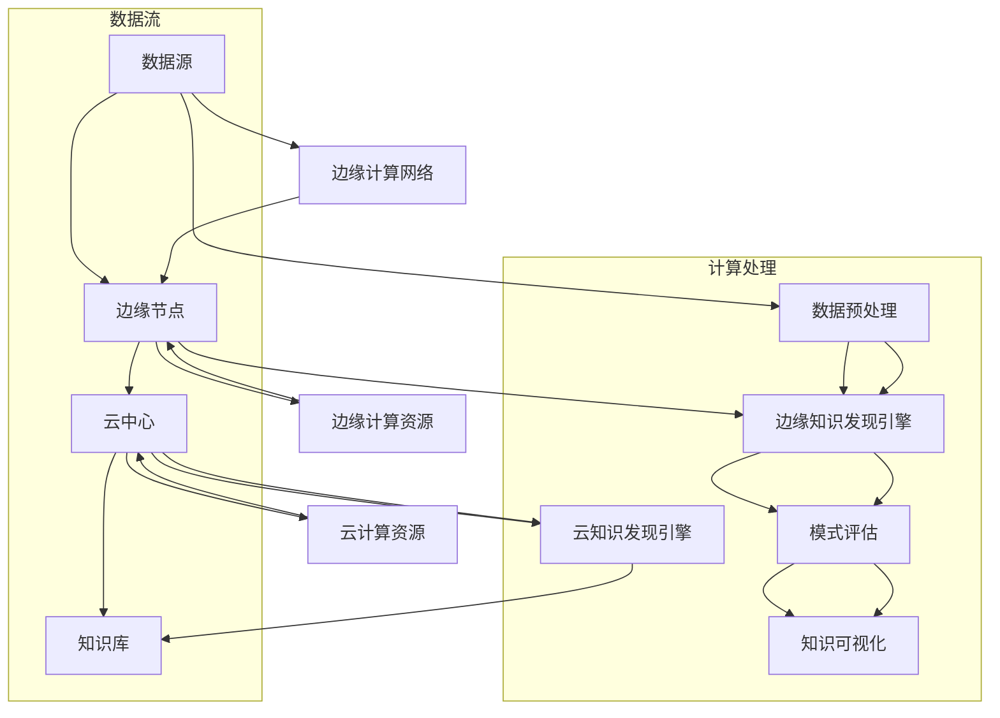

                 

 关键词：知识发现、边缘计算、数据挖掘、智能算法、应用实践、技术展望

> 摘要：本文将探讨知识发现引擎在边缘计算环境中的应用，分析其核心概念、算法原理、数学模型及其在各类应用场景中的实际效果和未来发展趋势。通过案例分析和代码实例，我们将展示边缘计算技术在知识发现领域的创新应用，为相关领域的研究者和开发者提供有价值的参考。

## 1. 背景介绍

随着物联网（IoT）和5G通信技术的快速发展，大量的数据正以前所未有的速度和规模生成。这些数据不仅包括传统的结构化数据，还涵盖了大量的非结构化和半结构化数据。如何在海量数据中快速、准确地发现有价值的信息，成为当前信息技术领域的一个重要课题。知识发现（Knowledge Discovery in Databases，KDD）作为数据挖掘的一个高级阶段，旨在从大量数据中识别出潜在的、未知的、有价值的知识。

与此同时，边缘计算（Edge Computing）作为一种分布式计算架构，旨在将数据处理和计算任务从云中心转移到数据源附近的边缘节点，以减少数据传输延迟，提高系统响应速度。边缘计算在物联网、智能交通、智能制造等领域的应用日益广泛，成为提升这些领域智能化水平的关键技术。

本文将结合知识发现引擎和边缘计算技术，探讨其融合应用的前景和挑战，通过具体案例展示其在现实世界中的应用效果。

## 2. 核心概念与联系

### 2.1. 知识发现引擎

知识发现引擎是一种软件系统，它能够自动地从大量数据中识别出潜在的、未知的、有价值的知识。知识发现过程通常包括数据预处理、数据挖掘、模式评估和知识可视化等步骤。

- **数据预处理**：包括数据清洗、集成、转换和归一化等操作，目的是提高数据质量，为数据挖掘提供可靠的数据源。
- **数据挖掘**：使用各种算法和技术，从数据中提取模式和知识，如分类、聚类、关联规则挖掘、异常检测等。
- **模式评估**：评估挖掘出的模式的有用性和可靠性，确定哪些模式是真正有价值的。
- **知识可视化**：将挖掘出的知识以图形、图表等形式呈现，帮助用户更好地理解和利用这些知识。

### 2.2. 边缘计算技术

边缘计算是将数据处理和计算任务从中心化的云服务器转移到靠近数据源的边缘节点，如物联网设备、智能路由器等。边缘计算的主要优势在于：

- **降低延迟**：通过在数据源附近进行数据处理，可以显著降低数据传输的延迟，提高系统的实时性。
- **提高带宽效率**：减少数据传输量，降低网络带宽需求。
- **增强安全性**：在边缘节点处理数据可以减少敏感数据在网络中的传输，提高数据安全性。

### 2.3. 知识发现引擎与边缘计算技术的联系

知识发现引擎在边缘计算环境中的应用，可以通过以下几个方面实现：

- **实时数据处理**：利用边缘计算技术，知识发现引擎可以实时处理来自物联网设备的数据，快速识别出潜在的知识。
- **分布式计算**：在边缘节点部署知识发现引擎，可以实现分布式计算，提高处理大量数据的能力。
- **混合云架构**：结合云中心和边缘计算节点，实现知识的收集、处理和共享，提高系统的灵活性和扩展性。

下面是一个使用Mermaid绘制的知识发现引擎与边缘计算技术的架构图：



## 3. 核心算法原理 & 具体操作步骤

### 3.1 算法原理概述

知识发现引擎的核心算法通常包括以下几类：

- **分类算法**：如决策树、支持向量机（SVM）、神经网络等，用于预测数据中的类别。
- **聚类算法**：如K-means、层次聚类等，用于将数据分为若干个不同的集群。
- **关联规则挖掘**：如Apriori算法、FP-growth算法等，用于发现数据之间的关联关系。
- **异常检测**：如孤立森林、One-Class SVM等，用于检测数据中的异常值。

边缘计算环境下，这些算法需要适应分布式计算的特点，并进行优化，以确保在有限的计算资源下高效运行。

### 3.2 算法步骤详解

1. **数据收集与预处理**：

   - 数据收集：从各种数据源获取原始数据，包括结构化和非结构化数据。
   - 数据预处理：清洗数据，包括去除噪声、填充缺失值、归一化等。

2. **边缘节点分布式计算**：

   - 数据分片：将大规模数据集划分为多个较小的数据分片，分布在多个边缘节点上。
   - 并行计算：在每个边缘节点上分别运行相应的知识发现算法，如分类、聚类等。
   - 结果聚合：将各个边缘节点的计算结果进行聚合，得到全局的知识模式。

3. **云中心集中处理**：

   - 云中心接收边缘节点的计算结果，进行进一步的模式评估和知识可视化。
   - 对挖掘出的知识进行过滤和筛选，确保其准确性和实用性。

4. **知识库更新**：

   - 将挖掘出的知识更新到知识库中，为后续的数据分析提供支持。

### 3.3 算法优缺点

#### 优点

- **实时性**：边缘计算技术能够显著降低数据处理延迟，实现实时知识发现。
- **高效性**：分布式计算可以充分利用边缘节点的计算资源，提高数据处理效率。
- **灵活性**：边缘计算与云中心相结合，可以灵活调整计算资源和处理任务。

#### 缺点

- **计算资源限制**：边缘节点通常计算资源有限，算法优化和资源调度是挑战。
- **数据安全**：边缘节点分布在不同的地理位置，数据安全和管理是一个重要问题。
- **网络带宽**：边缘节点与云中心之间的数据传输可能受到带宽限制，影响系统性能。

### 3.4 算法应用领域

知识发现引擎在边缘计算中的应用领域非常广泛，主要包括：

- **智能制造**：通过实时分析生产过程中的数据，优化生产流程，提高生产效率。
- **智能交通**：分析交通数据，优化交通信号控制，提高交通流通效率。
- **智能医疗**：分析患者数据，预测疾病趋势，辅助医生进行诊断和治疗。
- **智能城市**：分析城市运行数据，优化城市管理，提高居民生活质量。

## 4. 数学模型和公式 & 详细讲解 & 举例说明

### 4.1 数学模型构建

知识发现引擎的数学模型通常基于以下几类数学模型：

- **概率模型**：如贝叶斯网络、概率图模型等，用于表示数据之间的概率关系。
- **线性模型**：如线性回归、逻辑回归等，用于建立数据之间的线性关系。
- **非线性模型**：如支持向量机（SVM）、神经网络等，用于建立数据的非线性关系。

在边缘计算环境下，这些数学模型需要进行适当的调整和优化，以适应分布式计算的特点。

### 4.2 公式推导过程

以K-means聚类算法为例，其目标是最小化数据点到聚类中心之间的距离平方和。其数学模型可以表示为：

$$
\min \sum_{i=1}^{n} \sum_{j=1}^{k} (x_{ij} - \mu_{j})^2
$$

其中，$x_{ij}$ 表示第$i$个数据点在第$j$个聚类中心处的特征值，$\mu_{j}$ 表示第$j$个聚类中心的位置。

### 4.3 案例分析与讲解

以智能交通领域为例，我们使用K-means算法对交通流量数据进行聚类分析，以识别不同的交通状况。

1. **数据预处理**：

   - 收集交通流量数据，包括车流量、车速、道路占用率等。
   - 数据清洗，去除异常值和噪声。

2. **模型训练**：

   - 确定聚类数量$k$，通常使用肘部法则确定最佳聚类数量。
   - 初始化聚类中心$\mu_{j}$。
   - 迭代计算每个数据点的聚类中心，直至收敛。

3. **模式评估**：

   - 分析聚类结果，识别不同的交通状况，如高峰期、平峰期等。
   - 对每个聚类结果进行评估，确保其准确性和实用性。

4. **知识可视化**：

   - 将聚类结果以图表形式展示，帮助交通管理人员更好地理解和利用这些知识。

## 5. 项目实践：代码实例和详细解释说明

### 5.1 开发环境搭建

1. **硬件环境**：

   - 边缘节点：使用树莓派等小型计算设备。
   - 云中心：使用AWS、Azure等云服务。

2. **软件环境**：

   - 操作系统：Linux发行版，如Ubuntu。
   - 编程语言：Python、JavaScript等。
   - 数据库：MySQL、MongoDB等。

### 5.2 源代码详细实现

以下是一个简单的Python代码实例，用于实现K-means聚类算法在边缘计算环境下的应用：

```python
import numpy as np
import matplotlib.pyplot as plt

def kmeans(data, k, max_iterations):
    # 初始化聚类中心
    centroids = data[np.random.choice(data.shape[0], k, replace=False)]
    
    for i in range(max_iterations):
        # 计算每个数据点到聚类中心的距离
        distances = np.linalg.norm(data - centroids, axis=1)
        
        # 根据距离分配数据点到聚类中心
        labels = np.argmin(distances, axis=1)
        
        # 更新聚类中心
        new_centroids = np.array([data[labels == j].mean(axis=0) for j in range(k)])
        
        # 判断是否收敛
        if np.all(new_centroids == centroids):
            break
        
        centroids = new_centroids
    
    return centroids, labels

# 数据准备
data = np.random.rand(100, 2)

# 聚类分析
centroids, labels = kmeans(data, 3, 100)

# 可视化结果
plt.scatter(data[:, 0], data[:, 1], c=labels)
plt.scatter(centroids[:, 0], centroids[:, 1], s=300, c='red')
plt.show()
```

### 5.3 代码解读与分析

1. **数据准备**：

   - 使用`numpy`生成随机数据集，模拟实际交通流量数据。
   
2. **K-means算法实现**：

   - 初始化聚类中心，使用随机选择的数据点作为初始聚类中心。
   - 迭代计算每个数据点到聚类中心的距离，并分配数据点到最近的聚类中心。
   - 根据新的聚类中心更新聚类中心，直至算法收敛。

3. **结果可视化**：

   - 使用`matplotlib`绘制数据点和聚类中心，帮助用户直观地理解聚类结果。

### 5.4 运行结果展示

运行上述代码，将生成一个散点图，显示数据点被分配到不同的聚类中心。通过可视化结果，我们可以直观地看到不同交通状况的分布情况，为交通管理提供决策支持。

## 6. 实际应用场景

### 6.1 智能制造

在智能制造领域，知识发现引擎与边缘计算技术的结合可以实现对生产过程的实时监控和优化。例如，通过实时分析设备运行数据，可以预测设备故障，提前进行维护，减少停机时间，提高生产效率。

### 6.2 智能交通

智能交通系统利用边缘计算技术，可以实现对交通流量的实时监控和分析。通过聚类分析交通流量数据，可以识别高峰期和平峰期的交通状况，优化交通信号控制策略，提高交通通行效率。

### 6.3 智能医疗

智能医疗系统通过边缘计算技术，可以实现对患者数据的实时分析。通过知识发现技术，可以识别出患者的健康趋势，提前进行预警，为医生提供诊断和治疗建议。

### 6.4 智能城市

智能城市利用边缘计算技术，可以实现对城市运行数据的实时监控和分析。通过知识发现技术，可以优化城市管理，提高居民生活质量。

## 7. 工具和资源推荐

### 7.1 学习资源推荐

- **《边缘计算：原理与应用》**：详细介绍边缘计算技术的基本原理和应用案例。
- **《数据挖掘：概念与技术》**：全面讲解数据挖掘的基本概念和技术方法。

### 7.2 开发工具推荐

- **TensorFlow**：开源的机器学习框架，适用于边缘计算环境。
- **Kubernetes**：用于容器编排和分布式计算的管理工具。

### 7.3 相关论文推荐

- **“Edge Computing for IoT: A Comprehensive Survey”**：对边缘计算在物联网领域的应用进行系统综述。
- **“Knowledge Discovery from Big Data: A Survey”**：对大数据知识发现技术进行深入探讨。

## 8. 总结：未来发展趋势与挑战

### 8.1 研究成果总结

本文通过对知识发现引擎与边缘计算技术的结合应用进行探讨，总结了其在实时数据处理、分布式计算、智能优化等领域的优势，并通过具体案例展示了其应用效果。

### 8.2 未来发展趋势

随着物联网、5G通信、人工智能等技术的发展，边缘计算与知识发现引擎的结合应用前景广阔。未来，我们将看到更多跨学科的融合研究和创新应用，如智能医疗、智能交通、智能城市等。

### 8.3 面临的挑战

尽管边缘计算与知识发现引擎的结合应用前景广阔，但仍然面临一些挑战，如计算资源限制、数据安全、算法优化等。需要持续进行技术创新和优化，以应对这些挑战。

### 8.4 研究展望

未来，我们期待在以下几个方面进行深入研究：

- **算法优化**：研究更加高效的算法，以适应边缘计算环境。
- **数据安全**：探讨如何在边缘计算环境中确保数据安全和隐私。
- **跨学科融合**：推动边缘计算与知识发现引擎在更多领域的融合应用。

## 9. 附录：常见问题与解答

### 问题1：边缘计算与云计算的区别是什么？

**解答**：边缘计算与云计算的主要区别在于数据处理的位置。云计算是在远程数据中心进行数据处理，而边缘计算是在靠近数据源的边缘节点进行数据处理。这降低了数据传输延迟，提高了系统的实时性。

### 问题2：知识发现引擎在边缘计算中的优势是什么？

**解答**：知识发现引擎在边缘计算中的优势主要包括：

- **实时性**：通过边缘计算技术，可以实现实时数据处理和知识发现。
- **高效性**：分布式计算可以提高数据处理效率。
- **灵活性**：结合云中心和边缘计算节点，可以灵活调整计算资源和处理任务。

### 问题3：边缘计算环境下的数据安全如何保障？

**解答**：边缘计算环境下的数据安全需要采取以下措施：

- **数据加密**：对数据进行加密，确保数据在传输和存储过程中的安全性。
- **身份验证**：对访问数据的用户进行身份验证，确保数据只被授权用户访问。
- **访问控制**：实施严格的访问控制策略，限制对数据的访问权限。

---

作者：禅与计算机程序设计艺术 / Zen and the Art of Computer Programming

