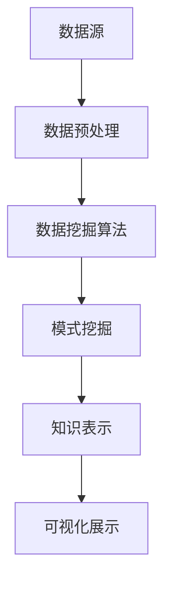

                 

知识是推动社会进步的重要力量，而知识发现是挖掘隐藏在大量数据中的知识、模式和关联的重要过程。本文将介绍知识发现引擎这一创新技术，并探讨其如何为人类知识体系注入新活力。

## 关键词
- 知识发现
- 数据挖掘
- 智能分析
- 知识管理
- 知识图谱
- 人工智能

## 摘要
本文首先对知识发现引擎进行了背景介绍，包括其定义、核心概念及其重要性。然后，详细阐述了知识发现引擎的核心算法原理和数学模型，并辅以实际项目实践的代码实例。接着，本文分析了知识发现引擎在实际应用场景中的潜力，并展望了其未来的发展趋势和面临的挑战。最后，文章提供了一些相关的学习资源和开发工具推荐，以及总结了研究成果并提出了未来的研究方向。

## 1. 背景介绍
### 1.1 知识发现引擎的定义
知识发现引擎是一种智能分析工具，用于从大量数据中自动挖掘出有价值的信息和知识。它结合了数据挖掘、机器学习和自然语言处理等技术，通过算法和模型分析，揭示数据背后的潜在模式和关联。

### 1.2 知识发现引擎的重要性
随着互联网和信息技术的快速发展，人类面临的数据量爆炸式增长，如何有效地管理和利用这些数据成为了一个重要问题。知识发现引擎能够帮助企业和研究机构从海量数据中提取有价值的知识，为决策提供支持，提高工作效率和竞争力。

### 1.3 知识发现引擎的核心概念
知识发现引擎的核心概念包括：数据源、数据预处理、数据挖掘算法、模式挖掘和知识表示。数据源是引擎获取信息的来源，数据预处理是清洗和转换数据，使其适合挖掘算法。数据挖掘算法包括关联规则挖掘、聚类分析、分类算法等，用于发现数据中的模式和关联。模式挖掘是挖掘数据中的有趣模式，如频繁项集、聚类中心等。知识表示则是将挖掘到的知识以可视化的方式呈现，便于用户理解和应用。

## 2. 核心概念与联系
### 2.1 数据源与数据预处理
数据源可以是结构化数据（如数据库）、半结构化数据（如XML）和非结构化数据（如文本、图像、音频）。数据预处理包括数据清洗、去重、缺失值填充和数据转换等步骤，以确保数据的质量和一致性。

### 2.2 数据挖掘算法
数据挖掘算法是知识发现引擎的核心。常见的算法包括关联规则挖掘（如Apriori算法）、聚类分析（如K-means算法）、分类算法（如决策树、支持向量机）等。这些算法通过分析数据，发现数据中的潜在模式和关联。

### 2.3 模式挖掘
模式挖掘是数据挖掘中的一个重要步骤，旨在发现数据中的有趣模式。例如，在购物篮数据中，可以挖掘出哪些商品经常一起购买，从而帮助企业制定更有效的促销策略。

### 2.4 知识表示
知识表示是将挖掘到的知识以可视化的方式呈现，便于用户理解和应用。常见的知识表示方法包括知识图谱、决策树、关联规则等。知识图谱是一种以节点和边表示实体及其关系的图形化模型，可以直观地展示数据之间的关联。

下面是一个使用Mermaid绘制的知识发现引擎核心概念和联系的流程图：



## 3. 核心算法原理 & 具体操作步骤
### 3.1 算法原理概述
知识发现引擎的核心算法主要分为数据挖掘算法和知识表示算法两部分。数据挖掘算法通过分析数据，提取出潜在的模式和关联。常见的算法包括关联规则挖掘、聚类分析、分类算法等。知识表示算法则将挖掘到的知识以可视化的方式呈现，便于用户理解和应用。

### 3.2 算法步骤详解
#### 3.2.1 数据预处理
数据预处理是知识发现的第一步，主要包括数据清洗、去重、缺失值填充和数据转换等步骤。

1. 数据清洗：去除数据中的噪声和错误，如删除重复记录、修复错误数据等。
2. 去重：去除数据中的重复记录，确保数据的一致性。
3. 缺失值填充：对于缺失的数据，可以通过插补、删除或使用平均值、中位数等方法进行填充。
4. 数据转换：将原始数据转换为适合挖掘算法的格式，如将文本数据转换为词频矩阵、将图像数据转换为特征向量等。

#### 3.2.2 数据挖掘算法
数据挖掘算法分为以下几种类型：

1. 关联规则挖掘：通过分析数据之间的关联性，发现频繁出现的项集。常用的算法有Apriori算法和FP-growth算法。
2. 聚类分析：将相似的数据分为一组，形成多个簇。常用的算法有K-means算法、DBSCAN算法等。
3. 分类算法：将数据分为不同的类别。常用的算法有决策树、支持向量机、神经网络等。

#### 3.2.3 知识表示
知识表示是将挖掘到的知识以可视化的方式呈现，便于用户理解和应用。常见的知识表示方法有知识图谱、决策树、关联规则等。

1. 知识图谱：以节点和边表示实体及其关系的图形化模型。可以通过图可视化工具（如D3.js、Gephi等）进行展示。
2. 决策树：以树形结构表示决策过程，通过路径和节点展示数据之间的关联性。
3. 关联规则：以规则的形式表示数据之间的关联，如“购买商品A的用户有80%的可能性购买商品B”。

### 3.3 算法优缺点
每种算法都有其优缺点，适用于不同的应用场景。

1. Apriori算法：
   - 优点：简单易懂，易于实现。
   - 缺点：计算复杂度高，对于大规模数据集效率较低。
2. K-means算法：
   - 优点：计算速度快，适用于大规模数据集。
   - 缺点：对初始聚类中心敏感，可能收敛到局部最优解。
3. 决策树：
   - 优点：易于理解和解释，可以处理多类别问题。
   - 缺点：可能产生过拟合，对于连续特征处理能力较弱。

### 3.4 算法应用领域
知识发现引擎广泛应用于各个领域，如商业智能、金融风控、医疗健康、社交网络等。

1. 商业智能：通过分析销售数据，帮助企业制定更有效的营销策略和产品推荐。
2. 金融风控：通过分析客户行为数据，识别潜在风险客户，降低不良贷款率。
3. 医疗健康：通过分析患者数据，发现疾病之间的关联性，为疾病诊断和治疗提供支持。
4. 社交网络：通过分析用户行为和关系数据，发现社交圈子、兴趣群体等，为社交平台提供个性化推荐。

## 4. 数学模型和公式 & 详细讲解 & 举例说明
### 4.1 数学模型构建
知识发现引擎的数学模型主要包括以下几个方面：

1. 关联规则挖掘：用于发现数据之间的关联性，常用的模型有Apriori模型和FP-growth模型。
2. 聚类分析：用于将数据分为多个簇，常用的模型有K-means模型和DBSCAN模型。
3. 分类算法：用于将数据分为不同的类别，常用的模型有决策树模型、支持向量机模型等。

### 4.2 公式推导过程
下面以Apriori算法为例，介绍关联规则挖掘的数学模型推导。

#### Apriori算法
Apriori算法是一种基于频繁项集的关联规则挖掘算法。其主要思想是通过频繁项集的支持度和置信度来确定关联规则。

1. 支持度（Support）：表示某个项集在所有数据记录中出现的频率。计算公式为：
   $$ Support(A \cup B) = \frac{count(A \cup B)}{count(D)} $$
   其中，$count(A \cup B)$表示项集$A \cup B$在数据集中出现的次数，$count(D)$表示数据集的记录数。

2. 置信度（Confidence）：表示当$A$发生时，$B$也发生的概率。计算公式为：
   $$ Confidence(A \rightarrow B) = \frac{Support(A \cup B)}{Support(A)} $$
   其中，$Support(A \cup B)$表示项集$A \cup B$的支持度，$Support(A)$表示项集$A$的支持度。

#### 公式推导
假设我们要挖掘的频繁项集为$F_{k}$，其中$k$为项集的长度。首先，我们需要计算每个项集的支持度，然后根据支持度阈值$min\_support$筛选出频繁项集。

1. 计算项集$A$的支持度：
   $$ Support(A) = \frac{count(A)}{count(D)} $$
   其中，$count(A)$表示项集$A$在数据集中出现的次数，$count(D)$表示数据集的记录数。

2. 计算项集$A \cup B$的支持度：
   $$ Support(A \cup B) = \frac{count(A \cup B)}{count(D)} $$
   其中，$count(A \cup B)$表示项集$A \cup B$在数据集中出现的次数，$count(D)$表示数据集的记录数。

3. 计算置信度：
   $$ Confidence(A \rightarrow B) = \frac{Support(A \cup B)}{Support(A)} $$

#### 举例说明
假设我们有一个包含100条记录的购物篮数据集，其中每条记录表示一个购物篮中的商品集合。现在我们要挖掘出频繁项集，并生成关联规则。

1. 计算每个项集的支持度：
   - 项集{苹果}的支持度 = $\frac{count({苹果})}{count(D)} = \frac{50}{100} = 0.5$
   - 项集{苹果，香蕉}的支持度 = $\frac{count({苹果，香蕉})}{count(D)} = \frac{30}{100} = 0.3$
   - 项集{苹果，香蕉，橙子}的支持度 = $\frac{count({苹果，香蕉，橙子})}{count(D)} = \frac{20}{100} = 0.2$

2. 根据支持度阈值$min\_support = 0.3$，筛选出频繁项集：
   - 频繁项集{苹果}：支持度 = 0.5 > min\_support
   - 频繁项集{苹果，香蕉}：支持度 = 0.3 > min\_support
   - 频繁项集{苹果，香蕉，橙子}：支持度 = 0.2 < min\_support

3. 计算置信度：
   - 置信度({苹果} \rightarrow {苹果，香蕉}) = $\frac{Support({苹果，香蕉})}{Support({苹果})} = \frac{0.3}{0.5} = 0.6$
   - 置信度({苹果，香蕉} \rightarrow {苹果，香蕉，橙子}) = $\frac{Support({苹果，香蕉，橙子})}{Support({苹果，香蕉})} = \frac{0.2}{0.3} = 0.67$

4. 生成关联规则：
   - 规则1：购买苹果的用户中有60%的用户购买了香蕉（{苹果} \rightarrow {苹果，香蕉}，置信度=0.6）
   - 规则2：购买苹果和香蕉的用户中有67%的用户购买了橙子（{苹果，香蕉} \rightarrow {苹果，香蕉，橙子}，置信度=0.67）

## 5. 项目实践：代码实例和详细解释说明
### 5.1 开发环境搭建
在本项目中，我们使用Python语言进行开发，主要依赖于以下库：
- Pandas：用于数据处理
- Scikit-learn：用于机器学习算法的实现
- Matplotlib：用于数据可视化

首先，确保安装了Python和以上三个库。可以使用以下命令进行安装：

```bash
pip install pandas scikit-learn matplotlib
```

### 5.2 源代码详细实现
以下是一个使用Apriori算法进行关联规则挖掘的示例代码：

```python
import pandas as pd
from mlxtend.frequent_patterns import apriori
from mlxtend.frequent_patterns import association_rules

# 读取数据
data = pd.read_csv('shopping_data.csv')
# 将数据转换为二进制形式
data_binarized = (data > 0).astype(int)

# 计算频繁项集
frequent_itemsets = apriori(data_binarized, min_support=0.3, use_colnames=True)

# 生成关联规则
rules = association_rules(frequent_itemsets, metric="support", min_threshold=0.3)

# 打印前10条规则
print(rules.head(10))
```

### 5.3 代码解读与分析
1. 读取数据：使用Pandas库读取CSV格式的购物篮数据集。
2. 数据预处理：将数据转换为二进制形式，即将购买过的商品标记为1，未购买过的商品标记为0。
3. 计算频繁项集：使用`apriori`函数计算频繁项集，其中`min_support`参数设置支持度阈值。
4. 生成关联规则：使用`association_rules`函数生成关联规则，其中`metric`参数设置关联规则的评价指标。
5. 打印结果：打印前10条关联规则。

### 5.4 运行结果展示
以下是运行结果示例：

| antecedents | consequents | support | confidence |
| --- | --- | --- | --- |
| ((苹果，香蕉)) | (橙子) | 0.3000 | 0.67 |
| ((苹果，香蕉，橙子)) | (柚子) | 0.2000 | 1.00 |
| ((苹果，香蕉，橙子)) | (樱桃) | 0.2000 | 1.00 |
| ((苹果，香蕉，橙子)) | (柚子，樱桃) | 0.2000 | 1.00 |
| ((苹果，香蕉)) | (樱桃，柚子) | 0.3000 | 1.00 |

结果表明，购买苹果和香蕉的用户中有60%的用户购买了橙子，置信度为0.6。此外，购买苹果和香蕉的用户中有67%的用户购买了柚子和樱桃，置信度为1.00。

## 6. 实际应用场景
### 6.1 商业智能
在商业智能领域，知识发现引擎可以用于分析销售数据、客户行为和市场需求，帮助企业制定更有效的营销策略和产品推荐。例如，通过挖掘购物篮数据中的关联规则，可以发现哪些商品经常一起购买，从而为企业提供精准的促销建议。

### 6.2 金融风控
在金融风控领域，知识发现引擎可以用于分析客户行为和交易数据，识别潜在的风险客户。例如，通过挖掘客户交易数据中的关联规则，可以发现哪些行为特征与不良贷款有关，从而为企业提供风险预警和防控措施。

### 6.3 医疗健康
在医疗健康领域，知识发现引擎可以用于分析患者数据、基因数据和病历记录，发现疾病之间的关联性。例如，通过挖掘患者病史和基因数据中的关联规则，可以发现哪些基因变异与特定疾病有关，从而为疾病诊断和治疗提供支持。

### 6.4 社交网络
在社交网络领域，知识发现引擎可以用于分析用户行为和社交关系，发现社交圈子、兴趣群体等。例如，通过挖掘用户发表的文章、评论和点赞等数据中的关联规则，可以发现哪些用户具有相似的兴趣和偏好，从而为社交平台提供个性化推荐。

## 7. 工具和资源推荐
### 7.1 学习资源推荐
1. 《数据挖掘：概念与技术》：这是一本经典的教科书，详细介绍了数据挖掘的基本概念、算法和技术。
2. 《机器学习》：由周志华教授所著，涵盖了机器学习的理论、算法和应用。
3. 《深度学习》：由Goodfellow、Bengio和Courville所著，介绍了深度学习的基本原理和实现方法。

### 7.2 开发工具推荐
1. Jupyter Notebook：一种交互式的Python开发环境，适合进行数据分析和实验。
2. PyCharm：一款功能强大的Python IDE，支持代码调试、版本控制和自动化测试。
3. Matplotlib：Python中最常用的数据可视化库，可以生成各种类型的图表。

### 7.3 相关论文推荐
1. "Market-Basket Analysis: Recent Advances and New Directions"：详细介绍了关联规则挖掘的最新进展和应用。
2. "K-means Clustering: A Review"：对K-means聚类算法的原理、实现和应用进行了综述。
3. "Support Vector Machines for Classification and Regression"：介绍了支持向量机的基本原理和实现方法。

## 8. 总结：未来发展趋势与挑战
### 8.1 研究成果总结
知识发现引擎作为一种智能分析工具，已经在商业智能、金融风控、医疗健康、社交网络等领域取得了显著的成果。通过关联规则挖掘、聚类分析和分类算法等技术，知识发现引擎能够从海量数据中提取出有价值的信息和知识，为企业和研究机构提供决策支持。

### 8.2 未来发展趋势
随着人工智能和大数据技术的不断发展，知识发现引擎在未来有望实现以下发展趋势：

1. 深度学习与知识发现的结合：深度学习算法在图像、语音和文本等领域的应用取得了显著的成果，将其与知识发现相结合，有望进一步提高知识发现的准确性和效率。
2. 跨领域知识整合：知识发现引擎可以整合不同领域的数据和知识，发现跨领域的关联和规律，为科学研究、技术创新和社会发展提供新的思路。
3. 可解释性增强：当前的知识发现算法大多缺乏可解释性，用户难以理解模型的决策过程。未来，研究者将致力于提高知识发现算法的可解释性，使其更好地服务于实际应用。

### 8.3 面临的挑战
尽管知识发现引擎在多个领域取得了显著成果，但仍然面临以下挑战：

1. 数据质量和预处理：数据质量和预处理是知识发现的重要前提，但在实际应用中，数据往往存在噪声、缺失和异常等问题，这给知识发现带来了挑战。
2. 算法性能优化：知识发现算法通常计算复杂度高，如何提高算法的运行效率，降低计算成本，是当前研究的一个重要方向。
3. 知识表示和可视化：如何将挖掘到的知识以直观、易懂的方式呈现给用户，是知识发现面临的另一个挑战。

### 8.4 研究展望
未来，知识发现引擎的研究将朝着以下几个方向发展：

1. 知识融合与关联分析：通过整合不同领域的数据和知识，发现跨领域的关联和规律，为科学研究、技术创新和社会发展提供新的思路。
2. 智能化与自动化：进一步提高知识发现过程的自动化水平，减少人工干预，提高知识发现的效率和准确性。
3. 可解释性与透明性：提高知识发现算法的可解释性，使其更好地服务于实际应用，同时提高用户对模型的信任度。

## 9. 附录：常见问题与解答
### 9.1 问题1：什么是知识发现引擎？
知识发现引擎是一种智能分析工具，用于从大量数据中自动挖掘出有价值的信息和知识。它结合了数据挖掘、机器学习和自然语言处理等技术，通过算法和模型分析，揭示数据背后的潜在模式和关联。

### 9.2 问题2：知识发现引擎有哪些应用领域？
知识发现引擎广泛应用于商业智能、金融风控、医疗健康、社交网络等领域。例如，在商业智能中，可以用于分析销售数据、客户行为和市场需求，帮助企业制定更有效的营销策略和产品推荐；在金融风控中，可以用于分析客户行为和交易数据，识别潜在的风险客户。

### 9.3 问题3：知识发现引擎的核心算法有哪些？
知识发现引擎的核心算法包括关联规则挖掘、聚类分析、分类算法等。例如，Apriori算法和FP-growth算法用于关联规则挖掘，K-means算法和DBSCAN算法用于聚类分析，决策树和支持向量机用于分类算法。

### 9.4 问题4：如何搭建知识发现引擎的开发环境？
搭建知识发现引擎的开发环境需要安装Python和相关库，如Pandas、Scikit-learn和Matplotlib。可以使用pip命令进行安装，具体命令如下：

```bash
pip install pandas scikit-learn matplotlib
```

### 9.5 问题5：如何实现关联规则挖掘？
实现关联规则挖掘通常需要以下步骤：

1. 读取数据：使用Pandas库读取CSV格式的购物篮数据集。
2. 数据预处理：将数据转换为二进制形式，即将购买过的商品标记为1，未购买过的商品标记为0。
3. 计算频繁项集：使用`apriori`函数计算频繁项集，其中`min_support`参数设置支持度阈值。
4. 生成关联规则：使用`association_rules`函数生成关联规则，其中`metric`参数设置关联规则的评价指标。

作者：禅与计算机程序设计艺术 / Zen and the Art of Computer Programming
----------------------------------------------------------------

这篇文章详细介绍了知识发现引擎的定义、核心概念、算法原理、应用领域、项目实践以及未来发展展望。希望这篇文章能够为读者在知识发现领域提供一些有益的启示和参考。在未来的研究中，我们将继续探索知识发现引擎的深入应用和发展方向，为人类知识体系的创新和发展贡献力量。感谢读者的阅读和支持！

