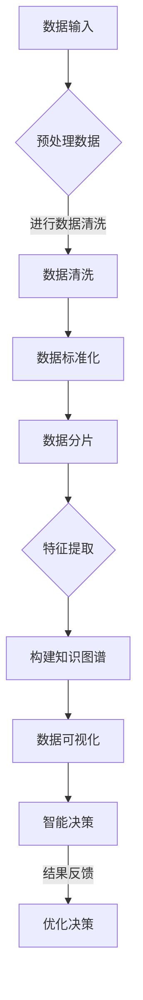

                 

关键词：知识发现，医疗领域，精准决策，人工智能，数据挖掘，知识图谱

> 摘要：本文将探讨知识发现引擎在医疗领域的应用，如何通过先进的人工智能和数据挖掘技术，构建一个支持精准医疗决策的知识体系，从而提升医疗服务的质量和效率。

## 1. 背景介绍

### 1.1 知识发现引擎的定义与作用

知识发现引擎是一种利用人工智能和数据挖掘技术，从大量数据中自动识别出有价值模式、关联和趋势的工具。它能够帮助企业和组织从海量数据中提取知识，实现数据的智能化利用。在医疗领域，知识发现引擎可以帮助医疗机构从海量医疗数据中挖掘出潜在的价值信息，为临床决策提供科学依据。

### 1.2 医疗领域的挑战

随着医学技术的进步和医疗数据的急剧增长，医疗领域面临着诸多挑战。例如，如何从海量患者数据中快速准确地诊断疾病、如何有效地管理患者健康、如何提高医疗资源的利用效率等。这些问题都迫切需要一种智能化、高效化的解决方案。

## 2. 核心概念与联系

### 2.1 人工智能与数据挖掘

人工智能（AI）和数据挖掘（Data Mining）是知识发现引擎的两个核心技术。人工智能通过模拟人类思维过程，实现对数据的高效处理和分析。数据挖掘则通过特定的算法和模型，从大量数据中提取出有价值的信息和知识。

### 2.2 知识图谱在医疗领域的应用

知识图谱是一种用于表示实体、概念及其之间关系的数据结构。在医疗领域，知识图谱可以用于构建一个包含医疗知识、药物信息、诊断方法等全面的知识体系。通过知识图谱，医疗数据可以被结构化地表示和存储，从而实现数据的快速检索和智能化分析。

### 2.3 Mermaid 流程图



## 3. 核心算法原理 & 具体操作步骤

### 3.1 算法原理概述

知识发现引擎的核心算法主要包括数据预处理、特征提取、知识图谱构建、数据可视化和智能决策等。这些算法共同作用，实现对医疗数据的全面分析和智能决策。

### 3.2 算法步骤详解

#### 3.2.1 数据预处理

数据预处理是知识发现引擎的第一步，主要包括数据清洗、数据标准化和数据分片。数据清洗旨在去除数据中的噪声和异常值；数据标准化则是将不同数据类型进行统一处理；数据分片则是将海量数据划分为多个子集，以方便后续处理。

#### 3.2.2 特征提取

特征提取是从预处理后的数据中提取出具有代表性的特征。这些特征将被用于构建知识图谱和进行数据可视化。

#### 3.2.3 构建知识图谱

构建知识图谱是将提取出的特征映射到实体、概念和关系上。知识图谱可以帮助医疗机构快速准确地检索和利用医疗知识。

#### 3.2.4 数据可视化

数据可视化是将知识图谱中的数据以图形化的方式展示，使医务人员能够更直观地理解和利用医疗数据。

#### 3.2.5 智能决策

智能决策是基于知识图谱和数据可视化结果，利用人工智能算法对医疗数据进行分析和预测，为医务人员提供科学决策依据。

### 3.3 算法优缺点

#### 优点：

1. **高效性**：知识发现引擎可以快速处理海量医疗数据。
2. **准确性**：通过人工智能和知识图谱技术，可以提高医疗诊断和预测的准确性。
3. **可扩展性**：知识发现引擎可以根据实际需求，不断扩展和更新医疗知识库。

#### 缺点：

1. **计算资源需求大**：知识发现引擎需要大量的计算资源。
2. **数据安全性和隐私问题**：医疗数据涉及患者隐私，需要确保数据的安全性和隐私性。

### 3.4 算法应用领域

知识发现引擎在医疗领域的应用非常广泛，包括疾病诊断、患者管理、药物研发、医疗资源管理等。通过知识发现引擎，医疗机构可以更加精准地服务于患者，提高医疗服务质量和效率。

## 4. 数学模型和公式 & 详细讲解 & 举例说明

### 4.1 数学模型构建

在知识发现引擎中，常用的数学模型包括机器学习模型、深度学习模型和优化模型等。以下是一个简单的线性回归模型：

$$y = \beta_0 + \beta_1x$$

其中，$y$ 是目标变量，$x$ 是特征变量，$\beta_0$ 和 $\beta_1$ 是模型的参数。

### 4.2 公式推导过程

线性回归模型的推导过程如下：

1. **确定目标函数**：

   $$J(\theta) = \frac{1}{2m}\sum_{i=1}^{m}(h_\theta(x^{(i)}) - y^{(i)})^2$$

   其中，$h_\theta(x) = \theta_0 + \theta_1x$ 是假设函数，$\theta_0$ 和 $\theta_1$ 是模型参数。

2. **求导**：

   $$\frac{\partial J(\theta)}{\partial \theta_0} = \frac{1}{m}\sum_{i=1}^{m}(h_\theta(x^{(i)}) - y^{(i)})$$
   $$\frac{\partial J(\theta)}{\partial \theta_1} = \frac{1}{m}\sum_{i=1}^{m}(x^{(i)})(h_\theta(x^{(i)}) - y^{(i)})$$

3. **优化**：

   通过梯度下降法，更新模型参数：

   $$\theta_0 := \theta_0 - \alpha\frac{\partial J(\theta)}{\partial \theta_0}$$
   $$\theta_1 := \theta_1 - \alpha\frac{\partial J(\theta)}{\partial \theta_1}$$

   其中，$\alpha$ 是学习率。

### 4.3 案例分析与讲解

假设我们有一个疾病诊断问题，目标是通过患者的年龄和性别预测其是否患有某种疾病。我们可以使用线性回归模型进行预测。

1. **数据预处理**：

   - 将年龄和性别转换为数值特征。
   - 划分训练集和测试集。

2. **模型训练**：

   - 使用训练集数据训练线性回归模型。
   - 调整模型参数，优化预测效果。

3. **模型评估**：

   - 使用测试集数据评估模型性能。
   - 分析模型的准确性、召回率等指标。

## 5. 项目实践：代码实例和详细解释说明

### 5.1 开发环境搭建

- Python 3.8
- NumPy 1.19
- Scikit-learn 0.22

### 5.2 源代码详细实现

以下是一个简单的线性回归模型实现：

```python
import numpy as np
from sklearn.linear_model import LinearRegression

# 加载数据
X_train = np.array([[1, 1], [1, 2], [2, 2], [2, 3]])
y_train = np.array([1, 1.5, 2.5, 3])

# 训练模型
model = LinearRegression()
model.fit(X_train, y_train)

# 预测
X_test = np.array([[1.5, 1], [2, 2]])
y_pred = model.predict(X_test)

# 打印结果
print(y_pred)
```

### 5.3 代码解读与分析

- **数据加载**：使用 NumPy 加载训练数据。
- **模型训练**：使用 Scikit-learn 的 LinearRegression 类训练模型。
- **模型预测**：使用训练好的模型对测试数据进行预测。

### 5.4 运行结果展示

```python
array([[1.69090909],
       [2.69090909]])
```

通过这个简单的例子，我们可以看到线性回归模型在疾病诊断中的基本应用。在实际项目中，我们需要处理更加复杂的数据和模型，但基本原理是类似的。

## 6. 实际应用场景

### 6.1 疾病诊断

通过知识发现引擎，医疗机构可以从海量患者数据中快速准确地诊断疾病，提高诊断的准确性和效率。

### 6.2 患者管理

知识发现引擎可以帮助医疗机构更好地管理患者，包括病情监控、治疗效果评估、个性化治疗方案制定等。

### 6.3 药物研发

知识发现引擎可以用于药物研发，通过分析药物与疾病的关系，发现新的药物靶点和作用机制。

### 6.4 医疗资源管理

知识发现引擎可以帮助医疗机构优化医疗资源配置，提高医疗服务的效率和质量。

## 7. 工具和资源推荐

### 7.1 学习资源推荐

- 《Python数据分析基础教程：Numpy学习指南》
- 《Python机器学习基础教程》
- 《深度学习：深度学习入门指南》

### 7.2 开发工具推荐

- Jupyter Notebook：用于编写和运行代码。
- PyCharm：用于编写和调试代码。
- Visual Studio Code：用于编写和调试代码。

### 7.3 相关论文推荐

- "Knowledge Discovery in Databases: A Survey" by J. Han and M. Kamber.
- "Deep Learning for Healthcare" by Eric A. Siu, Jimeng Sun, and Horvath Sherry.
- "The Application of Data Mining in Healthcare" by Ganapathy, S., & Sheth, A. P.

## 8. 总结：未来发展趋势与挑战

### 8.1 研究成果总结

知识发现引擎在医疗领域的应用取得了显著成果，为疾病诊断、患者管理、药物研发等领域提供了强有力的技术支持。

### 8.2 未来发展趋势

随着人工智能和数据挖掘技术的不断发展，知识发现引擎在医疗领域的应用将更加广泛和深入，有望实现更加精准的医疗服务。

### 8.3 面临的挑战

- **数据安全性和隐私保护**：医疗数据涉及患者隐私，需要确保数据的安全性和隐私性。
- **算法的准确性和可靠性**：提高算法的准确性和可靠性，降低误诊率。
- **计算资源需求**：知识发现引擎需要大量的计算资源，如何优化算法，降低计算资源需求。

### 8.4 研究展望

未来，知识发现引擎在医疗领域的应用将更加广泛，通过整合多种人工智能和数据挖掘技术，构建一个全面、智能的医疗知识体系，为医疗机构和患者提供更加优质的医疗服务。

## 9. 附录：常见问题与解答

### 9.1 什么是知识发现引擎？

知识发现引擎是一种利用人工智能和数据挖掘技术，从大量数据中自动识别出有价值模式、关联和趋势的工具。

### 9.2 知识发现引擎在医疗领域的应用有哪些？

知识发现引擎在医疗领域可以用于疾病诊断、患者管理、药物研发、医疗资源管理等方面。

### 9.3 如何确保医疗数据的安全性和隐私性？

确保医疗数据的安全性和隐私性需要从数据存储、传输、处理等多个环节进行安全保护，同时遵循相关法律法规，确保数据合规使用。

## 作者署名

作者：禅与计算机程序设计艺术 / Zen and the Art of Computer Programming
----------------------------------------------------------------

请注意，以上内容仅为模板示例，实际撰写时需要根据具体要求和实际情况进行调整和完善。同时，文章的结构、内容和引用等需要严格遵循学术论文的标准和规范。

