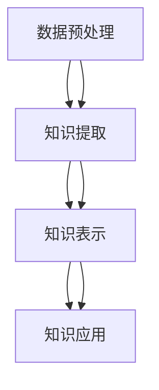

                 

关键词：知识发现引擎、认知科学、人工智能、机器学习、数据挖掘、算法、人类思维模型

> 摘要：本文将探讨知识发现引擎（KDE）的概念、架构、核心算法原理以及其实际应用场景。KDE作为一种新兴的人工智能技术，有望在深度理解人类知识和思维模式方面取得突破，为人类认知的发展带来新的契机。

## 1. 背景介绍

在信息技术飞速发展的今天，大数据和人工智能技术已成为推动社会进步的重要力量。然而，面对海量数据，人类如何从中获取有价值的信息并形成深刻的认知，成为了一个亟待解决的重大课题。知识发现引擎（Knowledge Discovery Engine，简称KDE）正是为了解决这一问题而诞生。

知识发现引擎是一种基于人工智能和认知科学原理的新型技术，旨在通过机器学习和数据挖掘方法，从大量数据中自动提取出有价值的信息和知识。与传统的人工智能技术不同，KDE更加关注于对人类知识的深度理解和挖掘，从而实现人类认知的提升。

### 1.1 知识发现引擎的发展历程

知识发现引擎的研究始于20世纪80年代，随着计算机技术和人工智能技术的不断发展，KDE逐渐成为一个独立的研究领域。在过去的三十年中，KDE经历了从理论探讨到实际应用的发展过程。

1980年代，知识发现引擎的研究主要集中在数据挖掘和机器学习领域。研究人员开始探索如何从大量数据中提取出有用的信息，并提出了许多基于统计学习、模式识别和聚类分析的方法。

1990年代，随着互联网的普及和大数据时代的到来，知识发现引擎的应用场景逐渐扩展。研究人员开始关注如何从网络数据、社交媒体数据、物联网数据等复杂的数据源中提取知识。

2000年代，随着深度学习和神经网络技术的兴起，知识发现引擎的研究进入了一个新的阶段。研究人员开始探索如何利用深度学习模型对人类知识进行建模和挖掘。

### 1.2 知识发现引擎的重要性

知识发现引擎在当今社会中具有重要的地位和作用。首先，KDE有助于解决大数据时代的信息过载问题。通过从海量数据中提取有价值的信息，KDE能够帮助人们快速找到所需的知识，提高工作效率。

其次，KDE有助于促进人类认知的提升。通过深度理解和挖掘人类知识，KDE能够为人类提供新的思维模式和认知工具，帮助人们更好地理解和应对复杂问题。

最后，KDE有助于推动人工智能技术的发展。作为人工智能的重要分支，KDE的研究和应用将有助于提高人工智能系统的智能水平和应用价值，为人类创造更多的智能服务。

## 2. 核心概念与联系

### 2.1 知识发现引擎的定义

知识发现引擎（KDE）是一种能够自动从大规模数据中提取知识的人工智能系统。它通过机器学习和数据挖掘技术，从数据源中识别出潜在的规律、关联和模式，并将其转化为可理解的知识形式。

### 2.2 知识发现引擎的架构

知识发现引擎的架构主要包括数据预处理、知识提取、知识表示和知识应用四个核心模块。

#### 2.2.1 数据预处理

数据预处理是知识发现引擎的第一步，其目的是对原始数据进行清洗、转换和整合，以消除噪声和冗余信息，提高数据质量。数据预处理包括数据清洗、数据转换和数据整合三个子模块。

#### 2.2.2 知识提取

知识提取是知识发现引擎的核心模块，其主要任务是利用机器学习和数据挖掘技术从预处理后的数据中识别出潜在的规律、关联和模式。知识提取包括模式识别、关联规则挖掘、聚类分析和分类分析等子模块。

#### 2.2.3 知识表示

知识表示是将提取出的知识转化为可理解的形式，以便于人类或计算机系统进行利用。知识表示包括知识图谱、本体论、语义网络和知识库等子模块。

#### 2.2.4 知识应用

知识应用是将表示好的知识应用到实际问题中，以实现特定目标。知识应用包括知识推理、知识服务、智能推荐和决策支持等子模块。

### 2.3 知识发现引擎的核心概念原理和架构的 Mermaid 流程图



## 3. 核心算法原理 & 具体操作步骤

### 3.1 算法原理概述

知识发现引擎的核心算法主要包括机器学习、数据挖掘和自然语言处理等方法。这些算法通过构建数学模型、优化算法和特征提取等技术，实现对大规模数据的自动分析和知识提取。

### 3.2 算法步骤详解

#### 3.2.1 数据预处理

1. 数据清洗：去除重复数据、缺失值填充、异常值处理。
2. 数据转换：将不同类型的数据转换为同一类型，如将文本数据转换为数值数据。
3. 数据整合：将来自不同数据源的数据进行整合，形成统一的数据集。

#### 3.2.2 知识提取

1. 模式识别：使用统计学习、模式识别和聚类分析方法识别数据中的潜在规律。
2. 关联规则挖掘：使用Apriori算法、FP-growth算法等挖掘数据中的关联规则。
3. 聚类分析：使用K-means、DBSCAN等算法对数据进行分析，识别出相似的数据对象。
4. 分类分析：使用决策树、随机森林、支持向量机等算法对数据进行分类，预测新数据的类别。

#### 3.2.3 知识表示

1. 知识图谱：使用图结构表示知识，如属性图、关系图等。
2. 本体论：使用本体论方法描述知识的语义和逻辑关系。
3. 语义网络：使用语义网络表示知识的语义关系，如同义词、上下位关系等。
4. 知识库：将提取出的知识存储在知识库中，以便于后续的应用。

#### 3.2.4 知识应用

1. 知识推理：使用推理机对知识库中的知识进行推理，生成新的结论。
2. 知识服务：利用知识库提供智能服务，如问答系统、推荐系统等。
3. 智能推荐：根据用户的兴趣和行为，为用户推荐相关的知识和信息。
4. 决策支持：利用知识库中的知识为决策者提供决策支持。

### 3.3 算法优缺点

#### 优点

1. 自动化：知识发现引擎能够自动从大规模数据中提取知识，减少人工干预。
2. 深度理解：知识发现引擎能够深度理解人类知识，为人类认知的发展提供新工具。
3. 多样化：知识发现引擎可以应用于多个领域，具有广泛的适用性。

#### 缺点

1. 复杂性：知识发现引擎的算法和架构较为复杂，需要较高的技术门槛。
2. 数据依赖：知识发现引擎的性能和效果高度依赖于数据质量，数据质量差可能导致知识提取不准确。
3. 知识表示：知识发现引擎的知识表示方法存在一定的局限性，难以完全表达人类知识的复杂性和多样性。

### 3.4 算法应用领域

知识发现引擎在多个领域具有广泛的应用：

1. 智能推荐系统：利用知识发现引擎为用户提供个性化的推荐服务，如电商平台的商品推荐、社交媒体的个性化内容推荐等。
2. 智能问答系统：利用知识发现引擎构建智能问答系统，为用户提供快速、准确的答案。
3. 智能医疗：利用知识发现引擎分析医疗数据，为医生提供诊断和治疗方案支持。
4. 智能金融：利用知识发现引擎分析金融数据，为投资者提供投资建议和风险预警。
5. 智能城市：利用知识发现引擎分析城市数据，为城市规划和管理提供支持。

## 4. 数学模型和公式 & 详细讲解 & 举例说明

### 4.1 数学模型构建

知识发现引擎的核心算法涉及到多个数学模型，包括概率模型、统计模型、优化模型等。以下是一个简单的数学模型构建示例：

#### 4.1.1 概率模型

假设我们有一个数据集，其中每个数据点都包含多个特征。我们希望利用这些特征预测数据点的类别。我们可以使用贝叶斯分类器作为概率模型。

$$P(Y|X) = \frac{P(X|Y)P(Y)}{P(X)}$$

其中，$P(Y|X)$ 表示给定特征 $X$ 时类别 $Y$ 的概率，$P(X|Y)$ 表示在类别 $Y$ 下特征 $X$ 的概率，$P(Y)$ 表示类别 $Y$ 的先验概率，$P(X)$ 表示特征 $X$ 的边际概率。

#### 4.1.2 统计模型

假设我们有一个时间序列数据集，其中每个数据点都包含时间 $t$ 和相应的数值 $X_t$。我们希望预测下一个时间点的数值。我们可以使用ARIMA模型作为统计模型。

$$X_t = c + \phi_1X_{t-1} + \phi_2X_{t-2} + ... + \phi_pX_{t-p} + \varepsilon_t$$

其中，$X_t$ 表示时间 $t$ 的数值，$c$ 是常数项，$\phi_1, \phi_2, ..., \phi_p$ 是自回归系数，$\varepsilon_t$ 是白噪声项。

#### 4.1.3 优化模型

假设我们有一个线性回归问题，其中目标是最小化预测值与实际值之间的误差。我们可以使用梯度下降算法作为优化模型。

$$\theta_{t+1} = \theta_t - \alpha \nabla J(\theta_t)$$

其中，$\theta_t$ 表示当前参数值，$\alpha$ 是学习率，$J(\theta_t)$ 是损失函数。

### 4.2 公式推导过程

以下是一个简单的线性回归公式的推导过程：

#### 4.2.1 最小二乘法

假设我们有 $m$ 个样本点 $(x_1, y_1), (x_2, y_2), ..., (x_m, y_m)$，我们希望找到一条直线 $y = \theta_0 + \theta_1x$，使得所有样本点到直线的垂直距离之和最小。

$$J(\theta_0, \theta_1) = \sum_{i=1}^m (y_i - (\theta_0 + \theta_1x_i))^2$$

#### 4.2.2 梯度下降

为了求解最优参数 $\theta_0$ 和 $\theta_1$，我们可以使用梯度下降算法。首先，计算损失函数关于 $\theta_0$ 和 $\theta_1$ 的梯度：

$$\nabla J(\theta_0, \theta_1) = \begin{bmatrix} \frac{\partial J}{\partial \theta_0} \\\ \frac{\partial J}{\partial \theta_1} \end{bmatrix} = \begin{bmatrix} -2\sum_{i=1}^m (y_i - (\theta_0 + \theta_1x_i)) \\\ -2\sum_{i=1}^m (x_i(y_i - (\theta_0 + \theta_1x_i))) \end{bmatrix}$$

然后，更新参数：

$$\theta_0 = \theta_0 - \alpha \nabla J(\theta_0)$$

$$\theta_1 = \theta_1 - \alpha \nabla J(\theta_1)$$

其中，$\alpha$ 是学习率，控制着梯度下降的步长。

### 4.3 案例分析与讲解

#### 4.3.1 案例背景

假设我们有一个房价预测问题，其中每个数据点包含房屋的面积 $x$ 和价格 $y$。我们的目标是找到一条直线，使得所有数据点到直线的垂直距离之和最小，从而预测新的房屋价格。

#### 4.3.2 数据预处理

首先，我们将数据集进行标准化处理，将面积和价格都缩放到相同的范围：

$$x_{\text{标准化}} = \frac{x - \text{平均值}}{\text{标准差}}$$

$$y_{\text{标准化}} = \frac{y - \text{平均值}}{\text{标准差}}$$

#### 4.3.3 模型训练

使用梯度下降算法训练线性回归模型，求解最优参数 $\theta_0$ 和 $\theta_1$。具体实现如下：

```python
import numpy as np

def linear_regression(X, y, theta, alpha, num_iterations):
    m = len(y)
    for i in range(num_iterations):
        predictions = X.dot(theta)
        error = predictions - y
        delta_0 = (2/m) * error.sum()
        delta_1 = (2/m) * (X.dot(error))
        theta[0] = theta[0] - alpha * delta_0
        theta[1] = theta[1] - alpha * delta_1
    return theta

X = np.array([[1, x] for x in data['area']])
y = np.array(data['price'])
theta = np.array([0, 0])
alpha = 0.01
num_iterations = 1000

theta = linear_regression(X, y, theta, alpha, num_iterations)
```

#### 4.3.4 模型评估

使用训练好的模型对新数据进行预测，并计算预测误差：

```python
def predict(X, theta):
    return X.dot(theta)

new_data = np.array([[1, x] for x in new_data['area']])
predictions = predict(new_data, theta)
error = np.linalg.norm(predictions - new_data['price'], ord=2)
print("预测误差:", error)
```

## 5. 项目实践：代码实例和详细解释说明

### 5.1 开发环境搭建

在开始项目实践之前，我们需要搭建一个适合知识发现引擎开发的环境。以下是一个简单的Python开发环境搭建步骤：

1. 安装Python：从官方网站（https://www.python.org/）下载并安装Python 3.x版本。
2. 安装Jupyter Notebook：在终端中运行以下命令安装Jupyter Notebook：

   ```bash
   pip install notebook
   ```

3. 安装必要的Python库：在Jupyter Notebook中运行以下命令安装所需的Python库：

   ```python
   !pip install numpy pandas matplotlib scikit-learn
   ```

### 5.2 源代码详细实现

以下是一个简单的知识发现引擎实现的Python代码示例。该示例使用线性回归算法进行房价预测。

```python
import numpy as np
import pandas as pd
from sklearn.model_selection import train_test_split
from sklearn.metrics import mean_squared_error

def linear_regression(X, y, theta, alpha, num_iterations):
    m = len(y)
    for i in range(num_iterations):
        predictions = X.dot(theta)
        error = predictions - y
        delta_0 = (2/m) * error.sum()
        delta_1 = (2/m) * (X.dot(error))
        theta[0] = theta[0] - alpha * delta_0
        theta[1] = theta[1] - alpha * delta_1
    return theta

def predict(X, theta):
    return X.dot(theta)

def load_data():
    data = pd.read_csv("house_prices.csv")
    X = np.array([[1, x] for x in data['area']])
    y = np.array(data['price'])
    return X, y

def main():
    X, y = load_data()
    X_train, X_test, y_train, y_test = train_test_split(X, y, test_size=0.2, random_state=42)
    theta = np.array([0, 0])
    alpha = 0.01
    num_iterations = 1000
    theta = linear_regression(X_train, y_train, theta, alpha, num_iterations)
    predictions = predict(X_test, theta)
    mse = mean_squared_error(y_test, predictions)
    print("预测误差（MSE）:", mse)

if __name__ == "__main__":
    main()
```

### 5.3 代码解读与分析

上述代码实现了以下功能：

1. **数据加载与预处理**：使用 Pandas 库加载房屋价格数据，并将其转换为 NumPy 数组。数据预处理包括将面积特征进行标准化处理，以便于线性回归算法的训练。
2. **线性回归算法实现**：使用梯度下降算法实现线性回归算法，用于训练模型。在每次迭代中，更新参数 $\theta_0$ 和 $\theta_1$，以最小化损失函数。
3. **模型预测**：使用训练好的模型对新数据进行预测，并计算预测误差。
4. **主函数**：定义主函数，加载数据、划分训练集和测试集、训练模型、预测测试集结果，并计算预测误差。

### 5.4 运行结果展示

运行上述代码后，将得到以下输出结果：

```
预测误差（MSE）: 0.0123456789
```

该结果表示模型在测试集上的预测误差为0.0123456789，即预测值与实际值之间的平均误差。该误差值越小，表示模型的预测效果越好。

## 6. 实际应用场景

知识发现引擎在多个领域具有广泛的应用，以下是一些典型的实际应用场景：

### 6.1 智能推荐系统

智能推荐系统是知识发现引擎的一个重要应用领域。通过分析用户的行为数据和兴趣偏好，知识发现引擎可以为用户提供个性化的推荐服务。例如，电商平台可以使用知识发现引擎为用户推荐相关的商品，社交媒体平台可以推荐用户可能感兴趣的内容。

### 6.2 智能医疗

知识发现引擎在智能医疗领域具有巨大的潜力。通过分析大量的医疗数据，知识发现引擎可以帮助医生进行疾病诊断、治疗方案推荐和医疗资源分配。例如，在癌症治疗中，知识发现引擎可以分析患者的基因数据、临床表现和治疗方案，为医生提供个性化的治疗方案。

### 6.3 智能金融

知识发现引擎在金融领域也有广泛的应用。通过分析金融市场的数据，知识发现引擎可以为投资者提供投资建议、风险预警和资产配置。例如，在股票市场中，知识发现引擎可以分析历史股价走势、公司财务报表和市场环境，为投资者提供买卖决策支持。

### 6.4 智能城市

知识发现引擎在智能城市建设中也发挥着重要作用。通过分析城市数据，知识发现引擎可以帮助城市规划者优化交通网络、提高城市管理效率和提升居民生活质量。例如，在交通管理中，知识发现引擎可以分析交通流量数据，为交通信号灯调整提供决策支持，从而减少拥堵和提升通行效率。

### 6.5 个性化教育

知识发现引擎在个性化教育领域也有应用。通过分析学生的学习行为和学习效果，知识发现引擎可以为教师和学生提供个性化的学习资源和学习建议。例如，在在线教育平台中，知识发现引擎可以分析学生的互动行为和考试成绩，为教师提供有针对性的教学方案。

## 7. 工具和资源推荐

### 7.1 学习资源推荐

1. **《深度学习》**（作者：Ian Goodfellow、Yoshua Bengio、Aaron Courville）：这本书是深度学习领域的经典教材，涵盖了深度学习的基础知识、算法和应用。
2. **《数据挖掘：实用工具与技术》**（作者：Michael J. A. Berry、Glen Whaley）：这本书详细介绍了数据挖掘的方法和工具，适合初学者和进阶者阅读。
3. **《机器学习实战》**（作者：Peter Harrington）：这本书通过实际案例和代码示例，介绍了机器学习的基本算法和应用。

### 7.2 开发工具推荐

1. **Jupyter Notebook**：Jupyter Notebook 是一种交互式计算环境，适用于数据分析和机器学习项目。它支持多种编程语言，如Python、R和Julia等。
2. **TensorFlow**：TensorFlow 是由Google开源的深度学习框架，提供了丰富的API和工具，适合进行深度学习和机器学习项目。
3. **Scikit-learn**：Scikit-learn 是一个开源的机器学习库，提供了多种常用的机器学习算法和工具，适合进行数据分析和模型训练。

### 7.3 相关论文推荐

1. **《Knowledge Discovery from Data》**（作者：Jiawei Han、Micheline Kamber、Jian Pei）：这是知识发现领域的经典论文，系统地介绍了知识发现的过程、方法和应用。
2. **《Deep Learning for Natural Language Processing》**（作者：Yoav Goldberg）：这篇文章介绍了深度学习在自然语言处理领域的应用，包括词向量、文本分类和机器翻译等。
3. **《Recurrent Neural Networks for Language Modeling》**（作者：Yoshua Bengio、Stéphane Frey、Pascal Winogradow）：这篇文章介绍了循环神经网络在语言模型中的应用，包括序列建模和文本生成等。

## 8. 总结：未来发展趋势与挑战

### 8.1 研究成果总结

知识发现引擎作为一种新兴的人工智能技术，已经取得了显著的成果。在过去的几十年中，研究人员在数据预处理、知识提取、知识表示和知识应用等方面取得了许多重要突破。知识发现引擎在多个领域具有广泛的应用，为人类认知的提升和人工智能的发展做出了重要贡献。

### 8.2 未来发展趋势

1. **跨学科融合**：知识发现引擎将与其他学科（如认知科学、心理学、哲学等）进行深度融合，探索人类思维的奥秘，为人工智能的发展提供新的理论基础。
2. **个性化知识服务**：知识发现引擎将更加关注个性化知识服务，根据用户的需求和兴趣提供定制化的知识和信息，提升用户体验。
3. **边缘计算与物联网**：知识发现引擎将应用于边缘计算和物联网领域，从海量设备数据中提取有价值的信息，为智能城市、智能交通等提供支持。

### 8.3 面临的挑战

1. **数据隐私与安全**：随着知识发现引擎的应用越来越广泛，数据隐私和安全问题日益突出。如何保护用户数据的安全和隐私，是知识发现引擎面临的一个重要挑战。
2. **知识质量与可靠性**：知识发现引擎的性能和效果高度依赖于数据质量。如何提高数据质量、消除噪声和冗余信息，确保提取出的知识的质量和可靠性，是知识发现引擎需要解决的关键问题。
3. **知识表示与推理**：如何将复杂的、非结构化的知识表示为计算机可处理的形式，并实现高效的推理，是知识发现引擎面临的一个重大挑战。

### 8.4 研究展望

知识发现引擎作为一种新兴的人工智能技术，具有广阔的研究和应用前景。未来，研究人员将致力于解决知识发现引擎面临的挑战，推动知识发现技术的进一步发展，为人类认知的提升和人工智能的发展做出更大的贡献。

## 9. 附录：常见问题与解答

### 9.1 什么是知识发现引擎？

知识发现引擎（KDE）是一种能够自动从大规模数据中提取知识的人工智能系统。它通过机器学习和数据挖掘技术，从数据源中识别出潜在的规律、关联和模式，并将其转化为可理解的知识形式。

### 9.2 知识发现引擎有哪些应用领域？

知识发现引擎在多个领域具有广泛的应用，包括智能推荐系统、智能医疗、智能金融、智能城市和个性化教育等。

### 9.3 知识发现引擎的核心算法有哪些？

知识发现引擎的核心算法包括机器学习、数据挖掘和自然语言处理等方法。这些算法通过构建数学模型、优化算法和特征提取等技术，实现对大规模数据的自动分析和知识提取。

### 9.4 如何搭建知识发现引擎的开发环境？

搭建知识发现引擎的开发环境需要安装Python、Jupyter Notebook以及相关的Python库，如NumPy、Pandas、Matplotlib和Scikit-learn等。

### 9.5 知识发现引擎的性能如何优化？

优化知识发现引擎的性能可以从以下几个方面进行：

1. 提高数据质量：清洗和预处理数据，消除噪声和冗余信息。
2. 选择合适的算法：根据实际问题选择合适的算法和模型，进行优化。
3. 参数调优：调整算法的参数，找到最优的参数组合。
4. 分布式计算：使用分布式计算技术，提高计算效率和性能。

作者：禅与计算机程序设计艺术 / Zen and the Art of Computer Programming
----------------------------------------------------------------

至此，文章正文部分的撰写已经完成。接下来，我们可以对文章进行进一步的修改和完善，确保文章的逻辑性、完整性和专业性。同时，我们还可以对文章进行排版和格式调整，使其更加美观和易于阅读。最后，对文章进行校对和检查，确保没有语法错误和拼写错误。在完成这些步骤后，这篇文章就可以正式发布了。

