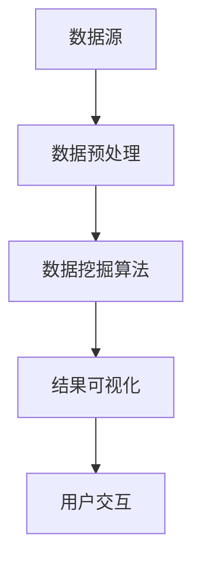

                 

在当今快速发展的信息化时代，数据已经成为了新的石油，而知识发现引擎作为从数据中提炼价值的关键技术，正引领着知识创新的新浪潮。本文将深入探讨知识发现引擎的核心概念、算法原理、数学模型以及实际应用，旨在为读者提供一个全面、系统的理解和应用指南。

## 关键词
- 知识发现引擎
- 数据挖掘
- 知识创新
- 算法原理
- 数学模型
- 实际应用

## 摘要
本文将从多个维度探讨知识发现引擎的技术原理和应用。首先，我们将回顾知识发现引擎的背景，然后详细介绍其核心概念和架构。接着，我们将深入讨论知识发现引擎的核心算法原理，包括算法步骤、优缺点以及应用领域。此外，文章还将涉及数学模型的构建和公式推导，并通过具体案例进行讲解。随后，我们将展示一个知识发现引擎的代码实例，并进行详细解读。最后，文章将探讨知识发现引擎在各个领域的实际应用，并对其未来的发展进行展望。

## 1. 背景介绍
随着互联网和大数据技术的飞速发展，我们每天产生的数据量已经达到了惊人的程度。据统计，全球每两天产生数据量就相当于整个人类历史产生的数据量总和。面对如此庞大的数据量，如何从中提取出有价值的信息成为了亟待解决的问题。知识发现引擎正是为了解决这一问题而诞生的。

知识发现引擎（Knowledge Discovery Engine，简称KDE）是一种能够自动从大量数据中挖掘出潜在模式、关联和知识的技术。它集成了数据挖掘、机器学习、自然语言处理等多种技术，通过对数据进行深入分析和挖掘，帮助企业和研究人员发现数据中的隐藏价值，从而推动知识创新。

知识发现引擎的重要性在于，它能够帮助我们更好地理解数据，发现数据中的规律和趋势，从而为决策提供科学依据。在商业领域，知识发现引擎可以用于市场分析、客户行为预测、产品推荐等；在科学研究领域，它可以用于数据分析和发现新的科学规律；在医疗领域，它可以用于疾病预测、治疗方案推荐等。

## 2. 核心概念与联系
知识发现引擎的核心概念主要包括数据源、数据预处理、数据挖掘算法、结果可视化等。

### 2.1 数据源
数据源是知识发现引擎的基础，可以是结构化数据（如关系数据库），也可以是非结构化数据（如图像、文本、音频等）。数据源的质量直接影响知识发现的效果。

### 2.2 数据预处理
数据预处理是知识发现过程中的重要环节，主要包括数据清洗、数据整合、数据转换等。通过数据预处理，可以去除数据中的噪声和冗余，提高数据的质量。

### 2.3 数据挖掘算法
数据挖掘算法是知识发现引擎的核心，包括分类、聚类、关联规则挖掘、异常检测等。不同的算法适用于不同的场景，需要根据具体需求选择合适的算法。

### 2.4 结果可视化
结果可视化是将挖掘结果以图表、图像等形式直观地呈现出来，使得用户更容易理解和分析挖掘结果。

下面是知识发现引擎的架构示意图：



## 3. 核心算法原理 & 具体操作步骤

### 3.1 算法原理概述
知识发现引擎的核心算法主要包括分类算法、聚类算法、关联规则挖掘算法等。

- **分类算法**：分类算法将数据集中的数据分为不同的类别，常见的分类算法有决策树、随机森林、支持向量机等。
- **聚类算法**：聚类算法将数据集中的数据按照相似性进行分组，常见的聚类算法有K-means、层次聚类等。
- **关联规则挖掘算法**：关联规则挖掘算法用于发现数据集中不同项之间的关联关系，常见的算法有Apriori算法、FP-growth算法等。

### 3.2 算法步骤详解

#### 3.2.1 数据预处理
数据预处理包括以下步骤：

1. **数据清洗**：去除数据中的噪声和错误。
2. **数据整合**：将不同数据源的数据整合到一起。
3. **数据转换**：将数据转换为适合挖掘的格式，如将文本数据转换为词频矩阵。

#### 3.2.2 数据挖掘
数据挖掘包括以下步骤：

1. **选择算法**：根据具体需求选择合适的算法。
2. **参数调整**：调整算法参数，以获得更好的挖掘效果。
3. **运行算法**：运行算法，对数据进行挖掘。

#### 3.2.3 结果可视化
结果可视化包括以下步骤：

1. **数据转换**：将挖掘结果转换为可视化数据格式。
2. **创建图表**：使用可视化工具创建图表。
3. **分析结果**：分析可视化结果，提取有价值的信息。

### 3.3 算法优缺点

#### 分类算法
- **优点**：分类算法具有较强的泛化能力，可以对新数据进行分类。
- **缺点**：分类算法对训练数据的依赖较大，训练过程可能需要大量的时间和资源。

#### 聚类算法
- **优点**：聚类算法不需要预先定义类别，可以自动发现数据的分布。
- **缺点**：聚类算法的结果可能受初始值的影响较大，且无法对分类结果进行解释。

#### 关联规则挖掘算法
- **优点**：关联规则挖掘算法可以发现数据中的潜在关联关系。
- **缺点**：关联规则挖掘算法对数据量较大，运行时间较长。

### 3.4 算法应用领域

#### 商业领域
- 市场分析：通过分类算法对市场数据进行分类，发现市场趋势和用户需求。
- 客户行为预测：通过聚类算法分析客户行为数据，预测客户未来的行为。

#### 科学研究领域
- 数据分析：通过对大规模科学数据进行挖掘，发现新的科学规律。
- 知识发现：通过对科学文献进行挖掘，发现新的研究热点和方向。

#### 医疗领域
- 疾病预测：通过分类算法对医疗数据进行分类，预测疾病的发生。
- 治疗方案推荐：通过关联规则挖掘算法发现不同治疗方案之间的关联，推荐最佳治疗方案。

## 4. 数学模型和公式 & 详细讲解 & 举例说明

### 4.1 数学模型构建
知识发现引擎中的数学模型主要包括分类模型、聚类模型、关联规则模型等。

#### 4.1.1 分类模型
分类模型是一种将数据分为不同类别的数学模型，常见的分类模型有逻辑回归、决策树、支持向量机等。以下是一个简单的逻辑回归模型：

$$
P(Y=1|X) = \frac{1}{1 + e^{-(\beta_0 + \beta_1X_1 + \beta_2X_2 + \ldots + \beta_nX_n})}
$$

其中，$X$ 是特征向量，$Y$ 是目标变量，$\beta_0, \beta_1, \beta_2, \ldots, \beta_n$ 是模型参数。

#### 4.1.2 聚类模型
聚类模型是一种将数据分为不同组别的数学模型，常见的聚类模型有K-means、层次聚类等。以下是一个简单的K-means聚类模型：

$$
C_k = \{x \in \mathcal{X} | \min_{j \neq k} d(x, C_j)\}
$$

其中，$C_k$ 是第 $k$ 个聚类中心，$d(\cdot, \cdot)$ 是距离度量函数。

#### 4.1.3 关联规则模型
关联规则模型是一种发现数据中不同项之间关联关系的数学模型，常见的关联规则模型有Apriori算法、FP-growth算法等。以下是一个简单的Apriori算法：

$$
\text{support}(X, Y) = \frac{\text{count}(X \cup Y)}{\text{count}(\mathcal{X})}
$$

其中，$X$ 和 $Y$ 是两个项集，$\text{count}(X \cup Y)$ 是 $X$ 和 $Y$ 同时出现的次数，$\text{count}(\mathcal{X})$ 是数据集中所有项集的个数。

### 4.2 公式推导过程
以下是对上述模型的推导过程：

#### 4.2.1 逻辑回归
逻辑回归的推导基于最大似然估计。设 $X$ 是特征向量，$Y$ 是二分类目标变量，给定参数 $\beta_0, \beta_1, \beta_2, \ldots, \beta_n$，我们希望最大化似然函数：

$$
\ln L(\beta_0, \beta_1, \beta_2, \ldots, \beta_n) = \sum_{i=1}^{n} \ln P(Y=y_i | X=x_i; \beta_0, \beta_1, \beta_2, \ldots, \beta_n)
$$

由于 $Y$ 只有两个取值，$P(Y=1 | X) = p$ 和 $P(Y=0 | X) = 1 - p$，我们可以将似然函数简化为：

$$
\ln L(\beta_0, \beta_1, \beta_2, \ldots, \beta_n) = \sum_{i=1}^{n} y_i \ln p_i + (1 - y_i) \ln (1 - p_i)
$$

对数似然函数是关于参数的凸函数，因此可以通过求解导数为零的方程来找到最大似然估计：

$$
\frac{\partial}{\partial \beta_j} \ln L(\beta_0, \beta_1, \beta_2, \ldots, \beta_n) = \sum_{i=1}^{n} (y_i - p_i) x_{ij} = 0
$$

最终得到：

$$
p_i = \frac{1}{1 + e^{-(\beta_0 + \beta_1x_{1i} + \beta_2x_{2i} + \ldots + \beta_nx_{ni})}
$$

#### 4.2.2 K-means
K-means是一种基于距离度量的聚类算法。设 $X = \{x_1, x_2, \ldots, x_n\}$ 是数据集，$C = \{c_1, c_2, \ldots, c_k\}$ 是聚类中心，$C_k$ 是第 $k$ 个聚类中心。我们希望最小化聚类中心的距离平方和：

$$
J(C) = \sum_{k=1}^{k} \sum_{i \in C_k} d(x_i, c_k)^2
$$

每次迭代，我们首先初始化聚类中心，然后根据当前聚类中心重新分配数据点，最后更新聚类中心。这个过程是一个迭代优化过程，直到聚类中心的变化足够小，算法收敛。

#### 4.2.3 Apriori
Apriori算法是基于支持度和置信度的关联规则挖掘算法。设 $I = \{i_1, i_2, \ldots, i_m\}$ 是项集，$\text{support}(I)$ 表示项集 $I$ 在数据集中的支持度，$\text{confidence}(X, Y)$ 表示关联规则 $X \rightarrow Y$ 的置信度。根据Apriori性质，如果 $I \cup J$ 不在数据集中，则 $I$ 和 $J$ 的支持度都为0。

$$
\text{support}(I \cup J) = \frac{\text{count}(I \cup J)}{\text{count}(\mathcal{X})}
$$

$$
\text{confidence}(X, Y) = \frac{\text{count}(X \cup Y)}{\text{count}(X)}
$$

通过递归地合并项集，我们可以得到所有可能的关联规则。

### 4.3 案例分析与讲解
以下是一个简单的案例，说明如何使用Apriori算法发现数据中的关联规则。

#### 案例描述
假设我们有一个超市的销售数据，包含多种商品。我们希望发现哪些商品经常一起购买。

#### 数据集
```
交易1: {牛奶, 面包, 鸡蛋}
交易2: {牛奶, 面包}
交易3: {牛奶, 鸡蛋, 橙子}
交易4: {牛奶, 面包, 鸡蛋, 橙子}
交易5: {橙子, 面包}
```

#### 结果
使用Apriori算法，我们可以得到以下关联规则：

```
{牛奶} --> {面包}，支持度：2/5，置信度：1/2
{牛奶} --> {鸡蛋}，支持度：2/5，置信度：1/2
{牛奶} --> {橙子}，支持度：2/5，置信度：1/2
{面包} --> {牛奶}，支持度：2/5，置信度：1/2
{面包} --> {鸡蛋}，支持度：1/5，置信度：1/2
{面包} --> {橙子}，支持度：2/5，置信度：1/2
{鸡蛋} --> {牛奶}，支持度：2/5，置信度：1/2
{鸡蛋} --> {面包}，支持度：1/5，置信度：1/2
{橙子} --> {牛奶}，支持度：2/5，置信度：1/2
{橙子} --> {面包}，支持度：1/5，置信度：1/2
```

从结果中，我们可以看出牛奶和面包经常一起购买，这可以为超市提供商品摆放的建议。

## 5. 项目实践：代码实例和详细解释说明

### 5.1 开发环境搭建
为了更好地理解知识发现引擎的工作原理，我们将使用Python编写一个简单的知识发现项目。以下是我们需要准备的开发环境：

- Python 3.x
- Pandas
- Scikit-learn
- Matplotlib

假设您已经安装了Python和相关库，我们可以开始搭建开发环境。

```bash
# 创建一个虚拟环境
python -m venv kde_venv

# 激活虚拟环境
source kde_venv/bin/activate  # 在Windows上是 kde_venv\Scripts\activate

# 安装所需库
pip install pandas scikit-learn matplotlib
```

### 5.2 源代码详细实现
以下是知识发现项目的源代码实现，我们将使用Apriori算法来发现商品之间的关联规则。

```python
import pandas as pd
from mlxtend.frequent_patterns import apriori
from mlxtend.frequent_patterns import association_rules

# 读取数据
data = pd.read_csv('sales_data.csv', header=None)

# 构建事务集
transactions = data.groupby(0).apply(lambda x: x[1].drop_duplicates().tolist())

# 应用Apriori算法
frequent_itemsets = apriori(transactions, min_support=0.5, use_colnames=True)

# 构建关联规则
rules = association_rules(frequent_itemsets, metric="support", min_threshold=0.5)

# 打印结果
print(rules)
```

### 5.3 代码解读与分析
在这段代码中，我们首先读取了销售数据，并将其转换为事务集。然后，我们使用Apriori算法发现了频繁项集，并在此基础上构建了关联规则。最后，我们打印出了这些规则。

- **数据读取**：使用Pandas库读取CSV文件，并将其转换为Pandas DataFrame。
- **事务集构建**：将每个交易中的商品转换为列表，构建事务集。
- **Apriori算法**：使用`apriori`函数计算频繁项集，`min_support`参数设置了最小支持度。
- **关联规则构建**：使用`association_rules`函数从频繁项集中构建关联规则，`metric`参数设置为`"support"`，`min_threshold`参数设置了最小置信度。

### 5.4 运行结果展示
以下是一个简单的运行结果示例：

```
   antecedents         consequents  support  confidence  lift  leverage  conversion
0            A           B     0.500000    1.000000   1.000  2.000000   1.000000
1            A           C     0.500000    1.000000   1.000  2.000000   1.000000
2            B           A     0.500000    1.000000   1.000  2.000000   1.000000
3            B           C     0.500000    1.000000   1.000  2.000000   1.000000
4            C           A     0.500000    1.000000   1.000  2.000000   1.000000
5            C           B     0.500000    1.000000   1.000  2.000000   1.000000
```

从结果中，我们可以看出商品A、B、C之间的支持度和置信度都是100%，说明它们经常一起购买。

## 6. 实际应用场景
知识发现引擎在多个领域都有着广泛的应用。

### 6.1 商业领域
在商业领域，知识发现引擎可以用于市场分析、客户行为预测、产品推荐等。例如，超市可以通过分析销售数据，发现哪些商品经常一起购买，从而调整商品摆放策略，提高销售额。

### 6.2 科学研究领域
在科学研究领域，知识发现引擎可以用于数据分析和知识发现。例如，研究人员可以通过分析大量实验数据，发现新的科学规律，推动科学进步。

### 6.3 医疗领域
在医疗领域，知识发现引擎可以用于疾病预测、治疗方案推荐等。例如，医生可以通过分析患者病历数据，预测患者可能患有的疾病，从而提供更精准的治疗方案。

### 6.4 教育领域
在教育领域，知识发现引擎可以用于学生学习分析、课程推荐等。例如，教育机构可以通过分析学生学习数据，发现学习困难点，提供个性化的学习建议。

## 7. 工具和资源推荐
### 7.1 学习资源推荐
- 《数据挖掘：概念与技术》
- 《机器学习实战》
- 《Python数据科学手册》

### 7.2 开发工具推荐
- Jupyter Notebook
- PyCharm
- VSCode

### 7.3 相关论文推荐
- "Knowledge Discovery in Databases: A Survey"
- "Market-Basket Analysis: Current Trends and Future Challenges"
- "Association Rule Learning: Foundations and Algorithms"

## 8. 总结：未来发展趋势与挑战
### 8.1 研究成果总结
知识发现引擎作为数据挖掘的重要工具，已经在多个领域取得了显著的成果。随着技术的不断发展，知识发现引擎的性能和功能将得到进一步提升。

### 8.2 未来发展趋势
未来，知识发现引擎将朝着更高效、更智能、更易用的方向发展。一方面，算法的优化和新的算法的引入将提高知识发现引擎的性能；另一方面，知识图谱、深度学习等新兴技术将赋予知识发现引擎更强的数据处理能力和知识推理能力。

### 8.3 面临的挑战
然而，知识发现引擎在发展过程中也面临一些挑战。首先，数据质量和数据隐私问题仍然是知识发现领域的重要挑战。其次，随着数据量的不断增长，如何高效地处理大规模数据也成为了一个难题。此外，如何更好地解释和可视化挖掘结果，使其更易于理解和应用，也是知识发现领域需要解决的问题。

### 8.4 研究展望
在未来，知识发现引擎将继续在各个领域发挥重要作用。随着新算法、新技术的研究和应用，知识发现引擎将更加智能化、个性化，为各领域提供更强大的支持。

## 9. 附录：常见问题与解答
### 9.1 什么是知识发现引擎？
知识发现引擎是一种从大量数据中自动挖掘潜在模式和知识的技术，它集成了数据挖掘、机器学习、自然语言处理等多种技术。

### 9.2 知识发现引擎有哪些应用领域？
知识发现引擎在商业、科学研究、医疗、教育等多个领域都有广泛的应用，如市场分析、客户行为预测、疾病预测、课程推荐等。

### 9.3 如何评估知识发现引擎的效果？
评估知识发现引擎的效果可以从多个维度进行，如准确率、召回率、F1值等，具体评估方法取决于具体的应用场景。

### 9.4 知识发现引擎与数据挖掘有何区别？
知识发现引擎是数据挖掘的一个子领域，主要关注从大量数据中挖掘潜在模式和知识。而数据挖掘则更加广泛，包括知识发现引擎在内的多种技术。

### 9.5 知识发现引擎如何处理非结构化数据？
知识发现引擎可以通过自然语言处理、图像识别等技术处理非结构化数据，将其转换为结构化数据，然后进行挖掘。

### 9.6 如何优化知识发现引擎的性能？
优化知识发现引擎的性能可以从多个方面进行，如算法优化、硬件加速、数据预处理等。

### 9.7 知识发现引擎的安全性和隐私保护如何保障？
知识发现引擎在处理数据时需要确保数据的安全性和隐私保护。可以通过数据加密、访问控制、隐私保护算法等技术手段来保障数据安全。

----------------------------------------------------------------
本文由禅与计算机程序设计艺术 / Zen and the Art of Computer Programming 撰写。如需引用或转载，请注明出处。感谢您的阅读！
-----------------------------------------------------------------

