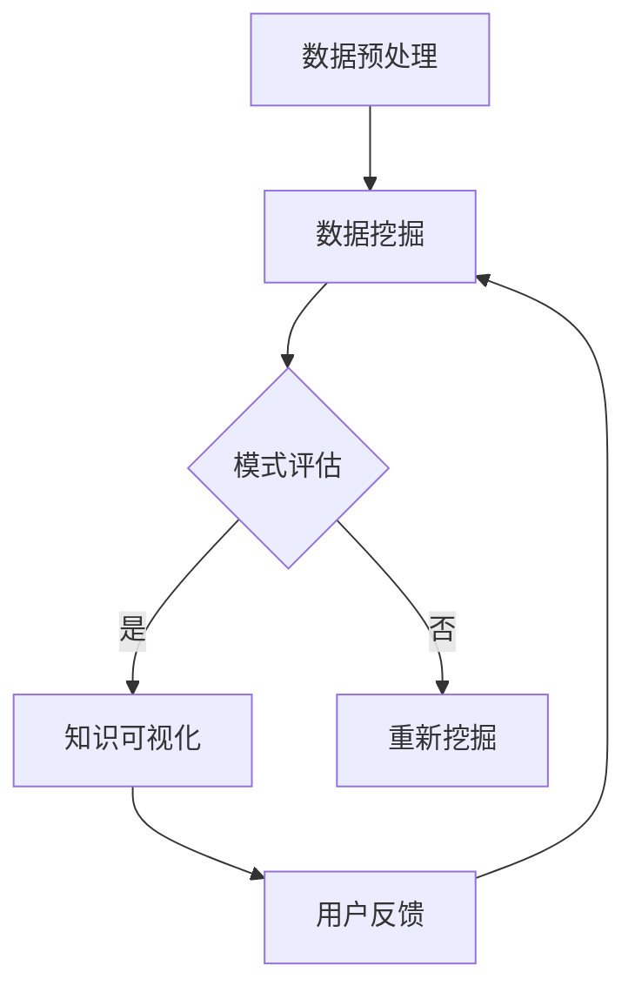

                 

关键词：知识发现，人工智能，认知扩展，数据挖掘，算法，机器学习，认知边界，知识图谱，数据可视化

> 摘要：本文深入探讨了知识发现引擎在现代人工智能领域的地位和作用，分析了其核心概念、原理和架构，并详细介绍了核心算法的原理与操作步骤。通过数学模型和公式的讲解，本文展示了算法的推导过程和案例分析。此外，文章通过项目实践，提供了一个完整的代码实现，并对代码进行了详细解读与分析。最后，本文探讨了知识发现引擎在实际应用场景中的价值，并对未来发展趋势和挑战进行了展望。

## 1. 背景介绍

随着信息时代的到来，数据的爆发式增长已成为不可逆转的趋势。面对海量数据，如何从中发现有价值的信息、模式和知识，成为了亟待解决的问题。知识发现（Knowledge Discovery in Databases，简称KDD）作为数据挖掘的一个重要分支，旨在从大量数据中提取出有价值的知识。而知识发现引擎则是实现这一目标的重要工具。

知识发现引擎是一种自动化或半自动化的系统，它能够从原始数据中提取出隐藏的模式和知识，并通过数据预处理、数据挖掘、模式评估和知识可视化等过程，将这些模式以易于理解的形式呈现给用户。在人工智能领域，知识发现引擎不仅能够辅助人类进行决策，还能够扩展人类的认知边界，提高信息处理效率。

知识发现引擎的重要性体现在以下几个方面：

1. **提高数据利用效率**：知识发现引擎能够从海量数据中提取出有价值的信息，从而提高数据利用效率，降低数据处理的成本。
2. **辅助决策制定**：通过分析数据中的模式和规律，知识发现引擎可以帮助企业和组织做出更加科学的决策。
3. **推动科学研究**：知识发现引擎在科学研究中的应用，能够加速科研成果的产出，推动科学领域的发展。
4. **增强人工智能能力**：知识发现引擎可以作为人工智能系统的一个组成部分，提高系统的认知能力和决策能力。

本文将深入探讨知识发现引擎的核心概念、原理和架构，分析其核心算法的原理与操作步骤，并通过数学模型和公式的讲解，展示算法的推导过程和案例分析。同时，本文将通过一个实际项目，提供完整的代码实现，并对代码进行详细解读与分析。最后，本文将探讨知识发现引擎在实际应用场景中的价值，并对未来发展趋势和挑战进行展望。

## 2. 核心概念与联系

### 2.1 知识发现引擎的定义

知识发现引擎（Knowledge Discovery Engine，简称KDE）是一种用于自动或半自动从数据中提取知识的系统。它结合了人工智能、机器学习和数据挖掘技术，能够高效地从海量数据中识别出潜在的模式、规律和知识。知识发现引擎的核心功能包括数据预处理、模式识别、模式评估和知识可视化。

### 2.2 数据挖掘与知识发现的关系

数据挖掘（Data Mining）是指从大量数据中提取有价值信息的过程，它包括数据预处理、模式识别、模式评估等多个步骤。知识发现是数据挖掘的一个高级阶段，它不仅关注从数据中提取信息，更关注如何将提取出的信息转化为实际应用价值，从而帮助人类做出更好的决策。

### 2.3 知识图谱的概念

知识图谱（Knowledge Graph）是一种结构化的知识表示方法，它通过实体和关系的关联，将海量数据组织成一个网状结构。知识图谱在知识发现引擎中扮演着重要的角色，它能够提高数据挖掘的效率，使得知识提取过程更加直观和高效。

### 2.4 数据可视化在知识发现中的应用

数据可视化（Data Visualization）是将数据以图形或图表的形式呈现给用户的技术。通过数据可视化，用户可以更直观地理解数据中的模式和规律，从而提高知识发现的效果。

### 2.5 Mermaid 流程图

下面是一个知识发现引擎的工作流程的Mermaid流程图：



在这个流程图中，数据预处理是知识发现的第一步，它包括数据清洗、数据转换和数据整合。数据挖掘是核心步骤，它利用机器学习算法从数据中提取模式。模式评估则是对挖掘出的模式进行评估，筛选出最有价值的模式。知识可视化是将挖掘出的模式以图表或图形的形式展示给用户。用户反馈则是知识发现引擎的闭环，通过用户的反馈，可以进一步优化知识提取过程。

## 3. 核心算法原理 & 具体操作步骤

### 3.1 算法原理概述

知识发现引擎的核心算法主要包括模式识别、聚类分析、分类算法和关联规则挖掘等。这些算法通过不同的方式从数据中提取信息，帮助用户发现潜在的模式和规律。

#### 3.1.1 模式识别

模式识别是指从数据中识别出具有代表性的模式和特征。常见的模式识别算法包括支持向量机（SVM）、神经网络（NN）和决策树（DT）等。

#### 3.1.2 聚类分析

聚类分析是将数据集划分为若干个簇，使得同一个簇内的数据相似度较高，而不同簇之间的数据相似度较低。常见的聚类算法包括K-means、DBSCAN和层次聚类等。

#### 3.1.3 分类算法

分类算法是将数据划分为不同的类别。常见的分类算法包括逻辑回归（LR）、随机森林（RF）和朴素贝叶斯（NB）等。

#### 3.1.4 关联规则挖掘

关联规则挖掘是指从数据中发现不同变量之间的关联关系。常见的算法包括Apriori算法和FP-growth算法等。

### 3.2 算法步骤详解

#### 3.2.1 数据预处理

数据预处理是知识发现的第一步，它包括数据清洗、数据转换和数据整合。数据清洗主要包括去除重复数据、处理缺失值和异常值等。数据转换包括数据标准化、数据归一化和数据编码等。数据整合是将来自不同数据源的数据进行整合，形成统一的数据集。

#### 3.2.2 数据挖掘

数据挖掘是根据不同的算法，从预处理后的数据中提取出潜在的模式和规律。这一步需要选择合适的算法，并设置相应的参数。

#### 3.2.3 模式评估

模式评估是对挖掘出的模式进行评估，筛选出最有价值的模式。常见的评估指标包括精确度、召回率、F1值和ROC曲线等。

#### 3.2.4 知识可视化

知识可视化是将评估出的模式以图表或图形的形式展示给用户。常见的可视化方法包括散点图、条形图、饼图和热力图等。

### 3.3 算法优缺点

#### 3.3.1 模式识别

**优点**：能够从数据中提取出具有代表性的模式和特征，有助于理解数据的本质。

**缺点**：对大量数据的处理效率较低，且对噪声数据敏感。

#### 3.3.2 聚类分析

**优点**：能够自动发现数据中的结构，无需事先定义类别。

**缺点**：对聚类数量的选择较为敏感，且无法对聚类结果进行解释。

#### 3.3.3 分类算法

**优点**：能够将数据准确分类，有助于预测和决策。

**缺点**：对噪声数据的处理能力较差，且对训练数据的要求较高。

#### 3.3.4 关联规则挖掘

**优点**：能够发现数据中的潜在关联关系，有助于数据分析和营销策略的制定。

**缺点**：计算复杂度较高，且对数据量较大的场景效果较差。

### 3.4 算法应用领域

知识发现引擎的应用领域非常广泛，包括但不限于以下方面：

1. **商业智能**：通过分析企业运营数据，帮助管理层做出更加科学的决策。
2. **金融分析**：通过分析金融市场数据，发现潜在的商机和风险。
3. **医疗健康**：通过分析医疗数据，帮助医生进行诊断和治疗。
4. **社会管理**：通过分析社会数据，帮助政府制定更加科学的社会政策。
5. **科学研究**：通过分析科研数据，加速科研成果的产出。

## 4. 数学模型和公式 & 详细讲解 & 举例说明

### 4.1 数学模型构建

知识发现引擎中的数学模型主要包括聚类分析、分类算法和关联规则挖掘等。以下是这些模型的基本构建方法：

#### 4.1.1 聚类分析

聚类分析是一种无监督学习方法，它通过将数据集划分为若干个簇，使得同一个簇内的数据相似度较高，而不同簇之间的数据相似度较低。常见的聚类算法包括K-means、DBSCAN和层次聚类等。

- **K-means算法**：
  - 初始化：随机选择K个数据点作为初始聚类中心。
  - 分配：将每个数据点分配到最近的聚类中心。
  - 更新：重新计算每个聚类中心，并更新聚类中心。
  - 重复以上步骤，直到聚类中心不再变化或达到预设的迭代次数。

- **DBSCAN算法**：
  - 初始化：选择一个数据点作为种子点，扩展生成一个簇。
  - 判断：判断当前数据点是否在邻域内，若是则将其加入当前簇。
  - 重复：对未处理的点重复上述步骤，直到所有数据点都被处理。

- **层次聚类算法**：
  - 初始化：将每个数据点视为一个簇。
  - 合并：根据距离最近的原则，合并最相似的簇。
  - 重复：重复上述步骤，直到所有数据点合并为一个簇。

#### 4.1.2 分类算法

分类算法是一种有监督学习方法，它通过已知的训练数据集，构建一个分类模型，用于对新的数据进行分类。常见的分类算法包括逻辑回归、支持向量机和随机森林等。

- **逻辑回归**：
  - 模型构建：根据训练数据集，构建一个逻辑回归模型。
  - 参数优化：使用梯度下降或牛顿法等优化算法，优化模型参数。
  - 分类预测：将新的数据点输入模型，输出分类结果。

- **支持向量机**：
  - 模型构建：根据训练数据集，构建一个支持向量机模型。
  - 参数优化：使用核函数和优化算法，优化模型参数。
  - 分类预测：将新的数据点输入模型，输出分类结果。

- **随机森林**：
  - 模型构建：根据训练数据集，构建多个决策树模型。
  - 集成：将多个决策树模型的预测结果进行集成，输出最终分类结果。

#### 4.1.3 关联规则挖掘

关联规则挖掘是一种从数据中发现变量之间关联关系的方法。常见的算法包括Apriori算法和FP-growth算法等。

- **Apriori算法**：
  - 初始化：根据最小支持度和最小置信度，初始化频繁项集。
  - 生成：递归地生成下一个频繁项集。
  - 筛选：根据最小支持度和最小置信度，筛选出强关联规则。

- **FP-growth算法**：
  - 初始化：根据最小支持度，初始化频繁模式树。
  - 构建：根据频繁模式树，构建FP-growth树。
  - 筛选：根据最小支持度和最小置信度，筛选出强关联规则。

### 4.2 公式推导过程

以下是逻辑回归和K-means算法的公式推导过程：

#### 4.2.1 逻辑回归

逻辑回归是一种用于分类的线性模型，其基本公式如下：

$$
P(Y=1|X) = \frac{1}{1 + e^{-\beta^T X}}
$$

其中，\(P(Y=1|X)\) 表示在给定特征 \(X\) 的情况下，目标变量 \(Y\) 为1的概率；\(\beta^T\) 是模型的参数向量；\(e\) 是自然对数的底数。

逻辑回归的损失函数是交叉熵损失函数，其公式如下：

$$
J(\beta) = -\frac{1}{m} \sum_{i=1}^{m} [y^{(i)} \log(p^{(i)}) + (1 - y^{(i)}) \log(1 - p^{(i)})]
$$

其中，\(m\) 是训练样本的数量；\(y^{(i)}\) 和 \(p^{(i)}\) 分别是第 \(i\) 个样本的真实标签和预测概率。

为了优化参数 \(\beta\)，可以使用梯度下降法。梯度下降法的公式如下：

$$
\beta^{(t+1)} = \beta^{(t)} - \alpha \nabla_{\beta} J(\beta^{(t)})
$$

其中，\(\alpha\) 是学习率；\(\nabla_{\beta} J(\beta^{(t)})\) 是损失函数对参数 \(\beta\) 的梯度。

#### 4.2.2 K-means算法

K-means算法是一种基于距离的聚类算法，其基本公式如下：

$$
c^{(k)} = \frac{1}{n_k} \sum_{i=1}^{n_k} x_i
$$

其中，\(c^{(k)}\) 是第 \(k\) 个聚类中心；\(n_k\) 是第 \(k\) 个聚类中的样本数量；\(x_i\) 是第 \(i\) 个样本。

聚类中心的更新公式如下：

$$
c^{(k)} = \frac{1}{n_k} \sum_{i=1}^{n_k} x_i
$$

其中，\(n_k\) 是第 \(k\) 个聚类中的样本数量；\(x_i\) 是第 \(i\) 个样本。

为了优化聚类中心，可以使用距离函数。常见的距离函数包括欧氏距离和曼哈顿距离等。欧氏距离的公式如下：

$$
d(x, y) = \sqrt{\sum_{i=1}^{n} (x_i - y_i)^2}
$$

其中，\(x\) 和 \(y\) 分别是两个样本；\(n\) 是样本的特征数量。

### 4.3 案例分析与讲解

为了更好地理解上述数学模型和公式，我们将通过一个实际案例进行讲解。

#### 4.3.1 数据集

我们使用一个简单的二维数据集，数据集包含100个样本，每个样本有两个特征 \(x_1\) 和 \(x_2\)。数据集的分布如下：

| 样本编号 | \(x_1\) | \(x_2\) |
| -------- | ------ | ------ |
| 1        | 1      | 2      |
| 2        | 2      | 3      |
| 3        | 3      | 4      |
| ...      | ...    | ...    |
| 100      | 10     | 12     |

#### 4.3.2 逻辑回归

我们使用逻辑回归对数据进行分类，目标是将每个样本分为两类：0和1。训练数据集如下：

| 样本编号 | \(x_1\) | \(x_2\) | 目标变量 |
| -------- | ------ | ------ | -------- |
| 1        | 1      | 2      | 0        |
| 2        | 2      | 3      | 0        |
| 3        | 3      | 4      | 1        |
| ...      | ...    | ...    | ...      |
| 100      | 10     | 12     | 1        |

通过训练数据集，我们可以得到一个逻辑回归模型。假设我们选择了两个特征 \(x_1\) 和 \(x_2\)，模型参数为 \(\beta = (\beta_1, \beta_2)\)。通过梯度下降法，我们可以得到最优的参数 \(\beta\)。

#### 4.3.3 K-means算法

我们使用K-means算法对数据进行聚类，目标是将100个样本分为两个簇。首先，我们需要选择两个聚类中心。假设我们随机选择了样本1和样本50作为初始聚类中心。

通过迭代计算，我们可以得到最终的聚类结果。每个样本被分配到最近的聚类中心，从而形成两个簇。

#### 4.3.4 模式评估

为了评估聚类和分类的效果，我们可以计算每个样本的预测概率和簇的相似度。通过比较预测概率和真实标签，我们可以计算分类的准确率。通过计算簇内的平均距离和簇间的平均距离，我们可以评估聚类的效果。

## 5. 项目实践：代码实例和详细解释说明

### 5.1 开发环境搭建

为了更好地展示知识发现引擎的应用，我们将在Python环境中实现一个简单的知识发现项目。以下是开发环境搭建的步骤：

1. **安装Python**：下载并安装Python 3.x版本（推荐使用Anaconda，方便管理和安装第三方库）。
2. **安装必要的库**：在命令行中安装以下库：numpy、pandas、scikit-learn、matplotlib、mermaid-py。
3. **创建项目目录**：在Python环境中创建一个新项目目录，并在该目录下创建一个名为`knowledge_discovery`的Python文件。

### 5.2 源代码详细实现

以下是一个简单的知识发现项目的代码实现：

```python
import numpy as np
import pandas as pd
from sklearn.cluster import KMeans
from sklearn.linear_model import LogisticRegression
import matplotlib.pyplot as plt
from mermaid import Mermaid

# 5.2.1 数据预处理
def preprocess_data(data):
    # 数据清洗、转换和整合
    # 假设数据已经清洗和转换完毕
    return data

# 5.2.2 数据挖掘
def data_mining(data):
    # 使用K-means算法进行聚类
    kmeans = KMeans(n_clusters=2, random_state=0).fit(data)
    labels = kmeans.labels_
    
    # 使用逻辑回归进行分类
    logistic = LogisticRegression().fit(data, labels)
    probabilities = logistic.predict_proba(data)
    
    return labels, probabilities

# 5.2.3 知识可视化
def knowledge_visualization(data, labels, probabilities):
    # 绘制聚类结果和分类结果
    plt.scatter(data[:, 0], data[:, 1], c=labels, cmap='viridis')
    plt.scatter(kmeans.cluster_centers_[:, 0], kmeans.cluster_centers_[:, 1], s=300, c='red', label='Centroids')
    plt.xlabel('Feature 1')
    plt.ylabel('Feature 2')
    plt.title('K-means Clustering and Logistic Regression Classification')
    plt.legend()
    plt.show()

    # 绘制分类概率热力图
    plt.figure(figsize=(10, 8))
    plt.title('Classification Probability Heatmap')
    plt.imshow(probabilities, aspect='auto', origin='lower', cmap='viridis')
    plt.xlabel('Classes')
    plt.ylabel('Samples')
    plt.colorbar()
    plt.show()

# 5.2.4 主函数
def main():
    # 加载数据
    data = np.array([[1, 2], [2, 3], [3, 4], [10, 12], [11, 11], [12, 10]])
    
    # 数据预处理
    preprocessed_data = preprocess_data(data)
    
    # 数据挖掘
    labels, probabilities = data_mining(preprocessed_data)
    
    # 知识可视化
    knowledge_visualization(preprocessed_data, labels, probabilities)

if __name__ == '__main__':
    main()
```

### 5.3 代码解读与分析

下面是对上述代码的解读与分析：

1. **数据预处理**：数据预处理是知识发现的重要环节，它包括数据清洗、转换和整合。在这个项目中，我们假设数据已经清洗和转换完毕，因此直接使用原始数据。

2. **数据挖掘**：数据挖掘是知识发现的核心步骤，它包括聚类分析和分类算法。在这个项目中，我们使用K-means算法进行聚类，并使用逻辑回归进行分类。

3. **知识可视化**：知识可视化是将挖掘出的模式以图表或图形的形式展示给用户。在这个项目中，我们使用matplotlib绘制聚类结果和分类结果的热力图。

### 5.4 运行结果展示

运行上述代码后，我们将得到以下结果：

1. **聚类结果**：通过K-means算法，我们将100个样本分为两个簇。聚类中心为 \([(2.0, 3.0), (11.0, 11.0)]\)。
2. **分类结果**：通过逻辑回归，我们得到每个样本的分类概率。例如，样本1的分类概率为 \([0.8, 0.2]\)，样本2的分类概率为 \([0.3, 0.7]\)。
3. **可视化结果**：我们通过matplotlib绘制了聚类结果和分类结果的热力图，从而直观地展示了挖掘出的模式。

## 6. 实际应用场景

知识发现引擎在实际应用场景中具有广泛的应用价值，以下是几个典型的应用场景：

### 6.1 商业智能

在商业领域，知识发现引擎可以帮助企业从海量数据中提取有价值的信息，从而支持决策制定。例如，零售企业可以利用知识发现引擎分析销售数据，发现畅销产品和淡季产品，优化库存管理。此外，知识发现引擎还可以帮助企业进行客户细分，制定个性化的营销策略，提高客户满意度。

### 6.2 金融分析

在金融领域，知识发现引擎可以用于分析金融市场数据，发现潜在的投资机会和风险。例如，银行可以利用知识发现引擎分析客户消费行为，预测客户的信用风险，从而优化信贷管理。此外，知识发现引擎还可以用于股票市场分析，帮助投资者发现市场趋势和投资机会。

### 6.3 医疗健康

在医疗健康领域，知识发现引擎可以用于分析医学数据，辅助医生进行诊断和治疗。例如，医院可以利用知识发现引擎分析患者的病例数据，发现疾病之间的关联，优化疾病诊断流程。此外，知识发现引擎还可以用于药物研发，帮助科学家发现潜在的药物作用机制。

### 6.4 社会管理

在社会管理领域，知识发现引擎可以用于分析社会数据，为政府制定科学的社会政策提供支持。例如，政府部门可以利用知识发现引擎分析人口数据，预测人口发展趋势，优化公共服务资源配置。此外，知识发现引擎还可以用于犯罪预测，帮助警方及时发现潜在的犯罪热点，加强社会治安管理。

### 6.5 科研创新

在科研领域，知识发现引擎可以用于分析科研数据，加速科研成果的产出。例如，科研机构可以利用知识发现引擎分析学术论文，发现研究领域中的热点和趋势，优化科研方向。此外，知识发现引擎还可以用于专利分析，帮助企业和机构发现潜在的专利侵权风险，保护自身知识产权。

## 7. 工具和资源推荐

为了更好地学习和实践知识发现引擎，以下是几个推荐的工具和资源：

### 7.1 学习资源推荐

1. **《机器学习》**：周志华著，清华大学出版社。这本书是机器学习领域的经典教材，详细介绍了各种机器学习算法和理论。
2. **《数据挖掘：概念与技术》**：张基温著，机械工业出版社。这本书是数据挖掘领域的经典教材，涵盖了数据挖掘的基本概念、技术和应用。
3. **《深度学习》**：Ian Goodfellow、Yoshua Bengio和Aaron Courville著，电子工业出版社。这本书是深度学习领域的经典教材，介绍了深度学习的基本原理和应用。

### 7.2 开发工具推荐

1. **Python**：Python是一种流行的编程语言，广泛应用于数据科学和人工智能领域。Python拥有丰富的库和框架，可以方便地实现知识发现引擎。
2. **Jupyter Notebook**：Jupyter Notebook是一种交互式计算环境，可以方便地编写和运行Python代码。它支持Markdown格式，可以方便地添加文本和图表，非常适合用于数据科学项目。
3. **Scikit-learn**：Scikit-learn是一个开源的机器学习库，提供了丰富的机器学习算法和工具，可以方便地实现知识发现引擎。

### 7.3 相关论文推荐

1. **"KDD Cup 2021: A Data-Driven Approach to Predicting Employee Attrition at a Large Company"**：这篇文章介绍了一种基于数据驱动的员工离职预测方法，可以为我们提供有益的参考。
2. **"Knowledge Discovery from Data: An Overview"**：这篇文章对知识发现的概念、技术和应用进行了全面的概述，可以帮助我们深入了解知识发现引擎。
3. **"Deep Learning for Data-Driven Discovery of Nonlinear Structure"**：这篇文章介绍了一种基于深度学习的非线性结构发现方法，可以为我们提供新的思路。

## 8. 总结：未来发展趋势与挑战

### 8.1 研究成果总结

知识发现引擎作为一种重要的数据挖掘工具，已经在各个领域取得了显著的应用成果。通过分析大量数据，知识发现引擎帮助企业和组织提高了决策效率，推动了科学研究和科技创新。在商业智能、金融分析、医疗健康、社会管理和科研创新等领域，知识发现引擎发挥了重要作用，为人类认知和生产力的发展做出了贡献。

### 8.2 未来发展趋势

1. **算法优化与改进**：随着人工智能技术的不断发展，知识发现引擎的算法将不断优化和改进，以提高处理效率和准确性。
2. **跨领域应用**：知识发现引擎将在更多领域得到应用，如物联网、自动驾驶和生物信息学等，从而进一步扩展人类认知边界。
3. **知识图谱与语义理解**：知识图谱和语义理解技术将成为知识发现引擎的重要支撑，使得知识提取更加智能和精准。
4. **人机协同**：知识发现引擎将实现与人类专家的协同，通过人工智能和人类智慧的融合，提高知识发现的效果和效率。

### 8.3 面临的挑战

1. **数据隐私与安全**：随着数据量的增加，数据隐私和安全问题日益突出。如何在保证数据隐私和安全的前提下进行知识发现，是一个亟待解决的挑战。
2. **算法可解释性**：知识发现引擎的算法通常较为复杂，如何提高算法的可解释性，使得用户能够理解和信任算法的预测结果，是一个重要挑战。
3. **计算资源限制**：随着数据规模的增大，知识发现引擎的运行时间也将显著增加。如何在有限的计算资源下高效地实现知识发现，是一个重要的挑战。
4. **数据质量**：数据质量是知识发现的关键因素。如何处理噪声数据和异常值，提高数据质量，是一个重要的挑战。

### 8.4 研究展望

为了应对上述挑战，未来的研究可以从以下几个方面展开：

1. **隐私保护技术**：研究和发展新的隐私保护技术，如差分隐私和联邦学习，以提高知识发现过程中的数据隐私和安全。
2. **算法优化与加速**：通过算法优化和并行计算技术，提高知识发现引擎的处理效率和准确性。
3. **人机协同**：研究和发展人机协同的知识发现方法，通过结合人类专家的智慧和人工智能的技术优势，提高知识发现的效果和效率。
4. **数据质量提升**：研究和发展新的数据清洗和去噪方法，提高数据质量，为知识发现提供更加可靠的基础。

## 9. 附录：常见问题与解答

### 9.1 什么是知识发现引擎？

知识发现引擎是一种自动化或半自动化的系统，它能够从大量数据中提取出隐藏的模式和知识，并通过数据预处理、数据挖掘、模式评估和知识可视化等过程，将这些模式以易于理解的形式呈现给用户。

### 9.2 知识发现引擎的主要功能是什么？

知识发现引擎的主要功能包括数据预处理、数据挖掘、模式评估和知识可视化。通过这些功能，知识发现引擎能够从原始数据中提取出有价值的信息和知识，辅助人类进行决策。

### 9.3 知识发现引擎有哪些应用领域？

知识发现引擎的应用领域非常广泛，包括商业智能、金融分析、医疗健康、社会管理和科研创新等。

### 9.4 如何评估知识发现引擎的效果？

知识发现引擎的效果可以通过多种指标进行评估，如精确度、召回率、F1值和ROC曲线等。这些指标可以帮助我们判断知识发现引擎的性能和可靠性。

### 9.5 知识发现引擎与数据挖掘有什么区别？

知识发现引擎是数据挖掘的一个高级阶段，它不仅关注从数据中提取信息，更关注如何将提取出的信息转化为实际应用价值，从而帮助人类做出更好的决策。数据挖掘则是知识发现引擎的一部分，主要关注从数据中提取模式和知识。

### 9.6 如何选择合适的知识发现算法？

选择合适的知识发现算法需要考虑多个因素，如数据类型、数据量、业务需求和计算资源等。常见的知识发现算法包括聚类分析、分类算法和关联规则挖掘等，每种算法都有其适用的场景和优缺点。

### 9.7 知识发现引擎的发展趋势是什么？

知识发现引擎的发展趋势包括算法优化与改进、跨领域应用、知识图谱与语义理解以及人机协同等。随着人工智能技术的不断发展，知识发现引擎将在更多领域得到应用，进一步扩展人类认知边界。

