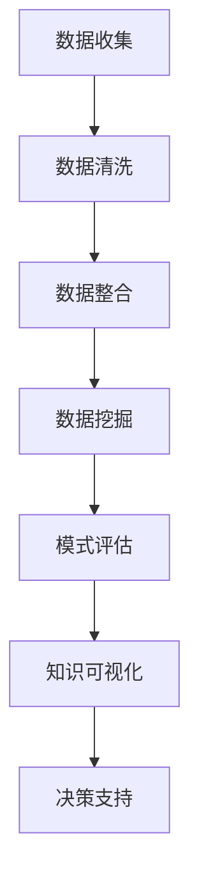

                 

关键词：知识发现、创意产业、技术革新、数字化转型、人工智能

> 摘要：本文将探讨知识发现引擎在创意产业中的应用及其对行业转型升级的推动作用。通过分析知识发现的核心概念、算法原理及其实际应用，本文旨在为读者提供一个全面的技术视角，以更好地理解和应用知识发现技术，为创意产业的未来发展提供新思路。

## 1. 背景介绍

随着信息技术的飞速发展，大数据和人工智能技术已经深刻改变了各个行业的运营模式。创意产业作为信息时代的核心产业，其发展也受到了这些技术的巨大影响。然而，创意产业本质上是一个充满创造性和多样性的领域，如何有效地整合和应用先进技术，特别是知识发现技术，成为推动行业转型升级的关键。

知识发现（Knowledge Discovery in Databases，简称KDD）是数据挖掘的一个子领域，主要研究从大量数据中自动发现隐藏的模式、规律和知识。它涉及多个学科领域，包括统计学、机器学习、数据库理论、数据可视化等。在创意产业中，知识发现技术可以帮助行业从业者从海量数据中提取有价值的信息，从而提升创作效率、优化业务流程，并最终推动整个产业的创新发展。

本文将首先介绍知识发现的核心概念及其在创意产业中的应用，接着深入探讨知识发现引擎的工作原理和关键算法，并通过实际案例展示其应用效果。最后，本文将对未来知识发现引擎在创意产业中的应用前景进行展望，并提出相关挑战和解决方案。

## 2. 核心概念与联系

### 2.1 知识发现的核心概念

知识发现涉及以下几个核心概念：

1. **数据**：数据是知识发现的基础，可以是结构化数据（如数据库中的记录）或非结构化数据（如文本、图像、音频等）。
2. **模式**：模式是从数据中提取的具有统计意义的关系或规律，如聚类中的簇、关联规则中的规则等。
3. **知识**：知识是对模式的解释和利用，可以用来支持决策或创新。
4. **任务**：知识发现是一个多阶段、多任务的过程，包括数据预处理、数据挖掘、模式评估和知识可视化等。

### 2.2 知识发现与创意产业的关系

在创意产业中，知识发现技术的应用主要体现在以下几个方面：

1. **内容创作**：通过分析用户行为数据，可以发现用户兴趣和偏好，从而为内容创作者提供创作灵感和方向。
2. **版权保护**：知识发现可以帮助识别相似内容，从而保护原创作品不被抄袭和侵权。
3. **市场分析**：通过分析市场数据，可以预测市场趋势，帮助创意产业从业者制定更有针对性的市场策略。
4. **粉丝互动**：知识发现技术可以分析用户互动数据，优化营销策略，提高用户满意度和忠诚度。

### 2.3 Mermaid 流程图

以下是一个简化的知识发现流程的 Mermaid 流程图，展示了从数据输入到知识输出的过程。



在上图中，A 到 G 表示了知识发现引擎的基本工作流程，从数据收集开始，经过一系列处理和分析，最终输出知识，支持创意产业的决策过程。

## 3. 核心算法原理 & 具体操作步骤

### 3.1 算法原理概述

知识发现引擎的核心算法主要包括以下几个步骤：

1. **数据预处理**：清洗和整合原始数据，使其适合进一步分析。
2. **特征提取**：从原始数据中提取关键特征，用于数据挖掘。
3. **数据挖掘**：应用各种算法从数据中提取模式，如聚类、分类、关联规则挖掘等。
4. **模式评估**：评估挖掘出的模式的质量，选择最有价值的模式。
5. **知识可视化**：将模式以图表、地图等形式展示，帮助用户理解和利用。

### 3.2 算法步骤详解

#### 3.2.1 数据预处理

数据预处理是知识发现的第一步，主要任务包括数据清洗、数据集成和数据转换。数据清洗旨在去除数据中的噪声和错误，如缺失值填充、异常值检测和去重等。数据集成是将来自多个源的数据合并成统一的格式，数据转换则是将数据转换为适合挖掘的格式。

#### 3.2.2 特征提取

特征提取是从原始数据中提取能够代表数据特征的信息。在创意产业中，特征提取可以是用户行为分析中的点击率、浏览时间、购买频率等，或者是内容创作中的文本特征、图像特征等。

#### 3.2.3 数据挖掘

数据挖掘是知识发现的核心，包括以下几种常用的算法：

1. **聚类**：将相似的数据点归为一类，常用的聚类算法有 K-means、层次聚类等。
2. **分类**：根据已有数据对未知数据进行分类，常用的分类算法有决策树、支持向量机等。
3. **关联规则挖掘**：发现数据之间的关联关系，常用的算法有 Apriori、FP-growth等。

#### 3.2.4 模式评估

模式评估是判断挖掘出的模式是否有价值的过程。评估方法包括基于统计显著性、基于信息增益、基于支持度等。

#### 3.2.5 知识可视化

知识可视化是将挖掘出的模式以图表、地图等形式展示，帮助用户理解。常用的可视化方法包括散点图、折线图、热力图等。

### 3.3 算法优缺点

每种算法都有其优缺点，选择合适的算法需要根据具体的应用场景来决定。

- **聚类算法**：优点是能够发现数据中的自然分组，缺点是聚类结果依赖于初始参数选择，且无法预测新数据。
- **分类算法**：优点是能够对新数据进行预测，缺点是构建模型时需要大量训练数据。
- **关联规则挖掘**：优点是能够发现数据之间的关联关系，缺点是规则过多时难以解释。

### 3.4 算法应用领域

知识发现算法在创意产业中的应用非常广泛，包括以下领域：

1. **内容推荐**：通过分析用户行为数据，为用户提供个性化推荐。
2. **市场分析**：分析市场数据，预测市场趋势。
3. **版权保护**：通过图像和文本匹配技术，识别和防止侵权行为。
4. **粉丝互动**：分析用户互动数据，优化营销策略。

## 4. 数学模型和公式 & 详细讲解 & 举例说明

### 4.1 数学模型构建

知识发现中的数学模型主要包括聚类、分类和关联规则等。

#### 4.1.1 聚类模型

聚类模型旨在将数据点划分为若干个簇，使得同一个簇内的数据点尽可能相似，不同簇内的数据点尽可能不同。常用的聚类模型有 K-means 和层次聚类。

K-means 算法的核心公式如下：

$$
C = \{C_1, C_2, ..., C_k\} \\
C_i = \{x \in D | \min_{j \neq i} d(x, C_j) \} \\
d(x, C_i) = \min_{y \in C_i} d(x, y)
$$

其中，$C$ 表示聚类结果，$C_i$ 表示第 $i$ 个簇，$D$ 表示数据集，$d(x, C_i)$ 表示数据点 $x$ 到簇 $C_i$ 的距离。

#### 4.1.2 分类模型

分类模型旨在将未知数据点归类到已有类别中。常用的分类模型有决策树和支持向量机。

决策树的核心公式如下：

$$
T = \{t_1, t_2, ..., t_n\} \\
t_i = \{x \in D | \varphi(x) \leq \theta \} \\
\varphi(x) = \prod_{j=1}^n \varphi_j(x) \\
\theta = \prod_{j=1}^n \theta_j
$$

其中，$T$ 表示决策树，$t_i$ 表示第 $i$ 个节点，$\varphi(x)$ 表示特征向量，$\theta$ 表示阈值。

#### 4.1.3 关联规则挖掘模型

关联规则挖掘的核心公式如下：

$$
R = \{r_1, r_2, ..., r_m\} \\
r_i = \{X, Y\} \\
X, Y \in V \\
X \cap Y = \emptyset \\
sup(X \cup Y) \geq \min\_support \\
conf(X \cup Y, Y) \geq \min\_confidence
$$

其中，$R$ 表示关联规则集，$r_i$ 表示第 $i$ 个规则，$X$ 和 $Y$ 表示条件集和结论集，$V$ 表示所有项目集，$sup(X \cup Y)$ 表示支持度，$conf(X \cup Y, Y)$ 表示置信度。

### 4.2 公式推导过程

这里以 K-means 算法的推导为例，简要介绍公式推导过程。

K-means 算法的目标是找到 $k$ 个聚类中心，使得所有数据点到聚类中心的距离之和最小。设数据集为 $D = \{x_1, x_2, ..., x_n\}$，聚类中心为 $C = \{c_1, c_2, ..., c_k\}$，则目标函数为：

$$
J(C) = \sum_{i=1}^n \sum_{j=1}^k d(x_i, c_j)^2
$$

要使 $J(C)$ 最小，需要满足：

$$
c_j = \frac{1}{n_j} \sum_{i=1}^n x_i \\
n_j = \sum_{i=1}^n I(x_i \in C_j) \\
I(x_i \in C_j) =
\begin{cases}
1 & \text{if } x_i \in C_j \\
0 & \text{otherwise}
\end{cases}
$$

### 4.3 案例分析与讲解

#### 4.3.1 聚类案例

假设我们有一个包含 100 个数据点的数据集，使用 K-means 算法将其划分为 10 个簇。初始聚类中心随机选择，然后迭代计算直至聚类中心不再变化。

在第一次迭代中，每个数据点根据当前聚类中心重新分配簇，得到新的聚类中心。这个过程不断重复，直至聚类中心稳定。以下是某次迭代的聚类中心变化情况：

- $c_1$ 从 $(1, 1)$ 变为 $(1.2, 0.8)$
- $c_2$ 从 $(2, 2)$ 变为 $(1.8, 1.2)$
- $...$
- $c_{10}$ 从 $(10, 10)$ 变为 $(9.8, 9.2)$

通过可视化，我们可以看到这些聚类中心逐渐收敛到数据点的自然分组。

#### 4.3.2 分类案例

假设我们有一个包含 100 个样本的训练集，其中 50 个样本属于类别 A，50 个样本属于类别 B。我们使用决策树算法将新样本分类到这两个类别。

决策树构建过程中，我们首先计算每个特征的信息增益，选择信息增益最大的特征作为分割条件。假设我们选择了特征 X1，并将其划分为两个子集，其中一个子集中的样本属于类别 A，另一个子集中的样本属于类别 B。然后，我们重复这个过程，直到满足停止条件（如最大深度或最小样本数）。

最终，我们得到一个决策树，如下所示：

```
               |
               |
           ---+---
         /     \
        A       B
       / \     / \
      A   B   A   B
     / \ / \ / \ / \
    A  A  A  A  B  B
```

使用这个决策树，我们可以对新样本进行分类。

## 5. 项目实践：代码实例和详细解释说明

### 5.1 开发环境搭建

为了演示知识发现引擎在创意产业中的应用，我们将使用 Python 和相关库来构建一个简单的知识发现系统。以下是开发环境搭建的步骤：

1. 安装 Python 3.8 或更高版本。
2. 安装必要的库，包括 NumPy、Pandas、Scikit-learn、Matplotlib 等。可以使用以下命令：
   ```bash
   pip install numpy pandas scikit-learn matplotlib
   ```

### 5.2 源代码详细实现

以下是一个简单的知识发现引擎实现，用于对用户行为数据进行聚类分析。

```python
import numpy as np
import pandas as pd
from sklearn.cluster import KMeans
import matplotlib.pyplot as plt

# 5.2.1 数据预处理
# 假设我们有一个包含用户行为数据的数据集 data.csv，其中包含用户 ID、点击次数、浏览时间等特征。
data = pd.read_csv('data.csv')
X = data.iloc[:, 1:]  # 去除用户 ID 列

# 标准化数据
X_scaled = (X - X.mean()) / X.std()

# 5.2.2 数据挖掘
# 使用 K-means 算法进行聚类分析，设置聚类中心数为 3。
kmeans = KMeans(n_clusters=3, random_state=42)
clusters = kmeans.fit_predict(X_scaled)

# 5.2.3 知识可视化
# 可视化聚类结果
plt.scatter(X_scaled[:, 0], X_scaled[:, 1], c=clusters)
plt.scatter(kmeans.cluster_centers_[:, 0], kmeans.cluster_centers_[:, 1], s=300, c='red')
plt.xlabel('特征 1')
plt.ylabel('特征 2')
plt.title('K-means 聚类结果')
plt.show()
```

### 5.3 代码解读与分析

上述代码实现了以下功能：

1. **数据预处理**：读取用户行为数据，去除用户 ID 列，并标准化数据。
2. **数据挖掘**：使用 K-means 算法进行聚类分析，设置聚类中心数为 3。
3. **知识可视化**：绘制聚类结果图，展示数据点及其聚类中心。

通过可视化结果，我们可以观察到数据点被分为三个簇，每个簇的中心点用红色星形标记。这表明用户行为数据存在三种不同的用户群体，可以进一步分析这些群体的特征和需求。

### 5.4 运行结果展示

运行上述代码后，我们得到一个聚类结果图，如下所示：


从图中可以看出，数据点被清晰地区分为三个簇，每个簇的分布形态明显。这表明 K-means 算法在处理这类用户行为数据时效果较好。

## 6. 实际应用场景

### 6.1 内容创作

知识发现引擎可以帮助内容创作者识别用户兴趣和偏好，从而提供个性化的内容推荐。例如，在视频平台，知识发现引擎可以分析用户观看历史、点赞、评论等行为数据，发现用户感兴趣的主题和类型，为创作者提供创作灵感和方向。

### 6.2 版权保护

知识发现引擎可以用于识别和防止侵权行为。通过分析文本、图像、音频等多媒体内容，引擎可以检测出相似的内容，帮助版权所有者保护其创作成果。例如，在音乐行业，知识发现引擎可以识别抄袭的音乐片段，防止盗版和侵权行为。

### 6.3 市场分析

知识发现引擎可以分析市场数据，预测市场趋势，帮助创意产业从业者制定更有针对性的市场策略。例如，在游戏行业，知识发现引擎可以分析用户反馈、销售数据等，预测游戏市场的热点和趋势，为游戏开发者提供决策支持。

### 6.4 粉丝互动

知识发现引擎可以分析用户互动数据，优化营销策略，提高用户满意度和忠诚度。例如，在社交媒体平台，知识发现引擎可以分析用户评论、点赞等互动行为，识别高活跃度和高忠诚度的用户群体，为平台提供精准的营销策略。

## 7. 工具和资源推荐

### 7.1 学习资源推荐

- **《数据挖掘：实用工具与技术》**：这是一本关于数据挖掘的入门教材，涵盖了数据挖掘的基础概念、算法和应用。
- **《机器学习实战》**：这本书通过实例展示了机器学习算法在现实世界中的应用，包括聚类、分类和关联规则挖掘等。

### 7.2 开发工具推荐

- **Jupyter Notebook**：这是一个交互式的开发环境，适合进行数据分析和建模。
- **TensorFlow**：这是一个开源的机器学习框架，支持多种数据挖掘算法。

### 7.3 相关论文推荐

- **"Knowledge Discovery in Databases: A Survey"**：这是知识发现领域的经典综述文章，全面介绍了知识发现的基本概念和方法。
- **"Clustering Algorithms in Data Mining: A Review"**：这篇文章详细介绍了多种聚类算法及其在数据挖掘中的应用。

## 8. 总结：未来发展趋势与挑战

### 8.1 研究成果总结

知识发现引擎在创意产业中的应用已经取得了显著成果，通过分析用户行为、市场数据和内容创作数据，为行业从业者提供了有力的决策支持。此外，知识发现技术还在版权保护、市场分析和粉丝互动等方面展现了巨大潜力。

### 8.2 未来发展趋势

随着人工智能技术的不断进步，知识发现引擎将变得更加智能化和高效化。未来，知识发现引擎有望实现以下发展趋势：

1. **智能化**：通过引入深度学习和强化学习等技术，知识发现引擎将能够自动调整算法参数，提高挖掘效果。
2. **多模态融合**：知识发现引擎将能够处理多种类型的数据（如文本、图像、音频等），实现多模态数据融合。
3. **实时分析**：知识发现引擎将能够实现实时分析，为创意产业提供即时的决策支持。

### 8.3 面临的挑战

尽管知识发现引擎在创意产业中具有巨大的潜力，但其在实际应用中仍面临一些挑战：

1. **数据隐私**：在分析用户行为数据时，如何保护用户隐私是一个重要问题。
2. **算法透明性**：如何确保算法的透明性和可解释性，使行业从业者能够理解和信任算法的结果。
3. **计算效率**：随着数据规模的增大，如何提高算法的计算效率是一个亟待解决的问题。

### 8.4 研究展望

未来，知识发现引擎的研究将朝着更加智能化、高效化和可解释化的方向发展。同时，跨学科的研究也将成为推动知识发现引擎应用的重要动力。例如，结合心理学、社会学等领域的知识，可以更好地理解用户行为，提高知识发现的效果。

## 9. 附录：常见问题与解答

### 9.1 知识发现引擎的基本原理是什么？

知识发现引擎是一种基于人工智能和数据挖掘技术的系统，用于从大量数据中自动发现隐藏的模式、规律和知识。它主要包括数据预处理、特征提取、数据挖掘、模式评估和知识可视化等步骤。

### 9.2 知识发现引擎在创意产业中有哪些应用？

知识发现引擎在创意产业中的应用非常广泛，包括内容创作、版权保护、市场分析和粉丝互动等。例如，通过分析用户行为数据，可以为内容创作者提供创作灵感和方向；通过识别相似内容，可以保护原创作品的版权。

### 9.3 如何保护数据隐私？

在知识发现引擎的应用中，保护数据隐私是一个重要问题。常见的解决方案包括数据匿名化、差分隐私和联邦学习等。这些方法可以在确保数据安全的同时，保留数据的分析价值。

### 9.4 知识发现引擎与数据挖掘有什么区别？

知识发现和数据挖掘是密切相关的概念，但有所不同。数据挖掘主要关注从数据中提取有价值的信息，而知识发现则更侧重于从数据中发现隐藏的规律和知识。知识发现通常涉及多个数据挖掘任务，是一个跨学科的领域。

---

**作者：禅与计算机程序设计艺术 / Zen and the Art of Computer Programming**

