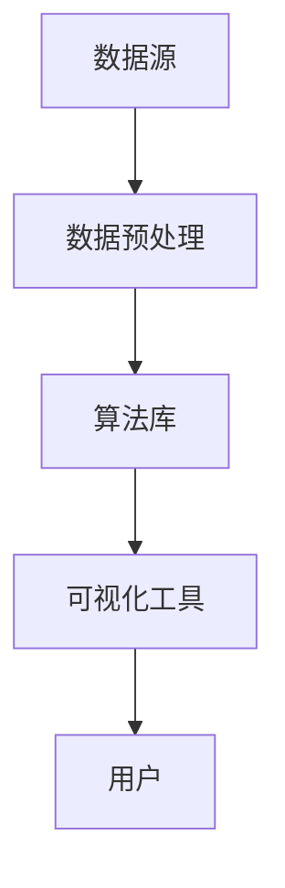

                 

关键词：知识发现引擎、创新、算法、数学模型、项目实践、应用场景、未来展望

> 摘要：本文深入探讨了知识发现引擎的概念、原理及其在推动创新中的作用。通过对核心算法的剖析、数学模型的构建，结合具体项目实例和实际应用场景，文章全面展现了知识发现引擎在现代科技领域的巨大潜力和应用前景。

## 1. 背景介绍

知识发现引擎（Knowledge Discovery Engine，简称KDE）是一种强大的技术工具，它通过对大量数据的深度挖掘和分析，自动识别出隐藏在数据中的有价值知识和模式。随着大数据时代的到来，知识发现引擎已经成为各行业创新的重要驱动力。从商业智能、金融分析到医疗健康、社交媒体，知识发现引擎的应用已经渗透到各个领域。

### 1.1 数据爆炸时代的需求

随着互联网、物联网等技术的迅猛发展，数据已经成为现代社会最重要的资源之一。然而，数据量的大规模增长同时也带来了数据处理的挑战。传统的数据处理方法已经无法满足快速变化和高度复杂的数据环境。知识发现引擎的出现，为处理海量数据提供了一种全新的解决方案。

### 1.2 创新的核心驱动力

知识发现引擎不仅能够帮助我们从海量数据中提取出有价值的信息，更能够在这些信息的基础上进行创新。通过分析历史数据，预测未来趋势，企业可以制定更加精准的市场策略，开发更具竞争力的产品。因此，知识发现引擎已经成为推动创新的核心驱动力。

## 2. 核心概念与联系

### 2.1 知识发现引擎的定义

知识发现引擎是一种基于人工智能和数据挖掘技术的系统，它通过自动化的算法和模型，从大量数据中提取出有价值的信息和知识。

### 2.2 知识发现引擎的组成部分

知识发现引擎主要包括以下几个关键组成部分：

- **数据源**：数据源是知识发现引擎的基础，它可以是结构化数据、半结构化数据或非结构化数据。
- **数据预处理**：数据预处理包括数据清洗、数据整合和数据转换等步骤，以确保数据的质量和一致性。
- **算法库**：算法库是知识发现引擎的核心，它包含了各种用于数据挖掘和模式识别的算法，如聚类、分类、关联规则挖掘等。
- **可视化工具**：可视化工具用于将分析结果以图表、仪表盘等形式直观地呈现给用户。

### 2.3 Mermaid 流程图



## 3. 核心算法原理 & 具体操作步骤

### 3.1 算法原理概述

知识发现引擎的核心是数据挖掘算法。这些算法可以分为以下几类：

- **分类算法**：通过已知的输入数据，预测新的输出数据类别。
- **聚类算法**：将数据点分为若干个簇，使得同一簇内的数据点彼此相似，不同簇的数据点彼此不相似。
- **关联规则挖掘算法**：发现数据之间的关联关系，如购物篮分析中的“商品A购买后通常会伴随商品B购买”。
- **异常检测算法**：识别数据中的异常值或异常模式。

### 3.2 算法步骤详解

1. **数据收集与预处理**：首先收集所需的数据，并进行预处理，以确保数据的质量。
2. **选择合适的算法**：根据问题的需求，选择最合适的算法。例如，对于分类问题，可以选择决策树、支持向量机等算法。
3. **模型训练**：使用预处理的训练数据，对选定的算法进行训练，生成模型。
4. **模型评估**：使用验证数据集对训练好的模型进行评估，调整模型参数，以提高模型性能。
5. **模型应用**：将训练好的模型应用于新的数据，预测新的输出结果。

### 3.3 算法优缺点

- **优点**：知识发现引擎可以自动处理大量数据，提高数据处理效率，帮助用户发现潜在的知识和模式。
- **缺点**：算法的选择和调优需要专业知识，且在处理复杂问题时，可能会出现过拟合或欠拟合等问题。

### 3.4 算法应用领域

知识发现引擎在各个领域都有广泛应用：

- **商业智能**：通过分析客户数据，帮助企业制定更加精准的市场策略。
- **金融分析**：通过分析市场数据，预测股票走势，提高投资决策的准确性。
- **医疗健康**：通过分析患者数据，发现疾病的潜在风险因素，提高诊断和治疗水平。
- **社交媒体**：通过分析用户行为，推荐感兴趣的内容，提高用户体验。

## 4. 数学模型和公式 & 详细讲解 & 举例说明

### 4.1 数学模型构建

知识发现引擎中的数学模型主要基于统计学和机器学习理论。以下是一个简单的线性回归模型：

$$
y = \beta_0 + \beta_1x_1 + \beta_2x_2 + ... + \beta_nx_n
$$

其中，$y$ 是预测目标，$x_1, x_2, ..., x_n$ 是输入特征，$\beta_0, \beta_1, \beta_2, ..., \beta_n$ 是模型参数。

### 4.2 公式推导过程

线性回归模型的推导过程如下：

1. **最小二乘法**：选择使得预测值与实际值之间误差平方和最小的参数。
2. **正规方程**：通过将线性回归模型转化为正规方程，求解参数。

### 4.3 案例分析与讲解

假设我们要预测一家公司的股票价格，输入特征包括公司的财务指标、市场环境指标等。我们可以使用线性回归模型来建立预测模型。

1. **数据收集与预处理**：收集公司过去一段时间内的股票价格和财务指标数据，进行数据清洗和预处理。
2. **模型训练**：使用预处理后的数据，训练线性回归模型。
3. **模型评估**：使用验证数据集，评估模型性能。
4. **模型应用**：使用训练好的模型，预测未来一段时间内的股票价格。

## 5. 项目实践：代码实例和详细解释说明

### 5.1 开发环境搭建

1. **安装 Python**：在本地计算机上安装 Python，版本建议为 3.8 以上。
2. **安装 NumPy、Pandas、Scikit-learn**：使用 pip 命令安装相关库。

### 5.2 源代码详细实现

以下是一个简单的线性回归模型实现：

```python
import numpy as np
import pandas as pd
from sklearn.linear_model import LinearRegression
from sklearn.model_selection import train_test_split

# 数据收集与预处理
data = pd.read_csv('company_data.csv')
X = data[['financial_indicator', 'market_environment']]
y = data['stock_price']

# 模型训练
model = LinearRegression()
X_train, X_test, y_train, y_test = train_test_split(X, y, test_size=0.2, random_state=42)
model.fit(X_train, y_train)

# 模型评估
score = model.score(X_test, y_test)
print('模型准确率：', score)

# 模型应用
predictions = model.predict(X_test)
print('预测结果：', predictions)
```

### 5.3 代码解读与分析

1. **数据收集与预处理**：使用 Pandas 读取数据，将特征和目标分离。
2. **模型训练**：使用 Scikit-learn 的 LinearRegression 类训练模型。
3. **模型评估**：使用 score 方法评估模型性能。
4. **模型应用**：使用 predict 方法预测测试数据。

## 6. 实际应用场景

### 6.1 商业智能

知识发现引擎可以帮助企业分析市场趋势，预测客户行为，优化营销策略。

### 6.2 金融分析

知识发现引擎可以用于股票市场预测、风险控制、信用评估等领域。

### 6.3 医疗健康

知识发现引擎可以帮助医疗机构分析患者数据，提高诊断和治疗水平。

### 6.4 社交媒体

知识发现引擎可以用于推荐系统，提高用户体验，增加用户粘性。

## 7. 工具和资源推荐

### 7.1 学习资源推荐

- 《机器学习》——周志华
- 《数据挖掘：实用工具与技术》——Ian H. Witten、Eibe Frank

### 7.2 开发工具推荐

- Jupyter Notebook：适用于数据分析和机器学习项目。
- PyCharm：适用于 Python 开发。

### 7.3 相关论文推荐

- "Knowledge Discovery in Databases: A Survey" —— Jiawei Han、Micheline Kamber、Jian Pei
- "Data Mining: Concepts and Techniques" —— Jiawei Han、Micheline Kamber、Jian Pei

## 8. 总结：未来发展趋势与挑战

### 8.1 研究成果总结

知识发现引擎在数据挖掘、机器学习和人工智能领域取得了显著的成果。随着技术的不断进步，知识发现引擎的应用将更加广泛。

### 8.2 未来发展趋势

- **算法优化**：针对不同领域的数据特点，优化算法，提高处理效率。
- **多模态数据挖掘**：结合多种数据类型，如文本、图像、音频等，进行综合挖掘。
- **边缘计算**：将知识发现引擎部署在边缘设备上，实现实时数据处理。

### 8.3 面临的挑战

- **数据隐私与安全**：确保数据挖掘过程中数据的安全性和隐私性。
- **算法解释性**：提高算法的可解释性，帮助用户理解挖掘结果。

### 8.4 研究展望

知识发现引擎在未来将迎来更多的创新和应用，成为推动社会进步的重要力量。

## 9. 附录：常见问题与解答

### 9.1 什么情况下需要使用知识发现引擎？

当您需要从大量数据中提取有价值信息时，知识发现引擎是一个非常有用的工具。

### 9.2 知识发现引擎与数据挖掘有什么区别？

数据挖掘是一个更广泛的概念，包括知识发现引擎在内的多种技术。知识发现引擎专注于从数据中提取知识和模式。

### 9.3 知识发现引擎可以应用于哪些领域？

知识发现引擎可以应用于商业智能、金融分析、医疗健康、社交媒体等多个领域。

## 参考文献

- Han, J., Kamber, M., & Pei, J. (2011). Data Mining: Concepts and Techniques (3rd ed.). Morgan Kaufmann.
- Witten, I. H., & Frank, E. (2016). Data Mining: Practical Machine Learning Tools and Techniques (4th ed.). Morgan Kaufmann.
- Han, J., Kamber, M., & Pei, J. (2000). Knowledge Discovery in Databases: A Survey. IEEE Transactions on Knowledge and Data Engineering, 12(6), 189-206.

作者：禅与计算机程序设计艺术 / Zen and the Art of Computer Programming
------------------------------------------------------------------------

