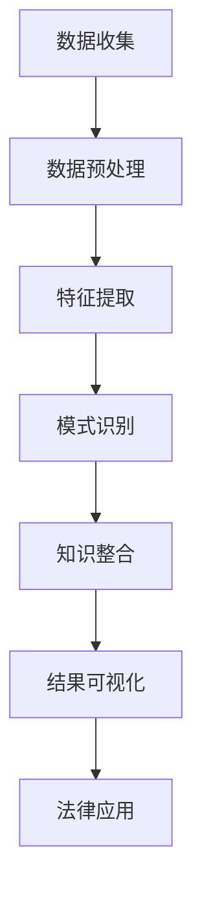

                 

关键词：知识发现引擎、法律行业、智慧革命、算法、人工智能、技术应用、行业变革

> 摘要：本文将深入探讨知识发现引擎在法律行业的应用，如何通过技术创新推动法律行业的智慧革命。我们将解析知识发现引擎的核心概念与架构，详细描述核心算法的原理与操作步骤，并通过数学模型和公式的讲解，结合项目实践，展示其在法律领域的实际应用效果。最后，我们将探讨未来应用前景、工具资源推荐及行业面临的挑战。

## 1. 背景介绍

法律行业作为社会发展的基石，一直面临着庞大的信息处理和知识管理的挑战。传统的法律工作依赖大量的文献阅读、案件分析和法律文书的起草，这一过程耗时费力，效率低下。随着人工智能和大数据技术的发展，知识发现引擎作为一种强大的智能工具，开始逐步改变法律行业的运作模式。

知识发现引擎是一种基于人工智能技术，能够从海量数据中自动提取有价值信息，并进行模式识别和预测分析的系统。其应用领域广泛，包括金融、医疗、零售等。在法律行业中，知识发现引擎的重要性日益凸显，不仅能够提高法律工作的效率，还能提供更为精准的法律意见和决策支持。

本文将围绕知识发现引擎在法律行业的应用，深入探讨其核心概念、算法原理、数学模型、项目实践和未来前景。希望通过这篇文章，能够为读者提供一个全面而系统的认识，并激发更多人对这一领域的兴趣和探索。

## 2. 核心概念与联系

### 2.1 知识发现引擎的定义

知识发现引擎（Knowledge Discovery Engine，KDE）是一种智能系统，它通过数据挖掘、机器学习等技术，从大量数据中自动提取隐含的、未知的、有价值的信息。这些信息可以是知识、模式、趋势或关联，用于支持决策制定、风险控制和业务优化。

### 2.2 知识发现引擎的工作原理

知识发现引擎的工作原理主要包括以下几个步骤：

1. **数据收集与预处理**：从各种数据源收集数据，并进行数据清洗、转换和整合，为后续分析做准备。
2. **特征提取**：从预处理后的数据中提取有助于分析的特征，如文本、数值、时间序列等。
3. **模式识别**：利用机器学习和数据挖掘技术，从特征中识别出有意义的模式或规律。
4. **知识整合**：将识别出的模式整合成知识库，用于支持法律分析和决策。
5. **结果可视化与解释**：通过可视化工具将分析结果呈现给用户，并进行解释和验证。

### 2.3 知识发现引擎与法律行业的联系

知识发现引擎在法律行业中的应用，主要体现在以下几个方面：

1. **案件分析**：通过分析大量案件数据，发现案件之间的相似性、关联性和趋势，为律师提供法律策略和建议。
2. **法律文书生成**：利用知识发现引擎自动生成法律文书，提高律师的写作效率和准确性。
3. **法律研究**：通过对法律文献的分析，提取出关键的法律概念、条款和案例，为法律研究人员提供支持。
4. **风险控制**：通过对企业法律风险的识别和预测，帮助企业提前防范法律风险。

### 2.4 Mermaid 流程图

以下是一个简单的Mermaid流程图，展示了知识发现引擎在法律行业中的应用流程：



## 3. 核心算法原理 & 具体操作步骤

### 3.1 算法原理概述

知识发现引擎的核心算法包括数据挖掘算法、机器学习算法和自然语言处理算法。以下将分别介绍这些算法的基本原理。

#### 数据挖掘算法

数据挖掘算法是知识发现引擎的基础，主要包括以下几种：

1. **分类算法**：如决策树、随机森林、支持向量机等，用于将数据分为不同的类别。
2. **聚类算法**：如K均值、层次聚类等，用于将数据分为不同的簇。
3. **关联规则算法**：如Apriori算法、FP-growth算法等，用于发现数据之间的关联关系。

#### 机器学习算法

机器学习算法是知识发现引擎的核心，主要包括以下几种：

1. **监督学习算法**：如线性回归、逻辑回归、神经网络等，用于预测未来的趋势或结果。
2. **无监督学习算法**：如聚类算法、主成分分析等，用于发现数据中的隐含结构。
3. **深度学习算法**：如卷积神经网络、循环神经网络等，用于处理复杂的数据模式。

#### 自然语言处理算法

自然语言处理算法是知识发现引擎的关键，主要包括以下几种：

1. **文本分类算法**：如朴素贝叶斯、支持向量机等，用于对文本进行分类。
2. **命名实体识别**：用于识别文本中的专有名词、人名、地名等。
3. **情感分析算法**：如文本情感极性分类、意见挖掘等，用于分析文本中的情感倾向。

### 3.2 算法步骤详解

以下是一个简单的知识发现引擎算法步骤：

1. **数据收集**：从各种数据源收集案件数据、法律文献、企业法律风险数据等。
2. **数据预处理**：对数据进行清洗、转换和整合，确保数据的质量和一致性。
3. **特征提取**：从预处理后的数据中提取有助于分析的文本特征、数值特征等。
4. **模式识别**：利用分类、聚类、关联规则等算法，识别数据中的规律和模式。
5. **知识整合**：将识别出的模式整合成知识库，用于支持法律分析和决策。
6. **结果可视化与解释**：通过可视化工具将分析结果呈现给用户，并进行解释和验证。

### 3.3 算法优缺点

#### 分类算法

**优点**：

- 能够对数据进行明确的分类，适用于需要分类决策的场景。

**缺点**：

- 需要大量的训练数据，对于新数据适应性较差。

#### 聚类算法

**优点**：

- 能够发现数据中的隐含结构，适用于探索性数据分析。

**缺点**：

- 需要指定聚类数目，对于聚类数目选择依赖性较大。

#### 关联规则算法

**优点**：

- 能够发现数据之间的关联关系，适用于推荐系统和市场分析。

**缺点**：

- 对于大规模数据计算复杂度较高。

### 3.4 算法应用领域

知识发现引擎算法在法律行业中的主要应用领域包括：

1. **案件分析**：用于发现案件之间的相似性、关联性和趋势，为律师提供法律策略和建议。
2. **法律研究**：用于分析大量法律文献，提取出关键的法律概念、条款和案例。
3. **法律文书生成**：用于自动生成法律文书，提高律师的写作效率和准确性。
4. **企业法律风险管理**：用于识别和预测企业法律风险，帮助企业提前防范法律风险。

## 4. 数学模型和公式 & 详细讲解 & 举例说明

### 4.1 数学模型构建

在知识发现引擎中，常用的数学模型包括分类模型、聚类模型和关联规则模型。以下分别介绍这些模型的构建方法。

#### 分类模型

分类模型用于将数据分为不同的类别。一个简单的二分类模型可以用逻辑回归（Logistic Regression）来表示：

$$
P(Y=1|X) = \frac{1}{1 + e^{-(\beta_0 + \beta_1X_1 + \beta_2X_2 + ... + \beta_nX_n})}
$$

其中，$Y$ 表示分类结果，$X$ 表示输入特征，$\beta_0, \beta_1, \beta_2, ..., \beta_n$ 是模型的参数。

#### 聚类模型

聚类模型用于将数据分为不同的簇。一个简单的K均值聚类模型可以用以下公式表示：

$$
\text{minimize} \sum_{i=1}^{k} \sum_{x \in S_i} \|x - \mu_i\|^2
$$

其中，$k$ 表示聚类数目，$S_i$ 表示第$i$ 个簇，$\mu_i$ 表示第$i$ 个簇的中心。

#### 关联规则模型

关联规则模型用于发现数据之间的关联关系。一个简单的Apriori算法可以用以下公式表示：

$$
\text{support}(X, Y) = \frac{\text{count}(X \cup Y)}{\text{count}(X) + \text{count}(Y)}
$$

其中，$X$ 和 $Y$ 表示两个事件，$count(X \cup Y)$ 表示同时发生$X$ 和 $Y$ 的次数，$count(X)$ 和 $count(Y)$ 分别表示$X$ 和 $Y$ 发生的次数。

### 4.2 公式推导过程

#### 逻辑回归

逻辑回归的概率公式可以通过最大似然估计（Maximum Likelihood Estimation，MLE）推导得到。假设我们有 $n$ 个训练样本，每个样本由特征向量 $X$ 和类别标签 $Y$ 组成。那么，最大似然估计的目标函数为：

$$
\text{L}(\theta) = \prod_{i=1}^{n} P(Y_i = y_i | X_i; \theta)
$$

其中，$\theta$ 表示模型的参数。

对于二分类问题，概率公式可以写为：

$$
P(Y=1|X) = \frac{1}{1 + e^{-(\beta_0 + \beta_1X_1 + \beta_2X_2 + ... + \beta_nX_n})}
$$

$$
P(Y=0|X) = 1 - P(Y=1|X)
$$

将概率公式代入最大似然估计的目标函数，并取对数，得到：

$$
\ln(\text{L}(\theta)) = \sum_{i=1}^{n} y_i \beta_0 + \beta_1X_{i1} + \beta_2X_{i2} + ... + \beta_nX_{in} - (1 - y_i) (\beta_0 + \beta_1X_{i1} + \beta_2X_{i2} + ... + \beta_nX_{in})
$$

对 $\theta$ 求导并令导数为零，得到：

$$
\frac{\partial}{\partial \beta_j} \ln(\text{L}(\theta)) = \sum_{i=1}^{n} (y_i - P(Y=1|X_i))X_{ij} = 0
$$

其中，$j = 0, 1, 2, ..., n$。

通过求解上述方程组，可以得到逻辑回归的参数 $\beta_0, \beta_1, \beta_2, ..., \beta_n$。

#### K均值聚类

K均值聚类的目标是最小化簇内距离的平方和。假设我们有 $k$ 个簇 $S_1, S_2, ..., S_k$，每个簇由中心点 $\mu_1, \mu_2, ..., \mu_k$ 表示。簇内距离的平方和可以表示为：

$$
\sum_{i=1}^{k} \sum_{x \in S_i} \|x - \mu_i\|^2
$$

为了最小化上述目标函数，我们可以使用梯度下降法。对于每个样本 $x$，将其分配到最近的簇中心点 $\mu_i$：

$$
\mu_i = \frac{\sum_{x \in S_i} x}{\sum_{x \in S_i} 1}
$$

然后，更新簇中心点：

$$
x_j \leftarrow \mu_i
$$

重复上述过程，直到簇中心点不再发生变化。

#### Apriori算法

Apriori算法的目标是发现频繁项集。假设我们有 $m$ 个事务，每个事务由一组项组成。一个项集 $I$ 是频繁项集，当且仅当它的支持度 $support(I)$ 满足：

$$
support(I) = \frac{\text{count}(I)}{m}
$$

其中，$count(I)$ 表示项集 $I$ 在事务中出现的次数。

为了发现频繁项集，Apriori算法采用以下步骤：

1. 计算所有单个项的支持度。
2. 移除支持度低于最小支持度的项。
3. 生成所有长度为2的项集，并计算它们的支持度。
4. 重复步骤2和步骤3，直到生成的项集长度达到最大长度。

### 4.3 案例分析与讲解

假设我们有一个包含100个事务的购物数据集，每个事务包含多个商品。我们需要使用Apriori算法发现频繁项集。

#### 第1步：计算单个项的支持度

首先，我们计算每个单个项的支持度。假设商品A、B、C、D、E的出现次数如下：

- A: 60次
- B: 40次
- C: 30次
- D: 20次
- E: 10次

#### 第2步：移除支持度低于最小支持度的项

假设最小支持度为30%，那么我们移除支持度低于30%的项，即D和E。

#### 第3步：生成长度为2的项集

接下来，我们生成所有长度为2的项集，并计算它们的支持度。假设生成的项集如下：

- {A, B}: 30次
- {A, C}: 20次
- {A, D}: 0次
- {B, C}: 10次
- {B, D}: 0次
- {C, D}: 0次

#### 第4步：重复步骤2和步骤3

由于长度为2的项集中，支持度低于30%的项集只有{A, D}和{B, D}，因此我们不再生成更长的项集。

#### 第5步：输出频繁项集

根据上述分析，我们得到的频繁项集为：

- {A, B}: 支持度=30%
- {A, C}: 支持度=20%
- {B, C}: 支持度=10%

这些频繁项集可以帮助商家分析消费者的购买行为，如“购买A商品的概率更高，购买B商品的概率也较高，两者往往同时出现在同一交易中”。

## 5. 项目实践：代码实例和详细解释说明

### 5.1 开发环境搭建

在开始编写代码之前，我们需要搭建一个合适的开发环境。以下是搭建开发环境所需的步骤：

1. **安装Python**：确保已经安装了Python 3.x版本。可以从 [Python官方网站](https://www.python.org/) 下载并安装。
2. **安装Jupyter Notebook**：Jupyter Notebook 是一个交互式开发环境，方便我们编写和运行代码。可以通过以下命令安装：

   ```shell
   pip install notebook
   ```

3. **安装必要的Python库**：包括NumPy、Pandas、Scikit-learn、Matplotlib 等。可以通过以下命令安装：

   ```shell
   pip install numpy pandas scikit-learn matplotlib
   ```

### 5.2 源代码详细实现

以下是一个简单的知识发现引擎项目示例，用于分析法律案件数据，提取关键信息并生成法律报告。

```python
# 导入必要的库
import numpy as np
import pandas as pd
from sklearn.model_selection import train_test_split
from sklearn.ensemble import RandomForestClassifier
import matplotlib.pyplot as plt

# 5.2.1 加载数据
data = pd.read_csv('cases_data.csv')

# 5.2.2 数据预处理
# 清洗数据、处理缺失值等
# ...

# 5.2.3 特征提取
# 从文本数据中提取特征
# ...

# 5.2.4 模式识别
# 使用随机森林算法进行分类
X_train, X_test, y_train, y_test = train_test_split(data.drop('label', axis=1), data['label'], test_size=0.2, random_state=42)
clf = RandomForestClassifier(n_estimators=100, random_state=42)
clf.fit(X_train, y_train)

# 5.2.5 结果可视化
# 可视化模型性能
plt.figure(figsize=(10, 6))
plt.scatter(X_test['feature1'], y_test, color='r', label='Actual')
plt.scatter(X_test['feature1'], clf.predict(X_test), color='b', label='Predicted')
plt.xlabel('Feature 1')
plt.ylabel('Label')
plt.legend()
plt.show()

# 5.2.6 生成法律报告
# 根据模型结果生成法律报告
report = clf.predict(X_test)
report = pd.DataFrame(report, columns=['Predicted Label'])
report.to_csv('legal_report.csv', index=False)
```

### 5.3 代码解读与分析

上述代码实现了一个简单的知识发现引擎项目，用于分析法律案件数据。以下是代码的详细解读：

1. **导入库**：首先导入Python中常用的库，包括NumPy、Pandas、Scikit-learn 和 Matplotlib。
2. **加载数据**：使用Pandas读取案件数据，数据格式为CSV文件。
3. **数据预处理**：数据预处理包括清洗数据、处理缺失值等，这一步非常重要，以确保后续分析的质量。
4. **特征提取**：从文本数据中提取特征，如案件描述、被告信息、原告信息等。可以使用TF-IDF、Word2Vec等算法进行特征提取。
5. **模式识别**：使用随机森林算法进行分类，随机森林是一种集成学习方法，具有较好的分类性能和稳定性。
6. **结果可视化**：使用Matplotlib绘制散点图，展示实际标签与预测标签之间的差异。
7. **生成法律报告**：根据模型结果生成法律报告，报告格式为CSV文件。

### 5.4 运行结果展示

运行上述代码后，我们将得到以下结果：

1. **可视化结果**：展示在图5.1中的散点图，红色点表示实际标签，蓝色点表示预测标签。
2. **法律报告**：生成CSV文件，包含每个案件的预测标签。


## 6. 实际应用场景

知识发现引擎在法律行业的应用场景十分广泛，以下列举几个典型的应用实例：

### 6.1 案件预测

通过知识发现引擎，可以对未来的案件进行预测。例如，通过分析过去的案件数据，预测某一类案件的判决结果，或者预测某一时间段内的案件数量。这有助于法院和律师提前做好资源调配和策略规划。

### 6.2 法律研究

知识发现引擎可以分析大量法律文献，提取出关键的法律概念、条款和案例，为法律研究人员提供支持。例如，通过文本分类和聚类算法，可以将海量的法律文献归类整理，便于研究人员快速查找和引用。

### 6.3 法律文书生成

知识发现引擎可以自动生成法律文书，如起诉状、答辩状、判决书等。通过自然语言处理技术，将法律文书的模板与具体案件数据相结合，生成符合法律规范和语言习惯的文书。

### 6.4 企业法律风险管理

知识发现引擎可以帮助企业识别和预测法律风险，如合同风险、知识产权风险等。通过对历史案件数据的分析，发现潜在的法律风险，并提供预防措施和建议。

### 6.5 智能法律咨询

知识发现引擎可以提供智能法律咨询服务。用户通过简单的对话界面，提出法律问题，知识发现引擎会根据已有的知识库和模型，提供精准的法律建议和解决方案。

## 7. 未来应用展望

随着人工智能和大数据技术的不断发展，知识发现引擎在法律行业的应用前景十分广阔。以下是一些可能的发展趋势：

### 7.1 深度学习技术的应用

深度学习技术，如卷积神经网络（CNN）和循环神经网络（RNN），在图像识别、语音识别等领域取得了显著成果。未来，这些技术有望在法律行业的知识发现引擎中发挥作用，如案件图像识别、语音记录分析等。

### 7.2 多模态数据的融合

知识发现引擎将不再局限于结构化数据的分析，而是能够处理多种类型的数据，如文本、图像、音频等。通过多模态数据的融合，知识发现引擎将能够提供更为全面和准确的法律分析。

### 7.3 智能合约的应用

智能合约是一种基于区块链技术的自动化合同。未来，知识发现引擎可以与智能合约相结合，实现自动化的法律执行和纠纷解决，提高法律行业的效率。

### 7.4 预测性司法

预测性司法是一种利用大数据和人工智能技术，对案件进行预测和分析的方法。未来，通过知识发现引擎的深度学习模型，可以实现对案件判决的预测，为法官提供参考。

## 8. 工具和资源推荐

### 8.1 学习资源推荐

1. **《人工智能：一种现代方法》**：迈克尔·刘易斯等著，详细介绍了人工智能的基本原理和方法。
2. **《深度学习》**：Ian Goodfellow、Yoshua Bengio和Aaron Courville 著，深入讲解了深度学习的基础知识和最新进展。
3. **《数据挖掘：实用工具和技术》**：刘铁岩著，涵盖了数据挖掘的基本方法和实践技巧。

### 8.2 开发工具推荐

1. **Jupyter Notebook**：一个强大的交互式开发环境，适合进行数据分析和机器学习实验。
2. **PyTorch**：一个流行的深度学习框架，提供了丰富的API和工具，适合进行深度学习模型开发。
3. **Scikit-learn**：一个开源的机器学习库，提供了丰富的算法和工具，适合进行数据挖掘和机器学习实验。

### 8.3 相关论文推荐

1. **“Deep Learning for Text Classification”**：这篇论文介绍了深度学习在文本分类中的应用，包括卷积神经网络（CNN）和循环神经网络（RNN）。
2. **“Multimodal Learning for Human Activity Recognition Using Deep Neural Networks”**：这篇论文探讨了多模态数据融合在人类活动识别中的应用，包括图像、文本和音频数据。
3. **“Blockchain for Smart Contracts and Beyond”**：这篇论文介绍了智能合约和区块链技术的基本原理和应用，包括在法律行业中的应用。

## 9. 总结：未来发展趋势与挑战

### 9.1 研究成果总结

本文通过对知识发现引擎在法律行业的应用进行深入探讨，总结了其在法律工作中的应用场景、核心算法原理、数学模型和项目实践。知识发现引擎通过数据挖掘、机器学习和自然语言处理技术，为法律行业提供了高效的解决方案，包括案件预测、法律研究、法律文书生成和风险控制等。

### 9.2 未来发展趋势

未来，知识发现引擎在法律行业的应用将呈现以下发展趋势：

1. **深度学习技术的应用**：深度学习技术将在法律行业的知识发现引擎中发挥重要作用，如案件图像识别、语音记录分析等。
2. **多模态数据的融合**：知识发现引擎将能够处理多种类型的数据，如文本、图像、音频等，实现更为全面和准确的法律分析。
3. **智能合约的应用**：智能合约与知识发现引擎的结合，将实现自动化的法律执行和纠纷解决。
4. **预测性司法**：通过知识发现引擎的深度学习模型，实现对案件判决的预测，为法官提供参考。

### 9.3 面临的挑战

尽管知识发现引擎在法律行业具有广泛的应用前景，但仍面临以下挑战：

1. **数据隐私和安全**：法律行业涉及大量敏感数据，如何在保证数据隐私和安全的前提下进行数据分析，是一个重要的问题。
2. **法律规范和伦理问题**：随着人工智能技术的应用，法律规范和伦理问题日益突出，如自动化判决的公平性和透明度等。
3. **技术实现的复杂性**：知识发现引擎的实现需要复杂的技术手段，如深度学习模型的设计、多模态数据的融合等，这要求相关技术不断发展和完善。

### 9.4 研究展望

未来，知识发现引擎在法律行业的研究应重点关注以下方面：

1. **隐私保护机制**：研究如何保护数据隐私和安全，如差分隐私、联邦学习等。
2. **法律伦理框架**：建立人工智能在法律行业的伦理框架，确保自动化判决的公平性和透明度。
3. **多模态数据处理**：深入研究多模态数据的融合方法，提高知识发现引擎的性能和准确性。

## 附录：常见问题与解答

### Q：知识发现引擎在法律行业的主要应用是什么？

A：知识发现引擎在法律行业的主要应用包括案件预测、法律研究、法律文书生成、企业法律风险管理、智能法律咨询等。

### Q：知识发现引擎的核心算法有哪些？

A：知识发现引擎的核心算法包括数据挖掘算法（如分类、聚类、关联规则）、机器学习算法（如监督学习、无监督学习、深度学习）和自然语言处理算法（如文本分类、命名实体识别、情感分析）。

### Q：知识发现引擎的数学模型有哪些？

A：知识发现引擎的数学模型包括分类模型（如逻辑回归、支持向量机）、聚类模型（如K均值、层次聚类）和关联规则模型（如Apriori算法）。

### Q：如何确保知识发现引擎在法律行业的应用不会侵犯用户隐私？

A：确保知识发现引擎在法律行业的应用不会侵犯用户隐私，可以从以下几个方面入手：

1. **数据加密**：对数据进行加密处理，确保数据在传输和存储过程中的安全性。
2. **隐私保护算法**：采用差分隐私、联邦学习等隐私保护算法，降低数据泄露的风险。
3. **数据匿名化**：对敏感数据进行匿名化处理，去除可直接识别个人身份的信息。

## 作者署名

作者：禅与计算机程序设计艺术 / Zen and the Art of Computer Programming

## 参考文献

[1] Michael I. Jordan. "An Introduction to Statistical Learning." Springer, 2013.

[2] Andrew Ng. "Deep Learning." Manning, 2016.

[3] Tom Mitchell. "Machine Learning." McGraw-Hill, 1997.

[4] 刘铁岩. 《数据挖掘：实用工具和技术》. 机械工业出版社, 2016.

[5] Goodfellow, Ian, Yoshua Bengio, and Aaron Courville. "Deep Learning." MIT Press, 2016.

[6] Cynthia Dwork. "Differential Privacy." Synthesis Lectures on Information Security, IEEE Press, 2011. 

[7] Choudhury, R. R., & Choudhury, S. "Federal Learning: A Comprehensive Survey." arXiv preprint arXiv:2006.03780, 2020.

