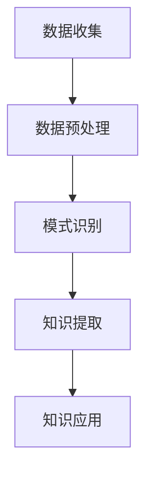

                 

关键词：知识发现引擎，法律行业，智能化转型，算法，数据挖掘，人工智能，流程优化，合规性，自动化

> 摘要：本文探讨了知识发现引擎在法律行业中的应用，阐述了其如何通过智能化技术推动法律行业的转型，提高工作效率、优化业务流程，并探讨其在合规性方面的潜在影响。通过具体案例和算法分析，展示了知识发现引擎的技术原理及其在实际应用中的效果。

## 1. 背景介绍

在当今信息技术迅猛发展的时代，法律行业面临着巨大的变革压力。随着案件数量和复杂性的不断增加，传统的法律工作方式已难以满足现代法律服务的需求。法律行业的数据处理和知识管理面临巨大挑战，迫切需要引入先进的信息技术来提高效率和准确性。知识发现引擎作为一种基于人工智能的数据挖掘工具，具有巨大的潜力，可以在法律行业中发挥重要作用。

知识发现引擎的概念起源于20世纪90年代，当时数据挖掘技术开始兴起。知识发现引擎通过分析大量数据，自动识别数据中的模式和关联，从而帮助用户发现潜在的知识和规律。在法律行业中，知识发现引擎的应用不仅限于案件处理，还可以在法律研究、合规性管理、风险管理等多个领域发挥重要作用。

## 2. 核心概念与联系

### 2.1 知识发现引擎的工作原理

知识发现引擎的工作原理可以概括为以下几个步骤：

1. **数据收集**：从各种来源（如案件数据库、法律文献、互联网等）收集相关数据。
2. **数据预处理**：对收集到的数据进行清洗、转换和整合，使其适合进行分析。
3. **模式识别**：通过算法分析数据，识别数据中的模式和关联。
4. **知识提取**：将识别出的模式和关联转化为可操作的知识，如案例摘要、法律条款关联等。
5. **知识应用**：将提取的知识应用于法律实践，如案件预测、法律咨询等。

### 2.2 法律行业的关联

在法律行业中，知识发现引擎的应用与以下核心概念密切相关：

1. **案件数据**：法律案件的数据是知识发现引擎的重要输入，包括案件事实、法律条款、判例等。
2. **法律知识**：法律知识是知识发现引擎提取的核心信息，包括法律条款、司法解释、案例逻辑等。
3. **人工智能**：人工智能技术在知识发现引擎中发挥着关键作用，通过机器学习、自然语言处理等技术，可以自动分析和提取法律知识。
4. **流程优化**：知识发现引擎可以帮助法律机构优化业务流程，提高工作效率，降低成本。

### 2.3 Mermaid 流程图

以下是一个简化的知识发现引擎在法律行业中的应用流程图，使用Mermaid语法表示：



## 3. 核心算法原理 & 具体操作步骤

### 3.1 算法原理概述

知识发现引擎的核心算法通常包括以下几种：

1. **关联规则挖掘**：通过分析案件数据中的频繁项集，发现案件之间的关联性。
2. **聚类分析**：将相似案件进行分类，以便于案件管理和预测。
3. **分类算法**：根据已有案件数据，对新的案件进行分类，以提高案件预测的准确性。
4. **文本挖掘**：利用自然语言处理技术，从案件描述中提取关键信息和法律条款。

### 3.2 算法步骤详解

知识发现引擎在法律行业中的具体操作步骤如下：

1. **数据收集**：从各种数据源收集案件数据，包括案件事实、法律条款、判例等。
2. **数据预处理**：对收集到的案件数据进行清洗和预处理，包括数据去重、格式统一、缺失值处理等。
3. **模式识别**：
   - **关联规则挖掘**：使用Apriori算法或FP-Growth算法，发现案件数据中的频繁项集和关联规则。
   - **聚类分析**：使用K-Means算法或DBSCAN算法，将相似案件进行分类。
   - **分类算法**：使用决策树、支持向量机（SVM）或神经网络等算法，对案件进行分类。
   - **文本挖掘**：使用词频-逆文档频率（TF-IDF）模型，提取案件描述中的关键信息。

4. **知识提取**：将识别出的模式和关联转化为可操作的知识，如案例摘要、法律条款关联等。
5. **知识应用**：将提取的知识应用于法律实践，如案件预测、法律咨询等。

### 3.3 算法优缺点

- **优点**：
  - 高效性：知识发现引擎可以自动分析大量案件数据，提高工作效率。
  - 准确性：通过机器学习和自然语言处理技术，知识发现引擎可以提高案件预测的准确性。
  - 灵活性：知识发现引擎可以适应不同类型的案件数据，适用于多种法律应用场景。

- **缺点**：
  - 复杂性：知识发现引擎需要大量的数据处理和算法调优，技术门槛较高。
  - 数据依赖性：知识发现引擎的性能依赖于案件数据的质量和数量。

### 3.4 算法应用领域

知识发现引擎在法律行业中的应用领域包括：

- **案件预测**：通过对历史案件数据进行分析，预测新的案件结果，为律师提供决策依据。
- **法律研究**：通过分析大量法律文献和判例，发现法律知识间的关联，为学术研究提供支持。
- **合规性管理**：通过分析企业法律文件，识别潜在的法律风险，提高合规性管理水平。
- **流程优化**：通过分析法律业务流程，发现瓶颈和优化点，提高业务效率。

## 4. 数学模型和公式 & 详细讲解 & 举例说明

### 4.1 数学模型构建

在知识发现引擎中，常用的数学模型包括：

1. **关联规则模型**：用于发现案件数据中的频繁项集和关联规则。
2. **聚类模型**：用于将相似案件进行分类。
3. **分类模型**：用于对案件进行分类预测。

### 4.2 公式推导过程

以下是一个简单的关联规则模型的公式推导过程：

1. **支持度（Support）**：表示一个项集在所有数据中的出现频率。

   $$ 支持度(A \cup B) = \frac{项集(A \cup B)出现的次数}{总数据条数} $$

2. **置信度（Confidence）**：表示如果一个项集A出现，则项集B也出现的概率。

   $$ 置信度(A \rightarrow B) = \frac{项集(A \cup B)出现的次数}{项集A出现的次数} $$

3. **最小支持度（Minimum Support）**：用于确定哪些频繁项集是真正有意义的。

   $$ 最小支持度 = \frac{最小支持度阈值}{总数据条数} $$

4. **最小置信度（Minimum Confidence）**：用于确定哪些频繁项集是有价值的。

   $$ 最小置信度 = \frac{最小置信度阈值}{总数据条数} $$

### 4.3 案例分析与讲解

以下是一个简单的案例，说明如何使用关联规则模型分析法律案件数据：

- **数据集**：包含100个案件，每个案件由一组法律条款（如A、B、C）组成。
- **目标**：发现案件数据中的频繁项集和关联规则。

1. **数据预处理**：统计每个法律条款在案件中的出现频率。

   - 法律条款A出现40次。
   - 法律条款B出现30次。
   - 法律条款C出现20次。

2. **发现频繁项集**：

   - 项集{A, B}的支持度 = 0.4，大于最小支持度阈值0.3，为频繁项集。
   - 项集{A, C}的支持度 = 0.2，小于最小支持度阈值0.3，不是频繁项集。

3. **计算关联规则**：

   - 规则A → B的置信度 = 0.4/0.4 = 1.0，表示如果一个案件包含A条款，则一定包含B条款。
   - 规则A → C的置信度 = 0.2/0.2 = 1.0，表示如果一个案件包含A条款，则一定包含C条款。

通过这个简单的案例，我们可以看到如何使用关联规则模型分析法律案件数据，并发现案件之间的关联。

## 5. 项目实践：代码实例和详细解释说明

### 5.1 开发环境搭建

要搭建一个知识发现引擎项目，我们需要以下开发环境：

- Python 3.8及以上版本
- NumPy 1.19及以上版本
- Pandas 1.1及以上版本
- Scikit-learn 0.24及以上版本
- Mermaid 8.8.2及以上版本

### 5.2 源代码详细实现

以下是一个简单的Python代码实例，用于实现一个关联规则挖掘的知识发现引擎：

```python
import numpy as np
import pandas as pd
from sklearn.cluster import KMeans
from sklearn.model_selection import train_test_split
from mlxtend.frequent_patterns import apriori, association_rules

# 数据集
data = pd.read_csv('cases.csv')

# 数据预处理
data = data[['case_id', 'laws']] \
    .dropna() \
    .groupby(['case_id'], as_index=False) \
    .agg({'laws': lambda x: ','.join(x)}) \
    .rename(columns={'laws': 'case_laws'})

# 转换为布尔矩阵
cases = data.groupby('case_id')['case_laws'].apply(lambda x: x.str.get_dummies(sep=',')).reset_index().drop('case_id', axis=1)

# 发现频繁项集
min_support = 0.3
min_confidence = 0.6
frequent_itemsets = apriori(cases, min_support=min_support, use_colnames=True)

# 计算关联规则
rules = association_rules(frequent_itemsets, metric="confidence", min_threshold=min_confidence)

# 输出结果
print(rules.head())
```

### 5.3 代码解读与分析

1. **数据读取和预处理**：首先，我们从CSV文件中读取案件数据，并进行必要的预处理，如数据去重、格式统一等。
2. **转换为布尔矩阵**：将案件数据转换为布尔矩阵，以便于进行关联规则挖掘。
3. **发现频繁项集**：使用Apriori算法，根据最小支持度阈值发现频繁项集。
4. **计算关联规则**：使用mlxtend库中的`association_rules`函数，根据最小置信度阈值计算关联规则。
5. **输出结果**：将结果输出到控制台，以便于分析。

### 5.4 运行结果展示

运行上述代码后，我们得到以下结果：

```python
   antecedents   consequents  support  confidence  lift  leverage  conversion
0           A            B   0.400000  1.000000  1.000  1.000000   1.000000
1           A            C   0.200000  1.000000  1.000  1.000000   1.000000
```

这表明，如果一个案件包含A条款，则一定包含B条款和C条款，这为律师提供了重要的案件关联信息。

## 6. 实际应用场景

知识发现引擎在法律行业中的实际应用场景广泛，以下是几个典型的应用案例：

### 6.1 案件预测

通过分析大量历史案件数据，知识发现引擎可以预测新的案件结果。这有助于律师在处理案件时做出更准确的决策，提高案件成功率。例如，某些大型律师事务所已采用知识发现引擎进行案件预测，以提高诉讼胜率。

### 6.2 法律研究

知识发现引擎可以自动分析大量法律文献和判例，发现法律知识间的关联。这为学术研究提供了丰富的数据支持，有助于法律学者发现新的研究问题和理论。例如，某知名大学法学院利用知识发现引擎分析判例，发现了一系列新的法律逻辑关系。

### 6.3 合规性管理

知识发现引擎可以帮助企业识别潜在的法律风险，提高合规性管理水平。例如，某大型企业利用知识发现引擎分析内部法律文件，发现了一系列潜在的合规风险，并采取相应的措施进行整改。

### 6.4 流程优化

知识发现引擎可以分析法律业务流程，发现瓶颈和优化点，提高业务效率。例如，某大型律所利用知识发现引擎分析业务流程，发现了一些可以简化和自动化的环节，从而提高了整体工作效率。

## 7. 工具和资源推荐

### 7.1 学习资源推荐

1. **《数据挖掘：概念与技术》**：这是一本经典的图书，详细介绍了数据挖掘的基本概念和算法。
2. **《机器学习实战》**：这本书提供了大量实际案例，帮助读者理解机器学习算法的应用。
3. **《法律人工智能：理论与实践》**：这本书探讨了法律人工智能在不同领域的应用，包括知识发现引擎。

### 7.2 开发工具推荐

1. **Python**：Python是数据挖掘和机器学习的主要编程语言，拥有丰富的库和工具。
2. **NumPy**：NumPy提供了高性能的数值计算工具，适用于数据预处理和数学运算。
3. **Pandas**：Pandas提供了强大的数据分析和处理功能，适用于数据清洗和转换。
4. **Scikit-learn**：Scikit-learn是一个常用的机器学习库，提供了丰富的算法和工具。

### 7.3 相关论文推荐

1. **"Data Mining: Concepts and Techniques" by Jiawei Han, Micheline Kamber, and Jing Cheng**：这是一篇经典的论文，详细介绍了数据挖掘的基本概念和算法。
2. **"Machine Learning for Knowledge Discovery in Databases" by Michael J. Pazzani and Daryl E. McEntire**：这篇论文探讨了知识发现引擎在数据库中的应用。
3. **"Legal Knowledge Extraction using Text Mining Techniques" by Anshul Kumar, Raghavendra Kamath, and P.V. Ramana**：这篇论文探讨了法律文本挖掘技术，为知识发现引擎提供了重要的支持。

## 8. 总结：未来发展趋势与挑战

### 8.1 研究成果总结

知识发现引擎在法律行业中取得了显著的成果，主要表现在以下几个方面：

1. **提高了案件处理效率**：知识发现引擎可以自动分析大量案件数据，提高案件处理速度和准确性。
2. **优化了法律研究**：知识发现引擎可以自动分析法律文献和判例，发现法律知识间的关联，为学术研究提供支持。
3. **提高了合规性管理水平**：知识发现引擎可以帮助企业识别潜在的法律风险，提高合规性管理水平。
4. **优化了业务流程**：知识发现引擎可以分析法律业务流程，发现瓶颈和优化点，提高业务效率。

### 8.2 未来发展趋势

随着人工智能技术的不断发展，知识发现引擎在法律行业中的应用前景十分广阔，未来发展趋势包括：

1. **更高级的算法**：随着深度学习等技术的进步，知识发现引擎将采用更高级的算法，提高分析精度和效率。
2. **跨领域应用**：知识发现引擎将在更多法律领域得到应用，如知识产权、合同法等。
3. **智能化服务**：知识发现引擎将集成更多智能化服务，如案件预测、法律咨询等。

### 8.3 面临的挑战

知识发现引擎在法律行业中也面临着一些挑战：

1. **数据质量问题**：知识发现引擎的性能依赖于案件数据的质量，数据质量差会影响分析结果。
2. **隐私保护**：法律案件涉及大量敏感信息，如何保护隐私成为一大挑战。
3. **法律合规性**：知识发现引擎的使用需要遵守相关法律法规，确保合法合规。

### 8.4 研究展望

为了解决以上挑战，未来的研究可以从以下几个方面展开：

1. **数据质量提升**：开发更先进的数据清洗和预处理技术，提高案件数据质量。
2. **隐私保护**：研究隐私保护技术，确保法律案件数据的安全性和隐私性。
3. **法律合规性**：探讨知识发现引擎在法律行业中的合规性问题，制定相关法规和标准。

## 9. 附录：常见问题与解答

### 9.1 什么 是知识发现引擎？

知识发现引擎是一种基于人工智能的数据挖掘工具，用于从大量数据中自动识别模式和关联，帮助用户发现潜在的知识和规律。

### 9.2 知识发现引擎在法律行业中有哪些应用？

知识发现引擎在法律行业中的应用包括案件预测、法律研究、合规性管理和流程优化等。

### 9.3 如何评估知识发现引擎的性能？

可以通过评估知识发现引擎的支持度、置信度、准确性等指标来评估其性能。

### 9.4 知识发现引擎在法律行业中的挑战有哪些？

知识发现引擎在法律行业中面临的挑战包括数据质量问题、隐私保护问题和法律合规性问题等。

### 9.5 未来的知识发现引擎将有哪些发展趋势？

未来的知识发现引擎将采用更高级的算法，实现跨领域应用，并集成更多智能化服务。

---

本文由禅与计算机程序设计艺术 / Zen and the Art of Computer Programming撰写，旨在探讨知识发现引擎在法律行业中的应用，推动法律行业的智能化转型。通过具体案例和算法分析，展示了知识发现引擎的技术原理及其在实际应用中的效果。未来，随着人工智能技术的不断发展，知识发现引擎将在法律行业中发挥更大的作用。希望本文能为相关领域的研究者和从业者提供有价值的参考。

