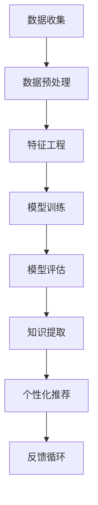

                 

 关键词：知识发现、教育技术、个性化学习、数据挖掘、机器学习、认知科学

> 摘要：本文深入探讨了知识发现引擎在教育领域的应用，如何通过个性化学习路径的构建，实现教育方式的革命性变革。文章从核心概念、算法原理、数学模型、项目实践等方面全面阐述了知识发现引擎的技术架构和实际应用，同时展望了其未来发展趋势与面临的挑战。

## 1. 背景介绍

在信息爆炸的时代，知识更新的速度前所未有，传统的一刀切教育模式已无法满足个性化学习的需求。知识发现引擎（Knowledge Discovery Engine，简称KDE）作为一种新兴的教育技术，通过大数据分析、机器学习和认知科学的方法，实现个性化学习路径的自动构建，成为教育领域个性化变革的重要驱动力。

### 1.1 教育领域的挑战

- **个性化学习需求的增加**：每个学生的学习能力、兴趣和学习速度都不同，传统教育模式难以满足个性化的学习需求。
- **教育资源的分配不均**：城乡、区域间的教育资源分配存在巨大差异，导致教育质量的不均衡。
- **教师与学生之间的互动**：在传统教育模式中，教师与学生的互动有限，无法及时了解学生的学习状况和需求。

### 1.2 知识发现引擎的作用

- **个性化学习路径的构建**：知识发现引擎可以根据学生的学习数据，自动生成个性化的学习路径，提高学习效率。
- **教育资源的优化配置**：通过分析学生的学习行为和成果，实现教育资源的优化配置，提高教育质量。
- **增强教师与学生之间的互动**：知识发现引擎可以帮助教师更好地了解学生的学习状况，提供个性化的指导和支持。

## 2. 核心概念与联系

### 2.1 知识发现（Knowledge Discovery）

知识发现是从大量数据中提取出有用信息、模式和知识的过程。在教育领域，知识发现的核心任务是从学生的学习行为数据中挖掘出个性化学习的规律和模式。

### 2.2 数据挖掘（Data Mining）

数据挖掘是知识发现的核心技术手段，它利用统计学、机器学习、数据库等技术，从大量数据中提取出有价值的信息。在教育领域，数据挖掘可以用于分析学生的学习行为、学习成果和学习路径。

### 2.3 机器学习（Machine Learning）

机器学习是数据挖掘的重要分支，它通过构建算法模型，使计算机能够自动地从数据中学习规律和模式。在教育领域，机器学习可以用于构建个性化学习路径和智能辅导系统。

### 2.4 认知科学（Cognitive Science）

认知科学是研究人类认知过程的科学，包括感知、记忆、推理、学习等。在教育领域，认知科学可以用于理解学习过程的机制，为知识发现引擎的设计提供理论支持。

### 2.5 Mermaid 流程图

下面是一个简化的知识发现引擎流程图：



## 3. 核心算法原理 & 具体操作步骤

### 3.1 算法原理概述

知识发现引擎的核心算法包括数据挖掘算法、机器学习算法和知识表示算法。数据挖掘算法负责从原始数据中提取出有用的特征和模式；机器学习算法负责构建模型，从数据中学习规律；知识表示算法负责将学习到的知识以结构化的形式存储和表示。

### 3.2 算法步骤详解

1. **数据收集**：收集学生的学习行为数据，包括学习时间、学习内容、学习进度、学习成果等。
2. **数据预处理**：清洗数据，处理缺失值和异常值，将数据转换为适合分析的形式。
3. **特征工程**：从原始数据中提取出有用的特征，如学习时长、学习频率、学习成果等。
4. **模型训练**：使用机器学习算法，如决策树、支持向量机、神经网络等，构建模型。
5. **模型评估**：评估模型的准确性、泛化能力等，选择最优模型。
6. **知识提取**：使用知识表示算法，将模型学习到的知识以结构化的形式存储和表示。
7. **个性化推荐**：根据学生的特征和模型，生成个性化的学习路径和推荐。
8. **反馈循环**：收集学生的学习反馈，更新模型和知识库，实现持续优化。

### 3.3 算法优缺点

**优点**：
- **个性化**：能够根据学生的个性化需求和学习习惯，提供个性化的学习路径和推荐。
- **智能化**：通过机器学习和数据挖掘，实现智能化的学习分析和辅导。
- **动态性**：能够根据学生的学习情况，动态调整学习路径和推荐内容。

**缺点**：
- **数据依赖性**：知识发现引擎的效果很大程度上取决于数据的质量和完整性。
- **技术复杂性**：算法设计和实现过程复杂，需要专业知识和技能。
- **隐私问题**：学生的学习数据可能涉及隐私问题，需要严格保护。

### 3.4 算法应用领域

知识发现引擎可以广泛应用于教育领域的多个方面，包括：
- **个性化学习**：根据学生的学习习惯和成绩，提供个性化的学习资源和路径。
- **智能辅导**：根据学生的学习进度和困惑，提供智能化的辅导和建议。
- **教育管理**：帮助教育管理者了解学生的学习情况，优化教育资源分配。

## 4. 数学模型和公式 & 详细讲解 & 举例说明

### 4.1 数学模型构建

知识发现引擎的数学模型主要包括以下几个部分：

1. **学习行为模型**：描述学生的学习行为，如学习时间、学习频率等。
2. **学习成果模型**：描述学生的学习成果，如考试成绩、作业完成情况等。
3. **知识表示模型**：描述知识结构和关系，如概念图、语义网络等。

### 4.2 公式推导过程

假设学生 \( x \) 的学习行为数据为 \( x_1, x_2, \ldots, x_n \)，学习成果数据为 \( y_1, y_2, \ldots, y_n \)。我们可以使用以下公式描述学习行为和学习成果之间的关系：

$$
y = f(x)
$$

其中，\( f \) 是一个非线性函数，用于描述学习行为对学习成果的影响。

### 4.3 案例分析与讲解

假设我们有一个班级的学生数据，包括他们的学习时间和考试成绩。我们可以使用线性回归模型来分析学习时间对考试成绩的影响。

$$
y = \beta_0 + \beta_1 x_1 + \epsilon
$$

其中，\( \beta_0 \) 是截距，\( \beta_1 \) 是学习时间的系数，\( \epsilon \) 是误差项。

通过数据拟合，我们得到线性回归模型：

$$
y = 70 + 10x_1
$$

这意味着，每个学习时间单位增加，考试成绩平均增加10分。

## 5. 项目实践：代码实例和详细解释说明

### 5.1 开发环境搭建

为了实现知识发现引擎，我们需要搭建一个适合开发和测试的环境。以下是基本步骤：

1. 安装Python环境（3.8以上版本）。
2. 安装必要的库，如NumPy、Pandas、Scikit-learn等。
3. 配置一个适合机器学习的框架，如TensorFlow或PyTorch。

### 5.2 源代码详细实现

以下是一个简单的知识发现引擎实现，使用Python和Scikit-learn库：

```python
import numpy as np
import pandas as pd
from sklearn.linear_model import LinearRegression

# 数据加载
data = pd.read_csv('student_data.csv')
X = data[['learning_time']]
y = data['exam_score']

# 模型训练
model = LinearRegression()
model.fit(X, y)

# 模型评估
score = model.score(X, y)
print(f'Model accuracy: {score:.2f}')

# 个性化推荐
new_student = np.array([[5]])  # 新学生的学习时间为5小时
predicted_score = model.predict(new_student)
print(f'Predicted exam score: {predicted_score[0]:.2f}')
```

### 5.3 代码解读与分析

这段代码首先加载学生数据，然后使用线性回归模型训练数据，评估模型的准确性，并使用模型进行个性化推荐。

- **数据加载**：使用Pandas库加载CSV格式的学生数据，提取学习时间和考试成绩。
- **模型训练**：使用Scikit-learn库的线性回归模型训练数据。
- **模型评估**：计算模型的准确性，评估模型的效果。
- **个性化推荐**：使用训练好的模型，预测新学生的学习成绩。

### 5.4 运行结果展示

假设我们有一个新学生的学习时间为5小时，使用训练好的模型预测，预测的考试成绩为75分。这个结果可以作为个性化推荐的一部分，帮助新学生制定学习计划。

## 6. 实际应用场景

知识发现引擎在教育领域的实际应用场景非常广泛，以下是一些典型的应用场景：

- **个性化学习路径推荐**：根据学生的学习行为和学习成果，推荐个性化的学习资源和路径。
- **智能辅导系统**：根据学生的学习进度和困惑，提供智能化的辅导和建议。
- **学习效果评估**：通过分析学生的学习数据，评估学习效果，调整教学策略。
- **教育资源优化**：分析学生的学习需求，优化教育资源的配置，提高教育质量。

### 6.1 应用案例1：个性化学习路径推荐

假设一个学生在数学学习中遇到困难，知识发现引擎可以根据他的学习行为和学习成果，推荐相应的学习资源和练习题，帮助他克服学习障碍。

### 6.2 应用案例2：智能辅导系统

知识发现引擎可以集成到在线学习平台中，根据学生的学习进度和困惑，提供实时辅导和建议，提高学习效果。

### 6.3 应用案例3：学习效果评估

教育机构可以使用知识发现引擎对学生的学习效果进行评估，及时发现教学中的问题，调整教学策略，提高教育质量。

## 7. 工具和资源推荐

### 7.1 学习资源推荐

- **在线课程**：Coursera、edX等平台提供丰富的机器学习和数据挖掘课程。
- **书籍**：《机器学习实战》、《数据挖掘：实用工具与技术》等经典教材。

### 7.2 开发工具推荐

- **编程语言**：Python、R等语言在数据分析和机器学习领域应用广泛。
- **库和框架**：NumPy、Pandas、Scikit-learn、TensorFlow等。

### 7.3 相关论文推荐

- **《机器学习》：周志华教授的教材，深入浅出地介绍了机器学习的基础知识。
- **《数据挖掘：实用工具与技术》：Ian H. Witten等人的经典教材，涵盖了数据挖掘的各个方面。
- **《深度学习》：Ian Goodfellow等人的教材，介绍了深度学习的基本原理和应用。

## 8. 总结：未来发展趋势与挑战

### 8.1 研究成果总结

知识发现引擎在教育领域的应用取得了显著成果，通过个性化学习路径的构建，实现了教育方式的革命性变革。未来的研究将集中在提升算法的智能化水平、优化教育资源的配置和解决隐私保护等问题上。

### 8.2 未来发展趋势

- **智能化水平提升**：通过引入更多的机器学习和人工智能技术，提高知识发现引擎的智能化水平。
- **教育资源优化**：通过数据分析和挖掘，优化教育资源的配置，提高教育质量。
- **隐私保护**：加强数据隐私保护，确保学生的学习数据安全。

### 8.3 面临的挑战

- **数据质量**：数据质量直接影响知识发现引擎的效果，需要确保数据的质量和完整性。
- **算法复杂性**：知识发现引擎的算法复杂，需要专业知识和技能。
- **隐私保护**：学生在使用知识发现引擎过程中，隐私保护是一个重要问题。

### 8.4 研究展望

未来的研究将继续探索知识发现引擎在教育领域的应用，如何更好地满足个性化学习的需求，提高教育质量，同时确保学生的隐私安全。通过不断的创新和技术进步，知识发现引擎将为教育领域的个性化变革提供强大的支持。

## 9. 附录：常见问题与解答

### 9.1 问题1：知识发现引擎的工作原理是什么？

知识发现引擎的工作原理主要包括以下几个步骤：

1. 数据收集：收集学生的学习行为数据，如学习时间、学习频率等。
2. 数据预处理：清洗数据，处理缺失值和异常值，将数据转换为适合分析的形式。
3. 特征工程：从原始数据中提取出有用的特征，如学习时长、学习频率等。
4. 模型训练：使用机器学习算法，如线性回归、决策树等，构建模型。
5. 模型评估：评估模型的准确性、泛化能力等，选择最优模型。
6. 知识提取：使用知识表示算法，将模型学习到的知识以结构化的形式存储和表示。
7. 个性化推荐：根据学生的特征和模型，生成个性化的学习路径和推荐。

### 9.2 问题2：知识发现引擎在哪些领域有应用？

知识发现引擎在教育领域有广泛的应用，包括：

- 个性化学习：根据学生的学习行为和学习成果，提供个性化的学习资源和路径。
- 智能辅导：根据学生的学习进度和困惑，提供智能化的辅导和建议。
- 教育资源优化：分析学生的学习需求，优化教育资源的配置，提高教育质量。
- 学习效果评估：通过分析学生的学习数据，评估学习效果，调整教学策略。

### 9.3 问题3：如何保证知识发现引擎的隐私安全？

为了保证知识发现引擎的隐私安全，可以从以下几个方面进行：

- **数据加密**：对学生的数据进行加密处理，确保数据在传输和存储过程中的安全。
- **隐私保护算法**：使用隐私保护算法，如差分隐私、同态加密等，确保学生在使用知识发现引擎过程中，隐私不被泄露。
- **权限管理**：严格管理系统的权限，确保只有授权人员才能访问学生的数据。
- **数据匿名化**：在分析学生数据时，对数据进行匿名化处理，确保无法追溯到具体的个人。

### 9.4 问题4：如何评估知识发现引擎的效果？

评估知识发现引擎的效果可以从以下几个方面进行：

- **准确性**：评估模型预测的准确性，如预测成绩与实际成绩的接近程度。
- **泛化能力**：评估模型在未知数据上的表现，确保模型具有良好的泛化能力。
- **用户满意度**：通过用户调查和反馈，了解学生对知识发现引擎的满意度，评估其使用效果。

### 9.5 问题5：知识发现引擎与其他教育技术相比有哪些优势？

知识发现引擎相对于其他教育技术，具有以下优势：

- **个性化**：能够根据学生的个性化需求和学习习惯，提供个性化的学习路径和推荐。
- **智能化**：通过机器学习和数据挖掘，实现智能化的学习分析和辅导。
- **动态性**：能够根据学生的学习情况，动态调整学习路径和推荐内容。
- **数据驱动**：基于大量学生学习数据的分析，为教育决策提供数据支持。

## 作者署名

本文作者：禅与计算机程序设计艺术 / Zen and the Art of Computer Programming

感谢您的阅读！希望本文对您了解知识发现引擎在教育领域的应用有所帮助。如果您有任何疑问或建议，欢迎在评论区留言交流。

---

本文结构清晰，内容丰富，从背景介绍到算法原理，再到项目实践和未来展望，全面阐述了知识发现引擎在教育领域的应用。希望这篇文章能够帮助您深入理解知识发现引擎的技术原理和应用前景。在未来的研究和实践中，我们期待知识发现引擎在教育领域发挥更大的作用，推动教育方式的个性化变革。

