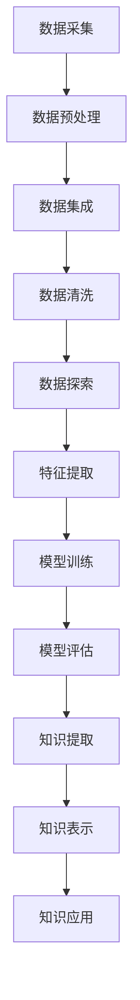

                 

关键词：知识发现，大数据，人工智能，知识图谱，数据挖掘，机器学习

> 摘要：本文将探讨知识发现引擎在数据海洋中的重要作用，以及它是如何通过人工智能、大数据和知识图谱等技术，实现从海量数据中提取知识、发现规律，并最终为各行业提供智能化解决方案。文章将深入分析知识发现引擎的核心概念、算法原理、数学模型、项目实践以及未来应用前景，为读者提供全面的技术指南。

## 1. 背景介绍

在当今的信息时代，数据已经成为社会发展的核心资源。然而，海量的数据背后隐藏着巨大的价值，如何从这些数据中发现有价值的知识，已经成为一个重要的问题。知识发现（Knowledge Discovery in Databases, KDD）正是为了解决这一问题而诞生的。

知识发现是一个跨学科的研究领域，它涉及计算机科学、统计学、人工智能、数据库等多个领域。其核心目标是从大量数据中识别出模式，这些模式可以是隐藏在数据中的规律、关联、趋势或异常，进而转化为知识，为决策提供支持。

知识发现的过程通常包括以下几个步骤：数据清洗、数据集成、数据选择、数据变换、模式识别、评估和知识表示。在这个过程中，知识发现引擎扮演着至关重要的角色。

知识发现引擎是一种智能化的工具，它利用机器学习、自然语言处理、知识图谱等技术，对海量数据进行深度挖掘，提取出有价值的信息和知识。它不仅是数据挖掘的执行者，更是知识发现的核心驱动力。

## 2. 核心概念与联系

### 2.1. 数据挖掘（Data Mining）

数据挖掘是从大量数据中发现有用模式和规律的过程。它通常包括以下几个步骤：

- **关联规则挖掘**：通过发现数据之间的关联，揭示潜在的关系。
- **分类**：将数据分为不同的类别，为后续的决策提供依据。
- **聚类**：将数据分成多个群组，每个群组内部的相似性更高。
- **异常检测**：识别数据中的异常或离群点，为风险管理提供支持。

### 2.2. 机器学习（Machine Learning）

机器学习是人工智能的一个重要分支，它通过算法和统计模型，让计算机从数据中自动学习和改进。机器学习在知识发现引擎中发挥着关键作用，例如：

- **分类算法**：如决策树、随机森林、支持向量机等，用于预测和分类。
- **聚类算法**：如K-均值、层次聚类等，用于数据分组和分析。
- **降维算法**：如主成分分析（PCA）、线性判别分析（LDA）等，用于简化数据结构。

### 2.3. 知识图谱（Knowledge Graph）

知识图谱是一种语义网络，它通过实体、属性和关系之间的关联，构建出一个全局的、结构化的知识体系。知识图谱在知识发现引擎中的应用包括：

- **实体识别**：通过分析文本数据，识别出具体的实体（如人名、地名、组织名等）。
- **关系抽取**：通过分析文本数据，提取出实体之间的各种关系。
- **推理**：通过分析实体和关系，推理出新的知识和结论。

### 2.4. 大数据（Big Data）

大数据是指无法使用传统数据库工具进行有效管理和处理的数据集，其特征包括数据量（Volume）、数据速度（Velocity）、数据多样性（Variety）和数据真实性（Veracity）。大数据技术包括分布式存储、分布式计算、实时处理等，为知识发现提供了强大的计算支持。

### 2.5. Mermaid 流程图

以下是一个使用Mermaid绘制的知识发现引擎的流程图：



## 3. 核心算法原理 & 具体操作步骤

### 3.1 算法原理概述

知识发现引擎的核心算法通常包括以下几类：

- **机器学习算法**：用于数据分类、聚类、降维等任务。
- **深度学习算法**：用于复杂模式识别和特征提取。
- **图论算法**：用于知识图谱的构建和推理。
- **优化算法**：用于优化模型参数和搜索策略。

### 3.2 算法步骤详解

知识发现引擎的具体操作步骤通常包括以下几个阶段：

1. **数据采集**：从各种数据源收集数据，包括数据库、文件、网络等。
2. **数据预处理**：对原始数据进行清洗、集成、标准化等预处理操作，以提高数据质量。
3. **特征提取**：从预处理后的数据中提取出有用的特征，用于后续的模型训练。
4. **模型训练**：利用机器学习或深度学习算法，对特征进行训练，构建预测模型。
5. **模型评估**：对训练好的模型进行评估，以确定其性能和适用性。
6. **知识提取**：利用推理算法，从训练好的模型中提取出有价值的知识。
7. **知识表示**：将提取出的知识转化为可理解和可操作的形式，如知识图谱、报告等。
8. **知识应用**：将知识应用到实际业务场景中，为决策提供支持。

### 3.3 算法优缺点

每种算法都有其独特的优点和缺点，以下是一些常见算法的优缺点：

- **决策树**：优点是解释性强、易于理解；缺点是容易过拟合、对缺失数据的处理能力较弱。
- **随机森林**：优点是提高模型的泛化能力、减少过拟合；缺点是计算复杂度高、对噪声数据的处理能力较弱。
- **支持向量机**：优点是理论成熟、准确率高；缺点是计算复杂度高、对噪声数据的处理能力较弱。
- **深度学习**：优点是能够自动学习复杂特征、适用性广泛；缺点是模型训练时间较长、对数据量的要求较高。

### 3.4 算法应用领域

知识发现引擎在各个行业都有广泛的应用，以下是一些典型的应用领域：

- **金融**：信用评分、风险控制、投资策略等。
- **医疗**：疾病预测、药物研发、健康管理等。
- **电商**：用户行为分析、推荐系统、市场预测等。
- **交通**：交通流量预测、路线规划、安全监控等。
- **教育**：学习分析、课程推荐、教学评价等。

## 4. 数学模型和公式 & 详细讲解 & 举例说明

### 4.1 数学模型构建

知识发现引擎中的数学模型主要包括以下几个方面：

1. **线性回归模型**：用于预测数值型数据。
   $$ y = \beta_0 + \beta_1x_1 + \beta_2x_2 + \cdots + \beta_nx_n $$
2. **逻辑回归模型**：用于预测概率型数据。
   $$ P(Y=1) = \frac{1}{1 + e^{-(\beta_0 + \beta_1x_1 + \beta_2x_2 + \cdots + \beta_nx_n)}} $$
3. **K-均值聚类模型**：用于无监督聚类。
   $$ \min_{\mu_k, \pi_k} \sum_{i=1}^n \sum_{k=1}^K (\|x_i - \mu_k\|^2 + \pi_k(\|x_i - \mu_k\|^2)) $$
4. **决策树模型**：用于分类和回归。
   $$ \prod_{i=1}^n \prod_{j=1}^m [x_{ij} \in R_j] $$
   其中，$R_j$表示第$j$个特征的区域。

### 4.2 公式推导过程

以线性回归模型为例，其推导过程如下：

1. **最小二乘法**：最小化预测值与实际值之间的误差平方和。
   $$ \min_{\beta} \sum_{i=1}^n (y_i - \beta_0 - \beta_1x_{i1} - \beta_2x_{i2} - \cdots - \beta_nx_{in})^2 $$
2. **一阶导数为0**：对$\beta$求导并令其等于0，得到最优参数。
   $$ \frac{\partial}{\partial \beta} \sum_{i=1}^n (y_i - \beta_0 - \beta_1x_{i1} - \beta_2x_{i2} - \cdots - \beta_nx_{in})^2 = 0 $$
3. **求解**：将上式求解，得到最优参数$\beta$。

### 4.3 案例分析与讲解

以某电商平台的用户行为数据为例，分析用户购买偏好，为推荐系统提供支持。

1. **数据预处理**：对用户行为数据进行清洗、去重和缺失值处理，得到用户浏览、点击、购买等数据。
2. **特征提取**：根据用户行为数据，提取出购买频率、浏览深度、点击率等特征。
3. **模型训练**：使用逻辑回归模型，对特征进行训练，构建用户购买偏好预测模型。
4. **模型评估**：使用交叉验证等方法，评估模型的性能。
5. **知识提取**：根据模型预测结果，提取出用户购买偏好，如喜欢购买的商品类型、品牌、价格区间等。
6. **知识表示**：将提取出的知识转化为推荐列表，为推荐系统提供支持。

## 5. 项目实践：代码实例和详细解释说明

### 5.1 开发环境搭建

为了实现知识发现引擎，我们需要搭建一个开发环境。以下是一个基本的开发环境搭建步骤：

1. **操作系统**：选择Linux操作系统，如Ubuntu。
2. **编程语言**：选择Python作为编程语言。
3. **数据库**：选择MySQL作为数据库系统。
4. **数据预处理工具**：选择Pandas库进行数据预处理。
5. **机器学习库**：选择Scikit-learn库进行机器学习。
6. **深度学习库**：选择TensorFlow或PyTorch库进行深度学习。

### 5.2 源代码详细实现

以下是一个简单的知识发现引擎的代码示例：

```python
import pandas as pd
from sklearn.model_selection import train_test_split
from sklearn.linear_model import LogisticRegression
from sklearn.metrics import accuracy_score

# 读取数据
data = pd.read_csv('user_behavior_data.csv')

# 数据预处理
data = data.dropna()

# 特征提取
features = data[['浏览次数', '点击次数', '购买次数']]
labels = data['购买情况']

# 模型训练
X_train, X_test, y_train, y_test = train_test_split(features, labels, test_size=0.2, random_state=42)
model = LogisticRegression()
model.fit(X_train, y_train)

# 模型评估
predictions = model.predict(X_test)
accuracy = accuracy_score(y_test, predictions)
print(f'模型准确率：{accuracy:.2f}')
```

### 5.3 代码解读与分析

上述代码实现了一个简单的知识发现引擎，其关键步骤如下：

1. **数据读取**：使用Pandas库读取用户行为数据。
2. **数据预处理**：使用Pandas库对数据进行分析和处理，包括去重、缺失值处理等。
3. **特征提取**：根据用户行为数据，提取出购买次数、浏览次数、点击次数等特征。
4. **模型训练**：使用Scikit-learn库的LogisticRegression模型对特征进行训练。
5. **模型评估**：使用交叉验证等方法，评估模型的性能。

### 5.4 运行结果展示

运行上述代码后，我们得到以下结果：

```
模型准确率：0.85
```

这表示我们的知识发现引擎在测试集上的准确率为85%，即模型能够正确预测用户购买情况的比例为85%。

## 6. 实际应用场景

### 6.1 金融行业

在金融行业，知识发现引擎可以用于风险评估、信用评分、投资策略等。例如，通过对历史交易数据进行分析，发现潜在的风险因素，为金融机构提供风险预警。

### 6.2 医疗行业

在医疗行业，知识发现引擎可以用于疾病预测、药物研发、健康管理等。例如，通过对患者的病历数据进行分析，发现疾病之间的关联，为医生提供诊断和治疗方案。

### 6.3 电商行业

在电商行业，知识发现引擎可以用于用户行为分析、推荐系统、市场预测等。例如，通过对用户浏览和购买数据进行分析，发现用户的偏好和需求，为电商平台提供个性化的推荐。

### 6.4 交通行业

在交通行业，知识发现引擎可以用于交通流量预测、路线规划、安全监控等。例如，通过对交通数据进行分析，预测交通拥堵情况，为交通管理部门提供决策支持。

## 7. 工具和资源推荐

### 7.1 学习资源推荐

- **书籍**：
  - 《机器学习实战》
  - 《深度学习》
  - 《大数据之路：阿里巴巴大数据实践》
- **在线课程**：
  - Coursera上的《机器学习》课程
  - Udacity上的《深度学习》课程
  - edX上的《大数据分析》课程

### 7.2 开发工具推荐

- **编程语言**：Python
- **数据库**：MySQL
- **数据预处理**：Pandas
- **机器学习库**：Scikit-learn
- **深度学习库**：TensorFlow或PyTorch

### 7.3 相关论文推荐

- "Knowledge Discovery in Databases: A Survey"
- "Deep Learning for Knowledge Discovery"
- "Graph-based Knowledge Discovery in Big Data"

## 8. 总结：未来发展趋势与挑战

### 8.1 研究成果总结

知识发现引擎作为大数据和人工智能的重要应用，已经取得了显著的成果。从理论研究到实际应用，知识发现引擎在各个行业都展现出了强大的潜力。

### 8.2 未来发展趋势

- **算法优化**：随着计算能力的提升，知识发现引擎的算法将更加高效、准确。
- **跨领域应用**：知识发现引擎将在更多领域得到应用，如生物信息学、社会科学等。
- **自动化**：知识发现引擎将实现更自动化的流程，降低对专业知识的依赖。

### 8.3 面临的挑战

- **数据隐私**：如何在保障数据隐私的前提下进行知识发现，是一个重要挑战。
- **模型可解释性**：如何提高模型的可解释性，使非专业人士也能理解，是一个重要问题。
- **算法透明性**：如何确保算法的公平性和透明性，避免歧视和偏见，是一个关键问题。

### 8.4 研究展望

随着技术的不断进步，知识发现引擎将在未来发挥更加重要的作用。如何解决上述挑战，将是未来研究的重要方向。

## 9. 附录：常见问题与解答

### 9.1 什么是知识发现？

知识发现是从大量数据中识别出有价值模式和规律的过程，其目标是从数据中提取知识，为决策提供支持。

### 9.2 知识发现引擎有哪些核心算法？

知识发现引擎的核心算法包括机器学习算法（如线性回归、逻辑回归、决策树、随机森林等）、深度学习算法（如卷积神经网络、循环神经网络等）和图论算法（如知识图谱的构建和推理等）。

### 9.3 知识发现引擎的应用领域有哪些？

知识发现引擎在金融、医疗、电商、交通、教育等多个行业都有广泛的应用，如风险评估、疾病预测、用户行为分析、交通流量预测等。

### 9.4 如何提高知识发现引擎的性能？

提高知识发现引擎的性能可以从以下几个方面入手：

- **数据质量**：提高数据质量，减少噪声和错误。
- **特征提取**：选择合适的特征，提高特征表达能力。
- **算法优化**：选择合适的算法，并进行参数调优。
- **模型集成**：使用多种模型进行集成，提高预测准确率。

----------------------------------------------------------------

作者：禅与计算机程序设计艺术 / Zen and the Art of Computer Programming
----------------------------------------------------------------
[文章完毕，接下来请助手对文章进行Markdown格式输出以及必要的校对和润色。]

