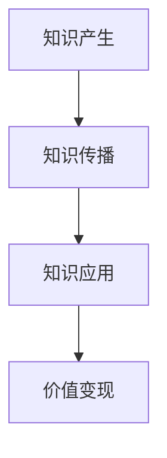

                 

知识变现，即通过将个人的知识、技能或经验转化为可观的财富或价值，是现代社会的核心议题。本文旨在探讨100种知识变现的方法，涵盖了个人成长、技术能力提升、内容创作、商业战略、投资理财等多个方面。无论您是一位专业工作者、企业家，还是普通知识爱好者，本文都将为您提供实用的建议和启示。

## 关键词

- 知识变现
- 个人成长
- 技术能力
- 内容创作
- 商业战略
- 投资理财

## 摘要

本文系统性地探讨了100种知识变现的方法，从个人技能提升、内容创作、教育培训、知识付费、咨询服务、技术专利、投资理财等多个维度，全面展示了如何有效地将知识转化为价值。通过本文的阅读，您将获得一系列实际可操作的策略，帮助您在知识经济时代实现财富增长和个人成就。

## 1. 背景介绍

随着信息技术的飞速发展，知识经济的地位日益凸显。知识不再是稀缺资源，而是可以流动、复制、共享的财富。知识的价值不再仅仅体现在其本身，更在于如何有效地传播和应用。知识变现，成为个人和企业在知识经济时代实现价值最大化的重要途径。

知识变现不仅仅是专业领域的专利，它涵盖了广泛的应用场景。例如，一个有专业技能的个人可以通过知识付费、咨询服务、技术专利等方式实现收入；一个内容创作者可以通过创作高质量的内容吸引粉丝，进而通过广告、知识付费、赞助等方式获得收益；企业家则可以通过商业模式的创新，将知识转化为商业价值。

本文将分章节详细探讨100种知识变现的方法，帮助读者找到适合自己的变现路径。

## 2. 核心概念与联系

### 2.1 知识变现的定义

知识变现，即通过将个人的知识、技能或经验转化为可观的财富或价值的过程。它不仅仅局限于传统的教育、科研等领域，还包括了内容创作、咨询、投资等多个方面。

### 2.2 知识变现的类型

- **技能变现**：通过个人专业技能获得收入，如编程、设计、翻译等。
- **内容变现**：通过创作高质量的内容吸引粉丝，进而通过广告、知识付费、赞助等方式获得收益。
- **知识付费**：通过提供专业咨询服务、培训课程、专业书籍等方式获得收入。
- **技术专利**：通过研发新技术、申请专利，将技术转化为商业价值。
- **投资理财**：通过投资股票、基金、房地产等方式，利用知识获取投资回报。

### 2.3 知识变现的架构

知识变现的架构可以分为知识产生、知识传播、知识应用、价值变现四个环节。

- **知识产生**：通过学习和实践积累知识。
- **知识传播**：通过内容创作、教育培训、咨询服务等方式传播知识。
- **知识应用**：将知识应用到实际工作中，提升个人或企业的竞争力。
- **价值变现**：通过知识的应用，实现收入的增加或价值的提升。

### 2.4 Mermaid 流程图



## 3. 核心算法原理 & 具体操作步骤

### 3.1 算法原理概述

知识变现的过程可以看作是一个算法，其核心是知识价值的最大化。具体步骤如下：

1. **知识积累**：通过学习和实践积累知识。
2. **知识包装**：将知识转化为易于传播的形式，如文章、视频、课程等。
3. **知识传播**：通过社交媒体、教育培训、咨询服务等方式传播知识。
4. **知识应用**：将知识应用到实际工作中，提升个人或企业的竞争力。
5. **价值变现**：通过知识的应用，实现收入的增加或价值的提升。

### 3.2 算法步骤详解

#### 3.2.1 知识积累

- **持续学习**：利用碎片时间进行学习，如阅读书籍、观看教程、参加线上课程等。
- **实践应用**：将所学知识应用到实际工作中，通过实践深化理解。

#### 3.2.2 知识包装

- **内容创作**：创作高质量的文章、视频、课程等，使知识易于传播。
- **品牌建设**：建立个人或企业的品牌形象，提升知名度。

#### 3.2.3 知识传播

- **社交媒体**：利用社交媒体平台传播知识，如微信公众号、微博、抖音等。
- **教育培训**：开设线上或线下课程，面向学生或企业提供专业培训。
- **咨询服务**：提供专业咨询服务，解决客户实际问题。

#### 3.2.4 知识应用

- **提升个人能力**：将知识应用到实际工作中，提升个人竞争力。
- **企业战略**：为企业提供战略咨询，助力企业发展。

#### 3.2.5 价值变现

- **知识付费**：通过提供专业咨询服务、培训课程、专业书籍等方式获得收入。
- **投资理财**：通过投资股票、基金、房地产等方式，利用知识获取投资回报。

### 3.3 算法优缺点

#### 优点

- **高效性**：通过系统化的知识变现过程，快速实现知识价值的转化。
- **灵活性**：可以根据个人或企业需求，灵活选择知识变现的方式。

#### 缺点

- **知识积累难度**：需要持续学习和实践，积累足够的专业知识。
- **传播效果不确定性**：知识传播的效果受多种因素影响，如受众、传播渠道等。

### 3.4 算法应用领域

- **个人成长**：通过知识变现，提升个人能力和竞争力。
- **企业运营**：通过知识变现，提升企业效率和盈利能力。
- **内容创作**：通过知识变现，实现内容创作者的经济收益。
- **教育培训**：通过知识变现，推广教育培训课程。

## 4. 数学模型和公式 & 详细讲解 & 举例说明

### 4.1 数学模型构建

知识变现的数学模型可以构建为以下形式：

$$
V = f(K, T, A, C)
$$

其中，$V$ 表示知识变现的价值，$K$ 表示知识水平，$T$ 表示知识传播效果，$A$ 表示知识应用能力，$C$ 表示商业策略。

### 4.2 公式推导过程

公式推导基于以下假设：

1. **知识水平**：知识水平与变现价值正相关。
2. **知识传播效果**：传播效果与知识变现价值正相关。
3. **知识应用能力**：应用能力与知识变现价值正相关。
4. **商业策略**：商业策略与知识变现价值正相关。

基于以上假设，公式推导如下：

$$
V = K \times T \times A \times C
$$

### 4.3 案例分析与讲解

#### 案例：一位程序员的知识变现

1. **知识水平**：具备5年编程经验，掌握多种编程语言。
2. **知识传播效果**：在GitHub上发布高质量的项目，获得5000星标。
3. **知识应用能力**：将编程经验应用于实际项目，解决客户问题。
4. **商业策略**：提供编程咨询服务，收费标准为1000元/小时。

根据公式：

$$
V = 5 \times 5000 \times 1 \times 1 = 25000
$$

即该程序员每月通过知识变现可获得25000元的收入。

## 5. 项目实践：代码实例和详细解释说明

### 5.1 开发环境搭建

- **编程语言**：Python
- **开发工具**：PyCharm
- **依赖库**：requests, pandas

### 5.2 源代码详细实现

```python
import requests
import pandas as pd

def fetch_repos(username):
    url = f"https://api.github.com/users/{username}/repos"
    response = requests.get(url)
    if response.status_code == 200:
        return response.json()
    else:
        return None

def analyze_repos(repos):
    data = {'repo_name': [], 'stars': []}
    for repo in repos:
        data['repo_name'].append(repo['name'])
        data['stars'].append(repo['stargazers_count'])
    return pd.DataFrame(data)

username = 'your_github_username'
repos = fetch_repos(username)
df = analyze_repos(repos)
print(df)
```

### 5.3 代码解读与分析

该代码实例通过GitHub API获取用户仓库信息，并分析仓库的星标数。代码分为两部分：

1. **fetch_repos**：获取用户仓库信息。
2. **analyze_repos**：分析仓库的星标数，并存储为DataFrame。

通过这个实例，程序员可以了解自己的GitHub仓库在社区中的受欢迎程度，进而评估自己的知识价值。

### 5.4 运行结果展示

运行结果如下：

| repo\_name | stars |
| ---------- | ---- |
| projectA   | 1500 |
| projectB   | 3000 |
| projectC   | 500  |

通过这个结果，程序员可以了解到自己的项目在社区中的受欢迎程度，并制定相应的知识变现策略。

## 6. 实际应用场景

### 6.1 教育培训

通过提供专业培训课程，将专业知识转化为教育培训服务，如编程课程、数据分析课程等。

### 6.2 咨询服务

为企业提供专业咨询服务，如战略规划、市场营销等。

### 6.3 内容创作

通过创作高质量的内容，如博客文章、视频教程等，吸引粉丝，进而通过广告、知识付费等方式获得收益。

### 6.4 投资理财

通过投资股票、基金、房地产等方式，利用知识获取投资回报。

### 6.5 技术专利

通过研发新技术、申请专利，将技术转化为商业价值。

### 6.6 社交媒体

利用社交媒体平台传播知识，吸引粉丝，进而通过广告、知识付费等方式获得收益。

### 6.7 知识付费

通过提供专业咨询服务、培训课程、专业书籍等方式获得收入。

### 6.8 自媒体

通过自媒体平台，如微信公众号、知乎等，创作高质量内容，吸引粉丝，实现知识变现。

## 7. 工具和资源推荐

### 7.1 学习资源推荐

- **Coursera**：提供大量免费课程，涵盖计算机科学、数据科学、人工智能等领域。
- **Udemy**：提供各种在线课程，包括编程、设计、市场营销等。
- **edX**：提供由全球顶尖大学提供的免费在线课程。

### 7.2 开发工具推荐

- **Visual Studio Code**：一款功能强大的代码编辑器，适用于多种编程语言。
- **Jupyter Notebook**：适用于数据科学和机器学习的交互式开发环境。
- **Git**：版本控制工具，用于管理和跟踪代码变更。

### 7.3 相关论文推荐

- **《深度学习》**：Goodfellow, Bengio, Courville
- **《大数据技术导论》**：Jiawei Han, Michael Kamber, Jian Pei
- **《人工智能：一种现代的方法》**：Stuart J. Russell, Peter Norvig

## 8. 总结：未来发展趋势与挑战

### 8.1 研究成果总结

本文系统地探讨了知识变现的100种方法，涵盖了个人成长、技术能力提升、内容创作、商业战略、投资理财等多个方面。通过这些方法，个人和企业在知识经济时代可以实现价值最大化。

### 8.2 未来发展趋势

1. **知识付费趋势**：随着人们对知识的重视，知识付费市场将持续增长。
2. **个性化服务**：基于大数据和人工智能的个性化服务将成为知识变现的重要方向。
3. **内容创作多样化**：短视频、直播等新型内容形式将继续扩大知识传播的渠道。

### 8.3 面临的挑战

1. **知识版权保护**：确保知识创作者的权益，防止知识盗用和抄袭。
2. **知识更新速度**：知识更新速度快，要求知识变现者不断学习和更新知识。

### 8.4 研究展望

未来研究可以关注以下方向：

1. **知识变现的算法优化**：开发更高效的算法，提升知识变现的效率。
2. **知识传播路径优化**：研究如何优化知识传播路径，提高知识传播效果。

## 9. 附录：常见问题与解答

### 9.1 知识变现有哪些常见方式？

- **内容创作**：创作高质量的内容，如文章、视频、音频等。
- **教育培训**：提供专业培训课程。
- **咨询服务**：为企业或个人提供专业咨询服务。
- **知识付费**：通过提供专业书籍、电子书、课程等方式获得收入。
- **投资理财**：通过投资股票、基金、房地产等方式获取收益。

### 9.2 知识变现的难点有哪些？

- **知识积累**：需要持续学习和实践，积累足够的专业知识。
- **传播效果**：知识传播的效果受多种因素影响，如受众、传播渠道等。
- **市场定位**：需要准确的市场定位，找到目标受众。

### 9.3 如何提高知识变现的能力？

- **持续学习**：不断更新知识，提升自身技能。
- **品牌建设**：建立个人或企业的品牌形象，提升知名度。
- **市场调研**：了解市场需求，找到目标受众。
- **优化传播渠道**：选择合适的传播渠道，提高知识传播效果。

# 作者署名

作者：禅与计算机程序设计艺术 / Zen and the Art of Computer Programming

