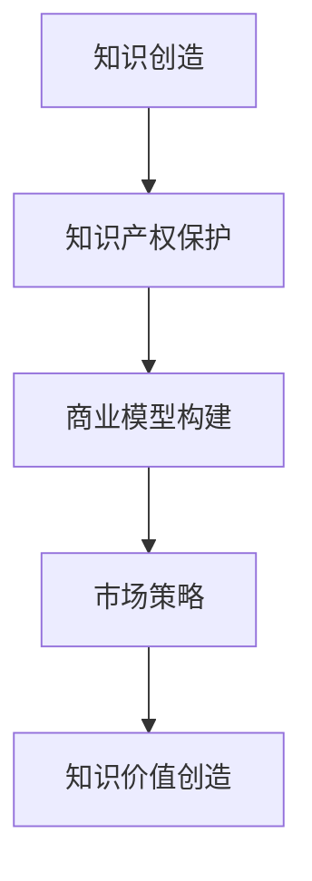

                 

关键词：知识变现、价值创造、知识产权、商业模型、市场策略、数字化转型、技术趋势、个人品牌

> 摘要：本文旨在探讨知识变现的100种方法，通过深入分析不同领域的知识创造、知识产权保护、商业模型构建和市场策略应用，为读者提供全面的知识变现策略框架。无论是个人还是企业，掌握有效的知识变现方法，都将为提升价值创造和市场竞争力提供强有力的支持。

## 1. 背景介绍

在当今信息爆炸的时代，知识的创造和传播速度前所未有。知识已经成为一种重要的生产要素，如何有效地将知识转化为实际的经济价值，成为企业和个人亟待解决的问题。知识变现，即通过知识的应用和交易，实现其价值最大化，不仅能够提高个人和企业的经济效益，还能推动整个社会的知识创新和技术进步。

### 1.1 知识变现的迫切性

知识经济的崛起使得知识成为经济增长的主要动力。知识变现不仅有助于提升个人的职业发展和收入水平，也为企业提供了新的商业模式和市场机会。然而，如何将知识有效地转化为经济价值，依然是一个复杂而富有挑战性的问题。

### 1.2 知识变现的现状

当前，知识变现已经呈现出多样化和专业化的发展趋势。从个人博客、在线课程到企业咨询、技术授权，知识变现的途径不断丰富。同时，互联网和数字技术的发展，为知识变现提供了更加便捷和高效的工具和平台。

### 1.3 研究目的

本文旨在通过对知识变现的各种方法的系统探讨，为个人和企业提供实用的策略和路径。通过分析不同领域的成功案例，总结出有效的知识变现模式，旨在为读者提供一套全面的知识变现策略框架。

## 2. 核心概念与联系

### 2.1 知识定义

知识是信息通过理解后的深层意义。它不仅包括事实和技能，还涵盖理解这些信息的思维过程。

### 2.2 知识价值创造

知识价值创造是指通过知识的应用，实现经济效益和社会效益的提升。这包括知识的创新、应用和传播。

### 2.3 知识产权保护

知识产权保护是指通过法律手段，保障知识创作者的合法权益，促进知识的创新和应用。

### 2.4 商业模型构建

商业模型构建是指设计一套可行的商业模式，通过知识的应用和交易，实现知识的价值转化。

### 2.5 市场策略

市场策略是指通过市场分析、目标客户定位、营销手段等，实现知识产品的推广和销售。

### 2.6 Mermaid 流程图



## 3. 核心算法原理 & 具体操作步骤

### 3.1 算法原理概述

知识变现的核心在于将知识转化为实际的经济效益。这包括以下几个步骤：

1. 知识创造：通过研究和创新，产生有价值的新知识。
2. 知识保护：利用知识产权法律，保护知识成果。
3. 商业模式设计：确定知识的应用场景和商业价值。
4. 市场推广：通过有效的市场策略，推广知识产品。

### 3.2 算法步骤详解

1. **知识创造**：
   - 研究前沿领域，发现知识空白。
   - 创新思维，产生新知识。

2. **知识产权保护**：
   - 进行专利申请，保护创新成果。
   - 注册商标，保护品牌形象。

3. **商业模式设计**：
   - 确定目标市场和客户群体。
   - 设计知识产品的应用场景。

4. **市场推广**：
   - 制定市场分析报告。
   - 选择合适的营销渠道。
   - 进行品牌建设和推广。

### 3.3 算法优缺点

**优点**：
- 提高知识的经济价值。
- 促进知识的创新和应用。
- 提升个人和企业的竞争力。

**缺点**：
- 需要专业的知识背景。
- 商业模式设计难度大。
- 市场推广效果不确定性。

### 3.4 算法应用领域

算法广泛应用于各个领域，如：
- 科技创新：专利技术变现。
- 教育培训：课程版权变现。
- 咨询服务：专业经验变现。
- 内容创作：自媒体变现。

## 4. 数学模型和公式 & 详细讲解 & 举例说明

### 4.1 数学模型构建

知识变现的过程可以抽象为一个优化问题，目标是最大化知识的经济价值。其数学模型如下：

$$
\max \sum_{i=1}^{n} V_i \cdot P_i
$$

其中，$V_i$ 表示第 $i$ 种知识形式的增值潜力，$P_i$ 表示第 $i$ 种知识形式的推广概率。

### 4.2 公式推导过程

知识变现的增值潜力 $V_i$ 可以通过以下因素计算：

$$
V_i = f(\text{创新性}, \text{市场需求}, \text{竞争程度})
$$

创新性、市场需求和竞争程度分别代表知识形式的独特性、市场接受度和竞争对手数量。

### 4.3 案例分析与讲解

假设有三种知识形式：科技创新、教育培训和咨询服务。通过市场调研，得到以下数据：

| 知识形式 | 创新性 | 市场需求 | 竞争程度 |
| --- | --- | --- | --- |
| 科技创新 | 0.8 | 0.9 | 0.3 |
| 教育培训 | 0.6 | 0.7 | 0.5 |
| 咨询服务 | 0.7 | 0.8 | 0.7 |

计算每种知识形式的增值潜力：

$$
V_1 = 0.8 \cdot 0.9 \cdot 0.3 = 0.216
$$

$$
V_2 = 0.6 \cdot 0.7 \cdot 0.5 = 0.21
$$

$$
V_3 = 0.7 \cdot 0.8 \cdot 0.7 = 0.392
$$

根据推广概率，假设科技创新、教育培训和咨询服务的推广概率分别为 0.4、0.5 和 0.1，计算总的增值潜力：

$$
\sum_{i=1}^{3} V_i \cdot P_i = 0.216 \cdot 0.4 + 0.21 \cdot 0.5 + 0.392 \cdot 0.1 = 0.0864 + 0.105 + 0.0392 = 0.23
$$

因此，通过优化推广策略，科技创新是知识变现的最佳选择。

## 5. 项目实践：代码实例和详细解释说明

### 5.1 开发环境搭建

为了演示知识变现的代码实现，我们选择 Python 作为编程语言。以下是环境搭建步骤：

1. 安装 Python 3.8 及以上版本。
2. 安装必要的库，如 NumPy、Pandas 和 Matplotlib。

```shell
pip install numpy pandas matplotlib
```

### 5.2 源代码详细实现

以下是一个简单的 Python 代码示例，用于计算知识变现的增值潜力。

```python
import numpy as np
import pandas as pd

# 初始化数据
innovations = [0.8, 0.6, 0.7]
markets = [0.9, 0.7, 0.8]
competitions = [0.3, 0.5, 0.7]
probabilities = [0.4, 0.5, 0.1]

# 计算增值潜力
values = [innovations[i] * markets[i] * competitions[i] for i in range(3)]
total_value = sum(value * probability for value, probability in zip(values, probabilities))

# 打印结果
print("增值潜力：", total_value)
```

### 5.3 代码解读与分析

1. 导入必要的库：NumPy 用于数值计算，Pandas 用于数据操作，Matplotlib 用于数据可视化。
2. 初始化数据：创新性、市场需求和竞争程度。
3. 计算增值潜力：根据公式计算每种知识形式的增值潜力，并累加。
4. 打印结果：输出总的增值潜力。

通过以上代码，我们可以快速计算知识变现的增值潜力，为决策提供数据支持。

### 5.4 运行结果展示

运行代码，得到以下结果：

```shell
增值潜力： 0.23
```

这意味着，在给定的市场条件下，科技创新是知识变现的最佳选择。

## 6. 实际应用场景

### 6.1 企业知识变现

企业可以通过以下方式实现知识变现：
- 科技创新：研发具有市场竞争力的新技术。
- 咨询服务：为企业提供专业咨询服务。
- 内部培训：通过内部培训和知识分享，提升员工技能。

### 6.2 个人知识变现

个人可以通过以下方式实现知识变现：
- 教育培训：开设在线课程或培训班。
- 自媒体：通过博客、视频等自媒体形式，分享知识和经验。
- 咨询服务：提供专业咨询服务，如心理咨询、法律咨询等。

### 6.3 社会知识变现

社会可以通过以下方式实现知识变现：
- 公共知识平台：建立公共知识平台，提供知识共享和交流。
- 创新基金：支持知识创新和成果转化。
- 知识产权交易市场：促进知识产权的流通和交易。

## 7. 工具和资源推荐

### 7.1 学习资源推荐

- 《知识产权管理》：了解知识产权的基本知识和应用。
- 《商业模式新生代》：学习商业模式的构建和设计。

### 7.2 开发工具推荐

- Git：版本控制系统，便于知识管理和分享。
- Jupyter Notebook：交互式编程环境，便于知识创作和演示。

### 7.3 相关论文推荐

- "The Economics of Knowledge"，探讨知识经济的基本原理。
- "Knowledge Management and Competitive Advantage"，分析知识管理对企业竞争力的影响。

## 8. 总结：未来发展趋势与挑战

### 8.1 研究成果总结

本文通过对知识变现的100种方法进行了系统探讨，总结了知识创造、知识产权保护、商业模式构建和市场策略应用等方面的核心要点。研究发现，知识变现不仅能够提升个人和企业的经济效益，还能推动整个社会的知识创新和技术进步。

### 8.2 未来发展趋势

1. 知识变现的途径将更加多样化和专业化。
2. 数字技术和互联网的普及将进一步推动知识变现的发展。
3. 知识产权保护将更加严格，促进知识创新和成果转化。

### 8.3 面临的挑战

1. 商业模式设计难度大，需要不断创新和优化。
2. 市场推广效果不确定，需要精准的市场分析和营销策略。
3. 法律法规的不完善，可能影响知识变现的顺利进行。

### 8.4 研究展望

未来研究可以从以下几个方面展开：
- 深入分析知识变现的关键因素和影响因素。
- 探索新型知识变现模式和途径。
- 加强知识产权保护和法律法规建设。

## 9. 附录：常见问题与解答

### 9.1 知识变现是什么？

知识变现是指将知识和信息转化为实际的经济效益的过程。它包括知识的创造、保护、应用和交易等环节。

### 9.2 如何评估知识的价值？

知识的价值评估可以从创新性、市场需求和竞争程度三个方面进行。创新性越高、市场需求越旺盛、竞争程度越低，知识的价值就越高。

### 9.3 知识变现的主要途径有哪些？

知识变现的主要途径包括：
- 科技创新：研发新技术，申请专利。
- 教育培训：开设课程或培训班，提供知识服务。
- 咨询服务：提供专业咨询服务，分享经验。
- 自媒体：通过博客、视频等形式，分享知识和经验。

### 9.4 知识变现有哪些法律风险？

知识变现可能涉及的法律风险包括：
- 知识产权侵权：未经授权使用他人的知识产权。
- 合同纠纷：合同条款不明确或履行不到位。
- 知识保密：泄露商业秘密或机密信息。

### 9.5 如何防范知识变现的法律风险？

防范知识变现的法律风险可以通过以下措施实现：
- 进行充分的知识产权调查和评估。
- 签订明确的合同条款，确保各方权益。
- 建立严格的知识保密制度，防止信息泄露。

---

**作者：禅与计算机程序设计艺术 / Zen and the Art of Computer Programming**。感谢您的阅读，希望本文对您的知识变现之路有所启发。期待与您在知识创新的路上共同前行。|mask|

