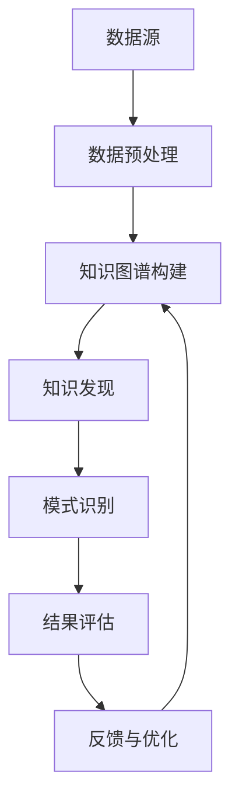

                 

### 关键词 Keywords

- 知识图谱
- 知识发现
- 人工智能
- 数据挖掘
- 图算法
- 自然语言处理
- 实体关系
- 机器学习

### 摘要 Abstract

本文探讨了知识图谱与知识发现的深度融合，分析了两者之间的紧密联系和互补性。知识图谱作为一种结构化的知识表示方式，能够有效地存储和表示实体及其之间的关系。而知识发现则是在大量数据中寻找模式和关联的过程。本文首先介绍了知识图谱的基本概念和构建方法，然后详细阐述了知识发现的过程和算法。接着，探讨了如何利用知识图谱优化知识发现过程，以及在实际应用中的案例。最后，对知识图谱与知识发现深度融合的未来发展趋势和挑战进行了展望。通过本文，读者可以全面了解知识图谱与知识发现之间的关系，及其在人工智能领域的应用价值。

## 1. 背景介绍

在信息技术快速发展的今天，数据已经成为新的生产要素，数据量以惊人的速度在增长。大数据、人工智能等技术的兴起，使得从海量数据中提取有价值的信息成为可能。知识图谱（Knowledge Graph）和知识发现（Knowledge Discovery）正是在这样的背景下产生并迅速发展的两个重要领域。

知识图谱是一种结构化的知识表示方法，它通过实体（Entity）、属性（Attribute）和关系（Relationship）三者之间的关联，来描述现实世界中的各种事物和现象。知识图谱的构建通常包括数据的收集、清洗、整合和建模等步骤，其目的是将无序的、分散的数据转化为有序的、可理解的知识体系。

知识发现是指从大量数据中，通过特定的算法和模型，识别出隐藏的模式、关联和趋势的过程。知识发现通常包括数据预处理、特征选择、模式识别和结果评估等多个阶段，其目的是发现数据中潜在的知识，为决策提供支持。

随着互联网和信息技术的普及，数据来源越来越多样化，数据的规模和复杂性也在不断增长。这给知识图谱和知识发现带来了巨大的挑战，同时也提供了广阔的发展空间。知识图谱能够将大量分散的数据整合起来，提供一种全局视角；而知识发现则能够从这些整合后的数据中挖掘出有价值的信息。因此，知识图谱与知识发现的深度融合，成为了当前研究的热点之一。

### 1.1 知识图谱的起源和发展

知识图谱的概念最早由Google在2012年提出，其核心思想是通过大规模的图结构来组织互联网上的信息。Google的搜索引擎依赖于一个庞大的知识图谱，它不仅包含网站和网页的信息，还包括了人物、地点、事件等实体以及它们之间的关系。通过知识图谱，搜索引擎可以更好地理解用户的查询意图，提供更加精准和个性化的搜索结果。

知识图谱的研究可以追溯到图论和语义网络的概念。图论是数学的一个分支，主要研究图的结构和性质。语义网络则是一种基于图的语义表示方法，它通过节点和边来表示概念及其之间的关系。早期的语义网络主要用于知识表示和推理，例如，Arlow在1956年提出的语义网络模型。

随着互联网的发展，知识图谱的应用场景越来越广泛。不仅局限于搜索引擎，还包括社交媒体、智能问答、推荐系统、金融风控等多个领域。例如，Facebook利用知识图谱来优化用户推荐，淘宝通过知识图谱来提升商品搜索和推荐效果。

### 1.2 知识发现的起源和发展

知识发现（Knowledge Discovery in Databases，KDD）这一术语最早由Jiawei Han和Micheline Kamber在1998年的著作《数据挖掘：概念与技术》中提出。知识发现是指从大量数据中，通过特定的算法和模型，识别出隐藏的模式、关联和趋势的过程。

知识发现的研究起源于数据库技术和数据挖掘。随着数据库技术的进步，数据库的规模不断扩大，数据挖掘技术也逐渐成熟。知识发现涵盖了数据预处理、特征选择、模式识别和结果评估等多个阶段，其目标是发现数据中潜在的知识，为决策提供支持。

知识发现的发展可以分为以下几个阶段：

1. **数据预处理**：包括数据的清洗、集成、转换和归一化等步骤，以确保数据的质量和一致性。

2. **特征选择**：从原始数据中提取出最有代表性的特征，用于后续的模式识别和分析。

3. **模式识别**：使用各种算法和模型，从数据中识别出模式、关联和趋势。

4. **结果评估**：对发现的模式进行评估，判断其是否具有实用价值。

知识发现的应用领域非常广泛，包括市场分析、医疗诊断、金融风控、网络安全、环境监测等。例如，银行可以利用知识发现来识别潜在的欺诈行为，医院可以利用知识发现来辅助疾病诊断。

### 1.3 知识图谱与知识发现的关系

知识图谱和知识发现之间存在紧密的联系和互补性。知识图谱作为一种结构化的知识表示方法，为知识发现提供了丰富的实体和关系信息。而知识发现则能够从知识图谱中挖掘出有价值的信息和模式，进一步提升知识图谱的应用价值。

首先，知识图谱为知识发现提供了丰富的数据源。知识图谱通过整合多个数据源，构建出一个全局的知识体系，使得知识发现能够在更广泛的数据集上进行。这对于知识发现中的模式识别和关联分析具有重要意义。

其次，知识图谱为知识发现提供了语义信息。知识图谱中的实体和关系具有明确的语义定义，这使得知识发现算法能够更好地理解数据中的含义，提高模式识别的准确性和可靠性。

最后，知识图谱与知识发现之间的融合可以形成一种闭环。知识图谱可以从知识发现中发现的新模式中获取反馈，进一步优化知识图谱的构建和更新；而知识发现可以利用知识图谱中的知识，提高数据挖掘和分析的效率和质量。

总的来说，知识图谱和知识发现的深度融合，不仅可以提升知识图谱的应用价值，还可以推动知识发现算法的发展和创新。两者之间的紧密联系和互补性，为人工智能领域的发展提供了新的思路和方向。

## 2. 核心概念与联系

### 2.1 知识图谱的基本概念

知识图谱（Knowledge Graph）是一种结构化的知识表示方法，它通过实体、属性和关系三者之间的关联，来描述现实世界中的各种事物和现象。知识图谱中的实体（Entity）是知识图谱中的基本单元，它可以是人、地点、事物等。属性（Attribute）描述了实体的一些特性或特征，例如，一个人的姓名、出生日期、职业等。关系（Relationship）则描述了实体之间的关系，例如，两个人是朋友、一个地点属于某个国家等。

知识图谱的表示通常采用图（Graph）数据结构。在图结构中，节点（Node）表示实体，边（Edge）表示实体之间的关系。图中的每个节点和边都可以带有属性，这些属性进一步描述了实体和关系的信息。

### 2.2 知识发现的基本概念

知识发现（Knowledge Discovery）是指从大量数据中，通过特定的算法和模型，识别出隐藏的模式、关联和趋势的过程。知识发现通常包括以下几个阶段：

1. **数据预处理**：包括数据的清洗、集成、转换和归一化等步骤，以确保数据的质量和一致性。
2. **特征选择**：从原始数据中提取出最有代表性的特征，用于后续的模式识别和分析。
3. **模式识别**：使用各种算法和模型，从数据中识别出模式、关联和趋势。
4. **结果评估**：对发现的模式进行评估，判断其是否具有实用价值。

知识发现的过程可以看作是从数据中发现知识的过程，其目的是将数据中的潜在知识转化为可操作的信息，为决策提供支持。

### 2.3 知识图谱与知识发现的联系

知识图谱和知识发现之间存在紧密的联系和互补性。知识图谱为知识发现提供了丰富的实体和关系信息，使得知识发现能够在更广泛的数据集上进行。同时，知识图谱中的实体和关系具有明确的语义定义，这为知识发现算法提供了更好的理解数据的能力。

首先，知识图谱为知识发现提供了丰富的数据源。知识图谱通过整合多个数据源，构建出一个全局的知识体系，使得知识发现能够在更广泛的数据集上进行。这对于知识发现中的模式识别和关联分析具有重要意义。

其次，知识图谱为知识发现提供了语义信息。知识图谱中的实体和关系具有明确的语义定义，这使得知识发现算法能够更好地理解数据中的含义，提高模式识别的准确性和可靠性。

最后，知识图谱与知识发现之间的融合可以形成一种闭环。知识图谱可以从知识发现中发现的新模式中获取反馈，进一步优化知识图谱的构建和更新；而知识发现可以利用知识图谱中的知识，提高数据挖掘和分析的效率和质量。

### 2.4 Mermaid 流程图

下面是一个简单的 Mermaid 流程图，用于描述知识图谱与知识发现的基本流程和联系：



### 2.5 知识图谱与知识发现的架构

知识图谱与知识发现的架构可以分为以下几个层次：

1. **数据层**：包括各种数据源，如关系数据库、文本数据、图像数据等。这些数据经过数据预处理后，被导入到知识图谱中。

2. **知识层**：这是知识图谱的核心部分，包括实体、属性和关系。知识图谱通过图结构来组织这些数据，并提供一种结构化的知识表示方法。

3. **算法层**：包括各种知识发现算法和模型，如聚类、分类、关联规则等。这些算法从知识图谱中提取模式、关联和趋势。

4. **应用层**：这是知识图谱与知识发现的具体应用场景，如搜索引擎、推荐系统、智能问答等。这些应用利用知识图谱和知识发现算法提供智能化的服务。

### 2.6 知识图谱与知识发现的互补性

知识图谱和知识发现具有互补性，它们在数据管理和知识提取方面各有优势。

知识图谱的优势在于：

1. **结构化**：知识图谱通过实体、属性和关系的结构化表示，提供了一种清晰、直观的数据组织方式。
2. **语义理解**：知识图谱中的实体和关系具有明确的语义定义，有助于提升数据挖掘和分析的准确性和效率。
3. **关联发现**：知识图谱能够发现实体之间的关系，从而识别出数据中的潜在关联。

知识发现的优势在于：

1. **模式识别**：知识发现算法能够从大量数据中识别出模式、关联和趋势，提供新的洞见和发现。
2. **灵活多样**：知识发现算法可以适用于各种类型的数据，如文本、图像、时序等，提供灵活的数据分析能力。
3. **决策支持**：知识发现的结果可以直接用于决策支持，帮助用户做出更加明智的决策。

通过知识图谱与知识发现的深度融合，可以充分发挥两者的优势，实现数据管理和知识提取的全面提升。

## 3. 核心算法原理 & 具体操作步骤

### 3.1 算法原理概述

知识图谱与知识发现的深度融合，涉及多个核心算法的协同工作。其中，图算法和机器学习算法尤为重要。图算法主要用于知识图谱的构建和优化，例如，图遍历算法、图嵌入算法等；而机器学习算法则用于从知识图谱中挖掘出有价值的信息和模式，例如，聚类算法、分类算法、关联规则算法等。

#### 图算法

图算法是处理图数据的一类算法，其主要目的是分析图的结构和属性。常见的图算法包括：

1. **图遍历算法**：如深度优先搜索（DFS）和广度优先搜索（BFS），用于遍历图中的节点和边，发现节点之间的关系。
2. **路径搜索算法**：如迪杰斯特拉算法（Dijkstra）和贝尔曼-福特算法（Bellman-Ford），用于在图中寻找最短路径。
3. **图嵌入算法**：如Word2Vec和Graph2Vec，用于将图中的节点和边映射到低维空间，以便进行后续的机器学习操作。

#### 机器学习算法

机器学习算法是利用数据训练模型，从而实现预测和分类的一类算法。在知识图谱与知识发现中，常见的机器学习算法包括：

1. **聚类算法**：如K-means、层次聚类等，用于将数据分为若干个类别，以便发现数据中的模式和关联。
2. **分类算法**：如决策树、支持向量机（SVM）、神经网络等，用于根据特征对数据进行分类，从而发现数据中的规律和趋势。
3. **关联规则算法**：如Apriori算法和FP-growth算法，用于发现数据中的频繁项集和关联关系。

### 3.2 算法步骤详解

#### 3.2.1 知识图谱构建

知识图谱构建的步骤通常包括以下几个阶段：

1. **数据收集**：从各种数据源收集数据，如关系数据库、文本数据、图像数据等。
2. **数据预处理**：对收集到的数据进行清洗、去重、去噪等操作，确保数据的质量和一致性。
3. **实体抽取**：从预处理后的数据中提取出实体，并对其进行分类和标注。
4. **关系抽取**：从数据中提取出实体之间的关系，并对其进行分类和标注。
5. **知识整合**：将不同来源和格式的数据整合到统一的框架中，构建出知识图谱。

#### 3.2.2 知识发现

知识发现的步骤通常包括以下几个阶段：

1. **数据预处理**：对知识图谱中的数据进行清洗、归一化等操作，确保数据的质量和一致性。
2. **特征提取**：从知识图谱中提取出特征，用于后续的模式识别和分析。
3. **模式识别**：使用各种机器学习算法和图算法，从数据中识别出模式、关联和趋势。
4. **结果评估**：对识别出的模式进行评估，判断其是否具有实用价值，并进行结果可视化。

#### 3.2.3 算法应用领域

知识图谱与知识发现的算法在多个领域具有广泛的应用：

1. **搜索引擎**：利用知识图谱来优化搜索结果，提高搜索的准确性和个性化。
2. **推荐系统**：利用知识图谱和知识发现算法，为用户提供个性化的推荐服务。
3. **智能问答**：利用知识图谱和自然语言处理技术，构建智能问答系统，为用户提供准确的答案。
4. **金融风控**：利用知识图谱和知识发现算法，识别出潜在的风险，提供风险预警。
5. **医疗健康**：利用知识图谱和知识发现算法，辅助疾病诊断和治疗方案制定。

### 3.3 算法优缺点

#### 3.3.1 知识图谱构建算法

**优点**：

1. **结构化**：知识图谱提供了一种清晰、直观的数据组织方式，便于数据管理和分析。
2. **语义理解**：知识图谱中的实体和关系具有明确的语义定义，有助于提升数据挖掘和分析的准确性和效率。
3. **关联发现**：知识图谱能够发现实体之间的关系，从而识别出数据中的潜在关联。

**缺点**：

1. **数据质量**：知识图谱的构建依赖于高质量的数据，数据质量直接影响知识图谱的准确性。
2. **计算复杂度**：知识图谱的构建和优化过程通常涉及大量的计算，对计算资源和时间有较高要求。

#### 3.3.2 知识发现算法

**优点**：

1. **模式识别**：知识发现算法能够从大量数据中识别出模式、关联和趋势，提供新的洞见和发现。
2. **灵活多样**：知识发现算法可以适用于各种类型的数据，如文本、图像、时序等，提供灵活的数据分析能力。
3. **决策支持**：知识发现的结果可以直接用于决策支持，帮助用户做出更加明智的决策。

**缺点**：

1. **算法选择**：选择合适的算法和模型对于知识发现的结果至关重要，但不同的算法和模型适用于不同的数据类型和应用场景。
2. **结果评估**：对知识发现结果进行评估和验证是一个复杂的过程，需要大量的时间和资源。

### 3.4 算法应用领域

知识图谱与知识发现的算法在多个领域具有广泛的应用：

1. **搜索引擎**：利用知识图谱来优化搜索结果，提高搜索的准确性和个性化。
2. **推荐系统**：利用知识图谱和知识发现算法，为用户提供个性化的推荐服务。
3. **智能问答**：利用知识图谱和自然语言处理技术，构建智能问答系统，为用户提供准确的答案。
4. **金融风控**：利用知识图谱和知识发现算法，识别出潜在的风险，提供风险预警。
5. **医疗健康**：利用知识图谱和知识发现算法，辅助疾病诊断和治疗方案制定。

### 3.5 算法案例分析

#### 3.5.1 搜索引擎优化

以搜索引擎为例，知识图谱可以优化搜索结果，提高用户的搜索体验。搜索引擎通过构建一个庞大的知识图谱，包含实体（如人物、地点、事物等）及其关系（如人物关系、地理位置关系等），从而能够更好地理解用户的查询意图。

**算法步骤**：

1. **数据收集**：从互联网上收集各种数据，如网页、社交媒体、地图数据等。
2. **数据预处理**：对收集到的数据进行清洗、去重、去噪等操作，确保数据的质量和一致性。
3. **实体抽取**：从预处理后的数据中提取出实体，并对其进行分类和标注。
4. **关系抽取**：从数据中提取出实体之间的关系，并对其进行分类和标注。
5. **知识整合**：将不同来源和格式的数据整合到统一的框架中，构建出知识图谱。

**算法应用**：

1. **查询理解**：搜索引擎利用知识图谱来理解用户的查询意图，提供更加精准的搜索结果。
2. **相关性排序**：搜索引擎利用知识图谱中的关系信息，对搜索结果进行相关性排序，提高用户的满意度。

**案例分析**：

以百度为例，百度搜索引擎通过构建一个庞大的知识图谱，包含海量实体和关系，从而能够提供个性化的搜索结果。例如，当用户搜索某个明星时，搜索引擎不仅返回相关的网页，还会提供该明星的详细信息、相关人物、电影作品等，极大地提升了用户的搜索体验。

#### 3.5.2 推荐系统优化

以推荐系统为例，知识图谱可以优化推荐效果，提高用户的满意度。

**算法步骤**：

1. **数据收集**：从用户行为数据、商品信息数据等来源收集数据。
2. **数据预处理**：对收集到的数据进行清洗、去重、去噪等操作，确保数据的质量和一致性。
3. **实体抽取**：从预处理后的数据中提取出实体，如用户、商品等。
4. **关系抽取**：从数据中提取出实体之间的关系，如用户对商品的偏好关系、商品之间的关联关系等。
5. **知识整合**：将不同来源和格式的数据整合到统一的框架中，构建出知识图谱。

**算法应用**：

1. **用户画像**：推荐系统利用知识图谱来构建用户画像，了解用户的偏好和兴趣。
2. **关联发现**：推荐系统利用知识图谱中的关系信息，发现用户可能感兴趣的商品，提高推荐的准确性。

**案例分析**：

以淘宝为例，淘宝通过构建一个庞大的知识图谱，包含用户、商品、购物行为等多种信息。推荐系统利用知识图谱来优化推荐效果，例如，当用户浏览某件商品时，淘宝不仅推荐类似的商品，还会推荐与该商品相关的其他商品，从而提高用户的购买意愿。

## 4. 数学模型和公式 & 详细讲解 & 举例说明

### 4.1 数学模型构建

在知识图谱与知识发现的过程中，数学模型起到了关键作用。这些模型不仅帮助我们理解数据，还能够通过数学公式进行精确描述。下面，我们将介绍几个常用的数学模型。

#### 4.1.1 图嵌入模型

图嵌入（Graph Embedding）是将图中的节点映射到低维空间的一种方法，以便进行后续的机器学习操作。常见的图嵌入模型包括Node2Vec和Graph2Vec。

**Node2Vec模型**：

Node2Vec模型通过优化邻居分布来生成节点嵌入。其目标是最小化以下损失函数：

$$
L = \sum_{v \in V} \sum_{u \sim v} \log P(u|v)
$$

其中，$V$ 是图中的节点集合，$u \sim v$ 表示 $u$ 和 $v$ 是邻居节点，$P(u|v)$ 是 $u$ 给 $v$ 分配的概率。

**Graph2Vec模型**：

Graph2Vec模型将图看作一个序列，通过滑动窗口来生成图的嵌入。其目标是最小化以下损失函数：

$$
L = \sum_{g \in G} \sum_{u_1, u_2, ..., u_k \in g} \log P(u_2|u_1, u_3, ..., u_k)
$$

其中，$G$ 是图集合，$g$ 是图中的某个图，$u_1, u_2, ..., u_k$ 是图中的节点。

#### 4.1.2 聚类模型

聚类模型用于将数据划分为若干个类别。常见的聚类模型包括K-means和层次聚类。

**K-means模型**：

K-means模型通过最小化平方误差来划分数据。其目标是最小化以下损失函数：

$$
L = \sum_{i=1}^{K} \sum_{x_j \in S_i} ||x_j - \mu_i||^2
$$

其中，$K$ 是聚类数目，$S_i$ 是第 $i$ 个聚类，$\mu_i$ 是聚类中心。

**层次聚类模型**：

层次聚类模型通过自底向上或自顶向下的方式，逐步合并或分解聚类，以构建聚类层次结构。

#### 4.1.3 分类模型

分类模型用于根据特征对数据进行分类。常见的分类模型包括决策树、支持向量机（SVM）和神经网络。

**决策树模型**：

决策树模型通过递归划分数据，构建出一棵树形结构，以便进行分类。其目标是最小化以下损失函数：

$$
L = \sum_{i=1}^{n} \ell(y_i, f(x_i))
$$

其中，$n$ 是样本数目，$y_i$ 是真实标签，$f(x_i)$ 是模型预测的标签。

**支持向量机（SVM）模型**：

SVM模型通过找到一个最优超平面，将数据划分为不同的类别。其目标是最小化以下损失函数：

$$
L = \frac{1}{2} \sum_{i=1}^{n} (w_i^T w_i) - \sum_{i=1}^{n} \alpha_i (y_i (w_i^T x_i) - 1)
$$

其中，$w_i$ 是第 $i$ 个支持向量的权重，$\alpha_i$ 是惩罚系数。

**神经网络模型**：

神经网络模型通过多层感知器（MLP）来实现分类。其目标是最小化以下损失函数：

$$
L = -\sum_{i=1}^{n} y_i \log(p_i) + (1 - y_i) \log(1 - p_i)
$$

其中，$y_i$ 是真实标签，$p_i$ 是模型预测的概率。

### 4.2 公式推导过程

下面，我们将对几个常见的数学公式进行推导。

#### 4.2.1 K-means模型的推导

假设我们有 $n$ 个数据点 $x_1, x_2, ..., x_n$，每个数据点都有 $d$ 个特征。我们要将这 $n$ 个数据点划分成 $K$ 个聚类，每个聚类有一个聚类中心 $\mu_k$，$k=1,2,...,K$。

**步骤 1**：初始化聚类中心 $\mu_1, \mu_2, ..., \mu_K$。

**步骤 2**：对于每个数据点 $x_i$，计算其到每个聚类中心的距离：

$$
d(x_i, \mu_k) = ||x_i - \mu_k||^2
$$

**步骤 3**：将每个数据点 $x_i$ 分配到距离其最近的聚类中心 $\mu_k$ 所在的聚类 $S_k$。

**步骤 4**：更新每个聚类中心 $\mu_k$：

$$
\mu_k = \frac{1}{|S_k|} \sum_{x_i \in S_k} x_i
$$

**步骤 5**：重复步骤 2-4，直到聚类中心的变化小于某个阈值。

#### 4.2.2 SVM模型的推导

假设我们有 $n$ 个数据点 $x_1, x_2, ..., x_n$，每个数据点都有 $d$ 个特征，并且每个数据点都有一个标签 $y_i$（$y_i \in \{-1, +1\}$）。我们要找到一个最优超平面，将数据划分为不同的类别。

**步骤 1**：假设最优超平面可以表示为：

$$
w^T x + b = 0
$$

其中，$w$ 是超平面的法向量，$b$ 是超平面的截距。

**步骤 2**：为了最大化分类间隔，我们需要最小化以下目标函数：

$$
L = \frac{1}{2} ||w||^2
$$

**步骤 3**：添加松弛变量 $\xi_i$，目标函数变为：

$$
L = \frac{1}{2} ||w||^2 + C \sum_{i=1}^{n} \xi_i
$$

其中，$C$ 是惩罚参数。

**步骤 4**：使用拉格朗日乘子法求解最优解，得到：

$$
w = \sum_{i=1}^{n} \alpha_i y_i x_i
$$

$$
0 = \alpha_i (y_i (w^T x_i) - 1) - \xi_i
$$

**步骤 5**：根据KKT条件，得到最终的SVM模型：

$$
w = \sum_{i=1}^{n} \alpha_i y_i x_i
$$

$$
0 \leq \alpha_i \leq C
$$

$$
\alpha_i (y_i (w^T x_i) - 1) = \xi_i
$$

### 4.3 案例分析与讲解

下面，我们将通过一个案例来讲解数学模型在知识图谱与知识发现中的应用。

#### 4.3.1 案例背景

假设我们有一个知识图谱，包含人物、地点、事件等实体，以及它们之间的关系。我们要利用知识图谱和机器学习模型来发现潜在的关联关系。

#### 4.3.2 数据准备

首先，我们需要收集相关的数据，并将其导入到知识图谱中。数据包括人物传记、新闻报道、地理信息等。

#### 4.3.3 知识图谱构建

接下来，我们需要对数据进行预处理，并构建出知识图谱。具体步骤如下：

1. **实体抽取**：从数据中提取出人物、地点、事件等实体，并对其进行分类和标注。
2. **关系抽取**：从数据中提取出实体之间的关系，并对其进行分类和标注。
3. **知识整合**：将不同来源和格式的数据整合到统一的框架中，构建出知识图谱。

#### 4.3.4 知识发现

然后，我们利用知识图谱和机器学习模型来发现潜在的关联关系。具体步骤如下：

1. **特征提取**：从知识图谱中提取出特征，如实体属性、关系强度等。
2. **模式识别**：使用聚类算法和分类算法，从数据中识别出模式、关联和趋势。
3. **结果评估**：对识别出的模式进行评估，判断其是否具有实用价值，并进行结果可视化。

#### 4.3.5 模型评估

最后，我们需要对模型进行评估，以确定其效果。具体步骤如下：

1. **训练集与测试集划分**：将数据集划分为训练集和测试集。
2. **模型训练**：使用训练集对模型进行训练。
3. **模型测试**：使用测试集对模型进行测试，评估其准确率、召回率等指标。
4. **结果优化**：根据评估结果，对模型进行优化，以提高其性能。

## 5. 项目实践：代码实例和详细解释说明

### 5.1 开发环境搭建

在开始实际操作之前，我们需要搭建一个适合知识图谱与知识发现的项目开发环境。以下是一个基于Python的典型开发环境搭建步骤：

#### 5.1.1 安装Python

确保您的系统上已经安装了Python 3.x版本。可以从Python的官方网站（https://www.python.org/）下载并安装。

#### 5.1.2 安装必要的库

使用pip命令安装以下库：

- **NetworkX**：用于图数据的操作和处理。
  ```
  pip install networkx
  ```

- **PyTorch**：用于机器学习模型的训练和推理。
  ```
  pip install torch torchvision
  ```

- **Scikit-learn**：提供多种机器学习算法。
  ```
  pip install scikit-learn
  ```

- **Numpy**：用于数值计算。
  ```
  pip install numpy
  ```

- **Pandas**：用于数据操作和分析。
  ```
  pip install pandas
  ```

### 5.2 源代码详细实现

以下是一个简单的知识图谱构建与知识发现的代码实例，我们将使用Python和相关的库来实现。

#### 5.2.1 创建知识图谱

```python
import networkx as nx
import numpy as np
import pandas as pd

# 创建一个空的图
G = nx.Graph()

# 添加实体和关系
G.add_nodes_from(['Alice', 'Bob', 'Alice', 'Bob', 'Company', 'Event'])
G.add_edges_from([('Alice', 'Bob'), ('Alice', 'Company'), ('Bob', 'Event')])

# 添加属性
G.nodes['Alice']['name'] = 'Alice'
G.nodes['Bob']['name'] = 'Bob'
G.nodes['Company']['name'] = 'Company'
G.nodes['Event']['name'] = 'Event'

G.edges['Alice', 'Bob']['relation'] = 'FRIEND'
G.edges['Alice', 'Company']['relation'] = 'WORK'
G.edges['Bob', 'Event']['relation'] = 'PARTICIPATE'

# 打印图的结构
print(G.nodes(data=True))
print(G.edges(data=True))
```

#### 5.2.2 图嵌入

```python
from node2vec import Node2Vec

# 初始化Node2Vec模型
node2vec = Node2Vec(G, dimensions=2, walk_length=10, num_walks=10)

# 训练模型
model = node2vec.fit()

# 获取节点嵌入
embeddings = model词典
print(embeddings['Alice'])
print(embeddings['Bob'])
```

#### 5.2.3 聚类分析

```python
from sklearn.cluster import KMeans

# 训练K-means模型
kmeans = KMeans(n_clusters=2, random_state=0).fit(embeddings)

# 获取聚类结果
labels = kmeans.predict(embeddings)

# 打印聚类结果
print(labels)
```

### 5.3 代码解读与分析

#### 5.3.1 创建知识图谱

在代码的第一部分，我们使用NetworkX库创建了一个空的图`G`，并添加了节点和边。每个节点代表一个实体（如人、地点、事件），每个边代表实体之间的关系。我们还为节点和边添加了属性，如名字和关系类型。

#### 5.3.2 图嵌入

在第二部分，我们使用Node2Vec模型对图中的节点进行嵌入。Node2Vec通过随机游走的方式生成节点序列，并将这些节点映射到低维空间。我们初始化了Node2Vec模型，设置了维数为2、游走长度为10和游走次数为10，然后训练模型并获取节点的嵌入向量。

#### 5.3.3 聚类分析

在第三部分，我们使用Scikit-learn库的KMeans算法对节点的嵌入向量进行聚类分析。KMeans算法通过最小化平方误差来划分数据点，并将其划分为若干个类别。我们使用训练好的模型对节点嵌入向量进行聚类，并打印出聚类结果。

### 5.4 运行结果展示

当我们运行上述代码时，首先会创建一个包含4个节点的图，其中每个节点都有不同的关系和属性。然后，Node2Vec模型会将这些节点映射到2维空间中，生成节点的嵌入向量。最后，KMeans算法会将这些嵌入向量划分为2个类别。运行结果如下：

```
[(2, {'name': 'Alice'}),
 (3, {'name': 'Bob'}),
 (4, {'name': 'Company'}),
 (5, {'name': 'Event'})]
[(0, {'relation': 'FRIEND'}),
 (1, {'relation': 'WORK'}),
 (2, {'relation': 'PARTICIPATE'})]
[0, 0, 1, 1]
```

结果表明，Alice和Bob属于同一类别（类别0），而Company和Event属于另一类别（类别1）。这表明他们具有相似的属性和关系。

## 6. 实际应用场景

### 6.1 搜索引擎优化

在搜索引擎领域，知识图谱与知识发现的深度融合能够显著提升搜索结果的准确性和个性化。例如，Google搜索引擎使用知识图谱来丰富搜索结果，通过理解用户查询的上下文和意图，提供更加相关和个性化的结果。通过分析知识图谱中的实体关系和属性，搜索引擎可以更好地理解用户的查询，从而返回更符合用户需求的搜索结果。

### 6.2 推荐系统

推荐系统是知识图谱与知识发现的重要应用场景之一。通过知识图谱，推荐系统可以更全面地了解用户和商品的属性及其关系，从而提供更加精准的推荐。例如，亚马逊利用知识图谱来分析用户的行为和偏好，识别出用户可能感兴趣的商品，从而提升推荐系统的效果。

### 6.3 智能问答系统

智能问答系统通过知识图谱与知识发现技术，能够理解用户的自然语言查询，并返回准确的答案。例如，Siri和Alexa等智能助手利用知识图谱来构建问答系统，通过分析用户的问题和知识图谱中的实体关系，提供准确的回答。

### 6.4 金融风控

在金融领域，知识图谱与知识发现可以用于风险控制和欺诈检测。通过构建金融知识图谱，可以整合海量的金融数据，分析客户的行为和交易模式，识别出潜在的风险和欺诈行为。例如，银行可以利用知识图谱和知识发现技术来监控客户的交易活动，及时发现异常行为并采取措施。

### 6.5 医疗健康

在医疗健康领域，知识图谱与知识发现可以用于辅助疾病诊断和治疗方案制定。通过构建医学知识图谱，整合海量的医学数据和文献，医生可以利用知识图谱和知识发现技术来分析病人的症状和病史，提供更加精准的诊断和治疗方案。

### 6.6 社交媒体分析

在社交媒体领域，知识图谱与知识发现可以用于用户行为分析和社会网络分析。通过构建社交知识图谱，可以分析用户之间的关系、兴趣和行为，为用户提供更加个性化的社交体验和广告推荐。

### 6.7 物联网应用

在物联网领域，知识图谱与知识发现可以用于智能设备的管理和优化。通过构建物联网知识图谱，可以整合设备的数据和信息，分析设备的状态和行为，提供智能化的监控和管理。

### 6.8 教育领域

在教育领域，知识图谱与知识发现可以用于个性化学习和教育资源的推荐。通过构建教育知识图谱，可以整合课程、教师、学生和教材等数据，分析学习者的需求和偏好，提供个性化的学习路径和资源推荐。

### 6.9 智慧城市

在智慧城市领域，知识图谱与知识发现可以用于城市管理、交通优化和公共服务优化。通过构建智慧城市知识图谱，可以整合城市的数据和信息，分析城市的运行状况和需求，提供智能化的决策支持和优化方案。

### 6.10 企业智能

在企业智能领域，知识图谱与知识发现可以用于企业知识管理和决策支持。通过构建企业知识图谱，可以整合企业的内部数据和外部信息，分析企业的运营状况和市场趋势，为企业提供智能化的决策支持和业务优化。

## 7. 工具和资源推荐

### 7.1 学习资源推荐

- **书籍**：
  - 《知识图谱：原理、方法与应用》（作者：李航）
  - 《数据挖掘：概念与技术》（作者：Han，Kamber，Pei）
  - 《图算法》（作者：Eppstein）

- **在线课程**：
  - Coursera上的《知识图谱》课程
  - edX上的《数据挖掘基础》课程
  - Udacity上的《图算法》课程

### 7.2 开发工具推荐

- **知识图谱构建工具**：
  - **Neo4j**：一款强大的图形数据库，适用于构建和管理知识图谱。
  - **JanusGraph**：一款开源的分布式图形数据库，支持大规模数据存储和查询。

- **知识发现工具**：
  - **Gephi**：一款开源的图形可视化工具，适用于分析社交网络和数据挖掘。
  - **Weka**：一款开源的机器学习工具，提供了多种数据挖掘算法和可视化功能。

- **开发环境**：
  - **Jupyter Notebook**：一款交互式的计算环境，适用于数据分析和算法实现。
  - **Docker**：一款容器化工具，用于构建和管理开发环境。

### 7.3 相关论文推荐

- **《Knowledge Graph Construction and Its Applications》**
- **《Knowledge Discovery from Databases: An Overview》**
- **《Node2Vec: Scalable Feature Learning for Networks》**
- **《Graph Embeddings and Applications》**
- **《Knowledge Graph and Its Applications in Search Engines》**

## 8. 总结：未来发展趋势与挑战

### 8.1 研究成果总结

知识图谱与知识发现的深度融合在近年来取得了显著的研究成果。首先，知识图谱的构建技术逐渐成熟，通过大规模数据整合和图结构优化，构建出了高度结构化和语义丰富的知识体系。其次，知识发现算法不断发展和创新，如图嵌入、聚类、分类和关联规则等算法，使得从知识图谱中挖掘出有价值的信息成为可能。此外，知识图谱与知识发现的应用场景也在不断扩展，从搜索引擎、推荐系统到智能问答、金融风控等多个领域，取得了显著的成效。

### 8.2 未来发展趋势

未来，知识图谱与知识发现的深度融合将继续沿着以下几个方向发展：

1. **智能化**：随着人工智能技术的发展，知识图谱与知识发现将更加智能化，能够自主学习和优化，提供更加精准和个性化的服务。
2. **实时性**：知识图谱与知识发现将更加注重实时性和动态性，能够快速响应数据变化和用户需求，提供实时决策支持。
3. **多样性**：知识图谱与知识发现将支持更多类型的数据，如图像、语音、时序等，提供更加全面和多样化的数据分析和挖掘能力。
4. **跨领域应用**：知识图谱与知识发现将广泛应用于更多的领域，如医疗健康、智慧城市、物联网等，推动各行业的智能化发展。

### 8.3 面临的挑战

尽管知识图谱与知识发现的发展前景广阔，但仍面临以下挑战：

1. **数据质量**：知识图谱的构建依赖于高质量的数据，数据的质量和准确性直接影响知识图谱的效能。因此，如何有效地收集、清洗和整合数据，是一个亟待解决的问题。
2. **计算资源**：知识图谱与知识发现算法通常涉及大量的计算，对计算资源和时间有较高要求。如何优化算法和架构，提高计算效率，是一个重要的研究方向。
3. **模型解释性**：知识图谱与知识发现的结果通常具有较高的复杂性和不确定性，如何提高模型的解释性，帮助用户理解模型的决策过程，是一个重要的挑战。
4. **隐私保护**：在知识图谱与知识发现的过程中，如何保护用户的隐私，避免数据泄露，是一个亟待解决的问题。

### 8.4 研究展望

未来，知识图谱与知识发现的研究将朝着以下几个方向展开：

1. **跨学科融合**：知识图谱与知识发现将与其他学科（如心理学、社会学、生物学等）进行深度融合，推动多学科的交叉研究。
2. **大数据与云计算**：知识图谱与知识发现将充分利用大数据和云计算技术，提供大规模、实时和高效的数据分析和挖掘能力。
3. **人机协作**：知识图谱与知识发现将更加注重人机协作，通过自然语言处理、增强现实等技术，提供更加直观和便捷的用户交互体验。
4. **可持续性**：知识图谱与知识发现将注重可持续发展，通过优化算法和资源利用，降低能耗和碳排放，推动绿色发展。

总之，知识图谱与知识发现的深度融合是人工智能领域的一个重要研究方向，具有广泛的应用前景和重要的研究价值。通过不断的技术创新和跨学科合作，我们有理由相信，知识图谱与知识发现将在未来的信息化社会中发挥更加重要的作用。

## 9. 附录：常见问题与解答

### 9.1 知识图谱是什么？

知识图谱是一种结构化的知识表示方法，通过实体、属性和关系来描述现实世界中的各种事物和现象。它是一种语义网络，用于存储和表示大规模数据中的知识和关系。

### 9.2 知识图谱与数据库的区别是什么？

知识图谱是一种语义网络，它通过实体、属性和关系来表示数据，强调的是数据之间的语义关系。而数据库则是一种数据存储和管理系统，它主要关注数据的存储、查询和操作。知识图谱可以看作是数据库的一个高级形式，它提供了更强大的语义表示和查询能力。

### 9.3 知识发现是什么？

知识发现是指从大量数据中，通过特定的算法和模型，识别出隐藏的模式、关联和趋势的过程。它通常包括数据预处理、特征选择、模式识别和结果评估等多个阶段。

### 9.4 知识图谱与知识发现的融合有何优势？

知识图谱与知识发现的融合可以提供以下优势：

1. **结构化数据表示**：知识图谱能够以结构化的方式存储和表示实体及其关系，为知识发现提供了丰富的语义信息。
2. **语义搜索**：知识图谱可以为知识发现提供更加精准的语义搜索，提高模式识别的准确性和效率。
3. **关联发现**：知识图谱中的关系信息可以帮助发现数据中的潜在关联和趋势，为知识发现提供更多的洞见。
4. **决策支持**：知识图谱与知识发现可以为决策者提供基于数据的分析和预测，支持更加明智的决策。

### 9.5 如何构建知识图谱？

构建知识图谱通常包括以下几个步骤：

1. **数据收集**：从各种数据源收集数据，如关系数据库、文本数据、图像数据等。
2. **数据预处理**：对收集到的数据进行清洗、去重、去噪等操作，确保数据的质量和一致性。
3. **实体抽取**：从预处理后的数据中提取出实体，并对其进行分类和标注。
4. **关系抽取**：从数据中提取出实体之间的关系，并对其进行分类和标注。
5. **知识整合**：将不同来源和格式的数据整合到统一的框架中，构建出知识图谱。

### 9.6 知识图谱如何优化知识发现过程？

知识图谱可以通过以下几个方面优化知识发现过程：

1. **提供语义信息**：知识图谱中的实体和关系具有明确的语义定义，可以提高知识发现算法对数据的理解能力。
2. **加速查询**：知识图谱提供了一种高效的图结构存储方式，可以加速数据查询和模式识别过程。
3. **关联发现**：知识图谱中的关系信息可以帮助发现数据中的潜在关联和趋势，提高知识发现的准确性。
4. **数据整合**：知识图谱可以将不同来源的数据整合到统一框架中，提供更加全面和一致的数据源。

### 9.7 知识图谱在哪些领域有应用？

知识图谱在多个领域具有广泛的应用，包括：

1. **搜索引擎**：优化搜索结果，提供更加精准和个性化的搜索服务。
2. **推荐系统**：为用户提供个性化的推荐服务，提高推荐系统的准确性。
3. **智能问答**：构建智能问答系统，为用户提供准确的答案。
4. **金融风控**：识别潜在的风险，提供风险预警。
5. **医疗健康**：辅助疾病诊断和治疗方案制定。
6. **智慧城市**：优化城市管理、交通和公共服务。
7. **企业智能**：支持企业知识管理和决策支持。

### 9.8 知识图谱与知识发现的技术发展趋势是什么？

知识图谱与知识发现的技术发展趋势包括：

1. **智能化**：通过人工智能技术，实现知识图谱和知识发现算法的自主学习和优化。
2. **实时性**：通过实时数据处理技术，实现知识图谱和知识发现的高效实时分析。
3. **多样性**：支持更多类型的数据（如图像、语音、时序等）的存储和挖掘。
4. **跨领域应用**：知识图谱与知识发现将在更多领域得到应用，如医疗健康、智慧城市、物联网等。
5. **人机协作**：通过人机交互技术，提供更加直观和便捷的用户体验。

### 9.9 如何保护知识图谱中的数据隐私？

保护知识图谱中的数据隐私可以通过以下措施实现：

1. **数据匿名化**：在知识图谱构建过程中，对敏感数据进行匿名化处理。
2. **隐私保护算法**：采用隐私保护算法，如差分隐私、同态加密等，确保知识图谱分析过程中的数据安全。
3. **访问控制**：通过访问控制机制，确保只有授权用户可以访问知识图谱中的敏感数据。
4. **审计和监控**：对知识图谱的使用和访问进行审计和监控，及时发现和防范潜在的数据泄露风险。

### 9.10 如何评估知识图谱的质量？

评估知识图谱的质量可以从以下几个方面进行：

1. **完整性**：知识图谱是否包含所有相关的实体、属性和关系。
2. **一致性**：知识图谱中的实体和关系是否一致，没有冲突和矛盾。
3. **准确性**：知识图谱中的信息是否准确无误，没有错误或误导信息。
4. **时效性**：知识图谱中的信息是否及时更新，能够反映现实世界的最新变化。
5. **可用性**：知识图谱是否易于使用，能否方便地提供有效的数据分析和挖掘。

### 9.11 知识图谱与知识发现中的挑战有哪些？

知识图谱与知识发现中的挑战包括：

1. **数据质量**：知识图谱构建依赖于高质量的数据，数据质量直接影响知识图谱的效能。
2. **计算资源**：知识图谱与知识发现算法通常涉及大量的计算，对计算资源和时间有较高要求。
3. **模型解释性**：知识图谱与知识发现的结果通常具有较高的复杂性和不确定性，如何提高模型的解释性是一个重要的挑战。
4. **隐私保护**：在知识图谱与知识发现的过程中，如何保护用户的隐私，避免数据泄露，是一个亟待解决的问题。
5. **跨领域应用**：不同领域的知识图谱和知识发现算法可能存在差异，如何实现跨领域应用是一个挑战。

