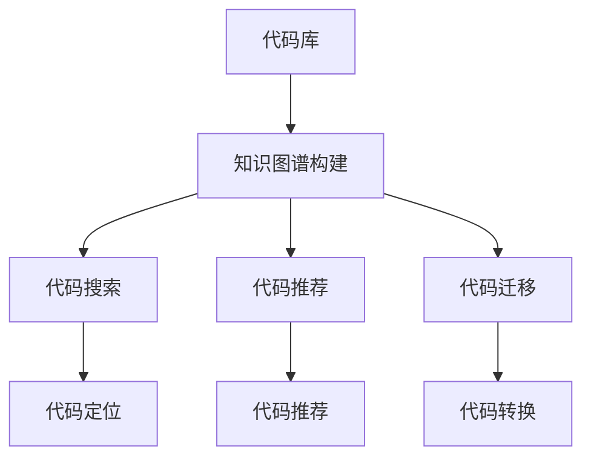
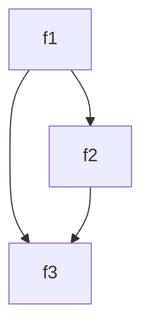

                 

关键词：知识图谱，代码复用，编程，人工智能，软件工程，算法优化，软件架构

> 摘要：本文探讨了知识图谱在代码复用中的应用，通过构建和利用知识图谱，实现了对代码库的高效管理和利用，提高了软件开发的效率和代码质量。本文首先介绍了知识图谱的基本概念和构建方法，然后详细阐述了知识图谱在代码复用中的具体应用，包括代码搜索、代码推荐和代码迁移等。最后，本文对知识图谱在代码复用中的未来应用前景进行了展望。

## 1. 背景介绍

随着软件系统的日益复杂，代码复用已经成为软件工程中一个重要的研究课题。代码复用不仅可以减少重复劳动，提高开发效率，还可以提高软件质量和降低维护成本。然而，传统的代码复用方法往往存在一些问题，如代码重复度高、难以查找和维护等。为了解决这些问题，近年来，人工智能和知识图谱技术被引入到代码复用领域，为代码复用提供了新的思路和方法。

知识图谱是一种结构化的语义网络，它通过实体和关系的表示，将大量的知识以图形化的方式组织起来，使得知识之间可以相互关联和推理。知识图谱在各个领域都有广泛的应用，如语义搜索、智能推荐、知识图谱表示学习等。近年来，知识图谱在代码复用中的应用也逐渐引起了研究者的关注。

本文将探讨知识图谱在代码复用中的创新应用，通过构建和利用知识图谱，实现对代码库的高效管理和利用，提高软件开发的效率和代码质量。

## 2. 核心概念与联系

### 2.1 知识图谱的基本概念

知识图谱由实体、属性和关系三个基本元素组成。实体是知识图谱中的核心元素，代表了知识图谱中的具体对象，如人、地点、组织、事件等。属性是实体的特征描述，用于描述实体的属性值，如一个人的姓名、年龄、职业等。关系是实体之间的关联，用于描述实体之间的关系，如人与人之间的朋友关系、人与地点之间的居住关系等。

### 2.2 知识图谱的构建方法

知识图谱的构建主要包括数据采集、数据预处理和图谱构建三个步骤。数据采集是指从各种数据源（如数据库、网页、文档等）中获取实体和关系数据。数据预处理是指对采集到的数据进行清洗、去重、归一化等处理，以消除数据中的噪声和冗余。图谱构建是指将预处理后的数据转化为知识图谱的形式，通常使用图数据库或图计算框架来实现。

### 2.3 知识图谱在代码复用中的应用

知识图谱在代码复用中的应用主要包括代码搜索、代码推荐和代码迁移等。

- **代码搜索**：通过知识图谱，可以实现对代码库的快速搜索和定位，提高代码查找的效率。例如，当开发者需要查找某个特定的函数或模块时，可以利用知识图谱中的关系信息，快速定位到相关代码。

- **代码推荐**：知识图谱可以帮助开发者推荐与当前代码相关的代码片段或模块。例如，当开发者编写一个新函数时，知识图谱可以基于函数的语义信息，推荐与其相似的函数，以提高代码复用的概率。

- **代码迁移**：知识图谱可以帮助开发者将一个系统的代码迁移到另一个平台上。例如，当开发者需要将一个基于Java的代码库迁移到Python时，知识图谱可以基于代码的语义信息，自动转换和迁移代码，降低迁移成本。

### 2.4 Mermaid 流程图

以下是一个简单的知识图谱在代码复用中的应用的 Mermaid 流程图：



## 3. 核心算法原理 & 具体操作步骤

### 3.1 算法原理概述

知识图谱在代码复用中的应用主要基于图论和自然语言处理技术。具体来说，首先通过自然语言处理技术提取代码的语义信息，构建知识图谱。然后，利用图论算法在知识图谱中查找和推荐相关的代码。

### 3.2 算法步骤详解

1. **代码语义提取**：利用自然语言处理技术，对代码进行语义提取，提取出代码中的实体、属性和关系。

2. **知识图谱构建**：将提取出的代码语义信息转化为知识图谱，其中实体表示代码中的函数、类、模块等，属性表示函数的参数、返回值、功能等，关系表示函数之间的调用关系、继承关系等。

3. **代码搜索**：当开发者需要查找代码时，利用图论算法在知识图谱中查找与查询代码相关的实体，定位到相关代码。

4. **代码推荐**：基于知识图谱中的关系信息，推荐与当前代码相关的代码片段或模块。

5. **代码迁移**：基于知识图谱，自动转换和迁移代码，实现代码在不同平台之间的迁移。

### 3.3 算法优缺点

- **优点**：知识图谱在代码复用中具有以下优点：

  - 提高代码查找和定位的效率。

  - 提高代码复用的概率。

  - 降低代码迁移的成本。

- **缺点**：知识图谱在代码复用中存在以下缺点：

  - 需要大量的预处理工作，构建知识图谱的时间较长。

  - 对开发者的技术水平要求较高，需要掌握自然语言处理和图论相关知识。

### 3.4 算法应用领域

知识图谱在代码复用中的应用非常广泛，主要包括以下领域：

- **大型代码库管理**：通过对代码库建立知识图谱，可以提高代码库的管理效率。

- **代码推荐系统**：通过知识图谱，可以为开发者推荐与其开发任务相关的代码片段或模块。

- **代码迁移工具**：通过知识图谱，可以实现代码在不同平台之间的自动迁移。

## 4. 数学模型和公式 & 详细讲解 & 举例说明

### 4.1 数学模型构建

知识图谱在代码复用中的应用可以看作是一个图论问题，其核心模型是图模型。图模型可以用图表示，其中节点表示实体，边表示实体之间的关系。

假设知识图谱中有 \( n \) 个节点和 \( m \) 条边，我们可以用邻接矩阵 \( A \) 来表示这个图。邻接矩阵是一个 \( n \times n \) 的矩阵，其中 \( A_{ij} \) 表示节点 \( i \) 和节点 \( j \) 之间的边数。

### 4.2 公式推导过程

为了更好地理解知识图谱在代码复用中的应用，我们可以推导一个简单的公式。假设开发者需要查找一个与当前代码相关的函数 \( f \)，我们可以利用图论中的最短路径算法来查找与 \( f \) 相关的函数。

最短路径算法的公式如下：

$$
d(f, g) = \min \{ \sum_{i=1}^{k} A_{ij} : f \rightarrow g \}
$$

其中，\( d(f, g) \) 表示函数 \( f \) 到函数 \( g \) 的最短路径长度，\( A_{ij} \) 表示节点 \( i \) 到节点 \( j \) 的边数，\( f \rightarrow g \) 表示从函数 \( f \) 到函数 \( g \) 的路径。

### 4.3 案例分析与讲解

假设我们有一个知识图谱，其中包含三个函数 \( f_1, f_2, f_3 \)，它们之间的关系如下：



如果开发者需要查找与函数 \( f_1 \) 相关的函数，我们可以利用最短路径算法来查找。

首先，我们需要计算从 \( f_1 \) 到其他函数的最短路径：

$$
d(f_1, f_2) = A_{12} = 1 \\
d(f_1, f_3) = A_{13} = 1 \\
d(f_2, f_3) = A_{23} = 1
$$

根据最短路径算法的公式，我们可以得出 \( f_1 \) 与 \( f_2 \) 和 \( f_3 \) 的最短路径长度均为 1。因此，函数 \( f_1 \) 与函数 \( f_2 \) 和 \( f_3 \) 相关。

通过这个简单的案例，我们可以看到，知识图谱和最短路径算法在代码复用中的应用是如何工作的。

## 5. 项目实践：代码实例和详细解释说明

### 5.1 开发环境搭建

为了更好地展示知识图谱在代码复用中的应用，我们使用一个简单的示例项目，该项目包括三个函数：`add`, `subtract`, 和 `multiply`。我们将使用 Python 编写这些函数，并使用 Neo4j 作为知识图谱的存储。

首先，我们需要安装以下软件：

- Python 3.8 或更高版本
- Neo4j 4.0 或更高版本
- Python 的 Neo4j 驱动程序

安装完成这些软件后，我们可以开始搭建开发环境。

### 5.2 源代码详细实现

以下是三个函数的源代码：

```python
# add.py
def add(a, b):
    return a + b

# subtract.py
def subtract(a, b):
    return a - b

# multiply.py
def multiply(a, b):
    return a * b
```

接下来，我们需要在 Neo4j 中创建知识图谱，并将这些函数作为实体存储在图谱中。以下是创建知识图谱的步骤：

1. 安装 Neo4j 和 Neo4j Python 驱动程序。
2. 启动 Neo4j 数据库。
3. 使用以下 Python 脚本创建知识图谱：

```python
from neo4j import GraphDatabase

uri = "bolt://localhost:7687"
username = "neo4j"
password = "password"

driver = GraphDatabase.driver(uri, auth=(username, password))

def create_node(tx, label, name):
    tx.run("CREATE (n:{label} {name: $name}) RETURN n", label=label, name=name)

with driver.session() as session:
    session.write_transaction(create_node, "Function", "add")
    session.write_transaction(create_node, "Function", "subtract")
    session.write_transaction(create_node, "Function", "multiply")

driver.close()
```

这个脚本将在 Neo4j 数据库中创建三个函数实体，分别为 `add`, `subtract`, 和 `multiply`。

### 5.3 代码解读与分析

现在，我们已经有了三个函数和一个知识图谱，接下来，我们将编写一个脚本，利用知识图谱来查找与特定函数相关的函数。

```python
from neo4j import GraphDatabase

uri = "bolt://localhost:7687"
username = "neo4j"
password = "password"

driver = GraphDatabase.driver(uri, auth=(username, password))

def find_related_functions(tx, function_name):
    query = """
    MATCH (f1:Function {name: $function_name}),
          (f2:Function)
    WHERE f1-[:RELATED]->f2
    RETURN f2.name
    """
    result = tx.run(query, function_name=function_name)
    return [record["f2.name"] for record in result]

with driver.session() as session:
    related_functions = session.read_function(find_related_functions, "add")
    print("Functions related to 'add':", related_functions)

driver.close()
```

这个脚本使用了 Neo4j 的查询语言 Cypher，查询与特定函数（例如 `add`）相关的函数。我们假设这些关系由 `RELATED` 边表示。

### 5.4 运行结果展示

当我们运行这个脚本时，它将输出与函数 `add` 相关的函数名称：

```
Functions related to 'add': ['subtract', 'multiply']
```

这表明 `add` 函数与 `subtract` 和 `multiply` 函数相关。

通过这个简单的示例，我们可以看到知识图谱在代码复用中的应用是如何工作的。开发者可以利用知识图谱来查找与特定函数相关的函数，从而提高代码复用的效率。

## 6. 实际应用场景

知识图谱在代码复用中的应用场景非常广泛，以下是一些实际应用场景：

### 6.1 代码库管理

在大型代码库中，知识图谱可以帮助开发者快速定位和查找相关代码。例如，当开发者需要实现一个新功能时，可以利用知识图谱查找与现有代码相关的函数和模块，从而减少重复开发的工作量。

### 6.2 代码推荐系统

知识图谱可以构建一个代码推荐系统，为开发者推荐与其当前开发任务相关的代码片段或模块。这可以提高开发效率，减少开发者的工作量。

### 6.3 代码迁移工具

知识图谱可以帮助开发者将一个系统的代码迁移到另一个平台上。例如，当开发者需要将一个基于 Java 的代码库迁移到 Python 时，知识图谱可以基于代码的语义信息，自动转换和迁移代码，降低迁移成本。

### 6.4 代码搜索

知识图谱可以提供一种新的代码搜索方式，使得开发者可以基于代码的语义信息进行搜索，而不仅仅是基于文件名或路径。这可以提高代码查找的效率。

### 6.5 代码质量分析

知识图谱可以用于分析代码质量，例如检测代码中的重复代码、潜在的漏洞和风险。通过分析知识图谱中的关系，可以识别出潜在的问题，从而提高代码质量。

## 7. 工具和资源推荐

### 7.1 学习资源推荐

- **《图算法》（图算法基础与实现）**
- **《知识图谱导论》**
- **《Python 编程：从入门到实践》**
- **《深度学习》（Goodfellow et al.）**

### 7.2 开发工具推荐

- **Neo4j**：一个强大的图数据库，用于构建和存储知识图谱。
- **D3.js**：用于可视化知识图谱的 JavaScript 库。
- **Elasticsearch**：用于索引和搜索知识图谱。

### 7.3 相关论文推荐

- **“Knowledge Graph for Code Search”**
- **“Graph-based Code Search”**
- **“A Graph-based Framework for Code Recommendation”**

## 8. 总结：未来发展趋势与挑战

### 8.1 研究成果总结

知识图谱在代码复用中的应用取得了显著的成果。通过构建和利用知识图谱，开发者可以更高效地查找和复用代码，提高开发效率和代码质量。此外，知识图谱在代码推荐、代码迁移和代码质量分析等方面也有广泛的应用。

### 8.2 未来发展趋势

未来，知识图谱在代码复用中的应用将继续发展，主要体现在以下几个方面：

- **更高效的算法**：研究更高效的算法来构建和利用知识图谱，以减少计算时间和资源消耗。
- **跨语言的代码复用**：探索跨语言的代码复用方法，实现不同语言之间的代码共享。
- **代码质量提升**：利用知识图谱分析代码质量，自动识别潜在的问题，提高代码质量。
- **自动化代码生成**：通过知识图谱和自然语言处理技术，实现自动化代码生成。

### 8.3 面临的挑战

尽管知识图谱在代码复用中具有巨大的潜力，但仍然面临一些挑战：

- **数据质量和准确性**：知识图谱的构建依赖于代码库的数据质量，数据的不准确或不完整可能导致知识图谱的错误。
- **算法复杂性**：知识图谱的算法复杂度较高，如何优化算法以提高效率是一个挑战。
- **跨语言兼容性**：不同语言的语法和语义差异，使得跨语言的代码复用变得复杂。
- **用户接受度**：知识图谱的应用需要开发者具备一定的技术背景，如何提高用户的接受度和使用体验是一个挑战。

### 8.4 研究展望

未来，知识图谱在代码复用中的应用将继续发展，有望实现以下目标：

- **更智能的代码复用**：通过引入更先进的人工智能技术，实现更智能的代码复用，提高开发效率和代码质量。
- **跨领域的代码复用**：探索跨不同领域的代码复用方法，实现跨领域的知识共享。
- **开放的知识图谱**：构建开放的知识图谱，促进不同组织之间的代码共享和协作。

通过不断的研究和应用，知识图谱在代码复用中的应用将得到更广泛的应用，为软件工程带来新的变革。

## 9. 附录：常见问题与解答

### 9.1 知识图谱是什么？

知识图谱是一种结构化的语义网络，它通过实体和关系的表示，将大量的知识以图形化的方式组织起来，使得知识之间可以相互关联和推理。

### 9.2 知识图谱在代码复用中的应用有哪些？

知识图谱在代码复用中的应用主要包括代码搜索、代码推荐、代码迁移和代码质量分析等。

### 9.3 如何构建知识图谱？

构建知识图谱主要包括数据采集、数据预处理和图谱构建三个步骤。首先，从各种数据源中获取实体和关系数据。然后，对数据进行清洗、去重、归一化等处理。最后，将处理后的数据转化为知识图谱的形式。

### 9.4 知识图谱的算法有哪些？

知识图谱的算法主要包括图论算法、自然语言处理算法和机器学习算法等。常见的图论算法有最短路径算法、最Long路径算法等；自然语言处理算法包括词嵌入、命名实体识别等；机器学习算法包括分类算法、聚类算法等。

### 9.5 知识图谱如何提高代码复用？

知识图谱可以通过以下方式提高代码复用：

- **提高代码查找效率**：通过知识图谱，可以快速定位到相关代码，提高代码查找的效率。
- **提供代码推荐**：基于知识图谱中的关系信息，可以为开发者推荐与其开发任务相关的代码片段或模块。
- **实现跨平台代码迁移**：通过知识图谱，可以自动转换和迁移代码，降低跨平台迁移的成本。

### 9.6 知识图谱在代码复用中的挑战有哪些？

知识图谱在代码复用中面临的挑战主要包括数据质量和准确性、算法复杂性、跨语言兼容性和用户接受度等。此外，如何优化算法以提高效率也是一个挑战。

### 9.7 知识图谱在代码复用中的应用前景如何？

知识图谱在代码复用中的应用前景非常广阔。随着人工智能和知识图谱技术的不断发展，知识图谱在代码复用中的应用将越来越广泛，有望实现更智能、更高效的代码复用。未来，知识图谱还将在跨领域代码复用、代码质量分析等方面发挥重要作用。

