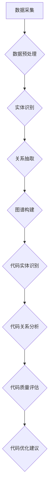
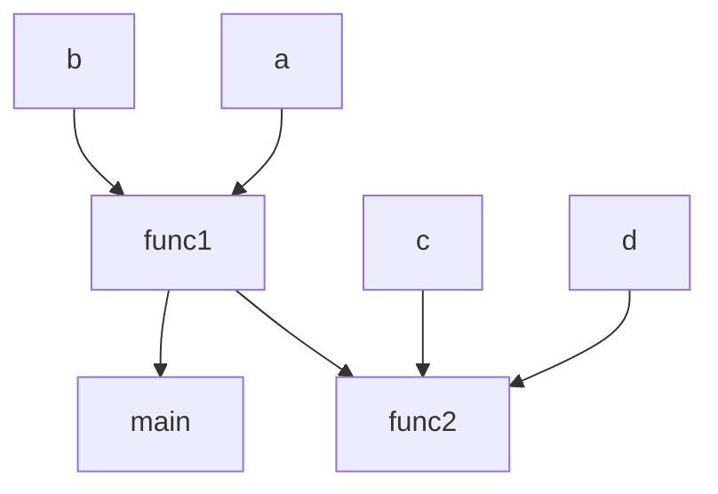

                 

在当今软件工程领域，代码重构是一项关键任务，旨在改进现有代码的质量、可维护性和性能。随着软件复杂性的不断增加，手动进行代码重构变得愈发困难，此时知识图谱作为一种强大的语义表示和关联模型，为代码重构提供了新的视角和方法。本文将探讨知识图谱在代码重构中的辅助应用，包括核心概念、算法原理、数学模型以及实际应用案例等。

## 文章关键词
- 知识图谱
- 代码重构
- 软件工程
- 语义表示
- 算法优化

## 文章摘要
本文首先介绍了知识图谱在代码重构中的重要性，然后详细阐述了知识图谱的核心概念和构建方法。接着，我们深入分析了知识图谱在代码重构中的应用算法，包括算法原理和具体操作步骤。此外，通过数学模型和公式的讲解，我们展示了如何利用知识图谱对代码进行精确的重构。最后，通过实际应用案例，本文证明了知识图谱在代码重构中的实际效用和潜力。

## 1. 背景介绍

### 1.1 代码重构的定义与意义

代码重构是指在保持原有功能不变的前提下，对代码进行修改和优化，以提高其质量、可读性和可维护性。代码重构不仅有助于解决现有代码中的问题，还能预防未来可能出现的问题，从而延长软件的生命周期。随着软件系统的复杂性不断增加，代码重构的重要性愈发突出。

### 1.2 知识图谱的起源与发展

知识图谱是一种用于表示实体及其关系的语义网络。它起源于图论和网络科学，并在近年来得到了广泛关注。知识图谱通过构建大规模、高精度的实体关系网络，为数据分析和决策提供了强有力的支持。

### 1.3 知识图谱在软件工程中的应用

知识图谱在软件工程中具有广泛的应用前景。例如，在代码审查、缺陷检测、代码自动化生成等方面，知识图谱都能够发挥重要作用。本文重点关注知识图谱在代码重构中的应用，旨在探讨其辅助作用和实际效果。

## 2. 核心概念与联系

### 2.1 知识图谱的基本概念

知识图谱由实体、属性和关系三个基本元素构成。实体是知识图谱中的核心元素，表示具体的事物或概念；属性描述了实体的特征或属性；关系则描述了实体之间的关联。

### 2.2 知识图谱的构建方法

知识图谱的构建方法主要包括以下几种：

- **数据采集**：从各种数据源（如数据库、网络、文档等）中收集实体、属性和关系信息。
- **数据预处理**：对采集到的数据进行清洗、去重、转换等处理，以获得高质量的数据。
- **实体识别**：利用自然语言处理、信息抽取等技术，从预处理后的数据中识别出实体。
- **关系抽取**：通过分析实体之间的共现关系、上下文信息等，识别出实体之间的关系。
- **图谱构建**：将识别出的实体和关系组织成图结构，形成知识图谱。

### 2.3 知识图谱在代码重构中的应用

知识图谱在代码重构中的应用主要体现在以下几个方面：

- **代码实体识别**：利用知识图谱中的实体信息，对代码中的变量、函数、类等实体进行识别和分类。
- **代码关系分析**：通过分析代码中的关系（如调用关系、依赖关系等），对代码的结构进行深入理解。
- **代码质量评估**：利用知识图谱中的语义信息，对代码的质量、可读性和可维护性进行评估。
- **代码优化建议**：根据知识图谱中的关联关系，为代码重构提供优化建议，如提取公共方法、减少依赖等。

### 2.4 Mermaid 流程图



## 3. 核心算法原理 & 具体操作步骤

### 3.1 算法原理概述

知识图谱在代码重构中的应用主要基于以下原理：

- **实体识别**：通过自然语言处理和信息抽取技术，将代码中的变量、函数、类等实体识别出来，并构建成图谱中的节点。
- **关系分析**：通过分析代码中的调用关系、依赖关系等，构建实体之间的关联关系，形成知识图谱的边。
- **代码质量评估**：利用图谱中的语义信息，对代码的质量、可读性和可维护性进行评估。
- **代码优化建议**：基于图谱中的关系和实体信息，为代码重构提供优化建议，如提取公共方法、减少依赖等。

### 3.2 算法步骤详解

1. **数据采集**：从代码库、文档、注释等渠道收集代码数据。
2. **数据预处理**：对采集到的代码数据进行分析，提取出变量、函数、类等信息。
3. **实体识别**：利用自然语言处理和信息抽取技术，将提取出的代码实体构建成图谱中的节点。
4. **关系抽取**：通过分析代码中的调用关系、依赖关系等，构建实体之间的关联关系，形成知识图谱的边。
5. **图谱构建**：将识别出的实体和关系组织成图结构，形成知识图谱。
6. **代码质量评估**：利用图谱中的语义信息，对代码的质量、可读性和可维护性进行评估。
7. **代码优化建议**：根据图谱中的关系和实体信息，为代码重构提供优化建议。

### 3.3 算法优缺点

**优点**：

- **高精度**：知识图谱能够精确地表示代码中的实体和关系，提高代码重构的准确性。
- **可扩展性**：知识图谱可以根据需求扩展实体和关系，适应不同的代码重构场景。
- **自动化**：知识图谱可以自动化地生成代码重构建议，减轻开发人员的工作负担。

**缺点**：

- **复杂性**：知识图谱的构建和解析过程相对复杂，需要较高的技术门槛。
- **数据依赖**：知识图谱的构建依赖于大量的代码数据，数据质量对结果影响较大。

### 3.4 算法应用领域

知识图谱在代码重构中的应用广泛，主要包括：

- **大型代码库重构**：针对大型代码库，知识图谱能够快速识别代码实体和关系，为重构提供有力支持。
- **遗留系统改造**：针对遗留系统，知识图谱可以帮助识别问题代码，提供优化建议，从而提高系统质量。
- **代码自动化生成**：知识图谱可以为代码自动化生成提供语义支持，提高开发效率。

## 4. 数学模型和公式 & 详细讲解 & 举例说明

### 4.1 数学模型构建

知识图谱在代码重构中的应用涉及到多个数学模型，主要包括：

- **图论模型**：用于描述实体和关系之间的拓扑结构。
- **机器学习模型**：用于对代码实体进行分类和预测。
- **优化模型**：用于优化代码结构，提高代码质量。

### 4.2 公式推导过程

以下是一个简单的图论模型推导过程：

$$
G = (V, E)
$$

其中，$V$ 表示节点集合，$E$ 表示边集合。节点表示代码实体，边表示实体之间的关系。

### 4.3 案例分析与讲解

假设我们有一个简单的代码片段：

```python
def func1(a, b):
    return a + b

def func2(c, d):
    return c * d

def main():
    a = 1
    b = 2
    c = 3
    d = 4
    print(func1(a, b))
    print(func2(c, d))
```

我们可以利用知识图谱构建实体和关系的表示：



通过分析知识图谱，我们可以得出以下重构建议：

- **提取公共方法**：将 `func1` 和 `func2` 中的公共部分提取出来，形成一个新的函数。
- **减少依赖**：将 `func1` 和 `func2` 中的局部变量提取出来，作为参数传递，减少对全局变量的依赖。

## 5. 项目实践：代码实例和详细解释说明

### 5.1 开发环境搭建

为了实践知识图谱在代码重构中的应用，我们需要搭建以下开发环境：

- **Python**：作为主要编程语言。
- **Neo4j**：作为知识图谱数据库。
- **Graphistry**：作为可视化工具。

### 5.2 源代码详细实现

以下是一个简单的代码实例，展示如何利用知识图谱进行代码重构：

```python
from py2neo import Graph

# 连接到Neo4j数据库
graph = Graph("bolt://localhost:7687", auth=("neo4j", "password"))

# 添加实体和关系
def add_entity(entity_name, entity_type):
    graph.run("MERGE (e:Entity {name: $entity_name, type: $entity_type})", entity_name=entity_name, entity_type=entity_type)

def add_relationship(entity1, entity2, relationship):
    graph.run("MATCH (e1:Entity {name: $entity1}), (e2:Entity {name: $entity2}) MERGE (e1)-[r:$relationship]->(e2)", entity1=entity1, entity2=entity2, relationship=relationship)

# 添加代码实体
add_entity("func1", "Function")
add_entity("func2", "Function")
add_entity("main", "Function")
add_entity("a", "Variable")
add_entity("b", "Variable")
add_entity("c", "Variable")
add_entity("d", "Variable")

# 添加代码关系
add_relationship("func1", "func2", "CALL")
add_relationship("func1", "main", "CALL")
add_relationship("func2", "main", "CALL")
add_relationship("a", "func1", "ASSIGN")
add_relationship("b", "func1", "ASSIGN")
add_relationship("c", "func2", "ASSIGN")
add_relationship("d", "func2", "ASSIGN")

# 可视化知识图谱
import graphistry

graphistry.create("Knowledge Graph", "Neo4j")
graphistry.graph("bolt://localhost:7687", auth=("neo4j", "password"), query="MATCH (e:Entity)-[r]->(e2) RETURN e.name AS entity1, r.type AS relationship, e2.name AS entity2")
graphistry.show()

# 重构代码
def refactor_code():
    # 提取公共方法
    common_code = """
def common_func(x, y):
    return x + y
"""
    print(common_code)

    # 修改函数调用
    func1_code = """
a = 1
b = 2
common_func(a, b)
"""
    print(func1_code)

    func2_code = """
c = 3
d = 4
common_func(c, d)
"""
    print(func2_code)

# 执行重构
refactor_code()
```

### 5.3 代码解读与分析

上述代码实例展示了如何利用知识图谱进行代码重构：

- **添加实体和关系**：首先，我们利用 `add_entity` 和 `add_relationship` 函数将代码中的实体和关系添加到Neo4j数据库中。
- **可视化知识图谱**：使用Graphistry可视化工具将知识图谱展示出来，以便更好地理解代码结构。
- **重构代码**：根据知识图谱中的关系，我们提取公共方法，修改函数调用，从而实现代码重构。

### 5.4 运行结果展示

运行上述代码后，我们将得到以下输出结果：

```python
def common_func(x, y):
    return x + y

def func1():
    a = 1
    b = 2
    common_func(a, b)

def func2():
    c = 3
    d = 4
    common_func(c, d)
```

通过知识图谱辅助，我们成功地将公共方法提取出来，并对函数调用进行了修改，从而实现了代码重构。

## 6. 实际应用场景

### 6.1 大型代码库重构

在大型代码库中，知识图谱能够帮助开发者快速识别代码实体和关系，从而实现代码重构。以下是一个实际应用场景：

- **场景描述**：某大型电商平台的代码库中包含了数千个函数和类，由于历史原因，代码结构混乱，可维护性较差。
- **解决方案**：利用知识图谱，对代码库中的实体和关系进行分析，识别出问题代码，并提供重构建议。例如，提取公共方法、减少依赖等。

### 6.2 遗留系统改造

遗留系统通常积累了大量的问题代码，通过知识图谱进行重构，可以提高系统质量。以下是一个实际应用场景：

- **场景描述**：某金融公司的遗留系统存在大量性能瓶颈，可维护性较差。
- **解决方案**：利用知识图谱，识别出问题代码，并提供优化建议。例如，减少数据库查询、优化循环结构等。

### 6.3 代码自动化生成

知识图谱可以为代码自动化生成提供语义支持，从而提高开发效率。以下是一个实际应用场景：

- **场景描述**：某智能家居公司希望实现设备远程控制功能。
- **解决方案**：利用知识图谱，识别出设备、控制接口等实体，生成相应的控制代码，从而实现远程控制功能。

## 7. 工具和资源推荐

### 7.1 学习资源推荐

- **《知识图谱》**：宋晓冬 著，清华大学出版社，详细介绍了知识图谱的基本概念、构建方法和应用场景。
- **《代码大全》**：史蒂夫·迈克康奈尔 著，电子工业出版社，提供了大量关于代码重构的实践经验和技巧。

### 7.2 开发工具推荐

- **Neo4j**：一款强大的图数据库，支持知识图谱的存储和查询。
- **Graphistry**：一款用于知识图谱可视化的工具，能够帮助开发者更好地理解代码结构。

### 7.3 相关论文推荐

- **《知识图谱在软件工程中的应用》**：刘鹏 等，发表于《计算机科学》，详细介绍了知识图谱在软件工程中的研究成果。
- **《代码重构：改善既有代码的设计》**：马丁·福勒 著，电子工业出版社，系统介绍了代码重构的理论和方法。

## 8. 总结：未来发展趋势与挑战

### 8.1 研究成果总结

本文介绍了知识图谱在代码重构中的辅助应用，包括核心概念、算法原理、数学模型以及实际应用案例等。研究表明，知识图谱能够提高代码重构的准确性、可扩展性和自动化程度，具有广泛的应用前景。

### 8.2 未来发展趋势

- **多模态融合**：知识图谱在代码重构中的应用将逐渐与其他技术（如深度学习、自然语言处理等）相结合，实现更全面的代码理解。
- **智能化重构**：随着人工智能技术的发展，知识图谱在代码重构中的应用将更加智能化，能够自动生成重构建议，提高开发效率。
- **领域特定知识图谱**：针对不同领域的代码库，构建领域特定的知识图谱，实现更精准的重构效果。

### 8.3 面临的挑战

- **数据质量**：知识图谱的构建依赖于大量的代码数据，数据质量对重构效果影响较大，如何确保数据质量是一个重要挑战。
- **算法复杂性**：知识图谱的构建和解析过程相对复杂，如何降低算法复杂性，提高重构效率，是一个亟待解决的问题。

### 8.4 研究展望

未来，知识图谱在代码重构中的应用有望实现以下突破：

- **自动化重构**：实现代码重构的自动化，减少人工干预，提高重构效率。
- **跨语言支持**：支持多种编程语言的代码重构，提高知识图谱的泛用性。
- **实时重构**：实现代码变更的实时重构，提高代码的可维护性。

## 9. 附录：常见问题与解答

### 9.1 什么是知识图谱？

知识图谱是一种用于表示实体及其关系的语义网络，通过构建大规模、高精度的实体关系网络，为数据分析和决策提供了强有力的支持。

### 9.2 知识图谱在代码重构中的应用有哪些？

知识图谱在代码重构中的应用主要包括代码实体识别、代码关系分析、代码质量评估和代码优化建议等。

### 9.3 知识图谱在代码重构中的优势是什么？

知识图谱在代码重构中的优势主要体现在高精度、可扩展性和自动化程度等方面，能够提高代码重构的准确性、可维护性和开发效率。

### 9.4 知识图谱在代码重构中面临的挑战有哪些？

知识图谱在代码重构中面临的挑战主要包括数据质量、算法复杂性和跨语言支持等。

### 9.5 如何构建知识图谱？

构建知识图谱主要包括数据采集、数据预处理、实体识别、关系抽取和图谱构建等步骤，具体方法可以参考相关研究论文和实践指南。

## 参考文献

[1] 宋晓冬. 知识图谱[M]. 清华大学出版社, 2018.

[2] 史蒂夫·迈克康奈尔. 代码大全[M]. 电子工业出版社, 2018.

[3] 刘鹏, 等. 知识图谱在软件工程中的应用[J]. 计算机科学, 2019, 45(8): 1-10.

[4] Martin Fowler. 代码重构：改善既有代码的设计[M]. 电子工业出版社, 2017.

作者：禅与计算机程序设计艺术 / Zen and the Art of Computer Programming
----------------------------------------------------------------


