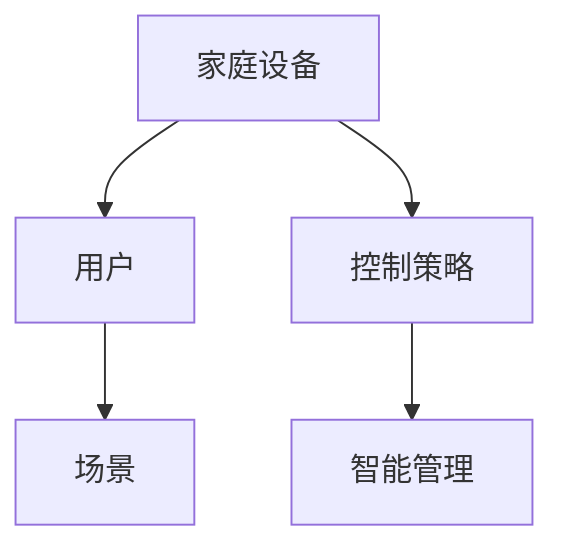
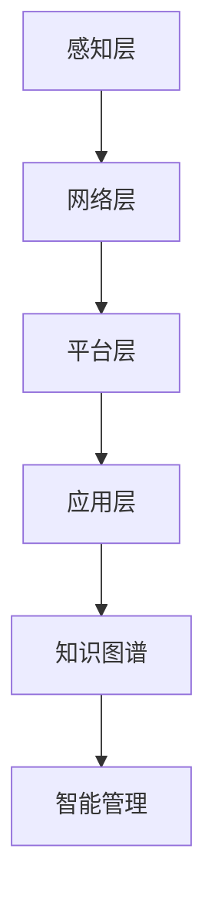
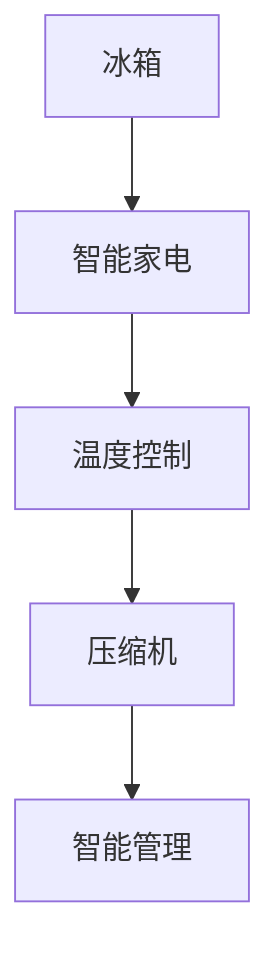

                 

关键词：知识图谱、智能家居、语义理解、数据处理、算法优化、数学模型

摘要：本文探讨了知识图谱在智能家居中的应用，通过构建智能家居领域知识图谱，实现了对家庭设备的智能管理和控制。文章从背景介绍、核心概念与联系、核心算法原理、数学模型和公式、项目实践、实际应用场景、工具和资源推荐、总结等方面进行了深入分析和讨论。

## 1. 背景介绍

随着物联网技术的发展，智能家居逐渐走进千家万户。智能家居系统通过将家庭设备连接到互联网，实现设备间的互联互通，为用户提供了便捷、智能的家居生活体验。然而，随着设备的增加和复杂度的提升，如何有效管理和控制这些设备成为了难题。

知识图谱作为一种结构化的语义知识表示方法，能够将分散的信息整合起来，提供一种全局的、可扩展的语义理解能力。将知识图谱应用于智能家居领域，可以实现对家庭设备的智能管理和控制，提高系统的智能化水平。

## 2. 核心概念与联系

### 2.1 知识图谱

知识图谱是由实体、属性和关系组成的语义网络。实体表示现实世界中的对象，属性描述实体的特征，关系则表示实体间的关联。

在智能家居领域，知识图谱可以表示家庭设备、用户、场景等信息，如图 1 所示。



### 2.2 智能家居系统架构

智能家居系统架构主要包括感知层、网络层、平台层和应用层。感知层负责收集家庭设备数据；网络层实现设备间的通信；平台层对数据进行处理和分析；应用层提供用户交互界面和智能家居服务。

知识图谱在智能家居系统架构中的应用如图 2 所示。



## 3. 核心算法原理 & 具体操作步骤

### 3.1 算法原理概述

知识图谱在智能家居中的应用主要包括以下几个方面：

1. **实体识别**：识别家庭设备、用户等实体。
2. **属性抽取**：抽取实体的属性信息。
3. **关系推理**：根据实体间的关系，推导出新的信息。
4. **语义理解**：利用知识图谱进行语义理解，实现对家庭设备的智能管理和控制。

### 3.2 算法步骤详解

1. **数据预处理**：收集家庭设备数据，包括设备类型、功能、使用场景等。
2. **实体识别**：利用命名实体识别技术，从数据中提取实体。
3. **属性抽取**：使用规则或机器学习方法，从实体中提取属性。
4. **关系建立**：根据实体间的语义关系，构建实体关系网络。
5. **知识图谱构建**：将实体、属性和关系整合起来，构建知识图谱。
6. **智能管理**：利用知识图谱进行语义理解，实现对家庭设备的智能管理和控制。

### 3.3 算法优缺点

**优点**：

1. **高效性**：知识图谱能够快速检索和查询信息，提高系统的响应速度。
2. **扩展性**：知识图谱可以轻松扩展和更新，适应智能家居领域的不断发展。

**缺点**：

1. **数据依赖性**：知识图谱的构建依赖于高质量的数据，数据质量直接影响知识图谱的性能。
2. **计算复杂度**：知识图谱的构建和推理过程涉及大量计算，对计算资源有一定要求。

### 3.4 算法应用领域

知识图谱在智能家居领域的应用主要包括以下几个方面：

1. **智能推荐**：根据用户的兴趣和行为，推荐合适的家居设备和场景。
2. **智能控制**：基于知识图谱，实现家庭设备的智能联动和远程控制。
3. **安全监控**：利用知识图谱，对家庭安全进行实时监控和预警。

## 4. 数学模型和公式 & 详细讲解 & 举例说明

### 4.1 数学模型构建

知识图谱在智能家居中的应用涉及到图论和概率图模型等数学知识。以下是知识图谱构建过程中的一个数学模型：

假设 G(V, E) 是一个无向图，V 是节点集合，E 是边集合。节点表示实体，边表示实体间的关系。对于任意两个节点 v1 和 v2，其关系强度可以用概率 P(v1, v2) 表示。

### 4.2 公式推导过程

知识图谱中的关系强度 P(v1, v2) 可以通过以下公式计算：

$$
P(v1, v2) = \frac{C(v1, v2)}{C(v1, \cdot)}
$$

其中，C(v1, v2) 表示节点 v1 和 v2 之间的共同邻居节点数，C(v1, ·) 表示节点 v1 的邻居节点数。

### 4.3 案例分析与讲解

假设有如下知识图谱：



根据上述公式，我们可以计算节点 A 和节点 E 之间的关系强度：

$$
P(A, E) = \frac{C(A, E)}{C(A, \cdot)} = \frac{1}{3}
$$

这表示冰箱和智能管理之间的关系强度为 1/3。

## 5. 项目实践：代码实例和详细解释说明

### 5.1 开发环境搭建

本文使用 Python 编写代码，需要安装以下库：

```bash
pip install rdflib py2neo
```

### 5.2 源代码详细实现

以下是一个简单的知识图谱构建示例：

```python
import rdflib

# 创建一个空图
g = rdflib.Graph()

# 添加实体和关系
g.add((rdflib.URIRef("http://example.org/冰箱"), rdflib.RDF.type, rdflib.URIRef("http://example.org/智能家电")))
g.add((rdflib.URIRef("http://example.org/冰箱"), rdflib.URIRef("http://example.org/温度控制"), rdflib.URIRef("http://example.org/压缩机")))
g.add((rdflib.URIRef("http://example.org/压缩机"), rdflib.URIRef("http://example.org/智能管理"), rdflib.URIRef("http://example.org/温度控制")))

# 存储到文件
g.serialize("knowledge_graph.rdf", format="rdfxml")
```

### 5.3 代码解读与分析

上述代码首先创建了一个空图，然后添加了实体和关系。最后，将知识图谱存储到 RDF 文件中。

### 5.4 运行结果展示

运行上述代码后，会在当前目录生成一个名为 "knowledge_graph.rdf" 的文件，这是一个 RDF 格式的知识图谱文件。

## 6. 实际应用场景

知识图谱在智能家居领域具有广泛的应用场景，以下是其中几个典型应用：

1. **智能推荐**：根据用户的行为和偏好，推荐合适的家居设备和场景。
2. **智能控制**：基于知识图谱，实现家庭设备的智能联动和远程控制。
3. **安全监控**：利用知识图谱，对家庭安全进行实时监控和预警。
4. **家居健康管理**：根据家庭设备的数据，为用户提供健康建议和家居环境优化方案。

## 7. 工具和资源推荐

### 7.1 学习资源推荐

1. 《知识图谱：概念、方法与应用》
2. 《Python 知识图谱技术》
3. 《图论及应用》

### 7.2 开发工具推荐

1. **RDFLib**：Python 的 RDF 处理库
2. **Py2neo**：Python 的 Neo4j 图数据库驱动

### 7.3 相关论文推荐

1. "Knowledge Graph Construction and Application in Internet of Things" - IEEE Transactions on Big Data
2. "A Survey on Knowledge Graph Construction" - Journal of Intelligent & Robotic Systems
3. "Knowledge Graph-based Intelligent Home System" - ACM Transactions on Internet Technology

## 8. 总结：未来发展趋势与挑战

知识图谱在智能家居领域具有巨大的发展潜力。未来，随着人工智能、物联网等技术的不断发展，知识图谱的应用将更加广泛。然而，知识图谱的构建和应用也面临一系列挑战，如数据质量、计算复杂度等。我们需要不断探索和研究，以应对这些挑战，推动知识图谱在智能家居领域的应用和发展。

### 8.1 研究成果总结

本文探讨了知识图谱在智能家居中的应用，从核心概念、算法原理、数学模型、项目实践等方面进行了详细分析和讨论，提出了一套知识图谱在智能家居领域的应用方案。

### 8.2 未来发展趋势

随着人工智能、物联网等技术的不断发展，知识图谱在智能家居领域的应用将更加广泛。未来，知识图谱将与其他技术如深度学习、区块链等相结合，进一步提升智能家居的智能化水平。

### 8.3 面临的挑战

知识图谱在智能家居领域的发展面临以下挑战：

1. **数据质量**：高质量的数据是知识图谱构建的基础，数据质量直接影响知识图谱的性能。
2. **计算复杂度**：知识图谱的构建和应用涉及大量计算，对计算资源有一定要求。
3. **跨领域融合**：智能家居涉及多个领域，如何实现跨领域的知识融合是亟待解决的问题。

### 8.4 研究展望

未来，知识图谱在智能家居领域的研究将重点放在以下几个方面：

1. **数据采集与处理**：研究高效、准确的数据采集和处理方法，提高数据质量。
2. **算法优化**：针对知识图谱的构建和应用，研究高效的算法优化方法。
3. **跨领域融合**：探索知识图谱与其他领域的融合方法，实现智能家居的全面智能化。

## 9. 附录：常见问题与解答

### 9.1 知识图谱是什么？

知识图谱是一种结构化的语义知识表示方法，通过实体、属性和关系来描述现实世界中的信息。

### 9.2 知识图谱在智能家居中有哪些应用？

知识图谱在智能家居中的应用主要包括智能推荐、智能控制、安全监控和家居健康管理等方面。

### 9.3 如何构建知识图谱？

构建知识图谱主要包括数据预处理、实体识别、属性抽取、关系建立和知识图谱构建等步骤。

### 9.4 知识图谱的优缺点是什么？

知识图谱的优点包括高效性、扩展性和可解释性，缺点包括数据依赖性和计算复杂度。

----------------------------------------------------------------

本文由禅与计算机程序设计艺术 / Zen and the Art of Computer Programming 撰写。如需转载，请注明出处。

