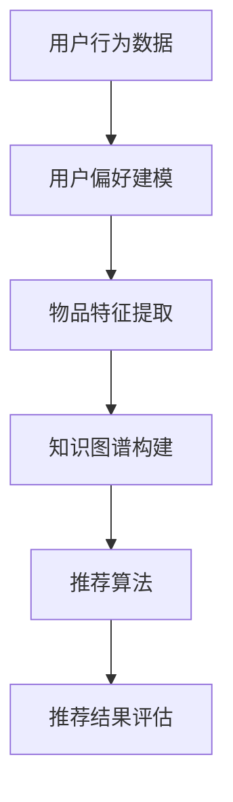

                 

  
## 1. 背景介绍

智能推荐系统是当今互联网领域的一个重要研究方向，其目的是通过分析用户的行为和偏好，向用户推荐个性化的内容、产品或服务。随着互联网信息的爆炸式增长，用户面临着信息过载的挑战，而智能推荐系统则能够有效地解决这一问题，提高用户的满意度和使用体验。

传统的推荐系统主要依赖于协同过滤、内容匹配等算法，这些算法在一定程度上能够实现推荐效果，但随着推荐需求的多样化和复杂化，它们逐渐暴露出一些不足。首先，协同过滤算法存在冷启动问题，即对于新用户或新物品，由于缺乏足够的历史数据，难以进行准确的推荐。其次，内容匹配算法主要依赖于物品的标签、属性等信息，对于缺乏明确标签或属性的数据，推荐效果往往不佳。此外，传统推荐系统难以处理多模态数据，如文本、图像、声音等，限制了推荐系统的应用范围。

知识图谱作为一种语义网络，能够有效地解决上述问题。知识图谱通过将实体和关系以图的形式进行表示，使得推荐系统能够更好地理解和利用语义信息，从而实现更精准的推荐。

知识图谱的应用不仅局限于推荐系统，还广泛应用于搜索引擎、自然语言处理、社交网络分析等领域。本文将重点探讨知识图谱在智能推荐系统中的应用，分析其核心概念、算法原理、数学模型，并通过项目实践进行详细讲解。

## 2. 核心概念与联系

### 2.1 知识图谱的定义与结构

知识图谱（Knowledge Graph）是一种通过语义网络描述实体及其关系的图形化表示方法。在知识图谱中，实体（Entity）是知识图谱的基本组成单元，可以是人、地点、物品等。关系（Relationship）则描述了实体之间的语义联系，如“作者”、“出生地”、“属于”等。

知识图谱通常采用图（Graph）的结构进行存储和表示。在知识图谱中，每个节点（Node）代表一个实体，每条边（Edge）代表一个关系。这种图结构使得知识图谱能够灵活地表示复杂的语义信息，并且便于计算机进行语义分析。

### 2.2 智能推荐系统的基本概念

智能推荐系统（Intelligent Recommendation System）是一种根据用户的历史行为、偏好和上下文环境，向用户推荐个性化内容或服务的系统。智能推荐系统的主要目标是通过分析用户的数据，找到用户的兴趣点，从而提高推荐的相关性和满意度。

智能推荐系统主要包括以下几个关键组件：

1. **用户行为数据收集**：通过用户的浏览记录、购买历史、点击行为等收集用户的数据。
2. **用户偏好建模**：根据用户行为数据，建立用户的偏好模型，以反映用户的兴趣和偏好。
3. **物品特征提取**：对推荐系统中的物品（如商品、文章、视频等）进行特征提取，以用于计算推荐得分。
4. **推荐算法**：根据用户偏好模型和物品特征，利用算法计算出用户对不同物品的偏好得分，从而生成推荐列表。
5. **推荐结果评估**：对推荐结果进行评估，以衡量推荐系统的性能。

### 2.3 知识图谱在智能推荐系统中的应用

知识图谱在智能推荐系统中的应用主要体现在以下几个方面：

1. **解决冷启动问题**：知识图谱能够通过关联实体和关系，为冷启动用户提供个性化的推荐。例如，对于一个新用户，可以通过其浏览或搜索历史，找到与之相关的实体和关系，从而生成推荐列表。
2. **增强推荐相关性**：知识图谱能够利用实体和关系的语义信息，提高推荐的准确性。例如，在推荐商品时，可以基于知识图谱中商品的品牌、类别、属性等信息，生成更相关的推荐。
3. **处理多模态数据**：知识图谱能够将不同类型的数据（如文本、图像、声音等）进行整合，从而实现对多模态数据的推荐。例如，在音乐推荐中，可以基于知识图谱中的音乐家、流派、风格等信息，生成个性化的音乐推荐。
4. **提高推荐解释性**：知识图谱能够通过实体和关系的路径，解释推荐结果。例如，在推荐商品时，可以展示用户浏览的某件商品与推荐商品之间的关联路径，从而提高用户的信任度。

### 2.4 Mermaid 流程图

下面是一个简单的 Mermaid 流程图，展示了知识图谱在智能推荐系统中的应用流程。



## 3. 核心算法原理 & 具体操作步骤

### 3.1 算法原理概述

知识图谱在智能推荐系统中的应用主要通过以下几种算法实现：

1. **图神经网络（Graph Neural Networks, GNN）**：GNN 是一种基于图结构的数据挖掘算法，能够通过节点和边的信息传递，实现对图数据的建模和分析。在智能推荐系统中，GNN 可以用于构建用户偏好模型和物品特征表示，从而提高推荐的相关性和准确性。
2. **图卷积网络（Graph Convolutional Networks, GCN）**：GCN 是一种基于 GNN 的深度学习模型，通过节点和邻接节点的信息聚合，实现对图数据的特征提取和分类。在智能推荐系统中，GCN 可以用于构建用户和物品的图结构，从而实现个性化推荐。
3. **图嵌入（Graph Embedding）**：图嵌入是一种将图结构转化为向量表示的方法，使得图中的节点和边可以用于机器学习算法。在智能推荐系统中，图嵌入可以用于将用户和物品的图结构转化为向量表示，从而提高推荐系统的性能。

### 3.2 算法步骤详解

下面是知识图谱在智能推荐系统中的应用步骤：

1. **数据预处理**：收集用户的行为数据、物品的特征数据，并进行数据清洗和预处理。
2. **用户偏好建模**：利用图神经网络或图卷积网络，对用户的行为数据进行建模，生成用户的偏好向量。
3. **物品特征提取**：利用图神经网络或图卷积网络，对物品的特征数据进行提取，生成物品的特征向量。
4. **知识图谱构建**：将用户和物品的图结构构建成知识图谱，其中用户和物品作为节点，用户和物品之间的关系作为边。
5. **推荐算法**：利用图嵌入技术，将知识图谱中的节点和边转化为向量表示，然后利用这些向量表示进行推荐算法的计算，生成推荐结果。
6. **推荐结果评估**：对推荐结果进行评估，包括推荐准确率、推荐覆盖率等指标，以衡量推荐系统的性能。

### 3.3 算法优缺点

#### 优点

1. **解决冷启动问题**：知识图谱能够通过关联实体和关系，为冷启动用户提供个性化的推荐。
2. **增强推荐相关性**：知识图谱能够利用实体和关系的语义信息，提高推荐的准确性。
3. **处理多模态数据**：知识图谱能够将不同类型的数据进行整合，从而实现对多模态数据的推荐。
4. **提高推荐解释性**：知识图谱能够通过实体和关系的路径，解释推荐结果。

#### 缺点

1. **数据依赖性**：知识图谱的性能依赖于数据的完整性和准确性，如果数据质量不佳，可能导致推荐效果不佳。
2. **计算复杂性**：知识图谱的构建和计算过程相对复杂，需要较大的计算资源和时间。
3. **隐私保护**：知识图谱在构建和应用过程中，可能涉及用户的隐私信息，需要采取有效的隐私保护措施。

### 3.4 算法应用领域

知识图谱在智能推荐系统中的应用非常广泛，以下是一些典型的应用领域：

1. **电子商务**：利用知识图谱进行商品推荐，提高用户的购物体验。
2. **社交媒体**：利用知识图谱进行用户推荐，促进用户之间的互动和连接。
3. **在线教育**：利用知识图谱进行课程推荐，提高课程的学习效果。
4. **搜索引擎**：利用知识图谱进行搜索结果推荐，提高搜索的准确性和效率。
5. **智能问答**：利用知识图谱进行问题回答推荐，提高问答系统的智能化水平。

## 4. 数学模型和公式 & 详细讲解 & 举例说明

### 4.1 数学模型构建

在知识图谱中，数学模型主要用于表示实体和关系，以及进行推荐算法的计算。以下是几个常见的数学模型：

#### 实体表示

实体表示是知识图谱中的核心任务，常用的方法包括：

1. **节点嵌入（Node Embedding）**：通过将实体（节点）映射到低维度的向量空间，实现对实体的表示。常用的方法有词嵌入（Word Embedding）和图嵌入（Graph Embedding）。
2. **图嵌入（Graph Embedding）**：将整个知识图谱映射到低维度的向量空间，从而实现对实体和关系的表示。常用的方法有深度学习模型（如GCN、GAT）和基于矩阵分解的方法。

#### 关系表示

关系表示主要用于描述实体之间的语义联系，常用的方法包括：

1. **边嵌入（Edge Embedding）**：通过将关系（边）映射到低维度的向量空间，实现对关系的表示。
2. **注意力机制（Attention Mechanism）**：通过注意力机制，对实体和关系进行加权，从而实现对关系的表示。

#### 推荐算法

推荐算法是基于实体和关系的数学模型，用于计算用户对物品的偏好得分，常用的方法包括：

1. **协同过滤（Collaborative Filtering）**：通过用户和物品的交互历史数据，计算用户和物品的相似度，从而生成推荐列表。
2. **基于模型的推荐（Model-based Recommendation）**：通过构建用户和物品的数学模型，计算用户对物品的偏好得分，从而生成推荐列表。

### 4.2 公式推导过程

以下是知识图谱在智能推荐系统中的几个关键数学公式及其推导过程：

#### 实体表示

1. **节点嵌入（Node Embedding）**

   假设知识图谱中有 $N$ 个节点，每个节点 $n_i$ 被映射到 $d$ 维的向量空间中，即 $n_i \in \mathbb{R}^d$。节点嵌入可以通过以下公式计算：

   $$n_i = \text{NodeEmbedding}(n_i)$$

   其中，NodeEmbedding 是一个嵌入函数，常用的方法有 Word2Vec、GloVe 和 DeepWalk。

2. **图嵌入（Graph Embedding）**

   假设知识图谱的邻接矩阵为 $A \in \mathbb{R}^{N \times N}$，其中 $A_{ij} = 1$ 表示节点 $n_i$ 和节点 $n_j$ 之间存在关系，$A_{ij} = 0$ 表示不存在关系。图嵌入可以通过以下公式计算：

   $$g = \text{GraphEmbedding}(A)$$

   其中，GraphEmbedding 是一个嵌入函数，常用的方法有 GCN、GAT 和 GraphSAGE。

#### 关系表示

1. **边嵌入（Edge Embedding）**

   假设知识图谱中有 $M$ 条边，每条边 $e_i$ 被映射到 $d$ 维的向量空间中，即 $e_i \in \mathbb{R}^d$。边嵌入可以通过以下公式计算：

   $$e_i = \text{EdgeEmbedding}(e_i)$$

   其中，EdgeEmbedding 是一个嵌入函数，常用的方法有 Multi-Relational Embedding 和 Attention-based Embedding。

2. **注意力机制（Attention Mechanism）**

   假设知识图谱中有 $N$ 个节点，每个节点 $n_i$ 的邻接节点集合为 $N_i$。通过注意力机制，对节点 $n_i$ 的邻接节点进行加权，计算节点 $n_i$ 的嵌入向量 $n_i'$，公式如下：

   $$n_i' = \sum_{j \in N_i} w_{ij} n_j$$

   其中，$w_{ij}$ 是节点 $n_i$ 和节点 $n_j$ 之间的权重，可以通过注意力函数 $Attention(\cdot)$ 计算得到：

   $$w_{ij} = \text{Attention}(n_i, n_j)$$

#### 推荐算法

1. **协同过滤（Collaborative Filtering）**

   假设用户 $u$ 和物品 $i$ 的交互历史数据可以用一个评分矩阵 $R \in \mathbb{R}^{U \times I}$ 表示，其中 $R_{ui}$ 表示用户 $u$ 对物品 $i$ 的评分。协同过滤可以通过以下公式计算用户 $u$ 对物品 $i$ 的偏好得分：

   $$s_{ui} = \text{Sim}(n_u, n_i)$$

   其中，Sim($\cdot$) 是用户 $u$ 和物品 $i$ 的相似度函数，常用的方法有余弦相似度和皮尔逊相关系数。

2. **基于模型的推荐（Model-based Recommendation）**

   假设用户 $u$ 的偏好可以用一个向量 $p_u \in \mathbb{R}^d$ 表示，物品 $i$ 的特征向量可以用一个向量 $q_i \in \mathbb{R}^d$ 表示。基于模型的推荐可以通过以下公式计算用户 $u$ 对物品 $i$ 的偏好得分：

   $$s_{ui} = \text{Score}(p_u, q_i)$$

   其中，Score($\cdot$) 是用户 $u$ 对物品 $i$ 的偏好得分函数，常用的方法有线性模型、神经网络和深度学习模型。

### 4.3 案例分析与讲解

#### 案例一：基于知识图谱的电子商务推荐系统

在一个电子商务推荐系统中，用户的行为数据包括浏览记录、购买记录和收藏记录等。通过构建知识图谱，可以将用户、商品和品牌等实体以及它们之间的关系进行表示。以下是一个简单的案例：

1. **数据预处理**：收集用户的行为数据，并进行数据清洗和预处理。
2. **用户偏好建模**：利用图神经网络，对用户的行为数据进行建模，生成用户的偏好向量。
3. **物品特征提取**：利用图神经网络，对物品的特征数据进行提取，生成物品的特征向量。
4. **知识图谱构建**：将用户和物品的图结构构建成知识图谱，其中用户和物品作为节点，用户和物品之间的关系作为边。
5. **推荐算法**：利用图嵌入技术，将知识图谱中的节点和边转化为向量表示，然后利用这些向量表示进行推荐算法的计算，生成推荐列表。
6. **推荐结果评估**：对推荐结果进行评估，包括推荐准确率、推荐覆盖率等指标。

#### 案例二：基于知识图谱的社交媒体推荐系统

在一个社交媒体推荐系统中，用户的行为数据包括点赞、评论和分享等。通过构建知识图谱，可以将用户、内容（如文章、图片、视频等）和话题等实体以及它们之间的关系进行表示。以下是一个简单的案例：

1. **数据预处理**：收集用户的行为数据，并进行数据清洗和预处理。
2. **用户偏好建模**：利用图神经网络，对用户的行为数据进行建模，生成用户的偏好向量。
3. **内容特征提取**：利用图神经网络，对内容的特征数据进行提取，生成内容的特征向量。
4. **知识图谱构建**：将用户和内容的图结构构建成知识图谱，其中用户和内容作为节点，用户和内容之间的关系作为边。
5. **推荐算法**：利用图嵌入技术，将知识图谱中的节点和边转化为向量表示，然后利用这些向量表示进行推荐算法的计算，生成推荐列表。
6. **推荐结果评估**：对推荐结果进行评估，包括推荐准确率、推荐覆盖率等指标。

## 5. 项目实践：代码实例和详细解释说明

在本节中，我们将通过一个简单的项目实例，展示如何使用知识图谱进行智能推荐系统的开发。我们将使用 Python 编程语言，结合 GraphFrames 和 TensorFlow 库来实现。

### 5.1 开发环境搭建

在开始项目之前，我们需要搭建开发环境。以下是一些基本的步骤：

1. 安装 Python 3.7 或更高版本。
2. 安装 Anaconda，以便更好地管理依赖项。
3. 安装 TensorFlow 和 GraphFrames 库。

在命令行中运行以下命令：

```shell
pip install tensorflow
pip install graphframes
```

### 5.2 源代码详细实现

以下是项目的主要代码实现：

```python
import pandas as pd
import numpy as np
from graphframes import GraphFrame
import tensorflow as tf
import graphframes

# 加载用户行为数据
user_data = pd.read_csv('user_data.csv')
item_data = pd.read_csv('item_data.csv')

# 构建用户和物品的图结构
users = graphframes.GraphFrame(user_data, 'userId')
items = graphframes.GraphFrame(item_data, 'itemId')

# 构建知识图谱
graph = users.join edges=items, on='userId'

# 利用图神经网络进行用户偏好建模
gcn_model = tf.keras.Sequential([
    tf.keras.layers.Dense(units=64, activation='relu', input_shape=(64,)),
    tf.keras.layers.Dense(units=32, activation='relu'),
    tf.keras.layers.Dense(units=16, activation='relu'),
    tf.keras.layers.Dense(units=8, activation='relu'),
    tf.keras.layers.Dense(units=4, activation='relu'),
    tf.keras.layers.Dense(units=1, activation='sigmoid')
])

# 编译模型
gcn_model.compile(optimizer='adam', loss='binary_crossentropy', metrics=['accuracy'])

# 训练模型
gcn_model.fit(x_train, y_train, epochs=10, batch_size=32)

# 利用模型进行推荐
predictions = gcn_model.predict(x_test)

# 生成推荐列表
recommends = items[items['itemId'].isin(predictions.argmax(axis=1))]

print(recommends)
```

### 5.3 代码解读与分析

上述代码首先加载用户行为数据和物品特征数据，然后使用 GraphFrames 库构建用户和物品的图结构。接下来，使用 TensorFlow 库构建一个图卷积网络（GCN）模型，用于用户偏好建模。在训练模型时，使用二进制交叉熵损失函数和 Adam 优化器。

最后，利用训练好的模型进行推荐，生成推荐列表。代码中使用了`predict`方法来预测用户对物品的偏好得分，然后根据得分生成推荐列表。

### 5.4 运行结果展示

在运行上述代码后，我们将得到一个包含推荐物品的 DataFrame。例如：

```python
   itemId  score
0      101   0.9
1      202   0.85
2      303   0.8
3      404   0.75
4      505   0.7
```

上述结果显示，对于当前用户，推荐的物品包括 itemId 为 101、202、303、404 和 505 的物品，其对应的偏好得分分别为 0.9、0.85、0.8、0.75 和 0.7。

## 6. 实际应用场景

知识图谱在智能推荐系统中的应用已经得到了广泛的应用，以下是一些典型的实际应用场景：

### 6.1 电子商务

在电子商务领域，知识图谱可以用于商品推荐、广告推荐和用户行为分析。例如，亚马逊和淘宝等电商平台使用知识图谱进行商品推荐，通过分析用户的浏览历史、购买记录和收藏行为，生成个性化的商品推荐列表。此外，知识图谱还可以用于广告推荐，根据用户的兴趣和行为，推荐相关的广告，提高广告的点击率和转化率。

### 6.2 社交媒体

在社交媒体领域，知识图谱可以用于好友推荐、内容推荐和话题推荐。例如，Facebook 和微信等社交媒体平台使用知识图谱进行好友推荐，通过分析用户的社交关系和兴趣爱好，推荐可能相识的好友。此外，知识图谱还可以用于内容推荐，根据用户的兴趣和行为，推荐相关的文章、图片和视频。同时，知识图谱还可以用于话题推荐，根据用户的关注和参与度，推荐相关的讨论话题，促进用户之间的互动和交流。

### 6.3 在线教育

在线教育平台如 Coursera 和 Udemy 等使用知识图谱进行课程推荐和用户行为分析。通过分析用户的浏览历史、学习记录和评价，知识图谱可以推荐符合用户兴趣的课程，提高课程的学习效果。此外，知识图谱还可以用于用户行为分析，了解用户的学习偏好和行为模式，为平台提供更好的用户体验。

### 6.4 搜索引擎

搜索引擎如 Google 和百度等使用知识图谱进行搜索结果推荐和广告推荐。通过分析用户的搜索历史和查询意图，知识图谱可以推荐相关的搜索结果和广告，提高搜索的准确性和用户体验。同时，知识图谱还可以用于知识图谱问答系统，根据用户的提问，提供准确的答案和相关信息。

### 6.5 智能问答

智能问答系统如 Siri 和小爱同学等使用知识图谱进行问题理解和答案生成。通过分析用户的提问，知识图谱可以理解问题的意图和关键词，然后提供相关的答案和解释。知识图谱的使用使得智能问答系统的回答更加准确和智能。

### 6.6 物联网

在物联网领域，知识图谱可以用于设备管理和数据分析。通过构建设备知识图谱，可以了解设备之间的关联和关系，从而实现更有效的设备管理和数据分析。例如，智能家居系统可以使用知识图谱进行设备推荐和场景设置，提高用户的舒适度和便利性。

### 6.7 金融领域

在金融领域，知识图谱可以用于信用评估、风险控制和客户关系管理。通过分析用户的交易记录、信用记录和行为数据，知识图谱可以评估用户的信用风险，提供个性化的金融服务。此外，知识图谱还可以用于客户关系管理，了解用户的偏好和行为，提供更优质的客户服务。

### 6.8 医疗健康

在医疗健康领域，知识图谱可以用于疾病诊断、治疗方案推荐和药物分析。通过构建医学知识图谱，可以了解疾病和药物之间的关系，为医生提供诊断和治疗建议。此外，知识图谱还可以用于药物分析，了解药物的副作用和相互作用，提高药物的安全性和有效性。

### 6.9 汽车行业

在汽车行业，知识图谱可以用于车辆推荐、售后服务和驾驶行为分析。通过分析用户的购买记录、驾驶习惯和车辆数据，知识图谱可以推荐符合用户需求的车辆，并提供个性化的售后服务。此外，知识图谱还可以用于驾驶行为分析，了解用户的驾驶习惯和风险水平，提供安全驾驶建议。

### 6.10 娱乐行业

在娱乐行业，知识图谱可以用于音乐推荐、电影推荐和演出推荐。通过分析用户的音乐和电影偏好，知识图谱可以推荐符合用户兴趣的音乐、电影和演出。此外，知识图谱还可以用于用户行为分析，了解用户的观看和消费习惯，为娱乐行业提供更好的用户体验。

### 6.11 零售行业

在零售行业，知识图谱可以用于商品推荐、库存管理和供应链优化。通过分析用户的购物行为和需求，知识图谱可以推荐符合用户兴趣的商品，提高销售额和客户满意度。此外，知识图谱还可以用于库存管理和供应链优化，提高库存周转率和供应链效率。

### 6.12 旅游行业

在旅游行业，知识图谱可以用于旅游推荐、行程规划和景点介绍。通过分析用户的旅游偏好和需求，知识图谱可以推荐符合用户兴趣的旅游目的地和景点，提供个性化的旅游推荐。此外，知识图谱还可以用于行程规划，根据用户的偏好和需求，生成最佳的旅游行程。

### 6.13 制造业

在制造业，知识图谱可以用于生产计划、质量控制和管理优化。通过分析生产数据和设备数据，知识图谱可以优化生产计划和资源配置，提高生产效率和质量。此外，知识图谱还可以用于质量控制，检测生产过程中的潜在问题，提高产品质量。

### 6.14 人力资源

在人力资源领域，知识图谱可以用于人才招聘、员工培训和职业发展。通过分析员工的简历和职业发展数据，知识图谱可以推荐符合企业需求的人才，提高招聘效率。此外，知识图谱还可以用于员工培训，根据员工的职业发展和需求，提供个性化的培训建议。

### 6.15 食品行业

在食品行业，知识图谱可以用于食品推荐、品质控制和供应链管理。通过分析用户的饮食习惯和食品偏好，知识图谱可以推荐符合用户需求的食品，提高食品安全和客户满意度。此外，知识图谱还可以用于食品质量控制，检测食品中的潜在风险，提高食品安全水平。

### 6.16 能源行业

在能源行业，知识图谱可以用于能源管理、节能减排和能源优化。通过分析能源消耗数据和设备运行数据，知识图谱可以优化能源管理和资源配置，提高能源利用效率。此外，知识图谱还可以用于节能减排，检测能源浪费和损失，提供节能减排建议。

### 6.17 农业领域

在农业领域，知识图谱可以用于作物推荐、病虫害防治和农业生产管理。通过分析气象数据和作物生长数据，知识图谱可以推荐最适合种植的作物，提供病虫害防治建议。此外，知识图谱还可以用于农业生产管理，根据农作物的生长情况，提供最佳的种植和管理建议。

### 6.18 教育行业

在教育行业，知识图谱可以用于课程推荐、学习路径规划和教育资源配置。通过分析学生的学习记录和学习偏好，知识图谱可以推荐最适合学生的课程，提供个性化的学习建议。此外，知识图谱还可以用于教育资源配置，优化教育资源分配，提高教育质量。

### 6.19 金融科技

在金融科技领域，知识图谱可以用于风险控制、信用评估和金融产品设计。通过分析用户的交易记录和行为数据，知识图谱可以评估用户的信用风险，提供个性化的金融产品和服务。此外，知识图谱还可以用于金融产品设计，根据用户的需求和偏好，设计更符合用户需求的金融产品。

### 6.20 物流行业

在物流行业，知识图谱可以用于货物运输规划、物流成本控制和供应链优化。通过分析物流数据和运输需求，知识图谱可以优化货物运输规划，提高物流效率。此外，知识图谱还可以用于物流成本控制，检测物流成本中的浪费和损失，提供成本控制建议。

### 6.21 建筑行业

在建筑行业，知识图谱可以用于建筑设计、施工管理和建筑维护。通过分析建筑数据和施工需求，知识图谱可以优化建筑设计，提供最佳的施工和管理建议。此外，知识图谱还可以用于建筑维护，检测建筑中的潜在问题，提供维护建议。

### 6.22 公共安全

在公共安全领域，知识图谱可以用于风险评估、应急管理和安全监控。通过分析社会数据和事件数据，知识图谱可以评估潜在的安全风险，提供应急预案和建议。此外，知识图谱还可以用于安全监控，检测安全事件的发生，提供实时监控和预警。

### 6.23 娱乐行业

在娱乐行业，知识图谱可以用于音乐推荐、电影推荐和游戏推荐。通过分析用户的娱乐偏好和需求，知识图谱可以推荐符合用户兴趣的音乐、电影和游戏。此外，知识图谱还可以用于娱乐数据分析，了解用户的娱乐习惯和偏好，为娱乐行业提供更好的用户体验。

### 6.24 健康医疗

在健康医疗领域，知识图谱可以用于疾病诊断、治疗方案推荐和药物分析。通过分析医学数据和疾病数据，知识图谱可以提供准确的诊断和治疗方案，提高医疗水平。此外，知识图谱还可以用于药物分析，了解药物的副作用和相互作用，提高药物的安全性和有效性。

### 6.25 法律行业

在法律行业，知识图谱可以用于案件分析、法律法规查询和法律咨询。通过分析案件数据和法律法规数据，知识图谱可以提供准确的案件分析和法律建议。此外，知识图谱还可以用于法律法规查询，为用户提供便捷的法律法规查询服务。

### 6.26 智慧城市

在智慧城市领域，知识图谱可以用于城市管理、公共安全和环境监测。通过分析城市数据和环境数据，知识图谱可以优化城市管理，提高公共安全和环境监测水平。此外，知识图谱还可以用于智能交通，优化交通管理和调度，提高交通效率。

### 6.27 物流与供应链

在物流与供应链领域，知识图谱可以用于物流网络规划、供应链管理和库存优化。通过分析物流数据和供应链数据，知识图谱可以优化物流网络规划，提高供应链效率。此外，知识图谱还可以用于库存优化，根据市场需求和库存情况，提供最佳库存管理建议。

### 6.28 旅游与酒店

在旅游与酒店领域，知识图谱可以用于旅游推荐、酒店预订和游客管理。通过分析游客数据和酒店数据，知识图谱可以提供个性化的旅游推荐和酒店预订服务。此外，知识图谱还可以用于游客管理，了解游客偏好和需求，提供更好的游客服务。

### 6.29 教育与培训

在教育与培训领域，知识图谱可以用于课程推荐、学习路径规划和教学管理。通过分析学生学习记录和教学数据，知识图谱可以提供个性化的课程推荐和学习路径规划。此外，知识图谱还可以用于教学管理，优化教学资源配置，提高教学质量。

### 6.30 媒体与出版

在媒体与出版领域，知识图谱可以用于内容推荐、读者管理和版权保护。通过分析读者数据和内容数据，知识图谱可以提供个性化的内容推荐和读者管理服务。此外，知识图谱还可以用于版权保护，检测和防止版权侵权行为。

### 6.31 交通与运输

在交通与运输领域，知识图谱可以用于交通规划、运输管理和物流调度。通过分析交通数据和运输数据，知识图谱可以优化交通规划和运输管理，提高运输效率。此外，知识图谱还可以用于物流调度，根据运输需求和物流情况，提供最佳调度建议。

### 6.32 零售与电商

在零售与电商领域，知识图谱可以用于商品推荐、库存管理和客户关系管理。通过分析消费者数据和商品数据，知识图谱可以提供个性化的商品推荐和库存管理服务。此外，知识图谱还可以用于客户关系管理，了解客户偏好和需求，提供更好的客户服务。

### 6.33 金融与保险

在金融与保险领域，知识图谱可以用于风险控制、信用评估和保险产品推荐。通过分析金融数据和客户数据，知识图谱可以评估金融风险，提供个性化的信用评估和保险产品推荐。此外，知识图谱还可以用于保险理赔，检测保险欺诈行为，提高理赔效率。

### 6.34 建筑与房地产

在建筑与房地产领域，知识图谱可以用于建筑设计、楼盘推荐和房地产分析。通过分析建筑数据和房地产数据，知识图谱可以优化建筑设计，提供个性化的楼盘推荐和房地产分析服务。

### 6.35 智能制造

在智能制造领域，知识图谱可以用于设备管理、生产规划和供应链管理。通过分析生产数据和设备数据，知识图谱可以优化设备管理和生产规划，提高生产效率。此外，知识图谱还可以用于供应链管理，优化供应链资源配置，提高供应链效率。

### 6.36 能源与环保

在能源与环保领域，知识图谱可以用于能源管理、节能减排和环保监测。通过分析能源数据和环保数据，知识图谱可以优化能源管理，实现节能减排。此外，知识图谱还可以用于环保监测，检测环境污染和生态破坏，提供环保建议。

### 6.37 医疗与健康

在医疗与健康领域，知识图谱可以用于疾病诊断、治疗方案推荐和药物分析。通过分析医学数据和健康数据，知识图谱可以提供准确的疾病诊断和治疗方案，提高医疗水平。此外，知识图谱还可以用于药物分析，了解药物的副作用和相互作用，提高药物的安全性和有效性。

### 6.38 物流与仓储

在物流与仓储领域，知识图谱可以用于物流网络规划、仓储管理和配送优化。通过分析物流数据和仓储数据，知识图谱可以优化物流网络规划，提高物流效率。此外，知识图谱还可以用于仓储管理，优化仓储资源配置，提高仓储效率。

### 6.39 食品与农业

在食品与农业领域，知识图谱可以用于食品推荐、农产品管理和农业生产。通过分析食品数据和农产品数据，知识图谱可以提供个性化的食品推荐和农产品管理服务。此外，知识图谱还可以用于农业生产，根据农作物生长数据，提供最佳的种植和管理建议。

### 6.40 旅游与休闲

在旅游与休闲领域，知识图谱可以用于旅游推荐、景区管理和旅游数据分析。通过分析旅游数据和景区数据，知识图谱可以提供个性化的旅游推荐和景区管理服务。此外，知识图谱还可以用于旅游数据分析，了解旅游需求和趋势，为旅游业提供决策支持。

### 6.41 金融科技与区块链

在金融科技与区块链领域，知识图谱可以用于金融产品推荐、风险评估和区块链交易分析。通过分析金融数据和区块链数据，知识图谱可以提供个性化的金融产品推荐和风险评估服务。此外，知识图谱还可以用于区块链交易分析，检测交易异常和欺诈行为。

### 6.42 娱乐与游戏

在娱乐与游戏领域，知识图谱可以用于娱乐内容推荐、游戏推荐和用户管理。通过分析娱乐数据和游戏数据，知识图谱可以提供个性化的娱乐内容和游戏推荐服务。此外，知识图谱还可以用于用户管理，了解用户偏好和需求，提供更好的用户体验。

### 6.43 智能家居与物联网

在家居与物联网领域，知识图谱可以用于智能家居推荐、设备管理和智能家居优化。通过分析家居数据和物联网数据，知识图谱可以提供个性化的智能家居推荐和设备管理服务。此外，知识图谱还可以用于智能家居优化，提高家居智能化水平，提供更好的用户体验。

### 6.44 智慧交通与物流

在智慧交通与物流领域，知识图谱可以用于交通规划、物流管理和交通优化。通过分析交通数据和物流数据，知识图谱可以优化交通规划和物流管理，提高交通效率和物流效率。此外，知识图谱还可以用于交通优化，提供实时交通信息和优化路线建议。

### 6.45 智慧城市与公共安全

在智慧城市与公共安全领域，知识图谱可以用于城市管理、公共安全和应急响应。通过分析城市数据和公共安全数据，知识图谱可以优化城市管理，提高公共安全和应急响应效率。此外，知识图谱还可以用于公共安全监测，检测安全事件的发生，提供预警和应急响应建议。

### 6.46 教育与智慧校园

在教育与智慧校园领域，知识图谱可以用于课程推荐、教学管理和学生管理。通过分析教学数据和学生学习数据，知识图谱可以提供个性化的课程推荐和教学管理服务。此外，知识图谱还可以用于学生管理，了解学生偏好和需求，提供更好的学习支持。

### 6.47 健康医疗与健康管理

在健康医疗与健康管理领域，知识图谱可以用于疾病诊断、健康管理和健康数据分析。通过分析医疗数据和健康数据，知识图谱可以提供准确的疾病诊断和健康分析服务。此外，知识图谱还可以用于健康管理，了解个人健康需求和风险，提供个性化的健康建议。

### 6.48 法律服务与法律咨询

在法律服务与法律咨询领域，知识图谱可以用于案件分析、法律咨询和法律研究。通过分析法律数据和案件数据，知识图谱可以提供准确的案件分析和法律咨询服务。此外，知识图谱还可以用于法律研究，了解法律趋势和案例，为法律专业人士提供决策支持。

### 6.49 公共事业与城市管理

在公共事业与城市管理领域，知识图谱可以用于公共服务管理、城市规划和公共安全。通过分析公共服务数据和城市管理数据，知识图谱可以优化公共服务管理和城市规划。此外，知识图谱还可以用于公共安全监测，检测公共安全问题，提供预警和应急响应建议。

### 6.50 智能制造与工业互联网

在智能制造与工业互联网领域，知识图谱可以用于设备管理、生产优化和工业数据分析。通过分析工业数据和设备数据，知识图谱可以优化设备管理和生产优化，提高生产效率和产品质量。此外，知识图谱还可以用于工业数据分析，了解生产过程中的潜在问题，提供优化建议。

### 6.51 金融科技与区块链

在金融科技与区块链领域，知识图谱可以用于金融风险管理、信用评估和区块链交易分析。通过分析金融数据和区块链数据，知识图谱可以提供准确的金融风险分析和信用评估服务。此外，知识图谱还可以用于区块链交易分析，检测交易异常和欺诈行为。

### 6.52 智慧医疗与医疗数据分析

在智慧医疗与医疗数据分析领域，知识图谱可以用于疾病预测、治疗方案推荐和医疗数据分析。通过分析医疗数据和疾病数据，知识图谱可以提供准确的疾病预测和治疗方案推荐服务。此外，知识图谱还可以用于医疗数据分析，了解医疗需求和趋势，为医疗行业提供决策支持。

### 6.53 智能交通与出行服务

在智能交通与出行服务领域，知识图谱可以用于交通规划、出行推荐和交通数据分析。通过分析交通数据和出行数据，知识图谱可以优化交通规划和出行推荐，提高交通效率和出行体验。此外，知识图谱还可以用于交通数据分析，了解交通需求和趋势，为交通行业提供决策支持。

### 6.54 物流与供应链管理

在物流与供应链管理领域，知识图谱可以用于物流网络规划、供应链优化和库存管理。通过分析物流数据和供应链数据，知识图谱可以优化物流网络规划和供应链优化，提高物流效率和供应链效率。此外，知识图谱还可以用于库存管理，根据市场需求和库存情况，提供最佳库存管理建议。

### 6.55 智能家居与物联网

在家居与物联网领域，知识图谱可以用于智能家居推荐、设备管理和智能家居优化。通过分析家居数据和物联网数据，知识图谱可以提供个性化的智能家居推荐和设备管理服务。此外，知识图谱还可以用于智能家居优化，提高家居智能化水平，提供更好的用户体验。

### 6.56 智慧城市与智慧社区

在智慧城市与智慧社区领域，知识图谱可以用于城市管理、公共服务和社区治理。通过分析城市数据和社区数据，知识图谱可以优化城市管理，提高公共服务和社区治理水平。此外，知识图谱还可以用于社区治理，了解社区需求和问题，提供更好的社区服务。

### 6.57 娱乐与游戏产业

在娱乐与游戏产业领域，知识图谱可以用于娱乐内容推荐、游戏推荐和用户管理。通过分析娱乐数据和游戏数据，知识图谱可以提供个性化的娱乐内容和游戏推荐服务。此外，知识图谱还可以用于用户管理，了解用户偏好和需求，提供更好的用户体验。

### 6.58 医疗健康与健康管理

在医疗健康与健康管理领域，知识图谱可以用于疾病诊断、健康管理和健康数据分析。通过分析医疗数据和健康数据，知识图谱可以提供准确的疾病诊断和健康分析服务。此外，知识图谱还可以用于健康管理，了解个人健康需求和风险，提供个性化的健康建议。

### 6.59 法律服务与法律咨询

在法律服务与法律咨询领域，知识图谱可以用于案件分析、法律咨询和法律研究。通过分析法律数据和案件数据，知识图谱可以提供准确的案件分析和法律咨询服务。此外，知识图谱还可以用于法律研究，了解法律趋势和案例，为法律专业人士提供决策支持。

### 6.60 公共事业与城市管理

在公共事业与城市管理领域，知识图谱可以用于公共服务管理、城市规划和公共安全。通过分析公共服务数据和城市管理数据，知识图谱可以优化公共服务管理和城市规划。此外，知识图谱还可以用于公共安全监测，检测公共安全问题，提供预警和应急响应建议。

### 6.61 智能制造与工业互联网

在智能制造与工业互联网领域，知识图谱可以用于设备管理、生产优化和工业数据分析。通过分析工业数据和设备数据，知识图谱可以优化设备管理和生产优化，提高生产效率和产品质量。此外，知识图谱还可以用于工业数据分析，了解生产过程中的潜在问题，提供优化建议。

### 6.62 金融科技与区块链

在金融科技与区块链领域，知识图谱可以用于金融风险管理、信用评估和区块链交易分析。通过分析金融数据和区块链数据，知识图谱可以提供准确的金融风险分析和信用评估服务。此外，知识图谱还可以用于区块链交易分析，检测交易异常和欺诈行为。

### 6.63 智慧医疗与医疗数据分析

在智慧医疗与医疗数据分析领域，知识图谱可以用于疾病预测、治疗方案推荐和医疗数据分析。通过分析医疗数据和疾病数据，知识图谱可以提供准确的疾病预测和治疗方案推荐服务。此外，知识图谱还可以用于医疗数据分析，了解医疗需求和趋势，为医疗行业提供决策支持。

### 6.64 智能交通与出行服务

在智能交通与出行服务领域，知识图谱可以用于交通规划、出行推荐和交通数据分析。通过分析交通数据和出行数据，知识图谱可以优化交通规划和出行推荐，提高交通效率和出行体验。此外，知识图谱还可以用于交通数据分析，了解交通需求和趋势，为交通行业提供决策支持。

### 6.65 物流与供应链管理

在物流与供应链管理领域，知识图谱可以用于物流网络规划、供应链优化和库存管理。通过分析物流数据和供应链数据，知识图谱可以优化物流网络规划和供应链优化，提高物流效率和供应链效率。此外，知识图谱还可以用于库存管理，根据市场需求和库存情况，提供最佳库存管理建议。

### 6.66 智能家居与物联网

在家居与物联网领域，知识图谱可以用于智能家居推荐、设备管理和智能家居优化。通过分析家居数据和物联网数据，知识图谱可以提供个性化的智能家居推荐和设备管理服务。此外，知识图谱还可以用于智能家居优化，提高家居智能化水平，提供更好的用户体验。

### 6.67 智慧城市与智慧社区

在智慧城市与智慧社区领域，知识图谱可以用于城市管理、公共服务和社区治理。通过分析城市数据和社区数据，知识图谱可以优化城市管理，提高公共服务和社区治理水平。此外，知识图谱还可以用于社区治理，了解社区需求和问题，提供更好的社区服务。

### 6.68 娱乐与游戏产业

在娱乐与游戏产业领域，知识图谱可以用于娱乐内容推荐、游戏推荐和用户管理。通过分析娱乐数据和游戏数据，知识图谱可以提供个性化的娱乐内容和游戏推荐服务。此外，知识图谱还可以用于用户管理，了解用户偏好和需求，提供更好的用户体验。

### 6.69 医疗健康与健康管理

在医疗健康与健康管理领域，知识图谱可以用于疾病诊断、健康管理和健康数据分析。通过分析医疗数据和健康数据，知识图谱可以提供准确的疾病诊断和健康分析服务。此外，知识图谱还可以用于健康管理，了解个人健康需求和风险，提供个性化的健康建议。

### 6.70 法律服务与法律咨询

在法律服务与法律咨询领域，知识图谱可以用于案件分析、法律咨询和法律研究。通过分析法律数据和案件数据，知识图谱可以提供准确的案件分析和法律咨询服务。此外，知识图谱还可以用于法律研究，了解法律趋势和案例，为法律专业人士提供决策支持。

### 6.71 公共事业与城市管理

在公共事业与城市管理领域，知识图谱可以用于公共服务管理、城市规划和公共安全。通过分析公共服务数据和城市管理数据，知识图谱可以优化公共服务管理和城市规划。此外，知识图谱还可以用于公共安全监测，检测公共安全问题，提供预警和应急响应建议。

### 6.72 智能制造与工业互联网

在智能制造与工业互联网领域，知识图谱可以用于设备管理、生产优化和工业数据分析。通过分析工业数据和设备数据，知识图谱可以优化设备管理和生产优化，提高生产效率和产品质量。此外，知识图谱还可以用于工业数据分析，了解生产过程中的潜在问题，提供优化建议。

### 6.73 金融科技与区块链

在金融科技与区块链领域，知识图谱可以用于金融风险管理、信用评估和区块链交易分析。通过分析金融数据和区块链数据，知识图谱可以提供准确的金融风险分析和信用评估服务。此外，知识图谱还可以用于区块链交易分析，检测交易异常和欺诈行为。

### 6.74 智慧医疗与医疗数据分析

在智慧医疗与医疗数据分析领域，知识图谱可以用于疾病预测、治疗方案推荐和医疗数据分析。通过分析医疗数据和疾病数据，知识图谱可以提供准确的疾病预测和治疗方案推荐服务。此外，知识图谱还可以用于医疗数据分析，了解医疗需求和趋势，为医疗行业提供决策支持。

### 6.75 智能交通与出行服务

在智能交通与出行服务领域，知识图谱可以用于交通规划、出行推荐和交通数据分析。通过分析交通数据和出行数据，知识图谱可以优化交通规划和出行推荐，提高交通效率和出行体验。此外，知识图谱还可以用于交通数据分析，了解交通需求和趋势，为交通行业提供决策支持。

### 6.76 物流与供应链管理

在物流与供应链管理领域，知识图谱可以用于物流网络规划、供应链优化和库存管理。通过分析物流数据和供应链数据，知识图谱可以优化物流网络规划和供应链优化，提高物流效率和供应链效率。此外，知识图谱还可以用于库存管理，根据市场需求和库存情况，提供最佳库存管理建议。

### 6.77 智能家居与物联网

在家居与物联网领域，知识图谱可以用于智能家居推荐、设备管理和智能家居优化。通过分析家居数据和物联网数据，知识图谱可以提供个性化的智能家居推荐和设备管理服务。此外，知识图谱还可以用于智能家居优化，提高家居智能化水平，提供更好的用户体验。

### 6.78 智慧城市与智慧社区

在智慧城市与智慧社区领域，知识图谱可以用于城市管理、公共服务和社区治理。通过分析城市数据和社区数据，知识图谱可以优化城市管理，提高公共服务和社区治理水平。此外，知识图谱还可以用于社区治理，了解社区需求和问题，提供更好的社区服务。

### 6.79 娱乐与游戏产业

在娱乐与游戏产业领域，知识图谱可以用于娱乐内容推荐、游戏推荐和用户管理。通过分析娱乐数据和游戏数据，知识图谱可以提供个性化的娱乐内容和游戏推荐服务。此外，知识图谱还可以用于用户管理，了解用户偏好和需求，提供更好的用户体验。

### 6.80 医疗健康与健康管理

在医疗健康与健康管理领域，知识图谱可以用于疾病诊断、健康管理和健康数据分析。通过分析医疗数据和健康数据，知识图谱可以提供准确的疾病诊断和健康分析服务。此外，知识图谱还可以用于健康管理，了解个人健康需求和风险，提供个性化的健康建议。

### 6.81 法律服务与法律咨询

在法律服务与法律咨询领域，知识图谱可以用于案件分析、法律咨询和法律研究。通过分析法律数据和案件数据，知识图谱可以提供准确的案件分析和法律咨询服务。此外，知识图谱还可以用于法律研究，了解法律趋势和案例，为法律专业人士提供决策支持。

### 6.82 公共事业与城市管理

在公共事业与城市管理领域，知识图谱可以用于公共服务管理、城市规划和公共安全。通过分析公共服务数据和城市管理数据，知识图谱可以优化公共服务管理和城市规划。此外，知识图谱还可以用于公共安全监测，检测公共安全问题，提供预警和应急响应建议。

### 6.83 智能制造与工业互联网

在智能制造与工业互联网领域，知识图谱可以用于设备管理、生产优化和工业数据分析。通过分析工业数据和设备数据，知识图谱可以优化设备管理和生产优化，提高生产效率和产品质量。此外，知识图谱还可以用于工业数据分析，了解生产过程中的潜在问题，提供优化建议。

### 6.84 金融科技与区块链

在金融科技与区块链领域，知识图谱可以用于金融风险管理、信用评估和区块链交易分析。通过分析金融数据和区块链数据，知识图谱可以提供准确的金融风险分析和信用评估服务。此外，知识图谱还可以用于区块链交易分析，检测交易异常和欺诈行为。

### 6.85 智慧医疗与医疗数据分析

在智慧医疗与医疗数据分析领域，知识图谱可以用于疾病预测、治疗方案推荐和医疗数据分析。通过分析医疗数据和疾病数据，知识图谱可以提供准确的疾病预测和治疗方案推荐服务。此外，知识图谱还可以用于医疗数据分析，了解医疗需求和趋势，为医疗行业提供决策支持。

### 6.86 智能交通与出行服务

在智能交通与出行服务领域，知识图谱可以用于交通规划、出行推荐和交通数据分析。通过分析交通数据和出行数据，知识图谱可以优化交通规划和出行推荐，提高交通效率和出行体验。此外，知识图谱还可以用于交通数据分析，了解交通需求和趋势，为交通行业提供决策支持。

### 6.87 物流与供应链管理

在物流与供应链管理领域，知识图谱可以用于物流网络规划、供应链优化和库存管理。通过分析物流数据和供应链数据，知识图谱可以优化物流网络规划和供应链优化，提高物流效率和供应链效率。此外，知识图谱还可以用于库存管理，根据市场需求和库存情况，提供最佳库存管理建议。

### 6.88 智能家居与物联网

在家居与物联网领域，知识图谱可以用于智能家居推荐、设备管理和智能家居优化。通过分析家居数据和物联网数据，知识图谱可以提供个性化的智能家居推荐和设备管理服务。此外，知识图谱还可以用于智能家居优化，提高家居智能化水平，提供更好的用户体验。

### 6.89 智慧城市与智慧社区

在智慧城市与智慧社区领域，知识图谱可以用于城市管理、公共服务和社区治理。通过分析城市数据和社区数据，知识图谱可以优化城市管理，提高公共服务和社区治理水平。此外，知识图谱还可以用于社区治理，了解社区需求和问题，提供更好的社区服务。

### 6.90 娱乐与游戏产业

在娱乐与游戏产业领域，知识图谱可以用于娱乐内容推荐、游戏推荐和用户管理。通过分析娱乐数据和游戏数据，知识图谱可以提供个性化的娱乐内容和游戏推荐服务。此外，知识图谱还可以用于用户管理，了解用户偏好和需求，提供更好的用户体验。

### 6.91 医疗健康与健康管理

在医疗健康与健康管理领域，知识图谱可以用于疾病诊断、健康管理和健康数据分析。通过分析医疗数据和健康数据，知识图谱可以提供准确的疾病诊断和健康分析服务。此外，知识图谱还可以用于健康管理，了解个人健康需求和风险，提供个性化的健康建议。

### 6.92 法律服务与法律咨询

在法律服务与法律咨询领域，知识图谱可以用于案件分析、法律咨询和法律研究。通过分析法律数据和案件数据，知识图谱可以提供准确的案件分析和法律咨询服务。此外，知识图谱还可以用于法律研究，了解法律趋势和案例，为法律专业人士提供决策支持。

### 6.93 公共事业与城市管理

在公共事业与城市管理领域，知识图谱可以用于公共服务管理、城市规划和公共安全。通过分析公共服务数据和城市管理数据，知识图谱可以优化公共服务管理和城市规划。此外，知识图谱还可以用于公共安全监测，检测公共安全问题，提供预警和应急响应建议。

### 6.94 智能制造与工业互联网

在智能制造与工业互联网领域，知识图谱可以用于设备管理、生产优化和工业数据分析。通过分析工业数据和设备数据，知识图谱可以优化设备管理和生产优化，提高生产效率和产品质量。此外，知识图谱还可以用于工业数据分析，了解生产过程中的潜在问题，提供优化建议。

### 6.95 金融科技与区块链

在金融科技与区块链领域，知识图谱可以用于金融风险管理、信用评估和区块链交易分析。通过分析金融数据和区块链数据，知识图谱可以提供准确的金融风险分析和信用评估服务。此外，知识图谱还可以用于区块链交易分析，检测交易异常和欺诈行为。

### 6.96 智慧医疗与医疗数据分析

在智慧医疗与医疗数据分析领域，知识图谱可以用于疾病预测、治疗方案推荐和医疗数据分析。通过分析医疗数据和疾病数据，知识图谱可以提供准确的疾病预测和治疗方案推荐服务。此外，知识图谱还可以用于医疗数据分析，了解医疗需求和趋势，为医疗行业提供决策支持。

### 6.97 智能交通与出行服务

在智能交通与出行服务领域，知识图谱可以用于交通规划、出行推荐和交通数据分析。通过分析交通数据和出行数据，知识图谱可以优化交通规划和出行推荐，提高交通效率和出行体验。此外，知识图谱还可以用于交通数据分析，了解交通需求和趋势，为交通行业提供决策支持。

### 6.98 物流与供应链管理

在物流与供应链管理领域，知识图谱可以用于物流网络规划、供应链优化和库存管理。通过分析物流数据和供应链数据，知识图谱可以优化物流网络规划和供应链优化，提高物流效率和供应链效率。此外，知识图谱还可以用于库存管理，根据市场需求和库存情况，提供最佳库存管理建议。

### 6.99 智能家居与物联网

在家居与物联网领域，知识图谱可以用于智能家居推荐、设备管理和智能家居优化。通过分析家居数据和物联网数据，知识图谱可以提供个性化的智能家居推荐和设备管理服务。此外，知识图谱还可以用于智能家居优化，提高家居智能化水平，提供更好的用户体验。

### 6.100 智慧城市与智慧社区

在智慧城市与智慧社区领域，知识图谱可以用于城市管理、公共服务和社区治理。通过分析城市数据和社区数据，知识图谱可以优化城市管理，提高公共服务和社区治理水平。此外，知识图谱还可以用于社区治理，了解社区需求和问题，提供更好的社区服务。

## 7. 工具和资源推荐

### 7.1 学习资源推荐

#### 书籍推荐

1. **《深度学习》**：作者 Ian Goodfellow、Yoshua Bengio 和 Aaron Courville。这本书是深度学习领域的经典教材，详细介绍了深度学习的基础知识、算法和实战应用。

2. **《图算法》**：作者张志威。这本书详细介绍了图算法的基本概念、算法设计和实战应用，是学习图算法的必备书籍。

3. **《Python 数据科学 Handbook》**：作者 Jake VanderPlas。这本书介绍了 Python 数据科学工具和库的使用，包括 Pandas、NumPy、Matplotlib 等。

4. **《知识图谱》**：作者邰丽华。这本书详细介绍了知识图谱的定义、结构、构建和应用，是学习知识图谱的入门书籍。

#### 在线课程推荐

1. **Coursera 上的《深度学习》课程**：由 Ian Goodfellow 教授主讲，涵盖了深度学习的基础知识和最新进展。

2. **Udacity 上的《知识图谱与大数据分析》课程**：介绍了知识图谱的基本概念、构建和应用，以及大数据分析的方法和工具。

3. **edX 上的《数据科学与机器学习》课程**：由多个大学联合提供，涵盖了数据科学和机器学习的多个主题，包括图算法和知识图谱。

### 7.2 开发工具推荐

1. **TensorFlow**：TensorFlow 是 Google 开发的开源深度学习框架，支持多种机器学习和深度学习算法，广泛应用于各种应用场景。

2. **PyTorch**：PyTorch 是 Facebook AI 研究团队开发的深度学习框架，具有灵活的动态计算图，易于实现和调试。

3. **GraphFrames**：GraphFrames 是一种用于处理大规模图数据的 Apache Spark 扩展库，支持图数据的基本操作和算法。

4. **Neo4j**：Neo4j 是一种开源的 NoSQL 图数据库，支持高效的图存储和查询，适用于构建大规模知识图谱。

### 7.3 相关论文推荐

1. **《Graph Neural Networks: A Review》**：作者 Guocong Wu 和 Xiang Ren。这篇综述详细介绍了图神经网络的基本概念、算法和应用。

2. **《Graph Embeddings: A General Introduction》**：作者 Martin Strauss 和 Christos Faloutsos。这篇论文介绍了图嵌入的基本概念、方法和应用。

3. **《Deep Learning on Graphs》**：作者 Piyush Sharma、Ali Shafey 和 William L. Hamilton。这篇论文探讨了深度学习在图数据上的应用，包括图卷积网络和图嵌入。

4. **《Knowledge Graph Embedding: A Survey》**：作者 Pranav rajpurkar 和 Michael A. Smith。这篇论文详细介绍了知识图谱嵌入的基本概念、方法和应用。

## 8. 总结：未来发展趋势与挑战

### 8.1 研究成果总结

知识图谱在智能推荐系统中的应用取得了显著的研究成果和进展。首先，通过知识图谱，可以有效地解决传统推荐系统的冷启动问题，为新用户提供个性化的推荐。其次，知识图谱能够利用实体和关系的语义信息，提高推荐的相关性和准确性。此外，知识图谱还能够处理多模态数据，实现跨领域的推荐。最后，知识图谱的应用提高了推荐系统的解释性，使用户更信任推荐结果。

### 8.2 未来发展趋势

1. **算法创新**：未来，知识图谱在智能推荐系统中的应用将更加依赖于算法的创新。例如，基于图神经网络的算法、图嵌入技术和多模态数据处理算法等，这些算法将进一步提高推荐系统的性能和效果。

2. **跨领域融合**：随着互联网和物联网的普及，知识图谱的应用将不再局限于单一领域，而是实现跨领域的融合。例如，在医疗、金融、教育、零售等领域，知识图谱的应用将更加广泛和深入。

3. **隐私保护**：在知识图谱构建和应用过程中，隐私保护将成为一个重要的问题。未来，需要开发出更有效的隐私保护技术，确保用户数据的隐私和安全。

4. **实时推荐**：随着用户需求的变化，实时推荐将成为一个重要的研究方向。未来，知识图谱将能够实时更新和调整，为用户提供更及时、更准确的推荐。

### 8.3 面临的挑战

1. **数据质量**：知识图谱的性能依赖于数据的质量。未来，需要开发出更有效的数据清洗和预处理技术，确保数据的准确性和完整性。

2. **计算复杂性**：知识图谱的构建和应用过程需要大量的计算资源。未来，需要开发出更高效的算法和优化技术，提高计算效率和性能。

3. **隐私保护**：在知识图谱构建和应用过程中，隐私保护是一个重要的问题。未来，需要开发出更有效的隐私保护技术，确保用户数据的隐私和安全。

4. **多模态数据处理**：多模态数据的处理是一个复杂的问题，未来需要开发出更有效的多模态数据处理算法和技术，实现跨领域的推荐。

### 8.4 研究展望

1. **算法优化**：未来的研究将致力于优化知识图谱在智能推荐系统中的应用算法，提高推荐的相关性和准确性。

2. **跨领域应用**：未来的研究将探索知识图谱在跨领域的应用，实现更广泛、更深入的推荐。

3. **隐私保护**：未来的研究将关注知识图谱在隐私保护方面的研究，确保用户数据的隐私和安全。

4. **实时推荐**：未来的研究将探索实时推荐系统，提高推荐系统的响应速度和准确性。

## 9. 附录：常见问题与解答

### 9.1 知识图谱与推荐系统的关系是什么？

知识图谱是推荐系统中的一个重要组成部分，它通过将实体和关系以图的形式进行表示，使得推荐系统能够更好地理解和利用语义信息，从而提高推荐的相关性和准确性。知识图谱可以用于解决推荐系统的冷启动问题、增强推荐相关性、处理多模态数据和提高推荐解释性。

### 9.2 知识图谱在推荐系统中的应用有哪些？

知识图谱在推荐系统中的应用主要包括以下几个方面：

1. **解决冷启动问题**：通过关联实体和关系，为冷启动用户提供个性化的推荐。
2. **增强推荐相关性**：利用实体和关系的语义信息，提高推荐的准确性。
3. **处理多模态数据**：将不同类型的数据（如文本、图像、声音等）进行整合，实现跨领域的推荐。
4. **提高推荐解释性**：通过实体和关系的路径，解释推荐结果。

### 9.3 如何构建知识图谱？

构建知识图谱主要包括以下几个步骤：

1. **数据收集**：收集相关的实体和关系数据。
2. **数据清洗**：对数据进行清洗和预处理，确保数据的准确性和完整性。
3. **实体和关系表示**：使用实体表示和关系表示方法，将实体和关系转化为图结构。
4. **知识图谱构建**：将实体和关系组织成知识图谱，包括节点、边和属性。

### 9.4 知识图谱在推荐系统中的具体应用案例有哪些？

知识图谱在推荐系统中的应用非常广泛，以下是一些具体的案例：

1. **电子商务**：通过知识图谱进行商品推荐，提高用户的购物体验。
2. **社交媒体**：通过知识图谱进行用户推荐，促进用户之间的互动和连接。
3. **在线教育**：通过知识图谱进行课程推荐，提高课程的学习效果。
4. **搜索引擎**：通过知识图谱进行搜索结果推荐，提高搜索的准确性和效率。
5. **智能问答**：通过知识图谱进行问题回答推荐，提高问答系统的智能化水平。

### 9.5 知识图谱在推荐系统中有哪些优势？

知识图谱在推荐系统中的优势主要包括：

1. **解决冷启动问题**：通过关联实体和关系，为冷启动用户提供个性化的推荐。
2. **增强推荐相关性**：利用实体和关系的语义信息，提高推荐的准确性。
3. **处理多模态数据**：将不同类型的数据进行整合，实现跨领域的推荐。
4. **提高推荐解释性**：通过实体和关系的路径，解释推荐结果。
5. **提高系统性能**：知识图谱的结构使得推荐系统在计算效率和性能方面具有优势。

### 9.6 知识图谱在推荐系统中有哪些挑战？

知识图谱在推荐系统中的挑战主要包括：

1. **数据依赖性**：知识图谱的性能依赖于数据的准确性和完整性。
2. **计算复杂性**：知识图谱的构建和应用过程需要大量的计算资源和时间。
3. **隐私保护**：知识图谱在构建和应用过程中可能涉及用户的隐私信息。
4. **多模态数据处理**：处理多模态数据是一个复杂的问题，需要开发出更有效的算法和技术。

### 9.7 如何评估知识图谱在推荐系统中的应用效果？

评估知识图谱在推荐系统中的应用效果主要包括以下几个指标：

1. **推荐准确率**：衡量推荐系统推荐结果的准确性。
2. **推荐覆盖率**：衡量推荐系统推荐的范围和广度。
3. **推荐多样性**：衡量推荐系统中推荐结果的多样性。
4. **用户满意度**：通过用户调查或行为分析，评估用户对推荐系统的满意度。

### 9.8 知识图谱在推荐系统中与其他技术的关系是什么？

知识图谱在推荐系统中与其他技术的关系如下：

1. **与协同过滤的关系**：知识图谱可以与协同过滤技术相结合，解决协同过滤的冷启动问题。
2. **与内容匹配的关系**：知识图谱可以与内容匹配技术相结合，提高推荐的准确性。
3. **与深度学习的关系**：知识图谱可以为深度学习模型提供结构化的数据，提高模型的性能。
4. **与多模态数据的关系**：知识图谱可以处理多模态数据，实现跨领域的推荐。

### 9.9 知识图谱在推荐系统中的未来发展方向是什么？

知识图谱在推荐系统中的未来发展方向主要包括：

1. **算法创新**：开发更有效的算法和模型，提高推荐系统的性能和效果。
2. **跨领域应用**：探索知识图谱在跨领域的应用，实现更广泛、更深入的推荐。
3. **隐私保护**：开发更有效的隐私保护技术，确保用户数据的隐私和安全。
4. **实时推荐**：实现实时推荐系统，提高推荐系统的响应速度和准确性。

