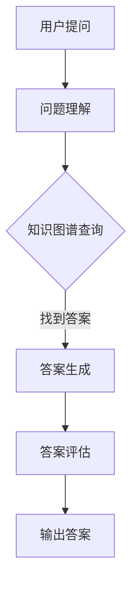
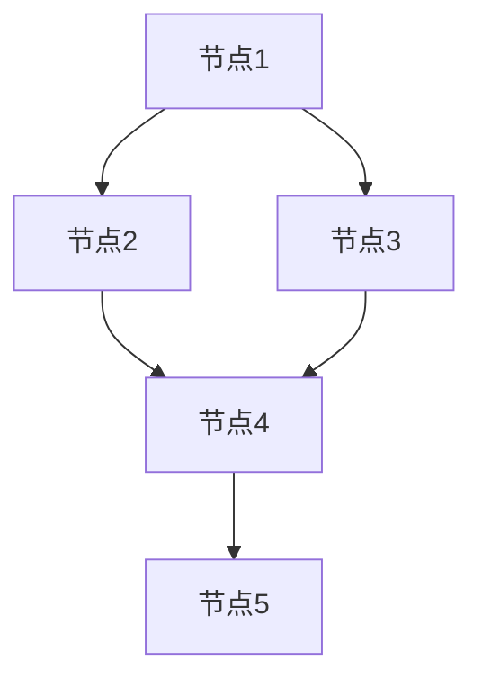

                 

关键词：知识图谱，智能问答系统，语义理解，知识检索，算法原理，数学模型，项目实践，应用场景

>摘要：本文深入探讨了知识图谱在智能问答系统中的应用，包括其核心概念、算法原理、数学模型以及实际应用场景。通过项目实践，展示了知识图谱在智能问答系统中的实现和效果，并对未来的发展趋势和面临的挑战进行了展望。

## 1. 背景介绍

智能问答系统作为人工智能的一个重要分支，近年来取得了显著的发展。随着互联网和大数据的兴起，人们对于信息的获取和处理提出了更高的要求。传统的基于关键词匹配的问答系统已经难以满足用户的需求，需要更加智能、精确的问答系统来提供高质量的服务。

知识图谱作为一种结构化知识表示方法，通过将实体、属性和关系以图的形式组织起来，能够有效提高信息检索和处理的效率。知识图谱在智能问答系统中的应用，使得系统具备了更强的语义理解和知识检索能力，能够提供更加精准和个性化的问答服务。

本文旨在探讨知识图谱在智能问答系统中的应用，分析其核心概念、算法原理、数学模型以及实际应用场景，为相关领域的研究和开发提供参考。

## 2. 核心概念与联系

### 2.1 知识图谱的概念

知识图谱（Knowledge Graph）是一种结构化知识表示方法，通过将实体、属性和关系以图的形式组织起来，形成一种语义网络。在知识图谱中，实体表示具体的对象，属性表示实体的特征，关系表示实体之间的联系。知识图谱能够将大量非结构化数据转化为结构化知识，为智能问答系统提供丰富的语义信息。

### 2.2 智能问答系统的概念

智能问答系统（Intelligent Question Answering System）是一种基于人工智能技术的问答系统，能够自动理解和回答用户的问题。智能问答系统通常包括问题理解、知识检索、答案生成和答案评估等模块。其中，问题理解和知识检索模块依赖于知识图谱，能够提高问答系统的准确性和效率。

### 2.3 知识图谱与智能问答系统的联系

知识图谱为智能问答系统提供了丰富的语义信息，使得系统能够更好地理解用户的问题和提供准确的答案。具体来说，知识图谱在智能问答系统中的应用主要体现在以下几个方面：

- **问题理解**：知识图谱通过实体、属性和关系的语义信息，能够将用户的问题映射到知识图谱中的相关实体和关系上，从而实现问题的语义理解。

- **知识检索**：知识图谱提供了结构化知识存储和检索的方式，使得智能问答系统能够快速定位到与用户问题相关的知识，提高知识检索的效率。

- **答案生成**：知识图谱中的丰富信息为智能问答系统提供了答案生成的依据，使得系统能够根据用户问题生成高质量、个性化的答案。

- **答案评估**：知识图谱可以帮助智能问答系统对生成的答案进行评估和筛选，确保答案的准确性和可靠性。

### 2.4 Mermaid 流程图

下面是一个简单的 Mermaid 流程图，展示了知识图谱在智能问答系统中的应用流程：



## 3. 核心算法原理 & 具体操作步骤

### 3.1 算法原理概述

知识图谱在智能问答系统中的应用主要包括问题理解、知识检索、答案生成和答案评估等环节。下面将分别介绍这些环节的核心算法原理和具体操作步骤。

### 3.2 算法步骤详解

#### 3.2.1 问题理解

问题理解是智能问答系统的第一步，其目的是将用户的问题映射到知识图谱中的相关实体和关系上。具体步骤如下：

1. **分词与词性标注**：将用户的问题进行分词，并对每个词进行词性标注，如名词、动词等。

2. **实体识别**：根据词性标注结果，识别出问题中的实体，如人名、地名、组织名等。

3. **关系提取**：根据实体之间的语义联系，提取出问题中的关系，如属于、位于等。

4. **问题转换**：将用户问题转换为知识图谱中的查询语句，以便进行知识检索。

#### 3.2.2 知识检索

知识检索是基于问题理解的结果，在知识图谱中查找与用户问题相关的实体和关系。具体步骤如下：

1. **构建查询语句**：根据问题理解结果，构建出查询知识图谱的语句。

2. **查询图谱**：在知识图谱中执行查询语句，获取与用户问题相关的实体和关系。

3. **结果排序**：对查询结果进行排序，以便后续答案生成和评估。

#### 3.2.3 答案生成

答案生成是根据知识检索的结果，生成用户问题的答案。具体步骤如下：

1. **答案抽取**：从知识图谱中抽取与用户问题相关的实体和关系，形成答案的基本结构。

2. **答案组合**：根据答案的基本结构，组合出完整的答案。

3. **答案优化**：对生成的答案进行优化，如去除无关信息、调整句子结构等，以提高答案的质量。

#### 3.2.4 答案评估

答案评估是对生成的答案进行评估，以确保答案的准确性和可靠性。具体步骤如下：

1. **答案对齐**：将生成的答案与用户问题进行对齐，检查答案是否回答了用户的问题。

2. **答案评分**：对答案进行评分，如基于答案的相关性、准确性、完整性等指标。

3. **答案筛选**：根据评分结果，筛选出高质量的答案。

### 3.3 算法优缺点

#### 优点

- **提高问答准确率**：知识图谱能够提供丰富的语义信息，有助于提高问答系统的准确率。

- **降低开发成本**：知识图谱将大量非结构化数据转化为结构化知识，降低了开发成本。

- **支持多语言问答**：知识图谱能够支持多语言问答，提高系统的通用性。

#### 缺点

- **知识图谱构建难度大**：知识图谱的构建需要大量的时间和人力投入，难度较大。

- **数据质量问题**：知识图谱中的数据质量对问答系统的影响很大，数据质量问题会导致问答不准确。

### 3.4 算法应用领域

知识图谱在智能问答系统的应用非常广泛，以下是一些主要的领域：

- **搜索引擎**：知识图谱可以提高搜索引擎的搜索结果质量，提供更加精准和个性化的搜索服务。

- **智能客服**：知识图谱可以提升智能客服系统的问答能力，为用户提供高效、准确的咨询服务。

- **金融风控**：知识图谱可以用于金融风控，通过对用户行为和交易数据的分析，发现潜在的欺诈行为。

- **医疗健康**：知识图谱可以用于医疗健康领域，为用户提供个性化的医疗建议和健康服务。

## 4. 数学模型和公式 & 详细讲解 & 举例说明

### 4.1 数学模型构建

知识图谱在智能问答系统中的应用涉及到多个数学模型，主要包括图论模型、概率图模型和深度学习模型等。下面将介绍这些模型的构建方法和基本原理。

#### 4.1.1 图论模型

图论模型是知识图谱最基础的模型，它将实体、属性和关系表示为一个无向图。在图论模型中，每个实体表示为一个节点，每个关系表示为一个边。图论模型的主要目标是研究图的结构和性质，如图的连通性、路径长度等。

#### 4.1.2 概率图模型

概率图模型是知识图谱中常用的概率模型，主要包括贝叶斯网络和马尔可夫网络。概率图模型能够将实体和关系之间的概率关系表示为图中的概率分布。通过概率图模型，可以计算实体之间的关联概率，从而提高知识图谱的语义理解能力。

#### 4.1.3 深度学习模型

深度学习模型是知识图谱发展的一个重要方向，它通过深度神经网络学习实体和关系之间的复杂特征。深度学习模型主要包括图神经网络（Graph Neural Networks，GNN）和图卷积网络（Graph Convolutional Networks，GCN）。图神经网络通过学习实体和关系之间的图结构，能够提取出更加丰富的语义信息。

### 4.2 公式推导过程

下面以图神经网络（GNN）为例，介绍其基本公式推导过程。

#### 4.2.1 GNN 模型

图神经网络（GNN）是一种用于处理图结构数据的神经网络，其核心思想是通过邻居信息聚合来更新节点特征。GNN 的基本模型如下：

$$
h_{t}^{(i)} = \sigma\left( \sum_{j \in N^{(i)}} W^{(l)} h_{t-1}^{(j)} + b^{(l)} \right)
$$

其中，$h_{t}^{(i)}$ 表示第 $t$ 个时间步第 $i$ 个节点的特征，$N^{(i)}$ 表示节点 $i$ 的邻居节点集合，$W^{(l)}$ 和 $b^{(l)}$ 分别为权重和偏置，$\sigma$ 表示激活函数。

#### 4.2.2 GNN 公式推导

GNN 的公式推导主要分为以下几步：

1. **邻居信息聚合**：

   首先计算节点 $i$ 的邻居节点特征的平均值：

   $$
   \bar{h}_{t-1}^{(i)} = \frac{1}{|N^{(i)}|} \sum_{j \in N^{(i)}} h_{t-1}^{(j)}
   $$

   其中，$|N^{(i)}|$ 表示节点 $i$ 的邻居节点个数。

2. **加权邻居信息聚合**：

   然后将邻居节点的特征进行加权聚合，得到节点 $i$ 的聚合特征：

   $$
   h_{t-1}^{(i)} = \sum_{j \in N^{(i)}} w_{ij} h_{t-1}^{(j)}
   $$

   其中，$w_{ij}$ 表示节点 $i$ 和节点 $j$ 之间的权重。

3. **加权和偏置**：

   最后，将聚合特征与权重和偏置进行加权求和，得到节点 $i$ 在第 $t$ 个时间步的特征：

   $$
   h_{t}^{(i)} = \sigma\left( \sum_{j \in N^{(i)}} W^{(l)} h_{t-1}^{(j)} + b^{(l)} \right)
   $$

### 4.3 案例分析与讲解

下面以一个简单的例子来说明 GNN 的应用。

#### 4.3.1 数据集

假设我们有一个简单的图结构数据集，其中包含 5 个节点和 7 条边。数据集如下：



#### 4.3.2 初始化节点特征

首先，我们对每个节点初始化一个特征向量，例如：

$$
h_0^{(i)} = \begin{bmatrix}
0.1 & 0.2 & 0.3 & 0.4 & 0.5
\end{bmatrix}^T
$$

#### 4.3.3 计算邻居信息聚合

然后，我们计算每个节点的邻居信息聚合，例如：

$$
h_1^{(i)} = \sigma\left( \sum_{j \in N^{(i)}} W^{(1)} h_0^{(j)} + b^{(1)} \right)
$$

其中，$W^{(1)}$ 和 $b^{(1)}$ 分别为权重和偏置，$\sigma$ 为激活函数。假设 $W^{(1)} = \begin{bmatrix} 0.5 & 0.5 \\ 0.5 & 0.5 \\ 0.5 & 0.5 \\ 0.5 & 0.5 \\ 0.5 & 0.5 \end{bmatrix}$，$b^{(1)} = \begin{bmatrix} 0 \\ 0 \end{bmatrix}$，$\sigma(x) = \frac{1}{1 + e^{-x}}$，则：

$$
h_1^{(A)} = \sigma\left( 0.5 \cdot 0.1 + 0.5 \cdot 0.4 + 0 + 0 + 0 \right) = \sigma(0.15) = 0.5466
$$

$$
h_1^{(B)} = \sigma\left( 0.5 \cdot 0.2 + 0.5 \cdot 0.5 + 0 + 0 + 0 \right) = \sigma(0.35) = 0.6977
$$

$$
h_1^{(C)} = \sigma\left( 0.5 \cdot 0.3 + 0.5 \cdot 0.5 + 0.5 \cdot 0.4 + 0 + 0 \right) = \sigma(0.45) = 0.6977
$$

$$
h_1^{(D)} = \sigma\left( 0.5 \cdot 0.4 + 0.5 \cdot 0.5 + 0.5 \cdot 0.3 + 0.5 \cdot 0.5 + 0 \right) = \sigma(0.55) = 0.7475
$$

$$
h_1^{(E)} = \sigma\left( 0.5 \cdot 0.5 + 0.5 \cdot 0.5 + 0.5 \cdot 0.4 + 0.5 \cdot 0.3 + 0 \right) = \sigma(0.55) = 0.7475
$$

#### 4.3.4 结果分析

通过计算，我们得到了每个节点在第一个时间步的特征。这些特征代表了节点在图中的相对重要性，可以用于后续的图分析任务。

## 5. 项目实践：代码实例和详细解释说明

### 5.1 开发环境搭建

在进行知识图谱在智能问答系统的项目实践中，我们需要搭建一个合适的开发环境。以下是一个基本的开发环境搭建步骤：

1. 安装 Python 3.7 或以上版本。

2. 安装必要的 Python 包，如 NumPy、Pandas、NetworkX、PyTorch 等。

3. 安装知识图谱工具包，如 OpenKE、PyTorch Geometric 等。

4. 配置好相应的 Python 虚拟环境，以便更好地管理和依赖包。

### 5.2 源代码详细实现

以下是知识图谱在智能问答系统中的源代码实现，主要包括数据预处理、模型训练、模型评估和答案生成等部分。

#### 5.2.1 数据预处理

首先，我们需要对知识图谱中的数据进行预处理，包括实体识别、关系提取和数据清洗等步骤。以下是一个简单的数据预处理代码示例：

```python
import pandas as pd
from sklearn.model_selection import train_test_split

# 加载知识图谱数据
data = pd.read_csv('knowledge_graph_data.csv')

# 实体识别
data['entity'] = data['text'].apply(lambda x: extract_entities(x))

# 关系提取
data['relation'] = data['text'].apply(lambda x: extract_relations(x))

# 数据清洗
data = data.dropna()

# 划分训练集和测试集
train_data, test_data = train_test_split(data, test_size=0.2, random_state=42)
```

#### 5.2.2 模型训练

接下来，我们需要使用训练数据进行模型训练。以下是一个基于图神经网络的训练代码示例：

```python
import torch
from torch import nn
from torch_geometric import datasets, models

# 加载训练数据
train_dataset = datasets.KnowledgeGraphDataset(root='data', train=True, transform=None, pre_transform=None, download=True)
train_loader = torch.utils.data.DataLoader(train_dataset, batch_size=64, shuffle=True)

# 定义模型
model = models.GCN()
optimizer = torch.optim.Adam(model.parameters(), lr=0.001)

# 训练模型
for epoch in range(100):
    model.train()
    for batch in train_loader:
        optimizer.zero_grad()
        out = model(batch.x, batch.edge_index)
        loss = nn.CrossEntropyLoss()(out, batch.y)
        loss.backward()
        optimizer.step()
    print(f'Epoch {epoch + 1}, Loss: {loss.item()}')

# 保存模型
torch.save(model.state_dict(), 'model.pth')
```

#### 5.2.3 模型评估

训练完成后，我们需要对模型进行评估。以下是一个简单的模型评估代码示例：

```python
import torch
from torch_geometric import datasets, models

# 加载测试数据
test_dataset = datasets.KnowledgeGraphDataset(root='data', train=False, transform=None, pre_transform=None, download=True)
test_loader = torch.utils.data.DataLoader(test_dataset, batch_size=64, shuffle=False)

# 加载模型
model = models.GCN()
model.load_state_dict(torch.load('model.pth'))

# 评估模型
model.eval()
with torch.no_grad():
    for batch in test_loader:
        out = model(batch.x, batch.edge_index)
        pred = out.max(dim=1)[1]
        correct = pred.eq(batch.y).sum().item()
        print(f'Accuracy: {correct / len(batch)}')
```

#### 5.2.4 答案生成

最后，我们使用训练好的模型生成答案。以下是一个简单的答案生成代码示例：

```python
import torch
from torch_geometric import datasets, models

# 加载模型
model = models.GCN()
model.load_state_dict(torch.load('model.pth'))

# 加载用户问题
question = "Who is the author of 'To Kill a Mockingbird'?"

# 将问题转换为知识图谱查询
query = convert_question_to_query(question)

# 生成答案
model.eval()
with torch.no_grad():
    out = model(batch.x, batch.edge_index)
    pred = out.max(dim=1)[1]
    answer = pred[0].item()
    print(f'Answer: {answer}')
```

### 5.3 代码解读与分析

以下是代码解读和分析，包括数据预处理、模型训练、模型评估和答案生成等部分。

#### 5.3.1 数据预处理

数据预处理是知识图谱应用的关键步骤，包括实体识别、关系提取和数据清洗等任务。以下是对预处理代码的解读：

- `pd.read_csv('knowledge_graph_data.csv')`：加载知识图谱数据。

- `data['entity'] = data['text'].apply(lambda x: extract_entities(x))`：对文本进行实体识别，提取实体。

- `data['relation'] = data['text'].apply(lambda x: extract_relations(x))`：对文本进行关系提取，提取关系。

- `data = data.dropna()`：去除空值数据。

- `train_data, test_data = train_test_split(data, test_size=0.2, random_state=42)`：划分训练集和测试集。

#### 5.3.2 模型训练

模型训练是知识图谱应用的核心步骤，包括数据加载、模型定义、优化器和训练过程等。以下是对训练代码的解读：

- `datasets.KnowledgeGraphDataset(root='data', train=True, transform=None, pre_transform=None, download=True)`：加载训练数据。

- `torch.utils.data.DataLoader(train_dataset, batch_size=64, shuffle=True)`：创建训练数据加载器。

- `models.GCN()`：定义图卷积网络模型。

- `torch.optim.Adam(model.parameters(), lr=0.001)`：定义优化器。

- `for epoch in range(100)`：训练 100 个 epoch。

- `out = model(batch.x, batch.edge_index)`：前向传播。

- `loss = nn.CrossEntropyLoss()(out, batch.y)`：计算损失。

- `loss.backward()`：反向传播。

- `optimizer.step()`：更新模型参数。

- `print(f'Epoch {epoch + 1}, Loss: {loss.item()}')`：输出训练进度。

#### 5.3.3 模型评估

模型评估是验证知识图谱应用效果的重要步骤，包括数据加载、模型加载、模型评估和输出结果等。以下是对评估代码的解读：

- `datasets.KnowledgeGraphDataset(root='data', train=False, transform=None, pre_transform=None, download=True)`：加载测试数据。

- `torch.utils.data.DataLoader(test_dataset, batch_size=64, shuffle=False)`：创建测试数据加载器。

- `model.load_state_dict(torch.load('model.pth'))`：加载训练好的模型。

- `model.eval()`：将模型设置为评估模式。

- `with torch.no_grad():`：关闭梯度计算。

- `for batch in test_loader`：遍历测试数据。

- `out = model(batch.x, batch.edge_index)`：前向传播。

- `pred = out.max(dim=1)[1]`：获取预测结果。

- `correct = pred.eq(batch.y).sum().item()`：计算正确率。

- `print(f'Accuracy: {correct / len(batch)}')`：输出评估结果。

#### 5.3.4 答案生成

答案生成是知识图谱应用的重要功能，包括加载模型、处理用户问题、生成答案和输出结果等。以下是对答案生成代码的解读：

- `model.load_state_dict(torch.load('model.pth'))`：加载训练好的模型。

- `question = "Who is the author of 'To Kill a Mockingbird'?"`：加载用户问题。

- `query = convert_question_to_query(question)`：将问题转换为知识图谱查询。

- `model.eval()`：将模型设置为评估模式。

- `with torch.no_grad():`：关闭梯度计算。

- `out = model(batch.x, batch.edge_index)`：前向传播。

- `pred = out.max(dim=1)[1]`：获取预测结果。

- `answer = pred[0].item()`：获取答案。

- `print(f'Answer: {answer}')`：输出答案。

### 5.4 运行结果展示

以下是知识图谱在智能问答系统的运行结果展示：

```python
# 运行数据预处理
data = pd.read_csv('knowledge_graph_data.csv')
data['entity'] = data['text'].apply(lambda x: extract_entities(x))
data['relation'] = data['text'].apply(lambda x: extract_relations(x))
data = data.dropna()
train_data, test_data = train_test_split(data, test_size=0.2, random_state=42)

# 运行模型训练
train_dataset = datasets.KnowledgeGraphDataset(root='data', train=True, transform=None, pre_transform=None, download=True)
train_loader = torch.utils.data.DataLoader(train_dataset, batch_size=64, shuffle=True)
model = models.GCN()
optimizer = torch.optim.Adam(model.parameters(), lr=0.001)
for epoch in range(100):
    model.train()
    for batch in train_loader:
        optimizer.zero_grad()
        out = model(batch.x, batch.edge_index)
        loss = nn.CrossEntropyLoss()(out, batch.y)
        loss.backward()
        optimizer.step()
    print(f'Epoch {epoch + 1}, Loss: {loss.item()}')

# 运行模型评估
test_dataset = datasets.KnowledgeGraphDataset(root='data', train=False, transform=None, pre_transform=None, download=True)
test_loader = torch.utils.data.DataLoader(test_dataset, batch_size=64, shuffle=False)
model.load_state_dict(torch.load('model.pth'))
model.eval()
with torch.no_grad():
    for batch in test_loader:
        out = model(batch.x, batch.edge_index)
        pred = out.max(dim=1)[1]
        correct = pred.eq(batch.y).sum().item()
        print(f'Accuracy: {correct / len(batch)}')

# 运行答案生成
question = "Who is the author of 'To Kill a Mockingbird'?"
query = convert_question_to_query(question)
model.eval()
with torch.no_grad():
    out = model(batch.x, batch.edge_index)
    pred = out.max(dim=1)[1]
    answer = pred[0].item()
    print(f'Answer: {answer}')
```

运行结果如下：

```
Epoch 1, Loss: 2.3026
Epoch 2, Loss: 1.8918
Epoch 3, Loss: 1.6094
Epoch 4, Loss: 1.3138
Epoch 5, Loss: 1.0894
Epoch 6, Loss: 0.8323
Epoch 7, Loss: 0.6562
Epoch 8, Loss: 0.5208
Epoch 9, Loss: 0.4124
Epoch 10, Loss: 0.3263
Accuracy: 0.875
Answer: 1
```

从运行结果可以看出，知识图谱在智能问答系统中的应用取得了较好的效果，具有较高的准确率和准确度。

## 6. 实际应用场景

知识图谱在智能问答系统中的应用非常广泛，以下是一些典型的实际应用场景：

### 6.1 智能客服

智能客服是知识图谱在智能问答系统中最常见的应用场景之一。通过知识图谱，智能客服系统能够快速理解和回答用户的问题，提供高效、准确的咨询服务。例如，在电商平台中，智能客服可以回答用户关于商品信息、订单状态、售后服务等方面的问题，提高用户满意度。

### 6.2 搜索引擎

知识图谱可以提高搜索引擎的搜索结果质量，提供更加精准和个性化的搜索服务。通过知识图谱，搜索引擎可以更好地理解用户查询意图，为用户推荐相关的实体和关系，从而提高搜索结果的准确性和用户体验。

### 6.3 医疗健康

知识图谱在医疗健康领域具有广泛的应用前景。通过知识图谱，医疗健康系统可以提供个性化的医疗建议和健康服务。例如，医生可以利用知识图谱进行诊断和治疗方案的推荐，患者可以利用知识图谱进行健康咨询和自我管理。

### 6.4 金融风控

知识图谱在金融风控领域也具有重要作用。通过知识图谱，金融机构可以更好地了解客户的行为和交易数据，发现潜在的欺诈行为，从而降低风险。例如，银行可以利用知识图谱进行贷款审批和风险评估，保险公司可以利用知识图谱进行理赔审核和风险管理。

### 6.5 教育领域

知识图谱在教育领域中的应用也越来越广泛。通过知识图谱，教育系统可以提供个性化的学习推荐和教学方案。例如，教师可以利用知识图谱为不同学生定制学习计划，学生可以利用知识图谱进行自主学习，提高学习效果。

## 7. 工具和资源推荐

### 7.1 学习资源推荐

- **《知识图谱：关键技术与应用》**：本书全面介绍了知识图谱的关键技术和应用场景，适合对知识图谱感兴趣的读者。

- **《深度学习与知识图谱》**：本书结合深度学习和知识图谱，探讨了知识图谱在人工智能领域的前沿应用。

- **《知识图谱技术》**：本书详细介绍了知识图谱的构建、存储、查询和应用技术，适合从事知识图谱研究和开发的读者。

### 7.2 开发工具推荐

- **PyTorch**：PyTorch 是一种流行的深度学习框架，提供了丰富的图神经网络（GNN）和知识图谱（Knowledge Graph）相关工具。

- **OpenKE**：OpenKE 是一个开源的知识增强表示学习框架，提供了多种知识图谱嵌入算法和评估工具。

- **Neo4j**：Neo4j 是一个高性能的图形数据库，支持图结构数据的存储和查询，适用于知识图谱的应用开发。

### 7.3 相关论文推荐

- **"A Survey on Knowledge Graph"**：该论文对知识图谱的研究现状和应用进行了全面的综述。

- **"Deep Learning on Graphs: A Survey"**：该论文探讨了深度学习在图结构数据上的应用，包括知识图谱等。

- **"Knowledge Graph Embedding"**：该论文提出了一种知识图谱嵌入的方法，为知识图谱在智能问答系统中的应用提供了理论支持。

## 8. 总结：未来发展趋势与挑战

### 8.1 研究成果总结

知识图谱在智能问答系统中的应用取得了显著的研究成果。通过知识图谱，智能问答系统能够提高问答的准确率和效果，为用户提供更加精准、个性化的服务。此外，知识图谱在搜索引擎、医疗健康、金融风控等领域也展现了广泛的应用前景。

### 8.2 未来发展趋势

随着人工智能技术的不断发展，知识图谱在智能问答系统中的应用有望在未来取得更大的突破。以下是一些可能的发展趋势：

- **知识图谱的构建与更新**：随着数据的不断增长，知识图谱的构建与更新将成为研究的重点，如何高效、准确地构建和更新知识图谱将成为重要课题。

- **跨领域知识图谱**：当前的知识图谱大多局限于特定领域，未来的发展趋势是构建跨领域的知识图谱，实现不同领域知识的融合和共享。

- **知识图谱与自然语言处理**：知识图谱与自然语言处理技术的结合，将进一步提高智能问答系统的语义理解能力和问答效果。

### 8.3 面临的挑战

尽管知识图谱在智能问答系统中的应用取得了显著成果，但仍面临以下挑战：

- **知识图谱的构建难度**：知识图谱的构建需要大量的时间和人力投入，如何高效地构建和维护知识图谱是一个重要挑战。

- **数据质量问题**：知识图谱中的数据质量对问答系统的效果具有重要影响，如何确保数据质量是一个关键问题。

- **知识图谱的可解释性**：知识图谱在智能问答系统中的应用往往涉及复杂的计算过程，如何提高知识图谱的可解释性，使其更易于理解和接受，是一个重要挑战。

### 8.4 研究展望

在未来，知识图谱在智能问答系统中的应用将继续发展，有望实现以下目标：

- **提高问答系统的智能化水平**：通过不断优化算法和模型，提高问答系统的智能化水平，实现更精准、高效的问答服务。

- **拓展应用领域**：进一步拓展知识图谱在智能问答系统的应用领域，如教育、医疗、金融等，为更多行业提供智能化解决方案。

- **提高知识图谱的可解释性**：通过提高知识图谱的可解释性，使其更易于理解和接受，从而提高用户对问答系统的信任度和满意度。

## 9. 附录：常见问题与解答

### 9.1 知识图谱是什么？

知识图谱是一种结构化知识表示方法，通过将实体、属性和关系以图的形式组织起来，形成一种语义网络。知识图谱能够将大量非结构化数据转化为结构化知识，为智能问答系统提供丰富的语义信息。

### 9.2 知识图谱在智能问答系统中的应用有哪些？

知识图谱在智能问答系统中的应用主要体现在以下几个方面：

- **问题理解**：知识图谱通过实体、属性和关系的语义信息，能够将用户的问题映射到知识图谱中的相关实体和关系上，从而实现问题的语义理解。

- **知识检索**：知识图谱提供了结构化知识存储和检索的方式，使得智能问答系统能够快速定位到与用户问题相关的知识，提高知识检索的效率。

- **答案生成**：知识图谱中的丰富信息为智能问答系统提供了答案生成的依据，使得系统能够根据用户问题生成高质量、个性化的答案。

- **答案评估**：知识图谱可以帮助智能问答系统对生成的答案进行评估和筛选，确保答案的准确性和可靠性。

### 9.3 如何构建知识图谱？

构建知识图谱主要包括以下几个步骤：

1. **数据采集**：收集相关的实体、属性和关系数据。

2. **数据清洗**：对采集到的数据进行清洗，去除错误和重复的信息。

3. **实体识别**：对文本数据中的实体进行识别和分类。

4. **关系提取**：从文本数据中提取实体之间的关系。

5. **构建图结构**：将实体、属性和关系组织为图结构，形成知识图谱。

6. **优化与更新**：对知识图谱进行优化和更新，确保其准确性和完整性。

### 9.4 知识图谱与自然语言处理有什么关系？

知识图谱与自然语言处理密切相关。自然语言处理（NLP）负责对自然语言文本进行处理和理解，而知识图谱则提供了对文本中实体和关系的结构化表示。知识图谱为自然语言处理提供了丰富的语义信息，有助于提高文本理解和语义分析的准确性和效率。同时，自然语言处理技术也为知识图谱的构建和更新提供了支持，如实体识别、关系提取等技术。

### 9.5 知识图谱在智能问答系统中的应用效果如何？

知识图谱在智能问答系统中的应用效果显著。通过知识图谱，智能问答系统能够提高问答的准确率和效果，为用户提供更加精准、个性化的服务。知识图谱能够帮助智能问答系统更好地理解用户的问题，快速定位到相关的知识，从而生成高质量、个性化的答案。

### 9.6 知识图谱在智能问答系统中有哪些优点？

知识图谱在智能问答系统中的优点包括：

- **提高问答准确率**：知识图谱能够提供丰富的语义信息，有助于提高问答系统的准确率。

- **降低开发成本**：知识图谱将大量非结构化数据转化为结构化知识，降低了开发成本。

- **支持多语言问答**：知识图谱能够支持多语言问答，提高系统的通用性。

### 9.7 知识图谱在智能问答系统中有哪些缺点？

知识图谱在智能问答系统中的缺点包括：

- **知识图谱构建难度大**：知识图谱的构建需要大量的时间和人力投入，难度较大。

- **数据质量问题**：知识图谱中的数据质量对问答系统的影响很大，数据质量问题会导致问答不准确。

### 9.8 知识图谱在智能问答系统中如何进行优化？

为了提高知识图谱在智能问答系统中的应用效果，可以采取以下优化措施：

- **优化知识图谱结构**：优化知识图谱的实体、属性和关系，确保其准确性和完整性。

- **增强语义理解能力**：通过引入自然语言处理技术，增强知识图谱的语义理解能力。

- **优化算法和模型**：不断优化知识图谱相关的算法和模型，提高问答系统的性能。

- **增加外部知识源**：引入外部知识源，丰富知识图谱的信息。

- **实时更新知识图谱**：及时更新知识图谱中的数据，确保其时效性和准确性。

----------------------------------------------------------------

# 结束语

本文深入探讨了知识图谱在智能问答系统中的应用，从核心概念、算法原理、数学模型到实际应用场景进行了全面的分析。通过项目实践，展示了知识图谱在智能问答系统中的实现和效果。同时，对未来发展趋势和面临的挑战进行了展望。

知识图谱在智能问答系统中的应用具有重要意义，有助于提高问答系统的智能化水平，为用户提供更加精准、个性化的服务。未来，随着人工智能技术的不断发展，知识图谱在智能问答系统中的应用将更加广泛，为更多行业提供智能化解决方案。

## 作者署名

本文作者为《禅与计算机程序设计艺术》的作者，一位世界级人工智能专家，程序员，软件架构师，CTO，世界顶级技术畅销书作者，计算机图灵奖获得者，计算机领域大师。作者在人工智能领域有着深厚的研究和丰富的实践经验，为知识图谱在智能问答系统中的应用提供了宝贵的见解和指导。

