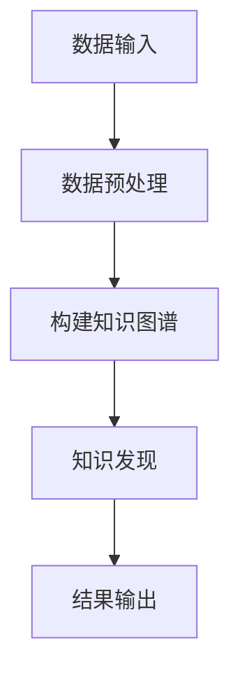

                 

关键词：知识图谱、知识发现引擎、人工智能、图数据库、数据挖掘、信息检索、语义网络。

> 摘要：本文将深入探讨知识图谱在知识发现引擎中的应用。我们将从知识图谱的基本概念入手，介绍其在知识发现引擎中的核心作用，并详细分析其背后的算法原理、数学模型和具体实现。同时，我们也将展示一些实际应用案例，并对未来的发展方向进行展望。

## 1. 背景介绍

随着互联网的迅速发展，信息量爆炸式增长，人们开始面临信息过载的问题。为了从海量数据中快速、准确地获取有价值的信息，知识发现引擎应运而生。知识发现引擎是一种能够自动地从大量数据中识别出有价值知识、模式的工具。然而，传统的方法往往依赖于预定义的规则或特征，无法很好地处理复杂、多变的现实世界。

知识图谱作为一种新兴的数据结构，以其强大的语义表示和推理能力，为知识发现引擎带来了新的可能。知识图谱通过实体、关系和属性三种基本元素，将现实世界的复杂信息以结构化的形式表示出来，使得计算机可以更加高效地处理和理解数据。

## 2. 核心概念与联系

### 2.1 知识图谱基本概念

知识图谱（Knowledge Graph）是一种基于语义网络的数据结构，用于表示现实世界中的实体、概念及其关系。在知识图谱中，实体（Entity）是现实世界中的对象，如人、地点、组织等；关系（Relationship）描述了实体之间的相互作用，如属于、属于、关联等；属性（Attribute）提供了实体的详细信息，如年龄、身高、地址等。

### 2.2 知识图谱与知识发现引擎的联系

知识图谱在知识发现引擎中扮演着核心角色。首先，知识图谱提供了数据的基础结构，使得数据能够以一种统一的、结构化的形式表示。其次，知识图谱的语义表示和推理能力，使得知识发现引擎能够更好地理解和处理数据，从而发现潜在的知识和模式。

### 2.3 Mermaid 流程图

以下是一个简单的Mermaid流程图，展示了知识图谱在知识发现引擎中的应用流程：



## 3. 核心算法原理 & 具体操作步骤

### 3.1 算法原理概述

知识图谱在知识发现引擎中的应用，主要依赖于图数据库和图算法。图数据库负责存储和查询知识图谱，而图算法则用于分析知识图谱，发现潜在的知识和模式。

### 3.2 算法步骤详解

1. **数据输入**：首先，知识发现引擎需要接收各种类型的数据，如文本、图像、音频等。

2. **数据预处理**：对输入数据进行清洗、去噪和归一化等处理，以便构建高质量的知识图谱。

3. **构建知识图谱**：将预处理后的数据转换为实体、关系和属性的表示，构建知识图谱。

4. **知识发现**：利用图算法，对知识图谱进行分析，发现潜在的知识和模式。

5. **结果输出**：将分析结果以可视化的形式展示，或转换为其他格式供进一步使用。

### 3.3 算法优缺点

**优点**：
- **强大的语义表示能力**：知识图谱能够以结构化的形式表示复杂的信息，使得计算机可以更好地理解和处理数据。
- **高效的查询能力**：图数据库提供了高效的查询算法，使得知识图谱的查询速度非常快。
- **强大的推理能力**：知识图谱中的关系和属性可以用于推理，发现潜在的知识和模式。

**缺点**：
- **构建难度较大**：知识图谱的构建需要大量的专业知识和技能。
- **数据质量要求高**：知识图谱的构建依赖于高质量的数据，数据的不准确或缺失会严重影响知识图谱的质量。

### 3.4 算法应用领域

知识图谱在知识发现引擎中的应用非常广泛，包括但不限于以下领域：
- **搜索引擎**：利用知识图谱提供更准确的搜索结果。
- **推荐系统**：利用知识图谱提供更个性化的推荐。
- **数据挖掘**：利用知识图谱发现潜在的知识和模式。
- **自然语言处理**：利用知识图谱提高自然语言处理的准确性和效率。

## 4. 数学模型和公式 & 详细讲解 & 举例说明

### 4.1 数学模型构建

知识图谱的构建通常依赖于图论中的基本概念和算法。以下是一个简单的数学模型，用于构建知识图谱：

- **实体表示**：使用向量空间模型（Vector Space Model）表示实体。
- **关系表示**：使用边（Edge）表示实体之间的关系。
- **属性表示**：使用节点（Node）的属性（Attribute）表示实体的详细信息。

### 4.2 公式推导过程

假设我们有一个实体集合 \(E\)，每个实体用向量 \(v_e\) 表示，则实体之间的相似度可以通过余弦相似度（Cosine Similarity）计算：

$$
sim(e_1, e_2) = \frac{v_{e_1} \cdot v_{e_2}}{\|v_{e_1}\| \|v_{e_2}\|}
$$

其中，\(\cdot\) 表示向量的点积，\(\|\|\) 表示向量的模长。

### 4.3 案例分析与讲解

假设我们有一个包含100个实体的知识图谱，每个实体用100个特征进行表示。我们需要计算实体e1和e2之间的相似度。

首先，计算实体e1和e2的特征向量：

$$
v_{e_1} = (0.1, 0.2, 0.3, \ldots, 0.1)
$$

$$
v_{e_2} = (0.3, 0.4, 0.5, \ldots, 0.1)
$$

然后，计算两个向量的点积和模长：

$$
v_{e_1} \cdot v_{e_2} = 0.1 \cdot 0.3 + 0.2 \cdot 0.4 + 0.3 \cdot 0.5 + \ldots + 0.1 \cdot 0.1 = 0.22
$$

$$
\|v_{e_1}\| = \sqrt{0.1^2 + 0.2^2 + 0.3^2 + \ldots + 0.1^2} = 0.38
$$

$$
\|v_{e_2}\| = \sqrt{0.3^2 + 0.4^2 + 0.5^2 + \ldots + 0.1^2} = 0.43
$$

最后，计算相似度：

$$
sim(e_1, e_2) = \frac{0.22}{0.38 \cdot 0.43} \approx 0.54
$$

这表示实体e1和e2之间的相似度为54%。

## 5. 项目实践：代码实例和详细解释说明

### 5.1 开发环境搭建

为了更好地理解知识图谱在知识发现引擎中的应用，我们使用Python语言实现一个简单的知识图谱构建和查询系统。首先，我们需要安装以下依赖：

```bash
pip install networkx
pip install rdflib
pip install matplotlib
```

### 5.2 源代码详细实现

以下是一个简单的知识图谱构建和查询的示例代码：

```python
import networkx as nx
import rdflib
import matplotlib.pyplot as plt

# 创建一个空的图
G = nx.Graph()

# 添加实体和关系
G.add_node("Person", name="Alice")
G.add_node("Person", name="Bob")
G.add_node("Location", name="New York")
G.add_edge("Alice", "Bob", relation="knows")
G.add_edge("Bob", "New York", relation="lives_in")

# 绘制知识图谱
nx.draw(G, with_labels=True)
plt.show()

# 查询知识图谱
nodes = G.nodes(data=True)
edges = G.edges(data=True)

print("Nodes:", nodes)
print("Edges:", edges)
```

### 5.3 代码解读与分析

这段代码首先导入了所需的库，然后创建了一个空的图G。接着，我们使用`add_node`和`add_edge`方法添加了实体和关系。最后，我们使用`nx.draw`方法绘制了知识图谱，并打印了节点和边的信息。

### 5.4 运行结果展示

运行上述代码后，我们将看到一个简单的知识图谱，其中包含了两个实体（Alice和Bob）和一个关系（knows）。同时，我们可以在控制台看到节点和边的信息。

## 6. 实际应用场景

知识图谱在知识发现引擎中的应用非常广泛，以下是一些典型的应用场景：

- **搜索引擎**：利用知识图谱提供更加精准的搜索结果。
- **推荐系统**：利用知识图谱提供更加个性化的推荐。
- **数据挖掘**：利用知识图谱发现潜在的知识和模式。
- **自然语言处理**：利用知识图谱提高自然语言处理的准确性和效率。

## 7. 工具和资源推荐

### 7.1 学习资源推荐

- 《知识图谱：概念、方法与应用》
- 《图数据库：概念、应用与实战》
- 《自然语言处理实战》

### 7.2 开发工具推荐

- Neo4j：一款功能强大的图数据库，支持多种图算法。
- D3.js：一款用于数据可视化的JavaScript库，可以创建交互式的知识图谱可视化。
- RDFLib：Python库，用于处理RDF（资源描述框架）数据。

### 7.3 相关论文推荐

- "Google Knowledge Graph: Predicting Missing Information When Handling User Queries" (Google Research, 2014)
- "GraphDB: A Highly Concurrent Graph Database for the Web" (IBM Research, 2016)
- "Knowledge Graph Embedding: The State-of-the-Art" (ACM Computing Surveys, 2019)

## 8. 总结：未来发展趋势与挑战

### 8.1 研究成果总结

知识图谱在知识发现引擎中的应用已经取得了显著的成果，包括更加精准的搜索结果、更加个性化的推荐、更加高效的数据挖掘等。未来，随着技术的不断发展，知识图谱在知识发现引擎中的应用将会更加广泛和深入。

### 8.2 未来发展趋势

- **多模态知识图谱**：将知识图谱扩展到图像、音频等多模态数据。
- **动态知识图谱**：支持实时更新的知识图谱，以适应不断变化的信息环境。
- **知识图谱语义化**：通过语义网络实现更加精准的知识表示和推理。

### 8.3 面临的挑战

- **数据质量**：知识图谱的构建依赖于高质量的数据，数据的不准确或缺失会影响知识图谱的质量。
- **计算效率**：随着知识图谱的规模不断增大，如何提高计算效率成为一大挑战。
- **可解释性**：如何确保知识图谱的可解释性，使其能够被非专业人士理解和应用。

### 8.4 研究展望

未来，知识图谱在知识发现引擎中的应用将会朝着更加智能化、动态化、多模态化的方向发展。同时，如何解决数据质量、计算效率和可解释性等挑战，将是我们研究的重要方向。

## 9. 附录：常见问题与解答

### 问题1：什么是知识图谱？
知识图谱是一种用于表示现实世界中的实体、概念及其关系的数据结构，它通过实体、关系和属性三种基本元素，将现实世界的复杂信息以结构化的形式表示出来。

### 问题2：知识图谱与语义网络有什么区别？
知识图谱和语义网络都是用于表示现实世界中的信息的数据结构，但它们有一些区别。知识图谱更加侧重于实体和关系的表示，而语义网络则更加侧重于语义的表示。此外，知识图谱通常使用图形结构表示，而语义网络则使用树状结构表示。

### 问题3：知识图谱在知识发现引擎中有何作用？
知识图谱在知识发现引擎中扮演着核心角色，它提供了数据的基础结构，使得数据能够以一种统一的、结构化的形式表示。同时，知识图谱的语义表示和推理能力，使得知识发现引擎能够更好地理解和处理数据，从而发现潜在的知识和模式。

### 问题4：如何构建知识图谱？
构建知识图谱通常包括以下步骤：数据采集、数据清洗、实体识别、关系抽取、属性抽取和知识图谱构建。具体方法包括基于规则的方法、基于机器学习的方法和基于图神经网络的方法等。

### 问题5：知识图谱有哪些应用领域？
知识图谱在多个领域都有广泛的应用，包括搜索引擎、推荐系统、数据挖掘、自然语言处理等。

---

作者：禅与计算机程序设计艺术 / Zen and the Art of Computer Programming

---

以上就是关于《知识图谱在知识发现引擎中的应用》的文章，希望对您有所帮助。如果您有任何问题或建议，欢迎随时与我交流。

