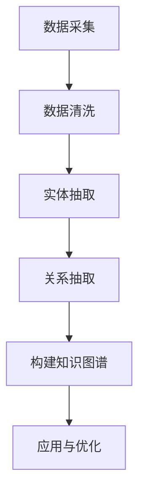

                 

 **关键词**: 知识图谱、程序员技能图谱、知识表示、图算法、人工智能

> **摘要**: 本文将探讨如何利用知识图谱技术构建程序员技能图谱，介绍知识图谱在程序员技能领域中的应用，包括核心概念、算法原理、数学模型以及项目实践等。通过分析知识图谱的构建方法和应用场景，为程序员技能图谱的构建提供理论指导和实践参考。

## 1. 背景介绍

### 1.1 程序员技能图谱的意义

程序员技能图谱是一种用于描述程序员技能及其相互关系的知识体系。它不仅有助于个人了解和提升自身技能，还可以为企业和教育机构提供招聘、培训和人才管理的有力支持。然而，传统的技能图谱构建方法存在一些局限性，如数据分散、关系难以维护等。

### 1.2 知识图谱的发展

知识图谱（Knowledge Graph）是一种用于表示实体及其相互关系的图形结构，起源于语义网（Semantic Web）的概念。随着大数据、人工智能等技术的发展，知识图谱在多个领域得到了广泛应用，如搜索引擎、推荐系统、智能问答等。

### 1.3 知识图谱在程序员技能图谱构建中的应用

知识图谱为程序员技能图谱的构建提供了一种有效的技术手段。通过将程序员技能及其关系建模为知识图谱，可以实现技能的快速检索、分析和管理，从而提升技能图谱的实用性和可扩展性。

## 2. 核心概念与联系

### 2.1 实体与关系

在知识图谱中，实体（Entity）是具有独立存在的个体，如程序员、技能、项目等。关系（Relationship）是实体之间的相互作用，如“程序员掌握技能”、“项目采用技术”等。

### 2.2 知识图谱的表示方法

知识图谱通常采用三元组（Subject, Predicate, Object）的形式表示，其中Subject和Object表示实体，Predicate表示实体之间的关系。

### 2.3 Mermaid流程图

以下是一个Mermaid流程图，用于展示程序员技能图谱的构建过程：



### 2.4 知识图谱的层次结构

知识图谱通常包括三个层次：底层（数据层）、中层（模型层）和高层（应用层）。底层负责存储原始数据；中层负责构建知识图谱模型；高层负责将知识图谱应用于实际问题。

## 3. 核心算法原理 & 具体操作步骤

### 3.1 算法原理概述

构建程序员技能图谱的核心算法主要包括数据采集、数据清洗、实体抽取和关系抽取等。这些算法分别负责获取数据、处理数据、提取实体和关系，并最终构建知识图谱。

### 3.2 算法步骤详解

#### 3.2.1 数据采集

数据采集是构建程序员技能图谱的第一步。数据来源包括开源代码、博客文章、项目描述等。通过爬虫、API等方式，可以从互联网上获取大量与程序员技能相关的数据。

#### 3.2.2 数据清洗

数据清洗是确保数据质量的重要步骤。主要包括去除重复数据、填补缺失值、处理噪声数据等。数据清洗后，数据将更加干净、完整和可靠。

#### 3.2.3 实体抽取

实体抽取是从原始数据中识别出与程序员技能相关的实体，如程序员、技能、项目等。实体抽取通常采用命名实体识别（Named Entity Recognition，NER）技术。

#### 3.2.4 关系抽取

关系抽取是从原始数据中识别出实体之间的关系，如“程序员掌握技能”、“项目采用技术”等。关系抽取通常采用依赖解析（Dependency Parsing）技术。

#### 3.2.5 构建知识图谱

在完成实体抽取和关系抽取后，将实体和关系组织成知识图谱。知识图谱的构建可以采用基于图数据库（如Neo4j）或图计算框架（如GraphX）的方法。

### 3.3 算法优缺点

#### 优点：

- **高效性**：知识图谱通过表示实体及其关系，可以快速地进行数据检索和分析。
- **可扩展性**：知识图谱可以根据实际需求进行动态调整，以适应不断变化的数据环境。
- **灵活性**：知识图谱支持多种算法和工具，可以满足不同的应用场景。

#### 缺点：

- **复杂性**：知识图谱的构建和优化需要较高的技术门槛。
- **数据质量**：数据质量对知识图谱的准确性有重要影响，数据清洗和预处理过程复杂。

### 3.4 算法应用领域

知识图谱在程序员技能图谱构建中的应用主要包括以下几个方面：

- **技能检索**：基于知识图谱，可以快速地找到具有特定技能的程序员。
- **技能分析**：通过对知识图谱中的关系进行分析，可以了解程序员技能的分布和趋势。
- **人才推荐**：根据知识图谱中的关系，可以为企业和教育机构提供人才推荐服务。

## 4. 数学模型和公式

### 4.1 数学模型构建

在程序员技能图谱构建过程中，常用的数学模型包括：

- **概率图模型**：用于建模实体之间的关系，如贝叶斯网络。
- **图神经网络**：用于学习实体和关系之间的复杂关系，如图卷积网络（GCN）。

### 4.2 公式推导过程

假设我们使用图卷积网络（GCN）来学习程序员技能图谱中的关系，其公式推导如下：

$$
\mathbf{h}_i^{(l+1)} = \sigma (\mathbf{D}^{-\frac{1}{2}} \mathbf{A} \mathbf{D}^{-\frac{1}{2}} \mathbf{h}_i^{(l)})
$$

其中，$\mathbf{h}_i^{(l)}$ 表示第 $i$ 个实体在第 $l$ 层的特征表示，$\mathbf{A}$ 表示邻接矩阵，$\mathbf{D}$ 表示度矩阵，$\sigma$ 表示激活函数。

### 4.3 案例分析与讲解

以某知名互联网公司的程序员技能图谱为例，我们分析如下：

- **技能分布**：通过知识图谱分析，发现公司程序员主要掌握前端、后端和数据库等技能。
- **技能关系**：知识图谱揭示了程序员之间技能的依赖关系，如前端程序员通常需要掌握HTML、CSS和JavaScript等技能。
- **人才推荐**：根据知识图谱，可以为公司推荐具有特定技能的程序员，以支持业务发展。

## 5. 项目实践：代码实例和详细解释说明

### 5.1 开发环境搭建

- **工具**：Python、Neo4j、GraphX等。
- **依赖**：numpy、pandas、neo4j-python-driver等。

### 5.2 源代码详细实现

以下是一个简单的示例代码，用于构建程序员技能图谱：

```python
import pandas as pd
from neo4j import GraphDatabase

# 连接Neo4j数据库
driver = GraphDatabase.driver("bolt://localhost:7687", auth=("neo4j", "password"))

# 创建数据库连接
session = driver.session()

# 导入数据
data = pd.read_csv("data.csv")

# 插入实体和关系
for index, row in data.iterrows():
    session.run("CREATE (p:Person {name: $name, skill: $skill})", name=row["name"], skill=row["skill"])
    session.run("MATCH (p:Person), (s:Skill) WHERE p.skill = s.name CREATE (p)-[:KNOWS]->(s)")

# 关闭数据库连接
session.close()
driver.close()
```

### 5.3 代码解读与分析

以上代码实现了以下功能：

1. **连接Neo4j数据库**：使用neo4j-python-driver库连接到本地Neo4j数据库。
2. **导入数据**：使用pandas库读取CSV文件，其中包含程序员姓名和技能信息。
3. **插入实体和关系**：通过Cypher查询语言，将数据插入到Neo4j数据库中，创建“Person”和“Skill”节点，并建立“KNOWS”关系。

### 5.4 运行结果展示

运行以上代码后，Neo4j数据库中将创建以下数据结构：

- **节点**：Person（包含姓名和技能属性）、Skill（包含技能名称属性）。
- **关系**：KNOWS（表示程序员掌握技能）。

## 6. 实际应用场景

### 6.1 技能检索

通过知识图谱，可以快速找到具有特定技能的程序员，如“掌握Java技能的程序员”。

### 6.2 技能分析

通过对知识图谱中的关系进行分析，可以了解程序员技能的分布和趋势，如“前端技能在程序员中的普及程度”。

### 6.3 人才推荐

根据知识图谱，可以为企业和教育机构推荐具有特定技能的程序员，以支持业务发展和人才培养。

## 7. 未来应用展望

随着人工智能、大数据等技术的发展，知识图谱在程序员技能图谱构建中的应用将更加广泛。未来，我们可以期待以下发展趋势：

- **智能搜索**：利用知识图谱实现更加智能的技能检索。
- **技能预测**：基于知识图谱进行技能预测，帮助程序员规划职业发展。
- **个性化推荐**：根据程序员的知识图谱，提供个性化的学习资源和培训建议。

## 8. 总结：未来发展趋势与挑战

### 8.1 研究成果总结

本文介绍了知识图谱在程序员技能图谱构建中的应用，包括核心概念、算法原理、数学模型以及项目实践等。通过分析知识图谱的构建方法和应用场景，为程序员技能图谱的构建提供了理论指导和实践参考。

### 8.2 未来发展趋势

- **智能化**：知识图谱与人工智能技术的深度融合，实现更加智能的技能检索、分析和推荐。
- **标准化**：知识图谱的标准化和规范化，提高数据质量和互操作性。

### 8.3 面临的挑战

- **数据质量**：数据质量对知识图谱的准确性有重要影响，需要加强数据清洗和预处理。
- **算法优化**：知识图谱的构建和优化需要更高的算法性能和效率。

### 8.4 研究展望

未来，我们可以继续探索以下研究方向：

- **跨领域知识图谱构建**：将知识图谱应用于不同领域，实现技能图谱的跨领域应用。
- **知识图谱可视化**：开发可视化工具，帮助用户更好地理解和分析知识图谱。

## 9. 附录：常见问题与解答

### 9.1 知识图谱与语义网的关系是什么？

知识图谱是语义网的一种实现方式，它通过表示实体及其关系，为语义网提供了更加结构化和可操作化的数据表示。

### 9.2 知识图谱在程序员技能图谱构建中的应用有哪些？

知识图谱在程序员技能图谱构建中的应用主要包括技能检索、技能分析和人才推荐等。

### 9.3 知识图谱构建中的数据来源有哪些？

知识图谱构建中的数据来源包括开源代码、博客文章、项目描述等。

### 9.4 知识图谱构建中的算法有哪些？

知识图谱构建中常用的算法包括概率图模型、图神经网络等。

作者：禅与计算机程序设计艺术 / Zen and the Art of Computer Programming
```

