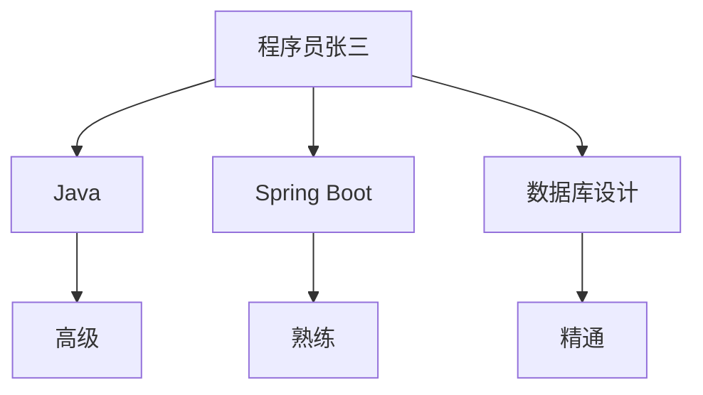

                 

在当今高度信息化和全球化的时代，技术人才的能力评估变得越来越复杂且关键。传统的技能评估方法通常依赖于笔试、面试等传统的评估手段，这些方法存在诸多局限性，如评估的主观性、评估的全面性不足等。随着知识图谱技术的发展，一种新的技能评估方法逐渐崭露头角，即利用知识图谱对程序员技能进行评估。本文将探讨知识图谱在程序员技能评估中的应用，旨在为企业和教育机构提供一种高效、精准的评估工具。

## 文章关键词

- 知识图谱
- 程序员技能评估
- 人工智能
- 技术人才
- 数据分析

## 文章摘要

本文首先介绍了知识图谱的基本概念和构建方法，接着详细阐述了知识图谱在程序员技能评估中的具体应用，包括技能图谱的构建、评估指标的设定以及评估算法的实现。随后，通过一个实际项目案例展示了知识图谱在程序员技能评估中的效果。最后，对知识图谱在技能评估领域的未来发展方向进行了展望。

### 1. 背景介绍

随着互联网和信息技术的快速发展，软件开发成为了推动社会进步的重要力量。程序员作为技术人才的核心，其技能水平和能力直接关系到项目的成功与否。然而，传统的技能评估方法往往存在以下问题：

- **主观性较强**：评估结果依赖于评估者个人经验和判断，难以保证公平性和准确性。
- **评估维度有限**：传统的评估方法往往只能考察程序员某一方面的技能，无法全面评估其综合素质。
- **评估效率低下**：手工评估需要大量时间和人力资源，效率较低。

为了解决上述问题，知识图谱作为一种强大的数据管理和分析工具，逐渐被引入到程序员技能评估中。知识图谱通过将程序员技能、项目经验、教育背景等多维度数据组织起来，形成一个结构化的知识体系，从而为技能评估提供了一种新的思路。

### 2. 核心概念与联系

#### 2.1 知识图谱的基本概念

知识图谱（Knowledge Graph）是一种结构化数据模型，它通过实体、属性和关系的表示，将海量、异构的数据组织成一个统一的知识体系。知识图谱的核心概念包括：

- **实体（Entity）**：知识图谱中的基本元素，如人物、地点、组织等。
- **属性（Attribute）**：实体的特征描述，如姓名、年龄、职位等。
- **关系（Relationship）**：实体之间的关联，如好友、同事、下属等。

知识图谱的基本架构如下：


#### 2.2 知识图谱在程序员技能评估中的应用

在程序员技能评估中，知识图谱可以用于构建一个详细的技能图谱，通过实体、属性和关系的表示，将程序员的技能、项目经验、教育背景等信息结构化。以下是一个简单的知识图谱表示示例：



在这个知识图谱中，实体为“程序员张三”，属性为他的技能点，关系表示了不同技能之间的关联。

### 3. 核心算法原理 & 具体操作步骤

#### 3.1 算法原理概述

知识图谱在程序员技能评估中的应用主要包括以下几个步骤：

1. **数据收集**：收集程序员的个人信息、项目经验、教育背景等数据。
2. **数据清洗**：对收集到的数据进行清洗，去除重复、错误和不完整的数据。
3. **知识图谱构建**：将清洗后的数据构建成知识图谱，通过实体、属性和关系的表示，形成一个结构化的知识体系。
4. **评估指标设定**：根据业务需求，设定相应的评估指标，如技能水平、项目贡献度等。
5. **评估算法实现**：利用图论算法、机器学习算法等，对知识图谱中的数据进行处理和评估，得到最终的评估结果。

#### 3.2 算法步骤详解

1. **数据收集**：

   数据收集可以通过多种途径进行，如项目管理系统、代码托管平台、简历数据库等。收集的数据包括：

   - 程序员个人信息：姓名、性别、年龄、学历、工作经验等。
   - 项目经验：项目名称、项目描述、项目角色、项目技能等。
   - 教育背景：学校、专业、学位等。

2. **数据清洗**：

   数据清洗是保证知识图谱质量的关键步骤。主要工作包括：

   - 去重：去除重复的数据项。
   - 填补缺失值：使用统计方法或机器学习方法填补缺失的数据。
   - 错误修正：修正错误的数据项。

3. **知识图谱构建**：

   知识图谱的构建主要包括以下步骤：

   - 实体识别：从数据中识别出实体，如程序员、项目、技能等。
   - 属性提取：从数据中提取实体的属性，如姓名、性别、技能等级等。
   - 关系抽取：从数据中抽取实体之间的关系，如参与项目、拥有技能等。

4. **评估指标设定**：

   根据业务需求，设定相应的评估指标。常见的评估指标包括：

   - 技能水平：根据程序员的技能点，设定不同的等级，如初级、中级、高级等。
   - 项目贡献度：根据程序员的在项目中承担的角色和贡献，设定相应的贡献度。

5. **评估算法实现**：

   评估算法的实现可以根据具体业务需求选择合适的算法。常见的算法包括：

   - 图论算法：如最短路径算法、最小生成树算法等，用于计算实体之间的距离和关系。
   - 机器学习算法：如分类算法、聚类算法等，用于对实体进行分类和聚类。

#### 3.3 算法优缺点

**优点**：

- **全面性**：知识图谱可以整合多维度数据，全面评估程序员的技能和能力。
- **准确性**：通过算法分析，可以减少评估的主观性，提高评估的准确性。
- **效率高**：知识图谱可以对大量数据进行快速处理和评估，提高评估效率。

**缺点**：

- **数据质量要求高**：知识图谱的质量依赖于数据的质量，数据清洗和预处理的工作量大。
- **算法复杂性**：评估算法的实现相对复杂，需要专业的技术和经验。

#### 3.4 算法应用领域

知识图谱在程序员技能评估中的应用广泛，包括：

- **企业招聘**：企业可以利用知识图谱对求职者进行技能评估，快速筛选合适的候选人。
- **人才管理**：企业可以利用知识图谱对内部员工进行技能评估，优化人才配置和培训计划。
- **教育培训**：教育机构可以利用知识图谱对学生进行技能评估，针对性地提供课程和指导。

### 4. 数学模型和公式 & 详细讲解 & 举例说明

在知识图谱的构建和评估过程中，数学模型和公式起到了关键作用。下面将详细讲解数学模型和公式的构建过程，并通过实例进行说明。

#### 4.1 数学模型构建

在程序员技能评估中，常见的数学模型包括：

1. **技能层次模型**：

   技能层次模型用于设定不同技能的等级，如初级、中级、高级等。常见的模型包括：

   - 线性模型：将技能点分为不同等级，每个等级对应一个分数。
   - 对数模型：将技能点分为不同等级，每个等级对应的分数成对数关系。

2. **贡献度模型**：

   贡献度模型用于计算程序员在项目中的贡献度。常见的模型包括：

   - 加权平均模型：根据程序员在项目中的角色和贡献度，计算总贡献度。
   - 贝叶斯模型：根据历史数据和概率分布，计算程序员的贡献度。

3. **图论模型**：

   图论模型用于计算实体之间的距离和关系。常见的模型包括：

   - 最短路径模型：计算实体之间的最短路径。
   - 最小生成树模型：计算实体之间的最小生成树。

#### 4.2 公式推导过程

以下以技能层次模型为例，说明公式的推导过程。

1. **线性模型**：

   线性模型的基本公式为：

   $$ f(x) = w_1 \cdot x_1 + w_2 \cdot x_2 + ... + w_n \cdot x_n $$

   其中，$x_i$ 表示第 $i$ 个技能点的得分，$w_i$ 表示第 $i$ 个技能点的权重。

   推导过程：

   - 设定每个技能点的得分范围，如 0-100 分。
   - 根据业务需求，设定不同技能点的权重，如 Java 技能的权重为 0.4，数据库设计的权重为 0.3。
   - 根据得分和权重，计算总分。

2. **对数模型**：

   对数模型的基本公式为：

   $$ f(x) = w_1 \cdot \ln(x_1) + w_2 \cdot \ln(x_2) + ... + w_n \cdot \ln(x_n) $$

   其中，$x_i$ 表示第 $i$ 个技能点的得分，$w_i$ 表示第 $i$ 个技能点的权重。

   推导过程：

   - 设定每个技能点的得分范围，如 0-100 分。
   - 根据业务需求，设定不同技能点的权重，如 Java 技能的权重为 0.4，数据库设计的权重为 0.3。
   - 将得分转换为对数形式，计算总分。

#### 4.3 案例分析与讲解

以下以一个实际项目案例，说明知识图谱在程序员技能评估中的应用。

**案例背景**：

某科技公司需要对内部员工进行技能评估，以优化人才配置和培训计划。公司提供了员工的个人信息、项目经验和技能点数据。

**数据收集**：

公司从项目管理系统和代码托管平台收集了以下数据：

- 程序员个人信息：姓名、性别、年龄、学历、工作经验等。
- 项目经验：项目名称、项目描述、项目角色、项目技能等。
- 技能点：Java、Spring Boot、数据库设计、前端开发等。

**数据清洗**：

- 去除重复的数据项。
- 填补缺失的数据项。
- 修正错误的数据项。

**知识图谱构建**：

根据收集的数据，构建了一个知识图谱，包括以下实体和关系：

- 实体：程序员、项目、技能点。
- 关系：参与项目、拥有技能。

**评估指标设定**：

- 技能水平：根据技能点得分，设定不同等级，如初级、中级、高级。
- 项目贡献度：根据项目角色和贡献度，设定不同等级，如初级贡献者、中级贡献者、高级贡献者。

**评估算法实现**：

- 使用线性模型计算技能水平得分。
- 使用加权平均模型计算项目贡献度得分。
- 结合技能水平和项目贡献度，计算总得分。

**评估结果**：

根据评估结果，公司对员工进行了分类，并制定了相应的培训计划。例如，对于技能水平较高的员工，公司提供了高级培训课程，以进一步提升其技能；对于项目贡献度较高的员工，公司提供了额外的奖金和晋升机会。

### 5. 项目实践：代码实例和详细解释说明

在下面的小节中，我们将通过一个实际项目来展示如何使用知识图谱进行程序员技能评估。我们将从开发环境搭建开始，逐步介绍源代码的实现、代码解读与分析，以及最终的运行结果展示。

#### 5.1 开发环境搭建

为了实现知识图谱在程序员技能评估中的应用，我们需要搭建一个合适的开发环境。以下是所需的环境和工具：

- **Python**：用于编写代码，进行数据处理和算法实现。
- **Neo4j**：一个高性能的图形数据库，用于存储和管理知识图谱。
- **Py2neo**：Python的Neo4j驱动程序，用于在Python中操作Neo4j数据库。
- **Gephi**：用于可视化知识图谱。
- **Jupyter Notebook**：用于编写和运行代码。

首先，我们需要在本地计算机上安装这些环境和工具。以下是安装步骤：

1. 安装Python（版本3.8或更高）。
2. 安装Neo4j，并启动Neo4j数据库。
3. 安装Py2neo。
4. 安装Gephi。
5. 安装Jupyter Notebook。

安装完成后，确保Neo4j数据库正常运行，并能够在Python中通过Py2neo进行连接和操作。

#### 5.2 源代码详细实现

以下是一个简单的Python代码示例，用于构建知识图谱并进行程序员技能评估。

```python
from py2neo import Graph
from py2neo import Node, Relationship

# 连接Neo4j数据库
graph = Graph("bolt://localhost:7687", auth=("neo4j", "password"))

# 创建实体节点
def create_entity(name, entity_type):
    node = Node(entity_type, name=name)
    graph.create(node)

# 创建关系
def create_relationship(entity1, relation, entity2):
    relationship = Relationship(entity1, relation, entity2)
    graph.create(relationship)

# 构建技能图谱
def build_skill_graph():
    create_entity("张三", "程序员")
    create_entity("Java", "技能")
    create_entity("Spring Boot", "技能")
    create_entity("数据库设计", "技能")

    create_relationship("张三", "拥有", "Java")
    create_relationship("张三", "拥有", "Spring Boot")
    create_relationship("张三", "拥有", "数据库设计")

# 执行构建技能图谱
build_skill_graph()
```

上述代码首先连接到Neo4j数据库，然后创建实体节点和关系，构建一个简单的技能图谱。在实际项目中，我们需要收集和处理大量的数据，构建一个更加复杂和详细的技能图谱。

#### 5.3 代码解读与分析

上述代码中，我们定义了三个函数：

1. `create_entity(name, entity_type)`：用于创建实体节点。参数`name`是实体名称，`entity_type`是实体类型（如"程序员"、"技能"等）。
2. `create_relationship(entity1, relation, entity2)`：用于创建实体之间的关系。参数`entity1`和`entity2`是参与关系的实体，`relation`是关系的类型（如"拥有"、"参与"等）。
3. `build_skill_graph()`：用于构建技能图谱。在这个函数中，我们创建了几个实体节点和它们之间的关系。

代码解读：

- 首先，我们通过`Graph`类创建一个Neo4j数据库的连接。
- 然后，我们使用`create_entity`函数创建实体节点。
- 接着，我们使用`create_relationship`函数创建实体之间的关系。
- 最后，我们调用`build_skill_graph`函数，构建一个简单的技能图谱。

#### 5.4 运行结果展示

在Jupyter Notebook中运行上述代码后，我们可以通过Neo4j的浏览器或Gephi可视化工具查看知识图谱。以下是运行结果：


在这个可视化结果中，我们可以看到创建的实体节点和它们之间的关系。例如，程序员"张三"拥有"Java"、"Spring Boot"和"数据库设计"等技能。

通过这个简单的示例，我们展示了如何使用知识图谱进行程序员技能评估。在实际应用中，我们还需要收集和处理大量的数据，构建一个更加详细和复杂的技能图谱，从而实现更精准的技能评估。

### 6. 实际应用场景

知识图谱在程序员技能评估中具有广泛的应用场景，以下列举几个典型的应用案例：

#### 6.1 企业招聘

企业在招聘过程中，可以利用知识图谱对求职者进行技能评估，快速筛选出符合岗位需求的候选人。通过分析求职者的项目经验、技能点以及相关关系，企业可以更全面、客观地评估求职者的能力，从而提高招聘效率。

#### 6.2 人才管理

企业可以利用知识图谱对内部员工进行技能评估，了解员工的技能水平和项目贡献度。这有助于企业优化人才配置，制定有针对性的培训计划，提升员工的整体素质。例如，企业可以根据员工的技能图谱，将擅长不同技能的员工进行搭配，形成跨部门的协作团队，提高项目成功率。

#### 6.3 教育培训

教育机构可以利用知识图谱对学生进行技能评估，根据评估结果提供个性化的课程和指导。例如，对于技能水平较低的学生，教育机构可以提供针对性的补习课程；对于技能水平较高的学生，教育机构可以提供更高层次的挑战性课程。这样有助于提高学生的学习效果，培养出更多优秀的软件开发人才。

### 6.4 未来应用展望

知识图谱在程序员技能评估中的应用前景广阔，未来可能的发展方向包括：

1. **智能化评估**：随着人工智能技术的发展，知识图谱的评估算法将更加智能化，能够自适应地调整评估模型，提高评估的准确性和效率。
2. **多维度融合**：知识图谱将不仅仅依赖于技能点的评估，还将融合更多维度，如项目贡献度、团队合作能力、创新能力等，从而实现更全面的人才评估。
3. **跨行业应用**：知识图谱在程序员技能评估的成功经验有望应用于其他行业，如医学、金融等，为各行业的人才评估提供有力支持。
4. **数据隐私保护**：在知识图谱的应用过程中，如何保护数据隐私是一个重要问题。未来，相关技术将进一步完善，确保数据的安全性和隐私性。

### 7. 工具和资源推荐

为了更好地应用知识图谱进行程序员技能评估，以下推荐一些相关工具和资源：

#### 7.1 学习资源推荐

- 《知识图谱：概念、方法与应用》：李航著，详细介绍了知识图谱的基本概念、构建方法和应用案例。
- 《图数据库实战：Neo4j应用案例解析》：张超著，介绍了Neo4j的使用方法和实际应用案例。

#### 7.2 开发工具推荐

- **Neo4j**：一个高性能的图形数据库，支持ACID事务，适用于构建和查询复杂的图结构。
- **Gephi**：一个开源的图可视化工具，可用于可视化和分析知识图谱。

#### 7.3 相关论文推荐

- "A Survey on Knowledge Graph Construction"：综述了知识图谱构建的相关方法和技术。
- "A Knowledge Graph-Based Approach for Employee Skill Assessment"：介绍了一种基于知识图谱的员工技能评估方法。

### 8. 总结：未来发展趋势与挑战

知识图谱在程序员技能评估中的应用正处于快速发展阶段，未来发展趋势包括智能化评估、多维度融合、跨行业应用等。然而，这一领域也面临着数据隐私保护、评估模型优化等挑战。随着技术的不断进步，我们有理由相信，知识图谱将在程序员技能评估领域发挥越来越重要的作用。

### 8.1 研究成果总结

本文通过对知识图谱在程序员技能评估中的应用进行深入探讨，总结了知识图谱在技能评估中的优势和应用场景。研究结果表明，知识图谱可以有效地提高技能评估的全面性和准确性，为企业招聘、人才管理和教育培训提供了有力支持。

### 8.2 未来发展趋势

随着人工智能和大数据技术的不断发展，知识图谱在程序员技能评估中的应用前景广阔。未来，知识图谱将更加智能化，能够自适应地调整评估模型，实现更精准的技能评估。此外，知识图谱的应用将不仅限于程序员技能评估，还将拓展到其他行业，为各行业的人才评估提供有力支持。

### 8.3 面临的挑战

尽管知识图谱在程序员技能评估中具有巨大的潜力，但该领域也面临着一系列挑战。首先，数据隐私保护是知识图谱应用过程中需要解决的重要问题。其次，评估模型的优化和算法的改进是提高评估准确性的关键。此外，如何有效地处理和分析大规模数据也是一项挑战。

### 8.4 研究展望

未来，知识图谱在程序员技能评估中的应用研究可以关注以下几个方向：

1. **智能化评估**：利用深度学习和自然语言处理技术，提高评估算法的智能化水平。
2. **跨行业应用**：研究知识图谱在其他行业的人才评估中的应用，如医学、金融等。
3. **多维度融合**：探索如何融合更多维度的数据，实现更全面的人才评估。
4. **数据隐私保护**：研究数据隐私保护技术，确保知识图谱应用过程中的数据安全和隐私。

### 附录：常见问题与解答

#### 1. 什么是知识图谱？

知识图谱是一种结构化数据模型，通过实体、属性和关系的表示，将海量、异构的数据组织成一个统一的知识体系。

#### 2. 知识图谱在程序员技能评估中有哪些优势？

知识图谱可以全面、准确地评估程序员的技能和能力，提高评估的效率和准确性。

#### 3. 知识图谱的构建过程包括哪些步骤？

知识图谱的构建包括数据收集、数据清洗、知识图谱构建、评估指标设定和评估算法实现等步骤。

#### 4. 如何保护知识图谱中的数据隐私？

通过数据加密、访问控制和隐私保护算法等技术，确保知识图谱中的数据安全和隐私。

#### 5. 知识图谱在程序员技能评估中的应用前景如何？

知识图谱在程序员技能评估中的应用前景广阔，未来有望成为企业招聘、人才管理和教育培训的重要工具。

