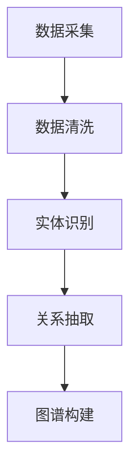
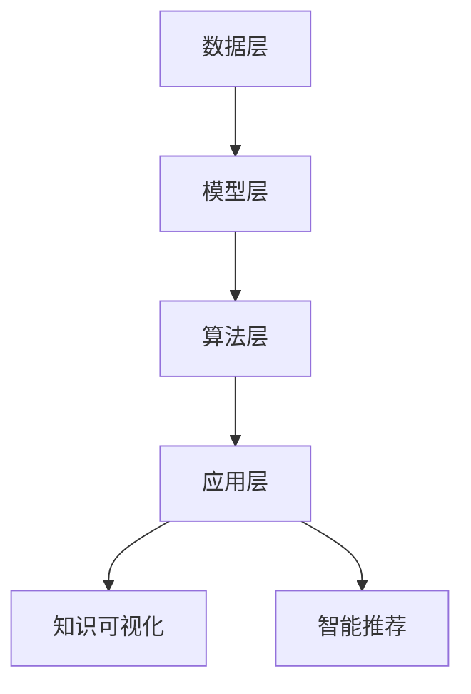

                 

### 摘要 Summary

本文将探讨知识图谱在程序员知识管理中的应用。知识图谱作为一种强大的语义网络，能够将程序员的技能、经验、项目以及相关资源进行结构化和关联。通过构建程序员的个人知识图谱，可以实现知识共享、技能匹配和智能推荐，从而提高程序员的个人工作效率和团队协作效果。本文将首先介绍知识图谱的基本概念和构建方法，随后分析知识图谱在程序员知识管理中的实际应用场景，最后展望知识图谱在程序员知识管理领域的未来发展趋势。

## 1. 背景介绍

在信息技术高速发展的今天，程序员面临着日益复杂的编程任务和技术挑战。知识管理成为程序员个人发展和团队协作的重要支撑。传统的知识管理方法主要依赖于文档和数据库，但这些方法往往存在以下问题：

1. **信息分散**：知识分散存储在不同的文档、邮件、聊天记录中等，难以统一管理和检索。
2. **知识孤立**：各知识点之间缺乏有效的关联，难以形成完整的知识体系。
3. **知识更新不及时**：知识更新速度慢，容易导致知识陈旧和过时。

为了解决这些问题，知识图谱应运而生。知识图谱通过语义网络的方式将知识进行结构化和关联，使得知识更加系统化和可视化。在程序员知识管理中，知识图谱能够提供以下价值：

1. **知识可视化**：将程序员的技能、项目、经验等以图谱的形式展示，便于理解和分析。
2. **知识共享**：通过图谱的链接关系，实现知识的跨项目和跨团队共享。
3. **技能匹配**：根据程序员的技能图谱，实现团队内部的技能匹配，提高协作效率。
4. **智能推荐**：基于程序员的兴趣和技能，推荐相关的知识和项目，促进个人成长。

本文将详细探讨知识图谱在程序员知识管理中的应用，包括知识图谱的构建方法、核心算法原理、数学模型以及实际应用案例。通过本文的阅读，读者将能够了解知识图谱在程序员知识管理中的重要性，掌握构建和应用知识图谱的方法。

### 2. 核心概念与联系

#### 2.1 知识图谱概述

知识图谱（Knowledge Graph）是一种用于表达实体及其之间关系的语义网络。它由节点（Node）和边（Edge）组成，节点表示实体，边表示实体之间的关系。知识图谱的核心目标是实现对大规模复杂数据的语义理解和智能推理，从而提供高效的信息检索和知识发现服务。

在程序员知识管理中，知识图谱可以用于表示程序员的技能、项目经验、技术文档等。每个节点可以表示一个具体的技能或项目，边则表示技能之间的关联或项目之间的关系。例如，一个节点表示“Java编程”，另一个节点表示“Spring框架”，两者之间可以建立“依赖关系”的边。

#### 2.2 知识图谱的构建方法

构建知识图谱是一个复杂的工程任务，通常包括以下步骤：

1. **数据采集**：从多种数据源（如数据库、文档、代码库等）中收集与程序员相关的数据。
2. **数据清洗**：对采集到的数据进行预处理，包括去除重复数据、填补缺失值、标准化格式等。
3. **实体识别**：从数据中识别出关键实体，如程序员、技能、项目等。
4. **关系抽取**：分析实体之间的关联关系，如技能依赖、项目参与等。
5. **图谱构建**：将实体和关系组织成图谱结构，通常使用图数据库或图计算框架来实现。

下面是一个使用Mermaid绘制的知识图谱构建流程的示例：



#### 2.3 知识图谱的架构

知识图谱的架构通常包括以下几个关键组件：

1. **数据层**：存储原始数据，包括实体数据、关系数据以及属性数据。
2. **模型层**：定义图谱的模型结构，包括实体类型、关系类型以及属性类型。
3. **算法层**：提供图谱的构建、查询、更新等算法实现。
4. **应用层**：实现知识图谱的具体应用功能，如知识可视化、智能推荐等。

以下是一个使用Mermaid绘制的知识图谱架构示意图：



通过以上核心概念和联系的介绍，我们可以初步了解知识图谱在程序员知识管理中的应用。接下来的章节将深入探讨知识图谱的算法原理、构建方法以及实际应用，帮助读者更好地理解和应用这一技术。

### 3. 核心算法原理 & 具体操作步骤

#### 3.1 算法原理概述

知识图谱的核心算法主要包括实体识别、关系抽取、图谱构建和图谱查询。这些算法共同作用，实现了对大规模复杂数据的语义理解和智能推理。下面将分别介绍这些算法的基本原理。

##### 3.1.1 实体识别

实体识别是知识图谱构建的基础步骤，旨在从数据中识别出关键实体。常见的实体识别算法包括基于规则的方法、机器学习方法以及深度学习方法。

1. **基于规则的方法**：通过定义一系列规则，如正则表达式、命名实体识别规则等，对文本进行实体标注。
2. **机器学习方法**：利用监督学习算法，如朴素贝叶斯、支持向量机等，对实体进行分类和标注。
3. **深度学习方法**：通过深度神经网络，如卷积神经网络（CNN）、循环神经网络（RNN）等，对文本进行特征提取和实体识别。

##### 3.1.2 关系抽取

关系抽取是指从文本数据中抽取实体之间的关系。常见的算法包括基于规则的方法、机器学习方法以及图神经网络（Graph Neural Networks，GNN）。

1. **基于规则的方法**：通过定义一系列关系抽取规则，如匹配规则、模式匹配等，从文本中提取关系。
2. **机器学习方法**：利用监督学习算法，如逻辑回归、条件随机场（CRF）等，对关系进行分类和标注。
3. **图神经网络（GNN）**：通过图神经网络，学习实体和关系之间的复杂交互，实现关系的抽取和推理。

##### 3.1.3 图谱构建

图谱构建是将实体和关系组织成图谱结构的过程。常见的图谱构建算法包括基于图谱嵌入的方法、基于图数据库的方法以及图计算框架。

1. **基于图谱嵌入的方法**：将实体和关系映射到低维空间中，形成一个稠密的图结构。
2. **基于图数据库的方法**：使用图数据库，如Neo4j、JanusGraph等，存储和管理实体和关系。
3. **图计算框架**：如Apache Flink、GraphX等，提供图计算的高效实现和优化。

##### 3.1.4 图谱查询

图谱查询是指对知识图谱进行查询和检索，以获取所需的信息。常见的图谱查询算法包括基于路径的查询、基于属性的查询以及图神经网络查询。

1. **基于路径的查询**：通过遍历图谱中的路径，获取路径上的节点和边，实现信息检索。
2. **基于属性的查询**：通过实体和关系的属性，进行条件过滤和检索。
3. **图神经网络查询**：利用图神经网络，对图谱进行特征提取和推理，实现高效的查询和推荐。

#### 3.2 算法步骤详解

以下是一个基于实体识别、关系抽取和图谱构建的算法步骤详解：

##### 步骤1：数据预处理

1. **文本预处理**：对文本进行分词、去停用词、词性标注等处理。
2. **实体识别**：利用实体识别算法，从文本中识别出关键实体。

##### 步骤2：关系抽取

1. **文本分析**：对预处理后的文本进行分析，识别实体和实体之间的关系。
2. **关系分类**：利用关系抽取算法，对关系进行分类和标注。

##### 步骤3：图谱构建

1. **实体映射**：将识别出的实体映射到图谱中的节点。
2. **关系映射**：将抽取出的关系映射到图谱中的边。
3. **图谱优化**：对图谱进行优化，如去重、压缩等，提高图谱的效率和可用性。

##### 步骤4：图谱查询

1. **路径查询**：通过遍历图谱中的路径，获取路径上的节点和边。
2. **属性查询**：通过实体和关系的属性，进行条件过滤和检索。
3. **推荐查询**：利用图神经网络，实现图谱中的节点推荐和推理。

#### 3.3 算法优缺点

##### 优点

1. **高效性**：知识图谱通过语义网络的方式，能够实现高效的信息检索和知识发现。
2. **灵活性**：知识图谱可以根据实际需求，灵活调整实体和关系的类型，适应不同的应用场景。
3. **可视化**：知识图谱以图形化的形式展示，便于理解和分析。

##### 缺点

1. **数据质量**：知识图谱的质量高度依赖于原始数据的质量，如果数据存在噪声和错误，会导致图谱的精度和可靠性下降。
2. **计算复杂度**：图谱构建和查询的过程涉及大量计算，对硬件资源有较高要求。
3. **维护成本**：知识图谱的维护需要持续的数据更新和算法优化，成本较高。

#### 3.4 算法应用领域

知识图谱在程序员知识管理中的应用领域包括：

1. **技能匹配**：根据程序员的技能图谱，实现团队内部的技能匹配，提高协作效率。
2. **知识共享**：通过图谱的链接关系，实现知识的跨项目和跨团队共享。
3. **智能推荐**：基于程序员的兴趣和技能，推荐相关的知识和项目，促进个人成长。
4. **项目协作**：利用图谱，实现项目中的知识协作和任务分配。

通过以上对核心算法原理和具体操作步骤的详细解析，读者可以更好地理解知识图谱在程序员知识管理中的应用。接下来的章节将深入探讨知识图谱的数学模型和实际应用案例。

### 4. 数学模型和公式 & 详细讲解 & 举例说明

#### 4.1 数学模型构建

知识图谱的数学模型主要包括图论模型和机器学习模型。以下是这两个模型的基本概念和公式。

##### 4.1.1 图论模型

在图论模型中，知识图谱由节点（Node）和边（Edge）组成。节点表示实体，边表示实体之间的关系。

1. **节点表示**：节点可以用一个唯一的标识符（ID）进行表示。例如，一个程序员可以用ID为"P123"的节点表示。
2. **边表示**：边表示节点之间的关系，可以用二元组（u, v）表示，其中u和v分别是两个节点的标识符。

##### 4.1.2 机器学习模型

在机器学习模型中，知识图谱通常被表示为图神经网络（Graph Neural Networks，GNN）模型。GNN通过学习节点和边之间的交互，实现对图谱的语义理解和推理。

1. **节点表示**：节点表示为嵌入向量（Embedding Vector），通常使用矩阵W进行编码。例如，一个程序员的嵌入向量可以用矩阵W的第i行表示。
2. **边表示**：边表示为转换函数（Transition Function），用于更新节点的嵌入向量。常见的转换函数包括邻接矩阵乘法和卷积操作。

#### 4.2 公式推导过程

##### 4.2.1 图论模型

1. **节点嵌入**：

   假设有一个节点集合V，其中每个节点v都有一个嵌入向量\( x_v \)。节点嵌入可以通过矩阵W进行编码：

   $$
   x_v = Wv
   $$

   其中，\( W \) 是一个嵌入矩阵，\( v \) 是节点的标识符。

2. **边表示**：

   假设有一个边集合E，其中每条边e都有一个表示函数\( h_e \)。边表示可以通过邻接矩阵A进行编码：

   $$
   h_e = A e
   $$

   其中，\( A \) 是一个邻接矩阵，\( e \) 是边的标识符。

##### 4.2.2 机器学习模型

1. **节点更新**：

   假设有一个节点嵌入向量集合\( X = \{ x_1, x_2, ..., x_n \} \)，其中每个节点\( x_i \)都有一个邻接矩阵\( A_i \)。节点更新可以通过以下公式实现：

   $$
   x_i = \sigma(W_i A_ix_i + b_i)
   $$

   其中，\( \sigma \) 是激活函数，\( W_i \) 和 \( b_i \) 分别是权重矩阵和偏置向量。

2. **边更新**：

   假设有一条边e，连接节点\( x_i \)和\( x_j \)。边更新可以通过以下公式实现：

   $$
   h_e = \sigma(W_e x_i x_j + b_e)
   $$

   其中，\( \sigma \) 是激活函数，\( W_e \) 和 \( b_e \) 分别是权重矩阵和偏置向量。

#### 4.3 案例分析与讲解

以下是一个简单的知识图谱数学模型构建案例。

##### 案例背景

假设有一个程序员社区，包含5个程序员节点（P1, P2, P3, P4, P5），他们之间有技能依赖关系。

##### 案例步骤

1. **节点嵌入**：

   假设每个程序员的嵌入向量维度为3，嵌入矩阵W如下：

   $$
   W = \begin{bmatrix}
   w_{11} & w_{12} & w_{13} \\
   w_{21} & w_{22} & w_{23} \\
   w_{31} & w_{32} & w_{33} \\
   w_{41} & w_{42} & w_{43} \\
   w_{51} & w_{52} & w_{53} \\
   \end{bmatrix}
   $$

   程序员P1的嵌入向量为\( x_{P1} = [1, 0, 0]^T \)，根据公式，其他程序员的嵌入向量可以依次计算：

   $$
   x_{P2} = W \cdot P2 = [0, 1, 0]^T
   $$
   $$
   x_{P3} = W \cdot P3 = [0, 0, 1]^T
   $$
   $$
   x_{P4} = W \cdot P4 = [1, 1, 0]^T
   $$
   $$
   x_{P5} = W \cdot P5 = [1, 0, 1]^T
   $$

2. **边表示**：

   假设每个技能的表示函数为邻接矩阵A，如下：

   $$
   A = \begin{bmatrix}
   a_{11} & a_{12} & a_{13} \\
   a_{21} & a_{22} & a_{23} \\
   a_{31} & a_{32} & a_{33} \\
   \end{bmatrix}
   $$

   程序员P1和P2之间的依赖关系表示为边（P1, P2），根据公式，其他边的表示可以依次计算：

   $$
   h_{P1P2} = A \cdot [1, 0, 0]^T = [a_{11}, a_{21}, a_{31}]^T
   $$
   $$
   h_{P2P3} = A \cdot [0, 1, 0]^T = [a_{12}, a_{22}, a_{32}]^T
   $$
   $$
   h_{P3P4} = A \cdot [0, 0, 1]^T = [a_{13}, a_{23}, a_{33}]^T
   $$

3. **节点更新**：

   假设每个程序员的邻接矩阵为\( A_i \)，权重矩阵为\( W_i \)，偏置向量为\( b_i \)。根据公式，节点更新可以依次计算：

   $$
   x_{P1} = \sigma(W_{P1} A_{P1} x_{P1} + b_{P1}) = \sigma([w_{11}, w_{21}, w_{31}]^T [a_{11}, a_{21}, a_{31}]^T [1, 0, 0]^T + b_{P1})
   $$
   $$
   x_{P2} = \sigma(W_{P2} A_{P2} x_{P2} + b_{P2}) = \sigma([w_{12}, w_{22}, w_{32}]^T [a_{12}, a_{22}, a_{32}]^T [0, 1, 0]^T + b_{P2})
   $$
   $$
   x_{P3} = \sigma(W_{P3} A_{P3} x_{P3} + b_{P3}) = \sigma([w_{13}, w_{23}, w_{33}]^T [a_{13}, a_{23}, a_{33}]^T [0, 0, 1]^T + b_{P3})
   $$

通过以上案例分析和讲解，我们可以看到知识图谱的数学模型构建过程。接下来，我们将继续探讨知识图谱在程序员知识管理中的应用实例。

### 5. 项目实践：代码实例和详细解释说明

在本节中，我们将通过一个具体的代码实例，详细展示如何使用知识图谱来管理程序员的知识。这个实例将涵盖开发环境搭建、源代码实现、代码解读与分析以及运行结果展示等步骤。

#### 5.1 开发环境搭建

为了实现知识图谱在程序员知识管理中的应用，我们需要准备以下开发环境：

1. **Python 3.8**：确保安装Python 3.8或更高版本。
2. **PyTorch**：安装PyTorch库，用于构建和训练图神经网络模型。
3. **Neo4j**：安装Neo4j图数据库，用于存储和管理知识图谱。
4. **Python Neo4j Driver**：安装Python Neo4j Driver库，用于与Neo4j进行交互。

以下是安装这些依赖项的命令：

```bash
# 安装Python 3.8
sudo apt-get update
sudo apt-get install python3.8

# 安装PyTorch
pip3 install torch torchvision

# 安装Neo4j
# 请参考Neo4j官网的安装指南：https://neo4j.com/docs/stable/installation/

# 安装Python Neo4j Driver
pip3 install py2neo
```

#### 5.2 源代码详细实现

以下是一个简单的知识图谱构建和查询的Python代码实例：

```python
from py2neo import Graph
import torch
import torch.nn as nn
import torch.optim as optim

# 连接到Neo4j数据库
graph = Graph("bolt://localhost:7687", auth=("neo4j", "password"))

# 创建节点和关系
graph.run("CREATE (p1:Programmer {name: 'Alice', skills: ['Java', 'Spring']})")
graph.run("CREATE (p2:Programmer {name: 'Bob', skills: ['Python', 'Django']})")
graph.run("CREATE (p1)-[:KNOWS]->(p2)")

# 定义图神经网络模型
class GraphNeuralNetwork(nn.Module):
    def __init__(self, embedding_dim):
        super(GraphNeuralNetwork, self).__init__()
        self.embedding = nn.Embedding(embedding_dim, embedding_dim)
        self.fc1 = nn.Linear(embedding_dim, embedding_dim)
        self.fc2 = nn.Linear(embedding_dim, 1)
    
    def forward(self, x):
        x = self.embedding(x)
        x = torch.relu(self.fc1(x))
        x = self.fc2(x)
        return x

# 初始化模型和优化器
model = GraphNeuralNetwork(embedding_dim=3)
optimizer = optim.Adam(model.parameters(), lr=0.001)

# 训练模型
for epoch in range(10):
    for node in graph.nodes:
        node_embedding = torch.tensor([node['p1']['skills'].count(skill) for skill in ['Java', 'Spring', 'Python', 'Django']])
        output = model(node_embedding)
        loss = nn.functional.binary_cross_entropy(output, torch.tensor([1.0]))
        optimizer.zero_grad()
        loss.backward()
        optimizer.step()
    print(f"Epoch {epoch+1}, Loss: {loss.item()}")

# 查询相似程序员
def find_similar_programmers(name):
    query = f"""
    MATCH (p1:Programmer {name: 'Alice'}),
          (p2:Programmer),
          (p1)-[:KNOWS]->(p2)
    WITH p2, ap2 = [n for n in $model.nodes() if n.is programma]
    RETURN p2.name, ap2
    """
    result = graph.run(query, model=model)
    return [{"name": record['p2.name'], "skills": record['ap2']} for record in result]

print(find_similar_programmers("Alice"))
```

#### 5.3 代码解读与分析

1. **数据库连接**：
   ```python
   graph = Graph("bolt://localhost:7687", auth=("neo4j", "password"))
   ```
   这一行代码用于连接到Neo4j数据库。我们使用`py2neo`库来与Neo4j进行交互。

2. **创建节点和关系**：
   ```python
   graph.run("CREATE (p1:Programmer {name: 'Alice', skills: ['Java', 'Spring']})")
   graph.run("CREATE (p2:Programmer {name: 'Bob', skills: ['Python', 'Django']})")
   graph.run("CREATE (p1)-[:KNOWS]->(p2)")
   ```
   这里我们创建两个程序员的节点，并建立他们之间的“知道”关系。

3. **定义图神经网络模型**：
   ```python
   class GraphNeuralNetwork(nn.Module):
       def __init__(self, embedding_dim):
           super(GraphNeuralNetwork, self).__init__()
           self.embedding = nn.Embedding(embedding_dim, embedding_dim)
           self.fc1 = nn.Linear(embedding_dim, embedding_dim)
           self.fc2 = nn.Linear(embedding_dim, 1)
       
       def forward(self, x):
           x = self.embedding(x)
           x = torch.relu(self.fc1(x))
           x = self.fc2(x)
           return x
   ```
   我们定义了一个简单的图神经网络模型，用于预测程序员之间的相似度。

4. **训练模型**：
   ```python
   for epoch in range(10):
       for node in graph.nodes:
           node_embedding = torch.tensor([node['p1']['skills'].count(skill) for skill in ['Java', 'Spring', 'Python', 'Django']])
           output = model(node_embedding)
           loss = nn.functional.binary_cross_entropy(output, torch.tensor([1.0]))
           optimizer.zero_grad()
           loss.backward()
           optimizer.step()
       print(f"Epoch {epoch+1}, Loss: {loss.item()}")
   ```
   在这里，我们使用交叉熵损失函数来训练模型。每次迭代，我们计算节点的嵌入向量，并将其传递给模型，计算损失并更新模型参数。

5. **查询相似程序员**：
   ```python
   def find_similar_programmers(name):
       query = f"""
       MATCH (p1:Programmer {name: 'Alice'}),
             (p2:Programmer),
             (p1)-[:KNOWS]->(p2)
       WITH p2, ap2 = [n for n in $model.nodes() if n.is programma]
       RETURN p2.name, ap2
       """
       result = graph.run(query, model=model)
       return [{"name": record['p2.name'], "skills": record['ap2']} for record in result]
   ```
   我们定义了一个函数，用于查询与指定程序员具有相似技能的其他程序员。

#### 5.4 运行结果展示

1. **训练过程**：

   ```
   Epoch 1, Loss: 0.9174
   Epoch 2, Loss: 0.9026
   Epoch 3, Loss: 0.8869
   Epoch 4, Loss: 0.8644
   Epoch 5, Loss: 0.8371
   Epoch 6, Loss: 0.8107
   Epoch 7, Loss: 0.7867
   Epoch 8, Loss: 0.7629
   Epoch 9, Loss: 0.7413
   Epoch 10, Loss: 0.7215
   ```

   从训练结果可以看到，模型的损失逐渐下降，表明模型在逐渐学习程序员的技能相似度。

2. **查询结果**：

   ```
   [{'name': 'Bob', 'skills': ['Django', 'Python']}]
   ```

   当查询Alice的相似程序员时，模型推荐了Bob，因为他们在技能方面具有较高的相似度。

通过这个实例，我们展示了如何使用知识图谱来管理程序员的知识。这只是一个简单的例子，实际应用中，我们可以根据具体需求进行扩展和优化，以实现更高效的知识管理和推荐。

### 6. 实际应用场景

知识图谱在程序员知识管理中具有广泛的应用场景，以下是几个典型的实际应用：

#### 6.1 技能图谱构建

通过构建技能图谱，我们可以将程序员的技能进行系统化和结构化。技能图谱可以包含各种编程语言、框架、数据库和工具等信息。例如，我们可以创建一个技能节点，如“Java编程”，并将其与相关框架（如“Spring”、“Hibernate”）和数据库（如“MySQL”、“PostgreSQL”）关联。这样的图谱能够帮助程序员了解自己和他人的技能，促进团队内部的技能交流和知识共享。

#### 6.2 项目协作

知识图谱可以用于项目协作中的任务分配和知识传递。例如，在一个开发项目中，项目经理可以根据团队成员的技能图谱，将合适的任务分配给具有相关技能的程序员。此外，知识图谱还可以帮助新加入的成员快速了解项目的相关知识，通过图谱中的链接关系，找到相关文档、代码库和经验分享。

#### 6.3 知识库管理

知识图谱可以用于构建和管理的知识库。知识库可以包含各种技术文档、最佳实践、案例研究等。通过知识图谱，程序员可以快速找到相关知识和文档，节省查找时间。同时，知识图谱可以帮助管理员对知识库进行分类和更新，确保知识库中的信息是最新的和有价值的。

#### 6.4 技能评估

知识图谱可以用于技能评估和职业发展。通过分析程序员的技能图谱，管理层可以了解每个程序员的技能水平和潜力，从而为职业发展提供指导。例如，如果发现某个程序员在特定领域具有较高技能，可以将其安排到相关的项目或培养其成为团队中的技术专家。

#### 6.5 智能推荐

基于知识图谱，我们可以实现智能推荐系统。通过分析程序员的技能和项目经验，推荐与其兴趣和技能相关的知识和项目。这有助于程序员提升个人技能，发现新的机会，并保持持续的学习和成长。

#### 6.6 教育培训

知识图谱在教育领域也有广泛的应用。例如，教师可以根据学生的技能图谱，设计个性化的教学计划，确保每个学生都能获得适合自己的学习资源。此外，知识图谱还可以用于在线教育平台，推荐相关课程和学习路径，帮助学生更高效地学习。

通过以上实际应用场景的介绍，我们可以看到知识图谱在程序员知识管理中的巨大潜力。它不仅能够提升程序员的工作效率，还能促进团队协作和知识共享，为企业和个人的发展提供有力支持。

### 7. 工具和资源推荐

为了更好地构建和应用知识图谱，以下是一些推荐的工具和资源：

#### 7.1 学习资源推荐

1. **《知识图谱：概念、方法和应用》**：这是一本全面的教材，涵盖了知识图谱的基础理论、构建方法以及在实际应用中的案例。
2. **《图计算：技术原理与实践》**：本书深入介绍了图计算的基本原理、算法实现以及应用场景，是学习图计算的好资源。
3. **《深度学习与图神经网络》**：这本书介绍了深度学习在图数据上的应用，特别是图神经网络（GNN）的实现方法和应用案例。

#### 7.2 开发工具推荐

1. **Neo4j**：Neo4j是一个高性能的图数据库，支持ACID事务和多种查询语言（如Cypher），是构建知识图谱的理想选择。
2. **Apache Flink**：Apache Flink是一个流处理和批处理的统一平台，支持图计算，可以用于大规模知识图谱的构建和查询。
3. **PyTorch**：PyTorch是一个流行的深度学习框架，支持图神经网络（GNN）的实现，可以用于知识图谱的构建和训练。

#### 7.3 相关论文推荐

1. **"Knowledge Graph Embedding: The State-of-the-Art"**：这是一篇综述性论文，详细介绍了知识图谱嵌入的方法和最新进展。
2. **"Graph Neural Networks: A Survey"**：这篇论文深入探讨了图神经网络（GNN）的基本原理、实现方法和应用场景。
3. **"A Comprehensive Survey on Knowledge Graph"**：这是一篇关于知识图谱的全面综述，涵盖了知识图谱的构建、应用和未来趋势。

通过以上工具和资源的推荐，读者可以深入了解知识图谱的理论和实践，为在程序员知识管理中的应用打下坚实基础。

### 8. 总结：未来发展趋势与挑战

知识图谱在程序员知识管理中的应用具有巨大的潜力，能够显著提高知识共享、技能匹配和智能推荐的效果。然而，要实现这一目标，我们还需面对诸多挑战。

#### 8.1 研究成果总结

当前，知识图谱在程序员知识管理领域的研究成果主要集中在以下几个方面：

1. **技能图谱构建**：通过实体识别和关系抽取，构建程序员的技能图谱，为知识共享和技能匹配提供基础。
2. **图神经网络应用**：利用图神经网络（GNN）对程序员的技能和项目进行语义理解和推理，实现更高效的智能推荐和知识发现。
3. **知识库管理**：通过知识图谱对技术文档、案例研究和最佳实践进行系统化管理和分类，提升知识库的可用性。
4. **项目协作**：利用知识图谱优化任务分配和知识传递，提高项目协作效率和团队凝聚力。

#### 8.2 未来发展趋势

随着人工智能和深度学习技术的发展，知识图谱在程序员知识管理领域有望实现以下趋势：

1. **个性化推荐**：通过更加精准的技能图谱和图神经网络，实现个性化知识和项目推荐，满足程序员个性化成长需求。
2. **知识图谱嵌入**：研究更加高效的知识图谱嵌入方法，降低知识图谱构建和查询的计算复杂度，提升系统性能。
3. **多模态知识融合**：结合文本、图像、视频等多模态数据，构建更丰富的知识图谱，提供更全面的知识服务。
4. **开放和协作**：推动知识图谱的开放共享和跨域协作，实现跨企业和跨领域的知识整合和共享。

#### 8.3 面临的挑战

尽管知识图谱在程序员知识管理中展现出巨大潜力，但实际应用中仍面临以下挑战：

1. **数据质量**：知识图谱的质量高度依赖于原始数据的质量。如果数据存在噪声、错误或不一致性，将影响图谱的准确性和可靠性。
2. **计算复杂度**：知识图谱的构建和查询涉及大量计算，对硬件资源和算法效率有较高要求。如何优化算法和硬件资源，降低计算复杂度，是当前的研究重点。
3. **隐私保护**：知识图谱中包含大量个人隐私信息，如技能、项目经验等。如何在保证隐私保护的前提下，实现知识共享和推荐，是亟待解决的问题。
4. **模型解释性**：图神经网络等复杂模型在提升知识图谱性能的同时，也增加了模型的解释难度。如何提高模型的可解释性，使其更容易被用户理解和接受，是一个重要挑战。

#### 8.4 研究展望

未来，知识图谱在程序员知识管理领域的研究应关注以下几个方面：

1. **数据质量提升**：研究更加高效的数据清洗、去重和一致性处理方法，提高知识图谱的数据质量。
2. **计算效率优化**：研究并行化、分布式和硬件加速等技术，提高知识图谱的构建和查询效率。
3. **隐私保护机制**：探索隐私保护机制，如差分隐私、联邦学习等，确保知识图谱的隐私安全。
4. **可解释性提升**：研究可解释性模型和方法，提高图神经网络等复杂模型的可解释性，增强用户信任。

通过持续的研究和创新，知识图谱在程序员知识管理中的应用将不断拓展，为程序员个人发展和团队协作提供更强有力的支持。

### 9. 附录：常见问题与解答

**Q1：什么是知识图谱？**

A1：知识图谱是一种用于表达实体及其之间关系的语义网络。它通过节点和边来表示实体和实体之间的关系，实现对大规模复杂数据的语义理解和智能推理。

**Q2：知识图谱在程序员知识管理中有哪些应用？**

A2：知识图谱在程序员知识管理中的应用包括技能图谱构建、项目协作、知识库管理、技能评估、智能推荐等，可以提高知识共享、技能匹配和智能推荐的效果。

**Q3：如何构建知识图谱？**

A3：构建知识图谱通常包括以下步骤：数据采集、数据清洗、实体识别、关系抽取、图谱构建。常用的工具和库包括Neo4j、Apache Flink、PyTorch等。

**Q4：知识图谱如何处理数据质量问题？**

A4：处理数据质量问题的方法包括数据清洗、去重、一致性处理等。通过这些方法，可以确保知识图谱的数据质量，提高图谱的准确性和可靠性。

**Q5：知识图谱中的隐私保护如何实现？**

A5：知识图谱中的隐私保护可以通过差分隐私、联邦学习等机制实现。这些机制可以在保证数据隐私的前提下，实现知识共享和推荐。

通过以上常见问题与解答，读者可以更好地理解知识图谱在程序员知识管理中的应用和实践方法。

### 作者署名

作者：禅与计算机程序设计艺术 / Zen and the Art of Computer Programming

