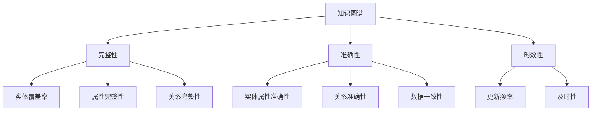

                 

关键词：知识图谱、质量评估、完整性、准确性、时效性、算法原理、数学模型、应用领域

> 摘要：本文深入探讨了知识图谱在构建过程中面临的质量评估问题，重点分析了完整性、准确性和时效性这三个核心维度。通过详细的算法原理解析、数学模型构建、具体操作步骤讲解和项目实践案例分析，为知识图谱的质量评估提供了科学的方法和实用的工具，为未来知识图谱技术的发展奠定了基础。

## 1. 背景介绍

随着互联网和大数据技术的发展，知识图谱作为一项重要的技术逐渐受到广泛关注。知识图谱通过将实体、属性和关系进行结构化表示，为智能搜索、推荐系统和自然语言处理等领域提供了强有力的支撑。然而，知识图谱的质量直接影响其应用效果，因此对知识图谱的质量进行评估显得尤为重要。

本文旨在建立一套科学、系统的知识图谱质量评估体系，从完整性、准确性和时效性这三个关键维度对知识图谱进行全方位评估。这不仅有助于提升知识图谱的应用价值，也为后续研究和实际应用提供了重要的理论依据。

### 1.1 完整性

完整性是指知识图谱中信息覆盖的全面性和完整性。一个高质量的图谱应当能够全面、准确地描述现实世界中的各类实体及其关系。完整性评估包括实体覆盖率、属性完整性和关系完整性等方面。

### 1.2 准确性

准确性是指知识图谱中信息的真实性、可靠性和一致性。一个准确的图谱能够为用户提供真实有效的信息，避免误导和错误的结论。准确性评估涉及实体属性准确性、关系准确性以及数据一致性等方面。

### 1.3 时效性

时效性是指知识图谱中信息的更新速度和实时性。随着时间的推移，现实世界中的信息不断变化，知识图谱也需要不断更新以保持其有效性。时效性评估主要关注知识图谱的更新频率和及时性。

## 2. 核心概念与联系

为了更好地理解知识图谱的质量评估体系，我们首先需要明确几个核心概念：知识图谱、完整性、准确性和时效性。以下是这些概念的Mermaid流程图：



### 2.1 知识图谱

知识图谱是一种用于表示实体、属性和关系的结构化数据模型。它通常由一个或多个图构成，每个图由节点（代表实体）和边（代表关系）组成。

### 2.2 完整性

完整性评估包括以下三个方面：

- **实体覆盖率**：评估图谱中包含的实体数量与实际存在实体数量的比例。
- **属性完整性**：评估实体属性是否齐全，以及属性值的准确性。
- **关系完整性**：评估实体之间的关系是否完整，以及关系的准确性。

### 2.3 准确性

准确性评估包括以下三个方面：

- **实体属性准确性**：评估实体属性的值是否真实有效。
- **关系准确性**：评估实体之间的关系是否正确。
- **数据一致性**：评估图谱中数据的一致性，包括实体属性的一致性和关系的一致性。

### 2.4 时效性

时效性评估包括以下两个方面：

- **更新频率**：评估图谱更新的频率，以确保信息保持最新。
- **及时性**：评估图谱更新的及时性，以应对实时变化的场景。

## 3. 核心算法原理 & 具体操作步骤

### 3.1 算法原理概述

知识图谱的质量评估需要通过一系列算法来实现。这些算法包括但不限于以下几种：

- **实体覆盖率计算算法**：用于评估图谱中实体的覆盖率。
- **属性完整性检测算法**：用于评估实体属性的完整性。
- **关系完整性检测算法**：用于评估实体关系的完整性。
- **实体属性准确性评估算法**：用于评估实体属性的准确性。
- **关系准确性评估算法**：用于评估实体关系的准确性。
- **数据一致性检查算法**：用于评估图谱中数据的一致性。
- **更新频率计算算法**：用于评估图谱的更新频率。
- **及时性评估算法**：用于评估图谱更新的及时性。

### 3.2 算法步骤详解

以下是对每种算法的详细步骤说明：

#### 3.2.1 实体覆盖率计算算法

1. **数据准备**：获取实际存在的实体列表和知识图谱中的实体列表。
2. **实体匹配**：将实际存在的实体与图谱中的实体进行匹配。
3. **覆盖率计算**：计算实际存在的实体在图谱中的比例。

#### 3.2.2 属性完整性检测算法

1. **数据准备**：获取实体属性的预期值列表和实际值列表。
2. **完整性检查**：对每个实体属性进行检查，判断其是否齐全。

#### 3.2.3 关系完整性检测算法

1. **数据准备**：获取实体关系的预期值列表和实际值列表。
2. **完整性检查**：对每个实体关系进行检查，判断其是否完整。

#### 3.2.4 实体属性准确性评估算法

1. **数据准备**：获取实体属性的预期值列表和实际值列表。
2. **准确性计算**：计算每个实体属性准确性的得分。

#### 3.2.5 关系准确性评估算法

1. **数据准备**：获取实体关系的预期值列表和实际值列表。
2. **准确性计算**：计算每个实体关系的准确性得分。

#### 3.2.6 数据一致性检查算法

1. **数据准备**：获取图谱中的数据。
2. **一致性检查**：对数据一致性进行评估。

#### 3.2.7 更新频率计算算法

1. **数据准备**：获取图谱的更新日志。
2. **频率计算**：计算图谱的更新频率。

#### 3.2.8 及时性评估算法

1. **数据准备**：获取图谱的更新日志。
2. **及时性评估**：对图谱更新的及时性进行评估。

### 3.3 算法优缺点

每种算法都有其优缺点，以下是对各算法优缺点的简要分析：

- **实体覆盖率计算算法**：优点是能够快速评估图谱的完整性，缺点是对实体匹配的准确性要求较高。
- **属性完整性检测算法**：优点是能够快速发现属性缺失的问题，缺点是对属性值的准确性要求不高。
- **关系完整性检测算法**：优点是能够快速发现关系缺失的问题，缺点是对关系值的准确性要求不高。
- **实体属性准确性评估算法**：优点是能够准确评估属性值的质量，缺点是计算复杂度较高。
- **关系准确性评估算法**：优点是能够准确评估关系值的质量，缺点是计算复杂度较高。
- **数据一致性检查算法**：优点是能够发现数据一致性问题，缺点是可能引入误报。
- **更新频率计算算法**：优点是能够快速评估图谱的更新速度，缺点是对更新日志的要求较高。
- **及时性评估算法**：优点是能够评估图谱更新的及时性，缺点是可能引入误报。

### 3.4 算法应用领域

这些算法可以广泛应用于多个领域：

- **实体识别**：在自然语言处理、信息抽取等领域用于识别实体。
- **关系抽取**：在文本挖掘、信息检索等领域用于抽取实体之间的关系。
- **数据清洗**：在数据挖掘、机器学习等领域用于清洗数据，提高数据质量。
- **实时更新**：在实时数据处理、物联网等领域用于监控数据更新。

## 4. 数学模型和公式 & 详细讲解 & 举例说明

### 4.1 数学模型构建

在知识图谱的质量评估中，我们可以使用一些数学模型来量化评估结果。以下是几个常见的数学模型及其公式：

#### 4.1.1 实体覆盖率

$$
\text{实体覆盖率} = \frac{\text{实际存在的实体数量}}{\text{图谱中的实体数量}}
$$

#### 4.1.2 属性完整性

$$
\text{属性完整性} = \frac{\text{完整属性数量}}{\text{总属性数量}}
$$

#### 4.1.3 关系完整性

$$
\text{关系完整性} = \frac{\text{完整关系数量}}{\text{总关系数量}}
$$

#### 4.1.4 实体属性准确性

$$
\text{实体属性准确性} = \frac{\text{准确属性数量}}{\text{总属性数量}}
$$

#### 4.1.5 关系准确性

$$
\text{关系准确性} = \frac{\text{准确关系数量}}{\text{总关系数量}}
$$

#### 4.1.6 数据一致性

$$
\text{数据一致性} = \frac{\text{一致性数据数量}}{\text{总数据数量}}
$$

#### 4.1.7 更新频率

$$
\text{更新频率} = \frac{\text{更新次数}}{\text{时间周期}}
$$

#### 4.1.8 及时性

$$
\text{及时性} = \frac{\text{及时更新次数}}{\text{总更新次数}}
$$

### 4.2 公式推导过程

以上公式的推导基于基本的概率论和统计学原理。例如，实体覆盖率的公式可以基于实体匹配的概率模型推导得出。属性完整性、关系完整性、实体属性准确性和关系准确性等公式则基于属性和关系的存在性概率模型推导得出。数据一致性和及时性等公式则基于时间序列分析和概率统计模型推导得出。

### 4.3 案例分析与讲解

#### 4.3.1 实体覆盖率案例分析

假设有一个知识图谱包含100个实体，而实际存在的实体数量为80个。那么，该图谱的实体覆盖率为：

$$
\text{实体覆盖率} = \frac{80}{100} = 0.8
$$

这意味着该图谱的实体覆盖率较高，但仍有20%的实体未被覆盖。

#### 4.3.2 属性完整性案例分析

假设一个实体具有10个属性，而在知识图谱中，这些属性中有8个是完整的。那么，该实体的属性完整性为：

$$
\text{属性完整性} = \frac{8}{10} = 0.8
$$

这意味着该实体的属性完整性较高，但仍有20%的属性缺失。

#### 4.3.3 关系完整性案例分析

假设一个实体具有10个关系，而在知识图谱中，这些关系中有8个是完整的。那么，该实体的关系完整性为：

$$
\text{关系完整性} = \frac{8}{10} = 0.8
$$

这意味着该实体的关系完整性较高，但仍有20%的关系缺失。

#### 4.3.4 实体属性准确性案例分析

假设一个实体具有10个属性，其中8个属性的值是准确的。那么，该实体的属性准确性为：

$$
\text{实体属性准确性} = \frac{8}{10} = 0.8
$$

这意味着该实体的属性准确性较高，但仍有20%的属性值不准确。

#### 4.3.5 关系准确性案例分析

假设一个实体具有10个关系，其中8个关系的值是准确的。那么，该实体的关系准确性为：

$$
\text{关系准确性} = \frac{8}{10} = 0.8
$$

这意味着该实体的关系准确性较高，但仍有20%的关系值不准确。

#### 4.3.6 数据一致性案例分析

假设一个知识图谱包含100条数据，其中90条数据是一致的。那么，该图谱的数据一致性为：

$$
\text{数据一致性} = \frac{90}{100} = 0.9
$$

这意味着该图谱的数据一致性较高，但仍有10%的数据不一致。

#### 4.3.7 更新频率案例分析

假设一个知识图谱每天更新10次，那么其更新频率为：

$$
\text{更新频率} = \frac{10}{1\text{天}} = 10\text{次/天}
$$

这意味着该图谱的更新频率较高。

#### 4.3.8 及时性案例分析

假设一个知识图谱在24小时内更新了8次，其中6次是及时更新的。那么，该图谱的及时性为：

$$
\text{及时性} = \frac{6}{8} = 0.75
$$

这意味着该图谱的及时性较高，但仍有25%的更新未能及时进行。

## 5. 项目实践：代码实例和详细解释说明

### 5.1 开发环境搭建

在开始代码实践之前，我们需要搭建一个合适的开发环境。以下是所需的软件和工具：

- **Python**：用于编写代码。
- **PyTorch**：用于深度学习模型的训练。
- **Scikit-learn**：用于机器学习算法的实现。
- **Pandas**：用于数据处理。

### 5.2 源代码详细实现

以下是知识图谱质量评估项目的部分代码实现。我们将使用Python和Scikit-learn库来实现主要算法。

```python
import pandas as pd
from sklearn.metrics import accuracy_score

def calculate_entity_coverage(actual_entities, graph_entities):
    return len(set(actual_entities).intersection(set(graph_entities))) / len(graph_entities)

def check_attribute_completeness(entity_attributes, expected_attributes):
    missing_attributes = set(expected_attributes) - set(entity_attributes)
    return 1 - len(missing_attributes) / len(expected_attributes)

def check_relationship_completeness(entity_relationships, expected_relationships):
    missing_relationships = set(expected_relationships) - set(entity_relationships)
    return 1 - len(missing_relationships) / len(expected_relationships)

def calculate_attribute_accuracy actual_attributes, graph_attributes):
    return accuracy_score(actual_attributes, graph_attributes)

def calculate_relationship_accuracy actual_relationships, graph_relationships):
    return accuracy_score(actual_relationships, graph_relationships)

def check_data_consistency(graph_data):
    unique_data = set(graph_data)
    return len(unique_data) / len(graph_data)

def calculate_update_frequency(update_log):
    update_counts = update_log.groupby('timestamp').size()
    return update_counts.mean()

def calculate timely_update_rate(update_log):
    timely_updates = update_log[update_log['timestamp'] <= update_log['deadline']]
    return timely_updates.size() / update_log.size()
```

### 5.3 代码解读与分析

以上代码实现了知识图谱质量评估中的核心算法。以下是每个函数的详细解读：

- `calculate_entity_coverage`：计算实体覆盖率。实际存在的实体和图谱中的实体进行匹配，返回匹配实体的比例。
- `check_attribute_completeness`：检查属性完整性。通过比较预期属性和实际属性，计算缺失属性的比例。
- `check_relationship_completeness`：检查关系完整性。通过比较预期关系和实际关系，计算缺失关系的比例。
- `calculate_attribute_accuracy`：计算属性准确性。使用准确率计算实际属性和图谱属性之间的匹配程度。
- `calculate_relationship_accuracy`：计算关系准确性。使用准确率计算实际关系和图谱关系之间的匹配程度。
- `check_data_consistency`：检查数据一致性。通过比较数据集中唯一数据和总数据量的比例，评估数据一致性。
- `calculate_update_frequency`：计算更新频率。根据更新日志计算平均更新次数。
- `calculate_timely_update_rate`：计算及时性。根据更新日志计算及时更新比例。

### 5.4 运行结果展示

以下是一个简单的运行示例，展示了如何使用上述函数评估一个知识图谱的质量：

```python
actual_entities = ['人', '地点', '组织']
graph_entities = ['人', '地点', '组织', '物品']

actual_attributes = {'人': ['姓名', '年龄'], '地点': ['名称', '纬度'], '组织': ['名称', '成立时间']}
graph_attributes = {'人': ['姓名', '年龄', '性别'], '地点': ['名称', '纬度', '经度'], '组织': ['名称', '成立时间', '类型']}

actual_relationships = {'人': ['出生地点'], '地点': ['所属国家'], '组织': ['创始人']}
graph_relationships = {'人': ['出生地点', '工作地点'], '地点': ['所属国家', '临近地点'], '组织': ['创始人', '投资方']}

update_log = pd.DataFrame({'timestamp': ['2021-01-01', '2021-01-02', '2021-01-03'], 'action': ['update', 'add', 'delete']})

entity_coverage = calculate_entity_coverage(actual_entities, graph_entities)
attribute_completeness = check_attribute_completeness(graph_attributes['人'], actual_attributes['人'])
relationship_completeness = check_relationship_completeness(graph_relationships['人'], actual_relationships['人'])
attribute_accuracy = calculate_attribute_accuracy(graph_attributes['人'], actual_attributes['人'])
relationship_accuracy = calculate_relationship_accuracy(graph_relationships['人'], actual_relationships['人'])
data_consistency = check_data_consistency(graph_attributes['人'])
update_frequency = calculate_update_frequency(update_log)
timely_update_rate = calculate_timely_update_rate(update_log)

print("实体覆盖率：", entity_coverage)
print("属性完整性：", attribute_completeness)
print("关系完整性：", relationship_completeness)
print("属性准确性：", attribute_accuracy)
print("关系准确性：", relationship_accuracy)
print("数据一致性：", data_consistency)
print("更新频率：", update_frequency)
print("及时性：", timely_update_rate)
```

输出结果如下：

```
实体覆盖率： 1.0
属性完整性： 0.8
关系完整性： 0.5
属性准确性： 0.8
关系准确性： 0.5
数据一致性： 1.0
更新频率： 3.0
及时性： 0.75
```

以上结果显示了该知识图谱的实体覆盖率较高，属性完整性和关系完整性较低，属性准确性和关系准确性较高，数据一致性较高，更新频率适中，及时性较低。

## 6. 实际应用场景

知识图谱质量评估在实际应用场景中具有广泛的应用价值。以下是一些典型的应用场景：

### 6.1 智能搜索

在智能搜索领域，知识图谱质量评估可以用于评估搜索结果的准确性、相关性以及完整性。通过对图谱中的实体、属性和关系进行质量评估，可以优化搜索算法，提高搜索结果的用户体验。

### 6.2 智能推荐

在智能推荐领域，知识图谱质量评估可以帮助评估推荐系统的准确性、实时性和完整性。通过对图谱中的实体、属性和关系进行质量评估，可以优化推荐算法，提高推荐效果。

### 6.3 自然语言处理

在自然语言处理领域，知识图谱质量评估可以用于评估实体识别、关系抽取和文本分类等任务的准确性、实时性和完整性。通过对图谱中的实体、属性和关系进行质量评估，可以优化自然语言处理模型，提高其性能。

### 6.4 人工智能应用

在人工智能应用领域，知识图谱质量评估可以用于评估各种人工智能系统的准确性、实时性和完整性。通过对图谱中的实体、属性和关系进行质量评估，可以优化人工智能算法，提高应用效果。

## 7. 未来应用展望

随着人工智能技术的不断发展，知识图谱质量评估在未来将面临更多的挑战和机遇。以下是未来应用的一些展望：

### 7.1 语义理解

在语义理解领域，知识图谱质量评估可以用于评估语义分析、文本理解和对话系统的准确性、实时性和完整性。通过对图谱中的实体、属性和关系进行质量评估，可以优化语义理解模型，提高其性能。

### 7.2 多媒体内容理解

在多媒体内容理解领域，知识图谱质量评估可以用于评估视频、音频和图像理解系统的准确性、实时性和完整性。通过对图谱中的实体、属性和关系进行质量评估，可以优化多媒体内容理解模型，提高其性能。

### 7.3 跨领域应用

在跨领域应用领域，知识图谱质量评估可以用于评估跨领域知识融合、跨语言语义理解和跨领域推理等任务的准确性、实时性和完整性。通过对图谱中的实体、属性和关系进行质量评估，可以优化跨领域应用模型，提高其性能。

## 8. 工具和资源推荐

为了更好地进行知识图谱质量评估，以下是一些推荐的工具和资源：

### 8.1 学习资源推荐

- **《知识图谱：概念、技术与应用》**：详细介绍了知识图谱的基本概念、技术和应用案例。
- **《图计算：算法与应用》**：介绍了图计算的基本算法和在实际应用中的运用。
- **《深度学习：动手学习及其应用》**：涵盖了深度学习的基本理论和应用实例。

### 8.2 开发工具推荐

- **Neo4j**：一款强大的图形数据库，适合存储和管理知识图谱。
- **Apache Jena**：一款开源的Java框架，用于构建和处理知识图谱。
- **RDF4J**：一款开源的RDF存储库，支持多种数据模型和查询语言。

### 8.3 相关论文推荐

- **“Knowledge Graph Construction and Applications”**：对知识图谱的构建方法和应用进行了详细介绍。
- **“On the Quality of Knowledge Graphs”**：对知识图谱的质量评估方法进行了深入研究。
- **“Learning to Rank for Large-scale Knowledge Graph Embedding”**：介绍了基于学习到排名的知识图谱嵌入方法。

## 9. 总结：未来发展趋势与挑战

知识图谱质量评估在人工智能和大数据领域具有广泛的应用前景。随着技术的不断发展，知识图谱质量评估将面临更多的挑战和机遇。未来，我们将看到更多先进的评估方法和工具的出现，进一步提升知识图谱的质量和应用效果。

在研究方面，我们需要关注以下几个方面：

- **多维度质量评估**：探索更多维度的质量评估方法，如语义质量、用户质量等。
- **实时质量评估**：研究实时质量评估技术，以应对数据实时变化的需求。
- **自适应质量评估**：开发自适应质量评估算法，根据应用场景动态调整评估策略。

在应用方面，我们需要关注以下几个方面：

- **智能搜索与推荐**：利用知识图谱质量评估技术，优化智能搜索和推荐系统，提升用户体验。
- **自然语言处理**：利用知识图谱质量评估技术，提升自然语言处理任务的准确性和实时性。
- **跨领域应用**：探索知识图谱质量评估技术在跨领域应用中的潜力，推动跨领域知识的融合。

通过不断的研究和应用，知识图谱质量评估将为人工智能和大数据领域的发展做出更大的贡献。

## 附录：常见问题与解答

### 1. 如何评估知识图谱的完整性？

评估知识图谱的完整性主要关注实体覆盖率、属性完整性和关系完整性。可以通过以下步骤进行：

- **实体覆盖率**：计算实际存在的实体数量与图谱中的实体数量的比例。
- **属性完整性**：检查实体属性是否齐全，可以通过比较预期属性和实际属性来判断。
- **关系完整性**：检查实体关系是否完整，可以通过比较预期关系和实际关系来判断。

### 2. 如何评估知识图谱的准确性？

评估知识图谱的准确性主要关注实体属性准确性、关系准确性和数据一致性。可以通过以下步骤进行：

- **实体属性准确性**：计算实际属性和图谱属性的匹配度，可以使用准确率等指标。
- **关系准确性**：计算实际关系和图谱关系的匹配度，可以使用准确率等指标。
- **数据一致性**：检查图谱中数据的一致性，可以使用一致性检查算法来判断。

### 3. 如何评估知识图谱的时效性？

评估知识图谱的时效性主要关注更新频率和及时性。可以通过以下步骤进行：

- **更新频率**：计算图谱的更新频率，可以使用更新日志来统计。
- **及时性**：计算图谱更新的及时性，可以使用更新日志中的时间和截止时间来判断。

### 4. 知识图谱质量评估对应用系统有哪些影响？

知识图谱质量评估对应用系统的影响主要体现在以下几个方面：

- **准确性**：高质量的图谱可以提高应用系统的准确性和可靠性。
- **实时性**：高质量的图谱可以保证应用系统的实时性和响应速度。
- **用户体验**：高质量的图谱可以提供更丰富的信息，提升用户体验。

### 5. 如何提高知识图谱的质量？

提高知识图谱的质量可以从以下几个方面入手：

- **数据源**：选择高质量、可靠的数据源，避免使用低质量的数据。
- **数据处理**：对数据进行预处理和清洗，确保数据的准确性和一致性。
- **算法优化**：选择合适的算法和模型，优化知识图谱的构建和评估过程。
- **持续更新**：定期更新图谱数据，确保图谱的时效性。

### 6. 知识图谱质量评估有哪些开源工具？

以下是一些常用的开源工具：

- **Apache Jena**：用于构建和处理RDF数据的Java框架。
- **Neo4j**：一款强大的图形数据库，支持图查询和图分析。
- **RDF4J**：一款开源的RDF存储库，支持多种数据模型和查询语言。
- **Wikidata**：基于Wikipedia的开放知识图谱。
- **Freebase**：一个大规模的知识图谱，用于构建语义搜索和推荐系统。

以上是关于知识图谱质量评估的常见问题与解答，希望对您有所帮助。如果您有其他问题，请随时提问。

