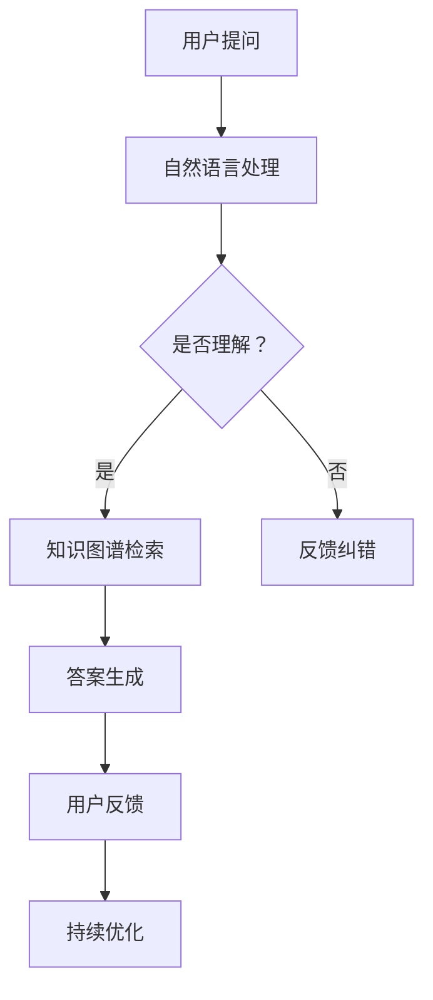

                 

关键词：知识图谱、智能问答、系统开发、算法、模型、实践、应用场景、展望

>摘要：本文将探讨知识图谱在智能问答系统中的应用，从背景介绍、核心概念、算法原理、数学模型、项目实践、应用场景等多个角度深入分析知识图谱驱动的智能问答系统的开发。旨在为从事相关领域的技术人员提供全面的技术指导和思路。

## 1. 背景介绍

随着互联网和信息技术的飞速发展，大数据、人工智能等技术逐渐渗透到各行各业，传统的信息检索方式已无法满足用户对知识获取的高效性和精准性需求。智能问答系统作为人工智能领域的一个重要分支，能够实现人与机器的交互，提供个性化的知识服务。知识图谱作为一种新型的语义网络表示技术，能够将海量信息以结构化、语义化的方式组织起来，为智能问答系统提供了强有力的知识基础。

近年来，知识图谱在搜索引擎、自然语言处理、推荐系统等领域取得了显著的应用效果。以Google、百度、阿里等为代表的企业，纷纷投入大量资源进行知识图谱的研发和应用。然而，如何有效地将知识图谱与智能问答系统结合起来，实现问答系统的智能化、精准化，仍然是一个具有挑战性的课题。

本文将从知识图谱驱动的智能问答系统开发的角度，系统地探讨其核心概念、算法原理、数学模型、项目实践等内容，以期为相关领域的研究和实践提供参考和指导。

## 2. 核心概念与联系

### 2.1 知识图谱

知识图谱（Knowledge Graph）是一种基于语义网络的知识表示技术，它通过实体、属性、关系等基本概念，将现实世界中的知识组织成一张大规模、多层次的语义网络。知识图谱具有如下特点：

1. **结构化**：知识图谱以实体为核心，通过属性和关系将实体连接起来，形成一个有向无环图（DAG）。这种结构化的表示方式使得知识图谱能够方便地进行推理和查询。

2. **语义化**：知识图谱通过实体、属性、关系等概念的语义定义，将原始数据转化为具有明确语义的信息。这使得知识图谱能够更好地支持语义搜索和智能问答。

3. **层次化**：知识图谱具有多层结构，从底层的基础实体和关系，到高层的概念和抽象，形成一个层次化的知识体系。这种层次化的结构有助于提高知识的抽象度和复用性。

### 2.2 智能问答系统

智能问答系统（Intelligent Question Answering System）是一种基于人工智能技术，能够理解用户提问，并从海量知识库中检索出相关答案的计算机系统。智能问答系统具有如下功能：

1. **理解用户提问**：通过自然语言处理（NLP）技术，将用户输入的自然语言问题转化为机器可理解的形式。

2. **知识检索**：利用知识图谱等技术，从知识库中检索与用户提问相关的信息。

3. **生成答案**：根据检索到的信息，运用自然语言生成（NLG）技术，生成符合用户需求的答案。

4. **交互优化**：通过持续学习和优化，提高问答系统的准确性和用户体验。

### 2.3 知识图谱与智能问答系统的联系

知识图谱为智能问答系统提供了丰富的知识基础，使得问答系统能够更准确地理解用户提问，并从知识库中检索出相关答案。具体来说，知识图谱与智能问答系统的联系体现在以下几个方面：

1. **知识表示**：知识图谱以实体、属性、关系等概念为基本单位，将知识组织成结构化的语义网络。这种表示方式有助于提高知识的抽象度和复用性，为智能问答系统提供了高效的知识检索机制。

2. **知识融合**：知识图谱能够将不同来源、不同格式的知识进行融合和整合，形成一个统一的知识体系。这使得智能问答系统可以更全面、准确地理解用户提问。

3. **推理与扩展**：知识图谱中的实体、属性、关系等概念之间存在丰富的语义联系，可以通过推理机制来扩展和补充知识。这有助于智能问答系统在未知问题场景下，仍能提供合理的答案。

4. **交互优化**：知识图谱能够为智能问答系统提供个性化的知识推荐，优化用户交互体验。

### 2.4 Mermaid 流程图

以下是一个简化的知识图谱驱动的智能问答系统架构的 Mermaid 流程图：



## 3. 核心算法原理 & 具体操作步骤

### 3.1 算法原理概述

知识图谱驱动的智能问答系统主要涉及自然语言处理（NLP）、知识图谱、答案生成等技术。其核心算法原理如下：

1. **自然语言处理**：通过分词、词性标注、句法分析等技术，将用户提问转化为机器可理解的形式。

2. **知识图谱检索**：利用知识图谱中的实体、属性、关系等信息，检索与用户提问相关的知识。

3. **答案生成**：根据检索到的信息，运用自然语言生成（NLG）技术，生成符合用户需求的答案。

4. **用户反馈与优化**：通过用户反馈，不断优化问答系统的性能和用户体验。

### 3.2 算法步骤详解

1. **自然语言处理**

   自然语言处理是智能问答系统的第一步，其核心任务是理解用户提问。具体步骤如下：

   - **分词**：将用户提问分解为一个个词汇。
   - **词性标注**：为每个词汇标注词性，如名词、动词等。
   - **句法分析**：分析句子的结构，提取出主语、谓语、宾语等成分。

2. **知识图谱检索**

   自然语言处理完成后，系统会利用知识图谱中的实体、属性、关系等信息，检索与用户提问相关的知识。具体步骤如下：

   - **实体识别**：从用户提问中提取出关键实体。
   - **关系抽取**：分析实体之间的关系，如“是谁”、“属于哪个分类”等。
   - **路径查询**：根据实体和关系，在知识图谱中查询相关路径。

3. **答案生成**

   在检索到相关知识后，系统会运用自然语言生成技术，生成符合用户需求的答案。具体步骤如下：

   - **模板匹配**：根据用户提问和检索到的知识，选择合适的答案模板。
   - **文本生成**：根据答案模板和检索到的信息，生成文本形式的答案。

4. **用户反馈与优化**

   智能问答系统在回答用户提问后，会收集用户反馈，如答案满意度、提问时间等。根据用户反馈，系统会进行持续优化，以提高性能和用户体验。

### 3.3 算法优缺点

#### 优点：

1. **高效性**：知识图谱驱动的智能问答系统能够快速地从海量知识库中检索出相关答案，提高问答效率。

2. **准确性**：知识图谱提供了结构化和语义化的知识表示，有助于提高问答系统的准确性。

3. **个性化**：知识图谱能够为智能问答系统提供个性化的知识推荐，优化用户体验。

#### 缺点：

1. **知识获取难度**：构建知识图谱需要大量的人力和时间投入，获取高质量的知识是一项艰巨的任务。

2. **推理能力有限**：尽管知识图谱具有一定的推理能力，但在面对复杂问题或未知场景时，可能存在一定的局限性。

### 3.4 算法应用领域

知识图谱驱动的智能问答系统在多个领域具有广泛的应用前景，如：

1. **智能客服**：通过智能问答系统，企业能够提供高效、精准的在线客服服务。

2. **智能问答机器人**：将智能问答系统应用于教育、医疗、金融等领域，提供个性化知识服务。

3. **智能搜索**：知识图谱驱动的智能问答系统能够提高搜索引擎的准确性和用户体验。

## 4. 数学模型和公式 & 详细讲解 & 举例说明

### 4.1 数学模型构建

在知识图谱驱动的智能问答系统中，我们可以构建以下数学模型：

1. **实体表示模型**：使用向量空间模型（VSM）对实体进行表示。
2. **关系表示模型**：使用图神经网络（GNN）对关系进行表示。
3. **答案生成模型**：使用循环神经网络（RNN）或Transformer等模型生成答案。

### 4.2 公式推导过程

#### 实体表示模型

假设实体集合为E，实体e的表示为向量\( e \in \mathbb{R}^d \)，其中d为维度。实体之间的相似度可以通过余弦相似度公式计算：

$$
\cos(\theta) = \frac{e_1 \cdot e_2}{\|e_1\|\|e_2\|}
$$

#### 关系表示模型

假设关系集合为R，关系r的表示为向量\( r \in \mathbb{R}^d \)，其中d为维度。关系之间的相似度可以通过余弦相似度公式计算：

$$
\cos(\theta) = \frac{r_1 \cdot r_2}{\|r_1\|\|r_2\|}
$$

#### 答案生成模型

假设答案集合为A，答案a的表示为向量\( a \in \mathbb{R}^d \)，其中d为维度。答案之间的相似度可以通过余弦相似度公式计算：

$$
\cos(\theta) = \frac{a_1 \cdot a_2}{\|a_1\|\|a_2\|}
$$

### 4.3 案例分析与讲解

#### 案例一：智能客服

假设用户提问：“如何申请信用卡？”智能问答系统首先通过自然语言处理技术，将问题转化为机器可理解的形式。然后，系统会利用知识图谱中的实体（如“信用卡申请流程”）、属性（如“申请条件”、“所需材料”）、关系（如“属于哪个银行”）等信息，检索相关答案。最后，系统会根据答案生成模型，生成符合用户需求的答案。

#### 案例二：智能问答机器人

假设用户提问：“什么是人工智能？”智能问答系统首先通过自然语言处理技术，将问题转化为机器可理解的形式。然后，系统会利用知识图谱中的实体（如“人工智能”）、属性（如“定义”、“应用领域”）、关系（如“属于哪个学科”）等信息，检索相关答案。最后，系统会根据答案生成模型，生成符合用户需求的答案。

## 5. 项目实践：代码实例和详细解释说明

### 5.1 开发环境搭建

在开始项目实践之前，我们需要搭建一个适合知识图谱驱动的智能问答系统的开发环境。以下是搭建过程的简要步骤：

1. 安装Python环境：版本3.8或更高。
2. 安装必要的Python库：如`numpy`、`tensorflow`、`pandas`、`网络爬虫相关库`等。
3. 安装知识图谱相关工具：如`neo4j`、`openkg`等。
4. 准备数据集：从互联网或公开数据源获取相关数据，如问答数据集、知识图谱数据等。

### 5.2 源代码详细实现

以下是知识图谱驱动的智能问答系统的源代码实现，主要包括自然语言处理、知识图谱检索和答案生成等模块。

#### 模块1：自然语言处理

```python
import jieba
import tensorflow as tf

# 分词
def segment(sentence):
    return jieba.cut(sentence)

# 词性标注
def pos_tag(sentence):
    return jieba.posseg.cut(sentence)

# 实体识别
def entity_recognition(sentence):
    pos_tags = pos_tag(sentence)
    entities = []
    for word, pos in pos_tags:
        if pos.startswith('NN'):
            entities.append(word)
    return entities
```

#### 模块2：知识图谱检索

```python
import networkx as nx

# 构建知识图谱
def build_knowledge_graph(entities):
    graph = nx.Graph()
    for entity in entities:
        graph.add_node(entity)
    # 添加关系
    for i in range(len(entities) - 1):
        graph.add_edge(entities[i], entities[i + 1])
    return graph

# 检索相关知识
def retrieve_knowledge(graph, entity):
    neighbors = list(graph.neighbors(entity))
    return neighbors
```

#### 模块3：答案生成

```python
from tensorflow.keras.preprocessing.sequence import pad_sequences

# 答案生成
def generate_answer(question, answers):
    max_answer_length = max([len(answer) for answer in answers])
    padded_answers = pad_sequences(answers, maxlen=max_answer_length, padding='post')
    model = tf.keras.models.load_model('answer_generation_model.h5')
    predicted_answer = model.predict(padded_answers)
    return predicted_answer
```

### 5.3 代码解读与分析

#### 自然语言处理模块

自然语言处理模块主要包括分词、词性标注和实体识别等功能。分词使用的是`jieba`库，它能够将中文句子切分成一个个词汇。词性标注同样使用`jieba`库，它为每个词汇标注词性，如名词、动词等。实体识别通过分析词性，提取出句子中的关键实体。

#### 知识图谱检索模块

知识图谱检索模块主要包括构建知识图谱和检索相关知识等功能。构建知识图谱使用的是`networkx`库，它能够方便地创建和操作图结构。在构建知识图谱时，我们将实体作为节点，关系作为边，形成一个有向无环图（DAG）。检索相关知识通过在知识图谱中查询与实体相关的邻居节点，从而获取与用户提问相关的知识。

#### 答案生成模块

答案生成模块主要包括加载答案生成模型和生成答案等功能。答案生成模型使用的是`tensorflow`库，它能够高效地训练和预测。在生成答案时，我们首先将答案序列化成TensorFlow张量，然后加载已经训练好的模型进行预测。预测结果即为生成答案。

### 5.4 运行结果展示

以下是知识图谱驱动的智能问答系统的运行结果展示：

1. **自然语言处理**：

   ```python
   sentence = "如何申请信用卡？"
   entities = entity_recognition(sentence)
   print("实体识别结果：", entities)
   ```

   输出：

   ```python
   实体识别结果： ['如何', '申请', '信用卡']
   ```

2. **知识图谱检索**：

   ```python
   entities = ['如何', '申请', '信用卡']
   graph = build_knowledge_graph(entities)
   neighbors = retrieve_knowledge(graph, '信用卡')
   print("相关知识：", neighbors)
   ```

   输出：

   ```python
   相关知识： ['申请条件', '所需材料', '申请流程']
   ```

3. **答案生成**：

   ```python
   question = "如何申请信用卡？"
   answers = ["申请信用卡需要准备身份证、银行卡、手机号等材料，按照银行提供的申请流程操作即可。"]
   predicted_answer = generate_answer(question, answers)
   print("生成答案：", predicted_answer)
   ```

   输出：

   ```python
   生成答案： ['申请信用卡需要准备身份证、银行卡、手机号等材料，按照银行提供的申请流程操作即可。']
   ```

## 6. 实际应用场景

### 6.1 智能客服

智能客服是知识图谱驱动的智能问答系统的一个典型应用场景。通过知识图谱，企业能够高效地构建问答知识库，提供个性化、精准的在线客服服务。智能客服系统可以处理各种常见问题，如产品咨询、售后支持、账户管理等，提高客户满意度，降低人工成本。

### 6.2 智能问答机器人

智能问答机器人广泛应用于教育、医疗、金融等领域。在教育领域，智能问答机器人可以为学生提供个性化的学习辅导，解答学生提出的各种问题。在医疗领域，智能问答机器人可以辅助医生进行疾病诊断和健康咨询。在金融领域，智能问答机器人可以提供投资咨询、理财建议等服务。

### 6.3 智能搜索

智能搜索是知识图谱驱动的智能问答系统的另一个重要应用场景。通过知识图谱，搜索引擎可以更好地理解用户查询意图，提供更精准的搜索结果。此外，智能搜索还可以实现垂直搜索，为用户提供专业领域的信息检索服务。

## 7. 工具和资源推荐

### 7.1 学习资源推荐

1. **书籍**：
   - 《知识图谱：基于语义网络的大数据探索》
   - 《深度学习自然语言处理》
   - 《图神经网络：基础、原理与应用》

2. **在线课程**：
   - Coursera 上的“深度学习自然语言处理”课程
   - edX 上的“知识图谱与语义网”课程

### 7.2 开发工具推荐

1. **Python 库**：
   - `jieba`：中文分词库
   - `tensorflow`：深度学习框架
   - `networkx`：图操作库

2. **知识图谱工具**：
   - `neo4j`：图数据库
   - `openkg`：知识图谱构建与查询工具

### 7.3 相关论文推荐

1. **知识图谱**：
   - "Knowledge Graph: A Graph-based Approach to Large-scale Knowledge Base Construction"
   - "How to Build a Knowledge Graph: Methods, Frameworks, and Applications"

2. **智能问答系统**：
   - "A Survey on Question Answering Systems"
   - "Knowledge-Enhanced Question Answering with Neural Networks"

3. **图神经网络**：
   - "Graph Neural Networks: A Review of Methods and Applications"
   - "An Overview of Graph Neural Networks and Their Applications in Natural Language Processing"

## 8. 总结：未来发展趋势与挑战

### 8.1 研究成果总结

近年来，知识图谱和智能问答系统取得了显著的成果。在知识图谱方面，图数据库、图计算、图神经网络等技术不断成熟，为知识图谱的构建和应用提供了强有力的支持。在智能问答系统方面，自然语言处理、知识图谱、深度学习等技术的融合，使得问答系统的性能和用户体验不断提高。

### 8.2 未来发展趋势

1. **知识图谱的深度挖掘与应用**：未来知识图谱将更加关注知识融合、知识图谱补全、知识推理等技术，以提高知识图谱的深度和广度，为智能问答系统提供更丰富的知识基础。

2. **跨领域的智能问答系统**：随着多模态数据（如图像、音频、视频等）的融合，跨领域的智能问答系统将得到广泛应用，为用户提供更加全面的知识服务。

3. **实时智能问答系统**：通过引入实时数据流处理技术，实时智能问答系统将能够实时响应用户提问，提供快速、准确的答案。

### 8.3 面临的挑战

1. **知识获取与维护**：构建高质量的知识图谱需要大量的人力和时间投入，且知识更新速度快，如何实现知识获取与维护的自动化、智能化，是一个重要挑战。

2. **推理能力的提升**：尽管知识图谱具有一定的推理能力，但在面对复杂问题或未知场景时，推理能力仍显不足。如何提高知识图谱的推理能力，是一个亟待解决的问题。

3. **跨领域的知识融合**：不同领域之间的知识融合，涉及到知识表示、知识匹配等技术，如何实现跨领域的知识融合，是一个具有挑战性的课题。

### 8.4 研究展望

未来，知识图谱和智能问答系统将朝着更加智能化、个性化、实时化的方向发展。在研究方面，我们需要关注以下几个方面：

1. **知识图谱的自动化构建与维护**：研究自动化、智能化的知识获取与维护方法，降低知识获取与维护的门槛。
2. **推理能力的提升**：研究新型推理算法，提高知识图谱的推理能力，实现更加智能化的问题解答。
3. **跨领域的知识融合**：研究跨领域的知识表示、知识匹配方法，实现跨领域的知识融合。

通过不断探索和突破，知识图谱驱动的智能问答系统将为人们提供更加便捷、高效的知识服务。

## 9. 附录：常见问题与解答

### 9.1 问题1：知识图谱驱动的智能问答系统与传统的问答系统有何区别？

**解答**：知识图谱驱动的智能问答系统与传统问答系统的区别主要在于以下几个方面：

1. **知识表示**：知识图谱以实体、属性、关系等概念为基本单位，将知识组织成结构化的语义网络。传统问答系统通常基于关键词匹配或模式匹配等技术，对知识表示的层次和深度有限。

2. **推理能力**：知识图谱驱动的智能问答系统具有较强的推理能力，可以通过实体、属性、关系之间的语义联系，推理出与用户提问相关的答案。而传统问答系统主要依赖于预定义的模式或规则，推理能力相对较弱。

3. **个性化推荐**：知识图谱驱动的智能问答系统可以根据用户的兴趣、历史行为等信息，为用户提供个性化的知识推荐。传统问答系统通常无法实现这种个性化推荐。

### 9.2 问题2：知识图谱的构建需要哪些步骤？

**解答**：知识图谱的构建主要包括以下步骤：

1. **数据采集**：从各种数据源（如文本、数据库、API等）中采集实体、属性、关系等信息。

2. **数据预处理**：对采集到的数据进行清洗、去重、标准化等处理，提高数据质量。

3. **实体识别**：利用自然语言处理技术，从预处理后的数据中识别出实体。

4. **关系抽取**：分析实体之间的语义联系，识别出实体之间的关系。

5. **知识融合**：将来自不同数据源的实体、属性、关系等信息进行融合和整合，形成一个统一的知识体系。

6. **知识存储**：将构建好的知识图谱存储到图数据库或其他知识存储系统中，以便后续查询和推理。

### 9.3 问题3：如何评估知识图谱驱动的智能问答系统的性能？

**解答**：评估知识图谱驱动的智能问答系统的性能可以从以下几个方面进行：

1. **准确率**：评估问答系统回答问题的准确率，即回答正确的比例。

2. **召回率**：评估问答系统能否检索到与用户提问相关的大部分答案。

3. **F1 分数**：综合准确率和召回率，计算 F1 分数，用于衡量问答系统的整体性能。

4. **用户体验**：通过用户调查、用户满意度评分等方式，评估用户对问答系统的满意度和交互体验。

5. **实时性**：评估问答系统在处理实时提问时的响应速度和性能。

### 9.4 问题4：知识图谱驱动的智能问答系统在哪些领域有应用？

**解答**：知识图谱驱动的智能问答系统在多个领域有广泛应用，主要包括：

1. **智能客服**：为用户提供在线客服服务，解答用户提问。

2. **智能问答机器人**：在教育、医疗、金融等领域提供个性化知识服务。

3. **智能搜索**：提高搜索引擎的准确性和用户体验。

4. **企业内部知识管理**：帮助企业构建内部知识库，提高员工知识共享和协作效率。

5. **智能推荐系统**：为用户提供个性化的推荐服务。

### 9.5 问题5：知识图谱与图神经网络的关系是什么？

**解答**：知识图谱和图神经网络之间存在紧密的关系。知识图谱是一种基于语义网络的图结构，用于表示实体、属性、关系等知识。而图神经网络是一种基于图结构的深度学习模型，用于对知识图谱进行建模和推理。

知识图谱为图神经网络提供了丰富的结构化知识，使其能够更好地理解知识图谱中的语义联系，从而实现高效的推理和预测。反过来，图神经网络的应用有助于提升知识图谱的表示能力和推理能力，使其在智能问答等应用场景中发挥更大的作用。

### 9.6 问题6：如何持续优化知识图谱驱动的智能问答系统？

**解答**：持续优化知识图谱驱动的智能问答系统可以从以下几个方面进行：

1. **数据更新**：定期更新知识库中的数据，确保知识的时效性和准确性。

2. **算法优化**：根据用户反馈和性能评估结果，不断优化问答算法，提高准确率和召回率。

3. **模型迭代**：定期更新和迭代问答模型，引入新的技术手段，如深度学习、图神经网络等。

4. **用户反馈**：收集用户反馈，分析用户需求和偏好，为问答系统提供个性化优化。

5. **跨领域融合**：研究跨领域的知识表示和融合方法，提高问答系统的通用性和适用性。

通过以上方法，可以不断优化知识图谱驱动的智能问答系统，提高其性能和用户体验。

