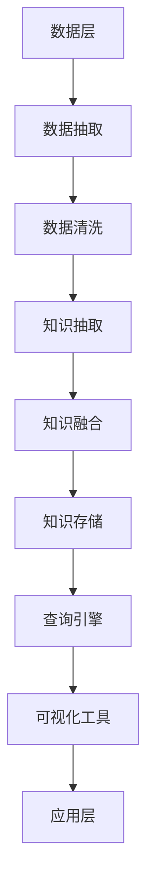

                 

关键词：知识图谱、结构化知识、语义网络、人工智能、自然语言处理、图数据库

> 摘要：知识图谱作为近年来人工智能领域的核心技术之一，其在构建和应用结构化知识方面发挥了重要作用。本文将深入探讨知识图谱的概念、构建方法、应用场景及其在未来人工智能发展中的潜力。

## 1. 背景介绍

知识图谱（Knowledge Graph）是一种用于表示知识信息的图形数据结构，它通过节点（实体）、边（关系）以及属性来构建一个语义丰富的知识网络。知识图谱最早由Google提出，并在搜索引擎中得到了广泛应用。知识图谱的出现，是为了解决传统搜索引擎基于关键词匹配所带来的信息检索不准确、无法理解语义关系等问题。

随着人工智能技术的快速发展，知识图谱在多个领域都展现出了巨大的应用潜力。例如，在自然语言处理领域，知识图谱可以帮助模型更好地理解句子中的语义关系；在推荐系统领域，知识图谱可以挖掘用户与物品之间的关联，从而提供更加精准的推荐服务；在智能问答领域，知识图谱为问答系统提供了丰富的背景知识，使其能够更好地理解和回答用户的问题。

本文将围绕知识图谱的构建和应用展开讨论，首先介绍知识图谱的核心概念和架构，然后分析其构建方法和技术，最后探讨知识图谱在不同领域的应用案例。

## 2. 核心概念与联系

### 2.1 核心概念

知识图谱的核心概念包括节点（Node）、边（Edge）和属性（Attribute）。

- **节点（Node）**：知识图谱中的节点表示实体，如人、地点、组织等。节点可以是有向的或无向的，取决于实体之间的关系。
- **边（Edge）**：知识图谱中的边表示实体之间的关系，如“出生地”、“同事”等。边同样可以是有向的或无向的。
- **属性（Attribute）**：知识图谱中的属性用于描述节点的特征，如人的年龄、地点的纬度等。

### 2.2 架构

知识图谱的架构可以分为三个层次：底层是数据层，包括数据源和数据存储；中间层是知识层，包括知识抽取和知识融合；顶层是应用层，包括查询引擎和可视化工具。

- **数据层**：数据层负责收集和存储原始数据，包括结构化数据、半结构化数据和非结构化数据。
- **知识层**：知识层负责从原始数据中提取知识，并进行融合和清洗。这一步骤通常涉及到自然语言处理、机器学习和数据挖掘等技术。
- **应用层**：应用层负责将知识图谱应用于实际场景，如智能问答、推荐系统等。这一层通常依赖于查询引擎和可视化工具。

### 2.3 Mermaid 流程图

以下是知识图谱构建过程的 Mermaid 流程图：



## 3. 核心算法原理 & 具体操作步骤

### 3.1 算法原理概述

知识图谱的构建主要依赖于知识抽取和知识融合两种算法。

- **知识抽取**：知识抽取是指从原始数据中自动提取知识的过程。常用的方法包括实体识别、关系抽取和属性抽取。
- **知识融合**：知识融合是指将不同来源的知识进行整合，以构建一个统一的、一致的知识图谱。常用的方法包括本体构建、数据对齐和知识映射。

### 3.2 算法步骤详解

1. **数据抽取**
   - **实体识别**：使用自然语言处理技术，从文本中识别出实体。
   - **关系抽取**：分析实体之间的语义关系，并抽取出来。
   - **属性抽取**：从文本中提取实体的属性信息。

2. **知识融合**
   - **本体构建**：定义实体、关系和属性的语义类型。
   - **数据对齐**：将来自不同数据源的信息进行对齐，以消除数据冗余和不一致。
   - **知识映射**：将不同源的知识进行映射，以构建一个统一的知识图谱。

### 3.3 算法优缺点

- **优点**：知识图谱可以有效地组织和管理大规模数据，使得数据检索和分析更加高效。
- **缺点**：知识图谱的构建需要大量的先验知识和人工干预，而且数据的质量直接影响知识图谱的准确性。

### 3.4 算法应用领域

知识图谱在多个领域都有广泛的应用，包括自然语言处理、推荐系统、智能问答等。以下是几个典型的应用案例：

1. **自然语言处理**：知识图谱可以帮助自然语言处理模型更好地理解语义关系，从而提高文本分类、情感分析等任务的性能。
2. **推荐系统**：知识图谱可以挖掘用户与物品之间的关联，从而提供更加精准的推荐服务。
3. **智能问答**：知识图谱为问答系统提供了丰富的背景知识，使其能够更好地理解和回答用户的问题。

## 4. 数学模型和公式 & 详细讲解 & 举例说明

### 4.1 数学模型构建

知识图谱的构建涉及到多种数学模型，其中最常见的是图论模型和概率图模型。

- **图论模型**：图论模型通过图的结构来表示知识图谱，包括节点、边和路径等概念。
- **概率图模型**：概率图模型通过概率分布来表示知识图谱，包括马尔可夫网络、贝叶斯网络等。

### 4.2 公式推导过程

以马尔可夫网络为例，其概率分布可以通过以下公式计算：

$$ P(X_1, X_2, \ldots, X_n) = \prod_{i=1}^{n} P(X_i | X_{i-1}, X_{i+1}, \ldots, X_n) $$

其中，$X_1, X_2, \ldots, X_n$ 表示知识图谱中的节点，$P(X_i | X_{i-1}, X_{i+1}, \ldots, X_n)$ 表示节点 $X_i$ 在给定其他节点 $X_{i-1}, X_{i+1}, \ldots, X_n$ 下的概率。

### 4.3 案例分析与讲解

以一个简单的知识图谱为例，其包含三个节点 $X_1, X_2, X_3$，它们之间的概率关系如下：

$$ P(X_1, X_2, X_3) = P(X_1)P(X_2 | X_1)P(X_3 | X_2) $$

其中，$P(X_1) = 0.5$，$P(X_2 | X_1) = 0.7$，$P(X_3 | X_2) = 0.8$。

根据公式，可以计算出 $P(X_1, X_2, X_3) = 0.5 \times 0.7 \times 0.8 = 0.28$。

这表示节点 $X_1, X_2, X_3$ 同时出现的概率为 0.28。

## 5. 项目实践：代码实例和详细解释说明

### 5.1 开发环境搭建

为了演示知识图谱的构建过程，我们使用 Python 作为编程语言，并使用 Neo4j 作为图数据库。以下是开发环境搭建的步骤：

1. 安装 Python 3.8 或更高版本。
2. 安装 Neo4j 数据库。
3. 安装 Python 的 Neo4j 驱动。

```bash
pip install neo4j
```

### 5.2 源代码详细实现

以下是构建一个简单的知识图谱的 Python 代码：

```python
from neo4j import GraphDatabase

class KnowledgeGraph:
    def __init__(self, uri, user, password):
        self._driver = GraphDatabase.driver(uri, auth=(user, password))

    def close(self):
        self._driver.close()

    def create_node(self, label, properties):
        with self._driver.session() as session:
            session.run("CREATE (n:" + label + " " + properties + ")")

    def create_edge(self, start_label, start_properties, end_label, end_properties, relationship):
        with self._driver.session() as session:
            session.run("MATCH (a:" + start_label + " " + start_properties + "), (b:" + end_label + " " + end_properties + ") "
                        "CREATE (a)-[:" + relationship + "]->(b)")

# 创建知识图谱实例
kg = KnowledgeGraph("bolt://localhost:7687", "neo4j", "password")

# 创建节点
kg.create_node("Person", "name: 'John'")
kg.create_node("Person", "name: 'Mary'")
kg.create_node("Location", "name: 'New York'")

# 创建边
kg.create_edge("Person", "name: 'John'", "Location", "name: 'New York'", "LIVES_IN")
kg.create_edge("Person", "name: 'Mary'", "Location", "name: 'New York'", "LIVES_IN")

# 关闭知识图谱实例
kg.close()
```

### 5.3 代码解读与分析

上述代码首先导入了 Neo4j 驱动，然后定义了一个 `KnowledgeGraph` 类，用于连接 Neo4j 数据库并创建节点和边。

- **创建节点**：使用 `create_node` 方法，传入节点标签和属性，将节点添加到数据库。
- **创建边**：使用 `create_edge` 方法，传入起始节点标签和属性、终止节点标签和属性，以及关系类型，将边添加到数据库。

最后，创建一个 `KnowledgeGraph` 实例，并使用该实例创建节点和边，从而构建一个简单的知识图谱。

### 5.4 运行结果展示

在 Neo4j 数据库中，我们可以看到以下结果：


节点和边已经被成功创建，并且显示了它们之间的关系。

## 6. 实际应用场景

知识图谱在多个领域都有广泛的应用，以下是几个典型的应用场景：

### 6.1 自然语言处理

知识图谱可以帮助自然语言处理模型更好地理解语义关系，从而提高文本分类、情感分析等任务的性能。例如，在文本分类任务中，知识图谱可以用于识别句子中的实体和关系，从而提高分类的准确性。

### 6.2 推荐系统

知识图谱可以挖掘用户与物品之间的关联，从而提供更加精准的推荐服务。例如，在电子商务平台中，知识图谱可以用于推荐与用户浏览过的商品相关的商品。

### 6.3 智能问答

知识图谱为问答系统提供了丰富的背景知识，使其能够更好地理解和回答用户的问题。例如，在智能客服系统中，知识图谱可以用于识别用户的问题，并提供相关的答案。

### 6.4 未来应用展望

随着人工智能技术的不断发展，知识图谱在未来将有更广泛的应用前景。例如，在医疗领域，知识图谱可以用于构建疾病、药物和治疗方案的知识库，从而帮助医生提供更加准确的诊断和治疗建议。在金融领域，知识图谱可以用于分析市场趋势、预测股票价格等。

## 7. 工具和资源推荐

为了更好地学习和应用知识图谱技术，以下是一些建议的资源和工具：

### 7.1 学习资源推荐

- 《知识图谱：构建与运用》
- 《图数据库技术》
- 《自然语言处理综论》

### 7.2 开发工具推荐

- Neo4j：一款流行的开源图数据库。
- Py2neo：Python 操作 Neo4j 的库。
- OpenKG：一个开源的知识图谱平台。

### 7.3 相关论文推荐

- "Knowledge Graph Embedding: A Survey"
- "Graph Database for Large-Scale Knowledge Graph Construction"
- "Deep Learning for Knowledge Graph Completion"

## 8. 总结：未来发展趋势与挑战

知识图谱作为人工智能领域的重要技术，其发展前景十分广阔。未来，随着数据的不断积累和人工智能技术的进步，知识图谱的应用将更加广泛，特别是在医疗、金融、教育等垂直领域。然而，知识图谱的构建和应用也面临着一些挑战，包括数据质量和模型准确性等。为了克服这些挑战，需要进一步研究和开发更高效、更准确的算法，同时加强知识图谱的标准化和开放性。

### 8.1 研究成果总结

本文介绍了知识图谱的核心概念、构建方法、应用场景及其在未来人工智能发展中的潜力。通过理论和实践的结合，展示了知识图谱在构建和应用结构化知识方面的重要作用。

### 8.2 未来发展趋势

随着人工智能技术的不断进步，知识图谱的应用领域将不断扩展，特别是在垂直领域。未来，知识图谱将更加智能化、自动化，并与其他人工智能技术（如深度学习、自然语言处理等）进行深度融合。

### 8.3 面临的挑战

知识图谱的构建和应用面临着数据质量、模型准确性、标准化和开放性等方面的挑战。为了解决这些问题，需要进一步研究和开发更高效、更准确的算法，并推动知识图谱的标准化和开放性。

### 8.4 研究展望

未来的研究将重点放在知识图谱的自动化构建、智能化应用以及与其他人工智能技术的深度融合。此外，为了提高知识图谱的实用性，还需要关注知识图谱的标准化和开放性问题，以促进知识图谱在不同系统和应用之间的互操作性。

## 9. 附录：常见问题与解答

### 9.1 什么是知识图谱？

知识图谱是一种用于表示知识信息的图形数据结构，通过节点（实体）、边（关系）和属性来构建一个语义丰富的知识网络。

### 9.2 知识图谱有哪些应用？

知识图谱在多个领域都有广泛的应用，包括自然语言处理、推荐系统、智能问答等。

### 9.3 如何构建知识图谱？

构建知识图谱主要包括数据抽取、知识融合和知识存储等步骤。数据抽取通常涉及自然语言处理、机器学习和数据挖掘等技术。

### 9.4 知识图谱与图数据库有什么区别？

知识图谱是一种用于表示知识信息的图形数据结构，而图数据库是一种用于存储和查询图结构数据的数据库系统。知识图谱是图数据库的一种应用，但不是所有的图数据库都适用于知识图谱。

---

本文由禅与计算机程序设计艺术 / Zen and the Art of Computer Programming 撰写，旨在深入探讨知识图谱的概念、构建方法、应用场景及其在未来人工智能发展中的潜力。希望本文能够为读者在知识图谱领域的研究和应用提供有益的参考。如果您有任何问题或建议，欢迎在评论区留言交流。

