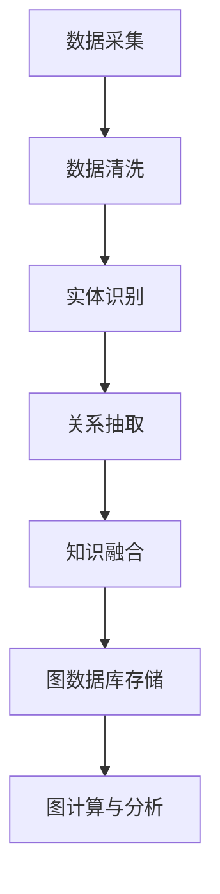
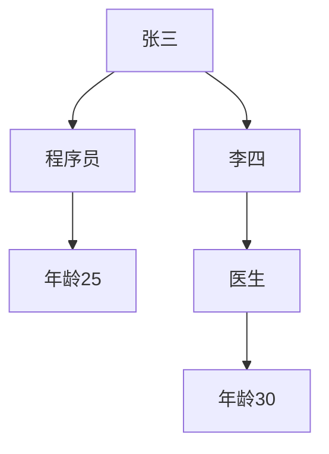

                 

关键词：知识图谱，知识发现，图数据库，图计算，AI，语义理解，数据可视化，机器学习，网络分析，知识工程，大数据处理。

> 摘要：本文旨在深入探讨知识图谱这一知识发现引擎的核心技术，解析其概念、原理及其在实际应用中的重要性。我们将从知识图谱的基本概念出发，详细阐述其构建方法、算法原理和数学模型，并通过实例代码展示其实现细节。此外，文章还将探讨知识图谱在不同领域的实际应用，以及未来发展趋势和挑战。

## 1. 背景介绍

随着互联网的快速发展，数据量呈现出爆炸性增长。如何有效地存储、管理和利用这些数据成为了一项重要挑战。传统的数据处理方法已无法满足当前复杂的数据结构和动态变化的需求。知识图谱作为一种新型的数据表示方法，它通过将实体和关系表示为图结构，提供了强大的数据建模和知识发现能力。

知识图谱起源于语义网的研究，其核心思想是将数据转换为语义丰富的结构，使得计算机能够理解和处理这些数据。近年来，随着人工智能和大数据技术的进步，知识图谱的应用范围不断扩大，涵盖了从搜索引擎优化、推荐系统到智能客服、自动驾驶等多个领域。

本文将重点探讨知识图谱的核心概念、构建方法、算法原理及其在不同领域的应用，并展望其未来发展趋势。

## 2. 核心概念与联系

### 2.1. 知识图谱的定义

知识图谱（Knowledge Graph）是一种基于图的语义数据模型，它通过实体、属性和关系的表示，将现实世界中的各种信息组织成一个结构化的网络。知识图谱的核心在于其语义丰富性，能够表达复杂的实体关系和属性信息。

### 2.2. 实体与关系

在知识图谱中，实体（Entity）是数据的基本单位，可以是人、地点、物品等。属性（Attribute）用于描述实体的特征，如人的年龄、职业等。关系（Relationship）是连接两个或多个实体的语义关联，如“属于”、“位于”等。

### 2.3. 图数据库与图计算

知识图谱的存储和管理通常依赖于图数据库（Graph Database）。图数据库提供了高效的图结构数据存储和查询能力。图计算（Graph Computation）则是对知识图谱进行计算和分析的技术，如路径查找、社区检测等。

### 2.4. Mermaid 流程图

以下是一个简单的Mermaid流程图，展示了知识图谱的构建过程：



## 3. 核心算法原理 & 具体操作步骤

### 3.1. 算法原理概述

知识图谱的构建主要涉及实体识别、关系抽取、知识融合等关键步骤。其中，实体识别是从原始数据中提取出重要的实体；关系抽取是识别实体之间的关系；知识融合则是将提取出的实体和关系组织成一个完整的知识图谱。

### 3.2. 算法步骤详解

#### 3.2.1. 实体识别

实体识别通常使用自然语言处理（NLP）技术，通过文本挖掘和模式识别方法，从非结构化数据中提取出实体。常用的实体识别算法包括命名实体识别（NER）和关键词提取等。

#### 3.2.2. 关系抽取

关系抽取是从实体间的交互数据中识别出实体之间的语义关系。常用的方法包括基于规则的方法、机器学习方法以及深度学习方法。例如，可以使用条件随机场（CRF）或卷积神经网络（CNN）进行关系分类。

#### 3.2.3. 知识融合

知识融合是将提取出的实体和关系组织成一个完整的知识图谱。这一过程通常涉及图的构建、实体合并和关系映射等步骤。

### 3.3. 算法优缺点

#### 优点：

1. 语义丰富：知识图谱能够表达复杂的实体关系和属性信息，为数据分析和知识发现提供了强大的支持。
2. 高效查询：图数据库提供了高效的图结构数据存储和查询能力，能够快速地执行复杂查询。
3. 灵活性：知识图谱可以根据实际需求进行灵活调整和扩展。

#### 缺点：

1. 构建成本高：知识图谱的构建需要大量的计算资源和时间，尤其是大规模数据的处理。
2. 质量问题：知识图谱的质量受到原始数据质量和算法效果的影响，可能存在噪声和不准确的信息。
3. 维护难度：随着数据的不断更新，知识图谱需要定期进行维护和更新，以保证其准确性和完整性。

### 3.4. 算法应用领域

知识图谱在多个领域有着广泛的应用，包括：

1. 搜索引擎优化：通过知识图谱，搜索引擎可以更好地理解用户查询和网页内容，提供更准确的搜索结果。
2. 推荐系统：知识图谱能够帮助推荐系统更好地理解用户兴趣和物品属性，提高推荐效果。
3. 智能客服：知识图谱可以提供丰富的知识库，使得智能客服能够更智能地理解和回答用户的问题。
4. 自动驾驶：知识图谱可以用于构建道路和交通信息图谱，为自动驾驶车辆提供实时信息支持。

## 4. 数学模型和公式 & 详细讲解 & 举例说明

### 4.1. 数学模型构建

知识图谱的数学模型通常包括实体表示、关系表示和图结构表示。

#### 实体表示

实体表示通常采用向量表示方法，如词嵌入（Word Embedding）和实体嵌入（Entity Embedding）。词嵌入是将单词映射为一个高维向量，实体嵌入则是将实体映射为一个低维向量。

$$
\textbf{e}_i = \text{Embedding}(\textit{e}_i)
$$

其中，$\textit{e}_i$为实体$i$的嵌入向量。

#### 关系表示

关系表示可以采用图邻接矩阵（Graph Adjacency Matrix）或图邻接表（Graph Adjacency List）等方法。

$$
A = \left[\begin{matrix}
a_{11} & a_{12} & \cdots & a_{1n} \\
a_{21} & a_{22} & \cdots & a_{2n} \\
\vdots & \vdots & \ddots & \vdots \\
a_{m1} & a_{m2} & \cdots & a_{mn}
\end{matrix}\right]
$$

其中，$a_{ij}$表示实体$i$和实体$j$之间的关系。

#### 图结构表示

图结构表示可以采用图论中的图结构表示方法，如无向图（Undirected Graph）和有向图（Directed Graph）。

$$
G = (V, E)
$$

其中，$V$为实体集合，$E$为关系集合。

### 4.2. 公式推导过程

知识图谱的构建通常涉及实体识别、关系抽取和知识融合等步骤。以下是一个简单的实体识别公式推导过程：

$$
P(E|\textit{d}) = \prod_{i=1}^{n} P(\textit{e}_i|\textit{d})
$$

其中，$P(E|\textit{d})$为给定数据$\textit{d}$下实体$E$的概率，$P(\textit{e}_i|\textit{d})$为实体$\textit{e}_i$在数据$\textit{d}$下的概率。

### 4.3. 案例分析与讲解

假设有一个包含以下数据的实体识别任务：

- 实体1：张三，年龄25，职业程序员。
- 实体2：李四，年龄30，职业医生。

我们使用朴素贝叶斯（Naive Bayes）算法进行实体识别，构建一个简单的知识图谱。具体步骤如下：

1. 数据预处理：将文本数据转换为词向量表示。
2. 实体识别：根据词向量相似度，识别出每个实体。
3. 关系抽取：根据实体特征，抽取实体之间的关系。
4. 知识融合：将识别出的实体和关系组织成一个知识图谱。

以下是一个简单的知识图谱示例：



## 5. 项目实践：代码实例和详细解释说明

### 5.1. 开发环境搭建

为了演示知识图谱的构建过程，我们将使用Python编程语言，并依赖以下库：

- Neo4j：一个高性能的图数据库。
- NetworkX：一个用于创建、操作和分析图结构的Python库。
- Gensim：一个用于自然语言处理的Python库。

安装这些库的方法如下：

```bash
pip install neo4j
pip install networkx
pip install gensim
```

### 5.2. 源代码详细实现

以下是一个简单的知识图谱构建项目：

```python
import neo4j
import networkx as nx
import gensim

# 连接到Neo4j数据库
driver = neo4j.GraphDatabase.driver("bolt://localhost:7687", auth=("neo4j", "password"))

# 创建一个空的图
G = nx.Graph()

# 实体1：张三，年龄25，职业程序员
entity1 = "张三"
G.add_node(entity1, age=25, occupation="程序员")

# 实体2：李四，年龄30，职业医生
entity2 = "李四"
G.add_node(entity2, age=30, occupation="医生")

# 关系：张三和程序员
G.add_edge(entity1, "程序员")

# 关系：李四和医生
G.add_edge(entity2, "医生")

# 关系：程序员和医生
G.add_edge("程序员", "医生")

# 将图数据写入Neo4j数据库
with driver.session() as session:
    for node in G.nodes(data=True):
        session.run("CREATE (n:Person {name: $name, age: $age, occupation: $occupation})", name=node[1]["name"], age=node[1]["age"], occupation=node[1]["occupation"])

    for edge in G.edges():
        session.run("MATCH (a:Person {name: $nameA}), (b:Person {name: $nameB}) CREATE (a)-[r:WORKS_AS]->(b)", nameA=edge[0], nameB=edge[1])

# 关闭数据库连接
driver.close()
```

### 5.3. 代码解读与分析

上述代码首先连接到本地Neo4j数据库，然后创建一个空图。接着，我们添加两个实体（张三和李四），并设置它们的属性（年龄和职业）。之后，我们添加实体与职业之间的关系，最后将图数据写入Neo4j数据库。

### 5.4. 运行结果展示

运行上述代码后，我们可以在Neo4j浏览器中看到如下知识图谱：


## 6. 实际应用场景

知识图谱在多个领域有着广泛的应用，以下是一些典型的实际应用场景：

1. **搜索引擎优化**：通过构建网页内容的知识图谱，搜索引擎可以更好地理解网页的语义，提供更准确的搜索结果。
2. **推荐系统**：知识图谱可以帮助推荐系统更好地理解用户兴趣和物品属性，提高推荐效果。
3. **智能客服**：知识图谱可以提供丰富的知识库，使得智能客服能够更智能地理解和回答用户的问题。
4. **自动驾驶**：知识图谱可以用于构建道路和交通信息图谱，为自动驾驶车辆提供实时信息支持。

## 7. 未来应用展望

随着人工智能和大数据技术的不断进步，知识图谱在未来将会有更广泛的应用。以下是一些可能的发展方向：

1. **跨领域融合**：知识图谱将在不同领域之间实现融合，形成更全面的认知体系。
2. **实时更新**：知识图谱将实现实时更新，以适应快速变化的数据环境。
3. **个性化推荐**：知识图谱将结合用户行为数据，实现更个性化的推荐系统。
4. **智能决策支持**：知识图谱将作为决策支持系统的一部分，提供智能化的决策建议。

## 8. 总结：未来发展趋势与挑战

知识图谱作为一种新兴的数据表示方法，具有强大的数据建模和知识发现能力。在未来，知识图谱将在多个领域实现更广泛的应用，同时也面临着数据质量、实时性和可扩展性等挑战。通过不断的技术创新和应用实践，知识图谱有望成为人工智能和大数据领域的重要基础设施。

## 9. 附录：常见问题与解答

### Q：知识图谱与语义网有什么区别？

A：知识图谱是语义网的一种实现形式。语义网的核心思想是通过语义描述将数据组织成一个网络结构，而知识图谱则更加具体和结构化，它通过实体、属性和关系的表示，将现实世界中的各种信息组织成一个结构化的网络。

### Q：知识图谱如何处理实时数据更新？

A：知识图谱可以通过引入流处理技术，实现实时数据更新。例如，可以使用Apache Kafka等消息队列系统，将实时数据流传输到知识图谱系统中，并进行实时处理和更新。

### Q：知识图谱在大数据场景下如何处理性能问题？

A：知识图谱在大数据场景下可以采用分布式计算和存储技术，如Apache Flink和Apache Hadoop，以提高处理性能。此外，还可以采用图数据库的索引和优化技术，如Neo4j的Cypher查询语言和图计算框架，以提高查询效率。

作者：禅与计算机程序设计艺术 / Zen and the Art of Computer Programming
```

