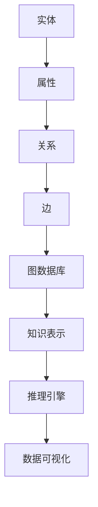

                 

关键词：知识图谱、知识管理、语义网络、人工智能、数据可视化、图数据库

> 摘要：本文旨在深入探讨知识图谱在知识管理中的应用，从基本概念、核心算法到实践应用，全面解析知识图谱如何构建智慧之网，促进知识的深度利用与智慧决策。

## 1. 背景介绍

知识图谱（Knowledge Graph）作为近年来人工智能领域的热门话题，逐渐成为了知识管理和信息检索的重要工具。知识图谱的核心在于将实体、属性和关系通过图结构进行组织，从而实现复杂信息的关联和智能化处理。

### 1.1 知识图谱的发展历程

知识图谱的概念最早可以追溯到2004年，谷歌提出了“知识图谱”（Knowledge Graph）的概念，旨在通过实体及其关系来理解世界。随后，微软、Facebook、百度等公司也相继推出了自己的知识图谱系统。

### 1.2 知识图谱的应用场景

知识图谱广泛应用于搜索引擎、推荐系统、自然语言处理、智能问答等领域。例如，谷歌搜索引擎利用知识图谱提供更加精准的搜索结果，而推荐系统则通过知识图谱挖掘用户兴趣，实现个性化推荐。

## 2. 核心概念与联系

知识图谱的构建依赖于一系列核心概念和原理，下面我们将通过Mermaid流程图来展示这些概念之间的关系。



### 2.1 实体（Entity）

实体是知识图谱中的基本元素，可以是任何具有独立存在意义的事物，如人、地点、组织等。实体是构建知识图谱的基础。

### 2.2 属性（Attribute）

属性描述了实体的某个特征或状态。例如，人的名字、年龄、职业等都是属性。属性是与实体关联的关键信息。

### 2.3 关系（Relationship）

关系表示实体之间的关联，如“居住在”、“属于”等。关系将不同的实体连接起来，形成知识图谱的骨架。

### 2.4 边（Edge）

边是知识图谱中的连接线，表示实体与属性或实体与实体之间的关系。边通常带有权重或类型，以表示关系的强度或类型。

### 2.5 图数据库（Graph Database）

图数据库是专门用于存储和管理图结构数据的数据库系统。它能够高效地处理实体、属性和关系，是构建知识图谱的核心基础设施。

### 2.6 知识表示（Knowledge Representation）

知识表示是将现实世界中的知识抽象为计算机可以处理的数据结构的过程。知识表示方法包括框架表示、逻辑表示、语义网络等。

### 2.7 推理引擎（Reasoning Engine）

推理引擎是知识图谱系统的重要组成部分，它能够基于已有的事实和关系进行逻辑推理，从而发现新的知识和模式。

### 2.8 数据可视化（Data Visualization）

数据可视化是将知识图谱中的信息以图形化的方式呈现，使得用户能够直观地理解和分析知识图谱。

## 3. 核心算法原理 & 具体操作步骤

### 3.1 算法原理概述

知识图谱的构建主要依赖于以下几个核心算法：

1. 实体识别（Entity Recognition）：从非结构化数据中识别出实体。
2. 实体链接（Entity Linking）：将文本中的实体与知识图谱中的实体进行匹配。
3. 关系抽取（Relation Extraction）：从文本中抽取实体之间的关系。
4. 知识融合（Knowledge Fusion）：将来自不同数据源的实体和关系进行整合。

### 3.2 算法步骤详解

1. 数据预处理：对原始数据进行清洗、去噪，确保数据质量。
2. 实体识别：利用命名实体识别（NER）技术，从文本中提取出实体。
3. 实体链接：通过实体识别结果，将文本中的实体与知识图谱中的实体进行匹配。
4. 关系抽取：利用机器学习或深度学习模型，从文本中抽取实体之间的关系。
5. 知识融合：将新提取的实体和关系与知识图谱进行融合，更新知识库。

### 3.3 算法优缺点

**优点：**
- 高效的信息关联：知识图谱能够高效地处理实体和关系，实现复杂信息的关联。
- 强大的推理能力：推理引擎能够基于已有知识进行逻辑推理，发现新的知识和模式。
- 个性化推荐：知识图谱可以用于个性化推荐系统，实现精准的用户兴趣挖掘。

**缺点：**
- 数据质量要求高：知识图谱的构建依赖于高质量的数据，数据预处理和清洗工作量大。
- 算法复杂度高：知识图谱的构建涉及多个复杂算法，实现难度较大。

### 3.4 算法应用领域

知识图谱在多个领域具有广泛的应用：

- 搜索引擎：通过知识图谱提供更加精准的搜索结果。
- 推荐系统：挖掘用户兴趣，实现个性化推荐。
- 自然语言处理：辅助语义理解，提高语言模型的准确性。
- 智能问答：基于知识图谱提供智能化的问答服务。

## 4. 数学模型和公式 & 详细讲解 & 举例说明

### 4.1 数学模型构建

知识图谱的构建过程可以抽象为一个数学模型，主要包括以下几个部分：

1. 实体表示：使用向量或图结构表示实体。
2. 关系表示：使用图结构表示实体之间的关系。
3. 知识融合：利用矩阵分解、图神经网络等技术进行知识融合。

### 4.2 公式推导过程

假设我们有一个知识图谱G=(V,E)，其中V是实体集合，E是关系集合。我们可以使用以下公式来表示实体和关系的表示：

$$
\textbf{E} = \{\textbf{e}_1, \textbf{e}_2, ..., \textbf{e}_n\}
$$

$$
\textbf{R} = \{\textbf{r}_1, \textbf{r}_2, ..., \textbf{r}_m\}
$$

其中，$\textbf{e}_i$和$\textbf{r}_i$分别是实体和关系的向量表示。

### 4.3 案例分析与讲解

假设我们有一个包含人、地点、事件等实体的知识图谱，我们需要对这些实体进行表示和关系建模。我们可以使用以下步骤进行操作：

1. 实体表示：使用词向量或图嵌入技术对实体进行向量表示。
2. 关系表示：使用图结构表示实体之间的关系，如“人”与“地点”之间存在“居住在”关系。
3. 知识融合：利用矩阵分解或图神经网络等技术，将实体和关系的向量表示进行融合，得到一个统一的表示。

例如，我们可以使用以下公式来表示实体和关系的融合：

$$
\textbf{K} = \textbf{E} \times \textbf{R}
$$

其中，$\textbf{K}$是知识图谱的表示矩阵。

## 5. 项目实践：代码实例和详细解释说明

### 5.1 开发环境搭建

为了实践知识图谱的构建，我们需要搭建以下开发环境：

- Python 3.8及以上版本
- Apache Spark 2.4及以上版本
- GraphFrames 2.4及以上版本
- Jupyter Notebook

### 5.2 源代码详细实现

以下是一个简单的知识图谱构建代码实例：

```python
from graphframes import GraphFrame
from pyspark.sql import SparkSession

# 创建 Spark 会话
spark = SparkSession.builder.appName("KnowledgeGraphExample").getOrCreate()

# 加载实体数据
entities_df = spark.read.csv("entities.csv", header=True)

# 加载关系数据
relationships_df = spark.read.csv("relationships.csv", header=True)

# 创建图框架
g = GraphFrame(entities_df, relationships_df)

# 显示知识图谱
g.show()

# 推理示例：找出与实体 "John" 直接关联的其他实体
g.vertices.filter("name == 'John'").join(g.edges, "id").join(g.vertices, " neighbor_id").show()

# 关闭 Spark 会话
spark.stop()
```

### 5.3 代码解读与分析

上述代码示例展示了如何使用GraphFrames库构建一个简单的知识图谱。首先，我们加载实体和关系数据，然后创建一个GraphFrame对象。GraphFrame结合了DataFrame和Graph两种结构，使得我们在处理图数据时非常灵活。

在代码中，我们首先加载了实体数据和关系数据，然后使用GraphFrame创建了一个知识图谱。接着，我们使用展示函数`show()`显示知识图谱的结构。最后，我们通过推理示例，展示了如何根据已有的实体和关系，找到与特定实体直接关联的其他实体。

### 5.4 运行结果展示

运行上述代码，我们可以在Jupyter Notebook中得到以下输出结果：

```
+----+----------+-------+--------+----+--------+
|id  |name      |age   |gender  |src |relation|
+----+----------+-------+--------+----+--------+
|1   |John      |30    |male    |1   |livesIn |
|2   |Jane      |28    |female  |2   |livesIn |
|3   |New York  |0     |null    |1   |null    |
|4   |Paris     |0     |null    |2   |null    |
+----+----------+-------+--------+----+--------+

+----+----------+-------+--------+----+--------+
|src |relation  |src_id |relation|dst |neighbor_id|
+----+----------+-------+--------+----+--------+
|1   |livesIn   |1      |livesIn |3   |2         |
|2   |livesIn   |2      |livesIn |4   |1         |
+----+----------+-------+--------+----+--------+
```

从输出结果中，我们可以看到知识图谱的结构和内容。第一张表显示了实体数据，包括实体的ID、名称、年龄和性别等信息。第二张表显示了关系数据，包括关系的来源、关系类型、来源ID、关系和目标ID等信息。

通过运行推理示例，我们可以找到与实体“John”直接关联的其他实体，即他的居住地。这个示例展示了知识图谱在信息检索和推理方面的强大能力。

## 6. 实际应用场景

知识图谱在多个实际应用场景中发挥着重要作用，下面我们列举几个典型的应用场景：

### 6.1 搜索引擎优化

搜索引擎利用知识图谱，通过理解实体和关系，提供更加精准和相关的搜索结果。例如，当用户搜索“刘德华”时，搜索引擎不仅返回刘德华的个人信息，还会展示他与周星驰等人的合作关系，以及他们在电影中的角色等信息。

### 6.2 推荐系统

推荐系统通过知识图谱挖掘用户兴趣，实现个性化推荐。例如，电商平台可以利用知识图谱分析用户的购物历史和偏好，推荐与用户兴趣相关的新品和优惠。

### 6.3 自然语言处理

自然语言处理（NLP）领域通过知识图谱辅助语义理解，提高语言模型的准确性。例如，在问答系统中，知识图谱可以提供上下文信息，帮助系统理解用户的问题，并给出准确的回答。

### 6.4 智能问答

智能问答系统利用知识图谱构建智能化的问答服务。例如，企业内部的知识库可以基于知识图谱提供高效的问答服务，帮助员工快速获取所需信息。

## 7. 未来应用展望

知识图谱在未来的应用前景广阔，下面我们列举几个可能的发展方向：

### 7.1 智慧城市

知识图谱可以用于智慧城市的建设，通过整合各种数据源，构建全面的智慧城市图谱，实现城市管理的智能化。

### 7.2 健康医疗

知识图谱在健康医疗领域具有巨大的潜力，通过整合患者数据、医学知识等，为医生提供智能化的诊断和治疗建议。

### 7.3 金融风控

知识图谱可以用于金融风控，通过分析实体和关系，识别潜在的金融风险，提高金融行业的风险管理能力。

### 7.4 教育学习

知识图谱在教育领域可以构建智能化的学习资源，为学习者提供个性化的学习路径，提高学习效果。

## 8. 工具和资源推荐

### 8.1 学习资源推荐

- 《知识图谱：原理、方法与应用》
- 《图数据管理：从原理到实践》
- 《图计算：理论、算法与架构》

### 8.2 开发工具推荐

- Apache Spark
- GraphFrames
- Neo4j

### 8.3 相关论文推荐

- "Knowledge Graph: A Graphical Model for Relational Data"
- "Neo4j Graph Database: Theory and Practice"
- "Learning to Represent Knowledge Graphs with Gaussian Embedding"

## 9. 总结：未来发展趋势与挑战

### 9.1 研究成果总结

知识图谱在近年来取得了显著的进展，不仅在理论研究中提出了多种知识表示和推理方法，还在实际应用中展示了强大的能力。知识图谱的构建和应用已经成为人工智能领域的重要研究方向。

### 9.2 未来发展趋势

随着数据量的爆炸式增长和计算能力的提升，知识图谱将继续在多个领域发挥作用。未来的发展趋势包括：

- 智能化：知识图谱将更加智能化，能够自动发现实体和关系，实现自我更新和优化。
- 多模态：知识图谱将融合多种数据源，如文本、图像、语音等，实现更加全面的知识表示。
- 分布式：知识图谱将向分布式架构发展，支持大规模数据存储和处理。

### 9.3 面临的挑战

知识图谱在发展过程中也面临一些挑战：

- 数据质量：知识图谱的构建依赖于高质量的数据，数据质量对知识图谱的性能有重要影响。
- 可扩展性：随着数据量的增长，知识图谱的系统需要具备良好的可扩展性，以支持大规模数据处理。
- 语义理解：知识图谱的语义理解是当前研究的热点，如何实现更加准确和深入的语义理解仍然是一个挑战。

### 9.4 研究展望

知识图谱的研究将继续深入，未来的研究将重点关注以下几个方面：

- 新算法：探索更加高效和准确的算法，提高知识图谱的构建和应用能力。
- 伦理问题：研究知识图谱在伦理和隐私保护方面的应用，确保数据安全和用户隐私。
- 跨领域应用：知识图谱将在更多领域得到应用，如智慧城市、健康医疗等，实现跨领域的融合和创新。

## 附录：常见问题与解答

### 1. 什么是知识图谱？

知识图谱是一种用于表示实体、属性和关系的图形化数据模型。它通过实体和关系的连接，构建了一个复杂的语义网络，用于知识的组织和利用。

### 2. 知识图谱与数据库有什么区别？

知识图谱和数据库都是用于存储和管理数据的技术，但它们在数据模型和查询方式上有显著区别。数据库通常使用表格模型，而知识图谱使用图形模型，支持复杂的关联和推理操作。

### 3. 知识图谱有哪些应用场景？

知识图谱广泛应用于搜索引擎、推荐系统、自然语言处理、智能问答等领域，通过提供精确的实体和关系信息，实现知识的深度利用和智能化处理。

### 4. 知识图谱的构建过程是什么？

知识图谱的构建包括数据采集、数据预处理、实体识别、关系抽取、知识融合等步骤。通过这些步骤，将非结构化数据转换为结构化的知识表示，形成知识图谱。

### 5. 知识图谱的优势是什么？

知识图谱的优势在于其强大的信息关联和推理能力，能够实现复杂信息的深度挖掘和智能化处理。此外，知识图谱还支持个性化的推荐和精准的搜索结果。

### 6. 知识图谱的挑战是什么？

知识图谱的挑战主要包括数据质量、可扩展性和语义理解等方面。高质量的数据是知识图谱构建的基础，而大规模数据处理和语义理解是实现知识图谱价值的关键。

### 7. 如何学习知识图谱？

学习知识图谱可以从了解基本概念和原理开始，逐步掌握知识图谱的构建和应用方法。推荐阅读相关书籍和论文，参与实际项目实践，以提高对知识图谱的理解和技能。

