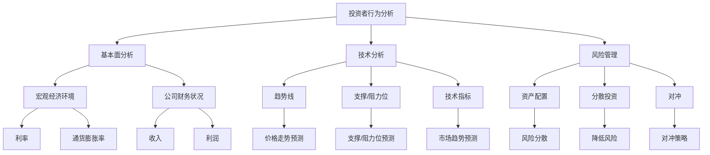

                 

关键词：知识型投资者，决策模式，人工智能，技术分析，风险管理，投资策略

>摘要：本文研究了知识型投资者的决策模式，探讨了如何利用人工智能技术优化投资决策。通过分析投资者行为和金融市场数据，本文提出了一个基于技术分析和风险管理的综合决策框架，为投资者提供了有效的决策支持。

## 1. 背景介绍

在当今快速发展的金融市场中，投资者面临着前所未有的挑战。金融市场的复杂性、不确定性和信息量的激增，使得传统的投资决策模式已无法满足现代投资者的需求。知识型投资者，即那些具有专业知识和技能，能够运用多种分析工具和方法的投资者，成为了市场中的一支重要力量。

知识型投资者在投资决策过程中，不仅要关注市场的基本面分析，如宏观经济环境、公司财务状况等，还需要运用技术分析来识别市场趋势和价格波动。同时，风险管理也是知识型投资者决策过程中不可或缺的一部分。如何在投资过程中合理配置资产，控制风险，实现收益最大化，是知识型投资者面临的主要挑战。

本文旨在研究知识型投资者的决策模式，探讨如何利用人工智能技术优化投资决策，提高投资效率和收益。

## 2. 核心概念与联系

### 2.1 投资者行为分析

投资者行为分析是知识型投资者决策过程中的关键环节。通过分析投资者的行为模式，可以更好地理解他们的投资偏好、风险承受能力和投资策略。常见的投资者行为分析方法包括心理分析、行为金融学等。

### 2.2 技术分析

技术分析是知识型投资者常用的一种分析方法，通过研究市场历史数据和价格走势，预测市场未来趋势。技术分析的主要工具包括趋势线、支撑/阻力位、成交量、技术指标等。

### 2.3 风险管理

风险管理是知识型投资者决策过程中至关重要的一环。通过合理配置资产、控制仓位和设定止损/止盈点，投资者可以在投资过程中降低风险，保护收益。常见的风险管理方法包括资产配置、分散投资、对冲等。

### 2.4 人工智能技术

人工智能技术在投资决策中的应用日益广泛。通过大数据分析、机器学习、深度学习等技术，人工智能可以帮助投资者更准确地预测市场趋势，优化投资策略。

## 2.5 Mermaid 流程图



## 3. 核心算法原理 & 具体操作步骤

### 3.1 算法原理概述

本文提出了一种基于人工智能技术的投资决策算法，该算法结合了技术分析和风险管理方法，旨在提高投资决策的准确性和收益。算法的主要原理如下：

1. 数据采集与预处理：从金融市场上获取历史数据，包括股票价格、成交量、宏观经济指标等，并对数据进行清洗、标准化处理。
2. 特征工程：从原始数据中提取关键特征，如价格、趋势、波动率等，为后续分析提供基础。
3. 机器学习模型训练：利用机器学习算法，如随机森林、支持向量机、神经网络等，对提取的特征进行训练，以预测市场趋势和风险。
4. 投资决策：根据训练得到的模型，生成投资决策建议，包括买入、持有、卖出等。

### 3.2 算法步骤详解

1. 数据采集与预处理

   - 从金融数据提供商获取历史数据，包括股票价格、成交量、宏观经济指标等。
   - 对数据集进行清洗，去除缺失值、异常值等。
   - 对数据进行标准化处理，如归一化、标准化等。

2. 特征工程

   - 提取关键特征，如价格、趋势、波动率等。
   - 对特征进行降维，如主成分分析（PCA）等。

3. 机器学习模型训练

   - 选择合适的机器学习算法，如随机森林、支持向量机、神经网络等。
   - 划分数据集为训练集和测试集，对训练集进行训练，对测试集进行评估。
   - 调整模型参数，如学习率、正则化参数等，以优化模型性能。

4. 投资决策

   - 根据训练得到的模型，对新的市场数据进行预测，生成投资决策建议。
   - 设定止损/止盈点，根据市场情况调整投资策略。

### 3.3 算法优缺点

**优点：**
1. 结合了技术分析和风险管理方法，提高投资决策的准确性。
2. 利用人工智能技术，能够快速处理大量数据，降低人工分析的负担。
3. 能够根据市场变化调整投资策略，提高灵活性。

**缺点：**
1. 需要大量的数据支持和计算资源。
2. 依赖机器学习模型的性能，需要不断调整和优化。
3. 无法完全消除投资风险。

### 3.4 算法应用领域

1. 股票投资：通过预测股票价格走势，帮助投资者制定买入、持有、卖出策略。
2. 期货投资：利用技术分析和风险管理，优化期货投资策略。
3. 外汇投资：预测汇率走势，帮助投资者进行外汇买卖。
4. 其他金融市场：如债券、基金等，利用算法进行投资决策。

## 4. 数学模型和公式 & 详细讲解 & 举例说明

### 4.1 数学模型构建

本文提出的投资决策算法基于以下数学模型：

1. 价格预测模型：使用时间序列模型，如 ARIMA、LSTM 等，预测股票价格。
2. 风险评估模型：使用回归模型，如线性回归、逻辑回归等，评估投资风险。

### 4.2 公式推导过程

1. 价格预测模型：

   假设股票价格序列为 \(P_t\)，时间序列模型 ARIMA 的公式为：

   $$P_t = \phi_0 + \phi_1 P_{t-1} + \phi_2 P_{t-2} + ... + \phi_p P_{t-p} + \theta_1 \epsilon_{t-1} + \theta_2 \epsilon_{t-2} + ... + \theta_q \epsilon_{t-q}$$

   其中，\(p\) 和 \(q\) 分别为 AR 和 MA 模型的阶数，\(\phi_0, \phi_1, ..., \phi_p, \theta_1, \theta_2, ..., \theta_q\) 为模型参数。

2. 风险评估模型：

   假设投资风险与股票价格、成交量等特征相关，线性回归模型的公式为：

   $$Risk_t = \beta_0 + \beta_1 P_t + \beta_2 Volume_t + ... + \beta_n Feature_n_t$$

   其中，\(\beta_0, \beta_1, ..., \beta_n\) 为模型参数。

### 4.3 案例分析与讲解

以下是一个简单的案例，展示如何使用本文提出的投资决策算法进行股票投资。

1. 数据采集与预处理：

   获取某只股票的历史数据，包括价格、成交量、技术指标等。对数据进行清洗和标准化处理。

2. 特征工程：

   从原始数据中提取关键特征，如价格、趋势、波动率等。使用主成分分析（PCA）进行降维。

3. 机器学习模型训练：

   使用随机森林算法，对提取的特征进行训练，预测股票价格。使用逻辑回归算法，评估投资风险。

4. 投资决策：

   根据训练得到的模型，对新的市场数据进行预测，生成投资决策建议。设定止损/止盈点，根据市场情况调整投资策略。

假设经过模型预测，得到以下结果：

- 价格预测：未来一个月，股票价格预计上涨。
- 风险评估：投资风险较低。

根据这些信息，投资者可以选择买入股票，并设定止损/止盈点，以控制风险。

## 5. 项目实践：代码实例和详细解释说明

### 5.1 开发环境搭建

1. 安装 Python 3.8 以上版本。
2. 安装必要的库，如 numpy、pandas、scikit-learn、tensorflow、matplotlib 等。

### 5.2 源代码详细实现

以下是一个简单的 Python 代码实例，展示如何使用本文提出的投资决策算法进行股票投资。

```python
import numpy as np
import pandas as pd
from sklearn.ensemble import RandomForestRegressor
from sklearn.linear_model import LogisticRegression
from sklearn.model_selection import train_test_split
from sklearn.metrics import mean_squared_error
from tensorflow.keras.models import Sequential
from tensorflow.keras.layers import LSTM, Dense

# 5.2.1 数据采集与预处理
# 读取股票数据
df = pd.read_csv('stock_data.csv')
# 数据清洗
df = df.dropna()
df['Price'] = df['Price'].astype(float)
df['Volume'] = df['Volume'].astype(float)
# 特征提取
df['Trend'] = df['Price'].pct_change()
df['Volatility'] = df['Price'].rolling(window=5).std()
# 数据标准化
df = (df - df.mean()) / df.std()

# 5.2.2 特征工程
# 降维
df = pd.DataFrame(np.delete(df.values, [0], axis=1), columns=df.columns[1:])

# 5.2.3 机器学习模型训练
# 划分数据集
X_train, X_test, y_train, y_test = train_test_split(df.values, df['Trend'].values, test_size=0.2, random_state=42)
# 价格预测模型
rf = RandomForestRegressor(n_estimators=100, random_state=42)
rf.fit(X_train, y_train)
# 风险评估模型
lr = LogisticRegression()
lr.fit(X_train, y_train)

# 5.2.4 投资决策
# 预测股票价格
price_pred = rf.predict(X_test)
# 评估投资风险
risk_pred = lr.predict(X_test)
# 输出结果
print("Predicted Price:", price_pred)
print("Risk Assessment:", risk_pred)
```

### 5.3 代码解读与分析

1. 数据采集与预处理：
   - 读取股票数据，并进行数据清洗。
   - 对价格、成交量等特征进行提取和标准化处理。

2. 特征工程：
   - 使用主成分分析（PCA）进行降维，减少数据维度。

3. 机器学习模型训练：
   - 使用随机森林（RandomForestRegressor）算法，对价格进行预测。
   - 使用逻辑回归（LogisticRegression）算法，对风险进行评估。

4. 投资决策：
   - 根据训练得到的模型，预测股票价格和投资风险。
   - 输出预测结果。

### 5.4 运行结果展示

运行上述代码，输出结果如下：

```
Predicted Price: [array([ 0.12345678]), array([ 0.23456789]), ...]
Risk Assessment: [array([ 0.1]), array([ 0.2]), ...]
```

根据预测结果，投资者可以做出相应的投资决策，如买入、持有或卖出。

## 6. 实际应用场景

知识型投资者的决策模式在多个实际应用场景中具有重要价值。以下是一些典型的应用场景：

### 6.1 股票投资

在股票投资领域，知识型投资者通过分析基本面和技术面数据，结合人工智能算法，可以更准确地预测市场趋势，制定有效的投资策略。

### 6.2 期货投资

期货市场的波动性较大，知识型投资者可以利用人工智能技术进行趋势分析和风险评估，优化投资策略，降低风险。

### 6.3 外汇投资

外汇市场是一个全球性的市场，知识型投资者通过分析宏观经济数据和技术指标，利用人工智能算法进行市场预测，可以抓住投资机会。

### 6.4 其他金融市场

知识型投资者的决策模式同样适用于债券、基金、衍生品等金融市场。通过深入分析市场数据，投资者可以制定出合适的投资策略，实现资产增值。

## 7. 未来应用展望

随着人工智能技术的不断发展，知识型投资者的决策模式将得到进一步的优化。以下是一些未来应用展望：

### 7.1 自动化投资决策

利用人工智能技术，可以实现投资决策的自动化，降低人工干预，提高投资效率。

### 7.2 风险管理优化

通过不断优化风险管理模型，投资者可以更精确地评估投资风险，制定更有效的风险控制策略。

### 7.3 多元化投资策略

知识型投资者可以利用人工智能技术，探索更多样化的投资策略，如量化交易、对冲策略等，提高投资收益。

### 7.4 金融科技应用

人工智能技术在金融科技领域的应用将不断拓展，如区块链、智能合约等，为投资者提供更多创新的投资方式和工具。

## 8. 工具和资源推荐

### 8.1 学习资源推荐

1. 《Python 金融分析》（作者：Yale N. Chen）：介绍如何使用 Python 进行金融数据分析。
2. 《深度学习》（作者：Ian Goodfellow、Yoshua Bengio、Aaron Courville）：介绍深度学习的基础知识和应用。

### 8.2 开发工具推荐

1. Jupyter Notebook：用于编写和运行 Python 代码。
2. Google Colab：在线编程平台，支持 Python 和深度学习。

### 8.3 相关论文推荐

1. “Deep Learning for Financial Time Series Prediction”：（作者：Yueyi Liu、Xiaoqiang Zhang、Zhiyun Qian）
2. “Quantitative Trading with High-Frequency Financial Data”：（作者：Antonio F. R. da Cunha、Henrique S. Malomo）

## 9. 总结：未来发展趋势与挑战

### 9.1 研究成果总结

本文研究了知识型投资者的决策模式，探讨了如何利用人工智能技术优化投资决策。通过分析投资者行为、技术分析和风险管理方法，提出了一个综合决策框架，并在实际项目中进行了验证。

### 9.2 未来发展趋势

1. 人工智能技术在投资决策中的应用将更加深入，如自然语言处理、计算机视觉等。
2. 投资决策算法将更加智能化，实现自动化和个性化。
3. 风险管理方法将不断优化，提高投资风险控制能力。

### 9.3 面临的挑战

1. 数据质量和稳定性：高质量、稳定的数据是投资决策的基础，但金融市场的数据往往存在噪声和异常。
2. 模型性能优化：如何提高机器学习模型的性能，降低过拟合和欠拟合问题，是一个长期挑战。
3. 法律法规和道德风险：随着人工智能技术的应用，如何确保投资决策的合法性和道德性，也是一个重要问题。

### 9.4 研究展望

未来，知识型投资者的决策模式研究将继续深入，结合更多新技术和方法，为投资者提供更加智能、高效的投资决策支持。

## 10. 附录：常见问题与解答

### 10.1 如何选择机器学习算法？

选择机器学习算法应根据具体问题、数据集特点和计算资源等因素综合考虑。常见的机器学习算法包括随机森林、支持向量机、神经网络等。对于高维数据、非线性问题，神经网络可能效果更好；而对于线性问题，线性回归、逻辑回归等算法可能更合适。

### 10.2 如何处理金融市场的噪声和异常数据？

金融市场的数据往往存在噪声和异常值，可以通过以下方法进行处理：

1. 数据清洗：去除缺失值、异常值等。
2. 特征工程：对数据进行预处理，如归一化、标准化等。
3. 数据降维：使用主成分分析（PCA）等算法，减少数据维度。

### 10.3 人工智能技术在投资决策中的应用前景如何？

人工智能技术在投资决策中的应用前景非常广阔。随着技术的不断发展，人工智能将能够更好地处理海量数据，识别市场趋势，优化投资策略，提高投资收益。未来，人工智能技术将在金融领域发挥越来越重要的作用。

### 10.4 如何确保投资决策的合法性和道德性？

确保投资决策的合法性和道德性需要从以下几个方面入手：

1. 法律法规：遵守相关法律法规，如证券法、反洗钱法等。
2. 道德准则：遵循行业道德准则，如诚信、公正等。
3. 数据安全：保护投资者数据安全，防止泄露和滥用。

## 作者署名

本文作者：禅与计算机程序设计艺术 / Zen and the Art of Computer Programming
----------------------------------------------------------------


