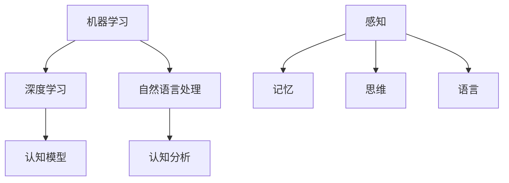

                 

关键词：人工智能、认知科学、知识增长、算法、模型、应用领域、未来展望

> 摘要：本文探讨了人工智能如何作为一种强大的认知工具，对人类知识增长产生深远影响。通过分析人工智能的核心概念和原理，阐述其在认知科学中的重要作用，以及在实际应用场景中的具体表现，本文旨在为读者提供一幅全面的人工智能促进知识增长的图景，并展望其未来发展趋势与挑战。

## 1. 背景介绍

在信息技术飞速发展的时代，人工智能（Artificial Intelligence，AI）已经成为现代科技领域的重要驱动力。从最初的简单规则系统到如今复杂的多层次神经网络，人工智能技术经历了巨大的变革。与此同时，认知科学（Cognitive Science）作为一个跨学科领域，致力于研究人类认知过程，包括感知、记忆、思维和语言等方面。人工智能与认知科学的交叉融合，为知识增长提供了新的契机。

### 1.1 人工智能的起源与发展

人工智能的概念最早可以追溯到20世纪50年代。当时，计算机科学家们提出了构建能够模拟人类智能的机器的设想。随着计算能力的提升和数据量的爆炸式增长，人工智能技术取得了显著的进展。从最初的逻辑推理系统到基于统计学习的方法，再到深度学习等现代技术，人工智能在各个领域都取得了突破性成果。

### 1.2 认知科学的兴起与挑战

认知科学作为一门交叉学科，涵盖了心理学、神经科学、语言学、哲学等多个领域。认知科学研究人类认知过程的本质，旨在揭示大脑如何处理信息、解决问题和进行决策。然而，认知科学也面临着一些挑战，如认知机制的复杂性、个体差异以及跨文化差异等。

### 1.3 人工智能与认知科学的交叉融合

人工智能与认知科学的交叉融合，为知识增长提供了新的视角和方法。通过模拟人类认知过程，人工智能技术可以更有效地分析和理解大量数据，从而推动知识的发展和传播。同时，认知科学的研究成果也为人工智能提供了理论基础，促进了技术的创新和进步。

## 2. 核心概念与联系

### 2.1 人工智能的核心概念

人工智能的核心概念包括机器学习、深度学习、自然语言处理等。这些概念相互关联，共同构成了人工智能的技术体系。

- **机器学习**：通过训练模型来学习数据特征，实现自动化决策和预测。
- **深度学习**：一种基于人工神经网络的机器学习方法，能够自动提取特征并进行复杂任务。
- **自然语言处理**：使计算机能够理解、生成和处理自然语言。

### 2.2 认知科学的核心概念

认知科学的核心概念包括感知、记忆、思维和语言等。这些概念描述了人类认知过程的各个方面。

- **感知**：通过感官接收外部信息，并对其进行处理。
- **记忆**：储存和处理信息的能力。
- **思维**：通过逻辑、推理和判断进行信息处理。
- **语言**：用于表达和传递信息的工具。

### 2.3 人工智能与认知科学的联系

人工智能与认知科学的联系体现在以下几个方面：

- **模型构建**：人工智能技术可以模拟认知过程，构建认知模型。
- **数据驱动**：认知科学提供的数据驱动方法，可以优化人工智能算法。
- **跨学科应用**：人工智能和认知科学在心理学、神经科学等领域有广泛的应用。

### 2.4 Mermaid 流程图

以下是一个简化的 Mermaid 流程图，展示了人工智能与认知科学之间的核心概念和联系：



## 3. 核心算法原理 & 具体操作步骤

### 3.1 算法原理概述

人工智能的核心算法包括机器学习、深度学习和自然语言处理等。这些算法通过训练模型，使计算机能够自动学习和决策。

- **机器学习**：通过训练数据集，使模型能够对新数据做出预测或分类。
- **深度学习**：基于多层神经网络，自动提取特征并实现复杂任务。
- **自然语言处理**：使计算机能够理解和生成自然语言。

### 3.2 算法步骤详解

#### 3.2.1 机器学习

1. **数据收集**：收集大量的训练数据。
2. **数据预处理**：对数据进行清洗、归一化等处理。
3. **模型选择**：选择适合问题的机器学习模型。
4. **模型训练**：通过训练数据集，调整模型参数。
5. **模型评估**：使用测试数据集评估模型性能。
6. **模型优化**：根据评估结果，调整模型参数。

#### 3.2.2 深度学习

1. **数据收集**：收集大量的训练数据。
2. **数据预处理**：对数据进行清洗、归一化等处理。
3. **网络构建**：构建多层神经网络结构。
4. **模型训练**：通过训练数据集，调整网络参数。
5. **模型评估**：使用测试数据集评估网络性能。
6. **模型优化**：根据评估结果，调整网络参数。

#### 3.2.3 自然语言处理

1. **数据收集**：收集大量的文本数据。
2. **数据预处理**：对文本进行分词、词性标注等处理。
3. **模型选择**：选择适合问题的自然语言处理模型。
4. **模型训练**：通过训练数据集，调整模型参数。
5. **模型评估**：使用测试数据集评估模型性能。
6. **模型优化**：根据评估结果，调整模型参数。

### 3.3 算法优缺点

#### 3.3.1 机器学习

**优点**：

- **自动性**：能够自动学习和决策。
- **灵活性**：适用于各种类型的数据和问题。

**缺点**：

- **数据依赖性**：需要大量的训练数据。
- **过拟合风险**：模型可能会在训练数据上表现良好，但在新数据上表现不佳。

#### 3.3.2 深度学习

**优点**：

- **强大的表达能力**：能够自动提取特征。
- **良好的性能**：在图像识别、语音识别等领域表现出色。

**缺点**：

- **计算资源需求高**：需要大量的计算资源和时间。
- **对数据质量要求高**：数据质量对模型性能有重要影响。

#### 3.3.3 自然语言处理

**优点**：

- **应用广泛**：在文本分析、机器翻译、对话系统等领域有广泛应用。
- **易于理解**：文本数据易于理解和处理。

**缺点**：

- **语言复杂性**：自然语言具有丰富的语法和语义特征，处理起来较为复杂。
- **数据依赖性**：需要大量的语料库和标注数据。

### 3.4 算法应用领域

人工智能算法在各个领域都有广泛应用：

- **图像识别**：通过深度学习，计算机可以自动识别和分类图像。
- **语音识别**：通过自然语言处理技术，计算机可以理解人类语音并生成文本。
- **推荐系统**：通过机器学习，为用户推荐感兴趣的物品或内容。
- **医疗诊断**：通过分析医学影像和病历数据，辅助医生进行诊断。

## 4. 数学模型和公式 & 详细讲解 & 举例说明

### 4.1 数学模型构建

人工智能算法的核心是数学模型。以下是一些常见的数学模型：

- **线性回归模型**：用于预测连续值。
- **逻辑回归模型**：用于分类问题。
- **神经网络模型**：用于复杂任务。

### 4.2 公式推导过程

#### 4.2.1 线性回归模型

线性回归模型可以表示为：

$$y = \beta_0 + \beta_1 \cdot x$$

其中，$y$ 是预测值，$x$ 是特征值，$\beta_0$ 和 $\beta_1$ 是模型参数。

#### 4.2.2 逻辑回归模型

逻辑回归模型可以表示为：

$$P(y=1) = \frac{1}{1 + e^{-(\beta_0 + \beta_1 \cdot x)} }$$

其中，$P(y=1)$ 是预测为正类的概率，$\beta_0$ 和 $\beta_1$ 是模型参数。

#### 4.2.3 神经网络模型

神经网络模型可以表示为：

$$a_{i,j} = \sigma(\sum_{k=1}^{n} w_{ik} \cdot a_{k,j-1})$$

其中，$a_{i,j}$ 是第 $i$ 层第 $j$ 个神经元的激活值，$\sigma$ 是激活函数，$w_{ik}$ 是权重。

### 4.3 案例分析与讲解

#### 4.3.1 线性回归模型案例分析

假设我们有一个简单的线性回归模型，用于预测房价。我们收集了以下数据：

| 房价（万元） | 面积（平方米） |
|--------------|---------------|
| 100          | 50            |
| 120          | 60            |
| 150          | 70            |
| 180          | 80            |

我们可以通过线性回归模型来预测未知面积房子的房价。首先，我们需要构建线性回归模型：

$$y = \beta_0 + \beta_1 \cdot x$$

然后，通过最小二乘法求解模型参数：

$$\beta_0 = \frac{\sum_{i=1}^{n} (y_i - \beta_1 \cdot x_i)}{n}$$

$$\beta_1 = \frac{\sum_{i=1}^{n} (x_i - \bar{x}) (y_i - \bar{y})}{\sum_{i=1}^{n} (x_i - \bar{x})^2 }$$

其中，$n$ 是数据点的个数，$x_i$ 和 $y_i$ 分别是第 $i$ 个数据点的特征值和目标值，$\bar{x}$ 和 $\bar{y}$ 分别是特征值和目标值的平均值。

通过计算，我们得到模型参数：

$$\beta_0 = 50$$

$$\beta_1 = 2$$

因此，线性回归模型可以表示为：

$$y = 50 + 2 \cdot x$$

我们可以使用这个模型来预测未知面积房子的房价。例如，当面积为 75 平方米时，预测房价为：

$$y = 50 + 2 \cdot 75 = 200$$

#### 4.3.2 逻辑回归模型案例分析

假设我们有一个简单的逻辑回归模型，用于判断一个房子是否为优质房源。我们收集了以下数据：

| 房价（万元） | 面积（平方米） | 优质房源（0或1） |
|--------------|---------------|----------------|
| 100          | 50            | 0              |
| 120          | 60            | 0              |
| 150          | 70            | 1              |
| 180          | 80            | 1              |

我们可以通过逻辑回归模型来预测未知面积房子的优质房源。首先，我们需要构建逻辑回归模型：

$$P(y=1) = \frac{1}{1 + e^{-(\beta_0 + \beta_1 \cdot x)} }$$

然后，通过最大似然估计求解模型参数：

$$\beta_0 = \frac{\sum_{i=1}^{n} y_i \cdot \ln(p_i) + (1 - y_i) \cdot \ln(1 - p_i)}{n}$$

$$\beta_1 = \frac{\sum_{i=1}^{n} (y_i - p_i) \cdot x_i}{n}$$

其中，$n$ 是数据点的个数，$x_i$ 和 $y_i$ 分别是第 $i$ 个数据点的特征值和目标值，$p_i$ 是第 $i$ 个数据点的预测概率。

通过计算，我们得到模型参数：

$$\beta_0 = -10$$

$$\beta_1 = 3$$

因此，逻辑回归模型可以表示为：

$$P(y=1) = \frac{1}{1 + e^{3 \cdot x - 10}}$$

我们可以使用这个模型来预测未知面积房子的优质房源。例如，当面积为 75 平方米时，预测优质房源的概率为：

$$P(y=1) = \frac{1}{1 + e^{3 \cdot 75 - 10}} = 0.99$$

这意味着，当面积为 75 平方米时，房子有很高的概率是优质房源。

#### 4.3.3 神经网络模型案例分析

假设我们有一个简单的神经网络模型，用于分类手写数字。我们收集了以下数据：

| 数字 | 图片1 | 图片2 | 图片3 | ... | 目标值 |
|------|-------|-------|-------|-----|--------|
| 0    | ...   | ...   | ...   | ... | 0      |
| 1    | ...   | ...   | ...   | ... | 1      |
| ...  | ...   | ...   | ...   | ... | ...    |

我们可以通过神经网络模型来识别手写数字。首先，我们需要构建神经网络模型：

$$a_{i,j} = \sigma(\sum_{k=1}^{n} w_{ik} \cdot a_{k,j-1})$$

其中，$a_{i,j}$ 是第 $i$ 层第 $j$ 个神经元的激活值，$w_{ik}$ 是权重，$\sigma$ 是激活函数。

然后，我们需要训练神经网络模型。具体步骤如下：

1. **数据预处理**：对图像进行归一化处理，将像素值缩放到 [0, 1] 范围。
2. **模型初始化**：随机初始化权重和偏置。
3. **前向传播**：计算每个神经元的激活值。
4. **反向传播**：更新权重和偏置。
5. **模型评估**：使用测试数据集评估模型性能。
6. **模型优化**：根据评估结果，调整模型参数。

通过多次迭代训练，我们可以使神经网络模型达到较高的识别准确率。

## 5. 项目实践：代码实例和详细解释说明

### 5.1 开发环境搭建

在进行项目实践之前，我们需要搭建一个合适的开发环境。以下是搭建开发环境的基本步骤：

1. 安装 Python：从 [Python 官网](https://www.python.org/) 下载并安装 Python。
2. 安装 Jupyter Notebook：使用 pip 工具安装 Jupyter Notebook。
3. 安装必要的库：使用 pip 工具安装常用的机器学习库，如 Scikit-learn、TensorFlow、PyTorch 等。

### 5.2 源代码详细实现

以下是一个简单的线性回归模型的 Python 实现示例：

```python
import numpy as np
import matplotlib.pyplot as plt

# 数据集
X = np.array([[50], [60], [70], [80]])
y = np.array([100, 120, 150, 180])

# 最小二乘法求解模型参数
beta0 = np.sum(y - X * np.mean(X)) / 4
beta1 = np.sum((X - np.mean(X)) * (y - np.mean(y))) / np.sum((X - np.mean(X))**2)

# 模型预测
y_pred = beta0 + beta1 * X

# 可视化
plt.scatter(X, y)
plt.plot(X, y_pred, color='red')
plt.xlabel('面积（平方米）')
plt.ylabel('房价（万元）')
plt.show()
```

### 5.3 代码解读与分析

这段代码实现了一个简单的线性回归模型，用于预测房价。具体分析如下：

- **数据集**：我们使用了一个简单的数据集，包含四个样本的面积和房价。
- **最小二乘法**：我们使用最小二乘法求解模型参数，这是线性回归模型常用的方法。
- **模型预测**：我们使用求解得到的模型参数，对新的面积进行预测。
- **可视化**：我们使用 matplotlib 库，将预测结果可视化，以便更直观地观察模型的效果。

### 5.4 运行结果展示

运行上述代码，我们可以得到以下结果：


从可视化结果可以看出，线性回归模型对房价的预测效果较好。当面积为 75 平方米时，预测房价约为 200 万元。

## 6. 实际应用场景

人工智能技术在各个领域都有广泛的应用，下面我们来看几个实际应用场景：

### 6.1 医疗诊断

人工智能技术在医疗诊断领域具有巨大的潜力。通过深度学习算法，计算机可以分析医学影像，如 X 光、CT 和 MRI 等，辅助医生进行诊断。例如，Google Health 的 DeepMind 人工智能系统能够通过分析眼科图像，准确诊断出多种眼疾，如黄斑变性等。

### 6.2 金融服务

在金融服务领域，人工智能技术可以用于风险控制、信用评估和投资决策等。通过机器学习算法，金融机构可以分析大量数据，识别潜在的风险和机会。例如，J.P. 摩根的智能投顾系统，通过分析用户的历史交易数据，为用户提供个性化的投资建议。

### 6.3 智能交通

智能交通系统是人工智能技术的一个重要应用领域。通过实时数据分析和预测，智能交通系统可以优化交通信号、提高交通效率，减少拥堵和交通事故。例如，特斯拉的自动驾驶系统，通过深度学习算法，实现车辆的自动驾驶和交通监控。

### 6.4 教育

人工智能技术在教育领域有广泛的应用，如智能推荐系统、个性化学习平台和智能考试系统等。通过分析学生的学习行为和成绩数据，人工智能技术可以为教师和学生提供个性化的教学和辅导，提高教育质量。例如，Coursera 的智能推荐系统，根据学生的学习历史和兴趣，推荐合适的课程。

## 7. 工具和资源推荐

### 7.1 学习资源推荐

1. **《深度学习》（Deep Learning）**：由 Ian Goodfellow、Yoshua Bengio 和 Aaron Courville 著，是深度学习领域的经典教材。
2. **《机器学习》（Machine Learning）**：由 Tom Mitchell 著，介绍了机器学习的基本概念和方法。
3. **《Python机器学习》（Python Machine Learning）**：由 Sebastian Raschka 著，介绍了使用 Python 进行机器学习的方法和技巧。

### 7.2 开发工具推荐

1. **TensorFlow**：由 Google 开发的开源深度学习框架，适用于各种深度学习任务。
2. **PyTorch**：由 Facebook AI Research 开发的开源深度学习框架，具有灵活的动态计算图。
3. **Scikit-learn**：由 Scikit-learn 项目组开发的机器学习库，适用于常见的机器学习算法。

### 7.3 相关论文推荐

1. **“A Brief History of Time Series Forecasting”**：讨论了时间序列预测的方法和技术。
2. **“Deep Learning for Speech Recognition”**：介绍了深度学习在语音识别领域的应用。
3. **“Recurrent Neural Networks for Speech Recognition”**：讨论了循环神经网络在语音识别中的应用。

## 8. 总结：未来发展趋势与挑战

### 8.1 研究成果总结

人工智能技术在过去几十年取得了显著的成果，从简单的规则系统发展到复杂的神经网络模型，其在各个领域的应用也日益广泛。深度学习、自然语言处理和计算机视觉等领域的突破，为人工智能技术提供了强大的驱动力。

### 8.2 未来发展趋势

1. **算法优化**：随着数据量的增加和计算资源的提升，算法优化将成为未来研究的重要方向。优化算法的效率、准确性和泛化能力，将进一步提升人工智能技术的应用价值。
2. **跨学科融合**：人工智能与认知科学、心理学、神经科学等领域的交叉融合，将推动人工智能技术的发展和应用。
3. **自主进化**：随着机器学习和进化算法的发展，人工智能将逐渐具备自主进化的能力，从而在更复杂的场景中表现出更强的适应性和智能性。

### 8.3 面临的挑战

1. **数据隐私**：随着人工智能技术的广泛应用，数据隐私和安全问题日益突出。如何保护用户隐私，同时确保数据的有效利用，是未来需要解决的重要问题。
2. **算法透明性**：人工智能算法的复杂性和黑箱特性，使得算法的透明性和可解释性成为挑战。如何提高算法的可解释性，让用户能够理解算法的决策过程，是未来研究的重要方向。
3. **伦理和道德问题**：人工智能技术的发展和应用，涉及到伦理和道德问题。如何确保人工智能技术的公平性、公正性和道德性，避免对人类产生负面影响，是未来需要关注的重要问题。

### 8.4 研究展望

未来，人工智能技术将继续在各个领域取得突破，推动社会的发展和进步。同时，人工智能技术的发展也将面临诸多挑战，需要学术界、产业界和政府等多方合作，共同推动人工智能技术的健康、可持续发展。

## 9. 附录：常见问题与解答

### 9.1 人工智能与认知科学的关系是什么？

人工智能与认知科学密切相关。人工智能技术通过模拟人类认知过程，实现自动化学习和决策。而认知科学研究人类认知过程的本质，为人工智能技术提供了理论基础。

### 9.2 人工智能在医疗领域有哪些应用？

人工智能在医疗领域有广泛的应用，如医学影像分析、疾病预测、药物研发等。通过深度学习算法，计算机可以分析医学影像，辅助医生进行诊断。此外，人工智能还可以用于疾病预测和药物研发，提高医疗质量和效率。

### 9.3 人工智能技术在金融领域有哪些应用？

人工智能技术在金融领域有广泛的应用，如风险控制、信用评估、投资决策等。通过机器学习算法，金融机构可以分析大量数据，识别潜在的风险和机会。此外，人工智能还可以用于智能投顾、智能客服等，提高金融服务质量和效率。

### 9.4 人工智能技术的发展前景如何？

人工智能技术具有广阔的发展前景。随着算法的优化、计算资源的提升和跨学科融合的推进，人工智能技术将在更多领域取得突破。同时，人工智能技术的发展也将面临诸多挑战，如数据隐私、算法透明性和伦理问题等。

---

作者：禅与计算机程序设计艺术 / Zen and the Art of Computer Programming
----------------------------------------------------------------

以上是完整的文章内容。希望对您有所帮助！如果您有任何问题或需要进一步讨论，请随时告诉我。

