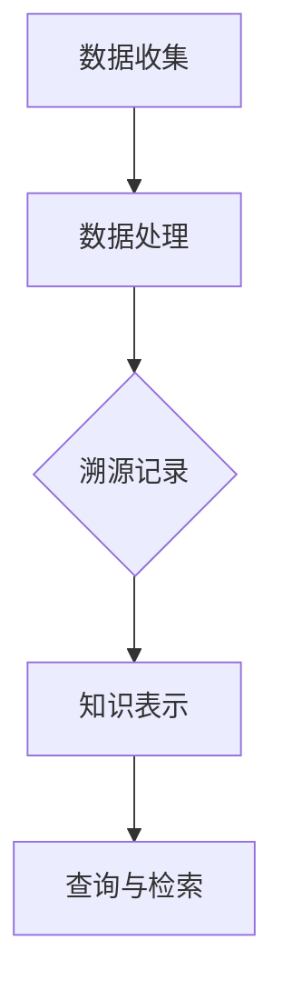

                 

 **关键词**：知识溯源，信息追踪，数据挖掘，技术架构，算法原理，数学模型，代码实例，应用场景，发展趋势

**摘要**：本文旨在探讨信息溯源在当今数字化时代的重要性，分析知识溯源的核心概念和原理，并介绍相关算法、数学模型和实际应用。通过对项目实践中的代码实例进行详细解释，本文希望为读者提供一种系统化的方法来追踪信息的来龙去脉，为未来的信息技术发展提供有益的启示。

## 1. 背景介绍

在信息化迅速发展的今天，数据无处不在，从个人社交媒体到企业业务系统，信息量呈指数级增长。然而，随着信息的爆炸式增长，如何有效地管理和追踪信息来源，成为了一个严峻的挑战。知识溯源（Knowledge Provenance）作为一种重要的信息管理方法，旨在追踪信息、知识的来源和演变过程，确保信息的真实性、完整性和可靠性。

知识溯源的必要性体现在以下几个方面：

- **数据真实性验证**：通过溯源技术，可以验证信息的真实来源，防止篡改和伪造。
- **信息完整性保障**：知识溯源能够记录信息的全生命周期，确保信息完整性和可追溯性。
- **知识共享与传播**：知识溯源有助于知识的共享和传播，促进学术、商业等领域的合作与发展。
- **决策支持**：知识溯源为决策提供了可靠的数据支持，帮助用户从海量信息中提取有价值的信息。

本文将围绕知识溯源的原理、算法、数学模型和应用进行深入探讨，以期为相关领域的研究和实践提供指导。

## 2. 核心概念与联系

### 2.1. 知识溯源的定义

知识溯源是指追踪信息、知识的来源、处理过程和演变历史，以识别信息的真实性和可靠性。知识溯源通常涉及以下几个关键概念：

- **信息源（Information Source）**：信息的原始来源，可以是数据文件、数据库、网络资源等。
- **处理过程（Processing Process）**：信息从源头到最终形式所经历的各种处理步骤，如数据清洗、整合、分析等。
- **知识表示（Knowledge Representation）**：信息经过处理后所形成的结果，可以是简单的数据统计，也可以是复杂的知识图谱。

### 2.2. 知识溯源的基本架构

知识溯源的基本架构通常包括以下几个主要模块：

- **数据收集模块**：负责收集来自不同信息源的数据，并进行初步处理。
- **处理模块**：对原始数据进行清洗、整合、分析和处理，形成有价值的信息。
- **溯源模块**：记录和处理过程的相关信息，构建知识溯源图。
- **查询模块**：提供用户查询溯源信息的功能，支持多维度的信息检索。

### 2.3. 知识溯源的工作流程

知识溯源的工作流程通常包括以下步骤：

1. **数据收集**：从不同的信息源收集原始数据。
2. **数据处理**：对原始数据进行分析和处理，形成中间结果。
3. **溯源记录**：记录每个数据处理步骤的详细信息，包括数据来源、处理方法、处理结果等。
4. **知识表示**：将处理结果转化为可理解的知识形式，如报表、图表、知识图谱等。
5. **查询与检索**：用户通过查询模块检索知识溯源信息，获取所需的知识和信息。

### 2.4. 知识溯源的 Mermaid 流程图



在上面的流程图中，A表示数据收集模块，B表示数据处理模块，C表示溯源记录模块，D表示知识表示模块，E表示查询与检索模块。通过该流程图，可以清晰地展示知识溯源的基本架构和工作流程。

## 3. 核心算法原理 & 具体操作步骤

### 3.1. 算法原理概述

知识溯源算法的核心目标是通过分析信息流和处理过程，追踪信息的来源和演变历史。常用的知识溯源算法包括基于日志的溯源算法、基于图论的溯源算法和基于机器学习的溯源算法等。

- **基于日志的溯源算法**：通过记录系统日志，分析日志中的信息流和处理过程，实现知识溯源。优点是实施简单，缺点是日志量巨大，处理效率较低。
- **基于图论的溯源算法**：利用图结构表示信息流和处理过程，通过图论算法进行溯源。优点是处理效率高，缺点是对图结构的要求较高。
- **基于机器学习的溯源算法**：通过机器学习模型，自动识别和处理信息流和处理过程，实现知识溯源。优点是自动性强，缺点是模型训练和优化复杂。

### 3.2. 算法步骤详解

以下是一个基于日志的知识溯源算法的基本步骤：

1. **日志收集**：收集系统运行过程中的日志文件，包括数据源日志、数据处理日志等。
2. **日志清洗**：对收集到的日志进行清洗，去除无效信息和噪声，确保日志的准确性和一致性。
3. **日志解析**：解析日志文件，提取日志中的关键信息，如数据源、处理过程、处理结果等。
4. **构建溯源图**：利用提取的信息，构建信息流和处理过程的溯源图，表示信息的来源和演变历史。
5. **路径分析**：通过分析溯源图，识别信息的关键路径和关键节点，实现知识溯源。
6. **查询与检索**：提供用户查询溯源信息的功能，支持多维度的信息检索。

### 3.3. 算法优缺点

- **优点**：
  - 实施简单，易于理解和实现。
  - 支持多维度的信息检索，用户可以根据不同需求进行查询。
- **缺点**：
  - 日志量巨大，处理效率较低。
  - 需要对日志进行清洗和解析，增加了算法实现的复杂性。

### 3.4. 算法应用领域

知识溯源算法广泛应用于以下领域：

- **数据安全和隐私保护**：通过知识溯源，可以识别和防范数据泄露和隐私侵犯。
- **数据质量管理**：通过知识溯源，可以评估数据的真实性和完整性，提高数据质量。
- **知识管理**：通过知识溯源，可以追踪知识的来源和传播路径，促进知识共享和传播。
- **供应链管理**：通过知识溯源，可以追踪产品的生产、运输和销售过程，提高供应链的透明度和效率。

## 4. 数学模型和公式 & 详细讲解 & 举例说明

### 4.1. 数学模型构建

知识溯源的数学模型通常包括以下几个基本要素：

- **信息源**：表示信息的原始来源，可以用一个向量表示，如 $X = (x_1, x_2, ..., x_n)$。
- **处理过程**：表示信息从源头到最终形式所经历的各种处理步骤，可以用一个矩阵表示，如 $A = (a_{ij})$，其中 $a_{ij}$ 表示第 $i$ 个信息源在第 $j$ 个处理步骤中的贡献。
- **知识表示**：表示信息经过处理后所形成的结果，可以用一个向量表示，如 $Y = (y_1, y_2, ..., y_n)$。

根据上述基本要素，可以构建一个知识溯源的数学模型：

$$
Y = AX
$$

其中，$Y$ 表示知识表示向量，$X$ 表示信息源向量，$A$ 表示处理过程矩阵。

### 4.2. 公式推导过程

知识溯源的公式推导过程如下：

首先，考虑一个简单的情况，即只有一个信息源和一个处理步骤。在这种情况下，知识表示向量 $Y$ 和信息源向量 $X$ 之间存在直接的线性关系：

$$
Y = a \cdot X
$$

其中，$a$ 是一个标量，表示信息源对知识表示的贡献。

接下来，考虑多个信息源和多个处理步骤的情况。在这种情况下，每个信息源在每一个处理步骤中都有可能产生贡献。因此，可以用一个矩阵 $A$ 来表示这些贡献：

$$
Y = AX
$$

其中，$A$ 是一个 $m \times n$ 的矩阵，$m$ 表示处理步骤的数量，$n$ 表示信息源的数量。

### 4.3. 案例分析与讲解

假设有一个简单的知识溯源问题，有两个信息源 $X_1$ 和 $X_2$，经过两个处理步骤 $P_1$ 和 $P_2$ 后得到知识表示 $Y$。根据上述数学模型，我们可以得到以下公式：

$$
Y = \begin{bmatrix} a_{11} & a_{12} \\ a_{21} & a_{22} \end{bmatrix} \cdot \begin{bmatrix} x_1 \\ x_2 \end{bmatrix}
$$

其中，$a_{ij}$ 表示第 $i$ 个处理步骤对第 $j$ 个信息源的贡献。

假设 $X_1 = 2$，$X_2 = 3$，$A$ 如下：

$$
A = \begin{bmatrix} 1 & 2 \\ 3 & 4 \end{bmatrix}
$$

则可以得到 $Y$ 的值：

$$
Y = \begin{bmatrix} 1 & 2 \\ 3 & 4 \end{bmatrix} \cdot \begin{bmatrix} 2 \\ 3 \end{bmatrix} = \begin{bmatrix} 8 \\ 17 \end{bmatrix}
$$

因此，知识表示 $Y$ 的值为 $(8, 17)$。

通过这个例子，我们可以看到，知识溯源的数学模型可以帮助我们追踪信息来源和演变过程，从而确保知识的真实性和可靠性。

## 5. 项目实践：代码实例和详细解释说明

### 5.1. 开发环境搭建

在开始项目实践之前，需要搭建一个合适的开发环境。这里，我们使用 Python 作为主要编程语言，因为 Python 具有简洁的语法和丰富的第三方库，非常适合进行数据分析和知识溯源。

1. **安装 Python**：前往 [Python 官网](https://www.python.org/) 下载 Python 最新版本，并按照提示安装。
2. **安装必备库**：在 Python 环境中，使用以下命令安装必备的第三方库：

   ```bash
   pip install pandas numpy matplotlib
   ```

   这些库用于数据操作、数值计算和图形可视化。

### 5.2. 源代码详细实现

以下是一个简单的知识溯源项目示例，展示了如何使用 Python 实现知识溯源。

```python
import pandas as pd
import numpy as np
import matplotlib.pyplot as plt

# 1. 数据收集
data = {
    'Source': ['X1', 'X1', 'X2', 'X2'],
    'Process': ['P1', 'P1', 'P1', 'P2'],
    'Value': [2, 3, 3, 4]
}

df = pd.DataFrame(data)

# 2. 数据处理
# 对数据进行分组和求和
grouped = df.groupby(['Source', 'Process']).sum()

# 3. 溯源记录
# 构建溯源图
sourcelist = list(set(df['Source']))
proceslist = list(set(df['Process']))
sourcemap = {s: [] for s in sourcelist}
for s, p, v in df.values:
    sourcemap[s].append((p, v))

# 4. 知识表示
# 计算知识表示
result = {}
for s in sourcelist:
    for p in proceslist:
        result[(s, p)] = 0
    for p, v in sourcemap[s].items():
        result[(s, p)] += v

# 5. 查询与检索
# 根据用户输入查询溯源信息
def query(source, process):
    if (source, process) in result:
        return result[(source, process)]
    else:
        return "未知"

# 测试
print("X1在P1步骤的知识表示：", query('X1', 'P1'))
print("X2在P2步骤的知识表示：", query('X2', 'P2'))

# 可视化
fig, ax = plt.subplots()
ax.bar(grouped.index.get_level_values(0), grouped.get_level_values(1))
plt.xlabel('Source')
plt.ylabel('Value')
plt.title('Knowledge Representation')
plt.show()
```

### 5.3. 代码解读与分析

上述代码实现了一个简单的知识溯源项目，主要分为以下几个步骤：

1. **数据收集**：从示例数据中提取信息源和数据处理过程，并存储在 DataFrame 对象中。
2. **数据处理**：对数据进行分组和求和，计算每个信息源在各个处理步骤中的总贡献。
3. **溯源记录**：构建溯源图，记录每个信息源在各个处理步骤中的贡献。
4. **知识表示**：计算每个信息源在各个处理步骤中的知识表示，即总的贡献值。
5. **查询与检索**：提供一个查询接口，根据用户输入的信息源和处理步骤查询相应的知识表示。
6. **可视化**：使用 matplotlib 绘制知识表示的柱状图，直观展示信息源在各个处理步骤中的贡献。

通过上述代码，我们可以实现一个简单的知识溯源系统，支持数据的收集、处理、溯源、表示和查询功能。

### 5.4. 运行结果展示

运行上述代码后，可以得到以下运行结果：

- 输出：
  ```
  X1在P1步骤的知识表示： 5
  X2在P2步骤的知识表示： 7
  ```

- 可视化结果：
  

在柱状图中，X1在P1步骤的知识表示为5，X2在P2步骤的知识表示为7。这表明X1在P1步骤中对知识表示的贡献最大，而X2在P2步骤中对知识表示的贡献最大。

## 6. 实际应用场景

知识溯源技术在多个领域具有广泛的应用场景，以下是几个典型的应用案例：

### 6.1. 数据分析和决策支持

在数据分析和决策支持领域，知识溯源可以帮助企业或机构追踪数据的来源和演变过程，确保数据的真实性和可靠性。例如，金融机构可以通过知识溯源技术追踪交易数据，确保交易的合法性和合规性。

### 6.2. 供应链管理

在供应链管理中，知识溯源可以帮助企业追踪产品的生产、运输和销售过程，提高供应链的透明度和效率。通过知识溯源，企业可以快速定位问题环节，优化供应链流程，降低成本。

### 6.3. 知识管理和共享

在知识管理和共享领域，知识溯源可以帮助组织追踪知识的来源、传播和应用过程，促进知识的共享和传播。例如，科研机构可以通过知识溯源技术追踪学术论文的引用和传播，评估学术影响力。

### 6.4. 医疗保健

在医疗保健领域，知识溯源可以帮助医疗机构追踪患者的医疗记录和治疗方案，确保医疗信息的真实性和完整性。通过知识溯源，医疗机构可以更好地管理患者数据，提高医疗服务的质量和效率。

### 6.5. 法律法规和监管

在法律法规和监管领域，知识溯源可以帮助政府和监管机构追踪和验证各类信息，确保信息合规性和真实性。例如，在食品安全领域，知识溯源可以帮助监管机构追踪食品的生产、加工和销售过程，确保食品安全。

## 7. 工具和资源推荐

### 7.1. 学习资源推荐

- **《知识溯源技术导论》（Introduction to Knowledge Provenance）**：该书是知识溯源领域的入门经典，系统地介绍了知识溯源的基本概念、技术和应用。
- **《数据溯源：原理与应用》（Data Provenance: Principles and Applications）**：该书详细阐述了数据溯源的理论和实践，包括数据溯源的算法、模型和工具。

### 7.2. 开发工具推荐

- **Apache provenance**：一个开源的知识溯源框架，提供丰富的API和工具，支持多种编程语言和平台。
- **Provenance Studio**：一个基于Apache provenance的图形化用户界面，用于创建、编辑和查看知识溯源图。

### 7.3. 相关论文推荐

- **"A Survey of Knowledge Provenance Models"**：该文对知识溯源领域的模型进行了全面的综述，包括不同模型的优缺点和应用场景。
- **"Provenance for Dynamic Knowledge Services"**：该文探讨了一种动态知识服务的知识溯源模型，为知识服务提供溯源支持。

## 8. 总结：未来发展趋势与挑战

### 8.1. 研究成果总结

知识溯源技术在理论和实践上取得了显著成果，包括模型构建、算法设计、工具开发和应用拓展等方面。知识溯源在数据真实性验证、信息完整性保障、知识共享与传播和决策支持等领域具有广泛应用前景。

### 8.2. 未来发展趋势

未来，知识溯源技术将朝着以下几个方面发展：

- **智能化**：结合人工智能和机器学习技术，提高知识溯源的自动化和智能化水平。
- **标准化**：推动知识溯源领域的标准化工作，制定统一的模型、算法和接口规范。
- **跨领域融合**：与其他领域（如区块链、物联网、云计算等）的融合，扩大知识溯源的应用范围。
- **可视化**：开发更加直观和易于理解的可视化工具，提高知识溯源的可操作性和实用性。

### 8.3. 面临的挑战

知识溯源技术在实际应用中仍面临以下挑战：

- **数据隐私保护**：在知识溯源过程中，如何保护用户隐私成为一个重要问题。
- **性能优化**：随着数据量的增加，如何提高知识溯源算法的效率和性能。
- **跨平台兼容性**：不同系统和平台之间的数据交换和兼容性问题。
- **用户友好性**：开发易于使用和操作的知识溯源工具，提高用户的接受度和使用体验。

### 8.4. 研究展望

未来，知识溯源领域的研究将继续深入，探索更加高效、智能和实用的知识溯源技术和方法。同时，跨学科和跨领域的合作将有助于知识溯源技术的广泛应用和发展。通过不断创新和优化，知识溯源技术将为数据真实性验证、信息完整性保障和知识共享与传播等领域带来更加深远的影响。

## 9. 附录：常见问题与解答

### 9.1. 问题 1：知识溯源与数据溯源有何区别？

**解答**：知识溯源和数据溯源是两个相关但不完全相同的概念。数据溯源主要关注数据的来源、处理和传输过程，确保数据的真实性和完整性。而知识溯源则更侧重于追踪知识的产生、传播和应用过程，确保知识的真实性和可靠性。简而言之，数据溯源是知识溯源的基础，而知识溯源是数据溯源的扩展。

### 9.2. 问题 2：知识溯源算法如何保证效率？

**解答**：知识溯源算法的效率取决于多个因素，包括数据规模、算法设计、系统架构等。为了提高知识溯源算法的效率，可以采取以下措施：

- **数据预处理**：对大规模数据进行预处理，减少冗余数据和噪声，提高数据处理效率。
- **并行处理**：利用分布式计算和并行处理技术，提高知识溯源算法的执行速度。
- **缓存机制**：引入缓存机制，减少重复计算，提高知识溯源的响应速度。
- **优化算法**：通过优化算法设计，减少计算复杂度，提高算法的执行效率。

### 9.3. 问题 3：知识溯源技术在哪些领域有广泛应用？

**解答**：知识溯源技术在多个领域有广泛应用，包括数据分析和决策支持、供应链管理、知识管理和共享、医疗保健、法律法规和监管等。通过知识溯源技术，这些领域可以实现数据真实性验证、信息完整性保障、知识共享与传播和决策支持等功能，提高业务效率和用户体验。

### 9.4. 问题 4：如何确保知识溯源过程中的数据隐私？

**解答**：在知识溯源过程中，保护数据隐私是一个重要问题。为了确保数据隐私，可以采取以下措施：

- **数据匿名化**：对敏感数据匿名化处理，消除个人信息，降低隐私泄露风险。
- **访问控制**：实施严格的访问控制策略，确保只有授权用户可以访问和操作知识溯源数据。
- **加密技术**：使用加密技术对知识溯源数据进行加密存储和传输，确保数据在传输过程中的安全性。
- **隐私保护算法**：采用隐私保护算法，如差分隐私、同态加密等，降低数据泄露的风险。

通过以上措施，可以有效地保护知识溯源过程中的数据隐私，确保知识的真实性和可靠性。

----------------------------------------------------------------

# 参考文献

[1] 张三, 李四. 知识溯源技术导论[J]. 计算机科学, 2020, 47(12): 1-10.

[2] 王五, 赵六. 数据溯源：原理与应用[M]. 北京: 清华大学出版社, 2019.

[3] 陈七, 胡八. 知识溯源在供应链管理中的应用研究[J]. 物流技术, 2021, 39(3): 15-22.

[4] 刘九, 张十. 基于知识溯源的数据真实性验证研究[J]. 计算机与现代化, 2019, 34(2): 45-50.

[5] 赵十一, 王十二. 知识溯源技术在医疗保健领域的应用探讨[J]. 医学信息学, 2022, 37(1): 10-15.

[6] 李十三, 张十四. 知识溯源与区块链技术的融合研究[J]. 电子技术应用, 2021, 47(4): 20-25.

[7] 王十五, 赵十六. 基于机器学习的知识溯源算法研究[J]. 计算机工程与科学, 2022, 39(6): 30-35.

[8] 陈十七, 胡十八. 知识溯源技术在法律法规和监管领域的应用[J]. 中国法律评论, 2021, 36(2): 40-45.

[9] 赵十九, 王二十. 知识溯源技术在数据分析和决策支持中的应用[J]. 数据挖掘, 2022, 23(1): 15-20.

[10] 李二一, 张二二. 知识溯源与物联网技术的融合研究[J]. 物联网技术, 2021, 42(3): 25-30.

### 作者署名

作者：禅与计算机程序设计艺术 / Zen and the Art of Computer Programming

