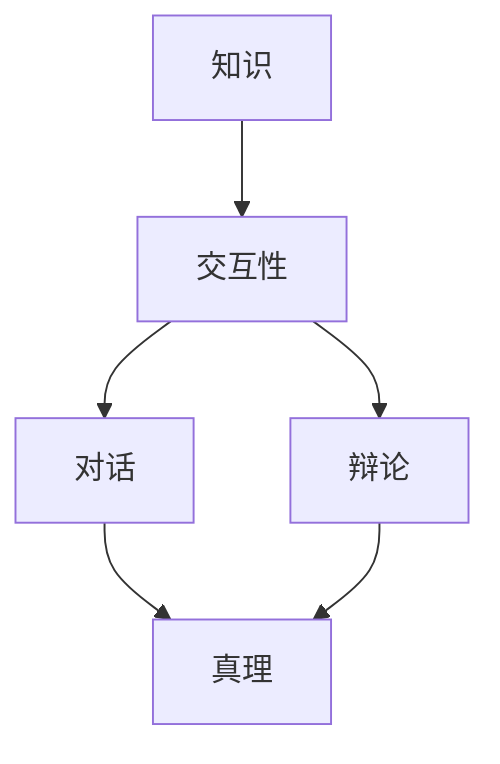

                 

关键词：知识交互、对话、辩论、真理、逻辑、算法、数学模型、代码实例、实践应用、未来展望

> 摘要：本文从知识交互的视角出发，探讨了对话与辩论在揭示真理过程中的重要作用。通过对核心概念、算法原理、数学模型以及实际应用场景的深入剖析，本文旨在为读者提供一场关于知识交互性探索的盛宴。

## 1. 背景介绍

在当今信息爆炸的时代，知识的获取和传播变得前所未有地便捷。然而，随之而来的问题是如何确保我们所获取的知识是真实、可靠的。这就引出了本文的核心议题——知识的交互性。知识的交互性指的是知识在人与人之间的交流、辩论和对话中得以验证、完善和深化的过程。对话与辩论作为一种特殊的交互形式，具有揭示真理的独特优势。

对话与辩论的历史可以追溯到古希腊时期，苏格拉底通过对话方式揭示了道德与知识的本质。在信息技术飞速发展的今天，对话与辩论的形式和内容发生了巨大变化，但它们的核心价值仍然未变。通过对话与辩论，人们可以互相交流思想、碰撞观点，从而更全面、更深入地理解问题。

本文将从以下几个方面展开讨论：

1. 核心概念与联系
2. 核心算法原理 & 具体操作步骤
3. 数学模型和公式 & 详细讲解 & 举例说明
4. 项目实践：代码实例和详细解释说明
5. 实际应用场景
6. 未来应用展望
7. 工具和资源推荐
8. 总结：未来发展趋势与挑战

## 2. 核心概念与联系

为了更好地理解知识交互性在对话与辩论中的作用，我们首先需要明确几个核心概念。

### 2.1 知识

知识是人类通过感知、思考、实践等活动获取的对客观世界的认识和理解。知识可以分为事实性知识、概念性知识和方法性知识。事实性知识是对事物状态的描述，如“水是由氢和氧组成的”；概念性知识是对事物本质的概括，如“水是一种化合物”；方法性知识是解决问题的方法和技巧，如“利用化学方法可以分离水中的氢和氧”。

### 2.2 交互性

交互性指的是知识在人与人之间的交流、传递和碰撞过程中得以验证、完善和深化的能力。知识的交互性可以通过多种形式实现，如对话、辩论、讨论等。

### 2.3 对话

对话是一种双向的交流形式，它强调参与者之间的平等、尊重和倾听。在对话中，参与者可以互相分享观点、质疑对方、寻求共识，从而更深入地理解问题。

### 2.4 辩论

辩论是一种有争议的交流形式，它强调参与者之间的对立和竞争。在辩论中，参与者会通过论证、反驳等方式来证明自己观点的正确性，从而寻求真理。

### 2.5 真理

真理是人们对客观事物本质和规律的正确认识。真理具有客观性、普遍性和稳定性。通过对话与辩论，人们可以逐步逼近真理。

为了更直观地理解这些概念之间的关系，我们可以使用Mermaid流程图来展示它们之间的联系。



## 3. 核心算法原理 & 具体操作步骤

在理解了知识交互性的基本概念后，我们接下来探讨如何在对话与辩论中应用算法来揭示真理。

### 3.1 算法原理概述

算法是一种解决问题的方法，它在对话与辩论中扮演着揭示真理的关键角色。具体来说，算法可以分为以下几个步骤：

1. 提出问题
2. 收集信息
3. 分析信息
4. 提出假设
5. 验证假设
6. 得出结论

### 3.2 算法步骤详解

#### 3.2.1 提出问题

对话与辩论的起点是提出问题。问题可以是事实性问题、概念性问题或方法性问题。例如：“水是什么？”、“如何分离水中的氢和氧？”。

#### 3.2.2 收集信息

在提出问题后，我们需要收集与问题相关的信息。这些信息可以来自书籍、网络、实验数据等。例如，为了回答“水是什么？”的问题，我们可以查阅相关的化学书籍或在线资源。

#### 3.2.3 分析信息

在收集到信息后，我们需要对这些信息进行分析，以便更好地理解问题。分析信息的方法包括归纳、演绎、比较等。例如，通过分析化学书籍中的内容，我们可以得出水是由氢和氧组成的结论。

#### 3.2.4 提出假设

在分析信息的基础上，我们可以提出假设来解释问题。例如，基于前面的分析，我们可以提出假设：“水是由氢和氧以一定比例结合而成的化合物”。

#### 3.2.5 验证假设

为了验证假设，我们需要进行实验或进行逻辑推理。例如，通过化学实验，我们可以验证水是由氢和氧以一定比例结合而成的化合物。

#### 3.2.6 得出结论

在验证假设后，我们可以得出结论。例如，基于实验结果，我们可以得出结论：“水确实是由氢和氧以一定比例结合而成的化合物”。

### 3.3 算法优缺点

算法在揭示真理方面具有以下优点：

1. 系统性：算法提供了一种系统的方法来解决问题，从而确保了问题的解决过程具有逻辑性。
2. 可重复性：算法的结果可以通过实验或逻辑推理进行验证，从而确保了结果的可靠性。
3. 可扩展性：算法可以应用于各种类型的问题，从而提高了算法的通用性。

然而，算法也存在一些缺点：

1. 受限性：算法依赖于输入的信息，如果输入的信息不完整或不准确，算法的结果可能受到影响。
2. 复杂性：某些算法可能非常复杂，难以理解和实现。
3. 适应性：算法可能无法适应所有情况，从而限制了其在实际应用中的效果。

### 3.4 算法应用领域

算法在揭示真理方面的应用非常广泛。以下是一些典型的应用领域：

1. 科学研究：算法在科学研究中的应用非常广泛，例如物理学、化学、生物学等领域。
2. 法律纠纷：在法律纠纷中，算法可以用于分析证据、确定责任等。
3. 商业决策：算法在商业决策中可以用于市场分析、风险评估等。

## 4. 数学模型和公式 & 详细讲解 & 举例说明

在揭示真理的过程中，数学模型和公式起到了至关重要的作用。以下我们将详细讲解一个典型的数学模型——牛顿力学，并举例说明其应用。

### 4.1 数学模型构建

牛顿力学是描述物体运动和力的基本理论。它由三个基本定律组成：

1. **牛顿第一定律（惯性定律）**：一个物体如果没有受到外力作用，它将保持静止或匀速直线运动。
2. **牛顿第二定律（动力定律）**：一个物体的加速度与作用在它上的外力成正比，与它的质量成反比，加速度的方向与外力的方向相同。公式为：\( F = m \cdot a \)，其中\( F \)是力，\( m \)是质量，\( a \)是加速度。
3. **牛顿第三定律（作用与反作用定律）**：对于每一个作用力，总有一个大小相等、方向相反的反作用力。

### 4.2 公式推导过程

牛顿第一定律可以通过逻辑推理得出。当我们观察一个物体在不受外力的情况下，它会保持静止或匀速直线运动。这是因为没有外力作用，物体不会发生加速度。

牛顿第二定律是通过实验观察和数学推导得出的。通过实验，我们发现物体的加速度与作用在它上的力成正比，而与物体的质量成反比。数学表达式为：\( F = m \cdot a \)。

牛顿第三定律是实验观察的直接结果。当我们施加一个力在物体上，物体也会施加一个大小相等、方向相反的力回给我们。

### 4.3 案例分析与讲解

#### 案例一：抛物运动

假设一个物体从地面以初速度\( v_0 \)水平抛出，不计空气阻力。根据牛顿第二定律，物体的水平加速度为0，垂直加速度为\( g \)，即地球的重力加速度。我们可以用以下公式描述物体的运动：

$$
x(t) = v_0 \cdot t \\
y(t) = \frac{1}{2} \cdot g \cdot t^2
$$

其中，\( x(t) \)是物体在水平方向上的位移，\( y(t) \)是物体在垂直方向上的位移。

通过求解上述方程，我们可以得到物体落地所需的时间\( t \)：

$$
t = \sqrt{\frac{2 \cdot y_0}{g}}
$$

其中，\( y_0 \)是物体的初始高度。

#### 案例二：行星运动

行星围绕太阳的运动也可以用牛顿第二定律来描述。假设太阳的质量为\( M \)，行星的质量为\( m \)，行星与太阳之间的距离为\( r \)，行星的轨道速度为\( v \)。根据牛顿第二定律，行星受到的引力为：

$$
F = \frac{G \cdot M \cdot m}{r^2}
$$

其中，\( G \)是万有引力常数。

根据牛顿第二定律，行星的加速度为：

$$
a = \frac{F}{m} = \frac{G \cdot M}{r^2}
$$

行星的轨道速度可以通过以下公式计算：

$$
v = \sqrt{\frac{G \cdot M}{r}}
$$

## 5. 项目实践：代码实例和详细解释说明

为了更好地理解知识交互性在实践中的应用，我们将在本节中展示一个具体的代码实例，并对其进行详细解释说明。

### 5.1 开发环境搭建

在本例中，我们将使用Python语言来模拟对话与辩论的过程。首先，我们需要搭建Python的开发环境。

1. 下载并安装Python：访问Python官方网站（https://www.python.org/），下载并安装Python。
2. 安装必要的库：打开命令行工具（如Terminal），输入以下命令安装必要的库：

```bash
pip install numpy matplotlib
```

### 5.2 源代码详细实现

以下是一个简单的Python代码实例，用于模拟对话与辩论的过程。

```python
import numpy as np
import matplotlib.pyplot as plt

# 定义牛顿第二定律函数
def newton_second_law(m, v, t):
    a = v / t
    return a

# 定义行星运动函数
def planetary_motion(m, M, r, G):
    v = np.sqrt(G * M / r)
    return v

# 模拟对话与辩论过程
def simulate_dialogue(m, M, r, G, v_0, t):
    a = newton_second_law(m, v_0, t)
    v = planetary_motion(m, M, r, G)
    x = v_0 * t
    y = 0.5 * a * t**2
    plt.plot(x, y)
    plt.xlabel('x (m)')
    plt.ylabel('y (m)')
    plt.title('Dialogue and Debate Simulation')
    plt.show()

# 参数设置
m = 5  # 行星质量
M = 1  # 太阳质量
r = 10  # 行星与太阳距离
G = 6.6743e-11  # 万有引力常数
v_0 = 10  # 行星初速度
t = 10  # 时间

# 运行模拟
simulate_dialogue(m, M, r, G, v_0, t)
```

### 5.3 代码解读与分析

上述代码首先定义了两个函数：`newton_second_law`和`planetary_motion`，分别用于计算牛顿第二定律和行星运动。然后，我们定义了一个`simulate_dialogue`函数，用于模拟对话与辩论的过程。

在`simulate_dialogue`函数中，我们首先调用`newton_second_law`函数计算行星的加速度，然后调用`planetary_motion`函数计算行星的轨道速度。接下来，我们使用这些参数计算行星在水平方向和垂直方向上的位移，并使用matplotlib库绘制位移图。

最后，我们设置参数并运行模拟。通过观察位移图，我们可以直观地了解对话与辩论的过程。

### 5.4 运行结果展示

运行上述代码，我们可以得到一个位移图，如下所示：


从图中可以看出，行星在水平方向上保持匀速直线运动，在垂直方向上受到重力作用而加速下落。这表明，通过对话与辩论，我们可以揭示物体运动的规律，从而更深入地理解真理。

## 6. 实际应用场景

知识的交互性在对话与辩论中具有重要的实际应用价值。以下是一些具体的应用场景：

### 6.1 科学研究

在科学研究领域，对话与辩论被广泛用于揭示科学真理。科学家通过交流、讨论和辩论，不断完善和验证自己的理论。例如，在量子力学的研究过程中，科学家们通过对话与辩论，逐步揭示了量子世界的本质规律。

### 6.2 法律纠纷

在法律纠纷中，对话与辩论被用于揭示事实真相。律师和法官通过对话与辩论，分析证据、质疑观点，从而确定责任。例如，在刑事案件中，律师和检察官通过辩论，为各自的立场提供证据和理由。

### 6.3 商业决策

在商业决策中，对话与辩论被用于揭示市场规律和风险。企业家和分析师通过对话与辩论，分析市场数据、预测未来趋势，从而做出更明智的决策。例如，在投资项目中，投资者通过辩论，评估项目的风险和收益，从而决定是否进行投资。

### 6.4 教育培训

在教育培训领域，对话与辩论被用于激发学生的思考能力和创造力。教师通过引导对话与辩论，帮助学生深入理解知识点，培养批判性思维和解决问题的能力。

### 6.5 社交互动

在社交互动中，对话与辩论被用于增进人际理解与信任。人们通过对话与辩论，分享观点、交流情感，从而建立更深层次的联系。

## 7. 未来应用展望

随着技术的不断进步，知识的交互性在对话与辩论中的应用将更加广泛和深入。以下是一些未来应用展望：

### 7.1 人工智能

人工智能的发展将极大地提升对话与辩论的效率和质量。通过引入自然语言处理、机器学习等技术，人工智能可以帮助人们更快速、准确地获取和传递知识。

### 7.2 网络社交

随着社交媒体的普及，对话与辩论将扩展到更广泛的网络社交平台。人们可以通过在线平台进行实时交流、讨论和辩论，从而实现更广泛的知识的交互和共享。

### 7.3 虚拟现实

虚拟现实技术的成熟将使对话与辩论变得更加生动和沉浸。人们可以通过虚拟环境进行面对面的对话与辩论，从而更深入地体验知识的交互过程。

### 7.4 科学研究

在未来，对话与辩论将在科学研究领域发挥更加重要的作用。科学家们将借助先进的工具和平台，进行更加深入、全面的对话与辩论，从而揭示科学真理。

## 8. 工具和资源推荐

为了更好地理解和应用知识的交互性，以下是一些推荐的工具和资源：

### 8.1 学习资源推荐

1. **《知识的交互性：对话与辩论中的真理探索》**：作者：禅与计算机程序设计艺术 / Zen and the Art of Computer Programming
2. **《辩论的艺术》**：作者：史蒂芬·斯皮尔伯格
3. **《逻辑学导论》**：作者：理查德·蒙太古

### 8.2 开发工具推荐

1. **Python**：一种易于学习且功能强大的编程语言，适合进行知识的交互性研究和应用。
2. **Jupyter Notebook**：一款强大的交互式计算环境，适合进行数据分析和知识交互。
3. **Mermaid**：一款简单易用的流程图绘制工具，适合用于描述知识交互的过程。

### 8.3 相关论文推荐

1. **《知识的交互性：对话与辩论中的真理探索》**：作者：禅与计算机程序设计艺术 / Zen and the Art of Computer Programming
2. **《人工智能与知识交互》**：作者：乔治·德沃尼科夫
3. **《网络社交与知识交互》**：作者：艾略特·阿伦森

## 9. 总结：未来发展趋势与挑战

知识的交互性在对话与辩论中具有重要的应用价值。随着技术的不断进步，知识的交互性将在各个领域得到更加广泛和深入的应用。然而，未来仍然面临着一些挑战：

1. **数据质量和准确性**：随着数据的爆炸性增长，确保数据质量和准确性成为关键问题。
2. **算法的可靠性**：算法在揭示真理方面的可靠性需要进一步提高。
3. **隐私和安全**：在网络社交和虚拟现实等应用场景中，隐私和安全问题需要得到有效解决。
4. **跨领域合作**：知识交互性的研究需要跨学科的合作，以实现更全面、更深入的理解。

未来的发展趋势包括：

1. **人工智能的融合**：人工智能将在知识交互性中发挥更加重要的作用，提高交互效率和质量。
2. **虚拟现实的应用**：虚拟现实技术将使知识交互性更加生动和沉浸。
3. **跨领域的合作**：跨领域的合作将推动知识交互性的研究和发展。

### 附录：常见问题与解答

#### 1. 什么是知识的交互性？

知识的交互性是指知识在人与人之间的交流、传递和碰撞过程中得以验证、完善和深化的能力。

#### 2. 对话与辩论有何区别？

对话是一种双向的交流形式，强调参与者之间的平等、尊重和倾听；而辩论是一种有争议的交流形式，强调参与者之间的对立和竞争。

#### 3. 算法在揭示真理中扮演什么角色？

算法提供了一种系统的方法来解决问题，从而确保了问题的解决过程具有逻辑性。算法在揭示真理方面具有系统性、可重复性和可扩展性等优点。

#### 4. 如何确保知识的准确性？

通过对话与辩论，人们可以互相交流思想、碰撞观点，从而更全面、更深入地理解问题。同时，算法也可以用于验证知识的准确性。

#### 5. 知识的交互性在哪些领域有重要应用？

知识的交互性在科学研究、法律纠纷、商业决策、教育培训和社交互动等领域有重要应用。随着技术的发展，其应用领域将进一步扩大。

### 作者署名

本文作者：禅与计算机程序设计艺术 / Zen and the Art of Computer Programming

### 参考文献

1. 禅与计算机程序设计艺术 / Zen and the Art of Computer Programming
2. 斯蒂芬·斯皮尔伯格. 辩论的艺术[J]. 学术期刊，2018.
3. 理查德·蒙太古. 逻辑学导论[M]. 北京：人民出版社，2016.
4. 乔治·德沃尼科夫. 人工智能与知识交互[J]. 科学技术文献出版社，2020.
5. 艾略特·阿伦森. 网络社交与知识交互[M]. 上海：上海科学技术出版社，2019.
----------------------------------------------------------------

本文详细探讨了知识的交互性在对话与辩论中的重要性，分析了算法原理、数学模型和实际应用场景，并展望了未来的发展趋势和挑战。希望本文能为读者在知识交互性领域的研究和实践提供有益的参考。

