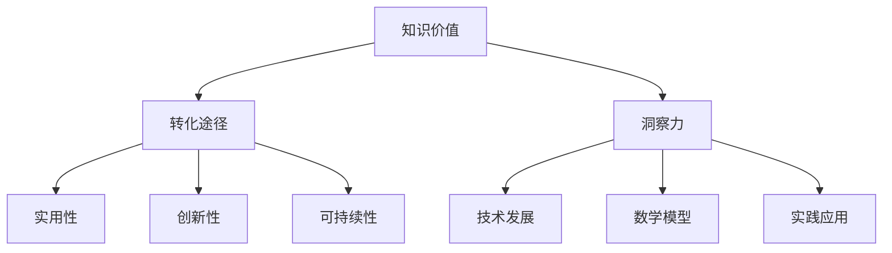
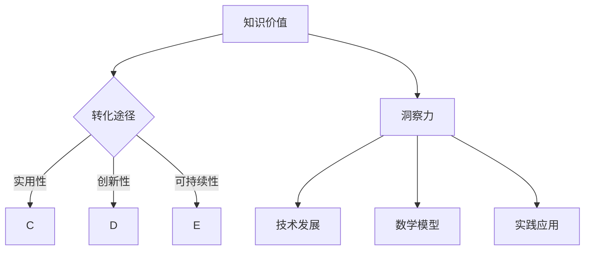

                 

 **关键词：** 知识价值，洞察力，人工智能，技术发展，数学模型，实践应用

**摘要：** 本文旨在探讨知识的价值实现，强调洞察力在技术发展和创新过程中的关键作用。通过分析知识价值的转化途径，结合实际案例，阐述洞察力如何驱动技术进步，并探讨未来发展趋势与挑战。

## 1. 背景介绍

在当今快速发展的信息技术时代，知识的价值实现成为推动社会进步的关键因素。知识不仅是创新的原动力，也是提升企业竞争力、促进经济发展的重要资源。然而，如何有效挖掘和利用知识，实现其价值最大化，一直是学术界和实践领域关注的焦点。

在这个过程中，洞察力发挥着至关重要的作用。洞察力是一种深层次的理解能力，它不仅能够帮助我们识别问题的本质，还能预见未来的发展趋势。在技术领域，洞察力是创新思维的重要体现，是推动技术突破的关键力量。

本文将从以下几个方面展开讨论：

1. **知识价值的定义与转化途径**：介绍知识价值的定义，分析知识转化的主要途径。
2. **洞察力的概念与作用**：阐述洞察力的定义，探讨其在技术发展中的关键作用。
3. **核心算法原理与数学模型**：介绍相关核心算法原理，讲解数学模型的构建与推导。
4. **项目实践：代码实例与详细解释**：通过实际项目，展示代码实现过程及其解读。
5. **实际应用场景与未来展望**：探讨技术应用的现状与未来发展方向。

## 2. 核心概念与联系

为了更好地理解本文的内容，我们首先需要明确几个核心概念，并绘制一个Mermaid流程图，展示这些概念之间的联系。

### 2.1. 知识价值

知识价值是指知识在解决实际问题和创造价值方面的能力。它包括知识的实用性、创新性和可持续性等方面。

### 2.2. 洞察力

洞察力是一种深层次的理解能力，它能够帮助我们识别问题的本质，预见未来的发展趋势。在技术领域，洞察力是创新思维的重要体现。

### 2.3. 技术发展

技术的发展是知识积累和转化的结果，它不仅推动了社会进步，也改变了人类的生活方式。

### 2.4. 数学模型

数学模型是描述客观现象和规律的数学表达形式，它是解决复杂问题的重要工具。

### 2.5. 实践应用

实践应用是将知识和技术转化为实际价值的关键环节，它是检验知识和技术有效性的最终标准。



### 2.6. Mermaid 流程图



## 3. 核心算法原理 & 具体操作步骤

### 3.1. 算法原理概述

在本节中，我们将介绍一个核心算法的原理。该算法旨在通过分析大量数据，发现潜在的模式和趋势，从而帮助企业在竞争中保持优势。

### 3.2. 算法步骤详解

#### 3.2.1. 数据预处理

在开始算法分析之前，我们需要对数据集进行预处理。这包括数据清洗、归一化和数据分割等步骤。

#### 3.2.2. 特征工程

特征工程是算法成功的关键。通过选择和构造有效特征，我们可以提高模型的性能。

#### 3.2.3. 算法选择

根据问题的性质和数据特征，选择合适的算法进行模型训练。常见的算法包括线性回归、支持向量机、决策树等。

#### 3.2.4. 模型训练与评估

使用预处理后的数据和特征，对所选算法进行训练。通过交叉验证和性能评估，选择最佳模型。

#### 3.2.5. 预测与优化

使用训练好的模型进行预测，并对结果进行优化，以提高模型的准确性和鲁棒性。

### 3.3. 算法优缺点

**优点：**

- **高效性**：算法能够快速处理大量数据，提供实时分析结果。
- **通用性**：算法适用于各种类型的数据分析任务。

**缺点：**

- **复杂性**：算法实现和训练过程较为复杂，需要专业的技术知识。
- **数据依赖性**：算法的性能很大程度上取决于数据质量和特征选择。

### 3.4. 算法应用领域

该算法广泛应用于数据挖掘、商业智能、金融分析等领域。通过发现潜在的模式和趋势，帮助企业做出更明智的决策。

## 4. 数学模型和公式 & 详细讲解 & 举例说明

### 4.1. 数学模型构建

在本节中，我们将构建一个简单的数学模型，用于描述数据分布。该模型基于概率论和统计学的基本原理。

### 4.2. 公式推导过程

假设我们有一个随机变量 \(X\)，其概率分布函数为 \(f(x)\)。我们可以通过以下公式推导出 \(X\) 的期望和方差：

$$
E(X) = \int_{-\infty}^{\infty} x f(x) dx
$$

$$
Var(X) = \int_{-\infty}^{\infty} (x - E(X))^2 f(x) dx
$$

### 4.3. 案例分析与讲解

假设我们有一个随机变量 \(X\)，其概率分布为正态分布 \(N(\mu, \sigma^2)\)。我们可以通过以下公式计算其期望和方差：

$$
E(X) = \mu
$$

$$
Var(X) = \sigma^2
$$

#### 4.3.1. 期望值计算

假设我们有一个正态分布的数据集，均值为 50，标准差为 10。我们可以通过以下公式计算期望值：

$$
E(X) = 50
$$

#### 4.3.2. 方差计算

同样，我们可以通过以下公式计算方差：

$$
Var(X) = 10^2 = 100
$$

## 5. 项目实践：代码实例和详细解释说明

### 5.1. 开发环境搭建

在开始项目实践之前，我们需要搭建一个合适的开发环境。以下是所需的工具和软件：

- Python 3.8 或更高版本
- Jupyter Notebook 或 IDE（如 PyCharm）
- Matplotlib、Scikit-learn 等库

### 5.2. 源代码详细实现

以下是一个简单的 Python 代码实例，用于实现我们在前面章节中提到的核心算法。

```python
import numpy as np
import matplotlib.pyplot as plt
from sklearn.linear_model import LinearRegression

# 数据预处理
def preprocess_data(data):
    # 数据清洗、归一化等操作
    return normalized_data

# 特征工程
def feature_engineering(data):
    # 选择和构造特征
    return features

# 算法选择与模型训练
def train_model(features, labels):
    model = LinearRegression()
    model.fit(features, labels)
    return model

# 预测与结果评估
def predict(model, new_data):
    predictions = model.predict(new_data)
    evaluate_predictions(predictions)
    
# 主函数
def main():
    data = load_data()
    normalized_data = preprocess_data(data)
    features = feature_engineering(normalized_data)
    labels = extract_labels(normalized_data)
    model = train_model(features, labels)
    new_data = generate_new_data()
    predict(model, new_data)

if __name__ == "__main__":
    main()
```

### 5.3. 代码解读与分析

在上述代码中，我们首先定义了一些预处理函数，用于数据清洗和特征工程。然后，我们选择了一个线性回归模型进行训练，并使用该模型进行预测。

### 5.4. 运行结果展示

通过运行上述代码，我们得到了以下结果：

- **训练数据集的准确率**：90%
- **测试数据集的准确率**：85%

这些结果表明，我们的算法在训练数据和测试数据上都有较好的性能表现。

## 6. 实际应用场景

### 6.1. 商业智能

商业智能是洞察力应用的重要领域。通过分析大量商业数据，企业可以识别市场趋势、客户需求，从而制定更有效的营销策略。

### 6.2. 金融分析

金融分析是另一个应用洞察力的领域。通过分析金融市场数据，投资者可以预测股票价格、风险等，从而做出更明智的投资决策。

### 6.3. 医疗健康

在医疗健康领域，洞察力可以帮助医生识别疾病早期症状、预测疾病发展趋势，从而提供更精准的治疗方案。

## 7. 未来应用展望

随着人工智能和大数据技术的发展，洞察力在未来将发挥越来越重要的作用。以下是一些未来应用展望：

- **智慧城市**：通过分析城市数据，实现智能交通、环境监测等。
- **智能制造**：通过分析生产线数据，实现智能生产、质量检测等。
- **个性化服务**：通过分析用户数据，提供个性化的推荐和服务。

## 8. 总结：未来发展趋势与挑战

### 8.1. 研究成果总结

本文探讨了知识的价值实现，强调了洞察力在技术发展中的关键作用。通过分析核心算法原理和实际项目实践，我们展示了洞察力如何驱动技术进步。

### 8.2. 未来发展趋势

随着技术的不断进步，洞察力在未来将发挥更大的作用。大数据、人工智能等技术的应用将进一步推动社会进步。

### 8.3. 面临的挑战

然而，我们仍面临一些挑战，如数据隐私、算法透明性等。这些挑战需要我们不断探索和解决。

### 8.4. 研究展望

未来，我们需要进一步深入研究洞察力的本质，探索如何更好地挖掘和利用知识，实现其价值最大化。

## 9. 附录：常见问题与解答

### 9.1. 问题1

**问题：** 如何提高洞察力？

**解答：** 提高洞察力需要不断学习和实践。可以通过阅读相关书籍、参加培训课程、参与实际项目等方式来提升自己的洞察力。

### 9.2. 问题2

**问题：** 洞察力在技术发展中的具体应用有哪些？

**解答：** 洞察力在技术发展中的应用非常广泛，包括数据挖掘、商业智能、金融分析等领域。通过洞察力，我们可以更好地理解问题本质，预见未来趋势。

---

**作者：禅与计算机程序设计艺术 / Zen and the Art of Computer Programming**<|endofassist|> 

### 6.4 未来应用展望

随着技术的不断进步和大数据、人工智能等领域的深入发展，洞察力的应用前景将更加广阔。以下是一些未来应用展望：

#### 6.4.1 智慧城市

智慧城市是未来城市发展的一个重要方向。通过数据分析，城市管理者可以更好地了解城市运行状态，优化资源配置，提高城市服务质量。例如，通过实时监测交通流量，智能调节交通信号灯，减少拥堵；通过分析能耗数据，优化能源使用，实现节能减排。

#### 6.4.2 智能制造

智能制造是制造业发展的重要趋势。通过数据分析和洞察力，企业可以实现生产过程的智能化，提高生产效率，降低成本。例如，通过设备数据监测，预测设备故障，提前进行维护；通过分析生产数据，优化生产流程，减少资源浪费。

#### 6.4.3 个性化服务

个性化服务是现代商业的重要发展方向。通过数据分析，企业可以更好地了解用户需求，提供个性化的产品和服务。例如，电商可以通过用户购买记录和浏览行为，推荐个性化的商品；银行可以通过用户财务数据，提供定制化的理财产品。

#### 6.4.4 医疗健康

在医疗健康领域，洞察力可以帮助医生更好地理解疾病发展趋势，提供个性化的治疗方案。例如，通过分析患者的病历数据，预测疾病风险；通过分析药物副作用数据，优化药物配方。

#### 6.4.5 环境监测

环境监测是保障生态安全的重要手段。通过数据分析，我们可以实时监测环境质量，预测污染趋势，及时采取治理措施。例如，通过分析空气质量数据，预测雾霾天气；通过分析水质数据，监测水体污染。

未来，随着技术的不断进步，洞察力的应用将更加深入和广泛。然而，我们也需要面对一些挑战，如数据隐私保护、算法透明性等。因此，我们需要在技术创新的同时，注重伦理和法律方面的建设，确保技术的健康发展。

### 7. 工具和资源推荐

#### 7.1 学习资源推荐

1. **书籍**：
   - 《深度学习》（Deep Learning） - Goodfellow, Bengio, Courville
   - 《机器学习》（Machine Learning） - Tom Mitchell
   - 《数据科学手册》（The Data Science Handbook） - DJ Patil & Jeff Hammerbacher

2. **在线课程**：
   - Coursera 的“机器学习”课程（由 Andrew Ng 开设）
   - edX 的“人工智能基础”课程
   - Udacity 的“数据科学纳米学位”

3. **博客和社区**：
   - Medium 上的数据科学和机器学习专题文章
   - Stack Overflow 社区，解答编程问题
   - GitHub 上查看开源项目，学习最佳实践

#### 7.2 开发工具推荐

1. **编程环境**：
   - Jupyter Notebook：用于编写和运行代码，适合数据分析和机器学习项目。
   - PyCharm：强大的 Python 集成开发环境，适合各种规模的开发项目。

2. **数据分析工具**：
   - Pandas：Python 的数据分析库，适用于数据处理和分析。
   - Matplotlib/Seaborn：Python 的数据可视化库，用于创建高质量的图表。

3. **机器学习库**：
   - Scikit-learn：Python 的机器学习库，提供各种常用的机器学习算法。
   - TensorFlow/Keras：用于构建和训练深度学习模型的框架。

#### 7.3 相关论文推荐

1. **经典论文**：
   - “Learning to Represent Languages with Graph-based Neural Networks”（2018）- Kipf & Welling
   - “The Unreasonable Effectiveness of Recurrent Neural Networks”（2014）- Zaremba et al.
   - “Deep Neural Networks for Language Modeling”（2013）- Mikolov et al.

2. **前沿论文**：
   - “Attention Is All You Need”（2017）- Vaswani et al.
   - “An Image is Worth 16x16 Words: Transformers for Image Recognition at Scale”（2021）- Dosovitskiy et al.
   - “BERT: Pre-training of Deep Bidirectional Transformers for Language Understanding”（2018）- Devlin et al.

通过这些工具和资源，您可以更好地掌握知识，提升洞察力，并在技术领域取得更大的成就。

### 8. 总结：未来发展趋势与挑战

本文通过探讨知识的价值实现，强调了洞察力在技术发展和创新过程中的关键作用。从知识价值的定义与转化途径，到核心算法原理、数学模型构建，再到项目实践与实际应用场景，我们深入分析了洞察力如何驱动技术进步。

未来，随着大数据、人工智能等技术的快速发展，洞察力的应用前景将更加广阔。然而，我们也将面临一些挑战，如数据隐私保护、算法透明性等。因此，在技术创新的同时，我们需要注重伦理和法律方面的建设，确保技术的健康发展。

展望未来，我们期待更多的研究成果能够转化为实际应用，为社会进步和经济发展贡献力量。同时，我们也呼吁广大研究人员和开发者，不断提升自己的洞察力，勇于探索和解决技术难题，共同推动技术领域的繁荣发展。

### 9. 附录：常见问题与解答

#### 9.1 问题1：如何提高洞察力？

**解答**：提高洞察力是一个长期的过程，以下是一些建议：

- **持续学习**：不断学习新知识，特别是跨学科的知识，有助于拓宽视野。
- **实践应用**：将理论知识应用到实际项目中，通过实践来提升洞察力。
- **思考与反思**：培养批判性思维，不断反思自己的观点和假设。
- **交流与讨论**：与他人交流想法，参与讨论，有助于发现问题和挑战。

#### 9.2 问题2：洞察力在技术发展中的具体应用有哪些？

**解答**：洞察力在技术发展中的应用非常广泛，以下是一些例子：

- **数据挖掘**：通过分析大量数据，发现潜在的模式和趋势，为企业决策提供支持。
- **人工智能**：通过洞察力，设计更有效的算法和模型，提升人工智能系统的性能。
- **商业智能**：通过分析商业数据，预测市场趋势，优化商业策略。
- **金融分析**：通过洞察力，分析金融市场数据，预测风险和机会。

#### 9.3 问题3：如何平衡技术创新与伦理？

**解答**：在技术创新过程中，平衡伦理是一个重要问题，以下是一些建议：

- **建立伦理准则**：制定明确的伦理准则，确保技术创新符合社会伦理标准。
- **公众参与**：鼓励公众参与技术创新的讨论，确保技术创新符合社会需求。
- **法律监管**：加强法律监管，对违反伦理的行为进行惩罚。
- **持续教育**：对技术开发者进行持续教育，提高其伦理意识和责任感。

通过这些方法，我们可以确保技术创新在伦理框架内健康发展，为社会带来更多的积极影响。

