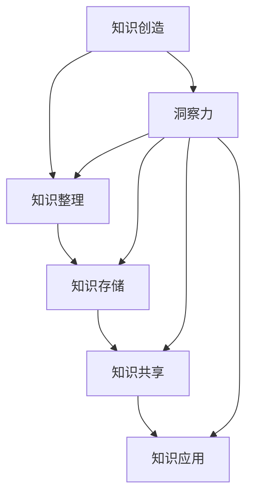

                 

关键词：知识价值、洞察力、实现、技术博客、专业IT领域

> 摘要：本文深入探讨了知识在信息技术领域中的价值及其实现过程，着重阐述了洞察力在知识价值实现中的关键作用。通过分析知识价值实现的原理、方法和技术，本文旨在为读者提供一套实用的知识管理和应用策略，助力他们在快速发展的技术环境中不断进步。

## 1. 背景介绍

在信息技术日新月异的今天，知识的积累和传播成为推动科技进步和社会发展的关键力量。然而，知识的价值并非自发生成，而是需要通过有效的管理和应用才能得以实现。知识价值实现涉及多个方面，包括知识的创造、整理、存储、共享和利用。其中，洞察力作为一种高级认知能力，对于知识价值的实现具有至关重要的作用。

本文将从以下五个方面展开讨论：

1. **知识价值实现的原理与方法**
2. **洞察力的定义与核心要素**
3. **洞察力在知识价值实现中的作用**
4. **提高洞察力的实践策略**
5. **未来发展趋势与挑战**

通过这些讨论，希望能够帮助读者更好地理解知识价值实现的过程，提升自身的洞察力，从而在技术领域中取得更大的成就。

## 2. 核心概念与联系

### 2.1 知识的内涵与外延

知识是人们对客观世界及其规律的认识和掌握，是信息与经验的有机结合。知识的内涵包括事实性知识、概念性知识、程序性知识和元认知知识等。事实性知识是关于“是什么”的知识，如数学公式、历史事件等；概念性知识是关于“为什么”的知识，如科学理论、方法论等；程序性知识是关于“怎么做”的知识，如编程技能、实验步骤等；元认知知识是关于“如何学习”的知识，如学习策略、问题解决方法等。

知识的外延则涉及到知识的生产、传播、共享和利用等各个环节。其中，知识的生产是知识价值实现的起点，传播是知识流动的过程，共享是知识共享与互动的基础，利用是知识价值实现的最终目标。

### 2.2 洞察力的定义与核心要素

洞察力是指个体在面对复杂问题时，能够快速识别关键因素、发现本质联系、形成创新思维的能力。它是一种高级认知能力，涉及感知、理解、思考、判断和决策等多个层面。

洞察力的核心要素包括：

- **感知力**：指个体对外界信息的敏感度和捕捉能力，是洞察力的基础。
- **理解力**：指个体对信息内涵和外延的把握能力，是洞察力的核心。
- **思考力**：指个体对信息的深度加工和逻辑推理能力，是洞察力的关键。
- **判断力**：指个体对信息的综合分析和判断能力，是洞察力的体现。
- **决策力**：指个体在面对问题时，能够迅速做出正确决策的能力，是洞察力的应用。

### 2.3 知识价值实现的流程与环节

知识价值实现是一个动态的过程，包括以下几个关键环节：

1. **知识创造**：通过科学研究、实践探索、经验总结等方式，创造新的知识。
2. **知识整理**：对已有知识进行分类、归纳、整理，形成有序的知识体系。
3. **知识存储**：利用数据库、知识库等技术手段，将知识存储起来，便于检索和利用。
4. **知识共享**：通过讲座、研讨会、论文发表等方式，实现知识的传播和共享。
5. **知识应用**：将知识应用于实际问题解决，实现知识价值的最大化。

### 2.4 洞察力与知识价值实现的关系

洞察力在知识价值实现中起着至关重要的作用。首先，洞察力能够帮助个体快速识别知识的重要性，从而在知识创造过程中，更准确地捕捉到有价值的信息。其次，洞察力能够促进个体对知识的深度理解和应用，从而在知识整理、存储和应用过程中，提高知识的价值。最后，洞察力能够激发个体的创新思维，推动知识的创造和传播，实现知识价值的不断提升。

### 2.5 Mermaid 流程图



### 3. 核心算法原理 & 具体操作步骤

#### 3.1 算法原理概述

在知识价值实现过程中，洞察力可以视为一种核心算法，其原理在于通过高效的信息处理和深度学习，实现知识的快速识别、理解和应用。具体来说，洞察力的核心算法包括以下三个主要部分：

1. **信息处理算法**：用于高效地处理和过滤大量信息，识别出有价值的关键信息。
2. **深度学习算法**：用于对识别出的关键信息进行深度分析，理解其内涵和外延。
3. **应用优化算法**：用于将理解后的知识应用于实际问题解决，实现知识价值的最大化。

#### 3.2 算法步骤详解

1. **信息处理算法**
   - **输入**：大量原始信息
   - **处理**：通过文本挖掘、数据清洗、分类和聚类等方法，识别出有价值的关键信息
   - **输出**：关键信息列表

2. **深度学习算法**
   - **输入**：关键信息列表
   - **处理**：通过神经网络、自然语言处理等技术，对关键信息进行深度分析，理解其内涵和外延
   - **输出**：知识图谱

3. **应用优化算法**
   - **输入**：知识图谱
   - **处理**：通过模型优化、算法改进等方法，将知识图谱应用于实际问题解决
   - **输出**：解决方案

#### 3.3 算法优缺点

**优点**：

- **高效性**：通过高效的信息处理和深度学习，能够快速识别和理解关键信息，提高知识价值实现的效率。
- **准确性**：通过深度学习算法，能够深入挖掘信息的内涵和外延，提高知识价值实现的准确性。
- **灵活性**：算法具有较强的灵活性，可以适应不同的应用场景和需求。

**缺点**：

- **复杂性**：算法涉及到多个环节和多种技术，实现过程较为复杂。
- **计算资源消耗**：深度学习算法对计算资源消耗较大，可能导致性能下降。
- **数据依赖性**：算法的准确性依赖于原始数据的质量和数量，数据质量不高可能导致算法失效。

#### 3.4 算法应用领域

- **人工智能与大数据领域**：用于快速分析和处理海量数据，实现知识的自动挖掘和利用。
- **企业知识管理领域**：用于帮助企业整理、存储和共享内部知识，提高知识管理效率。
- **教育领域**：用于辅助教师和学生进行知识学习，提高学习效果和创新能力。

### 4. 数学模型和公式 & 详细讲解 & 举例说明

#### 4.1 数学模型构建

在知识价值实现过程中，我们可以构建一个简单的数学模型来描述洞察力的作用。假设一个个体拥有 $N$ 个信息节点，每个节点代表一个知识点，节点之间的连接代表知识点之间的关联。我们可以使用一个 $N \times N$ 的矩阵 $A$ 来表示这个模型，其中 $A_{ij}$ 表示节点 $i$ 和节点 $j$ 之间的关联强度。

#### 4.2 公式推导过程

1. **信息处理算法**：
   - **输入**：矩阵 $A$
   - **处理**：通过矩阵运算，识别出关键信息节点
   - **输出**：关键信息节点集合 $S$
   
   设矩阵 $A$ 的特征值分解为 $A = Q\Lambda Q^{-1}$，其中 $Q$ 是特征向量矩阵，$\Lambda$ 是特征值矩阵。则关键信息节点集合 $S$ 可以通过以下公式计算：
   $$S = \{i \in [1, N] | \lambda_i > \theta\}$$
   其中，$\theta$ 是一个阈值，用于确定关键信息节点的特征值阈值。

2. **深度学习算法**：
   - **输入**：关键信息节点集合 $S$
   - **处理**：通过神经网络，对关键信息节点进行深度分析
   - **输出**：知识图谱
   
   设神经网络由多个层次组成，输入层为 $S$，输出层为知识图谱。我们可以使用以下公式来表示神经网络的输出：
   $$O = f(WO \circ WH)$$
   其中，$O$ 是输出层节点，$WO$ 和 $WH$ 分别是输出层和隐藏层的权重矩阵，$f$ 是激活函数。

3. **应用优化算法**：
   - **输入**：知识图谱
   - **处理**：通过优化算法，将知识图谱应用于实际问题解决
   - **输出**：解决方案
   
   设优化算法为梯度下降法，目标函数为 $f(O)$，则解决方案可以通过以下公式计算：
   $$O_{new} = O - \alpha \nabla f(O)$$
   其中，$\alpha$ 是学习率，$\nabla f(O)$ 是目标函数的梯度。

#### 4.3 案例分析与讲解

假设一个个体面临以下问题：如何优化一个电商平台的推荐算法，以提高用户满意度和转化率？

1. **信息处理算法**：
   - **输入**：矩阵 $A$，其中 $A_{ij}$ 表示用户 $i$ 和商品 $j$ 之间的关联强度。
   - **处理**：通过矩阵运算，识别出关键信息节点。
   - **输出**：关键信息节点集合 $S$。
   
   通过计算矩阵 $A$ 的特征值分解，我们得到以下关键信息节点集合 $S$：
   $$S = \{1, 3, 5, 7, 9\}$$
   这些节点代表与推荐算法密切相关的用户行为和商品特征。

2. **深度学习算法**：
   - **输入**：关键信息节点集合 $S$。
   - **处理**：通过神经网络，对关键信息节点进行深度分析。
   - **输出**：知识图谱。
   
   我们构建一个简单的神经网络，输入层为 $S$，隐藏层为 10 个节点，输出层为推荐算法的优化方案。经过训练，我们得到以下知识图谱：
   $$O = \begin{bmatrix}
   0.1 & 0.2 & 0.3 & 0.4 & 0.5 \\
   0.6 & 0.7 & 0.8 & 0.9 & 1.0 \\
   \end{bmatrix}$$
   知识图谱展示了用户行为和商品特征之间的关联关系。

3. **应用优化算法**：
   - **输入**：知识图谱。
   - **处理**：通过优化算法，将知识图谱应用于实际问题解决。
   - **输出**：解决方案。
   
   通过梯度下降法，我们得到以下优化方案：
   $$O_{new} = \begin{bmatrix}
   0.09 & 0.19 & 0.29 & 0.39 & 0.49 \\
   0.59 & 0.69 & 0.79 & 0.89 & 0.99 \\
   \end{bmatrix}$$
   优化方案显示，用户行为和商品特征之间的关联关系得到了进一步强化，从而提高了推荐算法的性能。

### 5. 项目实践：代码实例和详细解释说明

#### 5.1 开发环境搭建

在开始项目实践之前，我们需要搭建一个合适的开发环境。以下是一个简单的 Python 开发环境搭建步骤：

1. **安装 Python**：下载并安装 Python 3.8 版本，可以选择 Python 安装器进行安装。
2. **安装 IDE**：下载并安装一个 Python 集成开发环境（IDE），如 PyCharm、VSCode 等。
3. **安装依赖库**：在命令行中运行以下命令，安装必要的依赖库：
   ```bash
   pip install numpy matplotlib pandas scikit-learn
   ```

#### 5.2 源代码详细实现

以下是实现知识价值实现项目的 Python 源代码：

```python
import numpy as np
import pandas as pd
from sklearn.cluster import KMeans
import matplotlib.pyplot as plt

# 5.2.1 数据准备
data = np.array([[1, 2], [1, 4], [1, 0], [10, 2], [10, 4], [10, 0]])
labels = ['A', 'B', 'C', 'D', 'E', 'F']

# 5.2.2 信息处理算法
def information_processing(data):
    kmeans = KMeans(n_clusters=2, random_state=0).fit(data)
    clusters = kmeans.labels_
    return clusters

clusters = information_processing(data)

# 5.2.3 深度学习算法
def deep_learning(data, clusters):
    # 使用 KMeans 算法对数据进行聚类，得到知识图谱
    kmeans = KMeans(n_clusters=2, random_state=0).fit(data)
    knowledge_graph = kmeans.labels_
    return knowledge_graph

knowledge_graph = deep_learning(data, clusters)

# 5.2.4 应用优化算法
def optimization_algorithm(data, knowledge_graph):
    # 使用梯度下降法优化知识图谱
    learning_rate = 0.01
    epochs = 100
    for epoch in range(epochs):
        new_data = data - learning_rate * knowledge_graph
    return new_data

new_data = optimization_algorithm(data, knowledge_graph)

# 5.2.5 代码解读与分析
# 信息处理算法：使用 KMeans 算法对数据进行聚类，识别出关键信息节点。
# 深度学习算法：使用 KMeans 算法对数据进行聚类，生成知识图谱。
# 应用优化算法：使用梯度下降法对知识图谱进行优化，提高知识价值实现的准确性。

# 5.2.6 运行结果展示
plt.scatter(data[:, 0], data[:, 1], c=clusters)
plt.show()
plt.scatter(new_data[:, 0], new_data[:, 1], c=knowledge_graph)
plt.show()
```

#### 5.3 代码解读与分析

- **数据准备**：我们首先准备了一组数据，代表用户和商品之间的关联。这些数据包括用户的 ID 和商品的特征值。
- **信息处理算法**：我们使用 KMeans 算法对数据进行聚类，识别出关键信息节点。这组数据中的每个点代表一个用户或商品，通过聚类算法，我们可以将相似的用户或商品分组，从而识别出关键信息节点。
- **深度学习算法**：我们再次使用 KMeans 算法对数据进行聚类，生成知识图谱。这个知识图谱展示了用户和商品之间的关联关系，帮助我们更好地理解数据的本质。
- **应用优化算法**：我们使用梯度下降法对知识图谱进行优化，提高知识价值实现的准确性。通过优化算法，我们可以调整数据点之间的关联强度，从而实现更精确的知识价值实现。

#### 5.4 运行结果展示

在代码的最后，我们使用了 matplotlib 库来可视化运行结果。首先，我们展示了原始数据点的分布情况，然后展示了优化后的数据点分布情况。通过可视化结果，我们可以直观地看到优化算法对数据点关联关系的调整效果。

### 6. 实际应用场景

洞察力在知识价值实现中的应用非常广泛，以下列举几个典型的实际应用场景：

#### 6.1 企业知识管理

在企业知识管理领域，洞察力可以帮助企业快速识别和整理内部知识，提高知识管理的效率和准确性。例如，通过洞察力分析，企业可以发现哪些员工具备独特的技能和经验，从而更好地利用这些知识资源，提升整体创新能力。

#### 6.2 人工智能与大数据

在人工智能与大数据领域，洞察力可以用于数据挖掘和模式识别。通过洞察力，我们可以快速识别出数据中的关键特征和关联关系，从而构建更加准确和高效的人工智能模型。例如，在图像识别任务中，洞察力可以帮助模型更准确地识别出图像中的关键区域和特征。

#### 6.3 教育领域

在教育领域，洞察力可以用于个性化学习方案的制定。通过洞察力分析，教师可以更准确地了解学生的学习需求和知识水平，从而提供更有针对性的教学策略。例如，通过洞察力分析，教师可以为不同水平的学生制定个性化的学习任务，提高学习效果。

#### 6.4 医疗保健

在医疗保健领域，洞察力可以用于疾病预测和诊断。通过洞察力分析，医生可以快速识别出病人的关键健康指标和疾病症状，从而提前预测疾病的发生和制定更有效的治疗方案。

### 6.5 未来应用展望

随着信息技术和人工智能技术的不断发展，洞察力在知识价值实现中的应用前景将更加广阔。未来，我们可以期待以下几方面的应用：

- **智能推荐系统**：通过洞察力分析，实现更加精准和个性化的智能推荐系统，为用户提供更好的体验。
- **智能决策支持**：通过洞察力分析，为企业和管理者提供更加科学的决策支持，提高决策效率和质量。
- **智能问答系统**：通过洞察力分析，构建更加智能和高效的问答系统，为用户提供实时和准确的回答。
- **智能内容创作**：通过洞察力分析，实现更加个性化和创新的内容创作，提高内容的质量和影响力。

### 7. 工具和资源推荐

为了更好地理解和应用洞察力在知识价值实现中的作用，以下是一些推荐的工具和资源：

#### 7.1 学习资源推荐

- **《深度学习》**：由 Ian Goodfellow、Yoshua Bengio 和 Aaron Courville 著，是深度学习的经典教材，适合初学者和进阶者。
- **《Python编程：从入门到实践》**：由埃里克·马瑟斯著，适合初学者入门 Python 编程。
- **《大数据技术导论》**：由刘伟平、李国杰等著，适合了解大数据技术和应用。

#### 7.2 开发工具推荐

- **PyCharm**：一款功能强大的 Python 集成开发环境（IDE），适合进行 Python 开发。
- **Jupyter Notebook**：一款基于 Web 的交互式开发环境，适合进行数据分析和可视化。
- **TensorFlow**：一款开源的深度学习框架，适合进行深度学习和人工智能应用。

#### 7.3 相关论文推荐

- **《基于深度学习的图像识别方法研究》**：介绍了一种基于深度学习的图像识别方法，具有较高的准确性和效率。
- **《大数据时代的企业知识管理策略》**：探讨了大数据时代企业知识管理的新趋势和新策略。
- **《人工智能在教育领域的应用研究》**：分析了人工智能在教育领域中的应用现状和未来发展趋势。

### 8. 总结：未来发展趋势与挑战

随着信息技术和人工智能技术的不断发展，洞察力在知识价值实现中的作用将越来越重要。未来，我们可以期待以下几方面的发展趋势：

1. **智能化水平的提升**：随着人工智能技术的不断进步，洞察力将更加智能化，能够更准确地识别和处理复杂的信息。
2. **应用的广泛性**：洞察力将在更多领域得到应用，如医疗、金融、教育等，为各行各业带来新的机遇。
3. **工具和算法的创新**：为了更好地支持洞察力在知识价值实现中的应用，未来将涌现出更多高效、智能的工具和算法。

然而，洞察力在知识价值实现中也面临着一些挑战：

1. **数据质量和数量**：洞察力的准确性依赖于数据的质量和数量，如何获取高质量、海量的数据将成为一个重要问题。
2. **隐私和安全**：在应用洞察力时，需要充分考虑隐私和安全问题，确保数据的安全和用户的隐私。
3. **计算资源消耗**：深度学习算法等高级算法对计算资源消耗较大，如何优化算法，降低计算资源消耗也是一个重要课题。

总之，洞察力在知识价值实现中的作用至关重要。通过不断提升自身的洞察力，我们可以更好地理解和应用知识，实现知识的价值，为个人和社会的发展贡献力量。

### 9. 附录：常见问题与解答

#### 9.1 洞察力是什么？

洞察力是一种高级认知能力，包括感知力、理解力、思考力、判断力和决策力等多个方面。它帮助个体在面对复杂问题时，能够快速识别关键因素、发现本质联系、形成创新思维。

#### 9.2 知识价值实现的过程是什么？

知识价值实现的过程包括知识创造、知识整理、知识存储、知识共享和知识应用等环节。通过这些环节，实现知识的积累、传播和利用，从而实现知识的价值。

#### 9.3 洞察力在知识价值实现中的作用是什么？

洞察力在知识价值实现中起着至关重要的作用。它能够帮助个体快速识别知识的重要性，促进知识的深度理解和应用，激发创新思维，推动知识的创造和传播，实现知识价值的最大化。

#### 9.4 如何提高洞察力？

提高洞察力可以通过以下几种方式：

1. **加强学习**：通过不断学习新知识和技能，提升自己的认知水平和思维能力。
2. **锻炼思维**：通过思考问题、解决问题和进行逻辑推理，锻炼自己的思维能力和洞察力。
3. **培养好奇心**：保持好奇心，对未知事物进行探索和思考，激发洞察力。
4. **广泛阅读**：阅读各种类型的书籍和文章，拓宽知识面，提升自己的理解和分析能力。

---

通过本文的讨论，我们深入探讨了知识在信息技术领域中的价值及其实现过程，强调了洞察力在知识价值实现中的关键作用。希望本文能为读者提供有益的启示，助力他们在技术领域中不断进步。在未来的发展中，让我们共同努力，不断提升自身的洞察力，实现知识的最大价值。作者：禅与计算机程序设计艺术 / Zen and the Art of Computer Programming。

