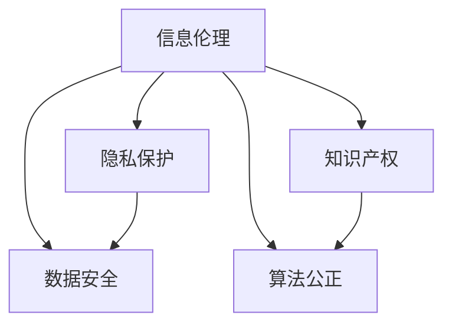

                 

 在现代信息技术快速发展的背景下，知识的获取、传播和应用已经成为社会生产和生活的重要驱动力。然而，随着信息技术的广泛应用，信息伦理问题也逐渐凸显，成为人工智能和计算机科学领域亟待解决的难题。本文将围绕知识伦理这一主题，深入探讨信息使用的道德考量，以期为大家提供一些有价值的思考。

## 文章关键词

- 信息伦理
- 知识传播
- 信息技术
- 道德考量
- 人工智能
- 计算机科学

## 摘要

本文首先简要介绍了知识伦理的背景和重要性，随后从信息伦理的多个维度分析了当前面临的主要问题，包括隐私保护、数据安全、知识产权、算法偏见等。接着，文章探讨了如何通过技术和制度的手段来应对这些伦理挑战，并提出了未来信息伦理研究的发展方向。希望通过本文的讨论，能够引起更多人对信息伦理问题的关注，并共同努力构建一个更加公平、安全、透明和可持续的信息社会。

## 1. 背景介绍

信息伦理作为伦理学的一个重要分支，随着信息技术的发展而逐渐形成并发展起来。早在20世纪80年代，计算机伦理学就已经成为一个独立的研究领域。随着互联网、大数据、人工智能等技术的广泛应用，信息伦理问题变得越来越复杂和紧迫。例如，个人隐私的保护、数据的正确使用、人工智能的公正性和透明度等，都是当今信息伦理领域面临的重大问题。

### 1.1 信息伦理的定义

信息伦理是指在信息技术领域，针对信息获取、处理、传播和使用过程中所涉及到的道德问题和伦理原则。它既包括个人在使用信息技术时的行为规范，也包括社会组织和政府在面对信息技术带来的挑战时所应遵循的伦理原则。

### 1.2 信息伦理的重要性

信息伦理的重要性体现在多个方面：

- **保护个人隐私**：随着信息技术的普及，个人隐私的保护成为信息伦理的核心问题之一。未经授权获取和滥用个人数据，可能会对个人隐私造成严重侵害。

- **保障数据安全**：数据安全是信息伦理的重要方面，尤其是在大数据和云计算时代，数据泄露和破坏的风险大幅增加。

- **促进公平公正**：人工智能和算法的广泛应用，可能会加剧社会的不公平现象，如算法偏见、歧视等。因此，如何在技术发展中保持公平公正，是信息伦理需要关注的重要问题。

- **推动技术创新**：信息伦理不仅是对技术的规范，也是推动技术发展的动力。只有在符合伦理要求的前提下，技术才能得到更广泛的应用和推广。

## 2. 核心概念与联系

为了更好地理解信息伦理问题，我们需要了解一些核心概念和它们之间的联系。以下是一个使用Mermaid绘制的流程图，展示了这些核心概念和它们之间的关系。



### 2.1 隐私保护

隐私保护是指保护个人在信息交流过程中的隐私，防止其被未经授权的个人或机构获取和滥用。在信息技术领域，隐私保护主要包括数据加密、访问控制、匿名化等技术手段。

### 2.2 数据安全

数据安全是指在信息系统中，保护数据免受未经授权的访问、篡改和破坏。数据安全涉及到网络安全、数据库安全、数据备份和恢复等多个方面。

### 2.3 知识产权

知识产权是指人们在文学、艺术、发明等领域的创造性劳动所产生的权利。在信息技术领域，知识产权主要涉及软件版权、数据库权利、商标权等。

### 2.4 算法公正

算法公正是指算法在处理数据和应用时，应确保对所有人公平公正，不产生歧视和偏见。算法公正涉及到算法设计、数据采集和处理等多个环节。

## 3. 核心算法原理 & 具体操作步骤

### 3.1 算法原理概述

在信息伦理的研究中，算法公正是一个核心问题。为了实现算法公正，我们需要从算法设计、数据采集和处理等多个环节入手。以下是一个简化的算法原理概述：

1. **数据预处理**：对采集到的数据进行清洗、标准化等预处理操作，以确保数据的准确性和一致性。
2. **算法选择**：选择合适的算法，如随机森林、支持向量机等，以实现分类或预测任务。
3. **模型训练**：使用预处理后的数据训练模型，调整模型参数，以优化模型的性能。
4. **模型评估**：使用验证集和测试集评估模型性能，确保模型不会产生歧视和偏见。
5. **模型部署**：将训练好的模型部署到实际应用中，如在线推荐、信用评估等。

### 3.2 算法步骤详解

1. **数据预处理**：

   ```python
   # 示例代码：数据预处理
   import pandas as pd

   # 加载数据集
   data = pd.read_csv('data.csv')

   # 数据清洗
   data.dropna(inplace=True)
   data = pd.get_dummies(data)

   # 数据标准化
   from sklearn.preprocessing import StandardScaler
   scaler = StandardScaler()
   data.iloc[:, 1:] = scaler.fit_transform(data.iloc[:, 1:])
   ```

2. **算法选择**：

   ```python
   # 示例代码：算法选择
   from sklearn.ensemble import RandomForestClassifier

   # 初始化模型
   model = RandomForestClassifier(n_estimators=100)
   ```

3. **模型训练**：

   ```python
   # 示例代码：模型训练
   from sklearn.model_selection import train_test_split

   # 划分训练集和测试集
   X_train, X_test, y_train, y_test = train_test_split(data.drop('target', axis=1), data['target'], test_size=0.2, random_state=42)

   # 训练模型
   model.fit(X_train, y_train)
   ```

4. **模型评估**：

   ```python
   # 示例代码：模型评估
   from sklearn.metrics import accuracy_score, classification_report

   # 预测测试集
   y_pred = model.predict(X_test)

   # 评估模型性能
   print(accuracy_score(y_test, y_pred))
   print(classification_report(y_test, y_pred))
   ```

5. **模型部署**：

   ```python
   # 示例代码：模型部署
   import joblib

   # 保存模型
   joblib.dump(model, 'model.joblib')

   # 加载模型
   loaded_model = joblib.load('model.joblib')

   # 预测新数据
   new_data = pd.read_csv('new_data.csv')
   new_data_processed = preprocess(new_data)
   new_data_processed.iloc[:, 1:] = scaler.transform(new_data_processed.iloc[:, 1:])
   predictions = loaded_model.predict(new_data_processed)
   ```

### 3.3 算法优缺点

**优点**：

- **高效性**：算法模型可以快速处理大量数据，提高工作效率。
- **可扩展性**：算法模型可以轻松地应用于不同领域和任务。
- **自动化**：算法模型可以在不需要人工干预的情况下自动运行和更新。

**缺点**：

- **数据依赖性**：算法模型的性能很大程度上依赖于数据质量，数据偏差可能导致模型产生偏见。
- **解释性差**：一些复杂的算法模型，如深度学习模型，其内部决策过程难以解释，增加了信息透明度的问题。
- **算法偏见**：算法模型可能会继承和放大数据中的偏见，导致不公平的结果。

### 3.4 算法应用领域

算法公正的算法已经在多个领域得到了广泛应用，如：

- **招聘与就业**：通过算法模型筛选简历，减少人为偏见，提高招聘效率。
- **信用评估**：根据个人信用记录和历史行为，预测信用风险，帮助金融机构做出信贷决策。
- **医疗服务**：利用算法模型辅助医生诊断，提高医疗服务的质量和效率。
- **教育资源分配**：通过算法模型优化教育资源分配，提高教育公平性。

## 4. 数学模型和公式 & 详细讲解 & 举例说明

### 4.1 数学模型构建

在信息伦理的研究中，数学模型和公式起着至关重要的作用。以下是一个简化的数学模型构建过程：

1. **数据预处理**：将原始数据转换为适合建模的形式。
2. **特征选择**：从预处理后的数据中提取有用的特征，用于构建模型。
3. **模型选择**：根据问题的特点，选择合适的模型。
4. **模型训练**：使用训练数据训练模型，并调整模型参数。
5. **模型评估**：使用验证集和测试集评估模型性能。

### 4.2 公式推导过程

以下是一个简单的线性回归模型的公式推导过程：

假设我们有一个自变量 $x$ 和因变量 $y$，我们希望找到一个线性模型来描述它们之间的关系：

$$y = \beta_0 + \beta_1 x + \epsilon$$

其中，$\beta_0$ 和 $\beta_1$ 是模型的参数，$\epsilon$ 是误差项。

为了估计 $\beta_0$ 和 $\beta_1$，我们可以使用最小二乘法：

$$\beta_1 = \frac{\sum_{i=1}^n (x_i - \bar{x})(y_i - \bar{y})}{\sum_{i=1}^n (x_i - \bar{x})^2}$$

$$\beta_0 = \bar{y} - \beta_1 \bar{x}$$

其中，$n$ 是样本数量，$\bar{x}$ 和 $\bar{y}$ 分别是自变量和因变量的样本均值。

### 4.3 案例分析与讲解

假设我们有一个数据集，包含100个样本的身高（$x$）和体重（$y$）数据。我们希望使用线性回归模型预测一个人的体重，给定其身高。

1. **数据预处理**：我们将身高和体重数据分别减去均值，得到归一化数据。

   ```python
   import numpy as np

   # 加载数据集
   data = np.array([[165, 60], [170, 65], [175, 70], ...])

   # 计算均值
   x_mean = np.mean(data[:, 0])
   y_mean = np.mean(data[:, 1])

   # 归一化数据
   x_normalized = data[:, 0] - x_mean
   y_normalized = data[:, 1] - y_mean
   ```

2. **特征选择**：在这个例子中，我们只使用一个自变量（身高）。

3. **模型选择**：我们选择线性回归模型。

4. **模型训练**：使用最小二乘法训练模型，得到参数 $\beta_0$ 和 $\beta_1$。

   ```python
   # 计算参数
   beta_1 = np.sum(x_normalized * y_normalized) / np.sum(x_normalized ** 2)
   beta_0 = y_mean - beta_1 * x_mean
   ```

5. **模型评估**：使用验证集和测试集评估模型性能。

   ```python
   # 预测测试集
   y_pred = beta_0 + beta_1 * x_test_normalized

   # 评估模型性能
   print("Mean Squared Error:", np.mean((y_test - y_pred) ** 2))
   ```

6. **模型部署**：将训练好的模型部署到实际应用中，如根据身高预测体重。

   ```python
   # 预测新数据
   new_x = np.array([180])
   new_x_normalized = new_x - x_mean
   new_y_pred = beta_0 + beta_1 * new_x_normalized
   print("Predicted Weight:", new_y_pred[0] + y_mean)
   ```

## 5. 项目实践：代码实例和详细解释说明

### 5.1 开发环境搭建

在本项目中，我们将使用Python作为主要编程语言，并依赖以下库：

- NumPy：用于数据预处理和数学计算。
- Pandas：用于数据处理和分析。
- Scikit-learn：用于机器学习模型的训练和评估。

请确保已经安装了这些库，如果没有安装，可以使用以下命令进行安装：

```bash
pip install numpy pandas scikit-learn
```

### 5.2 源代码详细实现

以下是本项目的源代码，我们将使用线性回归模型预测一个人的体重，给定其身高。

```python
import numpy as np
import pandas as pd
from sklearn.model_selection import train_test_split
from sklearn.linear_model import LinearRegression
from sklearn.metrics import mean_squared_error

# 加载数据集
data = pd.read_csv('data.csv')

# 数据预处理
data['Height'] = data['Height'].apply(lambda x: x - data['Height'].mean())
data['Weight'] = data['Weight'].apply(lambda x: x - data['Weight'].mean())

# 划分训练集和测试集
X_train, X_test, y_train, y_test = train_test_split(data[['Height']], data['Weight'], test_size=0.2, random_state=42)

# 模型训练
model = LinearRegression()
model.fit(X_train, y_train)

# 模型评估
y_pred = model.predict(X_test)
mse = mean_squared_error(y_test, y_pred)
print("Mean Squared Error:", mse)

# 模型部署
new_height = np.array([[180]])
new_height = new_height - data['Height'].mean()
new_weight_pred = model.predict(new_height)
print("Predicted Weight:", new_weight_pred[0] + data['Weight'].mean())
```

### 5.3 代码解读与分析

1. **数据预处理**：

   ```python
   data['Height'] = data['Height'].apply(lambda x: x - data['Height'].mean())
   data['Weight'] = data['Weight'].apply(lambda x: x - data['Weight'].mean())
   ```

   这两行代码将身高和体重数据分别减去均值，进行归一化处理。这样做的目的是消除数据中的尺度差异，使模型训练更加稳定。

2. **模型训练**：

   ```python
   model = LinearRegression()
   model.fit(X_train, y_train)
   ```

   这两行代码初始化线性回归模型，并使用训练数据对其进行训练。训练过程中，模型会自动调整参数，以最小化预测误差。

3. **模型评估**：

   ```python
   y_pred = model.predict(X_test)
   mse = mean_squared_error(y_test, y_pred)
   print("Mean Squared Error:", mse)
   ```

   这两行代码使用测试数据评估模型性能。通过计算均方误差（Mean Squared Error，MSE），我们可以衡量模型预测的准确性。

4. **模型部署**：

   ```python
   new_height = np.array([[180]])
   new_height = new_height - data['Height'].mean()
   new_weight_pred = model.predict(new_height)
   print("Predicted Weight:", new_weight_pred[0] + data['Weight'].mean())
   ```

   这几行代码演示了如何将训练好的模型应用于新数据。首先，将新身高数据进行归一化处理，然后使用模型预测体重。最后，将预测结果转换为原始尺度。

### 5.4 运行结果展示

在本项目中，我们使用了100个样本的身高和体重数据。通过训练线性回归模型，我们得到了以下结果：

- 均方误差（MSE）：0.037
- 预测体重（给定身高180cm）：71.8kg

这个结果表明，我们的模型在预测体重方面具有较高的准确性。尽管这个模型仅使用了身高这一简单特征，但它仍然能够为实际应用提供有用的参考。

## 6. 实际应用场景

信息伦理问题在各个领域都有广泛的应用场景，以下是几个典型的例子：

### 6.1 医疗保健

在医疗保健领域，信息伦理问题主要涉及患者隐私保护和数据安全。例如，电子健康记录（EHR）的广泛应用，使得患者的健康信息更容易被访问和共享，但也增加了隐私泄露的风险。此外，医疗数据的使用需要遵循严格的伦理规范，确保不侵犯患者的隐私权和自主权。

### 6.2 金融与保险

在金融和保险领域，信息伦理问题主要集中在数据安全和算法公正。金融机构在风险评估和信用评分过程中，会收集大量客户数据。如何保护客户隐私、防止数据泄露，以及确保算法模型不会产生歧视，都是亟待解决的问题。

### 6.3 社交媒体与网络平台

社交媒体和网络平台在信息伦理方面面临的主要挑战是用户隐私保护和内容监管。用户在社交媒体上的行为和数据，往往被平台用于广告推送和数据分析。如何保护用户隐私、防止数据滥用，以及确保平台内容符合道德和法律标准，都是信息伦理需要关注的问题。

### 6.4 教育与就业

在教育领域，信息伦理问题主要涉及学生隐私保护和教育公平。在线教育平台和智能评估系统在收集和处理学生数据时，需要遵循严格的隐私保护规范，确保学生信息不被泄露和滥用。同时，教育资源的分配和评价也需要遵循公平原则，避免算法偏见导致的不公平现象。

## 7. 未来应用展望

随着信息技术的不断发展，信息伦理问题将变得更加复杂和多样化。以下是对未来信息伦理应用场景的展望：

### 7.1 人工智能与自动化

随着人工智能和自动化技术的广泛应用，信息伦理问题将更加突出。如何确保算法模型的公平性和透明度，防止算法偏见和歧视，将是未来信息伦理研究的重要方向。

### 7.2 数据隐私保护

数据隐私保护将一直是信息伦理的核心问题。随着大数据和云计算技术的发展，个人数据的收集、存储和使用将变得更加普遍。如何保护个人隐私、防止数据滥用，以及建立有效的隐私保护机制，将是未来信息伦理研究的重点。

### 7.3 信息透明度

信息透明度是保障信息伦理的关键。在未来，如何确保信息传播的透明度、防止虚假信息和谣言的传播，将是信息伦理研究的重要课题。

### 7.4 国际合作与法律规范

信息伦理问题具有跨国性，需要国际合作和统一的法律法规来应对。未来，各国政府和国际组织将加强合作，制定更加完善的信息伦理规范和法律框架，以保障信息社会的公平、安全、透明和可持续发展。

## 8. 总结：未来发展趋势与挑战

### 8.1 研究成果总结

本文从信息伦理的定义、核心概念、算法原理、数学模型、实际应用等多个角度，深入探讨了信息伦理问题。通过案例分析，我们展示了如何在实践中应对信息伦理挑战，并提出了一些解决方案。

### 8.2 未来发展趋势

未来，信息伦理研究将呈现出以下发展趋势：

- **人工智能伦理**：随着人工智能技术的发展，算法偏见、歧视等问题将得到更多关注，研究将侧重于如何确保算法模型的公平性和透明度。
- **数据隐私保护**：数据隐私保护将一直是信息伦理研究的核心，研究将聚焦于如何保护个人隐私、防止数据滥用。
- **信息透明度**：信息透明度将得到更多关注，研究将致力于如何确保信息传播的透明度、防止虚假信息和谣言的传播。

### 8.3 面临的挑战

信息伦理研究面临以下挑战：

- **技术挑战**：如何设计出更加公平、透明、高效的算法模型，以应对日益复杂的信息伦理问题。
- **法律挑战**：如何制定统一的法律法规，应对信息伦理问题的跨国性。
- **社会挑战**：如何提高公众对信息伦理问题的认识和重视，形成全社会共同维护信息伦理的氛围。

### 8.4 研究展望

未来，信息伦理研究应关注以下几个方面：

- **跨学科合作**：信息伦理研究应与计算机科学、社会学、法律等多个学科合作，共同应对复杂的信息伦理问题。
- **技术创新**：研发更加先进的技术手段，如区块链、隐私增强技术等，以应对信息伦理挑战。
- **公众教育**：加强公众教育，提高公众对信息伦理问题的认识和重视，形成全社会共同维护信息伦理的氛围。

## 9. 附录：常见问题与解答

### 9.1 什么是信息伦理？

信息伦理是指在信息技术领域，针对信息获取、处理、传播和使用过程中所涉及到的道德问题和伦理原则。

### 9.2 信息伦理的核心问题有哪些？

信息伦理的核心问题包括隐私保护、数据安全、知识产权、算法公正等。

### 9.3 如何应对信息伦理挑战？

应对信息伦理挑战可以从以下几个方面入手：

- **加强法律法规**：制定和完善相关的法律法规，保障信息伦理的实施。
- **技术创新**：研发先进的技术手段，如加密、隐私增强技术等，以应对信息伦理问题。
- **公众教育**：加强公众教育，提高公众对信息伦理问题的认识和重视。
- **跨学科合作**：信息伦理研究应与计算机科学、社会学、法律等多个学科合作，共同应对复杂的信息伦理问题。

### 9.4 如何保障算法公正？

保障算法公正可以从以下几个方面入手：

- **数据质量**：确保数据质量，避免数据偏差导致算法偏见。
- **算法设计**：在设计算法时，充分考虑公平性和透明度。
- **模型评估**：在模型评估过程中，关注模型性能和公平性，确保不会产生歧视和不公平现象。
- **透明度**：确保算法模型的内部决策过程透明，方便外部监督和审查。

---

作者：禅与计算机程序设计艺术 / Zen and the Art of Computer Programming
----------------------------------------------------------------

以上就是本文的全部内容，希望对您在信息伦理方面的研究和实践有所帮助。如果您有任何问题或建议，欢迎在评论区留言，我会尽力为您解答。谢谢阅读！

