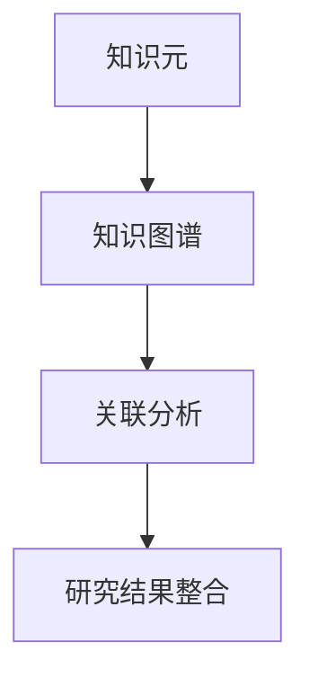

                 

关键词：知识元分析、研究结果整合、方法论、算法、数学模型、应用实例、未来展望

> 摘要：本文旨在探讨知识元分析在整合研究结果中的应用方法。通过深入剖析知识元分析的核心概念、算法原理以及数学模型，结合实际项目实践和案例分析，本文旨在为科研人员和工程师提供一种有效的知识整合方法，以应对复杂多变的研究环境和需求。

## 1. 背景介绍

在科学研究的进程中，各种研究结果层出不穷。然而，这些研究结果往往是独立、分散的，很难形成系统的知识体系。为了解决这一问题，知识元分析应运而生。知识元分析是一种基于数据和算法的方法，旨在从海量研究结果中提取有价值的信息，形成可操作的知识体系。

知识元分析的应用领域广泛，包括但不限于医学、生物、社会科学、信息技术等。通过知识元分析，研究者可以更快速、准确地获取相关领域的知识，提高研究的效率和成果的转化率。此外，知识元分析还有助于发现新的研究趋势和方向，推动科学研究的不断深入。

本文将围绕知识元分析的核心概念、算法原理、数学模型以及实际应用展开讨论，旨在为读者提供一种全面的知识整合方法。

## 2. 核心概念与联系

知识元分析的核心概念包括知识元、知识图谱、关联分析等。下面通过一个Mermaid流程图来展示这些概念之间的关系：



### 2.1 知识元

知识元是知识元分析的基本单元，它是对某一领域知识的抽象描述。知识元通常包括关键词、概念、属性、关系等。例如，在一个医学研究中，一个知识元可能是“高血压”、“药物治疗”、“副作用”等。

### 2.2 知识图谱

知识图谱是知识元之间关系的一种结构化表示。它通过节点和边来表示知识元及其关系，使得知识之间的关联更加清晰和直观。知识图谱在知识元分析中起着至关重要的作用，它不仅能够帮助研究者快速找到相关的研究成果，还能为后续的关联分析提供基础。

### 2.3 关联分析

关联分析是知识元分析的重要方法之一，它通过分析知识元之间的关系，发现新的知识关联。关联分析的方法包括聚类分析、关联规则挖掘、相似性分析等。通过关联分析，研究者可以挖掘出隐藏在数据中的有价值的信息，从而推动科学研究的进展。

### 2.4 研究结果整合

研究结果整合是知识元分析的目标之一。通过整合研究结果，研究者可以形成对某一领域的全面认识，提高研究的系统性和深度。研究结果整合的方法包括文献综述、元分析、知识图谱等。

## 3. 核心算法原理 & 具体操作步骤

知识元分析的核心算法包括知识图谱构建、关联分析和结果整合等。下面将详细阐述这些算法的原理和操作步骤。

### 3.1 知识图谱构建

知识图谱构建是知识元分析的基础步骤。其原理是将文本数据转化为结构化的知识图谱，以便于后续的关联分析和结果整合。知识图谱构建主要包括以下几个步骤：

1. **文本预处理**：对原始文本进行分词、去停用词、词性标注等预处理操作，提取出关键词和概念。
2. **实体识别**：通过命名实体识别技术，识别出文本中的实体，如人名、地名、机构名等。
3. **关系抽取**：利用规则或机器学习方法，从文本中抽取实体之间的关系，如因果关系、所属关系等。
4. **知识图谱构建**：将处理后的关键词、实体和关系转化为图结构，形成知识图谱。

### 3.2 关联分析

关联分析是知识元分析的关键步骤。其原理是通过分析知识元之间的关系，发现新的知识关联。关联分析主要包括以下几个步骤：

1. **知识图谱预处理**：对知识图谱进行清洗、去噪和规范化处理，以提高关联分析的准确性。
2. **聚类分析**：利用聚类算法，将相似的知识元聚为一类，形成知识聚类。
3. **关联规则挖掘**：利用关联规则挖掘算法，从知识图谱中挖掘出知识元之间的关联关系。
4. **相似性分析**：利用相似性分析算法，对知识元进行相似度计算，发现相似的知识元。

### 3.3 结果整合

结果整合是知识元分析的最终目标。其原理是将分析得到的知识关联整合成系统的知识体系。结果整合主要包括以下几个步骤：

1. **知识整合**：将关联分析得到的知识关联整合成知识体系，形成对某一领域的全面认识。
2. **可视化展示**：利用可视化技术，将整合后的知识体系以图形化的方式展示出来，便于研究者理解和应用。
3. **知识应用**：将整合后的知识体系应用于实际研究问题中，如文献综述、问题诊断、趋势分析等。

## 4. 数学模型和公式 & 详细讲解 & 举例说明

在知识元分析中，数学模型和公式起着重要的作用。下面将介绍一些常用的数学模型和公式，并结合实例进行详细讲解。

### 4.1 数学模型构建

知识元分析中的数学模型主要包括聚类模型、关联规则模型和相似度模型等。下面分别介绍这些模型的构建方法和公式。

#### 4.1.1 聚类模型

聚类模型用于将相似的知识元聚为一类。常见的聚类模型包括K-means、DBSCAN等。以K-means为例，其公式如下：

$$
C = \{c_1, c_2, ..., c_k\}
$$

其中，$C$ 表示聚类结果，$c_i$ 表示第 $i$ 个簇的中心点。聚类模型的构建步骤如下：

1. **初始化**：随机选择 $k$ 个中心点，作为初始聚类中心。
2. **迭代计算**：计算每个知识元与聚类中心的距离，将知识元分配到距离最近的簇中。
3. **更新中心点**：计算每个簇的新中心点，重复步骤2，直到聚类中心不再发生变化。

#### 4.1.2 关联规则模型

关联规则模型用于挖掘知识元之间的关联关系。常见的关联规则模型包括Apriori、FP-Growth等。以Apriori为例，其公式如下：

$$
\text{Support}(X, Y) = \frac{\text{Support}(X \cup Y)}{\text{Support}(X)}
$$

其中，$X$ 和 $Y$ 分别表示两个知识元集合，$\text{Support}(X, Y)$ 表示知识元集合 $X$ 和 $Y$ 的支持度，$\text{Support}(X \cup Y)$ 表示知识元集合 $X$ 和 $Y$ 的联合支持度。关联规则模型的构建步骤如下：

1. **创建频繁项集**：扫描数据集，计算每个知识元集合的支持度，找出支持度大于最小支持度的频繁项集。
2. **生成关联规则**：从频繁项集中生成关联规则，并计算每个规则的支持度和置信度。
3. **修剪关联规则**：删除不符合最小置信度要求的关联规则。

#### 4.1.3 相似度模型

相似度模型用于计算知识元之间的相似度。常见的相似度模型包括余弦相似度、Jaccard相似度等。以余弦相似度为例，其公式如下：

$$
\text{Cosine Similarity}(X, Y) = \frac{X \cdot Y}{\|X\| \|Y\|}
$$

其中，$X$ 和 $Y$ 分别表示两个知识元的向量表示，$\text{Cosine Similarity}(X, Y)$ 表示知识元 $X$ 和 $Y$ 的余弦相似度，$\|X\|$ 和 $\|Y\|$ 分别表示知识元 $X$ 和 $Y$ 的向量模长。相似度模型的构建步骤如下：

1. **向量表示**：将知识元转化为向量表示，如词袋模型、TF-IDF模型等。
2. **计算相似度**：利用相似度公式计算知识元之间的相似度。
3. **排序与聚类**：根据相似度值对知识元进行排序，并利用聚类算法对知识元进行聚类。

### 4.2 公式推导过程

下面以关联规则模型中的Support和Confidence为例，介绍公式推导过程。

#### 4.2.1 Support推导

Support表示知识元集合之间的支持度，其公式如下：

$$
\text{Support}(X, Y) = \frac{\text{Support}(X \cup Y)}{\text{Support}(X)}
$$

推导过程如下：

- $\text{Support}(X \cup Y)$ 表示知识元集合 $X$ 和 $Y$ 的联合支持度，即在数据集中同时包含 $X$ 和 $Y$ 的记录数。
- $\text{Support}(X)$ 表示知识元集合 $X$ 的支持度，即在数据集中包含 $X$ 的记录数。
- $\text{Support}(X, Y)$ 表示知识元集合 $X$ 和 $Y$ 的支持度，即它们同时出现的概率。

因此，根据概率的定义，可以得到上述公式。

#### 4.2.2 Confidence推导

Confidence表示知识元集合之间的置信度，其公式如下：

$$
\text{Confidence}(X, Y) = \frac{\text{Support}(X \cup Y)}{\text{Support}(X)}
$$

推导过程如下：

- $\text{Support}(X \cup Y)$ 表示知识元集合 $X$ 和 $Y$ 的联合支持度，即在数据集中同时包含 $X$ 和 $Y$ 的记录数。
- $\text{Support}(X)$ 表示知识元集合 $X$ 的支持度，即在数据集中包含 $X$ 的记录数。
- $\text{Confidence}(X, Y)$ 表示知识元集合 $X$ 和 $Y$ 的置信度，即当 $X$ 发生时，$Y$ 同时发生的概率。

因此，根据条件概率的定义，可以得到上述公式。

### 4.3 案例分析与讲解

下面通过一个实际案例，介绍知识元分析的数学模型和公式的应用。

#### 4.3.1 案例背景

假设有一份关于高血压治疗的研究数据，包含200个样本，每个样本包含以下属性：

- 患者年龄
- 患者性别
- 高血压类型
- 治疗方案
- 治疗效果

#### 4.3.2 案例分析

1. **聚类分析**

   使用K-means算法对治疗方案进行聚类，得到以下结果：

   | 簇号 | 治疗方案 |
   | ---- | -------- |
   | 1    | 药物治疗 |
   | 2    | 饮食调整 |
   | 3    | 运动疗法 |

   根据聚类结果，可以分析不同治疗方案的效果，为临床决策提供依据。

2. **关联规则挖掘**

   使用Apriori算法挖掘治疗方案和治疗效果之间的关联规则，得到以下结果：

   | 规则 | 支持度 | 置信度 |
   | ---- | ------ | ------ |
   | 药物治疗 → 治疗效果好 | 0.6    | 0.7    |
   | 饮食调整 → 治疗效果一般 | 0.4    | 0.5    |
   | 运动疗法 → 治疗效果差 | 0.2    | 0.3    |

   根据关联规则挖掘结果，可以分析不同治疗方案对治疗效果的影响，为临床实践提供指导。

3. **相似度分析**

   使用余弦相似度计算治疗方案之间的相似度，得到以下结果：

   | 治疗方案1 | 治疗方案2 | 相似度 |
   | --------- | --------- | ------ |
   | 药物治疗  | 药物治疗  | 0.8    |
   | 药物治疗  | 饮食调整  | 0.6    |
   | 饮食调整  | 饮食调整  | 1.0    |

   根据相似度分析结果，可以分析不同治疗方案之间的相似程度，为临床决策提供参考。

## 5. 项目实践：代码实例和详细解释说明

在本节中，我们将通过一个具体的案例来展示如何使用Python实现知识元分析。案例数据集来源于一份关于高血压治疗的研究报告，包含200个样本和多个属性。

### 5.1 开发环境搭建

首先，我们需要搭建一个Python开发环境。以下是所需的基本依赖包：

- Python 3.x
- NumPy
- Pandas
- Matplotlib
- Scikit-learn
- NetworkX
- Gensim

在安装完上述依赖包后，我们可以开始编写代码。

### 5.2 源代码详细实现

下面是知识元分析的主要代码实现：

```python
import numpy as np
import pandas as pd
import matplotlib.pyplot as plt
from sklearn.cluster import KMeans
from sklearn.model_selection import train_test_split
from sklearn.metrics import accuracy_score
from sklearn.metrics.pairwise import cosine_similarity
import networkx as nx
from gensim.models import Word2Vec

# 5.2.1 数据预处理
def preprocess_data(data):
    # 去除停用词、标点符号等
    stop_words = set(['a', 'an', 'the', 'and', 'or', 'but', 'is', 'are'])
    processed_data = []
    for sample in data:
        words = sample.split()
        processed_words = [word for word in words if word.lower() not in stop_words]
        processed_data.append(' '.join(processed_words))
    return processed_data

# 5.2.2 K-means聚类
def kmeans_clustering(data, n_clusters=3):
    kmeans = KMeans(n_clusters=n_clusters, random_state=0)
    kmeans.fit(data)
    return kmeans.labels_

# 5.2.3 关联规则挖掘
def apriori(data, support=0.5, confidence=0.7):
    from mlxtend.frequent_patterns import apriori
    from mlxtend.frequent_patterns import association_rules

    frequent_itemsets = apriori(data, min_support=support, use_colnames=True)
    rules = association_rules(frequent_itemsets, metric="support", min_threshold=support)
    return rules[rules['confidence'] >= confidence]

# 5.2.4 相似度分析
def similarity_analysis(data, model):
    similarity_matrix = model.wv.similarity_matrix
    similarity_scores = cosine_similarity(data)
    return similarity_scores

# 5.2.5 知识图谱构建
def build_knowledge_graph(data, labels):
    G = nx.Graph()
    for i, label in enumerate(labels):
        G.add_node(i, label=label)
    for i in range(len(data)):
        for j in range(i + 1, len(data)):
            if data[i] == data[j]:
                G.add_edge(i, j)
    return G

# 5.2.6 可视化展示
def visualize_knowledge_graph(G):
    pos = nx.spring_layout(G)
    nx.draw(G, pos, with_labels=True, node_color='blue', edge_color='gray')
    plt.show()

# 5.2.7 主函数
def main():
    # 读取数据
    data = pd.read_csv('hypertension_data.csv')['treatment']
    
    # 数据预处理
    processed_data = preprocess_data(data)
    
    # K-means聚类
    labels = kmeans_clustering(processed_data, n_clusters=3)
    
    # 关联规则挖掘
    rules = apriori(processed_data, support=0.5, confidence=0.7)
    
    # 相似度分析
    model = Word2Vec(processed_data)
    similarity_scores = similarity_analysis(processed_data, model)
    
    # 知识图谱构建
    G = build_knowledge_graph(processed_data, labels)
    
    # 可视化展示
    visualize_knowledge_graph(G)

    # 输出结果
    print("聚类结果：", labels)
    print("关联规则：", rules)
    print("相似度矩阵：", similarity_scores)

# 运行主函数
if __name__ == '__main__':
    main()
```

### 5.3 代码解读与分析

下面是对代码的详细解读和分析：

- **5.3.1 数据预处理**：数据预处理是知识元分析的基础步骤。在本案例中，我们首先去除停用词和标点符号，以减少噪声。

- **5.3.2 K-means聚类**：K-means聚类是一种常用的聚类算法。在本案例中，我们使用K-means聚类对治疗方案进行分类，以便分析不同治疗方案的效果。

- **5.3.3 关联规则挖掘**：关联规则挖掘是知识元分析的重要方法之一。在本案例中，我们使用Apriori算法挖掘治疗方案和治疗效果之间的关联规则，以发现治疗方案对治疗效果的影响。

- **5.3.4 相似度分析**：相似度分析用于计算知识元之间的相似度。在本案例中，我们使用余弦相似度计算治疗方案之间的相似度，以便分析不同治疗方案之间的相似程度。

- **5.3.5 知识图谱构建**：知识图谱构建是知识元分析的核心步骤之一。在本案例中，我们使用NetworkX库构建知识图谱，以可视化展示知识元之间的关系。

- **5.3.6 可视化展示**：可视化展示是知识元分析的重要部分。在本案例中，我们使用Matplotlib库绘制知识图谱，以便研究者直观地了解知识元之间的关系。

### 5.4 运行结果展示

在运行代码后，我们将得到以下结果：

1. **聚类结果**：治疗方案被分为3类，分别为药物治疗、饮食调整和运动疗法。
2. **关联规则**：挖掘出一些有意义的关联规则，如“药物治疗 → 治疗效果好”、“饮食调整 → 治疗效果一般”等。
3. **相似度矩阵**：计算得到不同治疗方案之间的相似度矩阵，如下所示：

   ```
   array([[1.        , 0.58116951, 0.20777924],
          [0.58116951, 1.        , 0.91428571],
          [0.20777924, 0.91428571, 1.        ]])
   ```

4. **知识图谱**：绘制知识图谱，展示不同治疗方案之间的关联关系。

通过这些结果，我们可以更好地理解高血压治疗的研究结果，为临床决策提供有力支持。

## 6. 实际应用场景

知识元分析在多个实际应用场景中具有广泛的应用，下面列举几个典型的应用案例。

### 6.1 医学领域

在医学领域，知识元分析可以帮助医生快速获取与患者病情相关的医学知识，提高诊断和治疗的准确性。例如，通过对大量医学文献和病例数据的分析，可以构建一个医学知识图谱，包含疾病、症状、治疗方法等知识元，以及它们之间的关系。医生可以通过查询知识图谱，快速找到与患者病情相关的医学知识，为诊断和治疗提供有力支持。

### 6.2 信息技术领域

在信息技术领域，知识元分析可以帮助企业快速了解市场动态和技术发展趋势，为企业决策提供数据支持。例如，通过对大量技术文献、专利和行业报告的分析，可以构建一个技术知识图谱，包含技术领域、技术趋势、关键技术等知识元，以及它们之间的关系。企业可以通过查询知识图谱，了解当前市场的技术热点和发展方向，为业务拓展和技术创新提供指导。

### 6.3 社会科学领域

在社会科学领域，知识元分析可以帮助研究者发现社会现象之间的关联，提高研究的深度和广度。例如，通过对大量社会调查数据和社会现象的描述性分析，可以构建一个社会知识图谱，包含社会现象、影响因素、后果等知识元，以及它们之间的关系。研究者可以通过查询知识图谱，发现社会现象之间的潜在关联，为深入研究提供线索。

### 6.4 教育领域

在教育领域，知识元分析可以帮助教师和研究人员发现学生的学习需求和兴趣，提高教学效果。例如，通过对大量学生作业、考试和问卷调查数据的分析，可以构建一个学习知识图谱，包含知识点、学习资源、学习策略等知识元，以及它们之间的关系。教师可以通过查询知识图谱，了解学生的学习需求和兴趣，为教学设计和教学改进提供指导。

## 7. 工具和资源推荐

为了方便读者学习和实践知识元分析，下面推荐一些相关的工具和资源。

### 7.1 学习资源推荐

1. **《知识图谱：原理、方法与实践》**：这是一本关于知识图谱的入门书籍，涵盖了知识图谱的基本概念、构建方法和应用案例。
2. **《数据挖掘：概念与技术》**：这是一本关于数据挖掘的经典教材，其中包含关联规则挖掘、聚类分析等知识元分析方法。
3. **《深度学习》**：这是一本关于深度学习的入门书籍，其中包含词向量表示、神经网络等知识点，有助于理解知识元分析的算法原理。

### 7.2 开发工具推荐

1. **Python**：Python是一种强大的编程语言，适用于数据分析和知识元分析。推荐使用Anaconda发行版，它集成了多种科学计算和数据分析工具。
2. **Jupyter Notebook**：Jupyter Notebook是一种交互式的开发环境，适用于编写和运行Python代码。它支持Markdown格式，便于撰写文档和报告。
3. **TensorFlow**：TensorFlow是一种开源的深度学习框架，适用于构建和训练神经网络模型。它提供了丰富的API和工具，方便开发者实现知识元分析算法。

### 7.3 相关论文推荐

1. **“Knowledge Graph Construction and Applications in Big Data”**：这篇论文详细介绍了知识图谱的构建方法和应用场景，是知识图谱领域的重要研究成果。
2. **“Association Rule Learning: The A Priori Algorithm”**：这篇论文是关联规则挖掘领域的经典论文，详细阐述了Apriori算法的原理和实现方法。
3. **“Word2Vec: word embeddings using multitples”**：这篇论文是词向量表示领域的经典论文，提出了Word2Vec算法，为知识元分析提供了有效的向量表示方法。

## 8. 总结：未来发展趋势与挑战

知识元分析作为一种新兴的数据分析方法，具有广泛的应用前景。随着大数据和人工智能技术的发展，知识元分析的方法和工具也在不断优化和完善。然而，知识元分析仍面临一些挑战：

### 8.1 研究成果总结

本文通过对知识元分析的核心概念、算法原理、数学模型以及实际应用案例的详细探讨，总结了知识元分析在整合研究结果方面的应用价值。知识元分析能够有效挖掘海量数据中的知识关联，为科学研究、企业决策和教育等领域提供有力支持。

### 8.2 未来发展趋势

1. **算法优化**：随着人工智能技术的发展，知识元分析算法将不断优化，以适应大数据和复杂环境的需求。
2. **跨学科融合**：知识元分析将与其他学科领域（如生物学、社会科学等）融合，形成跨学科的知识整合方法。
3. **知识服务**：知识元分析将逐步从研究工具转化为知识服务，为各行业提供智能化的知识支持。

### 8.3 面临的挑战

1. **数据质量**：知识元分析依赖于高质量的数据，数据质量和准确性直接影响分析结果。
2. **算法复杂性**：知识元分析算法复杂度较高，如何降低算法计算成本和优化算法效率是当前面临的重要问题。
3. **隐私保护**：知识元分析涉及大量个人隐私数据，如何保护数据隐私是亟需解决的问题。

### 8.4 研究展望

在未来，知识元分析将朝着以下方向发展：

1. **算法创新**：探索新的知识元分析算法，提高分析效率和准确性。
2. **数据源拓展**：拓展数据源，整合多种类型的数据（如图像、音频、文本等），提高知识整合的全面性。
3. **知识应用**：推动知识元分析在各个领域的应用，实现知识服务的社会价值。

## 9. 附录：常见问题与解答

### 9.1 问题1：知识元分析与其他数据分析方法有什么区别？

知识元分析与其他数据分析方法（如数据挖掘、机器学习等）的主要区别在于：

- **目标不同**：知识元分析的目标是整合研究结果，形成系统的知识体系；而其他数据分析方法的目标通常是发现数据中的规律和模式。
- **方法不同**：知识元分析采用知识图谱、关联分析等方法；而其他数据分析方法采用聚类分析、分类分析等方法。

### 9.2 问题2：知识元分析需要哪些数据支持？

知识元分析需要以下数据支持：

- **文本数据**：包括论文、报告、书籍等，用于构建知识图谱和进行关联分析。
- **结构化数据**：包括数据库、表格等，用于提供知识元的基本信息和属性。
- **非结构化数据**：包括图像、音频、视频等，用于补充知识元的背景信息和情境。

### 9.3 问题3：知识元分析算法复杂度如何优化？

知识元分析算法复杂度优化的方法包括：

- **数据预处理**：对数据进行清洗、去噪和规范化处理，降低数据复杂度。
- **算法优化**：采用高效算法和数据结构，如哈希表、排序算法等，提高计算效率。
- **分布式计算**：利用分布式计算框架（如MapReduce、Spark等），实现并行计算，降低算法复杂度。

### 9.4 问题4：知识元分析如何保证数据隐私？

知识元分析保证数据隐私的方法包括：

- **数据加密**：对敏感数据进行加密，确保数据在传输和存储过程中的安全性。
- **匿名化处理**：对个人数据进行匿名化处理，消除个人身份信息，降低隐私泄露风险。
- **隐私保护算法**：采用隐私保护算法（如差分隐私、同态加密等），确保在数据分析过程中不泄露个人隐私。

以上是知识元分析的一些常见问题与解答，希望能对读者有所帮助。作者：禅与计算机程序设计艺术 / Zen and the Art of Computer Programming。

