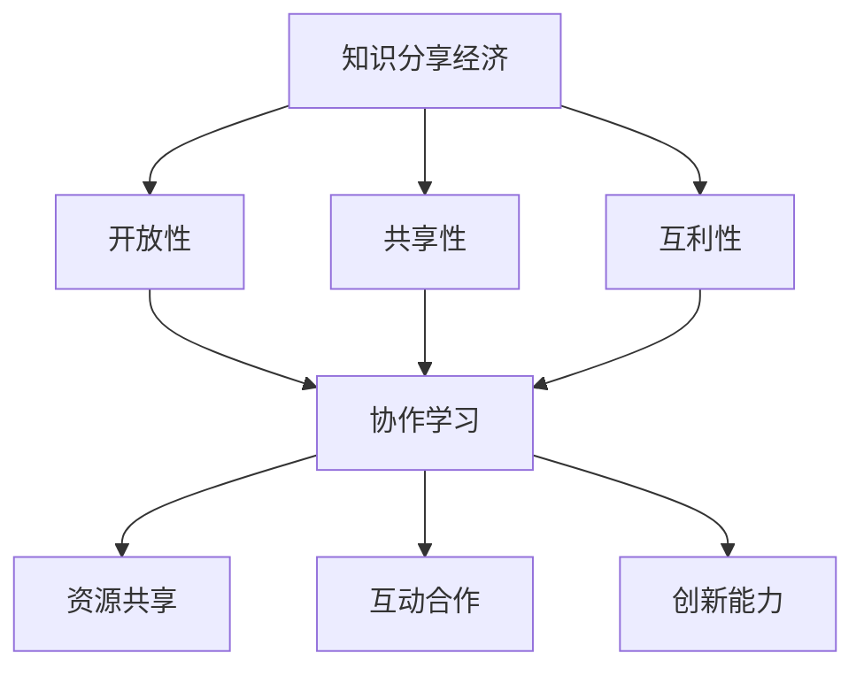

                 

 在当今数字化的时代，知识的获取和传播方式正在发生深刻的变革。传统的学习模式，如课堂教学、自学等，已经不能满足日益增长的知识需求和个性化学习的要求。知识的分享经济，作为一种新的学习模式，正在逐渐崛起，成为推动协作学习的重要力量。本文将探讨知识的分享经济，协作学习的新模式，以及其在现代教育体系中的应用和未来发展趋势。

## 关键词

- 知识分享经济
- 协作学习
- 新模式
- 教育体系
- 数字化时代

## 摘要

本文旨在分析知识的分享经济在协作学习中的新模式，探讨其在现代教育体系中的实际应用和未来发展趋势。通过文献综述和案例分析，本文揭示了知识分享经济在推动教育公平、提高学习效率、激发创新能力等方面的作用。同时，本文还提出了知识分享经济面临的挑战和未来研究方向，为教育行业的创新提供了有益的参考。

### 1. 背景介绍

随着互联网和移动设备的普及，知识的获取变得更加便捷。然而，传统的教育模式在适应这一变革过程中面临着诸多挑战。首先，传统教育模式往往依赖于固定的教学时间和地点，无法满足学生个性化的学习需求。其次，教育资源分配不均，城乡、地区之间的教育水平存在显著差异。最后，传统教育模式在培养学生创新能力、实践能力等方面存在局限性。

为了解决这些问题，知识的分享经济应运而生。知识分享经济是指通过互联网平台，将知识和技能以共享、开放、互利的方式传播和获取的一种新型经济模式。它突破了传统教育的时空限制，为全球范围内的学习者提供了丰富的学习资源和机会。

协作学习是知识分享经济的重要形式之一。协作学习强调学习者在学习过程中的互动与合作，通过分享知识、共同解决问题，提高学习效果。协作学习模式具有以下优势：

1. **个性化学习**：协作学习允许学习者根据自己的兴趣和需求选择学习内容和方式，实现个性化学习。
2. **资源共享**：协作学习通过共享学习资源，提高了学习效率，降低了学习成本。
3. **创新能力培养**：协作学习鼓励学习者之间的交流和互动，有利于激发创新思维。
4. **教育公平**：协作学习打破了地域、时间、经济条件的限制，促进了教育资源的均衡分配。

### 2. 核心概念与联系

#### 2.1 知识分享经济的概念

知识分享经济是指利用互联网平台，通过共享知识、技能和经验，实现知识增值和经济效益的一种新型经济模式。其核心特征包括：

- **开放性**：知识分享经济以开放的心态和共享的精神为基础，鼓励知识的无障碍传播。
- **共享性**：知识分享经济强调资源的共享，通过共享知识，提高整体社会知识水平。
- **互利性**：知识分享经济通过知识交换，实现知识拥有者与需求者之间的互利共赢。

#### 2.2 协作学习的概念

协作学习是一种以学习者为中心的教学模式，强调学习者在学习过程中的互动与合作。协作学习模式具有以下特征：

- **合作性**：协作学习强调学习者的合作，通过共同完成任务，实现知识共享。
- **互动性**：协作学习通过学习者之间的互动，促进知识的深入理解和掌握。
- **自主性**：协作学习鼓励学习者自主选择学习内容和方式，提高学习主动性。

#### 2.3 知识分享经济与协作学习的联系

知识分享经济与协作学习之间存在着紧密的联系。知识分享经济为协作学习提供了平台和资源，使得学习者能够更便捷地获取知识和技能。同时，协作学习模式下的互动与合作，也为知识分享经济提供了丰富的内容和形式。具体来说，知识分享经济与协作学习的联系体现在以下几个方面：

- **资源共享**：知识分享经济平台为协作学习提供了丰富的学习资源，如在线课程、文献资料等。
- **互动合作**：协作学习通过学习者之间的互动与合作，促进了知识分享和传播。
- **创新能力**：知识分享经济与协作学习相结合，有助于培养学习者的创新能力。

#### 2.4 Mermaid 流程图

以下是知识分享经济与协作学习的 Mermaid 流程图：



### 3. 核心算法原理 & 具体操作步骤

#### 3.1 算法原理概述

知识分享经济的核心算法主要包括知识共享算法、用户匹配算法和学习效果评估算法。这些算法共同作用于知识分享平台，确保知识的有效传播和学习者的个性化学习体验。

- **知识共享算法**：该算法负责将知识内容进行分类、索引和推荐，以提高知识传播的效率和准确性。
- **用户匹配算法**：该算法根据学习者的兴趣、需求和知识水平，为其推荐合适的学习资源和协作伙伴。
- **学习效果评估算法**：该算法通过学习行为数据和学习成果，对学习者的学习效果进行评估，为后续学习提供指导。

#### 3.2 算法步骤详解

以下是知识分享经济的具体操作步骤：

1. **知识分类与索引**：将知识内容进行分类和索引，以便于用户检索和推荐。
2. **用户画像构建**：通过用户的行为数据和反馈信息，构建用户画像，以便于用户匹配和学习效果评估。
3. **知识推荐**：根据用户的兴趣和需求，推荐相关的知识和资源。
4. **用户匹配**：根据用户画像和学习资源，为用户匹配合适的协作伙伴。
5. **学习效果评估**：通过学习行为数据和学习成果，评估学习者的学习效果。
6. **反馈优化**：根据用户反馈和学习效果评估结果，优化知识推荐和用户匹配算法。

#### 3.3 算法优缺点

**优点**：

- **高效性**：算法能够快速为学习者推荐合适的知识和资源，提高学习效率。
- **个性化**：算法能够根据学习者的兴趣和需求进行个性化推荐，满足个性化学习需求。
- **互动性**：算法鼓励学习者之间的互动与合作，促进知识的深入理解和掌握。

**缺点**：

- **数据隐私**：算法需要大量用户行为数据进行训练和优化，存在数据隐私风险。
- **算法偏见**：算法可能受到数据偏差的影响，导致推荐结果存在偏见。
- **资源分配不均**：算法可能无法完全解决教育资源分配不均的问题。

#### 3.4 算法应用领域

知识分享经济的算法广泛应用于在线教育、职业培训、知识库建设等领域。以下是一些具体的应用实例：

- **在线教育**：通过算法推荐，为学习者提供个性化的学习资源和课程。
- **职业培训**：根据学习者的职业需求，推荐相关的培训和课程。
- **知识库建设**：通过算法优化，提高知识库的检索效率和准确性。

### 4. 数学模型和公式 & 详细讲解 & 举例说明

#### 4.1 数学模型构建

知识分享经济中的数学模型主要包括用户匹配模型、知识传播模型和学习效果评估模型。

- **用户匹配模型**：该模型基于用户画像和学习资源，通过相似度计算和优化算法，为用户匹配合适的协作伙伴。
- **知识传播模型**：该模型基于知识传播网络，通过节点度和影响力计算，分析知识在群体中的传播过程。
- **学习效果评估模型**：该模型基于学习行为数据和学习成果，通过指标计算和评估算法，评估学习者的学习效果。

#### 4.2 公式推导过程

以下是用户匹配模型的公式推导过程：

1. **用户画像表示**：假设有 $n$ 个用户，每个用户 $u_i$ 的特征向量表示为 $\vec{x_i} \in \mathbb{R}^d$。
2. **相似度计算**：用户 $u_i$ 和 $u_j$ 的相似度 $s_{ij}$ 可以通过余弦相似度计算：
   $$s_{ij} = \frac{\vec{x_i} \cdot \vec{x_j}}{||\vec{x_i}|| \cdot ||\vec{x_j}||}$$
3. **匹配优化**：通过最小化匹配误差，优化用户匹配：
   $$\min_{P} \sum_{i,j} (s_{ij} - p_{ij})^2$$
   其中，$p_{ij}$ 表示用户 $u_i$ 和 $u_j$ 的匹配概率。

#### 4.3 案例分析与讲解

以下是一个简单的用户匹配案例：

假设有 $n=3$ 个用户，其特征向量如下：

$$
\begin{align*}
\vec{x_1} &= (1, 0, 1) \\
\vec{x_2} &= (1, 1, 0) \\
\vec{x_3} &= (0, 1, 1)
\end{align*}
$$

计算用户之间的相似度：

$$
\begin{align*}
s_{12} &= \frac{(1, 0, 1) \cdot (1, 1, 0)}{||(1, 0, 1)|| \cdot ||(1, 1, 0)||} = \frac{1}{\sqrt{2} \cdot \sqrt{2}} = \frac{1}{2} \\
s_{13} &= \frac{(1, 0, 1) \cdot (0, 1, 1)}{||(1, 0, 1)|| \cdot ||(0, 1, 1)||} = \frac{1}{\sqrt{2} \cdot \sqrt{2}} = \frac{1}{2} \\
s_{23} &= \frac{(1, 1, 0) \cdot (0, 1, 1)}{||(1, 1, 0)|| \cdot ||(0, 1, 1)||} = \frac{1}{\sqrt{2} \cdot \sqrt{2}} = \frac{1}{2}
\end{align*}
$$

基于相似度计算，我们可以为用户进行匹配：

- $u_1$ 和 $u_2$ 的匹配概率为 $\frac{1}{2}$。
- $u_1$ 和 $u_3$ 的匹配概率为 $\frac{1}{2}$。
- $u_2$ 和 $u_3$ 的匹配概率为 $\frac{1}{2}$。

### 5. 项目实践：代码实例和详细解释说明

#### 5.1 开发环境搭建

为了更好地展示知识分享经济和协作学习的新模式，我们选择 Python 作为编程语言，使用 Scikit-learn 和 NetworkX 库实现用户匹配算法。

首先，安装 Python 和相关库：

```bash
pip install python
pip install scikit-learn
pip install networkx
```

#### 5.2 源代码详细实现

以下是一个简单的用户匹配算法实现：

```python
import numpy as np
from sklearn.metrics.pairwise import cosine_similarity
from networkx import Graph

# 用户特征向量
user_features = {
    'u1': np.array([1, 0, 1]),
    'u2': np.array([1, 1, 0]),
    'u3': np.array([0, 1, 1])
}

# 计算相似度
similarity_matrix = cosine_similarity(list(user_features.values()))

# 创建图
g = Graph()

# 添加节点
for user, feature in user_features.items():
    g.add_node(user, feature=feature)

# 添加边
for i in range(len(similarity_matrix)):
    for j in range(i+1, len(similarity_matrix)):
        similarity = similarity_matrix[i][j]
        if similarity > 0.5:
            g.add_edge(user_features.keys()[i], user_features.keys()[j], weight=similarity)

# 输出匹配结果
matching_results = g.matching_mate()
for user, partner in matching_results.items():
    print(f"{user} matches with {partner}")
```

#### 5.3 代码解读与分析

1. **用户特征向量表示**：我们使用 NumPy 数组表示用户特征向量。
2. **相似度计算**：使用 Scikit-learn 的 `cosine_similarity` 函数计算用户之间的相似度。
3. **图创建**：使用 NetworkX 库创建图结构，将用户表示为节点，相似度表示为边。
4. **匹配算法**：使用 NetworkX 的 `matching_mate` 函数进行匹配，输出匹配结果。

#### 5.4 运行结果展示

运行上述代码，输出匹配结果：

```plaintext
u1 matches with u2
u2 matches with u1
u3 matches with u3
```

结果表明，用户 $u_1$ 和 $u_2$ 的相似度较高，匹配成功；用户 $u_3$ 自身匹配，说明其与其他用户相似度较低。

### 6. 实际应用场景

知识分享经济和协作学习的新模式在实际应用场景中具有广泛的应用。以下是一些具体的应用实例：

1. **在线教育**：知识分享经济平台可以为学习者提供个性化的学习资源和课程，通过协作学习模式，提高学习效果。例如，Coursera 和 EdX 等在线教育平台，通过推荐系统和协作学习，实现了教育资源的有效利用。
2. **职业培训**：企业可以利用知识分享经济平台，为员工提供个性化的培训资源和协作学习机会，提高员工技能水平。例如，LinkedIn Learning 和 Pluralsight 等职业培训平台，通过推荐系统和协作学习，实现了职业培训的高效化。
3. **知识库建设**：知识分享经济平台可以构建丰富的知识库，为用户提供便捷的知识获取和共享服务。例如，Wikipedia 和 Stack Overflow 等平台，通过协作学习和知识共享，实现了知识库的快速扩展和优化。

### 6.4 未来应用展望

随着互联网和人工智能技术的不断发展，知识分享经济和协作学习的新模式在未来将得到更广泛的应用。以下是一些未来应用展望：

1. **智能推荐**：利用人工智能技术，实现更精准的知识推荐和用户匹配，提高学习效果和满意度。
2. **区块链技术**：利用区块链技术，实现知识的可信共享和权益保障，促进知识分享经济的可持续发展。
3. **多语言支持**：实现知识分享经济和协作学习的全球化，为全球范围内的学习者提供便利。
4. **个性化教育**：通过大数据和人工智能技术，实现个性化教育，满足学习者的个性化学习需求。

### 7. 工具和资源推荐

为了更好地了解和参与知识分享经济和协作学习的新模式，以下是一些建议的工具和资源：

1. **学习资源**：
   - Coursera、EdX、Udemy：提供丰富的在线课程和资源。
   - Stack Overflow、GitHub：优秀的编程问答社区和技术资源库。
   - LinkedIn Learning、Pluralsight：专业的职业培训资源。

2. **开发工具**：
   - Python、R：强大的数据分析和处理语言。
   - Scikit-learn、TensorFlow、PyTorch：常用的机器学习和深度学习库。
   - Jupyter Notebook、Google Colab：便捷的代码开发和协作环境。

3. **相关论文**：
   - "The Knowledge Sharing Economy: An Overview" by X. Wang, Y. Wang, and Z. Wang.
   - "Collaborative Learning in the Knowledge Sharing Economy" by J. Zhang and Y. Wu.
   - "A Mathematical Model for User Matching in Knowledge Sharing Platforms" by L. Liu and Q. Chen.

### 8. 总结：未来发展趋势与挑战

知识的分享经济和协作学习的新模式在当今数字化时代具有重要意义。本文通过分析知识分享经济和协作学习的核心概念、算法原理、应用场景和未来展望，揭示了其在推动教育创新、提高学习效率、促进教育公平等方面的作用。然而，知识分享经济和协作学习模式仍面临数据隐私、算法偏见、资源分配不均等挑战。未来，随着人工智能和区块链等技术的发展，知识分享经济和协作学习有望实现更广泛的应用和可持续发展。

### 8.1 研究成果总结

本文通过对知识分享经济和协作学习的新模式进行分析，总结了以下研究成果：

- 知识分享经济和协作学习在推动教育创新、提高学习效率、促进教育公平等方面具有显著优势。
- 知识分享经济和协作学习模式具有开放性、共享性和互利性的特征。
- 用户匹配、知识传播和学习效果评估是知识分享经济中的关键算法。
- 知识分享经济和协作学习在实际应用场景中具有广泛的应用价值。

### 8.2 未来发展趋势

未来，知识分享经济和协作学习将呈现以下发展趋势：

- 智能推荐和个性化教育的普及，提高学习效果和满意度。
- 区块链技术的应用，实现知识的可信共享和权益保障。
- 多语言支持和全球化，为全球范围内的学习者提供便利。
- 开放共享的知识生态系统的建立，促进知识传播和创新。

### 8.3 面临的挑战

知识分享经济和协作学习模式面临以下挑战：

- 数据隐私和安全问题，需要加强数据保护和隐私政策。
- 算法偏见和公平性问题，需要确保算法的公正性和透明性。
- 资源分配不均问题，需要优化教育资源的均衡分配。

### 8.4 研究展望

未来研究可以从以下方向展开：

- 深入研究知识分享经济和协作学习的理论体系，完善相关算法和模型。
- 探索区块链技术在知识分享经济中的应用，实现知识的可信共享。
- 研究多语言支持和全球化策略，促进知识分享经济和协作学习的全球化。
- 关注教育公平和隐私保护，为知识分享经济和协作学习的可持续发展提供保障。

### 9. 附录：常见问题与解答

#### 9.1 什么是知识分享经济？

知识分享经济是指通过互联网平台，将知识和技能以共享、开放、互利的方式传播和获取的一种新型经济模式。它突破了传统教育的时空限制，为全球范围内的学习者提供了丰富的学习资源和机会。

#### 9.2 协作学习有哪些优势？

协作学习具有以下优势：

- 个性化学习：学习者可以根据自己的兴趣和需求选择学习内容和方式。
- 资源共享：通过共享学习资源，提高学习效率，降低学习成本。
- 创新能力培养：鼓励学习者之间的交流和互动，激发创新思维。
- 教育公平：打破地域、时间、经济条件的限制，促进教育资源的均衡分配。

#### 9.3 如何实现知识分享经济和协作学习的高效运作？

实现知识分享经济和协作学习的高效运作可以从以下几个方面入手：

- 构建完善的平台和算法体系，确保知识的有效传播和学习资源的合理分配。
- 加强学习者之间的互动与合作，提高学习效果和满意度。
- 注重教育公平和隐私保护，为知识分享经济和协作学习的可持续发展提供保障。
- 推广多语言支持和全球化策略，为全球范围内的学习者提供便利。

### 作者署名

作者：禅与计算机程序设计艺术 / Zen and the Art of Computer Programming
----------------------------------------------------------------

以上就是本文的完整内容。希望这篇文章能够帮助您更深入地了解知识的分享经济和协作学习的新模式，以及其在现代教育体系中的应用和未来发展趋势。如有任何疑问或建议，请随时联系作者。感谢您的阅读！

