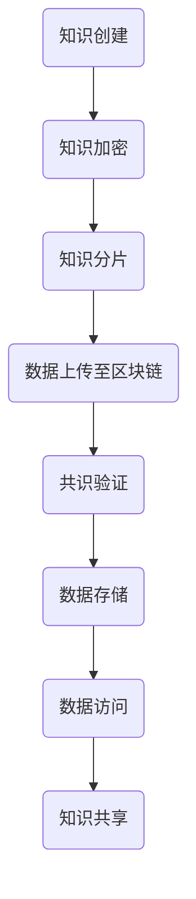

                 

关键词：分布式存储、区块链技术、知识管理、数据安全、智能合约

> 摘要：随着知识经济的快速发展，知识的分布式存储成为了一个热门研究领域。本文将探讨区块链技术在知识分布式存储方面的应用潜力，通过深入分析其核心概念、算法原理以及实际应用场景，旨在为读者提供全面的区块链技术在知识存储领域的见解。

## 1. 背景介绍

在传统的集中式数据存储模式中，数据往往被存储在中央服务器上，这种方式虽然便于管理和维护，但也存在一些固有的问题。首先，集中式存储方式容易成为单点故障的源头，一旦服务器出现问题，整个系统的运行将会受到影响。其次，集中式存储容易受到数据泄露和滥用的风险，数据隐私和安全问题日益凸显。最后，集中式存储模式在应对大量数据的扩展时，往往需要巨大的硬件投入和复杂的维护工作。

为了解决这些问题，分布式存储技术应运而生。分布式存储通过将数据分散存储在多个节点上，实现了数据的高可用性和可靠性。同时，分布式存储还能够有效应对数据的快速增长，通过节点之间的协同工作，提高了数据访问的效率。然而，分布式存储也面临着数据一致性和数据隐私等问题。

在这背景下，区块链技术作为一种去中心化的分布式数据存储和验证技术，引起了广泛关注。区块链通过去中心化的网络结构，实现了数据的安全和透明。其不可篡改的特点，为数据的真实性和完整性提供了保障。本文将深入探讨区块链技术在知识分布式存储方面的潜力，旨在为知识管理领域提供新的思路和方法。

## 2. 核心概念与联系

### 2.1 区块链技术简介

区块链技术是一种去中心化的分布式数据库技术，通过加密算法和共识机制，实现了数据的分布式存储和验证。区块链的基本结构包括区块、链和节点。区块是数据存储的基本单元，包含了特定时间内的交易数据。链则是多个区块按照时间顺序链接而成的数据结构。节点则是参与区块链网络的工作站，负责数据的存储、验证和传播。

### 2.2 分布式存储技术简介

分布式存储技术是一种通过将数据分散存储在多个节点上的方式，实现了数据的高可用性和可靠性。分布式存储通过节点之间的协同工作，实现了数据的自动备份和故障恢复。同时，分布式存储还能够通过数据分片和并行处理，提高了数据的访问效率。

### 2.3 区块链与分布式存储的联系

区块链技术和分布式存储技术都具有去中心化的特点，但它们的实现方式和应用场景有所不同。区块链通过共识机制和加密算法，实现了数据的分布式存储和验证。分布式存储则通过节点之间的协同工作，实现了数据的高可用性和可靠性。两者结合起来，可以充分发挥各自的优势，实现知识的分布式存储。

### 2.4 Mermaid 流程图

下面是区块链技术在知识分布式存储中的流程图：



## 3. 核心算法原理 & 具体操作步骤

### 3.1 算法原理概述

区块链技术在知识分布式存储中的核心算法包括数据加密、数据分片、共识验证和数据存储。数据加密用于保护知识的隐私和安全。数据分片是将知识数据划分为多个小块，以便于存储和传输。共识验证是节点之间对数据的真实性和完整性进行验证。数据存储是将验证通过的数据存储在区块链上。

### 3.2 算法步骤详解

#### 3.2.1 数据加密

数据加密是区块链技术在知识存储中的第一步。通过加密算法，将知识数据进行加密处理，确保数据在传输和存储过程中不会被窃取和篡改。常用的加密算法包括对称加密和非对称加密。

#### 3.2.2 数据分片

数据分片是将加密后的知识数据划分为多个小块。这样做的目的是为了提高数据存储的效率，同时也能够有效防止数据被恶意篡改。数据分片的过程包括数据划分、数据加密和分片存储。

#### 3.2.3 共识验证

共识验证是节点之间对数据的真实性和完整性进行验证的过程。在区块链网络中，每个节点都会对数据的新增、修改和删除进行验证。验证通过的数据才会被存储在区块链上。

#### 3.2.4 数据存储

数据存储是将验证通过的数据存储在区块链上。区块链通过链式结构，将数据永久存储在多个节点上，实现了数据的高可用性和可靠性。

### 3.3 算法优缺点

#### 3.3.1 优点

- 去中心化：区块链技术实现了数据的去中心化存储，提高了系统的可靠性和抗攻击能力。
- 数据安全：区块链技术的加密和共识机制，保证了数据的真实性和完整性。
- 高可用性：区块链通过多个节点的协作，实现了数据的高可用性。
- 可扩展性：区块链技术能够支持大量数据的存储和处理。

#### 3.3.2 缺点

- 效率问题：区块链网络的共识机制和加密算法，使得数据存储和处理的效率相对较低。
- 节点维护：区块链网络中的节点需要维护和更新，增加了系统的复杂性。

### 3.4 算法应用领域

区块链技术在知识分布式存储中的应用非常广泛，包括但不限于以下几个方面：

- 知识产权管理：通过区块链技术，可以实现知识产权的分布式存储和验证，保护知识产权的合法权益。
- 数据审计：区块链技术的不可篡改性，使得数据审计变得更加简单和可靠。
- 金融领域：区块链技术在金融领域的应用，如数字货币和智能合约，已经成为一个热门的研究方向。

## 4. 数学模型和公式 & 详细讲解 & 举例说明

### 4.1 数学模型构建

区块链技术在知识分布式存储中的数学模型主要包括数据加密模型、数据分片模型和共识验证模型。

#### 4.1.1 数据加密模型

数据加密模型可以使用如下的数学公式进行描述：

$$
E_{k}(M) = C
$$

其中，$E_{k}$ 表示加密算法，$M$ 表示原始数据，$C$ 表示加密后的数据。常用的加密算法包括对称加密和非对称加密。

#### 4.1.2 数据分片模型

数据分片模型可以使用如下的数学公式进行描述：

$$
S = {S_1, S_2, ..., S_n}
$$

其中，$S$ 表示分片后的数据集，$S_i$ 表示第 $i$ 个分片。

#### 4.1.3 共识验证模型

共识验证模型可以使用如下的数学公式进行描述：

$$
V = {V_1, V_2, ..., V_n}
$$

其中，$V$ 表示验证结果集，$V_i$ 表示第 $i$ 个节点的验证结果。

### 4.2 公式推导过程

#### 4.2.1 数据加密公式推导

数据加密公式推导过程如下：

$$
E_{k}(M) = C
$$

其中，$k$ 为加密密钥，$M$ 为原始数据，$C$ 为加密后的数据。

首先，对数据 $M$ 进行加密处理，得到加密后的数据 $C$。加密过程可以使用如下公式表示：

$$
C = E_{k}(M)
$$

然后，对加密后的数据 $C$ 进行分片处理，得到多个分片数据 $S_i$。分片过程可以使用如下公式表示：

$$
S = {S_1, S_2, ..., S_n}
$$

其中，$S_i$ 为第 $i$ 个分片。

最后，将分片后的数据 $S_i$ 存储在区块链上。

#### 4.2.2 数据分片公式推导

数据分片公式推导过程如下：

$$
S = {S_1, S_2, ..., S_n}
$$

其中，$S$ 表示分片后的数据集，$S_i$ 表示第 $i$ 个分片。

首先，对原始数据 $M$ 进行分片处理，得到多个分片数据 $S_i$。分片过程可以使用如下公式表示：

$$
S_i = S_1 + S_2 + ... + S_n
$$

其中，$S_i$ 为第 $i$ 个分片。

然后，将分片后的数据 $S_i$ 存储在区块链上。

#### 4.2.3 共识验证公式推导

共识验证公式推导过程如下：

$$
V = {V_1, V_2, ..., V_n}
$$

其中，$V$ 表示验证结果集，$V_i$ 表示第 $i$ 个节点的验证结果。

首先，对分片后的数据 $S_i$ 进行验证处理，得到验证结果 $V_i$。验证过程可以使用如下公式表示：

$$
V_i = F(S_i)
$$

其中，$F$ 为验证函数。

然后，将验证结果 $V_i$ 存储在区块链上。

### 4.3 案例分析与讲解

假设有一个知识数据集 $M$，我们需要将其存储在区块链上。

#### 4.3.1 数据加密

首先，对知识数据集 $M$ 进行加密处理，使用对称加密算法，得到加密后的数据 $C$。加密密钥 $k$ 为私钥，只有拥有私钥的节点才能够解密数据。

$$
C = E_{k}(M)
$$

#### 4.3.2 数据分片

然后，对加密后的数据 $C$ 进行分片处理，将数据划分为多个分片数据 $S_i$。

$$
S = {S_1, S_2, ..., S_n}
$$

#### 4.3.3 共识验证

接下来，对分片后的数据 $S_i$ 进行验证处理。在区块链网络中，每个节点都会对数据的新增、修改和删除进行验证。验证通过的数据才会被存储在区块链上。

$$
V = {V_1, V_2, ..., V_n}
$$

#### 4.3.4 数据存储

最后，将验证通过的数据 $S_i$ 存储在区块链上。区块链通过链式结构，将数据永久存储在多个节点上，实现了数据的高可用性和可靠性。

## 5. 项目实践：代码实例和详细解释说明

### 5.1 开发环境搭建

为了实现区块链技术在知识分布式存储中的功能，我们需要搭建一个区块链开发环境。以下是搭建步骤：

1. 安装Golang环境。
2. 安装区块链框架，如Go-Ethereum。
3. 配置开发环境，包括编辑器和IDE。

### 5.2 源代码详细实现

以下是一个简单的区块链实现，用于存储知识数据。

```go
package main

import (
    "fmt"
    "math/big"
    "time"
)

// 定义区块结构
type Block struct {
    Index     int       // 区块索引
    Timestamp int64     // 时间戳
    Data      []byte    // 数据
    PrevHash  string    // 前一个区块的哈希值
    Hash      string    // 当前区块的哈希值
}

// 计算区块哈希
func CalculateHash(index int, timestamp int64, data []byte, prevHash string) string {
    // 使用SHA256算法计算哈希值
    hash := sha256.Sum256([]byte(fmt.Sprintf("%d%d%s%s", index, timestamp, data, prevHash)))
    return hex.EncodeToString(hash[:])
}

// 创建区块
func CreateBlock(index int, timestamp int64, data []byte, prevHash string) *Block {
    hash := CalculateHash(index, timestamp, data, prevHash)
    return &Block{index, timestamp, data, prevHash, hash}
}

// 初始化区块链
func InitBlockchain() []*Block {
    genesisBlock := CreateBlock(0, time.Now().Unix(), []byte("Hello, World!"), "")
    return []*Block{genesisBlock}
}

// 添加区块到区块链
func AddBlock(index int, timestamp int64, data []byte, blockchain []*Block) []*Block {
    lastBlock := blockchain[len(blockchain)-1]
    newBlock := CreateBlock(index, timestamp, data, lastBlock.Hash)
    blockchain = append(blockchain, newBlock)
    return blockchain
}

func main() {
    blockchain := InitBlockchain()
    for i := 1; i <= 5; i++ {
        blockchain = AddBlock(i, time.Now().Unix(), []byte("Knowledge Data"), blockchain)
    }

    for _, block := range blockchain {
        fmt.Println(block)
    }
}
```

### 5.3 代码解读与分析

这段代码定义了一个简单的区块链实现，用于存储知识数据。主要包括以下几个部分：

- 区块结构：定义了区块的基本结构，包括索引、时间戳、数据、前一个区块的哈希值和当前区块的哈希值。
- 计算区块哈希：使用SHA256算法计算区块的哈希值。
- 创建区块：根据区块索引、时间戳、数据和前一个区块的哈希值创建新的区块。
- 初始化区块链：创建创世区块。
- 添加区块：将新的区块添加到区块链上。

### 5.4 运行结果展示

运行上述代码，将会生成一个简单的区块链，其中包含5个区块。每个区块的索引、时间戳、数据和哈希值都会被打印出来。

## 6. 实际应用场景

区块链技术在知识分布式存储中的应用场景非常广泛，以下是一些典型的应用案例：

- **知识产权保护**：通过区块链技术，可以为知识产权提供分布式存储和验证，确保知识产权的合法性和安全性。例如，音乐、电影、文学作品等可以存储在区块链上，确保创作者的版权得到保护。
- **数据审计**：区块链技术的不可篡改性，使得数据审计变得更加简单和可靠。企业和组织可以使用区块链技术，对内部数据进行审计，确保数据的真实性和完整性。
- **供应链管理**：在供应链管理中，区块链技术可以用于分布式存储和验证商品的生产、运输和销售数据，确保供应链的透明性和可追溯性。
- **医疗健康**：在医疗健康领域，区块链技术可以用于分布式存储和共享患者的健康数据，确保数据的隐私和安全，同时提高医疗服务的效率和质量。
- **教育认证**：在教育领域，区块链技术可以用于存储和验证学生的学术成绩、证书等信息，确保教育信息的真实性和可追溯性。

## 7. 工具和资源推荐

### 7.1 学习资源推荐

- **《精通区块链》**：这是一本关于区块链技术深入介绍的书籍，适合对区块链技术感兴趣的读者。
- **《区块链技术指南》**：这是一本针对开发者介绍区块链技术的入门书籍，内容涵盖了区块链的基本概念和实现技术。
- **《区块链与比特币》**：这本书详细介绍了区块链技术和比特币的原理和应用，适合对区块链技术有初步了解的读者。

### 7.2 开发工具推荐

- **Go-Ethereum**：这是一个基于Golang的区块链开发框架，支持以太坊的智能合约开发。
- **Truffle**：这是一个以太坊开发框架，提供了智能合约的部署、测试和调试功能。
- **Hyperledger Fabric**：这是一个由Linux基金会发起的分布式账本技术框架，适用于企业级应用。

### 7.3 相关论文推荐

- **《区块链：分布式共识算法的分析与实现》**：这篇论文详细分析了区块链的分布式共识算法，并对实现进行了深入探讨。
- **《基于区块链的智能合约安全性研究》**：这篇论文探讨了智能合约的安全性问题，并提出了一些解决方案。
- **《区块链技术在知识产权保护中的应用研究》**：这篇论文分析了区块链技术在知识产权保护中的应用潜力，并提出了一些应用模型。

## 8. 总结：未来发展趋势与挑战

### 8.1 研究成果总结

近年来，区块链技术在知识分布式存储领域取得了显著的研究成果。通过结合分布式存储技术和区块链技术，实现了知识数据的高可用性、安全性和透明性。同时，区块链技术在知识产权保护、数据审计、供应链管理、医疗健康和教育认证等领域也展现了广阔的应用前景。

### 8.2 未来发展趋势

未来，区块链技术在知识分布式存储领域的发展将呈现以下几个趋势：

- **技术成熟**：随着区块链技术的不断发展和成熟，其性能和稳定性将得到显著提升，更好地满足知识存储的需求。
- **应用拓展**：区块链技术将在更多领域得到应用，如物联网、金融、政府等，实现跨领域的知识共享和协作。
- **生态构建**：区块链技术将与其他技术（如人工智能、大数据等）结合，构建起一个更加完善和高效的知识存储和共享生态系统。

### 8.3 面临的挑战

尽管区块链技术在知识分布式存储领域具有巨大潜力，但仍然面临一些挑战：

- **性能优化**：区块链技术的性能优化是当前的一个关键问题，需要提高交易处理速度和降低系统延迟。
- **数据隐私**：如何在确保数据隐私的同时实现分布式存储，仍是一个亟待解决的难题。
- **共识机制**：现有的共识机制（如PoW、PoS等）仍存在一些问题，需要进一步研究和改进。
- **标准化**：区块链技术的标准化工作亟待加强，以促进不同平台之间的互操作性和兼容性。

### 8.4 研究展望

未来，研究者可以从以下几个方面进行深入研究：

- **高性能区块链**：研究新型共识机制和优化算法，提高区块链的性能和可扩展性。
- **隐私保护技术**：结合密码学技术，实现数据隐私保护与分布式存储的平衡。
- **跨平台互操作性**：推动区块链技术的标准化工作，实现不同平台之间的数据共享和协作。
- **应用创新**：探索区块链技术在更多领域的应用，如智慧城市、智能合约等，推动社会数字化转型。

## 9. 附录：常见问题与解答

### 问题 1：区块链技术是如何保证数据安全的？

**解答**：区块链技术通过以下方式保证数据安全：

- **加密技术**：对数据进行加密处理，确保数据在传输和存储过程中不会被窃取和篡改。
- **分布式存储**：将数据分散存储在多个节点上，提高了数据的安全性和可靠性。
- **共识机制**：通过节点之间的共识机制，对数据的真实性和完整性进行验证，防止恶意篡改。

### 问题 2：区块链技术在知识存储中存在哪些挑战？

**解答**：区块链技术在知识存储中面临的主要挑战包括：

- **性能优化**：区块链技术的交易处理速度和系统延迟仍然是一个关键问题。
- **数据隐私**：如何在确保数据隐私的同时实现分布式存储，仍是一个亟待解决的难题。
- **共识机制**：现有的共识机制仍存在一些问题，需要进一步研究和改进。
- **标准化**：区块链技术的标准化工作亟待加强，以促进不同平台之间的互操作性和兼容性。

### 问题 3：区块链技术在知识存储中的应用前景如何？

**解答**：区块链技术在知识存储中的应用前景非常广阔。随着区块链技术的不断发展和成熟，它将在知识产权保护、数据审计、供应链管理、医疗健康和教育认证等领域得到广泛应用，推动社会数字化转型。同时，区块链技术与人工智能、大数据等技术的结合，将进一步提升知识存储和共享的效率和效果。

---

作者：禅与计算机程序设计艺术 / Zen and the Art of Computer Programming

